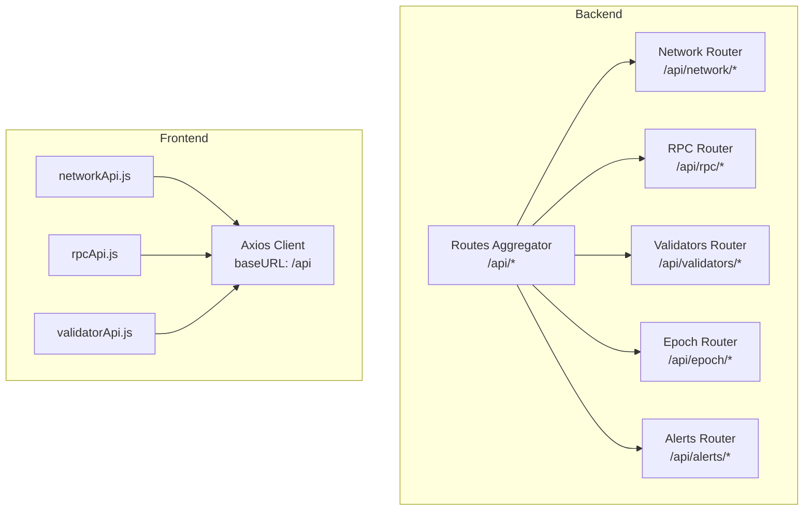
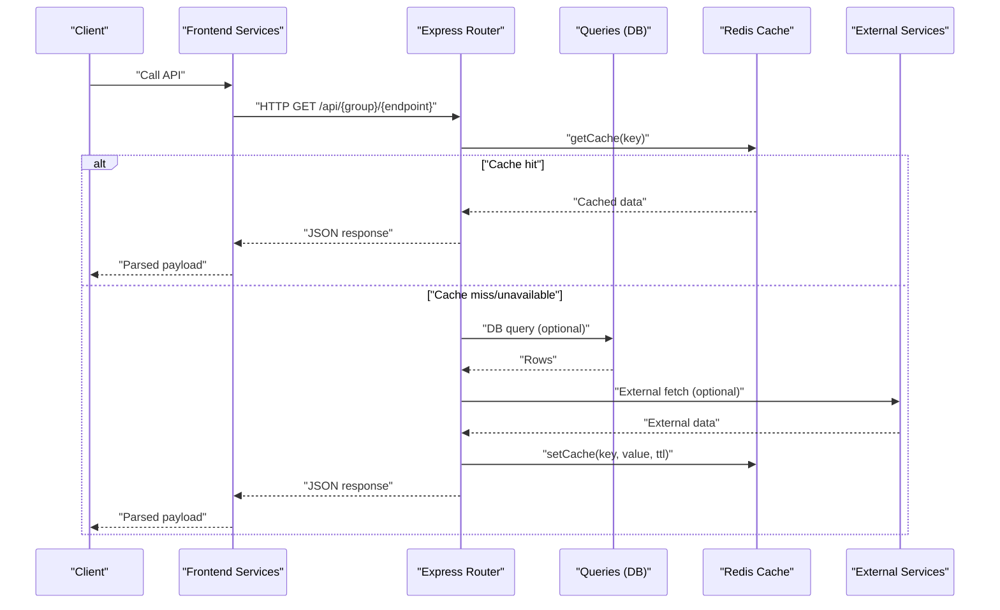
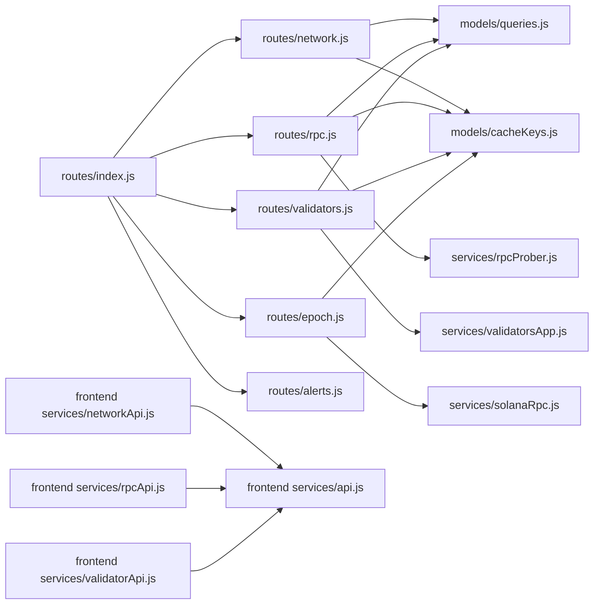

# API Reference

<cite>
**Referenced Files in This Document**
- [backend/src/routes/index.js](file://backend/src/routes/index.js)
- [backend/src/routes/network.js](file://backend/src/routes/network.js)
- [backend/src/routes/rpc.js](file://backend/src/routes/rpc.js)
- [backend/src/routes/validators.js](file://backend/src/routes/validators.js)
- [backend/src/routes/epoch.js](file://backend/src/routes/epoch.js)
- [backend/src/routes/alerts.js](file://backend/src/routes/alerts.js)
- [backend/src/models/queries.js](file://backend/src/models/queries.js)
- [backend/src/models/cacheKeys.js](file://backend/src/models/cacheKeys.js)
- [backend/src/services/rpcProber.js](file://backend/src/services/rpcProber.js)
- [backend/src/services/validatorsApp.js](file://backend/src/services/validatorsApp.js)
- [backend/src/services/solanaRpc.js](file://backend/src/services/solanaRpc.js)
- [frontend/src/services/api.js](file://frontend/src/services/api.js)
- [frontend/src/services/networkApi.js](file://frontend/src/services/networkApi.js)
- [frontend/src/services/rpcApi.js](file://frontend/src/services/rpcApi.js)
- [frontend/src/services/validatorApi.js](file://frontend/src/services/validatorApi.js)
</cite>

## Table of Contents
1. [Introduction](#introduction)
2. [Project Structure](#project-structure)
3. [Core Components](#core-components)
4. [Architecture Overview](#architecture-overview)
5. [Detailed Component Analysis](#detailed-component-analysis)
6. [Dependency Analysis](#dependency-analysis)
7. [Performance Considerations](#performance-considerations)
8. [Troubleshooting Guide](#troubleshooting-guide)
9. [Conclusion](#conclusion)
10. [Appendices](#appendices)

## Introduction
This document provides a comprehensive API reference for InfraWatch’s REST endpoints. It covers all HTTP methods, URL patterns, request and response schemas, authentication requirements, rate limiting, pagination, filtering, and data validation rules. It also includes client integration guidelines and example requests/responses for:
- Network API: health metrics and historical charts
- RPC API: provider monitoring and recommendations
- Validators API: top validators and detailed validator records
- Epoch API: timing and progress information
- Alerts API: recent notifications

## Project Structure
The backend exposes a single base route prefix /api that mounts sub-routers for each domain area. The frontend consumes these endpoints via a shared Axios client configured with a /api base URL.

**Diagram sources**
- [backend/src/routes/index.js:1-24](file://backend/src/routes/index.js#L1-L24)
- [frontend/src/services/api.js:1-43](file://frontend/src/services/api.js#L1-L43)

**Section sources**
- [backend/src/routes/index.js:1-24](file://backend/src/routes/index.js#L1-L24)
- [frontend/src/services/api.js:1-43](file://frontend/src/services/api.js#L1-L43)

## Core Components
- Network API: current snapshot and historical series
- RPC API: provider health, rolling stats, recommendations, and per-provider history
- Validators API: top validators with pagination and individual validator details
- Epoch API: current epoch metadata and ETA
- Alerts API: recent alerts with optional severity filter

**Section sources**
- [backend/src/routes/network.js:1-135](file://backend/src/routes/network.js#L1-L135)
- [backend/src/routes/rpc.js:1-135](file://backend/src/routes/rpc.js#L1-L135)
- [backend/src/routes/validators.js:1-112](file://backend/src/routes/validators.js#L1-L112)
- [backend/src/routes/epoch.js:1-62](file://backend/src/routes/epoch.js#L1-L62)
- [backend/src/routes/alerts.js:1-46](file://backend/src/routes/alerts.js#L1-L46)

## Architecture Overview
The API follows a cache-first pattern where applicable, falling back to database or external services when caches are unavailable. Providers and validators data incorporate rolling statistics and recommendations.

**Diagram sources**
- [backend/src/routes/network.js:17-79](file://backend/src/routes/network.js#L17-L79)
- [backend/src/routes/rpc.js:17-88](file://backend/src/routes/rpc.js#L17-L88)
- [backend/src/routes/validators.js:52-109](file://backend/src/routes/validators.js#L52-L109)
- [backend/src/routes/epoch.js:16-59](file://backend/src/routes/epoch.js#L16-L59)
- [backend/src/models/cacheKeys.js:6-49](file://backend/src/models/cacheKeys.js#L6-L49)
- [backend/src/models/queries.js:54-84](file://backend/src/models/queries.js#L54-L84)

## Detailed Component Analysis

### Network API
- Base path: /api/network
- Endpoints:
  - GET /current
    - Purpose: Returns current network status snapshot.
    - Cache key: network:current (TTL: 60s)
    - Response fields:
      - status: string (health status)
      - tps: number
      - slotHeight: number
      - slotLatencyMs: number
      - epoch: number
      - epochProgress: number (0–100)
      - delinquentCount: number
      - activeValidators: number
      - confirmationTimeMs: number
      - congestionScore: number (0–100)
      - timestamp: ISO date string
    - Errors:
      - 503: Service unavailable or startup phase
      - 503: No network data available
  - GET /history?range=1h|24h|7d
    - Purpose: Historical series for charting.
    - Cache key: network:history:{range} (TTL: 300s)
    - Validation: range must be one of 1h, 24h, 7d
    - Response: array of snapshots with same fields as /current

**Section sources**
- [backend/src/routes/network.js:17-79](file://backend/src/routes/network.js#L17-L79)
- [backend/src/routes/network.js:85-132](file://backend/src/routes/network.js#L85-L132)
- [backend/src/models/cacheKeys.js:8](file://backend/src/models/cacheKeys.js#L8)
- [backend/src/models/cacheKeys.js:40](file://backend/src/models/cacheKeys.js#L40)

### RPC API
- Base path: /api/rpc
- Endpoints:
  - GET /status
    - Purpose: Current provider statuses, rolling stats, recommendation.
    - Cache key: rpc:latest (TTL: 60s)
    - Response fields:
      - providers: array of objects with:
        - providerName: string
        - endpoint: string
        - latencyMs: number
        - isHealthy: boolean
        - slotHeight: number
        - error: string|null
        - timestamp: ISO date string
        - stats: object with p50, p95, p99, uptimePercent, totalChecks, healthyChecks, lastIncident
        - category: string (e.g., public, premium)
        - requiresKey: boolean
        - note: string|null
      - recommendation: object|null with name, latencyMs, uptimePercent
      - timestamp: ISO date string
    - Notes:
      - Rolling stats derived from internal probe history.
      - Best provider recommendation computed from stats.
  - GET /:provider/history?range=1h|24h|7d
    - Purpose: Per-provider health history.
    - Path param: provider (string)
    - Validation: range must be one of 1h, 24h, 7d
    - Response: array of health checks with fields providerName, endpoint, latencyMs, isHealthy, slotHeight, error, timestamp

**Section sources**
- [backend/src/routes/rpc.js:17-88](file://backend/src/routes/rpc.js#L17-L88)
- [backend/src/routes/rpc.js:94-132](file://backend/src/routes/rpc.js#L94-L132)
- [backend/src/services/rpcProber.js:10-63](file://backend/src/services/rpcProber.js#L10-L63)
- [backend/src/services/rpcProber.js:256-272](file://backend/src/services/rpcProber.js#L256-L272)
- [backend/src/services/rpcProber.js:295-307](file://backend/src/services/rpcProber.js#L295-L307)
- [backend/src/models/cacheKeys.js:9](file://backend/src/models/cacheKeys.js#L9)

### Validators API
- Base path: /api/validators
- Endpoints:
  - GET /top?limit=1..100
    - Purpose: Top validators by score.
    - Pagination: limit clamped to 1..100
    - Cache key: validators:top100 (TTL: 300s)
    - Response: array of validator objects
  - GET /:votePubkey
    - Purpose: Single validator detail.
    - Path param: votePubkey (required)
    - Cache key: validator:{votePubkey} (TTL: 300s)
    - Fallbacks:
      - Fetch from Validators.app (rate-limited)
      - Fallback to DB if external fetch fails
    - Response: validator object
    - Errors:
      - 400: Missing votePubkey parameter
      - 404: Validator not found

**Section sources**
- [backend/src/routes/validators.js:17-46](file://backend/src/routes/validators.js#L17-L46)
- [backend/src/routes/validators.js:52-109](file://backend/src/routes/validators.js#L52-L109)
- [backend/src/models/cacheKeys.js:11](file://backend/src/models/cacheKeys.js#L11)
- [backend/src/models/cacheKeys.js:25](file://backend/src/models/cacheKeys.js#L25)
- [backend/src/services/validatorsApp.js:102-149](file://backend/src/services/validatorsApp.js#L102-L149)

### Epoch API
- Base path: /api/epoch
- Endpoints:
  - GET /current
    - Purpose: Current epoch information and ETA.
    - Cache key: epoch:info (TTL: 120s)
    - Response fields:
      - epoch: number
      - slotIndex: number
      - slotsInEpoch: number
      - progress: number (0–100)
      - slotsRemaining: number
      - etaMs: number
      - timestamp: ISO date string
    - Fallback: Solana RPC via @solana/web3.js

**Section sources**
- [backend/src/routes/epoch.js:16-59](file://backend/src/routes/epoch.js#L16-L59)
- [backend/src/models/cacheKeys.js:10](file://backend/src/models/cacheKeys.js#L10)
- [backend/src/services/solanaRpc.js:124-156](file://backend/src/services/solanaRpc.js#L124-L156)

### Alerts API
- Base path: /api/alerts
- Endpoints:
  - GET /?limit=1..100
    - Purpose: Recent alerts.
    - Pagination: limit clamped to 1..100
    - Response: array of alert objects with fields id, type, severity, entity, message, details, createdAt, resolvedAt

**Section sources**
- [backend/src/routes/alerts.js:14-43](file://backend/src/routes/alerts.js#L14-L43)

## Dependency Analysis
- Route aggregation mounts sub-routers under /api.
- Routes depend on:
  - Queries (database access)
  - Redis cache keys and TTLs
  - External services (RPC probing, Validators.app, Solana RPC)
- Frontend integrates via a shared Axios client with baseURL /api.

**Diagram sources**
- [backend/src/routes/index.js:10-21](file://backend/src/routes/index.js#L10-L21)
- [backend/src/routes/network.js:8-10](file://backend/src/routes/network.js#L8-L10)
- [backend/src/routes/rpc.js:8-11](file://backend/src/routes/rpc.js#L8-L11)
- [backend/src/routes/validators.js:8-11](file://backend/src/routes/validators.js#L8-L11)
- [backend/src/routes/epoch.js:8-10](file://backend/src/routes/epoch.js#L8-L10)
- [backend/src/routes/alerts.js:8](file://backend/src/routes/alerts.js#L8)
- [backend/src/models/cacheKeys.js:6-49](file://backend/src/models/cacheKeys.js#L6-L49)
- [backend/src/models/queries.js:432-458](file://backend/src/models/queries.js#L432-L458)
- [backend/src/services/rpcProber.js:330-341](file://backend/src/services/rpcProber.js#L330-L341)
- [backend/src/services/validatorsApp.js:373-387](file://backend/src/services/validatorsApp.js#L373-L387)
- [backend/src/services/solanaRpc.js:330-339](file://backend/src/services/solanaRpc.js#L330-L339)
- [frontend/src/services/networkApi.js:1-6](file://frontend/src/services/networkApi.js#L1-L6)
- [frontend/src/services/rpcApi.js:1-7](file://frontend/src/services/rpcApi.js#L1-L7)
- [frontend/src/services/validatorApi.js:1-8](file://frontend/src/services/validatorApi.js#L1-L8)
- [frontend/src/services/api.js:1-43](file://frontend/src/services/api.js#L1-L43)

**Section sources**
- [backend/src/routes/index.js:10-21](file://backend/src/routes/index.js#L10-L21)
- [frontend/src/services/api.js:3-9](file://frontend/src/services/api.js#L3-L9)

## Performance Considerations
- Caching:
  - Network current and history use short TTLs (60s–300s) to balance freshness and load.
  - RPC latest and validators top/detail use similar TTLs.
  - Epoch info uses a moderate TTL (120s).
- Cache-first with DB fallback ensures resilience during outages.
- RPC provider monitoring computes rolling percentiles and uptime from in-memory histories.
- Validators.app client enforces a rate limit of 40 requests per 5 minutes with a queue and backoff.

[No sources needed since this section provides general guidance]

## Troubleshooting Guide
- 400 Bad Request:
  - Network history and RPC provider history accept only specific range values. Ensure range is one of 1h, 24h, 7d.
  - Validators detail requires a votePubkey path parameter.
- 404 Not Found:
  - Validators detail returns 404 when no validator is found by votePubkey.
- 503 Service Unavailable:
  - Network current returns 503 when data collection is starting or unavailable.
- Frontend error handling:
  - Axios interceptors log errors and surface server response data for inspection.

**Section sources**
- [backend/src/routes/network.js:90-96](file://backend/src/routes/network.js#L90-L96)
- [backend/src/routes/rpc.js:100-106](file://backend/src/routes/rpc.js#L100-L106)
- [backend/src/routes/validators.js:56-60](file://backend/src/routes/validators.js#L56-L60)
- [backend/src/routes/validators.js:91-96](file://backend/src/routes/validators.js#L91-L96)
- [backend/src/routes/network.js:49-61](file://backend/src/routes/network.js#L49-L61)
- [frontend/src/services/api.js:23-40](file://frontend/src/services/api.js#L23-L40)

## Conclusion
InfraWatch’s API provides real-time network metrics, RPC provider health, validator insights, epoch timing, and alert notifications with robust caching and graceful fallbacks. Clients should adhere to documented parameters, handle error codes, and leverage the provided frontend service wrappers for consistent behavior.

[No sources needed since this section summarizes without analyzing specific files]

## Appendices

### Authentication
- No authentication is required for any endpoints reviewed in this document.

**Section sources**
- [backend/src/routes/network.js:17-79](file://backend/src/routes/network.js#L17-L79)
- [backend/src/routes/rpc.js:17-88](file://backend/src/routes/rpc.js#L17-L88)
- [backend/src/routes/validators.js:17-109](file://backend/src/routes/validators.js#L17-L109)
- [backend/src/routes/epoch.js:16-59](file://backend/src/routes/epoch.js#L16-L59)
- [backend/src/routes/alerts.js:14-43](file://backend/src/routes/alerts.js#L14-L43)

### Rate Limiting
- Validators.app client:
  - 40 requests per 5 minutes with queued acquisition and backoff logging.
  - Remaining requests and queue length exposed via a status endpoint.
- RPC provider probing:
  - Concurrent probes across providers with per-request timeouts.
- Internal cache TTLs:
  - Short TTLs for frequently changing data (e.g., 60s–120s).

**Section sources**
- [backend/src/services/validatorsApp.js:10-99](file://backend/src/services/validatorsApp.js#L10-L99)
- [backend/src/services/validatorsApp.js:364-371](file://backend/src/services/validatorsApp.js#L364-L371)
- [backend/src/models/cacheKeys.js:43-48](file://backend/src/models/cacheKeys.js#L43-L48)

### Pagination and Filtering
- Network history: range parameter only.
- RPC provider history: range parameter only.
- Validators top: limit parameter clamped to 1..100.
- Validators detail: no pagination; single record lookup by votePubkey.
- Alerts: limit parameter clamped to 1..100.

**Section sources**
- [backend/src/routes/network.js:87-96](file://backend/src/routes/network.js#L87-L96)
- [backend/src/routes/rpc.js:97-106](file://backend/src/routes/rpc.js#L97-L106)
- [backend/src/routes/validators.js:19-20](file://backend/src/routes/validators.js#L19-L20)
- [backend/src/routes/alerts.js:16-17](file://backend/src/routes/alerts.js#L16-L17)

### Data Validation Rules
- Range validation enforced for history endpoints.
- Parameter presence validated for required path/query parameters.
- Limits clamped to safe ranges to prevent excessive loads.

**Section sources**
- [backend/src/routes/network.js:90-96](file://backend/src/routes/network.js#L90-L96)
- [backend/src/routes/rpc.js:100-106](file://backend/src/routes/rpc.js#L100-L106)
- [backend/src/routes/validators.js:19-20](file://backend/src/routes/validators.js#L19-L20)
- [backend/src/routes/validators.js:56-60](file://backend/src/routes/validators.js#L56-L60)
- [backend/src/routes/alerts.js:16-17](file://backend/src/routes/alerts.js#L16-L17)

### Example Requests and Responses
- Network current
  - Request: GET /api/network/current
  - Response: JSON object with status, tps, slotHeight, slotLatencyMs, epoch, epochProgress, delinquentCount, activeValidators, confirmationTimeMs, congestionScore, timestamp
- Network history
  - Request: GET /api/network/history?range=24h
  - Response: JSON array of snapshots
- RPC status
  - Request: GET /api/rpc/status
  - Response: JSON object with providers array, recommendation object|null, timestamp
- RPC provider history
  - Request: GET /api/rpc/Helius/history?range=1h
  - Response: JSON array of health checks
- Validators top
  - Request: GET /api/validators/top?limit=50
  - Response: JSON array of validators
- Validators detail
  - Request: GET /api/validators/{votePubkey}
  - Response: JSON validator object
- Epoch current
  - Request: GET /api/epoch/current
  - Response: JSON object with epoch, slotIndex, slotsInEpoch, progress, slotsRemaining, etaMs, timestamp
- Alerts
  - Request: GET /api/alerts?limit=50
  - Response: JSON array of alerts

**Section sources**
- [backend/src/routes/network.js:17-79](file://backend/src/routes/network.js#L17-L79)
- [backend/src/routes/network.js:85-132](file://backend/src/routes/network.js#L85-L132)
- [backend/src/routes/rpc.js:17-88](file://backend/src/routes/rpc.js#L17-L88)
- [backend/src/routes/rpc.js:94-132](file://backend/src/routes/rpc.js#L94-L132)
- [backend/src/routes/validators.js:17-46](file://backend/src/routes/validators.js#L17-L46)
- [backend/src/routes/validators.js:52-109](file://backend/src/routes/validators.js#L52-L109)
- [backend/src/routes/epoch.js:16-59](file://backend/src/routes/epoch.js#L16-L59)
- [backend/src/routes/alerts.js:14-43](file://backend/src/routes/alerts.js#L14-L43)

### Client Implementation Examples
- Frontend Axios client
  - Base URL: /api
  - Interceptors handle logging and error propagation
- Network service
  - fetchNetworkCurrent(), fetchNetworkHistory(range), fetchEpochInfo()
- RPC service
  - fetchRpcStatus(), fetchRpcHistory(provider, range)
- Validators service
  - fetchTopValidators(limit), fetchValidatorDetail(votePubkey)

**Section sources**
- [frontend/src/services/api.js:3-9](file://frontend/src/services/api.js#L3-L9)
- [frontend/src/services/api.js:23-40](file://frontend/src/services/api.js#L23-L40)
- [frontend/src/services/networkApi.js:3-5](file://frontend/src/services/networkApi.js#L3-L5)
- [frontend/src/services/rpcApi.js:3-6](file://frontend/src/services/rpcApi.js#L3-L6)
- [frontend/src/services/validatorApi.js:3-7](file://frontend/src/services/validatorApi.js#L3-L7)