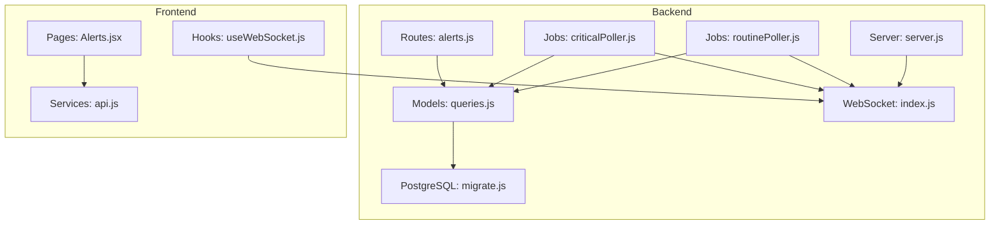
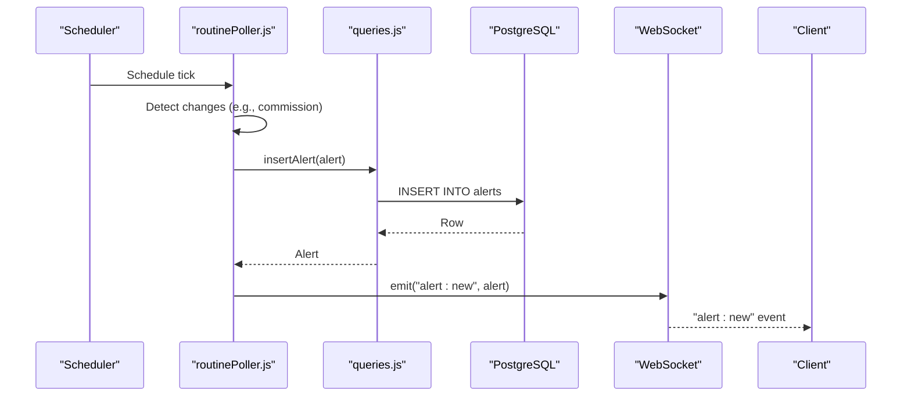
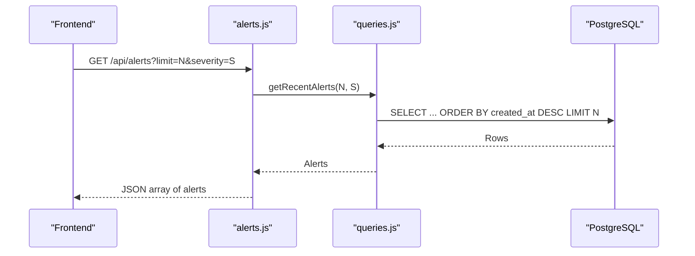
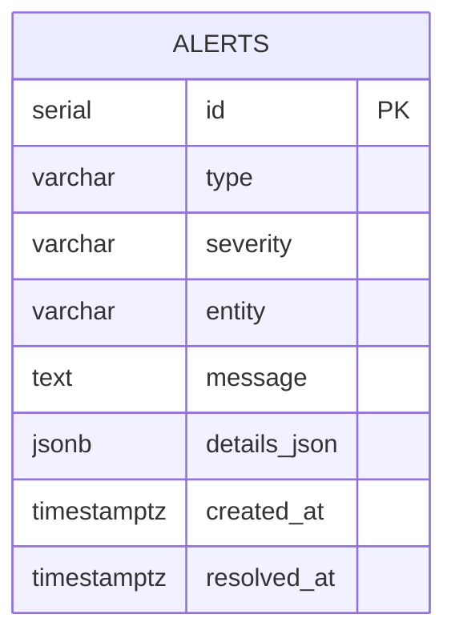
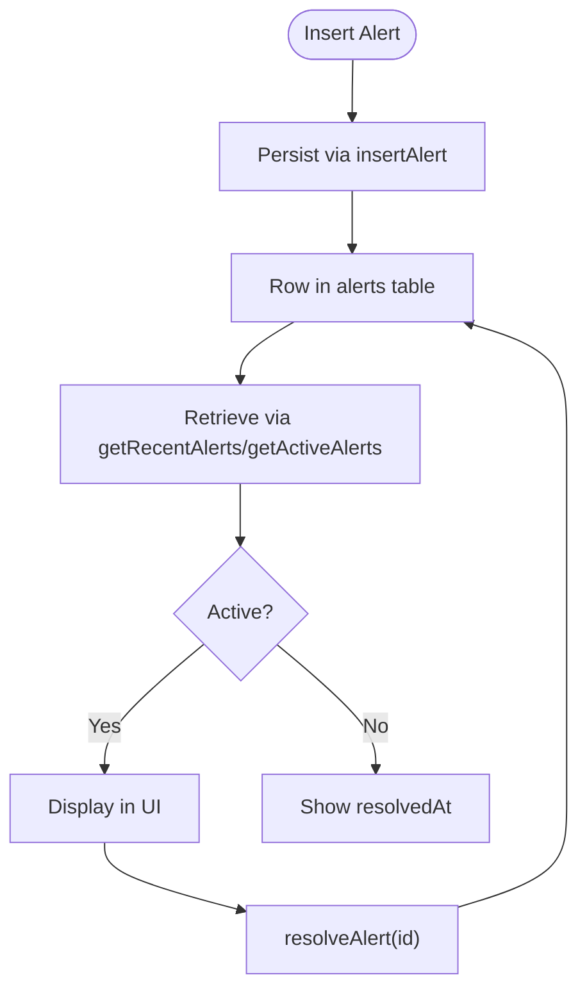
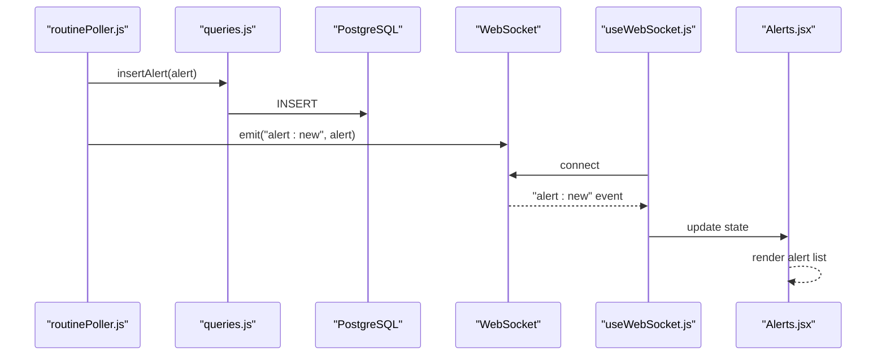
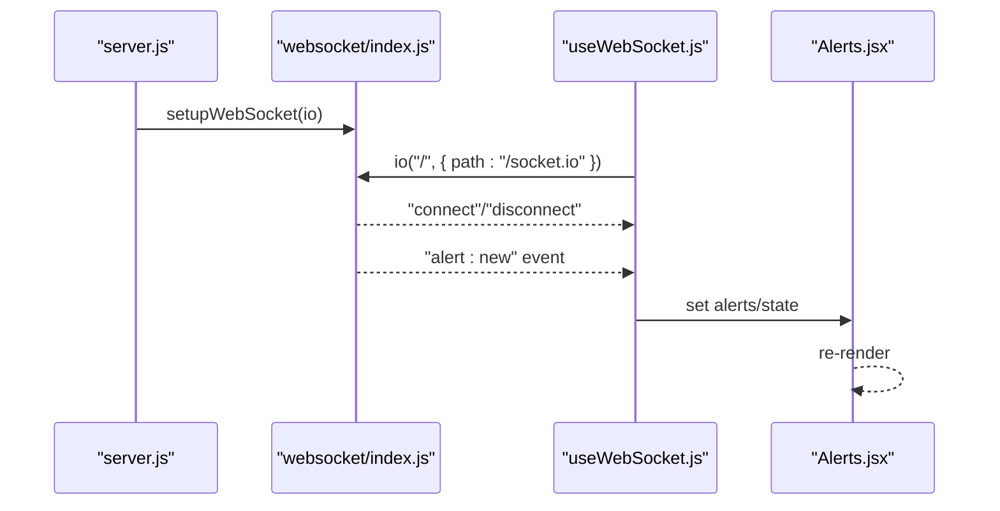
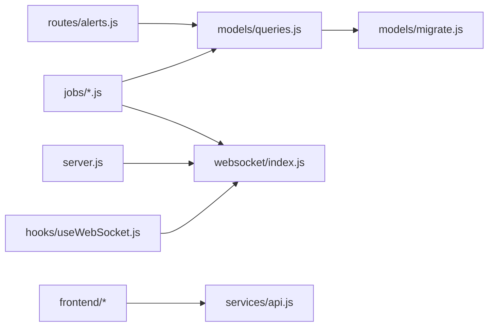

# Alerts API

<cite>
**Referenced Files in This Document**
- [alerts.js](file://backend/src/routes/alerts.js)
- [queries.js](file://backend/src/models/queries.js)
- [migrate.js](file://backend/src/models/migrate.js)
- [server.js](file://backend/server.js)
- [index.js](file://backend/src/websocket/index.js)
- [criticalPoller.js](file://backend/src/jobs/criticalPoller.js)
- [routinePoller.js](file://backend/src/jobs/routinePoller.js)
- [Alerts.jsx](file://frontend/src/pages/Alerts.jsx)
- [useWebSocket.js](file://frontend/src/hooks/useWebSocket.js)
- [api.js](file://frontend/src/services/api.js)
- [infrawatch_build_plan.md](file://infrawatch_build_plan.md)
</cite>

## Table of Contents
1. [Introduction](#introduction)
2. [Project Structure](#project-structure)
3. [Core Components](#core-components)
4. [Architecture Overview](#architecture-overview)
5. [Detailed Component Analysis](#detailed-component-analysis)
6. [Dependency Analysis](#dependency-analysis)
7. [Performance Considerations](#performance-considerations)
8. [Troubleshooting Guide](#troubleshooting-guide)
9. [Conclusion](#conclusion)

## Introduction
This document provides comprehensive API documentation for the Alerts subsystem. It covers alert configuration, alert subscription management, and alert notification delivery. The Alerts API exposes endpoints for retrieving recent alerts, while the backend generates alerts internally from health monitoring jobs and broadcasts them via WebSocket. The frontend integrates with both the REST API and WebSocket to present real-time alert notifications.

## Project Structure
The Alerts API spans backend route handlers, data access layer, database schema, scheduled jobs, and frontend integration:
- Backend routes define the REST endpoint for fetching alerts
- Data access layer provides CRUD-like operations for alerts
- Database schema defines the alerts table and indexes
- Jobs generate alerts and broadcast them via WebSocket
- Frontend consumes REST and WebSocket for alert presentation

**Diagram sources**
- [alerts.js:1-45](file://backend/src/routes/alerts.js#L1-L45)
- [queries.js:326-426](file://backend/src/models/queries.js#L326-L426)
- [migrate.js:80-94](file://backend/src/models/migrate.js#L80-L94)
- [index.js:1-80](file://backend/src/websocket/index.js#L1-L80)
- [criticalPoller.js:1-108](file://backend/src/jobs/criticalPoller.js#L1-L108)
- [routinePoller.js:1-116](file://backend/src/jobs/routinePoller.js#L1-L116)
- [server.js:44-98](file://backend/server.js#L44-L98)
- [Alerts.jsx:1-113](file://frontend/src/pages/Alerts.jsx#L1-L113)
- [useWebSocket.js:1-29](file://frontend/src/hooks/useWebSocket.js#L1-L29)
- [api.js:1-43](file://frontend/src/services/api.js#L1-L43)

**Section sources**
- [alerts.js:1-45](file://backend/src/routes/alerts.js#L1-L45)
- [queries.js:326-426](file://backend/src/models/queries.js#L326-L426)
- [migrate.js:80-94](file://backend/src/models/migrate.js#L80-L94)
- [server.js:44-98](file://backend/server.js#L44-L98)
- [index.js:1-80](file://backend/src/websocket/index.js#L1-L80)
- [criticalPoller.js:1-108](file://backend/src/jobs/criticalPoller.js#L1-L108)
- [routinePoller.js:1-116](file://backend/src/jobs/routinePoller.js#L1-L116)
- [Alerts.jsx:1-113](file://frontend/src/pages/Alerts.jsx#L1-L113)
- [useWebSocket.js:1-29](file://frontend/src/hooks/useWebSocket.js#L1-L29)
- [api.js:1-43](file://frontend/src/services/api.js#L1-L43)

## Core Components
- Alerts REST endpoint: GET /api/alerts with optional query parameters for limit and severity filtering
- Data access functions: insertAlert, getRecentAlerts, resolveAlert, getActiveAlerts
- Database schema: alerts table with type, severity, entity, message, details_json, timestamps, and resolved_at
- WebSocket broadcasting: emits alert events to connected clients
- Jobs that generate alerts: routinePoller creates alerts for validator commission changes and emits via WebSocket

**Section sources**
- [alerts.js:10-43](file://backend/src/routes/alerts.js#L10-L43)
- [queries.js:330-426](file://backend/src/models/queries.js#L330-L426)
- [migrate.js:80-94](file://backend/src/models/migrate.js#L80-L94)
- [index.js:48-64](file://backend/src/websocket/index.js#L48-L64)
- [routinePoller.js:80-100](file://backend/src/jobs/routinePoller.js#L80-L100)

## Architecture Overview
The Alerts subsystem follows a pipeline:
- Data ingestion and health monitoring produce alert events
- Alerts are persisted to the database
- REST API serves recent alerts to clients
- WebSocket broadcasts live alert events to connected clients

**Diagram sources**
- [routinePoller.js:80-100](file://backend/src/jobs/routinePoller.js#L80-L100)
- [queries.js:340-356](file://backend/src/models/queries.js#L340-L356)
- [index.js:48-52](file://backend/src/websocket/index.js#L48-L52)

## Detailed Component Analysis

### Alerts REST Endpoint
- Endpoint: GET /api/alerts
- Query parameters:
  - limit: integer, default 50, clamped between 1 and 100
  - severity: optional string filter
- Response: Array of alert objects with fields id, type, severity, entity, message, details, createdAt, resolvedAt
- Behavior:
  - Calls getRecentAlerts with limit and optional severity
  - On database error, returns empty array
  - Transforms database rows to API shape

**Diagram sources**
- [alerts.js:14-43](file://backend/src/routes/alerts.js#L14-L43)
- [queries.js:364-387](file://backend/src/models/queries.js#L364-L387)

**Section sources**
- [alerts.js:10-43](file://backend/src/routes/alerts.js#L10-L43)
- [queries.js:358-387](file://backend/src/models/queries.js#L358-L387)

### Alert Data Model
The alerts table schema supports structured alert records with JSON details and timestamps:
- Columns: id, type, severity, entity, message, details_json (JSONB), created_at, resolved_at
- Indexes: created_at DESC, severity+created_at DESC

**Diagram sources**
- [migrate.js:80-94](file://backend/src/models/migrate.js#L80-L94)

**Section sources**
- [migrate.js:80-94](file://backend/src/models/migrate.js#L80-L94)

### Alert Lifecycle Management
- Creation: insertAlert persists alert metadata and details
- Retrieval: getRecentAlerts supports pagination and severity filtering; getActiveAlerts orders by severity and recency
- Resolution: resolveAlert updates resolved_at for an alert

**Diagram sources**
- [queries.js:340-426](file://backend/src/models/queries.js#L340-L426)

**Section sources**
- [queries.js:330-426](file://backend/src/models/queries.js#L330-L426)

### Alert Generation and Delivery
- Internal generation: routinePoller detects validator commission changes, constructs alert payload, inserts into DB, and emits via WebSocket
- Real-time delivery: WebSocket server broadcasts "alert:new" events to all clients
- Frontend consumption: useWebSocket hook connects to Socket.io and listens for "alert:new"

**Diagram sources**
- [routinePoller.js:80-100](file://backend/src/jobs/routinePoller.js#L80-L100)
- [index.js:48-52](file://backend/src/websocket/index.js#L48-L52)
- [useWebSocket.js:8-28](file://frontend/src/hooks/useWebSocket.js#L8-L28)
- [Alerts.jsx:48-112](file://frontend/src/pages/Alerts.jsx#L48-L112)

**Section sources**
- [routinePoller.js:80-100](file://backend/src/jobs/routinePoller.js#L80-L100)
- [index.js:48-64](file://backend/src/websocket/index.js#L48-L64)
- [useWebSocket.js:1-29](file://frontend/src/hooks/useWebSocket.js#L1-L29)
- [Alerts.jsx:1-113](file://frontend/src/pages/Alerts.jsx#L1-L113)

### WebSocket Integration
- Server setup: server.js initializes Socket.io and registers WebSocket handlers
- Broadcasting: websocket/index.js provides broadcast functions for events and rooms
- Client connection: useWebSocket.js connects to / with path /socket.io and listens for "alert:new"

**Diagram sources**
- [server.js:48-81](file://backend/server.js#L48-L81)
- [index.js:13-33](file://backend/src/websocket/index.js#L13-L33)
- [useWebSocket.js:8-28](file://frontend/src/hooks/useWebSocket.js#L8-L28)

**Section sources**
- [server.js:48-81](file://backend/server.js#L48-L81)
- [index.js:1-80](file://backend/src/websocket/index.js#L1-L80)
- [useWebSocket.js:1-29](file://frontend/src/hooks/useWebSocket.js#L1-L29)

## Dependency Analysis
- Route depends on queries for data access
- Queries depend on database connection abstraction
- Jobs depend on queries and WebSocket for alert emission
- Frontend depends on REST API and WebSocket for data
- Server composes WebSocket and routes

**Diagram sources**
- [alerts.js:1-45](file://backend/src/routes/alerts.js#L1-L45)
- [queries.js:326-426](file://backend/src/models/queries.js#L326-L426)
- [migrate.js:80-94](file://backend/src/models/migrate.js#L80-L94)
- [index.js:1-80](file://backend/src/websocket/index.js#L1-L80)
- [server.js:44-98](file://backend/server.js#L44-L98)
- [api.js:1-43](file://frontend/src/services/api.js#L1-L43)
- [useWebSocket.js:1-29](file://frontend/src/hooks/useWebSocket.js#L1-L29)

**Section sources**
- [alerts.js:1-45](file://backend/src/routes/alerts.js#L1-L45)
- [queries.js:326-426](file://backend/src/models/queries.js#L326-L426)
- [migrate.js:80-94](file://backend/src/models/migrate.js#L80-L94)
- [index.js:1-80](file://backend/src/websocket/index.js#L1-L80)
- [server.js:44-98](file://backend/server.js#L44-L98)
- [api.js:1-43](file://frontend/src/services/api.js#L1-L43)
- [useWebSocket.js:1-29](file://frontend/src/hooks/useWebSocket.js#L1-L29)

## Performance Considerations
- Query limits: GET /api/alerts clamps limit between 1 and 100 to prevent excessive loads
- Indexes: alerts table includes indexes on created_at and severity+created_at for efficient sorting and filtering
- Graceful degradation: On database unavailability, the endpoint returns an empty array rather than failing
- WebSocket broadcasting: Efficient fan-out to all connected clients; rooms support targeted delivery if needed

[No sources needed since this section provides general guidance]

## Troubleshooting Guide
- Empty alert list: Verify database connectivity; the endpoint returns [] on DB errors
- Missing real-time alerts: Confirm WebSocket connection and that jobs are emitting "alert:new"; check server logs for Socket.io initialization
- Alert not appearing: Ensure routinePoller detects changes and calls insertAlert followed by WebSocket emit
- Frontend not receiving events: Verify useWebSocket.js connection path matches server configuration

**Section sources**
- [alerts.js:20-25](file://backend/src/routes/alerts.js#L20-L25)
- [server.js:80-81](file://backend/server.js#L80-L81)
- [routinePoller.js:96-100](file://backend/src/jobs/routinePoller.js#L96-L100)
- [useWebSocket.js:8-28](file://frontend/src/hooks/useWebSocket.js#L8-L28)

## Conclusion
The Alerts API provides a focused REST interface for retrieving recent alerts and leverages internal jobs and WebSocket broadcasting for real-time alert delivery. The backend schema and data access functions support flexible alert storage and retrieval, while the frontend integrates seamlessly with both REST and WebSocket for a responsive user experience. Future enhancements can expand alert configuration and subscription management as indicated in the project plan.