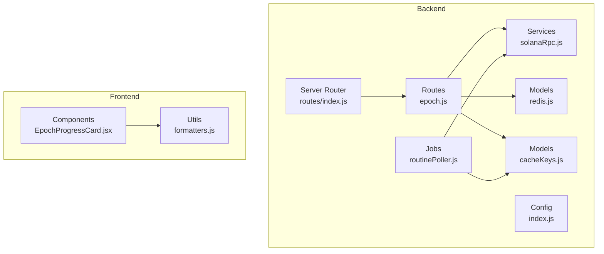
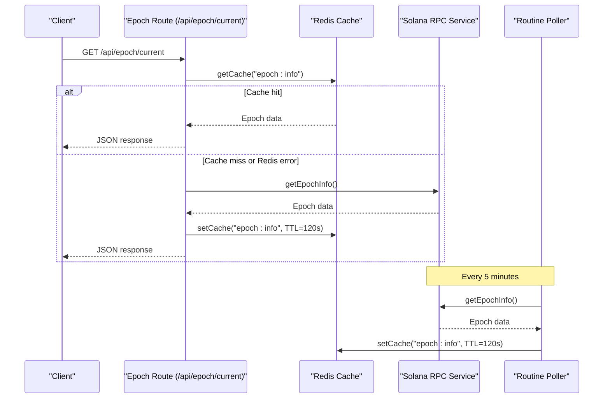
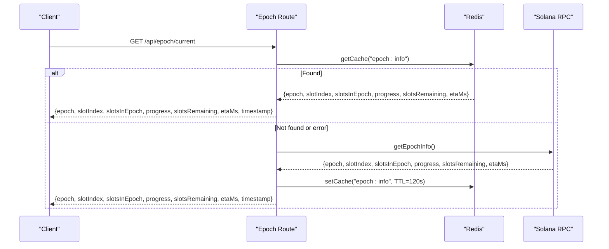
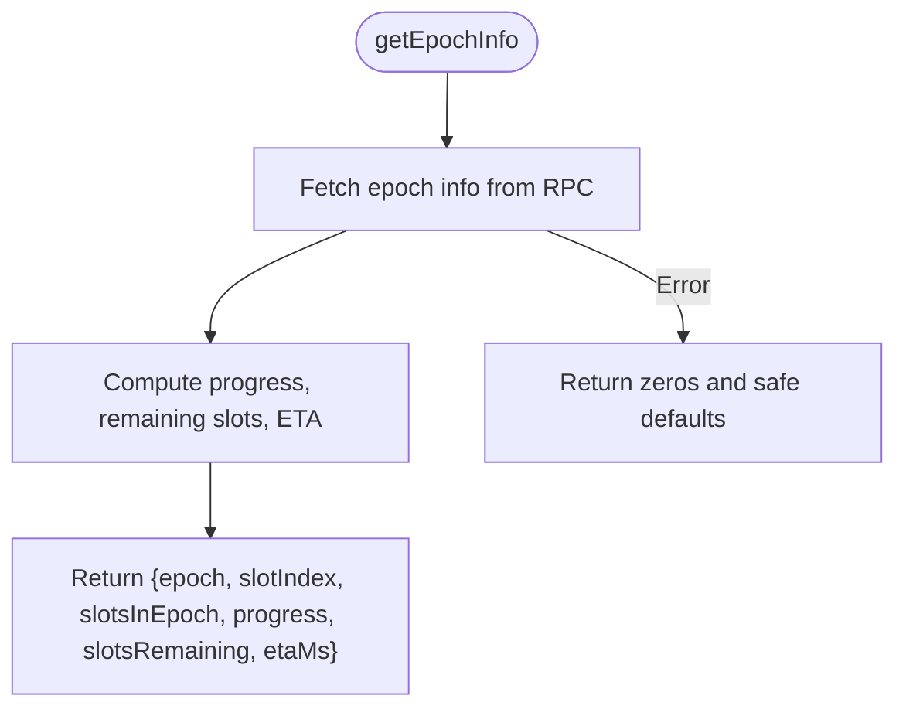
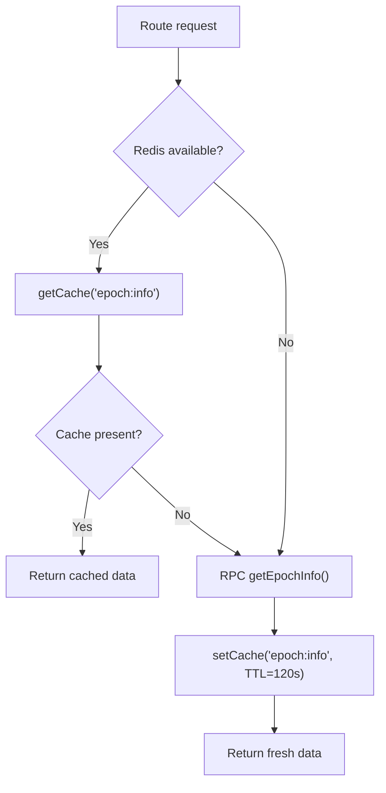
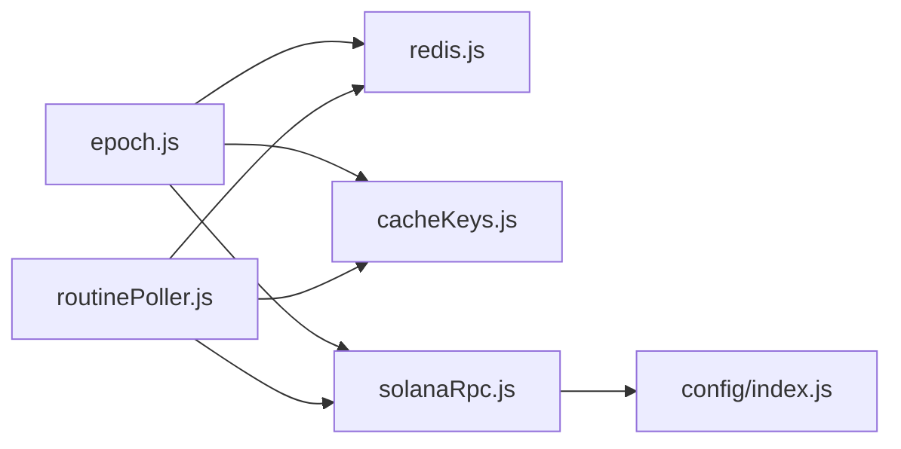

# Epoch API

<cite>
**Referenced Files in This Document**
- [epoch.js](file://backend/src/routes/epoch.js)
- [solanaRpc.js](file://backend/src/services/solanaRpc.js)
- [cacheKeys.js](file://backend/src/models/cacheKeys.js)
- [redis.js](file://backend/src/models/redis.js)
- [index.js](file://backend/src/config/index.js)
- [index.js](file://backend/src/routes/index.js)
- [routinePoller.js](file://backend/src/jobs/routinePoller.js)
- [EpochProgressCard.jsx](file://frontend/src/components/dashboard/EpochProgressCard.jsx)
- [formatters.js](file://frontend/src/utils/formatters.js)
- [package.json](file://backend/package.json)
</cite>

## Table of Contents
1. [Introduction](#introduction)
2. [Project Structure](#project-structure)
3. [Core Components](#core-components)
4. [Architecture Overview](#architecture-overview)
5. [Detailed Component Analysis](#detailed-component-analysis)
6. [Dependency Analysis](#dependency-analysis)
7. [Performance Considerations](#performance-considerations)
8. [Troubleshooting Guide](#troubleshooting-guide)
9. [Conclusion](#conclusion)
10. [Appendices](#appendices)

## Introduction
This document provides comprehensive API documentation for the Epoch API endpoints that power epoch timing information, epoch progress tracking, and epoch-related network data. It covers:
- Endpoint definitions and request/response schemas
- Integration with Solana RPC for accurate epoch timing and epoch transitions
- Epoch-based analytics and caching strategies
- Examples of epoch-aware application development and timing-sensitive operations

The Epoch API is implemented as part of the backend Express server and serves data consumed by the frontend dashboard components.

## Project Structure
The Epoch API resides under the backend routes and integrates with Solana RPC, Redis caching, and periodic polling jobs. The frontend consumes epoch data to render progress cards and formatting utilities.

**Diagram sources**
- [epoch.js:1-62](file://backend/src/routes/epoch.js#L1-L62)
- [solanaRpc.js:1-340](file://backend/src/services/solanaRpc.js#L1-L340)
- [cacheKeys.js:1-50](file://backend/src/models/cacheKeys.js#L1-L50)
- [redis.js:1-161](file://backend/src/models/redis.js#L1-L161)
- [index.js:1-68](file://backend/src/config/index.js#L1-L68)
- [routinePoller.js:1-116](file://backend/src/jobs/routinePoller.js#L1-L116)
- [index.js:1-24](file://backend/src/routes/index.js#L1-L24)
- [EpochProgressCard.jsx:1-74](file://frontend/src/components/dashboard/EpochProgressCard.jsx#L1-L74)
- [formatters.js:1-158](file://frontend/src/utils/formatters.js#L1-L158)

**Section sources**
- [epoch.js:1-62](file://backend/src/routes/epoch.js#L1-L62)
- [solanaRpc.js:1-340](file://backend/src/services/solanaRpc.js#L1-L340)
- [cacheKeys.js:1-50](file://backend/src/models/cacheKeys.js#L1-L50)
- [redis.js:1-161](file://backend/src/models/redis.js#L1-L161)
- [index.js:1-68](file://backend/src/config/index.js#L1-L68)
- [routinePoller.js:1-116](file://backend/src/jobs/routinePoller.js#L1-L116)
- [index.js:1-24](file://backend/src/routes/index.js#L1-L24)
- [EpochProgressCard.jsx:1-74](file://frontend/src/components/dashboard/EpochProgressCard.jsx#L1-L74)
- [formatters.js:1-158](file://frontend/src/utils/formatters.js#L1-L158)

## Core Components
- Epoch route handler: Provides the current epoch endpoint with cache-first logic and RPC fallback.
- Solana RPC service: Fetches epoch information from the Solana network and computes derived metrics.
- Redis cache: Stores epoch data with TTL and supports graceful degradation when Redis is unavailable.
- Routine poller: Periodically refreshes epoch data and caches it.
- Frontend components: Render epoch progress and format epoch-related timestamps.

**Section sources**
- [epoch.js:16-59](file://backend/src/routes/epoch.js#L16-L59)
- [solanaRpc.js:124-156](file://backend/src/services/solanaRpc.js#L124-L156)
- [redis.js:75-112](file://backend/src/models/redis.js#L75-L112)
- [routinePoller.js:72-78](file://backend/src/jobs/routinePoller.js#L72-L78)
- [EpochProgressCard.jsx:5-73](file://frontend/src/components/dashboard/EpochProgressCard.jsx#L5-L73)

## Architecture Overview
The Epoch API follows a cache-first pattern:
- On request, the route attempts to read epoch data from Redis.
- If Redis is unavailable or empty, it fetches from Solana RPC and writes to Redis with a TTL.
- The routine poller proactively updates the cache to keep data fresh.

**Diagram sources**
- [epoch.js:16-59](file://backend/src/routes/epoch.js#L16-L59)
- [solanaRpc.js:124-156](file://backend/src/services/solanaRpc.js#L124-L156)
- [cacheKeys.js](file://backend/src/models/cacheKeys.js#L10)
- [redis.js:75-112](file://backend/src/models/redis.js#L75-L112)
- [routinePoller.js:72-78](file://backend/src/jobs/routinePoller.js#L72-L78)

## Detailed Component Analysis

### Endpoint: GET /api/epoch/current
- Purpose: Returns current epoch timing and progress data.
- Cache behavior: Attempts Redis cache first; falls back to Solana RPC if unavailable or empty.
- Response fields:
  - epoch: Current epoch number
  - slotIndex: Current slot within the epoch
  - slotsInEpoch: Total slots allocated to the epoch
  - progress: Percentage of epoch completed (0–100)
  - slotsRemaining: Remaining slots until epoch end
  - etaMs: Estimated time remaining in milliseconds
  - timestamp: Server response timestamp (ISO 8601)

**Diagram sources**
- [epoch.js:16-59](file://backend/src/routes/epoch.js#L16-L59)
- [solanaRpc.js:124-156](file://backend/src/services/solanaRpc.js#L124-L156)
- [cacheKeys.js](file://backend/src/models/cacheKeys.js#L10)
- [redis.js:75-112](file://backend/src/models/redis.js#L75-L112)

**Section sources**
- [epoch.js:16-59](file://backend/src/routes/epoch.js#L16-L59)

### Solana RPC Integration
- Data source: Uses @solana/web3.js Connection to fetch epoch information.
- Derived metrics:
  - progress: (slotIndex / slotsInEpoch) × 100
  - slotsRemaining: slotsInEpoch − slotIndex
  - etaMs: slotsRemaining × 400 ms (average slot time)
- Error handling: Returns safe defaults when RPC calls fail.

**Diagram sources**
- [solanaRpc.js:124-156](file://backend/src/services/solanaRpc.js#L124-L156)

**Section sources**
- [solanaRpc.js:124-156](file://backend/src/services/solanaRpc.js#L124-L156)

### Caching Strategy
- Cache key: "epoch:info"
- TTL: 120 seconds
- Redis operations:
  - getCache(key): returns parsed JSON or null
  - setCache(key, data, ttl): serializes and stores with expiry
- Graceful degradation: Route continues if Redis is unavailable.

**Diagram sources**
- [epoch.js:18-45](file://backend/src/routes/epoch.js#L18-L45)
- [redis.js:75-112](file://backend/src/models/redis.js#L75-L112)
- [cacheKeys.js](file://backend/src/models/cacheKeys.js#L10)

**Section sources**
- [epoch.js:18-45](file://backend/src/routes/epoch.js#L18-L45)
- [redis.js:75-112](file://backend/src/models/redis.js#L75-L112)
- [cacheKeys.js:42-48](file://backend/src/models/cacheKeys.js#L42-L48)

### Routine Poller Integration
- Frequency: Every 5 minutes
- Purpose: Proactively refresh epoch info and cache it
- Benefits: Reduces latency and load on Solana RPC during peak traffic

**Section sources**
- [routinePoller.js:21-78](file://backend/src/jobs/routinePoller.js#L21-L78)

### Frontend Consumption and Formatting
- Component: EpochProgressCard renders epoch progress, ETA, and slot metrics
- Utilities: formatEpochEta converts remaining slots to human-readable ETA
- Data sources: Uses epochInfo from the network store; falls back to current epoch progress when needed

**Section sources**
- [EpochProgressCard.jsx:5-73](file://frontend/src/components/dashboard/EpochProgressCard.jsx#L5-L73)
- [formatters.js:95-110](file://frontend/src/utils/formatters.js#L95-L110)

## Dependency Analysis
- Route depends on:
  - Redis cache module for cache operations
  - Solana RPC service for epoch data
  - Cache keys module for key/TTL constants
- Solana RPC service depends on:
  - @solana/web3.js Connection
  - Config module for RPC URL
- Routine poller depends on:
  - Solana RPC service
  - Cache keys and Redis modules

**Diagram sources**
- [epoch.js:8-10](file://backend/src/routes/epoch.js#L8-L10)
- [solanaRpc.js:6-10](file://backend/src/services/solanaRpc.js#L6-L10)
- [cacheKeys.js:1-50](file://backend/src/models/cacheKeys.js#L1-L50)
- [redis.js:1-161](file://backend/src/models/redis.js#L1-L161)
- [routinePoller.js:9-12](file://backend/src/jobs/routinePoller.js#L9-L12)

**Section sources**
- [epoch.js:8-10](file://backend/src/routes/epoch.js#L8-L10)
- [solanaRpc.js:6-10](file://backend/src/services/solanaRpc.js#L6-L10)
- [cacheKeys.js:1-50](file://backend/src/models/cacheKeys.js#L1-L50)
- [redis.js:1-161](file://backend/src/models/redis.js#L1-L161)
- [routinePoller.js:9-12](file://backend/src/jobs/routinePoller.js#L9-L12)

## Performance Considerations
- Cache TTL: 120 seconds strikes a balance between freshness and reduced RPC load.
- Routine polling: Updates cache every 5 minutes to minimize real-time RPC calls.
- Redis availability: Route continues without cache; errors are handled gracefully.
- Frontend formatting: Efficient client-side rendering with precomputed values.

[No sources needed since this section provides general guidance]

## Troubleshooting Guide
Common issues and resolutions:
- Redis unavailable:
  - Symptom: Route falls back to RPC; occasional latency spikes.
  - Action: Verify Redis URL configuration and connectivity.
- Empty cache:
  - Symptom: First request after restart may be slower.
  - Action: Allow routine poller to repopulate cache within 5 minutes.
- RPC failures:
  - Symptom: Zeroed epoch fields in response.
  - Action: Check Solana RPC URL and network connectivity.

**Section sources**
- [epoch.js:33-35](file://backend/src/routes/epoch.js#L33-L35)
- [solanaRpc.js:145-155](file://backend/src/services/solanaRpc.js#L145-L155)
- [redis.js:21-24](file://backend/src/models/redis.js#L21-L24)

## Conclusion
The Epoch API delivers reliable, cache-backed epoch timing and progress data, integrating seamlessly with Solana RPC and Redis. Its design ensures low-latency responses, robust fallbacks, and consistent data for epoch-aware applications and dashboards.

[No sources needed since this section summarizes without analyzing specific files]

## Appendices

### API Definition: GET /api/epoch/current
- Method: GET
- Path: /api/epoch/current
- Authentication: None
- Response fields:
  - epoch: number
  - slotIndex: number
  - slotsInEpoch: number
  - progress: number (percentage)
  - slotsRemaining: number
  - etaMs: number (milliseconds)
  - timestamp: string (ISO 8601)

Example response shape:
- epoch: 12345
- slotIndex: 123456
- slotsInEpoch: 43200
- progress: 28.57
- slotsRemaining: 30854
- etaMs: 12341600
- timestamp: "2025-01-01T00:00:00.000Z"

**Section sources**
- [epoch.js:47-55](file://backend/src/routes/epoch.js#L47-L55)
- [solanaRpc.js:137-144](file://backend/src/services/solanaRpc.js#L137-L144)

### Integration Notes
- Solana RPC URL: Configurable via environment variable; defaults to mainnet beta API.
- Redis URL: Configurable; if unset, caching features are disabled.
- Package dependencies include @solana/web3.js for RPC interactions.

**Section sources**
- [index.js:32-37](file://backend/src/config/index.js#L32-L37)
- [index.js:50-53](file://backend/src/config/index.js#L50-L53)
- [package.json:22-34](file://backend/package.json#L22-L34)