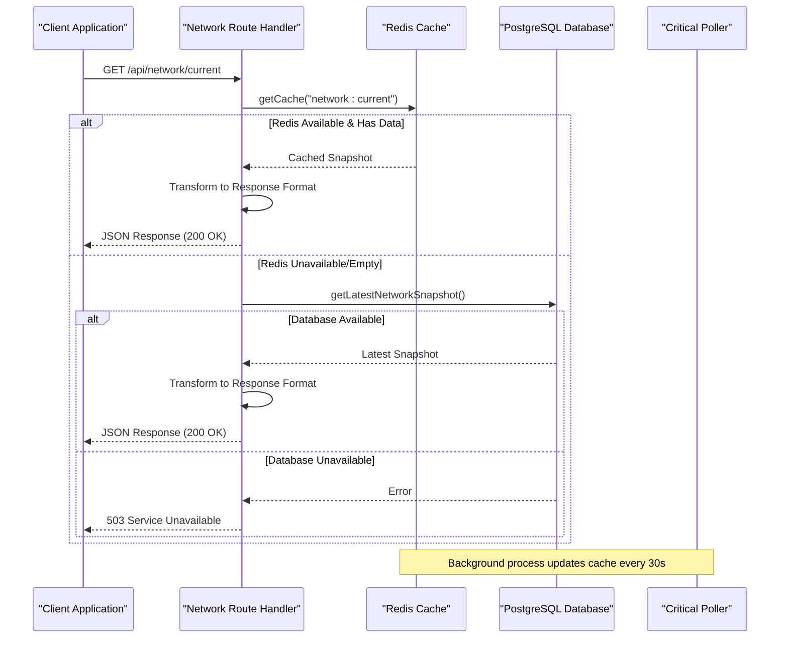
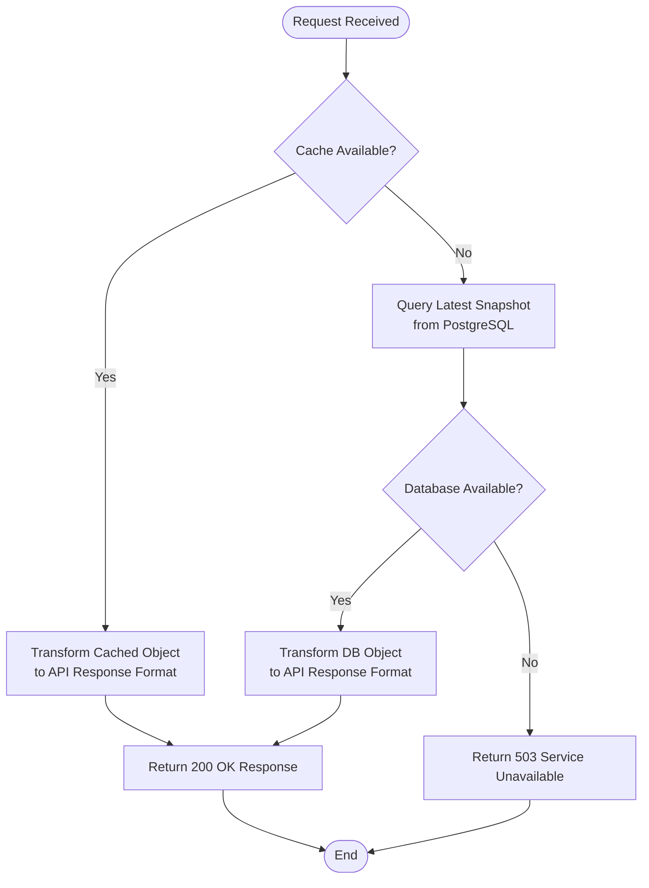

# Current Network Status Endpoint

<cite>
**Referenced Files in This Document**
- [network.js](file://backend/src/routes/network.js)
- [cacheKeys.js](file://backend/src/models/cacheKeys.js)
- [redis.js](file://backend/src/models/redis.js)
- [db.js](file://backend/src/models/db.js)
- [queries.js](file://backend/src/models/queries.js)
- [solanaRpc.js](file://backend/src/services/solanaRpc.js)
- [criticalPoller.js](file://backend/src/jobs/criticalPoller.js)
- [index.js](file://backend/src/routes/index.js)
- [server.js](file://backend/server.js)
- [config/index.js](file://backend/src/config/index.js)
</cite>

## Table of Contents
1. [Introduction](#introduction)
2. [Endpoint Specification](#endpoint-specification)
3. [Cache-First Architecture](#cache-first-architecture)
4. [Response Schema](#response-schema)
5. [Data Transformation Logic](#data-transformation-logic)
6. [Error Handling](#error-handling)
7. [Health Status Determination](#health-status-determination)
8. [Caching Behavior](#caching-behavior)
9. [Performance Considerations](#performance-considerations)
10. [Example Request/Response](#example-requestresponse)
11. [Integration Points](#integration-points)
12. [Troubleshooting Guide](#troubleshooting-guide)

## Introduction

The GET /api/network/current endpoint provides real-time network status information for the Solana blockchain. This endpoint implements a sophisticated cache-first architecture using Redis with PostgreSQL as a fallback, designed specifically for real-time network monitoring dashboards that require low-latency access to current network metrics.

The endpoint serves critical infrastructure monitoring data including transaction throughput, slot progression, epoch information, validator health metrics, and congestion indicators that help operators and developers understand the current state of the Solana network.

## Endpoint Specification

### HTTP Method and Path
- **Method:** GET
- **Path:** `/api/network/current`
- **Full URL:** `http://localhost:3001/api/network/current`

### Request Headers
- `Accept: application/json` (standard for JSON responses)
- No authentication required for this endpoint

### Response Format
- **Content-Type:** `application/json`
- **Encoding:** UTF-8

## Cache-First Architecture

The endpoint follows a robust cache-first architecture designed for high availability and low latency:



**Diagram sources**
- [network.js:17-79](file://backend/src/routes/network.js#L17-L79)
- [redis.js:75-90](file://backend/src/models/redis.js#L75-L90)
- [db.js:55-70](file://backend/src/models/db.js#L55-L70)

### Cache Key Management

The system uses centralized cache key management through the `cacheKeys.js` module:

- **Primary Cache Key:** `network:current` with TTL of 60 seconds
- **Fallback Cache Key:** `network:history:{range}` with TTL of 300 seconds
- **Cache TTL Strategy:** Critical data (network current) uses shorter TTL for freshness

**Section sources**
- [cacheKeys.js:8](file://backend/src/models/cacheKeys.js#L8)
- [cacheKeys.js:40](file://backend/src/models/cacheKeys.js#L40)
- [cacheKeys.js:47](file://backend/src/models/cacheKeys.js#L47)

## Response Schema

The endpoint returns a comprehensive JSON object containing real-time network metrics:

### Response Fields

| Field | Type | Description | Units |
|-------|------|-------------|-------|
| `status` | string | Network health status | "UP", "DOWN", "unknown" |
| `tps` | number | Transactions per second | TPS |
| `slotHeight` | number | Current slot height | Slots |
| `slotLatencyMs` | number | Estimated slot latency | Milliseconds |
| `epoch` | number | Current epoch number | Epochs |
| `epochProgress` | number | Percentage completion of current epoch | Percent (%) |
| `delinquentCount` | number | Number of delinquent validators | Validators |
| `activeValidators` | number | Total number of active validators | Validators |
| `confirmationTimeMs` | number | Average confirmation time | Milliseconds |
| `congestionScore` | number | Network congestion level | 0-100 scale |
| `timestamp` | string | ISO 8601 timestamp of data collection | UTC |

### Response Validation

The response includes automatic validation and transformation from internal data structures to the standardized API format.

**Section sources**
- [network.js:29-41](file://backend/src/routes/network.js#L29-L41)
- [network.js:63-75](file://backend/src/routes/network.js#L63-L75)

## Data Transformation Logic

The endpoint performs intelligent data transformation from cached objects to API responses:



**Diagram sources**
- [network.js:17-79](file://backend/src/routes/network.js#L17-L79)

### Transformation Details

The transformation handles two distinct data formats:

1. **From Cache (`network:current`):**
   - Uses cached health status directly
   - Maps field names: `slot` → `slotHeight`, `avg_confirmation_ms` → `confirmationTimeMs`
   - Preserves all numeric values as-is

2. **From Database (`getLatestNetworkSnapshot`):**
   - Sets status to "unknown" when falling back to database
   - Maps field names: `slot_height` → `slotHeight`, `confirmation_time_ms` → `confirmationTimeMs`
   - Maintains original data types and precision

**Section sources**
- [network.js:27-42](file://backend/src/routes/network.js#L27-L42)
- [network.js:56-61](file://backend/src/routes/network.js#L56-L61)

## Error Handling

The endpoint implements comprehensive error handling for various failure scenarios:

### Redis Unavailability
- **Behavior:** Graceful degradation to database fallback
- **Impact:** Slight increase in response time due to database query
- **Logging:** Warning-level logs with error details

### Database Startup Phase
- **Behavior:** Returns 503 Service Unavailable with descriptive message
- **Message:** "Service is starting up or data collection is unavailable"
- **Purpose:** Prevents misleading "success" responses during initialization

### Database Unavailability
- **Behavior:** Returns 503 Service Unavailable with error details
- **Message:** "Data collection is starting up or temporarily unavailable"
- **Prevention:** Critical poller continuously collects and caches data

### General Error Handling
- **Behavior:** Passes unexpected errors to global error handler
- **Logging:** Comprehensive error logging with stack traces
- **Response:** Standardized error format for client consumption

**Section sources**
- [network.js:23](file://backend/src/routes/network.js#L23)
- [network.js:48-54](file://backend/src/routes/network.js#L48-L54)
- [network.js:56-61](file://backend/src/routes/network.js#L56-L61)

## Health Status Determination

The endpoint determines network health through multiple mechanisms:

### Cache-Level Health
- **Source:** Directly uses cached health status from `network:current` key
- **Values:** "UP", "DOWN", "unknown"
- **Reliability:** Highest confidence as it comes from recent collection

### Database-Level Health
- **Source:** Set to "unknown" when falling back to database
- **Purpose:** Indicates potential data freshness concerns
- **Implication:** Suggests Redis connectivity issues or cache miss

### External Dependencies
- **Solana RPC:** Health determined via `getHealth()` method
- **Priority Fee Data:** Optional enhancement via Helius integration
- **Connection Stability:** Monitored through connection pooling and retry strategies

**Section sources**
- [network.js:30](file://backend/src/routes/network.js#L30)
- [solanaRpc.js:20-34](file://backend/src/services/solanaRpc.js#L20-L34)

## Caching Behavior

The caching system operates through a coordinated background process:

### Background Data Collection
The critical poller runs every 30 seconds and performs:

1. **Network Snapshot Collection:** Gathers TPS, slot, epoch, and validator metrics
2. **Priority Fee Enhancement:** Integrates Helius priority fee data for congestion scoring
3. **Database Persistence:** Writes snapshots to PostgreSQL for historical tracking
4. **Cache Updates:** Updates Redis cache with fresh network data
5. **WebSocket Broadcasting:** Pushes real-time updates to connected clients

### Cache Expiration Strategy
- **NETWORK_CURRENT:** 60-second TTL for optimal balance between freshness and performance
- **NETWORK_HISTORY:** 300-second TTL for historical data retention
- **Automatic Refresh:** Continuous background updates prevent cache misses

### Cache Miss Handling
- **Graceful Degradation:** Falls back to database queries when cache is empty
- **Performance Impact:** Minimal impact due to efficient database indexing
- **Data Freshness:** Ensures users always receive current network information

**Section sources**
- [criticalPoller.js:23-100](file://backend/src/jobs/criticalPoller.js#L23-L100)
- [cacheKeys.js:8](file://backend/src/models/cacheKeys.js#L8)
- [cacheKeys.js:47](file://backend/src/models/cacheKeys.js#L47)

## Performance Considerations

### Real-Time Monitoring Optimization

For real-time network monitoring dashboards, the endpoint provides:

#### Latency Characteristics
- **Cache Hit Path:** Sub-50ms response time
- **Cache Miss Path:** 100-200ms response time (database query)
- **Typical Response:** <100ms for most requests

#### Scalability Features
- **Connection Pooling:** Redis and PostgreSQL connections managed efficiently
- **Non-blocking Operations:** Asynchronous processing prevents request queuing
- **Memory Efficiency:** JSON serialization minimizes memory overhead

#### Dashboard Integration
- **Polling Strategy:** Designed for frequent polling (every 30 seconds)
- **Cache Warm-up:** Background collection ensures immediate availability
- **Fallback Safety:** Database fallback prevents dashboard failures

### Resource Management
- **Redis Memory:** Optimized JSON serialization reduces memory footprint
- **Database Load:** Efficient queries with minimal result sets
- **Network Bandwidth:** Compact JSON responses minimize transfer overhead

## Example Request/Response

### Successful Response (Cache Hit)
```
GET /api/network/current
Host: localhost:3001
Accept: application/json

HTTP/1.1 200 OK
Content-Type: application/json

{
  "status": "UP",
  "tps": 2456.78,
  "slotHeight": 123456789,
  "slotLatencyMs": 125,
  "epoch": 456,
  "epochProgress": 78.45,
  "delinquentCount": 12,
  "activeValidators": 256,
  "confirmationTimeMs": 850,
  "congestionScore": 23,
  "timestamp": "2024-01-15T10:30:45.123Z"
}
```

### Response During Database Startup
```
GET /api/network/current
Host: localhost:3001
Accept: application/json

HTTP/1.1 503 Service Unavailable
Content-Type: application/json

{
  "error": "No network data available",
  "message": "Service is starting up or data collection is unavailable"
}
```

### Response When Database Unavailable
```
GET /api/network/current
Host: localhost:3001
Accept: application/json

HTTP/1.1 503 Service Unavailable
Content-Type: application/json

{
  "error": "Service unavailable",
  "message": "Data collection is starting up or temporarily unavailable"
}
```

## Integration Points

### Frontend Dashboard Integration
The endpoint integrates seamlessly with real-time monitoring dashboards:

#### React/Vue Integration Pattern
```javascript
// Example fetch pattern for dashboard components
const fetchNetworkStatus = async () => {
  try {
    const response = await fetch('/api/network/current');
    if (response.ok) {
      const data = await response.json();
      // Update dashboard components
      updateMetrics(data);
    } else if (response.status === 503) {
      const error = await response.json();
      handleServiceUnavailable(error);
    }
  } catch (error) {
    handleError(error);
  }
};
```

#### WebSocket Complementary Events
- **Real-time Updates:** `network:update` events broadcast via WebSocket
- **Historical Data:** `/api/network/history` endpoint for charting
- **RPC Health:** Related endpoints for provider monitoring

### Monitoring and Alerting
- **Uptime Monitoring:** Health check endpoint available at `/api/health`
- **Error Tracking:** Comprehensive logging for debugging
- **Performance Metrics:** Built-in observability for response times

**Section sources**
- [server.js:62-69](file://backend/server.js#L62-L69)
- [network.js:85-132](file://backend/src/routes/network.js#L85-L132)

## Troubleshooting Guide

### Common Issues and Solutions

#### Endpoint Returns 503 Service Unavailable
**Symptoms:** Dashboard shows "Service unavailable" or "No network data available"
**Causes:**
- Database initialization failure
- Critical poller not running
- Redis connectivity issues

**Solutions:**
1. Check server logs for initialization errors
2. Verify database connectivity
3. Confirm critical poller status
4. Monitor Redis connection status

#### Slow Response Times
**Symptoms:** Response times > 200ms
**Causes:**
- Cache misses requiring database queries
- Database performance issues
- Network latency to external services

**Solutions:**
1. Verify cache connectivity
2. Check database performance metrics
3. Optimize network routing
4. Consider increasing cache TTL for specific use cases

#### Data Freshness Concerns
**Symptoms:** Outdated network metrics
**Causes:**
- Cache TTL expiration
- Critical poller failures
- Redis memory pressure

**Solutions:**
1. Monitor critical poller logs
2. Check Redis memory usage
3. Verify cache key expiration
4. Review background job scheduling

### Diagnostic Commands

#### Health Check
```bash
curl http://localhost:3001/api/health
```

#### Cache Status
```bash
# Check Redis connectivity and cache keys
redis-cli ping
redis-cli keys "network:*"
```

#### Database Connectivity
```sql
-- Verify network snapshots table
SELECT COUNT(*) FROM network_snapshots;
SELECT MAX(timestamp) FROM network_snapshots;
```

**Section sources**
- [server.js:84-107](file://backend/server.js#L84-L107)
- [redis.js:75-90](file://backend/src/models/redis.js#L75-L90)
- [db.js:55-70](file://backend/src/models/db.js#L55-L70)