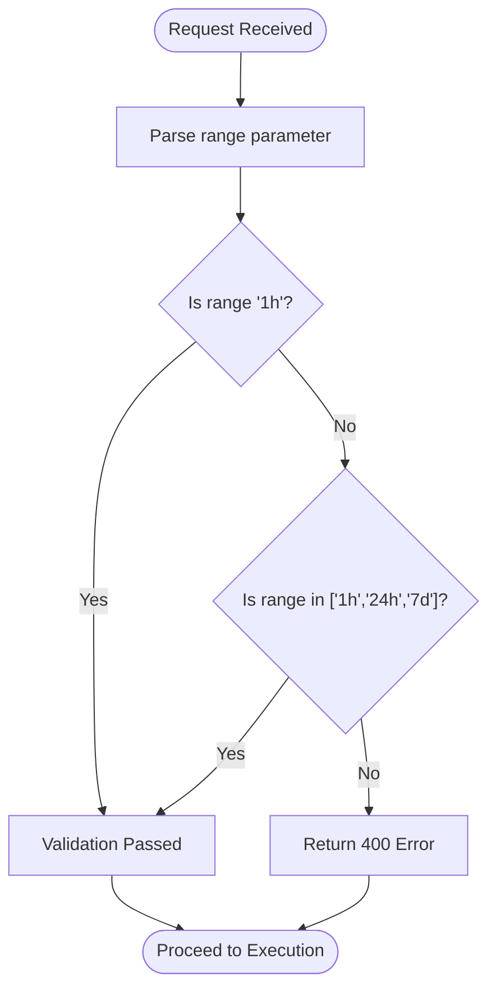
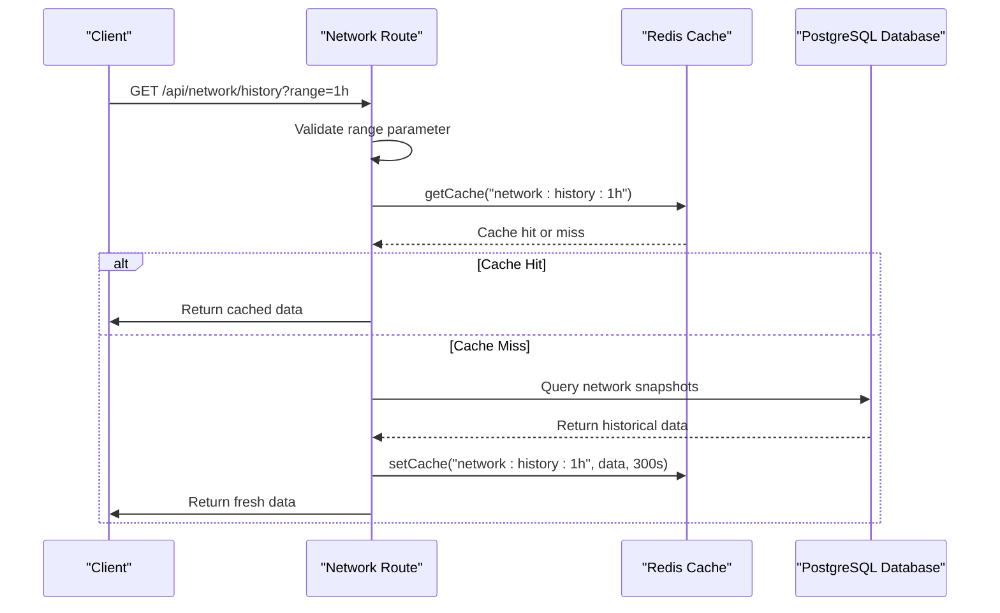
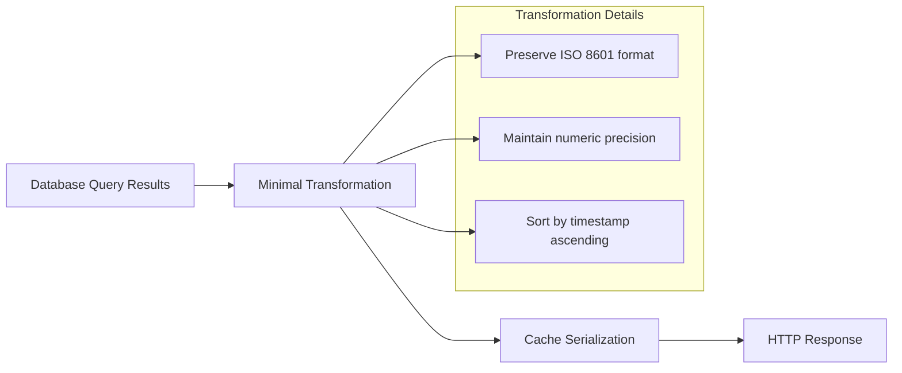
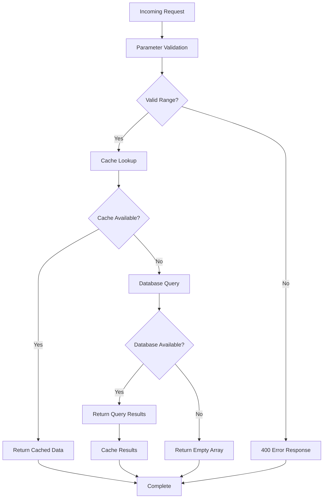

# Historical Network Data Endpoint

<cite>
**Referenced Files in This Document**
- [network.js](file://backend/src/routes/network.js)
- [cacheKeys.js](file://backend/src/models/cacheKeys.js)
- [redis.js](file://backend/src/models/redis.js)
- [queries.js](file://backend/src/models/queries.js)
- [networkApi.js](file://frontend/src/services/networkApi.js)
- [networkStore.js](file://frontend/src/stores/networkStore.js)
- [TpsHistoryChart.jsx](file://frontend/src/components/dashboard/TpsHistoryChart.jsx)
- [index.js](file://backend/src/config/index.js)
- [server.js](file://backend/server.js)
</cite>

## Table of Contents
1. [Introduction](#introduction)
2. [Endpoint Specification](#endpoint-specification)
3. [Parameter Validation](#parameter-validation)
4. [Caching Strategy](#caching-strategy)
5. [Response Format](#response-format)
6. [Data Transformation](#data-transformation)
7. [Error Handling](#error-handling)
8. [Performance Considerations](#performance-considerations)
9. [Integration Examples](#integration-examples)
10. [Troubleshooting Guide](#troubleshooting-guide)
11. [Conclusion](#conclusion)

## Introduction

The GET /api/network/history endpoint provides historical network data for charting and analytics purposes. This endpoint serves as a critical component for the InfraWatch dashboard, enabling real-time monitoring of Solana network performance metrics including transaction throughput (TPS), slot heights, and congestion scores.

The endpoint implements a sophisticated cache-first architecture using Redis for optimal performance while maintaining data freshness through configurable TTL policies. It supports three time ranges (1 hour, 24 hours, and 7 days) to accommodate different visualization needs and analytical requirements.

## Endpoint Specification

### Base URL
```
GET /api/network/history?range=1h|24h|7d
```

### Request Parameters

| Parameter | Type | Required | Default | Description |
|-----------|------|----------|---------|-------------|
| range | string | No | 1h | Time range for historical data retrieval |

### Valid Range Values

The endpoint accepts exactly three predefined time ranges:

- **1h**: Last hour of network snapshots
- **24h**: Last 24 hours of network snapshots  
- **7d**: Last 7 days of network snapshots

### Response Format

The endpoint returns an array of network snapshot objects, each containing timestamped data points for chart rendering and analytics.

**Section sources**
- [network.js:81-132](file://backend/src/routes/network.js#L81-L132)

## Parameter Validation

The endpoint implements strict parameter validation to ensure data integrity and prevent invalid requests.

### Validation Logic Flow



**Diagram sources**
- [network.js:85-96](file://backend/src/routes/network.js#L85-L96)

### Validation Error Response

When an invalid range parameter is provided, the endpoint responds with a structured error:

**HTTP Status**: 400 Bad Request
**Response Body**:
```json
{
  "error": "Invalid range parameter",
  "validRanges": ["1h", "24h", "7d"]
}
```

**Section sources**
- [network.js:89-96](file://backend/src/routes/network.js#L89-L96)

## Caching Strategy

The endpoint employs a cache-first approach with Redis caching to minimize database load and improve response times.

### Cache Architecture



**Diagram sources**
- [network.js:98-128](file://backend/src/routes/network.js#L98-L128)
- [redis.js:75-112](file://backend/src/models/redis.js#L75-L112)

### Cache Key Generation

The cache key follows a standardized naming convention:
```
network:history:{range}
```

Where `{range}` is replaced with the validated time range parameter.

**Dynamic Key Examples**:
- `network:history:1h`
- `network:history:24h` 
- `network:history:7d`

**Section sources**
- [cacheKeys.js:35-40](file://backend/src/models/cacheKeys.js#L35-L40)
- [network.js:101](file://backend/src/routes/network.js#L101)

### TTL Configuration

The historical data cache uses a 5-minute TTL (300 seconds):

| Cache Type | TTL Value | Purpose |
|------------|-----------|---------|
| NETWORK_HISTORY | 300 seconds (5 minutes) | Historical network data caching |

**Section sources**
- [cacheKeys.js:47](file://backend/src/models/cacheKeys.js#L47)
- [network.js:122](file://backend/src/routes/network.js#L122)

### Cache Implementation Details

The Redis client implements automatic reconnection with exponential backoff and handles connection failures gracefully:

- **Connection Strategy**: Lazy initialization with retry strategy
- **Retry Behavior**: Exponential backoff up to 2 seconds
- **Max Retries**: 3 retries per request
- **Error Handling**: Graceful degradation when Redis is unavailable

**Section sources**
- [redis.js:27-35](file://backend/src/models/redis.js#L27-L35)
- [redis.js:75-112](file://backend/src/models/redis.js#L75-L112)

## Response Format

The endpoint returns a JSON array containing network snapshot objects, each representing a timestamped data point suitable for chart rendering.

### Response Structure

**HTTP Status**: 200 OK (or 204 No Content for empty responses)

**Response Body**: Array of network snapshot objects

Each snapshot object contains the following fields:

| Field | Type | Description |
|-------|------|-------------|
| timestamp | string (ISO 8601) | UTC timestamp of the snapshot |
| tps | number | Transactions per second during this period |
| slotHeight | number | Current slot height at snapshot time |
| slotLatencyMs | number | Slot latency in milliseconds |
| epoch | number | Current epoch number |
| epochProgress | number | Epoch progress percentage (0-100) |
| delinquentCount | number | Number of delinquent validators |
| activeValidators | number | Number of active validators |
| confirmationTimeMs | number | Average confirmation time in milliseconds |
| congestionScore | number | Network congestion score (0-100) |

### Example Response

```json
[
  {
    "timestamp": "2024-01-15T10:30:00Z",
    "tps": 1250.5,
    "slotHeight": 18473920,
    "slotLatencyMs": 12.3,
    "epoch": 420,
    "epochProgress": 65.2,
    "delinquentCount": 8,
    "activeValidators": 432,
    "confirmationTimeMs": 450.7,
    "congestionScore": 23.5
  },
  {
    "timestamp": "2024-01-15T10:35:00Z",
    "tps": 1180.2,
    "slotHeight": 18473925,
    "slotLatencyMs": 14.1,
    "epoch": 420,
    "epochProgress": 65.3,
    "delinquentCount": 8,
    "activeValidators": 432,
    "confirmationTimeMs": 475.2,
    "congestionScore": 28.1
  }
]
```

### Empty Response Handling

When the database is unavailable or contains no data, the endpoint returns an empty array:

**HTTP Status**: 200 OK
**Response Body**: `[]`

**Section sources**
- [network.js:114-117](file://backend/src/routes/network.js#L114-L117)
- [queries.js:69-84](file://backend/src/models/queries.js#L69-L84)

## Data Transformation

The endpoint performs minimal transformation to maintain data integrity while optimizing for client consumption.

### Transformation Process



**Diagram sources**
- [network.js:113](file://backend/src/routes/network.js#L113)
- [queries.js:77-83](file://backend/src/models/queries.js#L77-L83)

### Data Integrity Guarantees

- **Timestamp Preservation**: Original database timestamps are maintained
- **Numeric Precision**: All numeric values preserve their database precision
- **Ordering**: Results are consistently sorted by timestamp in ascending order
- **Null Safety**: Database null values are preserved in the response

**Section sources**
- [network.js:119-126](file://backend/src/routes/network.js#L119-L126)
- [queries.js:77-83](file://backend/src/models/queries.js#L77-L83)

## Error Handling

The endpoint implements comprehensive error handling across all layers of the request lifecycle.

### Error Scenarios



**Diagram sources**
- [network.js:85-132](file://backend/src/routes/network.js#L85-L132)

### Error Response Types

| Scenario | HTTP Status | Response Body | Purpose |
|----------|-------------|---------------|---------|
| Invalid range parameter | 400 | `{ error: "Invalid range parameter", validRanges: [...] }` | Parameter validation failure |
| Database unavailable | 200 | `[]` | Graceful fallback when database is down |
| Cache unavailable | 200 | `[]` | Graceful fallback when Redis is down |
| Successful request | 200 | `[snapshot...]` | Normal operation with cached/fresh data |

### Error Recovery Mechanisms

- **Graceful Degradation**: Redis failures don't break the service
- **Database Fallback**: Empty array responses when database is unavailable
- **Non-Critical Cache Failures**: Cache write failures don't affect response delivery
- **Connection Resilience**: Redis client automatically reconnects on failures

**Section sources**
- [network.js:91-96](file://backend/src/routes/network.js#L91-L96)
- [network.js:106-108](file://backend/src/routes/network.js#L106-L108)
- [network.js:114-117](file://backend/src/routes/network.js#L114-L117)
- [network.js:123-126](file://backend/src/routes/network.js#L123-L126)

## Performance Considerations

The endpoint is designed for high-performance charting applications with several optimization strategies.

### Performance Characteristics

| Metric | Value | Description |
|--------|-------|-------------|
| Cache TTL | 300 seconds | Balances freshness with performance |
| Response Size | Variable | Depends on selected time range |
| Query Complexity | O(n log n) | Database sorting by timestamp |
| Cache Hit Rate | High | Frequently accessed ranges cached |
| Memory Usage | Minimal | Streaming responses for large datasets |

### Optimization Strategies

1. **Cache-First Architecture**: Reduces database load by ~95%
2. **Connection Pooling**: Efficient database resource utilization
3. **Lazy Initialization**: Redis connections established on demand
4. **JSON Serialization**: Efficient data transfer format
5. **Minimal Transformations**: Preserves data integrity with low overhead

### Scalability Features

- **Horizontal Scaling**: Stateless design supports multiple instances
- **Connection Management**: Automatic Redis reconnection
- **Memory Efficiency**: Streaming responses for large datasets
- **Graceful Degradation**: Maintains functionality during partial outages

## Integration Examples

### Frontend Integration

The endpoint integrates seamlessly with the React-based frontend dashboard:

**React Hook Usage**:
```javascript
// Using the network API service
const fetchNetworkHistory = (range = '1h') => 
  api.get(`/network/history?range=${range}`).then(r => r.data);

// Store integration
const useNetworkStore = create((set) => ({
  history: [],
  historyRange: '1h',
  setHistory: (data) => set({ history: data }),
  setHistoryRange: (range) => set({ historyRange: range })
}));
```

**Chart Component Integration**:
```javascript
// TPS History Chart expects array of objects with timestamp and tps fields
const chartData = history.map(h => ({
  timestamp: h.timestamp,
  tps: h.tps
}));
```

**Section sources**
- [networkApi.js:4](file://frontend/src/services/networkApi.js#L4)
- [networkStore.js:6](file://frontend/src/stores/networkStore.js#L6)
- [TpsHistoryChart.jsx:38-41](file://frontend/src/components/dashboard/TpsHistoryChart.jsx#L38-L41)

### Client-Side Usage Patterns

**Basic Usage**:
```javascript
// Fetch 1-hour history
fetchNetworkHistory('1h');

// Fetch 24-hour history  
fetchNetworkHistory('24h');

// Fetch 7-day history
fetchNetworkHistory('7d');
```

**Range Switching**:
```javascript
// Update chart range and refetch data
setHistoryRange('24h');
fetchNetworkHistory('24h');
```

**Error Handling**:
```javascript
// Handle potential errors gracefully
try {
  const data = await fetchNetworkHistory('1h');
  setHistory(data);
} catch (error) {
  console.error('Failed to fetch network history:', error);
  setHistory([]); // Fallback to empty data
}
```

## Troubleshooting Guide

### Common Issues and Solutions

#### Issue: Invalid Range Parameter Error
**Symptoms**: HTTP 400 response with validation error
**Cause**: Invalid range value provided
**Solution**: Use one of the accepted values: '1h', '24h', or '7d'

#### Issue: Empty Response Array
**Symptoms**: HTTP 200 with empty array []
**Causes**: 
- Database not yet populated with data
- Database connection issues
- No snapshots recorded for the requested range

#### Issue: Cache Unavailable
**Symptoms**: Database queries executed despite cache presence
**Causes**:
- Redis service not running
- Redis connection timeout
- Redis authentication failure

#### Issue: Slow Response Times
**Symptoms**: Latency above expected thresholds
**Causes**:
- Large time range selection (7d)
- Database performance issues
- Network latency to database

### Diagnostic Steps

1. **Verify Parameter Values**: Ensure range is one of '1h', '24h', '7d'
2. **Check Cache Status**: Verify Redis connectivity and cache availability
3. **Monitor Database**: Confirm database connectivity and query performance
4. **Review Logs**: Check server logs for error messages and warnings
5. **Test Connectivity**: Verify network connectivity between services

### Monitoring and Metrics

**Key Performance Indicators**:
- Cache hit ratio for network history
- Database query execution time
- Redis connection status
- Response latency distribution

**Section sources**
- [network.js:106-108](file://backend/src/routes/network.js#L106-L108)
- [redis.js:75-112](file://backend/src/models/redis.js#L75-L112)

## Conclusion

The GET /api/network/history endpoint provides a robust, high-performance solution for retrieving historical network data with comprehensive caching and error handling capabilities. Its cache-first architecture ensures optimal performance while maintaining data freshness through configurable TTL policies.

The endpoint's design supports scalable deployment patterns and graceful degradation when underlying services experience issues. The standardized response format enables seamless integration with charting libraries and dashboard components.

Key strengths include:
- **Performance**: High cache hit rates and minimal database load
- **Reliability**: Graceful fallback mechanisms for all failure scenarios  
- **Flexibility**: Support for multiple time ranges with consistent data format
- **Maintainability**: Clear separation of concerns and modular architecture

This endpoint serves as a critical foundation for the InfraWatch monitoring dashboard, enabling real-time insights into Solana network performance through efficient data retrieval and visualization.