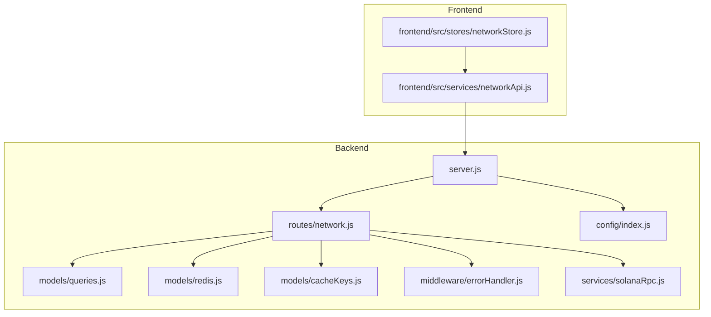
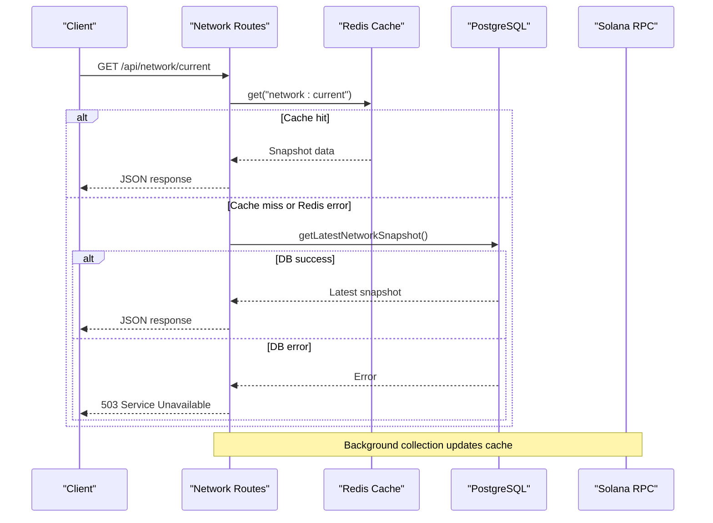
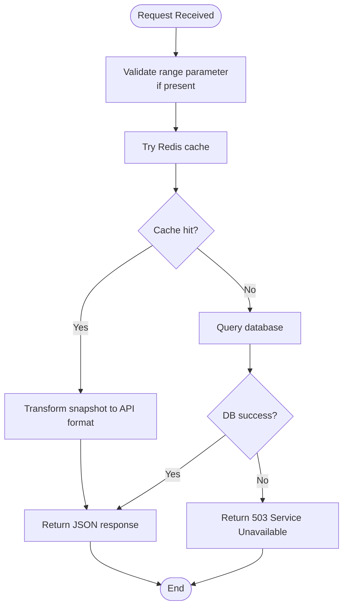
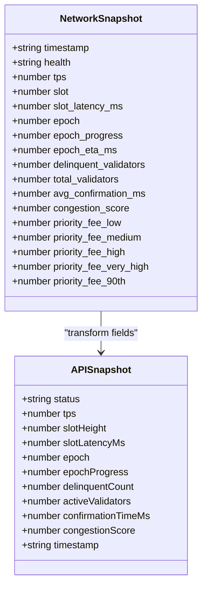
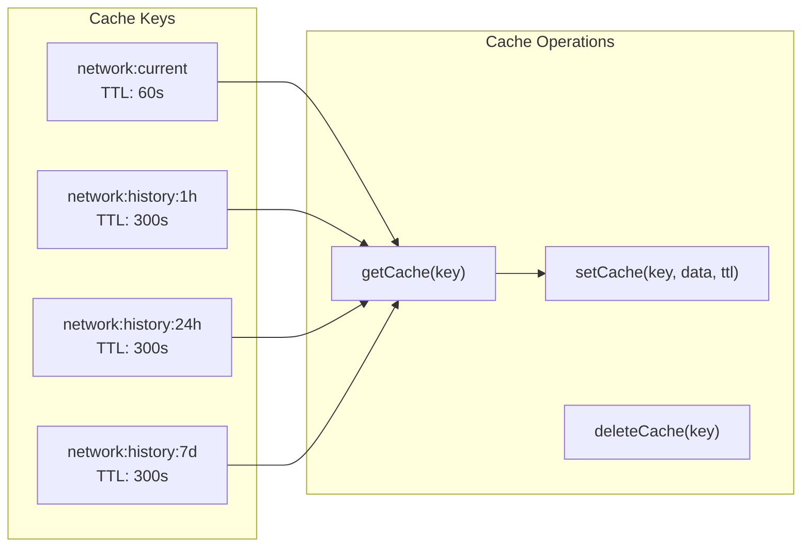
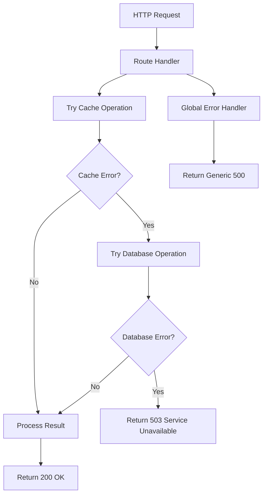
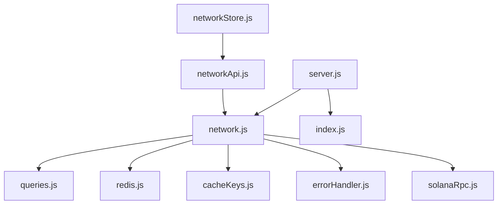

# Network API

<cite>
**Referenced Files in This Document**
- [server.js](file://backend/server.js)
- [network.js](file://backend/src/routes/network.js)
- [queries.js](file://backend/src/models/queries.js)
- [redis.js](file://backend/src/models/redis.js)
- [cacheKeys.js](file://backend/src/models/cacheKeys.js)
- [errorHandler.js](file://backend/src/middleware/errorHandler.js)
- [solanaRpc.js](file://backend/src/services/solanaRpc.js)
- [index.js](file://backend/src/config/index.js)
- [networkApi.js](file://frontend/src/services/networkApi.js)
- [networkStore.js](file://frontend/src/stores/networkStore.js)
</cite>

## Table of Contents
1. [Introduction](#introduction)
2. [Project Structure](#project-structure)
3. [Core Components](#core-components)
4. [Architecture Overview](#architecture-overview)
5. [Detailed Component Analysis](#detailed-component-analysis)
6. [Dependency Analysis](#dependency-analysis)
7. [Performance Considerations](#performance-considerations)
8. [Troubleshooting Guide](#troubleshooting-guide)
9. [Conclusion](#conclusion)

## Introduction
This document provides comprehensive API documentation for the Network API endpoints that power real-time network monitoring for the Solana ecosystem. It covers:
- GET /api/network/current: Real-time network status including TPS, slot height, latency, epoch progress, validator counts, and congestion metrics
- GET /api/network/history: Historical network data with configurable time ranges (1h, 24h, 7d)

The documentation includes request/response schemas, parameter validation, caching strategy with Redis fallback, error handling patterns, and performance considerations for real-time monitoring.

## Project Structure
The Network API is implemented in the backend Express application with a layered architecture:
- Route handlers define the API endpoints and orchestrate data retrieval
- Data Access Layer (DAL) handles database queries
- Redis module provides caching with TTL management
- Solana RPC service collects real-time metrics from the Solana network
- Middleware provides global error handling and request parsing

**Diagram sources**
- [server.js:1-128](file://backend/server.js#L1-L128)
- [network.js:1-135](file://backend/src/routes/network.js#L1-L135)
- [queries.js:1-459](file://backend/src/models/queries.js#L1-L459)
- [redis.js:1-161](file://backend/src/models/redis.js#L1-L161)
- [cacheKeys.js:1-50](file://backend/src/models/cacheKeys.js#L1-L50)
- [errorHandler.js:1-127](file://backend/src/middleware/errorHandler.js#L1-L127)
- [solanaRpc.js:1-340](file://backend/src/services/solanaRpc.js#L1-L340)
- [index.js:1-68](file://backend/src/config/index.js#L1-L68)
- [networkApi.js:1-6](file://frontend/src/services/networkApi.js#L1-L6)
- [networkStore.js:1-25](file://frontend/src/stores/networkStore.js#L1-L25)

**Section sources**
- [server.js:1-128](file://backend/server.js#L1-L128)
- [network.js:1-135](file://backend/src/routes/network.js#L1-L135)

## Core Components
This section documents the two primary Network API endpoints with their request/response schemas, validation, and behavior.

### GET /api/network/current
Returns the current real-time network status snapshot.

- Method: GET
- Path: /api/network/current
- Authentication: None
- Caching: Cache-first with Redis fallback to database

Response Schema (success):
- status: string - Network health status (e.g., "UP", "DOWN", "unknown")
- tps: number - Transactions per second (rounded to 2 decimals)
- slotHeight: number - Current slot height
- slotLatencyMs: number - Estimated slot latency in milliseconds
- epoch: number - Current epoch number
- epochProgress: number - Epoch progress percentage (0-100)
- delinquentCount: number - Number of delinquent validators
- activeValidators: number - Total active validators
- confirmationTimeMs: number - Average confirmation time in milliseconds
- congestionScore: number - Network congestion score (0-100)
- timestamp: string - ISO 8601 timestamp of the snapshot

Example Response:
{
  "status": "UP",
  "tps": 1234.56,
  "slotHeight": 123456789,
  "slotLatencyMs": 450,
  "epoch": 456,
  "epochProgress": 78.9,
  "delinquentCount": 12,
  "activeValidators": 456,
  "confirmationTimeMs": 850,
  "congestionScore": 45,
  "timestamp": "2024-01-01T12:00:00.000Z"
}

Behavior:
- Cache-first pattern: Attempts to retrieve from Redis using key "network:current"
- TTL: 60 seconds
- If cache miss or Redis unavailable, falls back to database query for latest snapshot
- On DB failure, returns 503 Service Unavailable with structured error payload
- On no data available, returns 503 No network data available

**Section sources**
- [network.js:17-79](file://backend/src/routes/network.js#L17-L79)
- [cacheKeys.js:8](file://backend/src/models/cacheKeys.js#L8)
- [queries.js:54-62](file://backend/src/models/queries.js#L54-L62)

### GET /api/network/history
Returns historical network snapshots for charting and analytics.

- Method: GET
- Path: /api/network/history
- Query Parameters:
  - range: string - Time range selector (required)
    - Valid values: "1h", "24h", "7d"
    - Default: "1h"
- Authentication: None
- Caching: Cache-first with Redis fallback to database

Response Schema (success):
Array of historical snapshots, each with the same fields as current endpoint:
- status, tps, slotHeight, slotLatencyMs, epoch, epochProgress, delinquentCount, activeValidators, confirmationTimeMs, congestionScore, timestamp

Behavior:
- Validates range parameter against allowed values
- Cache-first pattern: Uses key "network:history:{range}" with TTL 300 seconds
- If cache miss or Redis unavailable, queries database for snapshots within the specified time window
- On DB failure, returns empty array [] (non-fatal)
- On successful DB retrieval, caches the result for future requests

Example Request:
GET /api/network/history?range=24h

Example Response (first few entries):
[
  {
    "status": "UP",
    "tps": 1200.0,
    "slotHeight": 123456000,
    "slotLatencyMs": 420,
    "epoch": 456,
    "epochProgress": 65.2,
    "delinquentCount": 15,
    "activeValidators": 456,
    "confirmationTimeMs": 800,
    "congestionScore": 40,
    "timestamp": "2024-01-01T11:00:00.000Z"
  },
  ...
]

**Section sources**
- [network.js:85-132](file://backend/src/routes/network.js#L85-L132)
- [cacheKeys.js:40](file://backend/src/models/cacheKeys.js#L40)
- [queries.js:69-84](file://backend/src/models/queries.js#L69-L84)

## Architecture Overview
The Network API follows a cache-first architecture designed for low-latency real-time monitoring:

**Diagram sources**
- [network.js:17-79](file://backend/src/routes/network.js#L17-L79)
- [redis.js:75-90](file://backend/src/models/redis.js#L75-L90)
- [queries.js:54-62](file://backend/src/models/queries.js#L54-L62)

## Detailed Component Analysis

### Route Handler Implementation
The route handlers implement a robust cache-first pattern with comprehensive error handling:

**Diagram sources**
- [network.js:85-132](file://backend/src/routes/network.js#L85-L132)

Key implementation details:
- Parameter validation ensures only allowed range values are accepted
- Redis operations are wrapped in try-catch blocks to prevent failures from blocking requests
- Database fallback provides resilience during data collection outages
- Response transformation maintains consistent field naming across cache and database sources

**Section sources**
- [network.js:17-132](file://backend/src/routes/network.js#L17-L132)

### Data Transformation Logic
The API normalizes data from multiple sources into a unified response format:

**Diagram sources**
- [solanaRpc.js:303-321](file://backend/src/services/solanaRpc.js#L303-L321)
- [network.js:29-75](file://backend/src/routes/network.js#L29-L75)

Field mapping highlights:
- health → status
- slot → slotHeight
- slot_latency_ms → slotLatencyMs
- delinquent_validators → delinquentCount
- total_validators → activeValidators
- avg_confirmation_ms → confirmationTimeMs

**Section sources**
- [solanaRpc.js:303-321](file://backend/src/services/solanaRpc.js#L303-L321)
- [network.js:29-75](file://backend/src/routes/network.js#L29-L75)

### Cache Management Strategy
Redis caching follows a TTL-based expiration model optimized for real-time monitoring:

**Diagram sources**
- [cacheKeys.js:8](file://backend/src/models/cacheKeys.js#L8)
- [cacheKeys.js:40](file://backend/src/models/cacheKeys.js#L40)
- [redis.js:75-112](file://backend/src/models/redis.js#L75-L112)

Cache TTL strategy:
- Critical data (current network status): 60 seconds
- Historical data: 300 seconds (5 minutes)
- Automatic cleanup prevents memory bloat
- Non-critical cache failures don't impact API availability

**Section sources**
- [cacheKeys.js:43-48](file://backend/src/models/cacheKeys.js#L43-L48)
- [redis.js:99-112](file://backend/src/models/redis.js#L99-L112)

### Error Handling Patterns
The API implements comprehensive error handling across all layers:

**Diagram sources**
- [network.js:17-79](file://backend/src/routes/network.js#L17-L79)
- [errorHandler.js:44-109](file://backend/src/middleware/errorHandler.js#L44-L109)

Error scenarios:
- Validation errors: 400 Bad Request with field information
- Service unavailability: 503 Service Unavailable with contextual messages
- Database failures: Graceful degradation to cache or empty responses
- Unknown errors: 500 Internal Server Error with controlled message exposure

**Section sources**
- [network.js:89-96](file://backend/src/routes/network.js#L89-L96)
- [errorHandler.js:56-109](file://backend/src/middleware/errorHandler.js#L56-L109)

## Dependency Analysis
The Network API components have minimal coupling and clear separation of concerns:

**Diagram sources**
- [network.js:1-135](file://backend/src/routes/network.js#L1-L135)
- [queries.js:1-459](file://backend/src/models/queries.js#L1-L459)
- [redis.js:1-161](file://backend/src/models/redis.js#L1-L161)
- [cacheKeys.js:1-50](file://backend/src/models/cacheKeys.js#L1-L50)
- [errorHandler.js:1-127](file://backend/src/middleware/errorHandler.js#L1-L127)
- [solanaRpc.js:1-340](file://backend/src/services/solanaRpc.js#L1-L340)
- [server.js:1-128](file://backend/server.js#L1-L128)
- [index.js:1-68](file://backend/src/config/index.js#L1-L68)
- [networkApi.js:1-6](file://frontend/src/services/networkApi.js#L1-L6)
- [networkStore.js:1-25](file://frontend/src/stores/networkStore.js#L1-L25)

Key dependencies:
- Routes depend on Redis for caching and Queries for persistence
- Solana RPC service provides real-time metrics used in background collection
- Frontend consumes standardized API responses for dashboard rendering
- Configuration module centralizes environment-specific settings

**Section sources**
- [network.js:8-10](file://backend/src/routes/network.js#L8-L10)
- [server.js:23-31](file://backend/server.js#L23-L31)

## Performance Considerations
The Network API is optimized for real-time monitoring with several performance strategies:

### Caching Strategy
- **Cache-first architecture**: Minimizes database load and reduces response times
- **TTL optimization**: Short TTL for current data (60s) balances freshness with performance
- **Background updates**: Real-time metrics are collected periodically and cached for immediate retrieval
- **Non-blocking cache failures**: Cache errors don't prevent API responses

### Database Optimization
- **Parameterized queries**: Prevents SQL injection and enables query plan reuse
- **Selective field retrieval**: Only required fields are fetched for current endpoint
- **Ordered queries**: Latest snapshot queries use appropriate ordering for optimal performance
- **Interval-based filtering**: Historical queries use efficient timestamp comparisons

### Network Monitoring Metrics
The system calculates key metrics for congestion assessment:
- **TPS-based congestion**: Linear scoring from 500 TPS (100%) to 3000 TPS (0%)
- **Priority fee correlation**: Logarithmic scaling from 1000 to 100000 microlamports
- **Slot latency impact**: Linear scoring from 450ms to 1000ms
- **Weighted composite score**: 40% TPS + 30% fees + 30% latency

### Frontend Integration
- **Store-based state management**: Efficient updates without unnecessary re-renders
- **Range selection**: Supports 1h/24h/7d views for different monitoring contexts
- **Connection state tracking**: Enables user feedback for service availability

**Section sources**
- [solanaRpc.js:228-268](file://backend/src/services/solanaRpc.js#L228-L268)
- [network.js:17-79](file://backend/src/routes/network.js#L17-L79)

## Troubleshooting Guide

### Common Issues and Resolutions

**Service Unavailable (503)**
- Symptom: "Service unavailable" or "No network data available" responses
- Causes: Database collection startup, Redis connectivity issues, or background data pipeline not ready
- Resolution: Wait for initial data collection to complete; check server logs for initialization errors

**Invalid Range Parameter (400)**
- Symptom: "Invalid range parameter" with valid ranges list
- Causes: Unsupported range value in history endpoint
- Resolution: Use only "1h", "24h", or "7d" values

**Cache-related Issues**
- Symptom: Slow responses despite healthy database
- Causes: Redis connectivity problems or cache corruption
- Resolution: Verify Redis service availability; check cache keys and TTL configuration

**Monitoring Data Gaps**
- Symptom: Empty history arrays or missing recent data
- Causes: Database query failures or insufficient historical data
- Resolution: Check database connectivity and retention policies

### Debugging Steps
1. **Health Check**: Verify service availability at `/api/health`
2. **Cache Inspection**: Check Redis keys existence and TTL values
3. **Database Connectivity**: Test direct database queries for network snapshots
4. **Error Logs**: Review server logs for detailed error information
5. **Frontend State**: Monitor network store state for connection and update timestamps

**Section sources**
- [network.js:49-61](file://backend/src/routes/network.js#L49-L61)
- [network.js:91-96](file://backend/src/routes/network.js#L91-L96)
- [errorHandler.js:44-109](file://backend/src/middleware/errorHandler.js#L44-L109)

## Conclusion
The Network API provides a robust foundation for real-time Solana network monitoring with:
- Low-latency cache-first architecture ensuring responsive user experiences
- Comprehensive error handling enabling graceful degradation during outages
- Standardized response schemas compatible with frontend dashboard components
- Performance optimizations tailored for continuous monitoring scenarios

The implementation demonstrates best practices in API design, caching strategy, and error management while maintaining flexibility for future enhancements and monitoring use cases.