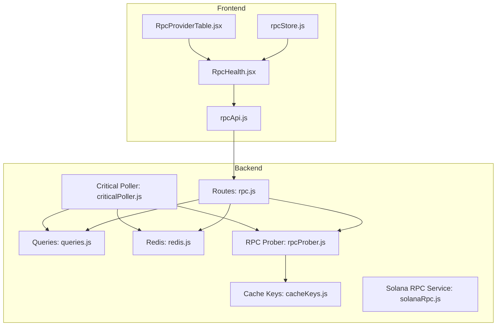
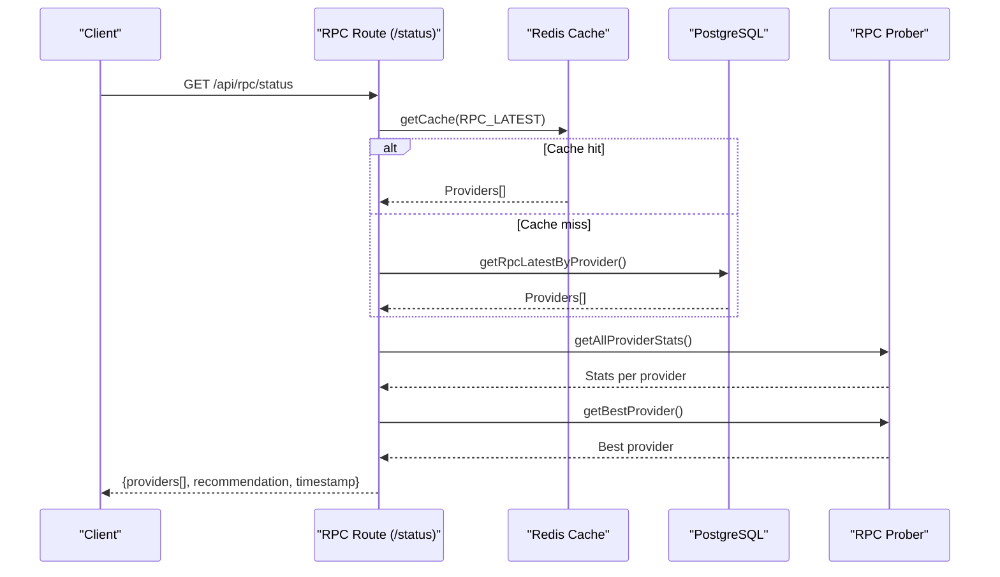
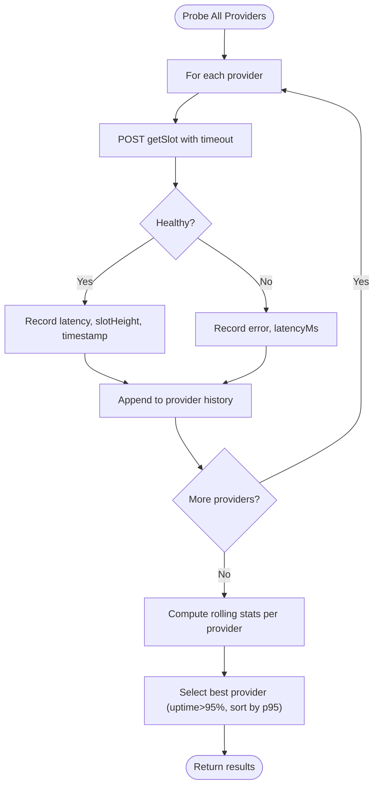
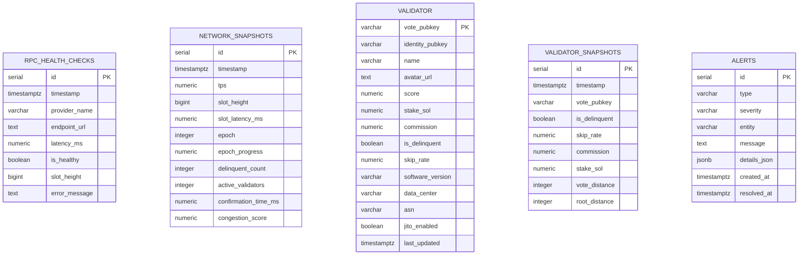
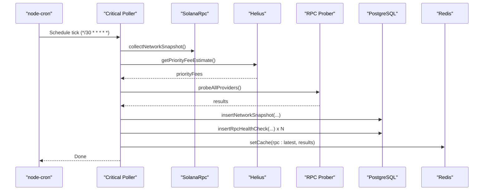
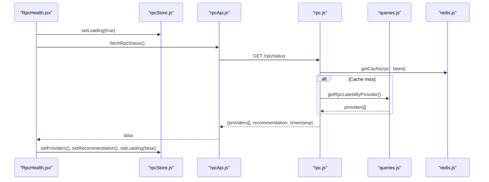
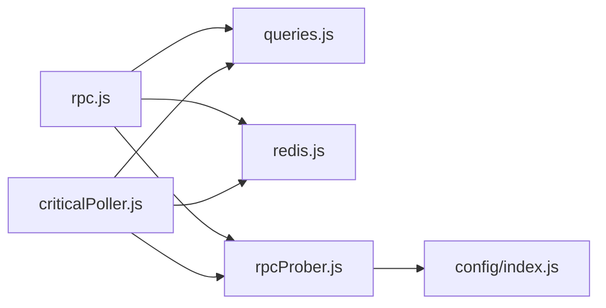

# RPC API

<cite>
**Referenced Files in This Document**
- [rpc.js](file://backend/src/routes/rpc.js)
- [rpcProber.js](file://backend/src/services/rpcProber.js)
- [solanaRpc.js](file://backend/src/services/solanaRpc.js)
- [queries.js](file://backend/src/models/queries.js)
- [cacheKeys.js](file://backend/src/models/cacheKeys.js)
- [redis.js](file://backend/src/models/redis.js)
- [criticalPoller.js](file://backend/src/jobs/criticalPoller.js)
- [migrate.js](file://backend/src/models/migrate.js)
- [rpcApi.js](file://frontend/src/services/rpcApi.js)
- [RpcHealth.jsx](file://frontend/src/pages/RpcHealth.jsx)
- [RpcProviderTable.jsx](file://frontend/src/components/rpc/RpcProviderTable.jsx)
- [rpcStore.js](file://frontend/src/stores/rpcStore.js)
</cite>

## Table of Contents
1. [Introduction](#introduction)
2. [Project Structure](#project-structure)
3. [Core Components](#core-components)
4. [Architecture Overview](#architecture-overview)
5. [Detailed Component Analysis](#detailed-component-analysis)
6. [Dependency Analysis](#dependency-analysis)
7. [Performance Considerations](#performance-considerations)
8. [Troubleshooting Guide](#troubleshooting-guide)
9. [Conclusion](#conclusion)
10. [Appendices](#appendices)

## Introduction
This document provides comprehensive API documentation for the RPC API endpoints that power health monitoring, performance metrics collection, and provider recommendations for Solana RPC providers. It covers:
- Endpoints for retrieving RPC provider status, uptime statistics, latency measurements, and health check results
- The RPC prober service integration and provider scoring algorithms
- Failover recommendation logic and selection criteria
- Request/response schemas and integration patterns for application developers

## Project Structure
The RPC API is implemented as part of a backend Express application with scheduled jobs that probe RPC endpoints, persist results, and expose them via REST endpoints. Frontend components consume these endpoints to render provider health and recommendations.

**Diagram sources**
- [rpc.js:1-135](file://backend/src/routes/rpc.js#L1-L135)
- [rpcProber.js:1-342](file://backend/src/services/rpcProber.js#L1-L342)
- [solanaRpc.js:1-340](file://backend/src/services/solanaRpc.js#L1-L340)
- [queries.js:1-459](file://backend/src/models/queries.js#L1-L459)
- [cacheKeys.js:1-50](file://backend/src/models/cacheKeys.js#L1-L50)
- [redis.js:1-161](file://backend/src/models/redis.js#L1-L161)
- [criticalPoller.js:1-108](file://backend/src/jobs/criticalPoller.js#L1-L108)
- [rpcApi.js:1-7](file://frontend/src/services/rpcApi.js#L1-L7)
- [RpcHealth.jsx:1-153](file://frontend/src/pages/RpcHealth.jsx#L1-L153)
- [RpcProviderTable.jsx:1-177](file://frontend/src/components/rpc/RpcProviderTable.jsx#L1-L177)
- [rpcStore.js:1-16](file://frontend/src/stores/rpcStore.js#L1-L16)

**Section sources**
- [rpc.js:1-135](file://backend/src/routes/rpc.js#L1-L135)
- [rpcProber.js:1-342](file://backend/src/services/rpcProber.js#L1-L342)
- [solanaRpc.js:1-340](file://backend/src/services/solanaRpc.js#L1-L340)
- [queries.js:1-459](file://backend/src/models/queries.js#L1-L459)
- [cacheKeys.js:1-50](file://backend/src/models/cacheKeys.js#L1-L50)
- [redis.js:1-161](file://backend/src/models/redis.js#L1-L161)
- [criticalPoller.js:1-108](file://backend/src/jobs/criticalPoller.js#L1-L108)
- [rpcApi.js:1-7](file://frontend/src/services/rpcApi.js#L1-L7)
- [RpcHealth.jsx:1-153](file://frontend/src/pages/RpcHealth.jsx#L1-L153)
- [RpcProviderTable.jsx:1-177](file://frontend/src/components/rpc/RpcProviderTable.jsx#L1-L177)
- [rpcStore.js:1-16](file://frontend/src/stores/rpcStore.js#L1-L16)

## Core Components
- RPC Routes: Expose endpoints for provider status and history.
- RPC Prober: Probes providers, computes rolling statistics, and selects the best provider.
- Data Access Layer: Inserts and retrieves RPC health checks and network snapshots.
- Caching: Redis-backed cache keys for fast retrieval of latest results.
- Scheduler: Periodic job that probes providers, writes to DB and cache, and emits updates.
- Frontend Services/Pages: Consume endpoints and render provider health and recommendations.

**Section sources**
- [rpc.js:13-88](file://backend/src/routes/rpc.js#L13-L88)
- [rpcProber.js:291-307](file://backend/src/services/rpcProber.js#L291-L307)
- [queries.js:124-156](file://backend/src/models/queries.js#L124-L156)
- [cacheKeys.js:6-48](file://backend/src/models/cacheKeys.js#L6-L48)
- [criticalPoller.js:21-103](file://backend/src/jobs/criticalPoller.js#L21-L103)

## Architecture Overview
The system runs a periodic critical poller that:
- Probes RPC providers and records health checks
- Collects network metrics and optionally enhances congestion scores with priority fees
- Writes results to PostgreSQL and caches them in Redis
- Emits real-time updates via WebSocket

Clients call the REST endpoints to retrieve:
- Current provider status with rolling statistics and a recommended provider
- Historical health data for a specific provider and time range

**Diagram sources**
- [rpc.js:17-88](file://backend/src/routes/rpc.js#L17-L88)
- [redis.js:75-90](file://backend/src/models/redis.js#L75-L90)
- [queries.js:124-132](file://backend/src/models/queries.js#L124-L132)
- [rpcProber.js:256-272](file://backend/src/services/rpcProber.js#L256-L272)
- [rpcProber.js:295-307](file://backend/src/services/rpcProber.js#L295-L307)

## Detailed Component Analysis

### Endpoint: GET /api/rpc/status
Purpose: Returns current RPC provider status, rolling latency percentiles, uptime, and a recommended provider.

Behavior:
- Attempts to read latest provider results from Redis cache keyed by RPC_LATEST.
- Falls back to reading the latest record per provider from PostgreSQL if cache is unavailable.
- Computes rolling statistics per provider using the RPC prober’s stats engine.
- Merges stats into provider entries and determines the best provider based on uptime and latency thresholds.
- Returns a payload containing providers, recommendation, and a server timestamp.

Response schema:
- providers[]: Array of provider entries with:
  - providerName: string
  - endpoint: string
  - latencyMs: number
  - isHealthy: boolean
  - slotHeight: number
  - error: string|null
  - timestamp: string (ISO 8601)
  - stats: object with:
    - p50: number
    - p95: number
    - p99: number
    - uptimePercent: number
    - totalChecks: number
    - healthyChecks: number
    - lastIncident: string|null
  - category: string
  - requiresKey: boolean
  - note: string|null
- recommendation: object|null with:
  - name: string
  - latencyMs: number
  - uptimePercent: number
- timestamp: string (ISO 8601)

Caching and fallback:
- Cache key: rpc:latest with TTL defined in cacheKeys.
- Fallback DB query uses DISTINCT ON to get the latest record per provider.

Integration pattern:
- Frontend calls fetchRpcStatus() and updates local store and UI.

**Section sources**
- [rpc.js:17-88](file://backend/src/routes/rpc.js#L17-L88)
- [cacheKeys.js:8-9](file://backend/src/models/cacheKeys.js#L8-L9)
- [queries.js:124-132](file://backend/src/models/queries.js#L124-L132)
- [rpcProber.js:256-272](file://backend/src/services/rpcProber.js#L256-L272)
- [rpcProber.js:295-307](file://backend/src/services/rpcProber.js#L295-L307)
- [rpcApi.js:3](file://frontend/src/services/rpcApi.js#L3)
- [RpcHealth.jsx:23-39](file://frontend/src/pages/RpcHealth.jsx#L23-L39)
- [rpcStore.js:3-13](file://frontend/src/stores/rpcStore.js#L3-L13)

### Endpoint: GET /api/rpc/:provider/history
Purpose: Retrieves historical health data for a specific provider within a given time range.

Parameters:
- provider: string (provider name)
- range: string, one of 1h|24h|7d (default: 1h)

Validation:
- Returns 400 with validRanges array if range is invalid.

Response schema:
- Array of health check entries with:
  - providerName: string
  - endpoint: string
  - latencyMs: number
  - isHealthy: boolean
  - slotHeight: number
  - error: string|null
  - timestamp: string (ISO 8601)

Notes:
- Results are returned in ascending timestamp order.
- On DB failure, returns an empty array.

**Section sources**
- [rpc.js:94-132](file://backend/src/routes/rpc.js#L94-L132)
- [queries.js:140-156](file://backend/src/models/queries.js#L140-L156)
- [rpcApi.js:5-6](file://frontend/src/services/rpcApi.js#L5-L6)

### RPC Prober Service
Responsibilities:
- Maintains a static list of RPC providers (public and premium tiers).
- Probes each provider via HTTP POST to getSlot with a short timeout.
- Tracks latest probe results and maintains a bounded history per provider.
- Computes rolling statistics (percentiles, uptime, last incident).
- Selects the best provider based on uptime and latency thresholds.

Key algorithms:
- Percentile calculation: Interpolated percentile over recent healthy latency samples.
- Uptime computation: Healthy checks / total checks × 100.
- Best provider selection: Filters providers with uptime > 95% and total checks > 0, sorts by p95 latency ascending.

**Diagram sources**
- [rpcProber.js:140-180](file://backend/src/services/rpcProber.js#L140-L180)
- [rpcProber.js:188-200](file://backend/src/services/rpcProber.js#L188-L200)
- [rpcProber.js:208-250](file://backend/src/services/rpcProber.js#L208-L250)
- [rpcProber.js:295-307](file://backend/src/services/rpcProber.js#L295-L307)

**Section sources**
- [rpcProber.js:11-63](file://backend/src/services/rpcProber.js#L11-L63)
- [rpcProber.js:75-134](file://backend/src/services/rpcProber.js#L75-L134)
- [rpcProber.js:188-250](file://backend/src/services/rpcProber.js#L188-L250)
- [rpcProber.js:295-307](file://backend/src/services/rpcProber.js#L295-L307)

### Data Persistence and Caching
- PostgreSQL tables:
  - rpc_health_checks: Stores per-provider health checks with timestamps, latency, health status, slot height, and optional error messages.
  - network_snapshots: Stores periodic network metrics snapshots.
- Redis cache:
  - Keys: rpc:latest and rpc:{provider}:latest with short TTLs.
  - Operations: setCache/getCache/deleteCache.

**Diagram sources**
- [migrate.js:11-94](file://backend/src/models/migrate.js#L11-L94)

**Section sources**
- [queries.js:101-118](file://backend/src/models/queries.js#L101-L118)
- [queries.js:124-156](file://backend/src/models/queries.js#L124-L156)
- [cacheKeys.js:8-18](file://backend/src/models/cacheKeys.js#L8-L18)
- [redis.js:75-112](file://backend/src/models/redis.js#L75-L112)

### Scheduler Integration
- Critical Poller (every 30 seconds):
  - Collects network snapshot and optional congestion score enhancement.
  - Probes RPC providers and persists results to DB.
  - Updates Redis cache with latest network and RPC data.
  - Emits WebSocket events for real-time updates.

**Diagram sources**
- [criticalPoller.js:21-103](file://backend/src/jobs/criticalPoller.js#L21-L103)
- [solanaRpc.js:275-328](file://backend/src/services/solanaRpc.js#L275-L328)
- [rpcProber.js:140-180](file://backend/src/services/rpcProber.js#L140-L180)

**Section sources**
- [criticalPoller.js:21-103](file://backend/src/jobs/criticalPoller.js#L21-L103)
- [solanaRpc.js:275-328](file://backend/src/services/solanaRpc.js#L275-L328)

### Frontend Integration Patterns
- Service layer: rpcApi.js wraps REST calls for status and history.
- Page: RpcHealth.jsx fetches data periodically and renders RpcProviderTable.jsx.
- Table: Renders provider status, latency percentiles, uptime, and last incident with sorting and coloring.
- Store: rpcStore.js holds providers, recommendation, loading, and error states.

**Diagram sources**
- [RpcHealth.jsx:23-39](file://frontend/src/pages/RpcHealth.jsx#L23-L39)
- [rpcStore.js:3-13](file://frontend/src/stores/rpcStore.js#L3-L13)
- [rpcApi.js:3](file://frontend/src/services/rpcApi.js#L3)
- [rpc.js:17-88](file://backend/src/routes/rpc.js#L17-L88)
- [redis.js:75-90](file://backend/src/models/redis.js#L75-L90)
- [queries.js:124-132](file://backend/src/models/queries.js#L124-L132)

**Section sources**
- [rpcApi.js:1-7](file://frontend/src/services/rpcApi.js#L1-L7)
- [RpcHealth.jsx:1-153](file://frontend/src/pages/RpcHealth.jsx#L1-L153)
- [RpcProviderTable.jsx:1-177](file://frontend/src/components/rpc/RpcProviderTable.jsx#L1-L177)
- [rpcStore.js:1-16](file://frontend/src/stores/rpcStore.js#L1-L16)

## Dependency Analysis
- Routes depend on:
  - Queries for DB access
  - Redis for cache reads/writes
  - RPC Prober for rolling stats and best provider selection
- RPC Prober depends on:
  - Config for provider endpoints and keys
  - Axios for HTTP requests
- Scheduler depends on:
  - RPC Prober, Queries, Redis, and emits WebSocket updates

**Diagram sources**
- [rpc.js:8-11](file://backend/src/routes/rpc.js#L8-L11)
- [rpcProber.js:6-7](file://backend/src/services/rpcProber.js#L6-L7)
- [criticalPoller.js:10-13](file://backend/src/jobs/criticalPoller.js#L10-L13)

**Section sources**
- [rpc.js:8-11](file://backend/src/routes/rpc.js#L8-L11)
- [rpcProber.js:6-7](file://backend/src/services/rpcProber.js#L6-L7)
- [criticalPoller.js:10-13](file://backend/src/jobs/criticalPoller.js#L10-L13)

## Performance Considerations
- Latency measurement: Uses client-side timing around HTTP requests; ensure network conditions are considered when interpreting latencyMs.
- Percentile calculation: Interpolated percentile computed over recent healthy samples; stability improves with more samples.
- Uptime threshold: Best provider selection filters by uptime > 95%; adjust thresholds based on operational requirements.
- Caching: Short TTLs (e.g., 60s) balance freshness and performance; Redis unavailability falls back to DB.
- Concurrency: Probes run concurrently per provider; timeouts are enforced to avoid blocking.

[No sources needed since this section provides general guidance]

## Troubleshooting Guide
Common issues and resolutions:
- Empty or stale provider list:
  - Verify Redis connectivity and cache keys; fallback to DB is automatic.
  - Confirm scheduler is running and inserting records into rpc_health_checks.
- Invalid range parameter:
  - Ensure range is one of 1h|24h|7d; the route returns a 400 with validRanges.
- DB unavailability:
  - Routes return empty arrays or partial data gracefully; monitor logs for warnings.
- Provider requiring API key:
  - Premium providers may require environment variables; check notes and configuration.

Operational checks:
- Confirm DATABASE_URL and REDIS_URL are set.
- Validate HELIUS_API_KEY or provider-specific environment variables if using premium endpoints.
- Inspect scheduler logs for errors during probing or DB/Redis operations.

**Section sources**
- [rpc.js:100-106](file://backend/src/routes/rpc.js#L100-L106)
- [redis.js:21-24](file://backend/src/models/redis.js#L21-L24)
- [criticalPoller.js:61-86](file://backend/src/jobs/criticalPoller.js#L61-L86)

## Conclusion
The RPC API provides a robust foundation for monitoring Solana RPC provider health, computing performance metrics, and recommending reliable endpoints. Its design emphasizes resilience through caching and fallbacks, real-time updates via scheduling, and a clear separation of concerns across routes, services, and persistence layers. Developers can integrate these endpoints to build resilient applications that automatically select optimal RPC providers based on current conditions.

[No sources needed since this section summarizes without analyzing specific files]

## Appendices

### API Definitions

- GET /api/rpc/status
  - Description: Retrieve current RPC provider status, rolling statistics, and recommendation.
  - Response: See “Response schema” under “Endpoint: GET /api/rpc/status”.

- GET /api/rpc/:provider/history?range=1h|24h|7d
  - Description: Retrieve historical health data for a specific provider within a given time range.
  - Path parameters:
    - provider: string (provider name)
  - Query parameters:
    - range: string, one of 1h|24h|7d (default: 1h)
  - Response: See “Response schema” under “Endpoint: GET /api/rpc/:provider/history”.

### Provider Selection Criteria and Thresholds
- Best provider selection:
  - Requires uptimePercent > 95 and totalChecks > 0.
  - Sorts by p95 latency ascending to minimize tail latency.
- Rolling statistics:
  - Percentiles computed from recent healthy latency samples.
  - Uptime calculated as healthyChecks / totalChecks × 100.

**Section sources**
- [rpcProber.js:295-307](file://backend/src/services/rpcProber.js#L295-L307)
- [rpcProber.js:208-250](file://backend/src/services/rpcProber.js#L208-L250)