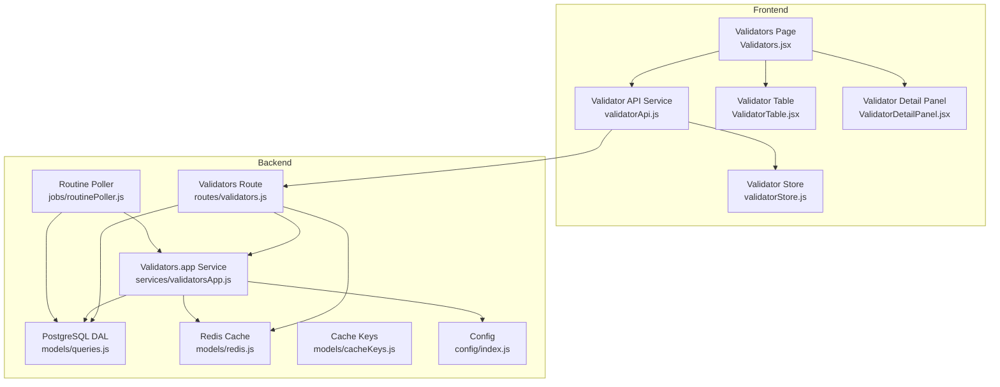
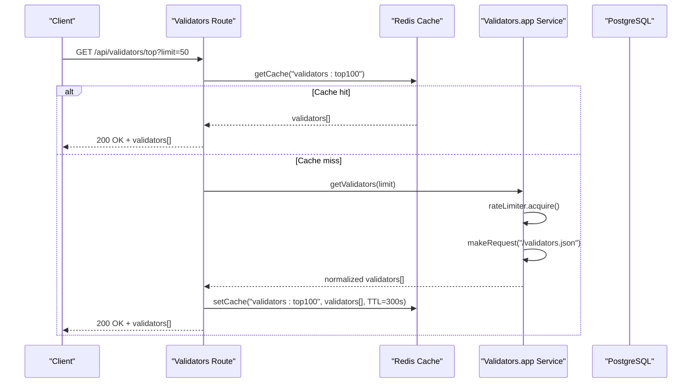
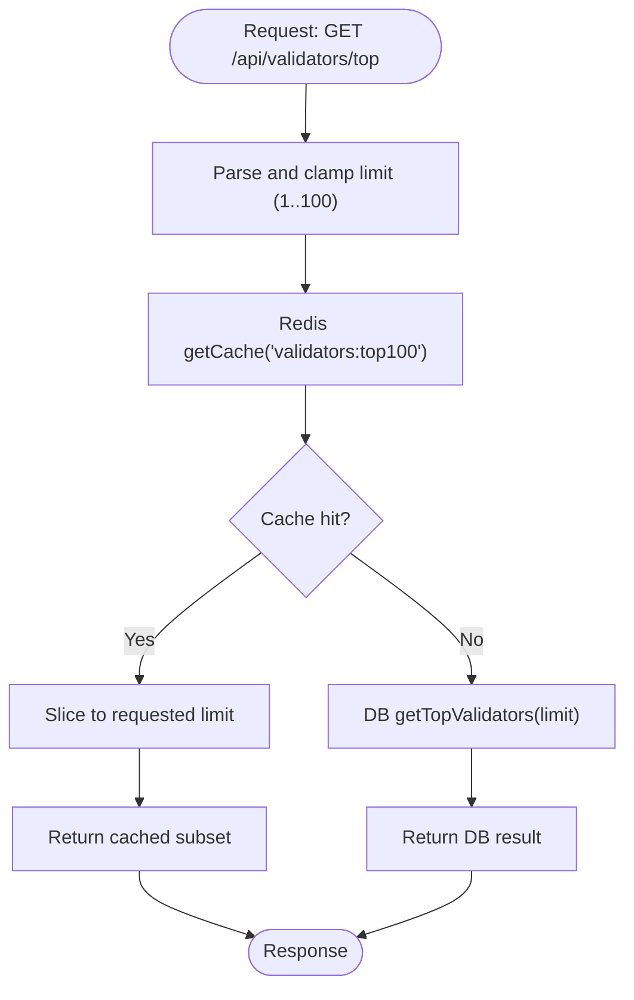
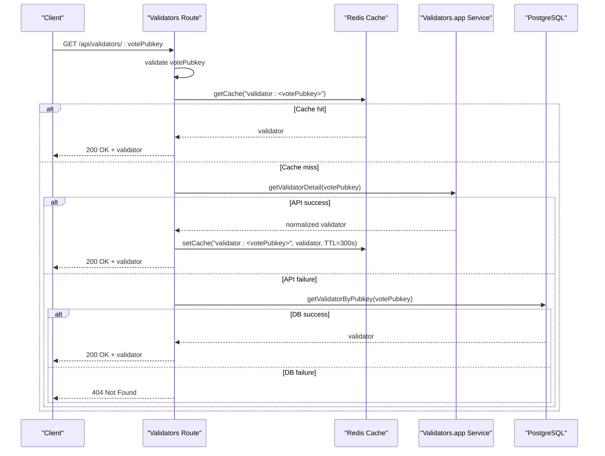
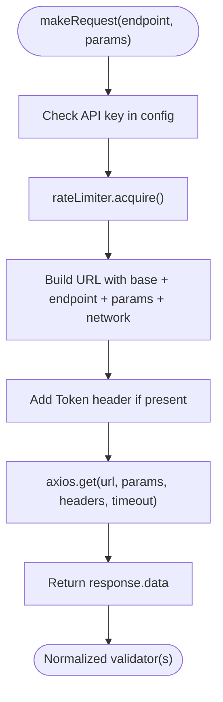
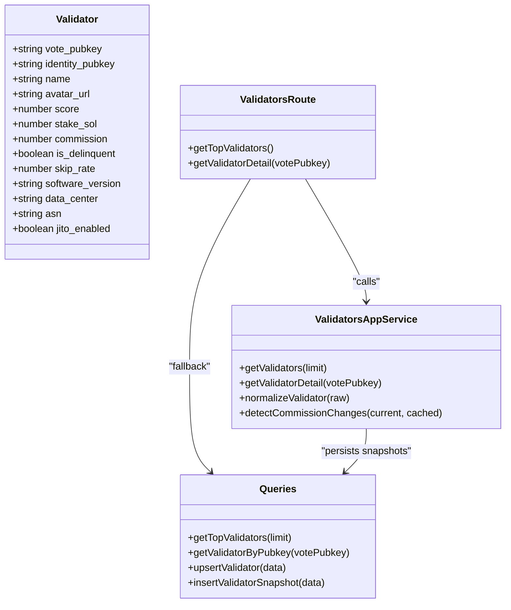
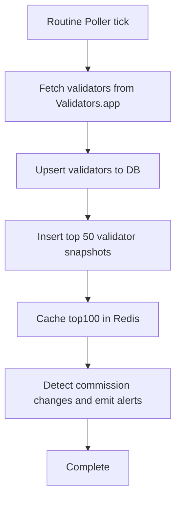
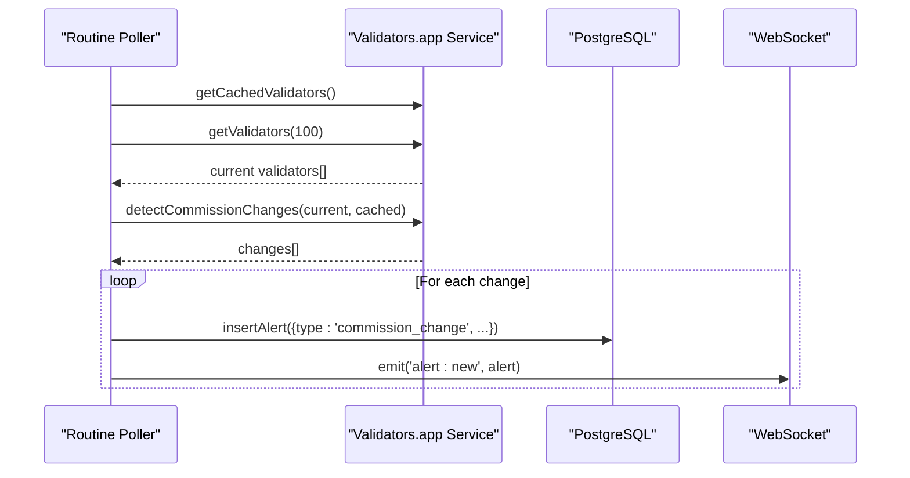
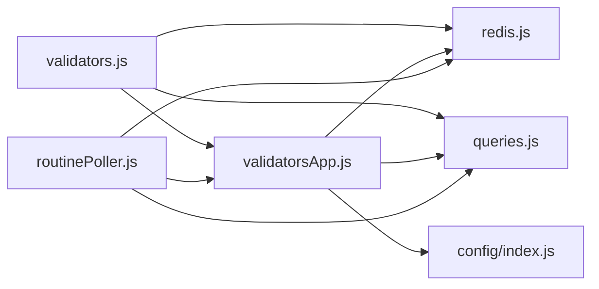

# Validators API

<cite>
**Referenced Files in This Document**
- [validators.js](file://backend/src/routes/validators.js)
- [validatorsApp.js](file://backend/src/services/validatorsApp.js)
- [queries.js](file://backend/src/models/queries.js)
- [cacheKeys.js](file://backend/src/models/cacheKeys.js)
- [redis.js](file://backend/src/models/redis.js)
- [config/index.js](file://backend/src/config/index.js)
- [routinePoller.js](file://backend/src/jobs/routinePoller.js)
- [validatorApi.js](file://frontend/src/services/validatorApi.js)
- [validatorStore.js](file://frontend/src/stores/validatorStore.js)
- [Validators.jsx](file://frontend/src/pages/Validators.jsx)
- [ValidatorTable.jsx](file://frontend/src/components/validators/ValidatorTable.jsx)
- [ValidatorDetailPanel.jsx](file://frontend/src/components/validators/ValidatorDetailPanel.jsx)
</cite>

## Table of Contents
1. [Introduction](#introduction)
2. [Project Structure](#project-structure)
3. [Core Components](#core-components)
4. [Architecture Overview](#architecture-overview)
5. [Detailed Component Analysis](#detailed-component-analysis)
6. [Dependency Analysis](#dependency-analysis)
7. [Performance Considerations](#performance-considerations)
8. [Troubleshooting Guide](#troubleshooting-guide)
9. [Conclusion](#conclusion)

## Introduction
This document provides comprehensive API documentation for the Validators API endpoints that power validator information retrieval, performance scoring, delinquency tracking, and commission data. It explains how the backend integrates with the Validators.app API, how validator scoring and delinquency monitoring work, and how commission changes are tracked. It also documents request/response schemas, ranking systems, and governance participation data, along with practical examples for validator selection criteria and delegation decision support patterns.

## Project Structure
The Validators API spans backend routes, services, data access layer, caching, and frontend consumption:
- Backend routes expose two primary endpoints: top validators and single validator details.
- A service module integrates with Validators.app, normalizes data, detects commission changes, and caches responses.
- The data access layer persists validator data and snapshots to PostgreSQL.
- Redis caching improves performance for frequent reads.
- Frontend consumes the API via dedicated service functions and maintains local state for sorting and selection.

**Diagram sources**
- [validators.js:1-112](file://backend/src/routes/validators.js#L1-L112)
- [validatorsApp.js:1-388](file://backend/src/services/validatorsApp.js#L1-L388)
- [queries.js:1-459](file://backend/src/models/queries.js#L1-L459)
- [redis.js:1-161](file://backend/src/models/redis.js#L1-L161)
- [cacheKeys.js:1-50](file://backend/src/models/cacheKeys.js#L1-L50)
- [config/index.js:1-68](file://backend/src/config/index.js#L1-L68)
- [routinePoller.js:1-116](file://backend/src/jobs/routinePoller.js#L1-L116)
- [validatorApi.js:1-8](file://frontend/src/services/validatorApi.js#L1-L8)
- [validatorStore.js:1-28](file://frontend/src/stores/validatorStore.js#L1-L28)
- [Validators.jsx:1-179](file://frontend/src/pages/Validators.jsx#L1-L179)
- [ValidatorTable.jsx:1-202](file://frontend/src/components/validators/ValidatorTable.jsx#L1-L202)
- [ValidatorDetailPanel.jsx:120-189](file://frontend/src/components/validators/ValidatorDetailPanel.jsx#L120-L189)

**Section sources**
- [validators.js:1-112](file://backend/src/routes/validators.js#L1-L112)
- [validatorsApp.js:1-388](file://backend/src/services/validatorsApp.js#L1-L388)
- [queries.js:159-324](file://backend/src/models/queries.js#L159-L324)
- [redis.js:1-161](file://backend/src/models/redis.js#L1-L161)
- [cacheKeys.js:1-50](file://backend/src/models/cacheKeys.js#L1-L50)
- [config/index.js:39-43](file://backend/src/config/index.js#L39-L43)
- [routinePoller.js:1-116](file://backend/src/jobs/routinePoller.js#L1-L116)
- [validatorApi.js:1-8](file://frontend/src/services/validatorApi.js#L1-L8)
- [validatorStore.js:1-28](file://frontend/src/stores/validatorStore.js#L1-L28)
- [Validators.jsx:1-179](file://frontend/src/pages/Validators.jsx#L1-L179)
- [ValidatorTable.jsx:1-202](file://frontend/src/components/validators/ValidatorTable.jsx#L1-L202)
- [ValidatorDetailPanel.jsx:120-189](file://frontend/src/components/validators/ValidatorDetailPanel.jsx#L120-L189)

## Core Components
- Validators Routes: Expose GET endpoints for top validators and a specific validator by vote public key. Implements Redis caching and falls back to PostgreSQL queries when cache/API are unavailable.
- Validators.app Service: Integrates with Validators.app, normalizes validator records, enforces rate limits, caches responses, and detects commission changes.
- Data Access Layer (PostgreSQL): Upserts validators, retrieves top validators, and inserts validator snapshots for historical tracking.
- Redis Cache: Provides fast reads for validator lists and details with TTLs and JSON serialization.
- Frontend Integration: Fetches top validators, sorts and displays them, and shows detailed validator information.

**Section sources**
- [validators.js:13-109](file://backend/src/routes/validators.js#L13-L109)
- [validatorsApp.js:101-260](file://backend/src/services/validatorsApp.js#L101-L260)
- [queries.js:179-264](file://backend/src/models/queries.js#L179-L264)
- [redis.js:75-131](file://backend/src/models/redis.js#L75-L131)
- [validatorApi.js:3-7](file://frontend/src/services/validatorApi.js#L3-L7)

## Architecture Overview
The Validators API follows a layered architecture:
- Presentation layer (Express routes) handles HTTP requests and responses.
- Integration layer (Validators.app service) manages external API calls, normalization, and caching.
- Persistence layer (PostgreSQL) stores validator metadata and snapshots.
- Caching layer (Redis) accelerates reads and reduces downstream load.
- Scheduling layer (node-cron jobs) periodically syncs validator data and detects changes.

**Diagram sources**
- [validators.js:17-46](file://backend/src/routes/validators.js#L17-L46)
- [validatorsApp.js:115-149](file://backend/src/services/validatorsApp.js#L115-L149)
- [cacheKeys.js:11-11](file://backend/src/models/cacheKeys.js#L11-L11)

**Section sources**
- [validators.js:17-46](file://backend/src/routes/validators.js#L17-L46)
- [validatorsApp.js:101-149](file://backend/src/services/validatorsApp.js#L101-L149)
- [cacheKeys.js:11-11](file://backend/src/models/cacheKeys.js#L11-L11)

## Detailed Component Analysis

### Endpoint: GET /api/validators/top
- Purpose: Retrieve top validators sorted by score with configurable limit.
- Query parameters:
  - limit: Integer between 1 and 100 (default 50).
- Response: Array of validator objects (see Validator Profile Schema below).
- Caching behavior:
  - Attempts Redis cache lookup using key "validators:top100".
  - Returns cached subset sliced to requested limit if available.
  - Falls back to PostgreSQL query if cache is unavailable.
- Error handling:
  - Returns empty array if database is unavailable.

**Diagram sources**
- [validators.js:17-46](file://backend/src/routes/validators.js#L17-L46)
- [cacheKeys.js:11-11](file://backend/src/models/cacheKeys.js#L11-L11)
- [queries.js:227-235](file://backend/src/models/queries.js#L227-L235)

**Section sources**
- [validators.js:17-46](file://backend/src/routes/validators.js#L17-L46)
- [queries.js:227-235](file://backend/src/models/queries.js#L227-L235)
- [cacheKeys.js:11-11](file://backend/src/models/cacheKeys.js#L11-L11)

### Endpoint: GET /api/validators/:votePubkey
- Purpose: Retrieve detailed information for a specific validator by vote public key.
- Path parameters:
  - votePubkey: Required string (validator identifier).
- Response: Single validator object (see Validator Profile Schema below).
- Caching and fallback:
  - Attempts Redis cache lookup using key "validator:<votePubkey>".
  - If missing, fetches from Validators.app and normalizes the record.
  - Falls back to PostgreSQL query if API fetch fails.
  - Writes normalized result to Redis cache on success.
- Error handling:
  - Returns 400 if votePubkey is missing.
  - Returns 404 if validator is not found across all sources.

**Diagram sources**
- [validators.js:52-109](file://backend/src/routes/validators.js#L52-L109)
- [validatorsApp.js:216-229](file://backend/src/services/validatorsApp.js#L216-L229)
- [cacheKeys.js:25-25](file://backend/src/models/cacheKeys.js#L25-L25)
- [queries.js:242-249](file://backend/src/models/queries.js#L242-L249)
- [redis.js:75-112](file://backend/src/models/redis.js#L75-L112)

**Section sources**
- [validators.js:52-109](file://backend/src/routes/validators.js#L52-L109)
- [validatorsApp.js:216-229](file://backend/src/services/validatorsApp.js#L216-L229)
- [queries.js:242-249](file://backend/src/models/queries.js#L242-L249)
- [redis.js:75-112](file://backend/src/models/redis.js#L75-L112)
- [cacheKeys.js:25-25](file://backend/src/models/cacheKeys.js#L25-L25)

### Validators.app Integration and Normalization
- Rate limiting: Enforced via an internal rate limiter allowing 40 requests per 5 minutes with queueing and backpressure.
- Request construction: Adds network parameter and optional API token header; includes a 30-second timeout.
- Normalization: Converts Validators.app fields to a unified schema used across the system.
- Caching: Module-level cache with 5-minute TTL to reduce repeated external calls.
- Commission change detection: Compares current and cached validators by votePubkey to compute increases/decreases.

**Diagram sources**
- [validatorsApp.js:115-149](file://backend/src/services/validatorsApp.js#L115-L149)
- [config/index.js:40-43](file://backend/src/config/index.js#L40-L43)

**Section sources**
- [validatorsApp.js:9-149](file://backend/src/services/validatorsApp.js#L9-L149)
- [config/index.js:40-43](file://backend/src/config/index.js#L40-L43)

### Validator Scoring and Ranking Systems
- Scoring source: Validators.app provides a numeric score (0–100) representing validator performance.
- Ranking: Top validators endpoint orders by score descending; frontend supports sorting by score, stake, commission, skip rate, and name.
- Frontend presentation: Uses a badge component to visually represent score tiers and a progress bar for readability.

**Diagram sources**
- [validators.js:17-109](file://backend/src/routes/validators.js#L17-L109)
- [validatorsApp.js:156-229](file://backend/src/services/validatorsApp.js#L156-L229)
- [queries.js:179-300](file://backend/src/models/queries.js#L179-L300)

**Section sources**
- [validators.js:17-109](file://backend/src/routes/validators.js#L17-L109)
- [validatorsApp.js:156-229](file://backend/src/services/validatorsApp.js#L156-L229)
- [queries.js:179-300](file://backend/src/models/queries.js#L179-L300)
- [ValidatorTable.jsx:120-189](file://frontend/src/components/validators/ValidatorTable.jsx#L120-L189)
- [ValidatorDetailPanel.jsx:68-86](file://frontend/src/components/validators/ValidatorDetailPanel.jsx#L68-L86)

### Delinquency Tracking Logic
- Data source: Validators.app provides is_delinquent flag; routine poller also writes snapshots with delinquency status for historical tracking.
- Frontend display: Delinquent validators are highlighted in the table and status indicators reflect critical/healthy states.
- Monitoring: The critical poller collects network-wide delinquent counts, complementing per-validator delinquency.

**Diagram sources**
- [routinePoller.js:21-108](file://backend/src/jobs/routinePoller.js#L21-L108)
- [validatorsApp.js:304-318](file://backend/src/services/validatorsApp.js#L304-L318)
- [queries.js:282-300](file://backend/src/models/queries.js#L282-L300)
- [cacheKeys.js:11-11](file://backend/src/models/cacheKeys.js#L11-L11)

**Section sources**
- [routinePoller.js:21-108](file://backend/src/jobs/routinePoller.js#L21-L108)
- [validatorsApp.js:304-318](file://backend/src/services/validatorsApp.js#L304-L318)
- [queries.js:282-300](file://backend/src/models/queries.js#L282-L300)
- [ValidatorTable.jsx:186-193](file://frontend/src/components/validators/ValidatorTable.jsx#L186-L193)

### Commission Change Tracking
- Detection: Compares cached validators with current list by votePubkey to compute old/new commission and change type.
- Persistence: Routine poller emits alerts and pushes via WebSocket when changes are detected.
- Frontend: Consumers can react to real-time alerts and adjust delegation decisions accordingly.

**Diagram sources**
- [routinePoller.js:33-100](file://backend/src/jobs/routinePoller.js#L33-L100)
- [validatorsApp.js:268-298](file://backend/src/services/validatorsApp.js#L268-L298)

**Section sources**
- [routinePoller.js:33-100](file://backend/src/jobs/routinePoller.js#L33-L100)
- [validatorsApp.js:268-298](file://backend/src/services/validatorsApp.js#L268-L298)

### Request/Response Schemas

#### Validator Profile Schema
- Fields:
  - vote_pubkey: string (identifier)
  - identity_pubkey: string
  - name: string
  - avatar_url: string | null
  - score: number (0–100)
  - stake_sol: number (SOL)
  - commission: number (%)
  - is_delinquent: boolean
  - skip_rate: number (proportion)
  - software_version: string | null
  - data_center: string | null
  - asn: string | null
  - jito_enabled: boolean
  - updated_at: string (ISO timestamp)

- Notes:
  - Fields are derived from Validators.app and normalized to a consistent shape.
  - Some fields may be null if not provided by the upstream API.

**Section sources**
- [validatorsApp.js:156-179](file://backend/src/services/validatorsApp.js#L156-L179)

#### Endpoint Responses
- GET /api/validators/top
  - Status: 200 OK
  - Body: Array of Validator Profile objects
  - Example: See [validatorApi.js:3-4](file://frontend/src/services/validatorApi.js#L3-L4)

- GET /api/validators/:votePubkey
  - Status: 200 OK
  - Body: Single Validator Profile object
  - Status: 400 Bad Request (missing votePubkey)
  - Status: 404 Not Found (validator not found)

**Section sources**
- [validators.js:17-109](file://backend/src/routes/validators.js#L17-L109)
- [validatorApi.js:6-7](file://frontend/src/services/validatorApi.js#L6-L7)

### Frontend Integration Patterns
- Fetching top validators:
  - Use [fetchTopValidators:3-4](file://frontend/src/services/validatorApi.js#L3-L4) to retrieve and paginate top validators.
- Sorting and selection:
  - Store state managed by [validatorStore:3-25](file://frontend/src/stores/validatorStore.js#L3-L25) supports sorting by score, stake, commission, and skip rate.
- Display:
  - [ValidatorTable:53-63](file://frontend/src/components/validators/ValidatorTable.jsx#L53-L63) renders rankings, scores, stake, commission, skip rate, software version, data center, and status.
  - [ValidatorDetailPanel:68-86](file://frontend/src/components/validators/ValidatorDetailPanel.jsx#L68-L86) shows performance score visualization and related attributes.

**Section sources**
- [validatorApi.js:3-7](file://frontend/src/services/validatorApi.js#L3-L7)
- [validatorStore.js:3-25](file://frontend/src/stores/validatorStore.js#L3-L25)
- [ValidatorTable.jsx:53-63](file://frontend/src/components/validators/ValidatorTable.jsx#L53-L63)
- [ValidatorDetailPanel.jsx:68-86](file://frontend/src/components/validators/ValidatorDetailPanel.jsx#L68-L86)

## Dependency Analysis
- Route-to-service coupling:
  - Validators route depends on Redis cache, PostgreSQL queries, and Validators.app service.
- Service-to-config coupling:
  - Validators.app service reads configuration for base URL and API key.
- Persistence and caching:
  - PostgreSQL persists validator metadata and snapshots; Redis accelerates reads.
- Scheduling:
  - Routine poller orchestrates periodic synchronization and change detection.

**Diagram sources**
- [validators.js:1-112](file://backend/src/routes/validators.js#L1-L112)
- [validatorsApp.js:1-388](file://backend/src/services/validatorsApp.js#L1-L388)
- [queries.js:1-459](file://backend/src/models/queries.js#L1-L459)
- [redis.js:1-161](file://backend/src/models/redis.js#L1-L161)
- [config/index.js:1-68](file://backend/src/config/index.js#L1-L68)
- [routinePoller.js:1-116](file://backend/src/jobs/routinePoller.js#L1-L116)

**Section sources**
- [validators.js:1-112](file://backend/src/routes/validators.js#L1-L112)
- [validatorsApp.js:1-388](file://backend/src/services/validatorsApp.js#L1-L388)
- [queries.js:1-459](file://backend/src/models/queries.js#L1-L459)
- [redis.js:1-161](file://backend/src/models/redis.js#L1-L161)
- [config/index.js:1-68](file://backend/src/config/index.js#L1-L68)
- [routinePoller.js:1-116](file://backend/src/jobs/routinePoller.js#L1-L116)

## Performance Considerations
- Caching:
  - Use Redis for validator lists and details with appropriate TTLs to minimize downstream calls.
  - Leverage module-level cache in Validators.app service to reduce external API churn.
- Rate limiting:
  - Respect the 40 requests per 5 minutes cap; avoid manual bursts to prevent throttling.
- Database writes:
  - Routine poller batches upserts and snapshots; ensure DB availability to avoid partial writes.
- Frontend polling:
  - The frontend refreshes top validators periodically; tune intervals based on UX needs and backend capacity.

[No sources needed since this section provides general guidance]

## Troubleshooting Guide
- Missing votePubkey parameter:
  - Symptom: 400 Bad Request on detail endpoint.
  - Resolution: Ensure the votePubkey path parameter is provided.
- Validator not found:
  - Symptom: 404 Not Found on detail endpoint.
  - Resolution: Verify the votePubkey exists; check Redis/DB sync status.
- Redis connectivity issues:
  - Symptom: Cache misses or failures to set cache.
  - Resolution: Confirm REDIS_URL configuration and connectivity; monitor logs for Redis errors.
- Database unavailability:
  - Symptom: Empty arrays or errors when fetching top validators.
  - Resolution: Check DATABASE_URL and DB pool status; routine poller gracefully handles DB outages.
- Validators.app API key missing:
  - Symptom: Requests proceed without token header.
  - Resolution: Set VALIDATORS_APP_API_KEY; monitor rate limiter status via exported function.
- Commission change alerts not appearing:
  - Symptom: No alerts despite changes.
  - Resolution: Verify routine poller is running, cache contains previous validators, and alerts are inserted and emitted.

**Section sources**
- [validators.js:56-96](file://backend/src/routes/validators.js#L56-L96)
- [redis.js:75-112](file://backend/src/models/redis.js#L75-L112)
- [config/index.js:40-43](file://backend/src/config/index.js#L40-L43)
- [routinePoller.js:80-100](file://backend/src/jobs/routinePoller.js#L80-L100)

## Conclusion
The Validators API provides reliable, cached access to validator profiles, performance scores, delinquency status, and commission data. Its integration with Validators.app ensures up-to-date information, while PostgreSQL and Redis deliver persistence and speed. The frontend offers intuitive sorting and selection patterns to support informed delegation decisions, and scheduled jobs keep data fresh and alert stakeholders to important changes like commission adjustments.