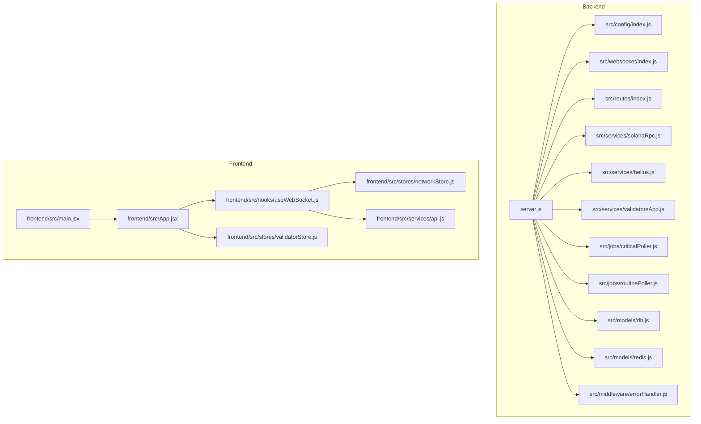
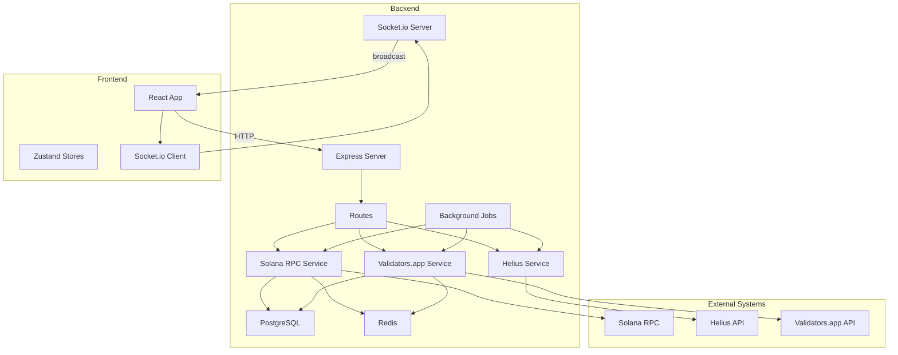
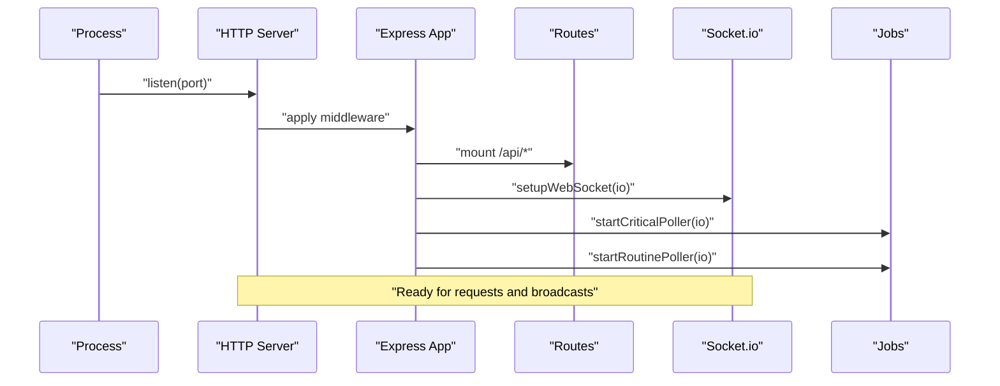
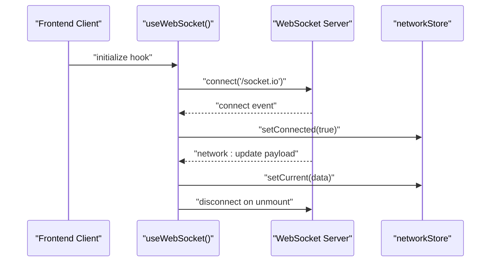
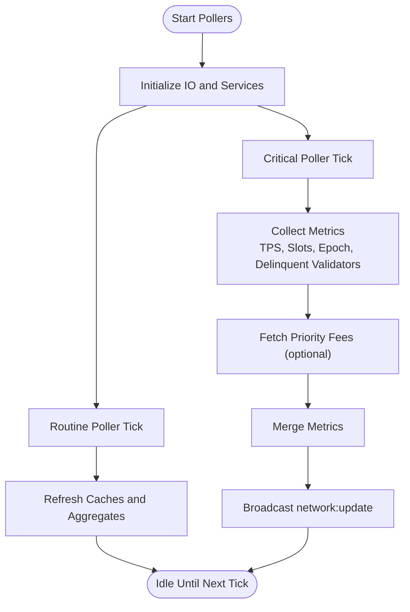
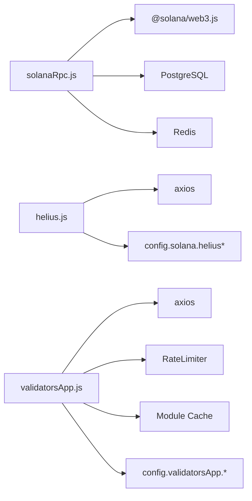
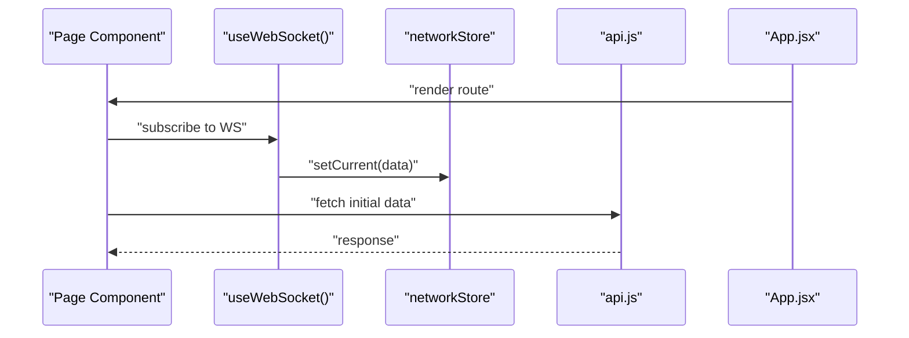
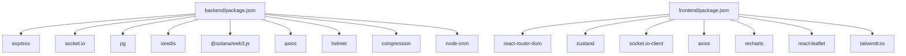

# Architecture Overview

<cite>
**Referenced Files in This Document**
- [server.js](file://backend/server.js)
- [index.js](file://backend/src/config/index.js)
- [index.js](file://backend/src/websocket/index.js)
- [index.js](file://backend/src/routes/index.js)
- [solanaRpc.js](file://backend/src/services/solanaRpc.js)
- [helius.js](file://backend/src/services/helius.js)
- [validatorsApp.js](file://backend/src/services/validatorsApp.js)
- [criticalPoller.js](file://backend/src/jobs/criticalPoller.js)
- [routinePoller.js](file://backend/src/jobs/routinePoller.js)
- [db.js](file://backend/src/models/db.js)
- [redis.js](file://backend/src/models/redis.js)
- [index.js](file://backend/src/models/cacheKeys.js)
- [index.js](file://backend/src/models/queries.js)
- [index.js](file://backend/src/models/migrate.js)
- [errorHandler.js](file://backend/src/middleware/errorHandler.js)
- [main.jsx](file://frontend/src/main.jsx)
- [App.jsx](file://frontend/src/App.jsx)
- [useWebSocket.js](file://frontend/src/hooks/useWebSocket.js)
- [api.js](file://frontend/src/services/api.js)
- [networkStore.js](file://frontend/src/stores/networkStore.js)
- [validatorStore.js](file://frontend/src/stores/validatorStore.js)
- [package.json](file://backend/package.json)
- [package.json](file://frontend/package.json)
</cite>

## Table of Contents
1. [Introduction](#introduction)
2. [Project Structure](#project-structure)
3. [Core Components](#core-components)
4. [Architecture Overview](#architecture-overview)
5. [Detailed Component Analysis](#detailed-component-analysis)
6. [Dependency Analysis](#dependency-analysis)
7. [Performance Considerations](#performance-considerations)
8. [Troubleshooting Guide](#troubleshooting-guide)
9. [Conclusion](#conclusion)

## Introduction
This document describes the full-stack architecture of InfraWatch, a real-time Solana infrastructure monitoring dashboard. The system consists of:
- A Node.js/Express backend that exposes REST APIs, orchestrates background jobs, manages real-time updates via WebSocket, and integrates with external Solana RPC providers and third-party analytics APIs.
- A React/Vite frontend that consumes REST endpoints and subscribes to live updates via WebSocket to render dashboards and interactive components.

The architecture follows a microservices-like pattern at the backend where domain-specific services encapsulate data collection and normalization, while the frontend maintains a reactive state model with real-time synchronization.

## Project Structure
The repository is organized into two primary directories:
- backend: Express server, routing, services, jobs, models, WebSocket, and configuration
- frontend: React application with routing, stores, services, and UI components

**Diagram sources**
- [server.js:1-128](file://backend/server.js#L1-L128)
- [index.js](file://backend/src/config/index.js)
- [index.js](file://backend/src/websocket/index.js)
- [index.js](file://backend/src/routes/index.js)
- [solanaRpc.js](file://backend/src/services/solanaRpc.js)
- [helius.js](file://backend/src/services/helius.js)
- [validatorsApp.js](file://backend/src/services/validatorsApp.js)
- [criticalPoller.js](file://backend/src/jobs/criticalPoller.js)
- [routinePoller.js](file://backend/src/jobs/routinePoller.js)
- [db.js](file://backend/src/models/db.js)
- [redis.js](file://backend/src/models/redis.js)
- [errorHandler.js](file://backend/src/middleware/errorHandler.js)
- [main.jsx](file://frontend/src/main.jsx)
- [App.jsx](file://frontend/src/App.jsx)
- [useWebSocket.js](file://frontend/src/hooks/useWebSocket.js)
- [api.js](file://frontend/src/services/api.js)
- [networkStore.js](file://frontend/src/stores/networkStore.js)
- [validatorStore.js](file://frontend/src/stores/validatorStore.js)

**Section sources**
- [server.js:1-128](file://backend/server.js#L1-L128)
- [main.jsx](file://frontend/src/main.jsx)

## Core Components
- Backend entrypoint initializes Express, HTTP server, Socket.io, applies middleware, mounts routes, sets up WebSocket, and starts background pollers. It also initializes database and Redis connections and exports the Socket.io instance for use by other modules.
- Configuration module centralizes environment-driven settings for ports, Solana RPC endpoints, external API keys, database and Redis URLs, polling intervals, and CORS origins.
- Services encapsulate domain logic:
  - Solana RPC service: collects network health, TPS, slot info, epoch info, delinquent validators, and calculates congestion metrics.
  - Helius service: fetches priority fee estimates and enhanced TPS data via Helius RPC.
  - Validators.app service: rate-limits and caches validator data, normalizes fields, detects commission changes, and provides aggregated views.
- Jobs implement periodic data collection and broadcasting:
  - Critical poller runs frequently to push near-real-time metrics.
  - Routine poller runs less often to refresh auxiliary data and maintain caches.
- Models handle persistence and caching:
  - Database initialization and migration utilities.
  - Redis initialization and cache key constants.
  - Queries module for database operations.
- Frontend:
  - React application bootstrapped with Vite.
  - Routing with nested routes for dashboard, validators, RPC health, data center map, MEV tracker, bags ecosystem, and alerts.
  - WebSocket hook connects to the backend and synchronizes state.
  - Zustand stores manage network state, history, epoch info, and validator lists with sorting and selection capabilities.
  - Axios-based API client with interceptors for unified request/response handling.

**Section sources**
- [server.js:1-128](file://backend/server.js#L1-L128)
- [index.js](file://backend/src/config/index.js)
- [solanaRpc.js](file://backend/src/services/solanaRpc.js)
- [helius.js](file://backend/src/services/helius.js)
- [validatorsApp.js](file://backend/src/services/validatorsApp.js)
- [index.js](file://backend/src/websocket/index.js)
- [index.js](file://backend/src/routes/index.js)
- [criticalPoller.js](file://backend/src/jobs/criticalPoller.js)
- [routinePoller.js](file://backend/src/jobs/routinePoller.js)
- [db.js](file://backend/src/models/db.js)
- [redis.js](file://backend/src/models/redis.js)
- [index.js](file://backend/src/models/queries.js)
- [index.js](file://backend/src/models/migrate.js)
- [main.jsx](file://frontend/src/main.jsx)
- [App.jsx](file://frontend/src/App.jsx)
- [useWebSocket.js](file://frontend/src/hooks/useWebSocket.js)
- [api.js](file://frontend/src/services/api.js)
- [networkStore.js](file://frontend/src/stores/networkStore.js)
- [validatorStore.js](file://frontend/src/stores/validatorStore.js)

## Architecture Overview
InfraWatch employs a layered backend architecture with clear separation of concerns:
- Presentation Layer: Express routes grouped under a single aggregator route.
- Application Layer: Services encapsulate business logic for Solana RPC, Helius, and Validators.app.
- Infrastructure Layer: Database and Redis initialization and utilities.
- Communication Layer: Socket.io for real-time events and HTTP for REST APIs.

**Diagram sources**
- [server.js:1-128](file://backend/server.js#L1-L128)
- [index.js](file://backend/src/config/index.js)
- [solanaRpc.js](file://backend/src/services/solanaRpc.js)
- [helius.js](file://backend/src/services/helius.js)
- [validatorsApp.js](file://backend/src/services/validatorsApp.js)
- [index.js](file://backend/src/websocket/index.js)
- [index.js](file://backend/src/routes/index.js)
- [criticalPoller.js](file://backend/src/jobs/criticalPoller.js)
- [routinePoller.js](file://backend/src/jobs/routinePoller.js)
- [db.js](file://backend/src/models/db.js)
- [redis.js](file://backend/src/models/redis.js)
- [main.jsx](file://frontend/src/main.jsx)
- [App.jsx](file://frontend/src/App.jsx)
- [useWebSocket.js](file://frontend/src/hooks/useWebSocket.js)

## Detailed Component Analysis

### Backend Entry Point and Control Flow
The backend entry point initializes middleware, routes, WebSocket, and background jobs, then starts the HTTP server. It logs environment and health-check details and attempts to initialize database and Redis. Graceful shutdown handlers are registered.

**Diagram sources**
- [server.js:1-128](file://backend/server.js#L1-L128)
- [index.js](file://backend/src/websocket/index.js)
- [index.js](file://backend/src/routes/index.js)
- [criticalPoller.js](file://backend/src/jobs/criticalPoller.js)
- [routinePoller.js](file://backend/src/jobs/routinePoller.js)

**Section sources**
- [server.js:1-128](file://backend/server.js#L1-L128)

### Real-Time Communication via WebSocket
The WebSocket module sets up connection listeners, tracks connected clients, and exposes broadcast utilities. The frontend connects using a dedicated hook and updates the network store upon receiving events.

**Diagram sources**
- [index.js](file://backend/src/websocket/index.js)
- [useWebSocket.js](file://frontend/src/hooks/useWebSocket.js)
- [networkStore.js](file://frontend/src/stores/networkStore.js)

**Section sources**
- [index.js](file://backend/src/websocket/index.js)
- [useWebSocket.js](file://frontend/src/hooks/useWebSocket.js)
- [networkStore.js](file://frontend/src/stores/networkStore.js)

### Background Job Processing
Two pollers orchestrate periodic data collection:
- Critical poller: runs at a short interval to gather and broadcast critical metrics.
- Routine poller: runs at a longer interval to refresh caches and auxiliary data.

**Diagram sources**
- [criticalPoller.js](file://backend/src/jobs/criticalPoller.js)
- [routinePoller.js](file://backend/src/jobs/routinePoller.js)
- [solanaRpc.js](file://backend/src/services/solanaRpc.js)
- [helius.js](file://backend/src/services/helius.js)

**Section sources**
- [criticalPoller.js](file://backend/src/jobs/criticalPoller.js)
- [routinePoller.js](file://backend/src/jobs/routinePoller.js)

### External API Integrations
- Solana RPC: Used via @solana/web3.js to fetch health, TPS, slot info, epoch info, and delinquent validators.
- Helius: Optional provider for priority fee estimates and enhanced TPS data via JSON-RPC.
- Validators.app: Rate-limited API for validator data with caching and normalization.

**Diagram sources**
- [solanaRpc.js](file://backend/src/services/solanaRpc.js)
- [helius.js](file://backend/src/services/helius.js)
- [validatorsApp.js](file://backend/src/services/validatorsApp.js)
- [index.js](file://backend/src/config/index.js)
- [db.js](file://backend/src/models/db.js)
- [redis.js](file://backend/src/models/redis.js)

**Section sources**
- [solanaRpc.js](file://backend/src/services/solanaRpc.js)
- [helius.js](file://backend/src/services/helius.js)
- [validatorsApp.js](file://backend/src/services/validatorsApp.js)
- [index.js](file://backend/src/config/index.js)

### Frontend State and Real-Time Updates
The frontend uses a WebSocket hook to subscribe to network updates and Zustand stores to manage state. The API client wraps axios with interceptors for unified error handling.

**Diagram sources**
- [App.jsx](file://frontend/src/App.jsx)
- [useWebSocket.js](file://frontend/src/hooks/useWebSocket.js)
- [networkStore.js](file://frontend/src/stores/networkStore.js)
- [api.js](file://frontend/src/services/api.js)

**Section sources**
- [App.jsx](file://frontend/src/App.jsx)
- [useWebSocket.js](file://frontend/src/hooks/useWebSocket.js)
- [networkStore.js](file://frontend/src/stores/networkStore.js)
- [api.js](file://frontend/src/services/api.js)

## Dependency Analysis
The backend depends on Express, Socket.io, PostgreSQL, Redis, and external APIs. The frontend depends on React, React Router, Socket.io client, Recharts, and Zustand.

**Diagram sources**
- [package.json](file://backend/package.json)
- [package.json](file://frontend/package.json)

**Section sources**
- [package.json](file://backend/package.json)
- [package.json](file://frontend/package.json)

## Performance Considerations
- Concurrency and Parallelism:
  - Network snapshot collection aggregates multiple RPC calls concurrently to reduce latency.
  - Background jobs run independently with distinct intervals to balance responsiveness and resource usage.
- Caching and Rate Limiting:
  - Validators.app service implements a sliding-window rate limiter and module-level cache to avoid throttling and stale data.
  - Redis can be used for session state and transient metrics; ensure proper key naming and TTL policies.
- Real-Time Scalability:
  - Socket.io supports horizontal scaling with a compatible adapter; consider clustering and shared state for production deployments.
- Database Efficiency:
  - Use prepared statements and connection pooling; keep migrations minimal and safe.
- Frontend Responsiveness:
  - Debounce or throttle frequent UI updates; leverage efficient chart libraries and virtualization for large datasets.

## Troubleshooting Guide
- Health Checks:
  - Use the health endpoint to confirm backend availability and environment details.
- Error Handling:
  - Global error middleware ensures consistent error responses and logging.
- WebSocket Diagnostics:
  - Monitor connection counts and error events; verify client reconnection behavior.
- External API Issues:
  - Validate API keys and endpoints in configuration; monitor timeouts and rate-limit warnings.
- Database/Redis Availability:
  - Initialization failures are logged as warnings; ensure connectivity and credentials are correct.

**Section sources**
- [server.js:62-69](file://backend/server.js#L62-L69)
- [errorHandler.js](file://backend/src/middleware/errorHandler.js)
- [index.js](file://backend/src/websocket/index.js)
- [index.js](file://backend/src/config/index.js)
- [validatorsApp.js](file://backend/src/services/validatorsApp.js)

## Conclusion
InfraWatch’s architecture cleanly separates presentation, application, and infrastructure concerns. The backend’s modular services, robust WebSocket integration, and background job orchestration enable real-time monitoring of Solana infrastructure. The frontend’s reactive stores and routing provide an intuitive user experience. With careful attention to caching, rate limiting, and scalable deployment patterns, the system can evolve to meet growing demands.