# Backend Architecture

<cite>
**Referenced Files in This Document**
- [server.js](file://backend/server.js)
- [package.json](file://backend/package.json)
- [config/index.js](file://backend/src/config/index.js)
- [routes/index.js](file://backend/src/routes/index.js)
- [routes/network.js](file://backend/src/routes/network.js)
- [routes/rpc.js](file://backend/src/routes/rpc.js)
- [routes/validators.js](file://backend/src/routes/validators.js)
- [middleware/errorHandler.js](file://backend/src/middleware/errorHandler.js)
- [websocket/index.js](file://backend/src/websocket/index.js)
- [models/db.js](file://backend/src/models/db.js)
- [models/redis.js](file://backend/src/models/redis.js)
- [models/queries.js](file://backend/src/models/queries.js)
- [models/cacheKeys.js](file://backend/src/models/cacheKeys.js)
- [jobs/criticalPoller.js](file://backend/src/jobs/criticalPoller.js)
- [jobs/routinePoller.js](file://backend/src/jobs/routinePoller.js)
- [services/solanaRpc.js](file://backend/src/services/solanaRpc.js)
- [services/helius.js](file://backend/src/services/helius.js)
- [services/validatorsApp.js](file://backend/src/services/validatorsApp.js)
- [services/rpcProber.js](file://backend/src/services/rpcProber.js)
</cite>

## Table of Contents
1. [Introduction](#introduction)
2. [Project Structure](#project-structure)
3. [Core Components](#core-components)
4. [Architecture Overview](#architecture-overview)
5. [Detailed Component Analysis](#detailed-component-analysis)
6. [Dependency Analysis](#dependency-analysis)
7. [Performance Considerations](#performance-considerations)
8. [Troubleshooting Guide](#troubleshooting-guide)
9. [Conclusion](#conclusion)

## Introduction
This document describes the backend architecture of InfraWatch, a real-time Solana infrastructure monitoring dashboard. It covers the Node.js/Express server setup, configuration management, modular service layer, routing and middleware architecture, database abstraction, caching strategy with Redis, WebSocket communication, background job system for data collection, and error handling mechanisms. It also documents integration patterns with external services such as Solana RPC, Helius, and Validators.app.

## Project Structure
The backend follows a layered, modular structure:
- Entry point initializes Express, middleware, routes, WebSocket, and background jobs
- Configuration module centralizes environment-driven settings
- Routes define API endpoints grouped by domain
- Services encapsulate external API integrations and business logic
- Models provide database abstraction and Redis caching utilities
- Jobs implement scheduled data collection and distribution

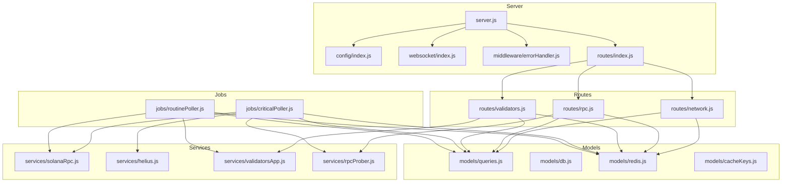

**Diagram sources**
- [server.js:1-128](file://backend/server.js#L1-L128)
- [config/index.js:1-68](file://backend/src/config/index.js#L1-L68)
- [routes/index.js:1-24](file://backend/src/routes/index.js#L1-L24)
- [routes/network.js:1-135](file://backend/src/routes/network.js#L1-L135)
- [routes/rpc.js:1-135](file://backend/src/routes/rpc.js#L1-L135)
- [routes/validators.js:1-112](file://backend/src/routes/validators.js#L1-L112)
- [services/solanaRpc.js:1-340](file://backend/src/services/solanaRpc.js#L1-L340)
- [services/helius.js:1-188](file://backend/src/services/helius.js#L1-L188)
- [services/validatorsApp.js:1-388](file://backend/src/services/validatorsApp.js#L1-L388)
- [services/rpcProber.js:1-342](file://backend/src/services/rpcProber.js#L1-L342)
- [models/queries.js:1-459](file://backend/src/models/queries.js#L1-L459)
- [models/db.js:1-98](file://backend/src/models/db.js#L1-L98)
- [models/redis.js:1-161](file://backend/src/models/redis.js#L1-L161)
- [models/cacheKeys.js:1-50](file://backend/src/models/cacheKeys.js#L1-L50)
- [jobs/criticalPoller.js:1-108](file://backend/src/jobs/criticalPoller.js#L1-L108)
- [jobs/routinePoller.js:1-116](file://backend/src/jobs/routinePoller.js#L1-L116)

**Section sources**
- [server.js:1-128](file://backend/server.js#L1-L128)
- [package.json:1-36](file://backend/package.json#L1-L36)

## Core Components
- Server bootstrap and middleware pipeline: Helmet, compression, CORS, JSON parsing, global error handler, and 404 handler
- Configuration loader with environment variable support and sensible defaults
- Modular route aggregation with domain-specific routers
- Service layer for Solana RPC, Helius, Validators.app, and RPC probing
- Data access layer with PostgreSQL and Redis caching
- Background jobs for critical and routine data collection
- WebSocket server for real-time updates

**Section sources**
- [server.js:33-107](file://backend/server.js#L33-L107)
- [config/index.js:15-68](file://backend/src/config/index.js#L15-L68)
- [routes/index.js:9-23](file://backend/src/routes/index.js#L9-L23)
- [middleware/errorHandler.js:44-127](file://backend/src/middleware/errorHandler.js#L44-L127)

## Architecture Overview
InfraWatch implements a layered architecture:
- Presentation layer: Express routes
- Application layer: Service modules orchestrating external integrations
- Persistence layer: PostgreSQL via node-pg and Redis via ioredis
- Infrastructure layer: Scheduled jobs and WebSocket broadcasting

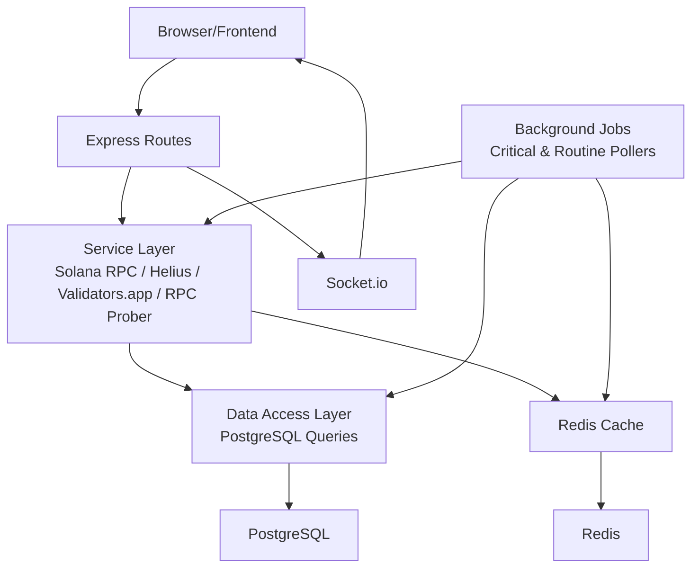

**Diagram sources**
- [server.js:34-107](file://backend/server.js#L34-L107)
- [services/solanaRpc.js:1-340](file://backend/src/services/solanaRpc.js#L1-L340)
- [services/helius.js:1-188](file://backend/src/services/helius.js#L1-L188)
- [services/validatorsApp.js:1-388](file://backend/src/services/validatorsApp.js#L1-L388)
- [services/rpcProber.js:1-342](file://backend/src/services/rpcProber.js#L1-L342)
- [models/queries.js:1-459](file://backend/src/models/queries.js#L1-L459)
- [models/redis.js:1-161](file://backend/src/models/redis.js#L1-L161)
- [jobs/criticalPoller.js:1-108](file://backend/src/jobs/criticalPoller.js#L1-L108)
- [jobs/routinePoller.js:1-116](file://backend/src/jobs/routinePoller.js#L1-L116)
- [websocket/index.js:13-33](file://backend/src/websocket/index.js#L13-L33)

## Detailed Component Analysis

### Server Initialization and Middleware Pipeline
- Creates Express app, HTTP server, and Socket.io with CORS configuration from config
- Applies Helmet, compression, CORS, and body parsing middleware
- Registers health check endpoint, routes, 404 handler, and global error handler
- Initializes database and Redis pools, starts background jobs, and sets graceful shutdown handlers

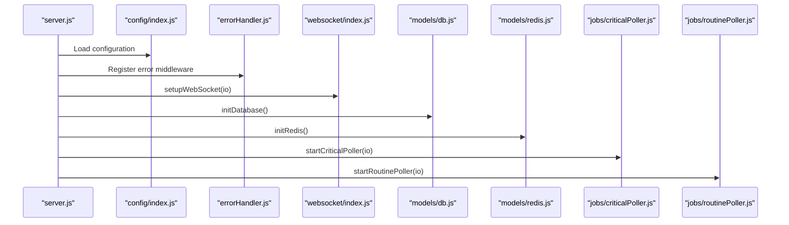

**Diagram sources**
- [server.js:13-107](file://backend/server.js#L13-L107)
- [config/index.js:1-68](file://backend/src/config/index.js#L1-L68)
- [middleware/errorHandler.js:44-127](file://backend/src/middleware/errorHandler.js#L44-L127)
- [websocket/index.js:13-33](file://backend/src/websocket/index.js#L13-L33)
- [models/db.js:15-47](file://backend/src/models/db.js#L15-L47)
- [models/redis.js:16-68](file://backend/src/models/redis.js#L16-L68)
- [jobs/criticalPoller.js:21-103](file://backend/src/jobs/criticalPoller.js#L21-L103)
- [jobs/routinePoller.js:20-111](file://backend/src/jobs/routinePoller.js#L20-L111)

**Section sources**
- [server.js:34-107](file://backend/server.js#L34-L107)
- [middleware/errorHandler.js:114-127](file://backend/src/middleware/errorHandler.js#L114-L127)

### Routing and MVC-like Pattern
- Routes are organized by domain (network, rpc, validators, epoch, alerts) under a single aggregator
- Each route file acts as a controller, delegating to models and services
- Data access is centralized in the queries module, providing a clean DAL

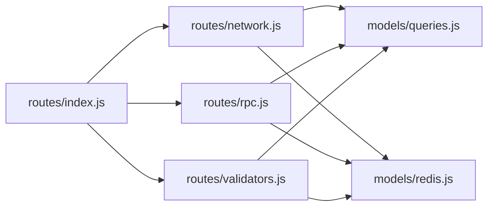

**Diagram sources**
- [routes/index.js:9-23](file://backend/src/routes/index.js#L9-L23)
- [routes/network.js:17-79](file://backend/src/routes/network.js#L17-L79)
- [routes/rpc.js:17-88](file://backend/src/routes/rpc.js#L17-L88)
- [routes/validators.js:17-109](file://backend/src/routes/validators.js#L17-L109)
- [models/queries.js:1-459](file://backend/src/models/queries.js#L1-L459)
- [models/redis.js:75-131](file://backend/src/models/redis.js#L75-L131)

**Section sources**
- [routes/index.js:9-23](file://backend/src/routes/index.js#L9-L23)
- [routes/network.js:17-132](file://backend/src/routes/network.js#L17-L132)
- [routes/rpc.js:17-132](file://backend/src/routes/rpc.js#L17-L132)
- [routes/validators.js:17-109](file://backend/src/routes/validators.js#L17-L109)

### Service Layer Pattern
- Solana RPC service: collects network health, TPS, slot info, epoch info, delinquent validators, and confirmation time; calculates congestion score
- Helius service: fetches priority fee estimates and enhanced TPS via Helius RPC
- Validators.app service: rate-limited API client with normalization, caching, and change detection
- RPC prober service: probes multiple RPC providers, tracks latency and uptime, computes rolling statistics

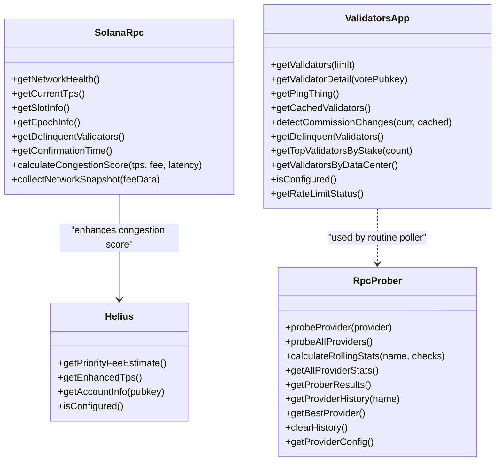

**Diagram sources**
- [services/solanaRpc.js:20-328](file://backend/src/services/solanaRpc.js#L20-L328)
- [services/helius.js:13-187](file://backend/src/services/helius.js#L13-L187)
- [services/validatorsApp.js:186-387](file://backend/src/services/validatorsApp.js#L186-L387)
- [services/rpcProber.js:75-341](file://backend/src/services/rpcProber.js#L75-L341)

**Section sources**
- [services/solanaRpc.js:20-328](file://backend/src/services/solanaRpc.js#L20-L328)
- [services/helius.js:13-187](file://backend/src/services/helius.js#L13-L187)
- [services/validatorsApp.js:186-387](file://backend/src/services/validatorsApp.js#L186-L387)
- [services/rpcProber.js:75-341](file://backend/src/services/rpcProber.js#L75-L341)

### Database Abstraction Layer
- PostgreSQL connection pool with lazy initialization, error handling, and connection tests
- Parameterized queries to prevent SQL injection
- CRUD operations for network snapshots, RPC health checks, validators, validator snapshots, and alerts

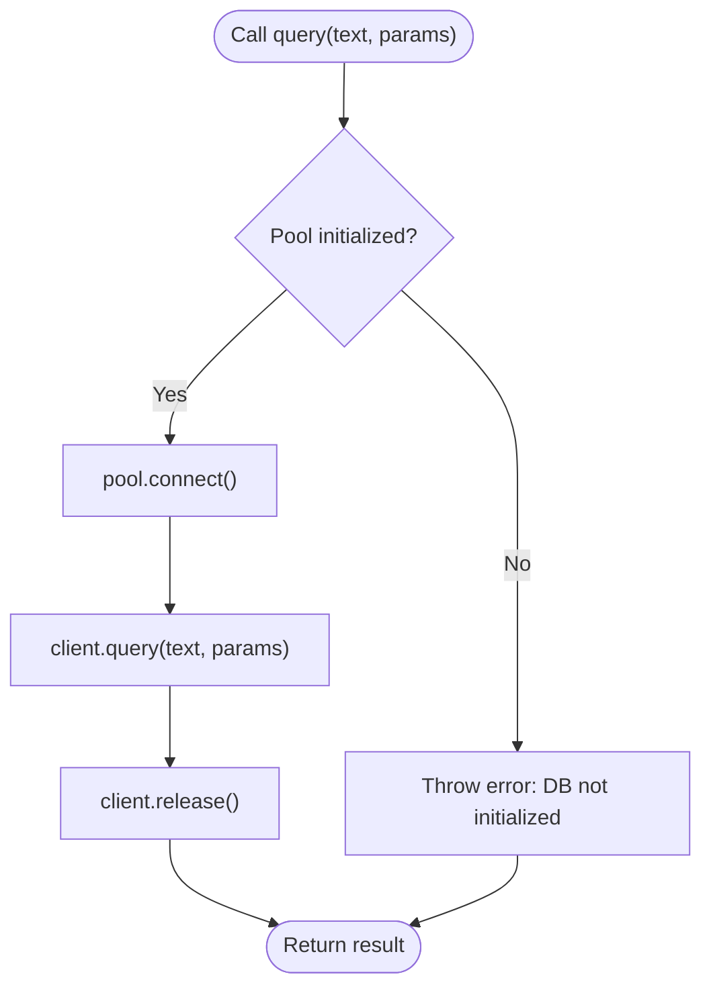

**Diagram sources**
- [models/db.js:55-70](file://backend/src/models/db.js#L55-L70)

**Section sources**
- [models/db.js:15-98](file://backend/src/models/db.js#L15-L98)
- [models/queries.js:27-48](file://backend/src/models/queries.js#L27-L48)
- [models/queries.js:101-118](file://backend/src/models/queries.js#L101-L118)
- [models/queries.js:180-220](file://backend/src/models/queries.js#L180-L220)
- [models/queries.js:282-300](file://backend/src/models/queries.js#L282-L300)
- [models/queries.js:340-356](file://backend/src/models/queries.js#L340-L356)

### Redis Caching Strategy
- Lazy initialization with retry strategy and connection lifecycle logging
- JSON serialization/deserialization for cache values
- Centralized cache keys and TTL constants
- Cache-first approach in routes with graceful degradation to DB fallback

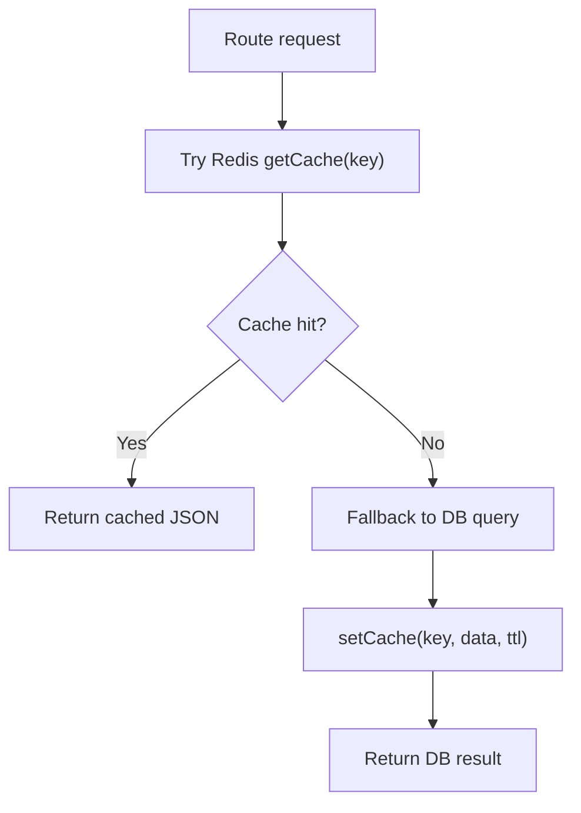

**Diagram sources**
- [models/redis.js:75-131](file://backend/src/models/redis.js#L75-L131)
- [models/cacheKeys.js:6-49](file://backend/src/models/cacheKeys.js#L6-L49)
- [routes/network.js:19-79](file://backend/src/routes/network.js#L19-L79)
- [routes/rpc.js:19-88](file://backend/src/routes/rpc.js#L19-L88)
- [routes/validators.js:22-109](file://backend/src/routes/validators.js#L22-L109)

**Section sources**
- [models/redis.js:16-161](file://backend/src/models/redis.js#L16-L161)
- [models/cacheKeys.js:6-49](file://backend/src/models/cacheKeys.js#L6-L49)
- [routes/network.js:19-132](file://backend/src/routes/network.js#L19-L132)
- [routes/rpc.js:19-132](file://backend/src/routes/rpc.js#L19-L132)
- [routes/validators.js:22-109](file://backend/src/routes/validators.js#L22-L109)

### WebSocket Communication
- Socket.io setup with connection tracking and error handling
- Broadcast utilities for network updates, RPC updates, and alerts
- Real-time delivery to connected clients

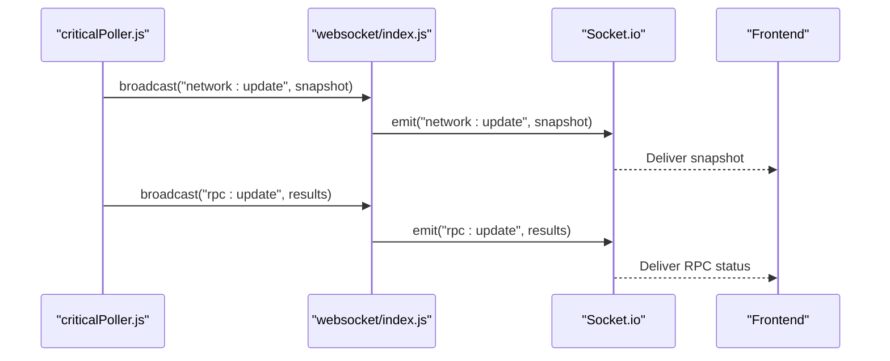

**Diagram sources**
- [jobs/criticalPoller.js:88-92](file://backend/src/jobs/criticalPoller.js#L88-L92)
- [websocket/index.js:48-52](file://backend/src/websocket/index.js#L48-L52)

**Section sources**
- [websocket/index.js:13-81](file://backend/src/websocket/index.js#L13-L81)
- [jobs/criticalPoller.js:88-92](file://backend/src/jobs/criticalPoller.js#L88-L92)

### Background Job System
- Critical poller (every 30 seconds): collects network snapshot, enhances with Helius fees, probes RPCs, writes to DB, updates Redis, and broadcasts via WebSocket
- Routine poller (every 5 minutes): fetches validators, detects commission changes, upserts validators, inserts snapshots, updates caches, creates alerts, and emits via WebSocket

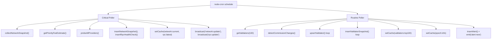

**Diagram sources**
- [jobs/criticalPoller.js:21-103](file://backend/src/jobs/criticalPoller.js#L21-L103)
- [jobs/routinePoller.js:20-111](file://backend/src/jobs/routinePoller.js#L20-L111)
- [services/solanaRpc.js:275-328](file://backend/src/services/solanaRpc.js#L275-L328)
- [services/helius.js:13-70](file://backend/src/services/helius.js#L13-L70)
- [services/rpcProber.js:140-180](file://backend/src/services/rpcProber.js#L140-L180)
- [services/validatorsApp.js:186-209](file://backend/src/services/validatorsApp.js#L186-L209)
- [models/queries.js:180-220](file://backend/src/models/queries.js#L180-L220)
- [models/queries.js:282-300](file://backend/src/models/queries.js#L282-L300)
- [models/queries.js:340-356](file://backend/src/models/queries.js#L340-L356)

**Section sources**
- [jobs/criticalPoller.js:21-103](file://backend/src/jobs/criticalPoller.js#L21-L103)
- [jobs/routinePoller.js:20-111](file://backend/src/jobs/routinePoller.js#L20-L111)

### Error Handling Mechanisms
- Custom error classes for validation, not found, unauthorized, and forbidden scenarios
- Global error handler logs structured errors and responds with appropriate status codes
- 404 handler converts unmatched routes into NotFoundError
- Graceful degradation in routes and jobs when Redis/DB are unavailable

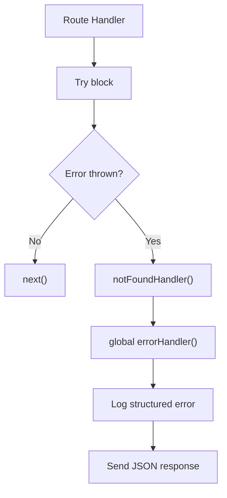

**Diagram sources**
- [middleware/errorHandler.js:44-127](file://backend/src/middleware/errorHandler.js#L44-L127)
- [middleware/errorHandler.js:114-127](file://backend/src/middleware/errorHandler.js#L114-L127)

**Section sources**
- [middleware/errorHandler.js:6-127](file://backend/src/middleware/errorHandler.js#L6-L127)

## Dependency Analysis
- Express dependencies: express, cors, helmet, compression, socket.io
- Database: pg (node-pg) for PostgreSQL
- Caching: ioredis for Redis
- Networking: axios for HTTP requests
- Scheduling: node-cron for background jobs
- Solana SDK: @solana/web3.js for RPC connections

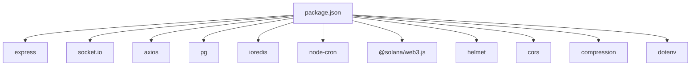

**Diagram sources**
- [package.json:22-34](file://backend/package.json#L22-L34)

**Section sources**
- [package.json:1-36](file://backend/package.json#L1-L36)

## Performance Considerations
- Concurrency and batching: Services use Promise.all for parallel data fetching (e.g., network snapshot collection)
- Caching: Redis cache keys and TTLs reduce DB load and API throttling
- Rate limiting: Validators.app service enforces strict rate limits with queueing
- Rolling statistics: RPC prober maintains rolling latency percentiles for efficient analytics
- Graceful degradation: Routes and jobs continue operating even if Redis or DB are unavailable

[No sources needed since this section provides general guidance]

## Troubleshooting Guide
- Health check endpoint: Use the /api/health endpoint to verify server status and environment
- Database connectivity: Verify DATABASE_URL and check pool error events
- Redis connectivity: Confirm REDIS_URL and monitor connection lifecycle events
- Missing API keys: Configure HELIUS_API_KEY and/or Validators.app API key to enable enhanced features
- Rate limit warnings: Monitor Validators.app rate limiter logs and adjust request frequency
- WebSocket connectivity: Check connection events and error logs for client issues

**Section sources**
- [server.js:62-69](file://backend/server.js#L62-L69)
- [models/db.js:33-44](file://backend/src/models/db.js#L33-L44)
- [models/redis.js:37-61](file://backend/src/models/redis.js#L37-L61)
- [services/validatorsApp.js:84-94](file://backend/src/services/validatorsApp.js#L84-L94)
- [websocket/index.js:16-30](file://backend/src/websocket/index.js#L16-L30)

## Conclusion
InfraWatch employs a robust, modular backend architecture that cleanly separates concerns across configuration, routing, services, persistence, and real-time communication. The design emphasizes reliability through graceful degradation, performance via caching and batching, and observability through structured logging and health endpoints. The service layer abstracts external integrations, while the DAL ensures safe, maintainable database operations. Background jobs keep the system synchronized with real-world Solana network conditions, and WebSocket broadcasting delivers timely updates to clients.