# Background Jobs & Data Collection

<cite>
**Referenced Files in This Document**
- [server.js](file://backend/server.js)
- [package.json](file://backend/package.json)
- [config/index.js](file://backend/src/config/index.js)
- [jobs/criticalPoller.js](file://backend/src/jobs/criticalPoller.js)
- [jobs/routinePoller.js](file://backend/src/jobs/routinePoller.js)
- [services/solanaRpc.js](file://backend/src/services/solanaRpc.js)
- [services/rpcProber.js](file://backend/src/services/rpcProber.js)
- [services/helius.js](file://backend/src/services/helius.js)
- [services/validatorsApp.js](file://backend/src/services/validatorsApp.js)
- [models/queries.js](file://backend/src/models/queries.js)
- [models/db.js](file://backend/src/models/db.js)
- [models/redis.js](file://backend/src/models/redis.js)
- [models/cacheKeys.js](file://backend/src/models/cacheKeys.js)
- [models/migrate.js](file://backend/src/models/migrate.js)
</cite>

## Table of Contents
1. [Introduction](#introduction)
2. [Project Structure](#project-structure)
3. [Core Components](#core-components)
4. [Architecture Overview](#architecture-overview)
5. [Detailed Component Analysis](#detailed-component-analysis)
6. [Dependency Analysis](#dependency-analysis)
7. [Performance Considerations](#performance-considerations)
8. [Troubleshooting Guide](#troubleshooting-guide)
9. [Conclusion](#conclusion)
10. [Appendices](#appendices)

## Introduction
This document explains the InfraWatch background job system and data collection pipeline. It focuses on the critical poller (30-second intervals) and routine poller (5-minute intervals), their scheduling, data collection workflows, and the coordination between pollers, data processing, and caching. It also covers error handling, retry strategies, performance monitoring, configuration, resource management, and scaling considerations. Practical examples show how to add new pollers, adjust intervals, and debug collection issues.

## Project Structure
The backend is organized around a modular architecture:
- Server entry initializes middleware, routes, WebSocket, and starts the pollers.
- Jobs define scheduled tasks for critical and routine data collection.
- Services encapsulate external API integrations and Solana RPC interactions.
- Models handle database access and Redis caching.
- Configuration centralizes environment-driven settings.

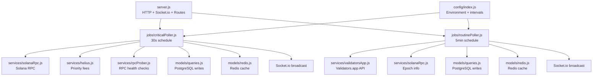

**Diagram sources**
- [server.js:84-107](file://backend/server.js#L84-L107)
- [jobs/criticalPoller.js:21-103](file://backend/src/jobs/criticalPoller.js#L21-L103)
- [jobs/routinePoller.js:20-111](file://backend/src/jobs/routinePoller.js#L20-L111)
- [services/solanaRpc.js:10](file://backend/src/services/solanaRpc.js#L10)
- [services/helius.js:13](file://backend/src/services/helius.js#L13)
- [services/rpcProber.js:11](file://backend/src/services/rpcProber.js#L11)
- [services/validatorsApp.js:115](file://backend/src/services/validatorsApp.js#L115)
- [models/queries.js:27](file://backend/src/models/queries.js#L27)
- [models/redis.js:16](file://backend/src/models/redis.js#L16)
- [config/index.js:55](file://backend/src/config/index.js#L55)

**Section sources**
- [server.js:33-107](file://backend/server.js#L33-L107)
- [config/index.js:27-67](file://backend/src/config/index.js#L27-L67)

## Core Components
- Critical Poller: Runs every 30 seconds to collect network snapshot, enhance with priority fees, probe RPC providers, write to PostgreSQL, update Redis cache, and emit WebSocket events.
- Routine Poller: Runs every 5 minutes to fetch validators, detect commission changes, upsert and snapshot validator data, update caches, and emit alerts.
- Solana RPC Service: Gathers health, TPS, slot info, epoch info, delinquent validators, and confirmation time; computes congestion score.
- RPC Prober: Monitors multiple RPC providers for health and latency; maintains rolling statistics and best-provider selection.
- Helius Service: Optional integration for priority fee estimates and enhanced TPS via Helius API.
- Validators.app Client: Fetches validator data with rate limiting and caching; detects commission changes.
- Data Access Layer: Parameterized queries for network snapshots, RPC health checks, validators, validator snapshots, and alerts.
- Redis: Centralized caching with TTLs and graceful failure handling.
- Database: PostgreSQL with migrations for time-series and lookup tables.

**Section sources**
- [jobs/criticalPoller.js:21-103](file://backend/src/jobs/criticalPoller.js#L21-L103)
- [jobs/routinePoller.js:20-111](file://backend/src/jobs/routinePoller.js#L20-L111)
- [services/solanaRpc.js:275-328](file://backend/src/services/solanaRpc.js#L275-L328)
- [services/rpcProber.js:140-180](file://backend/src/services/rpcProber.js#L140-L180)
- [services/helius.js:13-70](file://backend/src/services/helius.js#L13-L70)
- [services/validatorsApp.js:186-209](file://backend/src/services/validatorsApp.js#L186-L209)
- [models/queries.js:27](file://backend/src/models/queries.js#L27)
- [models/redis.js:99-112](file://backend/src/models/redis.js#L99-L112)
- [models/migrate.js:11-94](file://backend/src/models/migrate.js#L11-L94)

## Architecture Overview
The system runs a scheduled job loop per poller. Each tick performs a set of data collection steps, writes to persistent storage, updates caches, and emits real-time updates via WebSocket. Failures are handled gracefully to keep the system resilient.

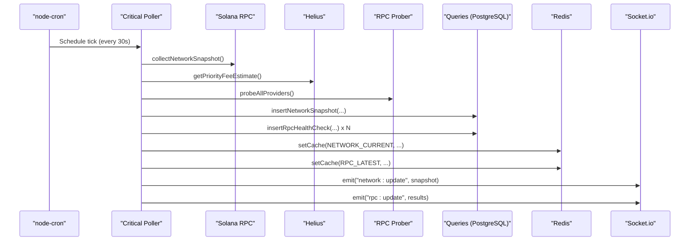

**Diagram sources**
- [jobs/criticalPoller.js:23-100](file://backend/src/jobs/criticalPoller.js#L23-L100)
- [services/solanaRpc.js:275-328](file://backend/src/services/solanaRpc.js#L275-L328)
- [services/helius.js:13-70](file://backend/src/services/helius.js#L13-L70)
- [services/rpcProber.js:140-180](file://backend/src/services/rpcProber.js#L140-L180)
- [models/queries.js:27](file://backend/src/models/queries.js#L27)
- [models/redis.js:99-112](file://backend/src/models/redis.js#L99-L112)

## Detailed Component Analysis

### Critical Poller
- Scheduling: Uses cron to run every 30 seconds.
- Execution guard: Prevents overlapping runs with an internal flag.
- Data collection:
  - Network snapshot via Solana RPC service.
  - Optional congestion enhancement via Helius priority fees.
  - RPC health checks across multiple providers.
- Persistence: Writes network snapshots and RPC health checks to PostgreSQL.
- Caching: Updates Redis keys for current network and latest RPC results with short TTLs.
- Broadcasting: Emits WebSocket events for live UI updates.

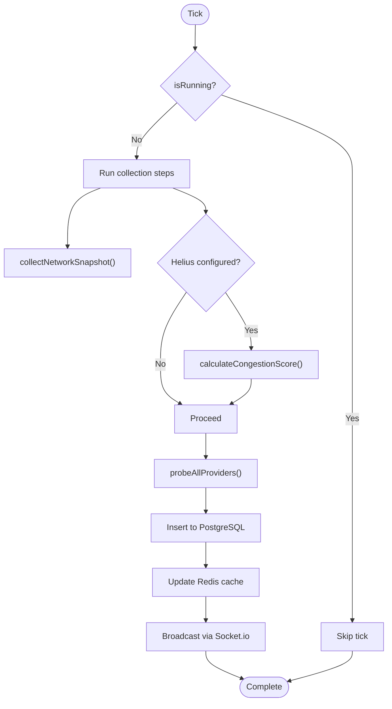

**Diagram sources**
- [jobs/criticalPoller.js:23-100](file://backend/src/jobs/criticalPoller.js#L23-L100)
- [services/solanaRpc.js:275-328](file://backend/src/services/solanaRpc.js#L275-L328)
- [services/helius.js:13-70](file://backend/src/services/helius.js#L13-L70)
- [services/rpcProber.js:140-180](file://backend/src/services/rpcProber.js#L140-L180)
- [models/queries.js:27](file://backend/src/models/queries.js#L27)
- [models/redis.js:99-112](file://backend/src/models/redis.js#L99-L112)

**Section sources**
- [jobs/criticalPoller.js:21-103](file://backend/src/jobs/criticalPoller.js#L21-L103)

### Routine Poller
- Scheduling: Runs every 5 minutes.
- Execution guard: Prevents overlapping runs.
- Data collection:
  - Fetch validators from Validators.app with rate limiting and caching.
  - Detect commission changes against cached validators.
  - Upsert validators and snapshot top validators to PostgreSQL.
  - Update Redis cache for top validators and epoch info.
  - Emit alerts for detected commission changes via WebSocket.
- Graceful failures: Stops on DB errors to avoid partial writes.

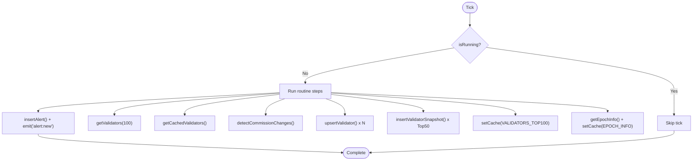

**Diagram sources**
- [jobs/routinePoller.js:21-111](file://backend/src/jobs/routinePoller.js#L21-L111)
- [services/validatorsApp.js:186-209](file://backend/src/services/validatorsApp.js#L186-L209)
- [models/queries.js:180](file://backend/src/models/queries.js#L180)
- [models/queries.js:282](file://backend/src/models/queries.js#L282)
- [models/redis.js:99-112](file://backend/src/models/redis.js#L99-L112)

**Section sources**
- [jobs/routinePoller.js:20-111](file://backend/src/jobs/routinePoller.js#L20-L111)

### Solana RPC Service
- Initializes a Solana web3 Connection with a confirmed commitment level.
- Collects network health, TPS, slot info, epoch info, delinquent validators, and average confirmation time.
- Computes congestion score combining TPS, priority fees, and slot latency.
- Aggregates a complete network snapshot using concurrent requests.

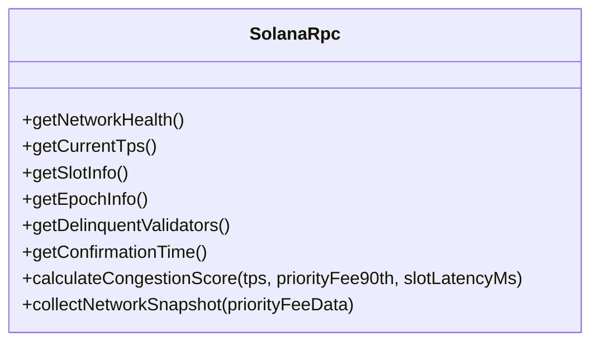

**Diagram sources**
- [services/solanaRpc.js:20-339](file://backend/src/services/solanaRpc.js#L20-L339)

**Section sources**
- [services/solanaRpc.js:10-339](file://backend/src/services/solanaRpc.js#L10-L339)

### RPC Prober Service
- Maintains a static list of RPC providers with categories and optional keys.
- Probes each provider via HTTP POST with a getSlot request and a 5-second timeout.
- Tracks latest results and rolling history per provider with a configurable max size.
- Calculates rolling statistics (percentiles, uptime) and identifies the best provider.

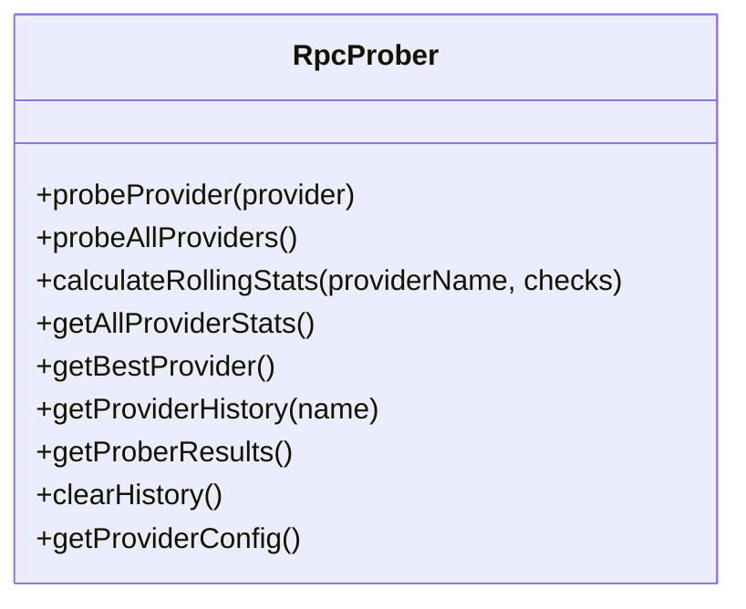

**Diagram sources**
- [services/rpcProber.js:75-341](file://backend/src/services/rpcProber.js#L75-L341)

**Section sources**
- [services/rpcProber.js:11-341](file://backend/src/services/rpcProber.js#L11-L341)

### Helius Service
- Optional integration for priority fee estimates and enhanced TPS via Helius API.
- Requires API key and RPC URL; gracefully handles missing configuration.
- Returns structured priority fee levels and proxies percentile90th.

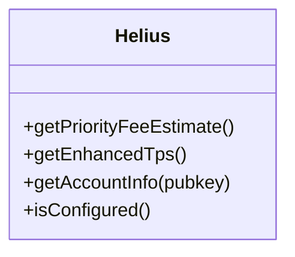

**Diagram sources**
- [services/helius.js:13-187](file://backend/src/services/helius.js#L13-L187)

**Section sources**
- [services/helius.js:13-187](file://backend/src/services/helius.js#L13-L187)

### Validators.app Client
- Rate-limits requests to 40 per 5 minutes with a queue-based mechanism.
- Normalizes validator data to a unified schema.
- Caches validator lists with TTL and detects commission changes.
- Provides utilities for ping-thing data, top validators by stake, and grouping by data center.

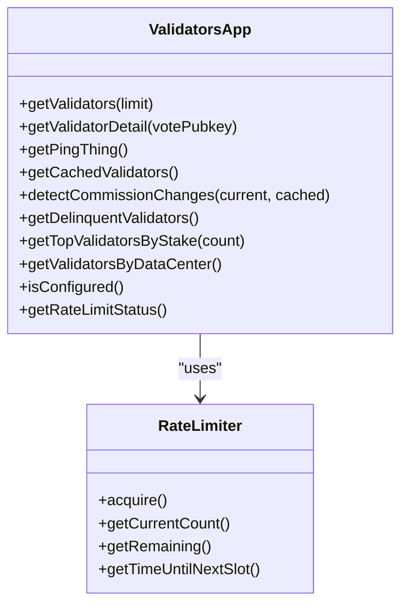

**Diagram sources**
- [services/validatorsApp.js:186-387](file://backend/src/services/validatorsApp.js#L186-L387)

**Section sources**
- [services/validatorsApp.js:9-387](file://backend/src/services/validatorsApp.js#L9-L387)

### Data Access Layer (PostgreSQL)
- Parameterized queries for network snapshots, RPC health checks, validators, validator snapshots, and alerts.
- Supports time-series queries with indexed timestamps.
- Upserts validators on conflict to keep data consistent.

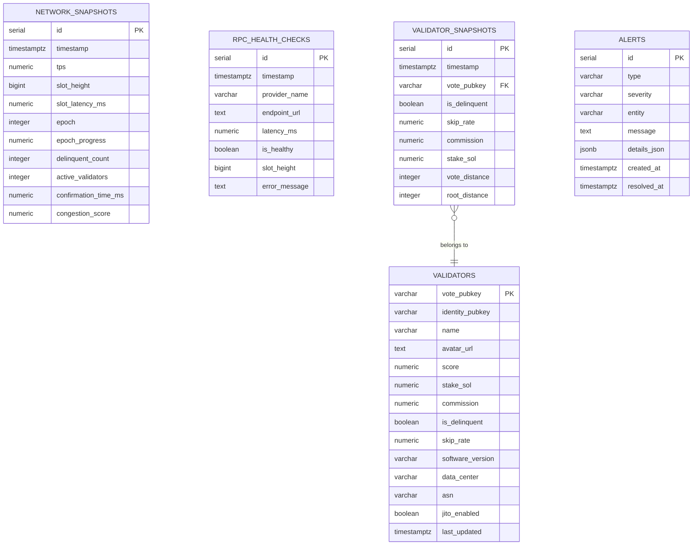

**Diagram sources**
- [models/migrate.js:11-94](file://backend/src/models/migrate.js#L11-L94)
- [models/queries.js:27](file://backend/src/models/queries.js#L27)
- [models/queries.js:101](file://backend/src/models/queries.js#L101)
- [models/queries.js:180](file://backend/src/models/queries.js#L180)
- [models/queries.js:282](file://backend/src/models/queries.js#L282)
- [models/queries.js:340](file://backend/src/models/queries.js#L340)

**Section sources**
- [models/queries.js:27-458](file://backend/src/models/queries.js#L27-L458)
- [models/migrate.js:11-94](file://backend/src/models/migrate.js#L11-L94)

### Redis Cache
- Lazy initialization with retry strategy and error handling.
- JSON serialization for cache values with TTLs.
- Graceful failure: operations return null/false when Redis is unavailable.

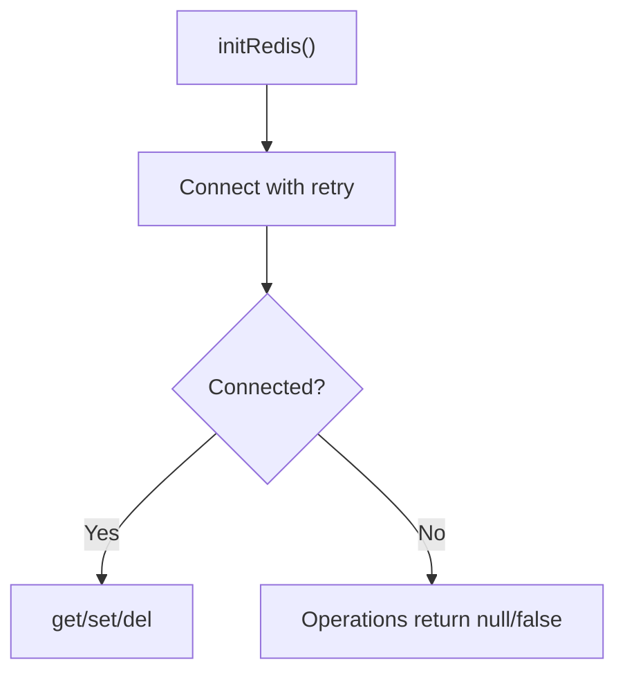

**Diagram sources**
- [models/redis.js:16-112](file://backend/src/models/redis.js#L16-L112)

**Section sources**
- [models/redis.js:99-112](file://backend/src/models/redis.js#L99-L112)

## Dependency Analysis
- Server orchestrates initialization of database, Redis, and pollers.
- Pollers depend on services for data collection and models for persistence and caching.
- Services encapsulate external integrations and rate limits.
- Configuration drives scheduling intervals and external endpoints.

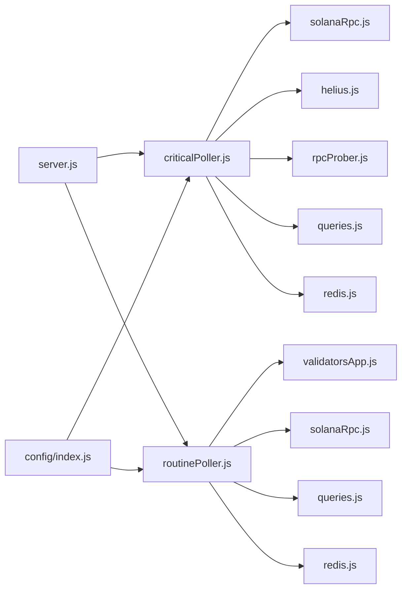

**Diagram sources**
- [server.js:84-107](file://backend/server.js#L84-L107)
- [jobs/criticalPoller.js:8-13](file://backend/src/jobs/criticalPoller.js#L8-L13)
- [jobs/routinePoller.js:8-12](file://backend/src/jobs/routinePoller.js#L8-L12)
- [config/index.js:55](file://backend/src/config/index.js#L55)

**Section sources**
- [server.js:84-107](file://backend/server.js#L84-L107)
- [config/index.js:55-59](file://backend/src/config/index.js#L55-L59)

## Performance Considerations
- Concurrency: Critical poller uses Promise.all for parallel network metrics; RPC prober probes providers concurrently.
- Timeouts: RPC probing enforces 5-second timeouts; Helius requests enforce 10-second timeouts; Validators.app requests enforce 30-second timeouts.
- Caching: Short TTLs for frequently changing data (network and RPC); longer TTLs for less volatile data (validators and epoch).
- Database pooling: PostgreSQL pool with bounded connections and idle timeouts.
- Graceful degradation: All DB and Redis operations are wrapped in try/catch and continue on failure to avoid halting the system.

[No sources needed since this section provides general guidance]

## Troubleshooting Guide
Common issues and resolutions:
- Database not configured: The server logs a warning and continues without DB features. Ensure DATABASE_URL is set.
- Redis not configured: The Redis module logs a warning and all cache operations return null/false. Ensure REDIS_URL is set.
- Missing Helius API key: Helius service skips priority fee fetching and logs a message. Configure HELIUS_API_KEY and/or HELIUS_RPC_URL.
- Validators.app API key missing: Validators.app client logs a message and returns empty data. Configure VALIDATORS_APP_API_KEY and/or VALIDATORS_APP_BASE_URL.
- Rate limit warnings: The rate limiter warns when approaching the 40/5-min limit. Consider reducing fetch frequency or increasing limits.
- Overlapping poller runs: The internal guard prevents overlapping ticks; if a tick takes longer than the interval, subsequent ticks are skipped.
- WebSocket emissions: If io is not available, broadcasts are skipped. Ensure the server initializes Socket.io before starting pollers.

**Section sources**
- [server.js:90-102](file://backend/server.js#L90-L102)
- [services/helius.js:15-18](file://backend/src/services/helius.js#L15-L18)
- [services/validatorsApp.js:117-119](file://backend/src/services/validatorsApp.js#L117-L119)
- [services/validatorsApp.js:84-88](file://backend/src/services/validatorsApp.js#L84-L88)
- [jobs/criticalPoller.js:24-27](file://backend/src/jobs/criticalPoller.js#L24-L27)
- [jobs/routinePoller.js:23-25](file://backend/src/jobs/routinePoller.js#L23-L25)

## Conclusion
InfraWatch’s background job system is designed for reliability and responsiveness. The critical poller ensures near-real-time network and RPC visibility, while the routine poller tracks validator changes and emits alerts. Robust error handling, caching, and graceful degradation keep the system operational under adverse conditions. Configuration enables flexible scheduling and external integrations.

[No sources needed since this section summarizes without analyzing specific files]

## Appendices

### Job Configuration and Intervals
- Critical poller interval: 30 seconds by default; configurable via CRITICAL_POLL_INTERVAL environment variable.
- Routine poller interval: 5 minutes by default; configurable via ROUTINE_POLL_INTERVAL environment variable.
- Redis TTLs: Short for frequently updated data; longer for historical or stable data.

**Section sources**
- [config/index.js:55-59](file://backend/src/config/index.js#L55-L59)
- [models/cacheKeys.js:42-48](file://backend/src/models/cacheKeys.js#L42-L48)

### Adding a New Poller
Steps:
1. Create a new job file under jobs/ with a start function that schedules a cron tick and guards against overlapping runs.
2. Implement the collection logic using existing services (e.g., solanaRpc, rpcProber, validatorsApp).
3. Persist data via models/queries and update Redis via models/redis.
4. Broadcast updates via Socket.io if needed.
5. Import and start the new poller in server.js alongside existing ones.

Example references:
- [jobs/criticalPoller.js:21-103](file://backend/src/jobs/criticalPoller.js#L21-L103)
- [jobs/routinePoller.js:20-111](file://backend/src/jobs/routinePoller.js#L20-L111)
- [server.js:105-106](file://backend/server.js#L105-L106)

**Section sources**
- [jobs/criticalPoller.js:21-103](file://backend/src/jobs/criticalPoller.js#L21-L103)
- [jobs/routinePoller.js:20-111](file://backend/src/jobs/routinePoller.js#L20-L111)
- [server.js:105-106](file://backend/server.js#L105-L106)

### Modifying Collection Intervals
- Adjust CRITICAL_POLL_INTERVAL and ROUTINE_POLL_INTERVAL environment variables to change intervals in milliseconds.
- Re-start the server to apply new cron schedules.

**Section sources**
- [config/index.js:57-58](file://backend/src/config/index.js#L57-L58)

### Debugging Data Collection Issues
- Enable verbose logging in services and jobs to inspect request outcomes and errors.
- Verify environment variables for external APIs (Helius, Validators.app, Solana RPC).
- Check database connectivity and migrations; confirm indexes exist for time-series queries.
- Inspect Redis connectivity and TTLs; ensure cache keys match expectations.
- Monitor rate limiter status for Validators.app to avoid throttling.

**Section sources**
- [services/helius.js:15-18](file://backend/src/services/helius.js#L15-L18)
- [services/validatorsApp.js:117-119](file://backend/src/services/validatorsApp.js#L117-L119)
- [models/migrate.js:11-94](file://backend/src/models/migrate.js#L11-L94)
- [models/redis.js:99-112](file://backend/src/models/redis.js#L99-L112)