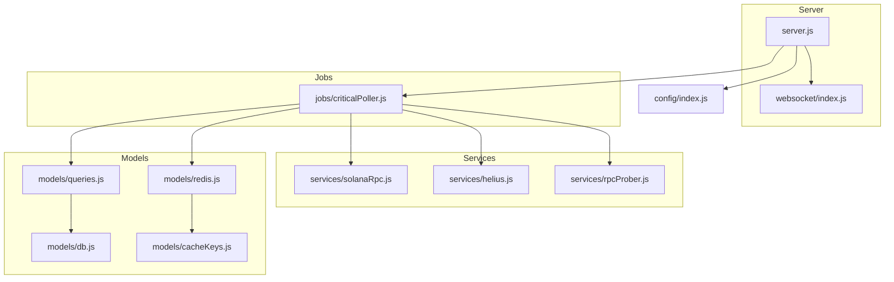
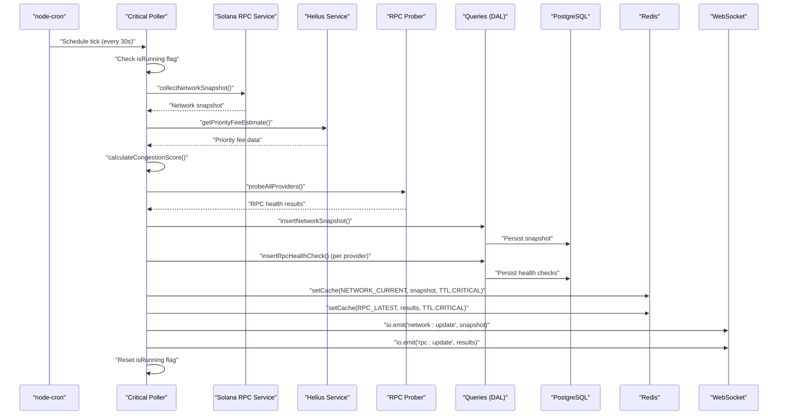
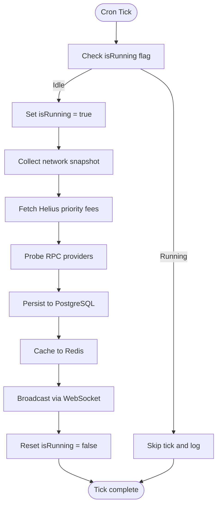
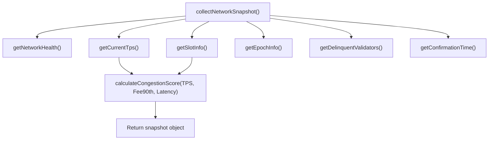
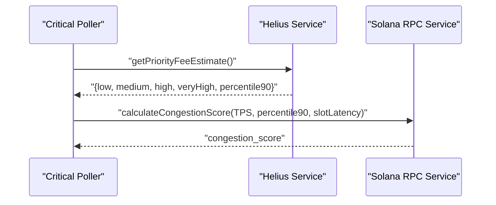
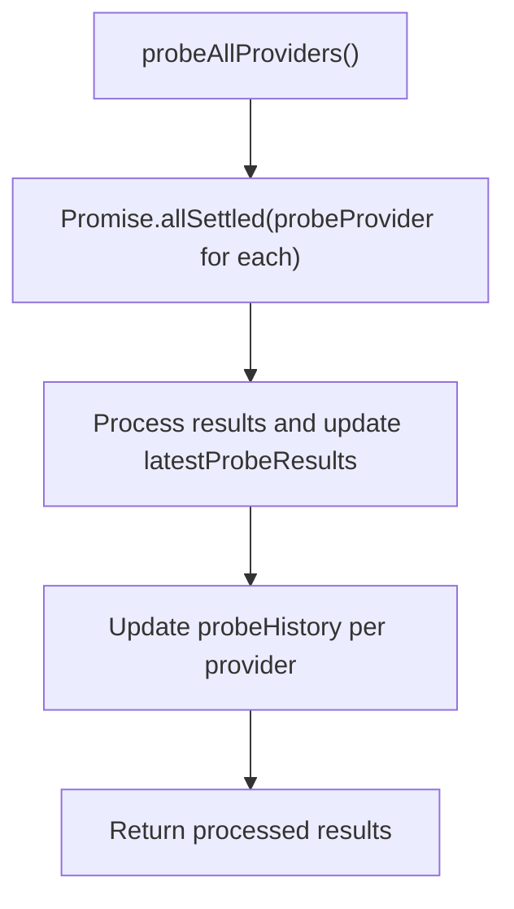
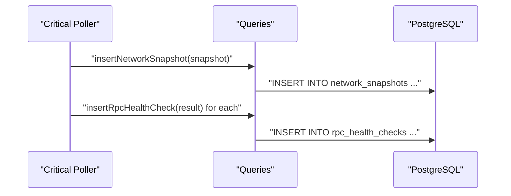
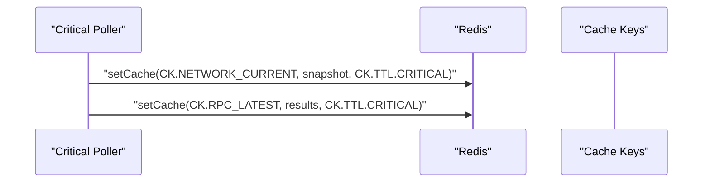
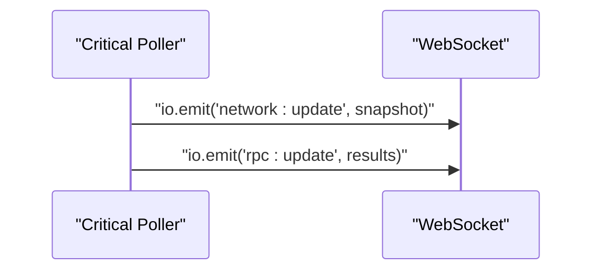
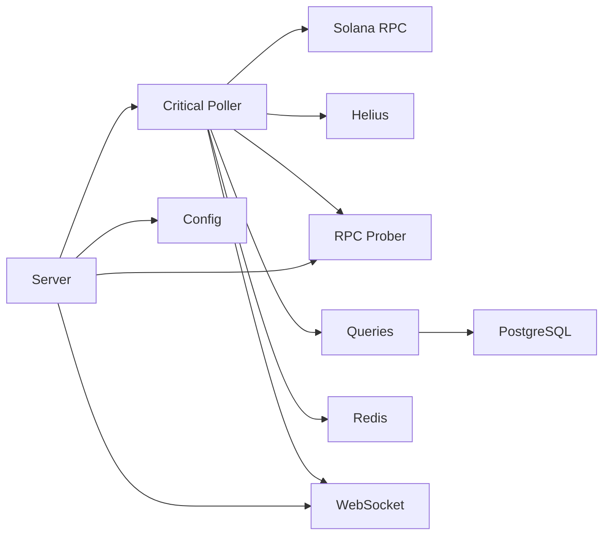

# Critical Poller (30s Intervals)

<cite>
**Referenced Files in This Document**
- [criticalPoller.js](file://backend/src/jobs/criticalPoller.js)
- [solanaRpc.js](file://backend/src/services/solanaRpc.js)
- [helius.js](file://backend/src/services/helius.js)
- [rpcProber.js](file://backend/src/services/rpcProber.js)
- [queries.js](file://backend/src/models/queries.js)
- [db.js](file://backend/src/models/db.js)
- [redis.js](file://backend/src/models/redis.js)
- [cacheKeys.js](file://backend/src/models/cacheKeys.js)
- [websocket/index.js](file://backend/src/websocket/index.js)
- [config/index.js](file://backend/src/config/index.js)
- [server.js](file://backend/server.js)
</cite>

## Table of Contents
1. [Introduction](#introduction)
2. [Project Structure](#project-structure)
3. [Core Components](#core-components)
4. [Architecture Overview](#architecture-overview)
5. [Detailed Component Analysis](#detailed-component-analysis)
6. [Dependency Analysis](#dependency-analysis)
7. [Performance Considerations](#performance-considerations)
8. [Troubleshooting Guide](#troubleshooting-guide)
9. [Conclusion](#conclusion)

## Introduction
The Critical Poller is the system heartbeat of InfraWatch, executing every 30 seconds to collect real-time network metrics, enhance them with priority fee insights, probe RPC providers, persist data, cache it for fast retrieval, and broadcast updates to connected clients. It ensures the dashboard remains responsive and accurate by maintaining a continuous stream of fresh data while gracefully handling failures in downstream systems like the database and Redis.

## Project Structure
The Critical Poller lives in the jobs layer and orchestrates services and models to deliver a complete monitoring pipeline. The server initializes data stores and starts both critical and routine pollers, exposing a Socket.io instance for real-time broadcasting.

**Diagram sources**
- [server.js:1-128](file://backend/server.js#L1-L128)
- [criticalPoller.js:1-108](file://backend/src/jobs/criticalPoller.js#L1-L108)
- [solanaRpc.js:1-340](file://backend/src/services/solanaRpc.js#L1-L340)
- [helius.js:1-188](file://backend/src/services/helius.js#L1-L188)
- [rpcProber.js:1-342](file://backend/src/services/rpcProber.js#L1-L342)
- [queries.js:1-459](file://backend/src/models/queries.js#L1-L459)
- [db.js:1-98](file://backend/src/models/db.js#L1-L98)
- [redis.js:1-161](file://backend/src/models/redis.js#L1-L161)
- [cacheKeys.js:1-50](file://backend/src/models/cacheKeys.js#L1-L50)
- [config/index.js:1-68](file://backend/src/config/index.js#L1-L68)

**Section sources**
- [server.js:1-128](file://backend/server.js#L1-L128)
- [criticalPoller.js:1-108](file://backend/src/jobs/criticalPoller.js#L1-L108)

## Core Components
- Critical Poller: Orchestrates the 30-second cycle with concurrency control and graceful error handling.
- Solana RPC Service: Gathers TPS, slot latency, epoch info, delinquent validators, and confirmation time.
- Helius Service: Provides priority fee estimates to enhance congestion scoring.
- RPC Prober: Probes multiple RPC providers for health and latency.
- Data Access Layer: Inserts snapshots and health checks into PostgreSQL.
- Database: Manages connection pooling and query execution.
- Redis: Caches current network and RPC data with TTLs.
- Cache Keys: Centralizes cache key naming and TTL values.
- WebSocket: Broadcasts updates to connected clients.
- Configuration: Supplies environment-driven settings including polling intervals.

**Section sources**
- [criticalPoller.js:15-107](file://backend/src/jobs/criticalPoller.js#L15-L107)
- [solanaRpc.js:275-328](file://backend/src/services/solanaRpc.js#L275-L328)
- [helius.js:13-70](file://backend/src/services/helius.js#L13-L70)
- [rpcProber.js:140-180](file://backend/src/services/rpcProber.js#L140-L180)
- [queries.js:27-48](file://backend/src/models/queries.js#L27-L48)
- [db.js:15-70](file://backend/src/models/db.js#L15-L70)
- [redis.js:99-112](file://backend/src/models/redis.js#L99-L112)
- [cacheKeys.js:6-49](file://backend/src/models/cacheKeys.js#L6-L49)
- [websocket/index.js:13-52](file://backend/src/websocket/index.js#L13-L52)
- [config/index.js:55-59](file://backend/src/config/index.js#L55-L59)

## Architecture Overview
The Critical Poller executes on a fixed schedule, collecting data from Solana RPC, enriching it with Helius priority fees, probing RPC providers, persisting to PostgreSQL, caching in Redis, and broadcasting via WebSocket. Concurrency control prevents overlapping runs, while try/catch blocks ensure failures in storage or caching do not halt the job.

**Diagram sources**
- [criticalPoller.js:23-100](file://backend/src/jobs/criticalPoller.js#L23-L100)
- [solanaRpc.js:275-328](file://backend/src/services/solanaRpc.js#L275-L328)
- [helius.js:13-70](file://backend/src/services/helius.js#L13-L70)
- [rpcProber.js:140-180](file://backend/src/services/rpcProber.js#L140-L180)
- [queries.js:27-118](file://backend/src/models/queries.js#L27-L118)
- [redis.js:99-112](file://backend/src/models/redis.js#L99-L112)
- [websocket/index.js:48-52](file://backend/src/websocket/index.js#L48-L52)

## Detailed Component Analysis

### Critical Poller Job Execution Pattern
- Scheduler: Uses node-cron to run every 30 seconds.
- Concurrency Control: An isRunning flag prevents overlapping executions.
- Sequential Workflow:
  1. Network snapshot collection via Solana RPC service.
  2. Helius priority fee enhancement for congestion scoring.
  3. RPC provider probing for health and latency.
  4. Database persistence of snapshots and health checks.
  5. Redis caching of current network and RPC data.
  6. WebSocket broadcasting to connected clients.
- Error Handling: Try/catch around DB and Redis operations logs warnings and continues.

**Diagram sources**
- [criticalPoller.js:23-100](file://backend/src/jobs/criticalPoller.js#L23-L100)

**Section sources**
- [criticalPoller.js:21-100](file://backend/src/jobs/criticalPoller.js#L21-L100)

### Network Snapshot Collection (Solana RPC)
- Gathers:
  - Network health status
  - Current TPS and sample period
  - Slot height and estimated latency
  - Epoch info (progress, ETA)
  - Delinquent validators count
  - Average confirmation time
  - Optional congestion score (enhanced by Helius)
- Calculates congestion score using TPS, priority fee percentile, and slot latency.

**Diagram sources**
- [solanaRpc.js:275-328](file://backend/src/services/solanaRpc.js#L275-L328)
- [solanaRpc.js:228-268](file://backend/src/services/solanaRpc.js#L228-L268)

**Section sources**
- [solanaRpc.js:275-328](file://backend/src/services/solanaRpc.js#L275-L328)
- [solanaRpc.js:228-268](file://backend/src/services/solanaRpc.js#L228-L268)

### Helius Priority Fee Enhancement
- Fetches priority fee levels (low, medium, high, very high, percentile90).
- Uses fee data to compute congestion score when available.
- Graceful handling when API key or RPC URL are not configured.

**Diagram sources**
- [helius.js:13-70](file://backend/src/services/helius.js#L13-L70)
- [solanaRpc.js:228-268](file://backend/src/services/solanaRpc.js#L228-L268)

**Section sources**
- [helius.js:13-70](file://backend/src/services/helius.js#L13-L70)
- [solanaRpc.js:294-301](file://backend/src/services/solanaRpc.js#L294-L301)

### RPC Provider Probing
- Probes multiple providers concurrently using axios POST requests.
- Measures latency and determines health status.
- Maintains module-level history and rolling statistics for uptime and percentiles.

**Diagram sources**
- [rpcProber.js:140-180](file://backend/src/services/rpcProber.js#L140-L180)

**Section sources**
- [rpcProber.js:140-180](file://backend/src/services/rpcProber.js#L140-L180)

### Database Persistence (PostgreSQL)
- Inserts network snapshots and per-provider health checks.
- Uses parameterized queries to prevent SQL injection.
- Connection pooling with timeouts and error handling.

**Diagram sources**
- [queries.js:27-118](file://backend/src/models/queries.js#L27-L118)
- [db.js:15-70](file://backend/src/models/db.js#L15-L70)

**Section sources**
- [queries.js:27-118](file://backend/src/models/queries.js#L27-L118)
- [db.js:15-70](file://backend/src/models/db.js#L15-L70)

### Redis Caching
- Sets cache entries for current network and latest RPC results.
- Uses JSON serialization and TTL values defined centrally.
- Graceful failure logging if Redis is unavailable.

**Diagram sources**
- [criticalPoller.js:80-86](file://backend/src/jobs/criticalPoller.js#L80-L86)
- [redis.js:99-112](file://backend/src/models/redis.js#L99-L112)
- [cacheKeys.js:6-49](file://backend/src/models/cacheKeys.js#L6-L49)

**Section sources**
- [criticalPoller.js:80-86](file://backend/src/jobs/criticalPoller.js#L80-L86)
- [redis.js:99-112](file://backend/src/models/redis.js#L99-L112)
- [cacheKeys.js:6-49](file://backend/src/models/cacheKeys.js#L6-L49)

### WebSocket Broadcasting
- Emits network and RPC updates to all connected clients.
- Integrates with Socket.io setup and exposes IO globally.

**Diagram sources**
- [criticalPoller.js:88-92](file://backend/src/jobs/criticalPoller.js#L88-L92)
- [websocket/index.js:48-52](file://backend/src/websocket/index.js#L48-L52)

**Section sources**
- [criticalPoller.js:88-92](file://backend/src/jobs/criticalPoller.js#L88-L92)
- [websocket/index.js:13-52](file://backend/src/websocket/index.js#L13-L52)

### Configuration and Environment
- Polling intervals configurable via environment variables.
- Solana RPC and Helius endpoints derived from environment.
- Database and Redis URLs loaded for initialization.

**Section sources**
- [config/index.js:55-59](file://backend/src/config/index.js#L55-L59)
- [config/index.js:22-37](file://backend/src/config/index.js#L22-L37)
- [config/index.js:45-53](file://backend/src/config/index.js#L45-L53)

## Dependency Analysis
The Critical Poller depends on services and models to fulfill its pipeline. The server wires everything together, initializing data stores and starting both critical and routine pollers.

**Diagram sources**
- [server.js:29-31](file://backend/server.js#L29-L31)
- [server.js:80-107](file://backend/server.js#L80-L107)
- [criticalPoller.js:8-13](file://backend/src/jobs/criticalPoller.js#L8-L13)

**Section sources**
- [server.js:29-31](file://backend/server.js#L29-L31)
- [server.js:80-107](file://backend/server.js#L80-L107)
- [criticalPoller.js:8-13](file://backend/src/jobs/criticalPoller.js#L8-L13)

## Performance Considerations
- Concurrency Control: The isRunning flag prevents overlapping runs, ensuring predictable resource usage.
- Asynchronous Operations: Uses Promise.all for concurrent data collection and Promise.allSettled for provider probing to minimize latency.
- Connection Pooling: PostgreSQL pool limits connections and handles idle timeouts.
- Redis Retry Strategy: ioredis retry strategy and max retries per request improve resilience.
- TTL Management: Centralized TTL values balance freshness and cache pressure.
- Graceful Degradation: DB and Redis failures are caught and logged without crashing the job.

[No sources needed since this section provides general guidance]

## Troubleshooting Guide
Common issues and remedies:
- Database Unavailable:
  - Symptom: Warnings during insert operations.
  - Action: Verify DATABASE_URL and connectivity; monitor pool errors.
- Redis Unavailable:
  - Symptom: Warnings during cache updates.
  - Action: Verify REDIS_URL and connection readiness; check retry strategy logs.
- Helius API Misconfiguration:
  - Symptom: Missing priority fee enhancements.
  - Action: Ensure HELIUS_API_KEY and HELIUS_RPC_URL are set; confirm endpoint accessibility.
- Cron Overlap:
  - Symptom: Skipped ticks logged.
  - Action: Confirm isRunning flag behavior and adjust if necessary.
- WebSocket Broadcast Failures:
  - Symptom: Clients not receiving updates.
  - Action: Check Socket.io setup and connection counts.

**Section sources**
- [criticalPoller.js:49-78](file://backend/src/jobs/criticalPoller.js#L49-L78)
- [criticalPoller.js:84-86](file://backend/src/jobs/criticalPoller.js#L84-L86)
- [helius.js:14-18](file://backend/src/services/helius.js#L14-L18)
- [db.js:33-44](file://backend/src/models/db.js#L33-L44)
- [redis.js:28-35](file://backend/src/models/redis.js#L28-L35)
- [websocket/index.js:16-30](file://backend/src/websocket/index.js#L16-L30)

## Conclusion
The Critical Poller is the backbone of InfraWatch’s real-time monitoring. Its 30-second cadence, robust error handling, and layered caching strategy ensure the system remains responsive even under partial outages. By centralizing cache keys, leveraging asynchronous operations, and broadcasting updates via WebSocket, it delivers a reliable heartbeat for the entire platform.