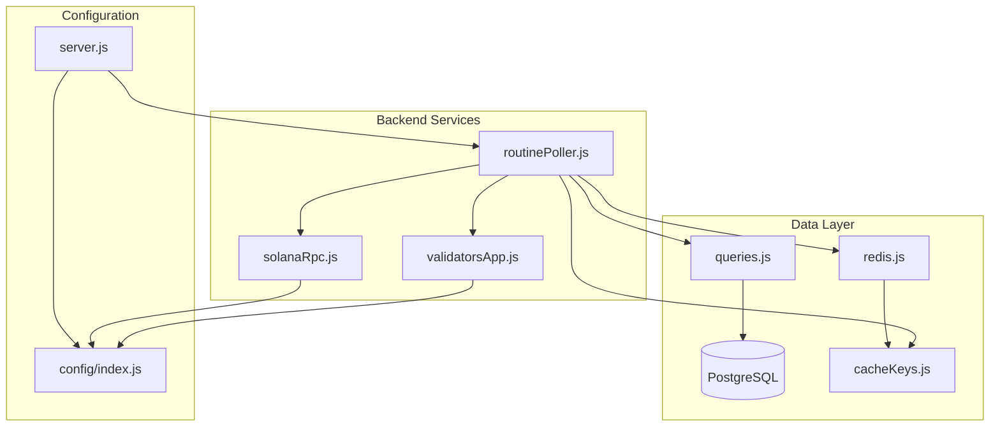
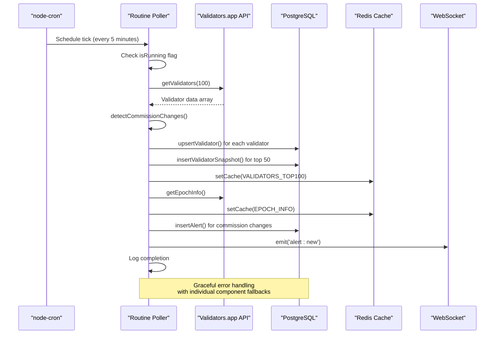
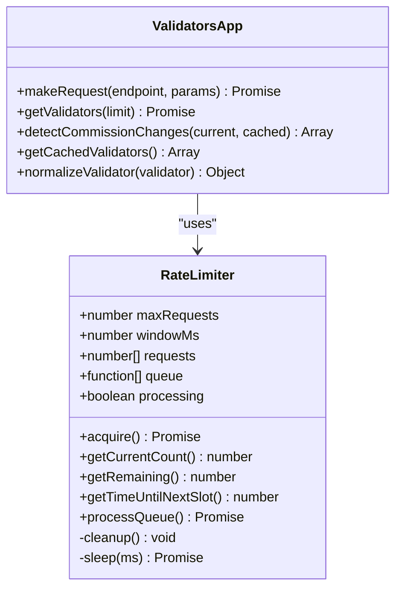
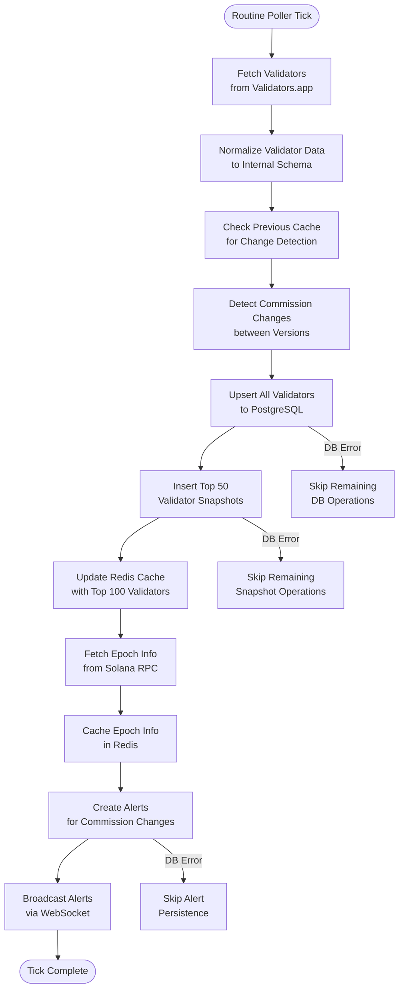
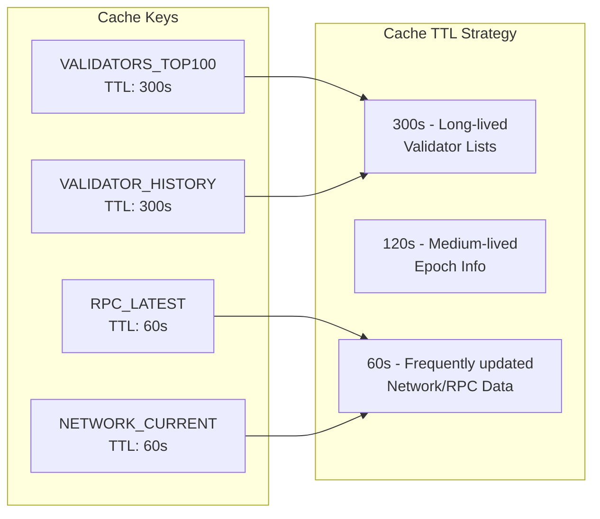
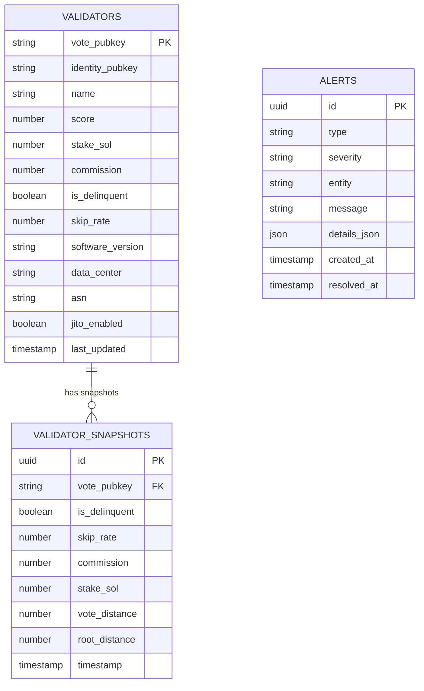

# Routine Poller (Lower Frequency)

<cite>
**Referenced Files in This Document**
- [routinePoller.js](file://backend/src/jobs/routinePoller.js)
- [validatorsApp.js](file://backend/src/services/validatorsApp.js)
- [queries.js](file://backend/src/models/queries.js)
- [redis.js](file://backend/src/models/redis.js)
- [cacheKeys.js](file://backend/src/models/cacheKeys.js)
- [config/index.js](file://backend/src/config/index.js)
- [server.js](file://backend/server.js)
- [criticalPoller.js](file://backend/src/jobs/criticalPoller.js)
- [solanaRpc.js](file://backend/src/services/solanaRpc.js)
</cite>

## Table of Contents
1. [Introduction](#introduction)
2. [Project Structure](#project-structure)
3. [Core Components](#core-components)
4. [Architecture Overview](#architecture-overview)
5. [Detailed Component Analysis](#detailed-component-analysis)
6. [Dependency Analysis](#dependency-analysis)
7. [Performance Considerations](#performance-considerations)
8. [Troubleshooting Guide](#troubleshooting-guide)
9. [Conclusion](#conclusion)

## Introduction
The Routine Poller is a lower-frequency data collection mechanism designed for less time-sensitive but important validator monitoring tasks. Operating on a 5-minute schedule, it complements the critical 30-second heartbeat by focusing on comprehensive validator data collection, historical tracking, and long-term analytics. This implementation provides robust data collection from Validators.app API, maintains historical validator snapshots, and integrates seamlessly with the broader monitoring ecosystem.

## Project Structure
The Routine Poller operates within the backend's job scheduling system alongside the critical poller. It follows a modular architecture with clear separation of concerns across services, data access layers, and caching mechanisms.



**Diagram sources**
- [routinePoller.js:1-116](file://backend/src/jobs/routinePoller.js#L1-L116)
- [validatorsApp.js:1-388](file://backend/src/services/validatorsApp.js#L1-L388)
- [queries.js:1-459](file://backend/src/models/queries.js#L1-L459)
- [redis.js:1-161](file://backend/src/models/redis.js#L1-L161)
- [cacheKeys.js:1-50](file://backend/src/models/cacheKeys.js#L1-L50)
- [config/index.js:1-68](file://backend/src/config/index.js#L1-L68)
- [server.js:1-128](file://backend/server.js#L1-L128)

**Section sources**
- [routinePoller.js:1-116](file://backend/src/jobs/routinePoller.js#L1-L116)
- [server.js:83-107](file://backend/server.js#L83-L107)

## Core Components
The Routine Poller consists of several interconnected components that work together to provide comprehensive validator monitoring:

### Primary Data Collection Pipeline
The routine poller executes a structured pipeline that collects validator data from external APIs, processes it, and persists it to multiple storage systems.

### Rate Limiting and Caching Infrastructure
Built-in rate limiting ensures compliance with Validators.app API constraints while maintaining efficient data collection throughput.

### Historical Data Management
Systematic snapshot creation enables long-term trend analysis and historical comparison of validator performance metrics.

**Section sources**
- [routinePoller.js:20-111](file://backend/src/jobs/routinePoller.js#L20-L111)
- [validatorsApp.js:9-99](file://backend/src/services/validatorsApp.js#L9-L99)

## Architecture Overview
The Routine Poller implements a comprehensive monitoring architecture that balances data freshness with system resource efficiency.



**Diagram sources**
- [routinePoller.js:21-108](file://backend/src/jobs/routinePoller.js#L21-L108)
- [validatorsApp.js:186-209](file://backend/src/services/validatorsApp.js#L186-L209)
- [queries.js:180-220](file://backend/src/models/queries.js#L180-L220)
- [queries.js:282-300](file://backend/src/models/queries.js#L282-L300)
- [queries.js:340-356](file://backend/src/models/queries.js#L340-L356)

## Detailed Component Analysis

### Rate Limiter Implementation
The Validators.app API client includes a sophisticated rate limiter that enforces a 40-request-per-5-minute constraint through a sliding window algorithm.



**Diagram sources**
- [validatorsApp.js:10-99](file://backend/src/services/validatorsApp.js#L10-L99)
- [validatorsApp.js:115-149](file://backend/src/services/validatorsApp.js#L115-L149)

The rate limiter employs a queue-based approach with automatic cleanup of expired requests, ensuring optimal utilization of the API quota while preventing violations.

**Section sources**
- [validatorsApp.js:9-99](file://backend/src/services/validatorsApp.js#L9-L99)
- [validatorsApp.js:115-149](file://backend/src/services/validatorsApp.js#L115-L149)

### Data Processing Workflow
The routine poller implements a multi-stage data processing pipeline that transforms raw API responses into normalized validator records suitable for storage and analysis.



**Diagram sources**
- [routinePoller.js:30-100](file://backend/src/jobs/routinePoller.js#L30-L100)

**Section sources**
- [routinePoller.js:30-100](file://backend/src/jobs/routinePoller.js#L30-L100)
- [validatorsApp.js:156-179](file://backend/src/services/validatorsApp.js#L156-L179)

### Cache Management Strategy
The system implements a tiered caching strategy with different TTL values optimized for various data types and access patterns.



**Diagram sources**
- [cacheKeys.js:6-49](file://backend/src/models/cacheKeys.js#L6-L49)

**Section sources**
- [cacheKeys.js:6-49](file://backend/src/models/cacheKeys.js#L6-L49)
- [redis.js:99-112](file://backend/src/models/redis.js#L99-L112)

### Database Integration Patterns
The routine poller uses PostgreSQL for persistent storage with careful error handling to maintain system stability during database outages.



**Diagram sources**
- [queries.js:180-220](file://backend/src/models/queries.js#L180-L220)
- [queries.js:282-300](file://backend/src/models/queries.js#L282-L300)
- [queries.js:340-356](file://backend/src/models/queries.js#L340-L356)

**Section sources**
- [queries.js:180-220](file://backend/src/models/queries.js#L180-L220)
- [queries.js:282-300](file://backend/src/models/queries.js#L282-L300)
- [queries.js:340-356](file://backend/src/models/queries.js#L340-L356)

## Dependency Analysis
The Routine Poller exhibits loose coupling with its dependencies while maintaining clear interface contracts.

```mermaid
graph TB
subgraph "External Dependencies"
AX[axios]
NC[node-cron]
PG[pg (node-postgres)]
IR[ioredis]
end
subgraph "Internal Dependencies"
VA[validatorsApp.js]
Q[queries.js]
RD[redis.js]
CK[cacheKeys.js]
SR[solanaRpc.js]
end
RP[routinePoller.js] --> VA
RP --> Q
RP --> RD
RP --> CK
RP --> SR
VA --> AX
VA --> NC
Q --> PG
RD --> IR
```

**Diagram sources**
- [routinePoller.js:7-12](file://backend/src/jobs/routinePoller.js#L7-L12)
- [validatorsApp.js:6-7](file://backend/src/services/validatorsApp.js#L6-L7)
- [queries.js:7](file://backend/src/models/queries.js#L7)
- [redis.js:6](file://backend/src/models/redis.js#L6)

**Section sources**
- [routinePoller.js:7-12](file://backend/src/jobs/routinePoller.js#L7-L12)
- [validatorsApp.js:6-7](file://backend/src/services/validatorsApp.js#L6-L7)

## Performance Considerations
The Routine Poller is designed with several performance optimization strategies:

### Scheduling Strategy
- **5-minute cadence**: Balances data freshness with system resource efficiency
- **Mutex protection**: Prevents overlapping executions during long-running operations
- **Graceful degradation**: Individual component failures don't cascade to complete failure

### Memory Management
- **Batch processing**: Validates processed in batches to manage memory usage
- **Cache TTL optimization**: Different TTL values for different data types
- **Connection pooling**: Efficient database connection reuse

### API Efficiency
- **Rate limiting compliance**: Built-in 40-request-per-5-minute enforcement
- **Response normalization**: Single transformation point reduces processing overhead
- **Selective caching**: Only top 100 validators cached for frequent access

**Section sources**
- [config/index.js:55-59](file://backend/src/config/index.js#L55-L59)
- [routinePoller.js:14](file://backend/src/jobs/routinePoller.js#L14)
- [validatorsApp.js:102](file://backend/src/services/validatorsApp.js#L102)

## Troubleshooting Guide

### Common Issues and Solutions

#### API Rate Limiting
**Problem**: Exceeding Validators.app API limits
**Solution**: Monitor rate limiter status and adjust polling frequency if needed
- Check rate limiter status via `validatorsApp.getRateLimitStatus()`
- Review rate limiter warnings in logs
- Consider reducing concurrent operations

#### Database Connectivity Issues
**Problem**: PostgreSQL connection failures during upsert operations
**Solution**: The system implements graceful degradation
- Individual validator upsert failures don't stop the entire process
- Database errors are logged but don't crash the poller
- Monitor database connection pool status

#### Cache Service Failures
**Problem**: Redis connectivity issues affecting cache updates
**Solution**: Cache operations are optional and don't block primary processing
- Cache failures are logged but don't prevent data persistence
- System continues operation with reduced caching benefits

#### Commission Change Detection
**Problem**: Missing commission change notifications
**Solution**: Verify cache timing and change detection logic
- Ensure cache TTL aligns with polling frequency
- Check that validator data includes commission information
- Monitor change detection algorithm output

**Section sources**
- [validatorsApp.js:364-371](file://backend/src/services/validatorsApp.js#L364-L371)
- [routinePoller.js:38-45](file://backend/src/jobs/routinePoller.js#L38-L45)
- [routinePoller.js:65-70](file://backend/src/jobs/routinePoller.js#L65-L70)

## Conclusion
The Routine Poller provides a robust, efficient solution for lower-frequency validator monitoring tasks. Its design emphasizes reliability through graceful error handling, performance through strategic caching and batch processing, and scalability through modular architecture. By operating independently of the critical 30-second heartbeat, it ensures comprehensive coverage of validator data while maintaining system stability and resource efficiency.

The implementation demonstrates best practices in distributed system design, including proper error isolation, resource management, and integration with external services. The combination of real-time critical monitoring and periodic routine polling creates a comprehensive monitoring solution that captures both immediate network conditions and long-term trends in validator performance and behavior.