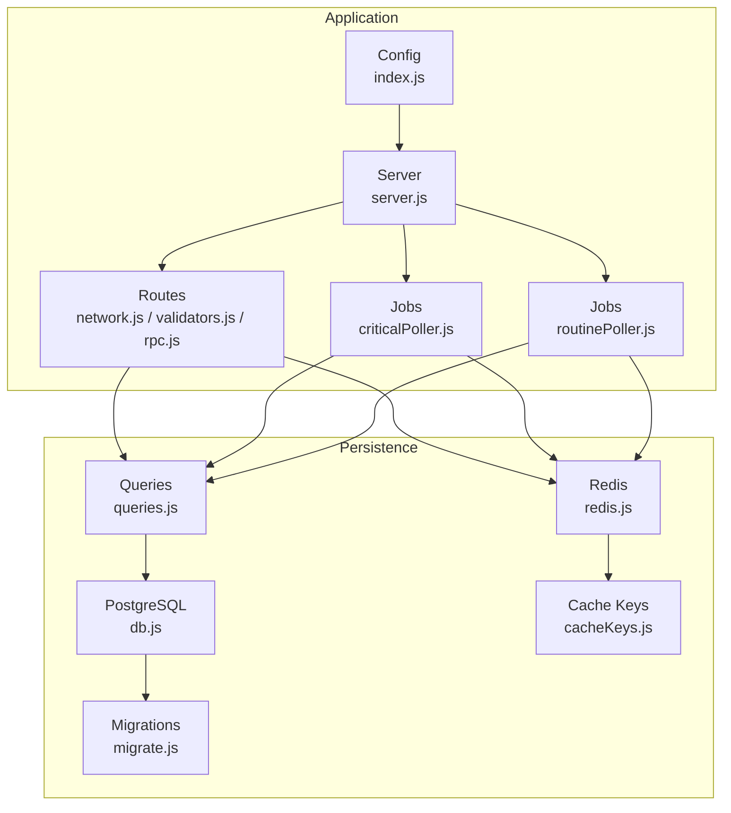
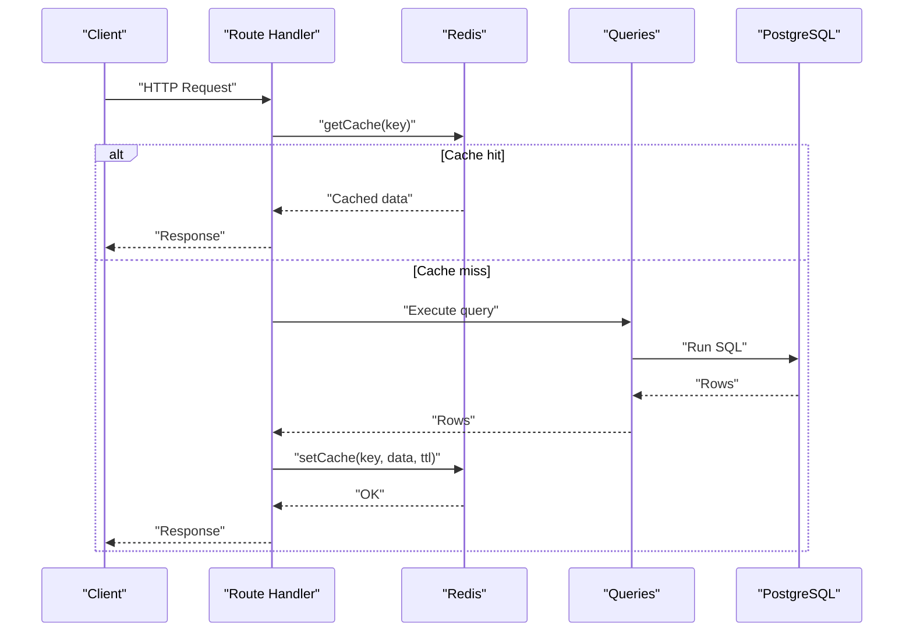
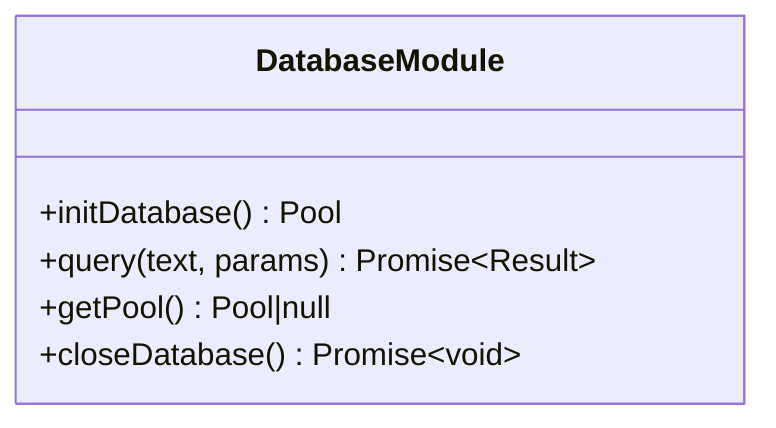
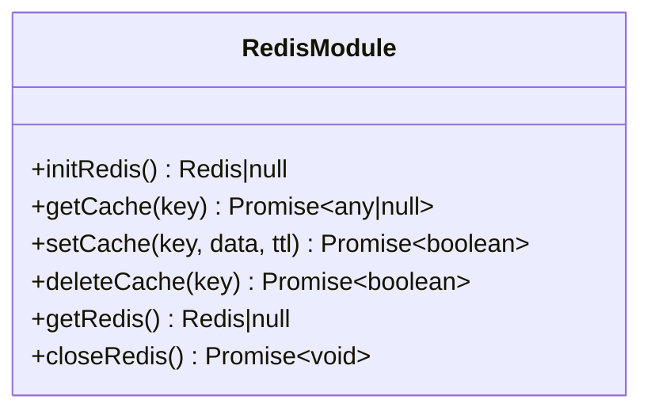
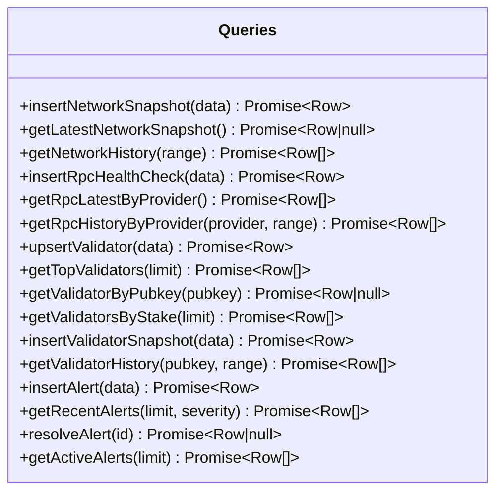
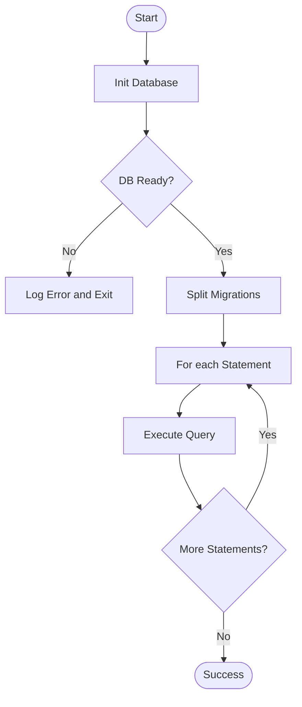
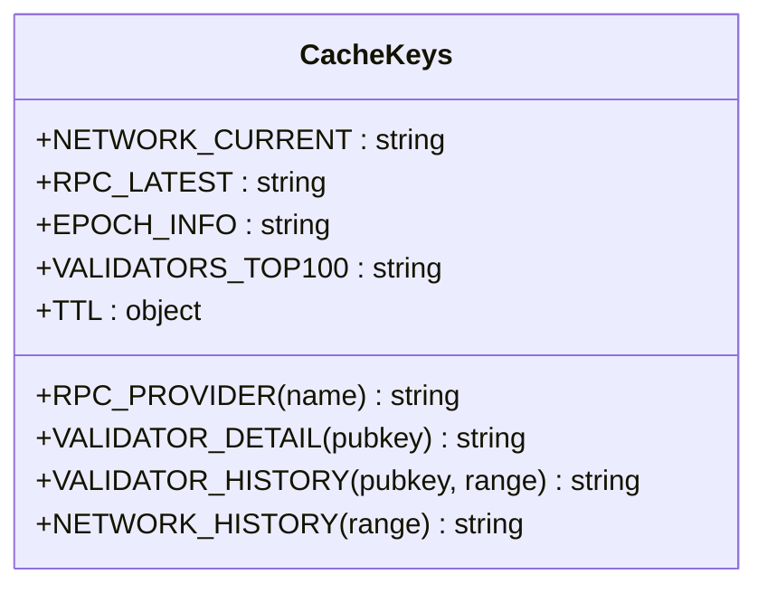
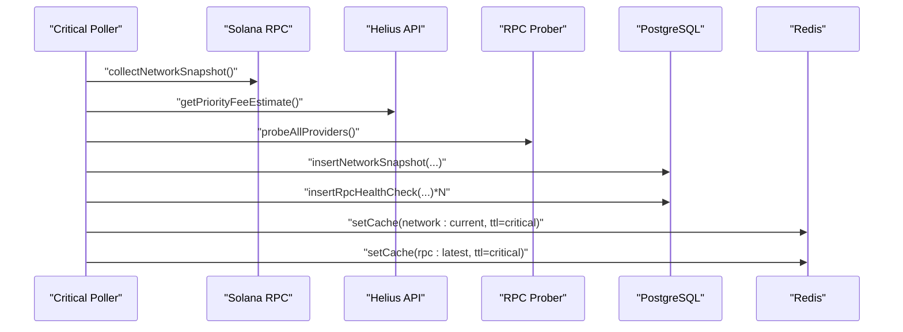
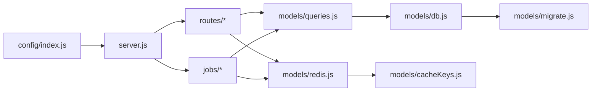

# Data Persistence Layer

<cite>
**Referenced Files in This Document**
- [db.js](file://backend/src/models/db.js)
- [redis.js](file://backend/src/models/redis.js)
- [migrate.js](file://backend/src/models/migrate.js)
- [cacheKeys.js](file://backend/src/models/cacheKeys.js)
- [queries.js](file://backend/src/models/queries.js)
- [index.js](file://backend/src/config/index.js)
- [server.js](file://backend/server.js)
- [criticalPoller.js](file://backend/src/jobs/criticalPoller.js)
- [routinePoller.js](file://backend/src/jobs/routinePoller.js)
- [network.js](file://backend/src/routes/network.js)
- [validators.js](file://backend/src/routes/validators.js)
- [rpc.js](file://backend/src/routes/rpc.js)
</cite>

## Table of Contents
1. [Introduction](#introduction)
2. [Project Structure](#project-structure)
3. [Core Components](#core-components)
4. [Architecture Overview](#architecture-overview)
5. [Detailed Component Analysis](#detailed-component-analysis)
6. [Dependency Analysis](#dependency-analysis)
7. [Performance Considerations](#performance-considerations)
8. [Troubleshooting Guide](#troubleshooting-guide)
9. [Conclusion](#conclusion)

## Introduction
This document describes the InfraWatch data persistence layer, focusing on the PostgreSQL database abstraction, Redis caching implementation, and data access patterns. It explains connection management, query execution, transaction handling, caching strategies (TTL, keys, serialization), migration system, schema evolution, data lifecycle management, cache invalidation, consistency patterns, and performance optimizations. It also provides examples of CRUD operations, bulk processing, and cache warming procedures.

## Project Structure
The data persistence layer is organized around four primary modules:
- Database abstraction using node-postgres Pool
- Redis caching using ioredis
- Data Access Layer (queries) with reusable functions
- Migration system for schema evolution

**Diagram sources**
- [server.js:1-128](file://backend/server.js#L1-L128)
- [db.js:1-98](file://backend/src/models/db.js#L1-L98)
- [redis.js:1-161](file://backend/src/models/redis.js#L1-L161)
- [queries.js:1-459](file://backend/src/models/queries.js#L1-L459)
- [migrate.js:1-160](file://backend/src/models/migrate.js#L1-L160)
- [cacheKeys.js:1-50](file://backend/src/models/cacheKeys.js#L1-L50)
- [network.js:1-135](file://backend/src/routes/network.js#L1-L135)
- [validators.js:1-112](file://backend/src/routes/validators.js#L1-L112)
- [rpc.js:1-135](file://backend/src/routes/rpc.js#L1-L135)

**Section sources**
- [server.js:1-128](file://backend/server.js#L1-L128)
- [db.js:1-98](file://backend/src/models/db.js#L1-L98)
- [redis.js:1-161](file://backend/src/models/redis.js#L1-L161)
- [queries.js:1-459](file://backend/src/models/queries.js#L1-L459)
- [migrate.js:1-160](file://backend/src/models/migrate.js#L1-L160)
- [cacheKeys.js:1-50](file://backend/src/models/cacheKeys.js#L1-L50)
- [network.js:1-135](file://backend/src/routes/network.js#L1-L135)
- [validators.js:1-112](file://backend/src/routes/validators.js#L1-L112)
- [rpc.js:1-135](file://backend/src/routes/rpc.js#L1-L135)

## Core Components
- Database abstraction layer using node-postgres Pool with lazy initialization, connection pooling, and error handling.
- Redis caching layer using ioredis with lazy initialization, reconnection strategy, and JSON serialization.
- Data Access Layer (queries.js) providing reusable functions for network snapshots, RPC health checks, validators, validator snapshots, and alerts.
- Migration system (migrate.js) that creates and indexes required tables for InfraWatch.
- Cache key constants and TTL values centralized in cacheKeys.js.

**Section sources**
- [db.js:15-98](file://backend/src/models/db.js#L15-L98)
- [redis.js:16-161](file://backend/src/models/redis.js#L16-L161)
- [queries.js:1-459](file://backend/src/models/queries.js#L1-L459)
- [migrate.js:11-160](file://backend/src/models/migrate.js#L11-L160)
- [cacheKeys.js:6-50](file://backend/src/models/cacheKeys.js#L6-L50)

## Architecture Overview
The persistence architecture follows a layered approach:
- Application layer (routes and jobs) orchestrates data collection and requests.
- Data Access Layer (queries.js) encapsulates SQL operations.
- Database layer (PostgreSQL) persists time-series and reference data.
- Caching layer (Redis) accelerates reads and reduces database load.
- Migration system ensures schema readiness.

**Diagram sources**
- [network.js:17-79](file://backend/src/routes/network.js#L17-L79)
- [validators.js:52-109](file://backend/src/routes/validators.js#L52-L109)
- [redis.js:75-112](file://backend/src/models/redis.js#L75-L112)
- [queries.js:27-84](file://backend/src/models/queries.js#L27-L84)

## Detailed Component Analysis

### Database Abstraction Layer (PostgreSQL)
- Lazy initialization via initDatabase() using node-postgres Pool with configurable pool size, idle timeout, and connection timeout.
- Connection testing on initialization and error event handling.
- Query execution using pool.connect() to acquire a client, execute the query, and release the client.
- Graceful handling when the database is not configured (returns null and logs a warning).
- Utility functions to get the pool and close the pool.

**Diagram sources**
- [db.js:15-98](file://backend/src/models/db.js#L15-L98)

**Section sources**
- [db.js:15-98](file://backend/src/models/db.js#L15-L98)
- [server.js:89-102](file://backend/server.js#L89-L102)

### Redis Caching Implementation
- Lazy initialization via initRedis() using ioredis with retry strategy, max retries, and ready checking.
- Connection events: connect, ready, close, error; maintains an isConnected flag.
- Cache operations: getCache (JSON parse), setCache (JSON stringify with TTL), deleteCache.
- Graceful degradation when Redis is unavailable (returns null/false).

**Diagram sources**
- [redis.js:16-161](file://backend/src/models/redis.js#L16-L161)

**Section sources**
- [redis.js:16-161](file://backend/src/models/redis.js#L16-L161)
- [server.js:97-102](file://backend/server.js#L97-L102)

### Data Access Layer (Queries)
Reusable functions grouped by domain:
- Network snapshots: insert, latest, history by range.
- RPC health checks: insert, latest by provider, history by provider.
- Validators: upsert, top N by score, by stake, lookup by pubkey.
- Validator snapshots: insert, history by pubkey and range.
- Alerts: insert, recent, resolve, active.

All functions use parameterized queries to prevent SQL injection and return normalized data.

**Diagram sources**
- [queries.js:27-458](file://backend/src/models/queries.js#L27-L458)

**Section sources**
- [queries.js:13-458](file://backend/src/models/queries.js#L13-L458)

### Database Migration System
- Standalone script and importable function to create required tables and indexes.
- Supports network snapshots, RPC health checks, validators, validator snapshots, and alerts.
- Executes statements sequentially with logging and continues on individual statement errors.
- Uses the database abstraction module for connectivity and query execution.

**Diagram sources**
- [migrate.js:100-139](file://backend/src/models/migrate.js#L100-L139)

**Section sources**
- [migrate.js:11-160](file://backend/src/models/migrate.js#L11-L160)

### Cache Keys and TTL Management
Centralized cache key constants and TTL values:
- Network: current snapshot, latest RPC results, epoch info, top validators, history ranges.
- RPC provider-specific keys and validator detail/history keys with time-range suffixes.
- TTL values: critical (1 min), routine (5 min), epoch (2 min), history (5 min).

**Diagram sources**
- [cacheKeys.js:6-50](file://backend/src/models/cacheKeys.js#L6-L50)

**Section sources**
- [cacheKeys.js:6-50](file://backend/src/models/cacheKeys.js#L6-L50)

### Data Lifecycle Management
- Jobs orchestrate data collection and persistence:
  - Critical poller (every 30s): collects network snapshot and RPC health, writes to DB, updates Redis cache.
  - Routine poller (every 5min): upserts validators, inserts snapshots for top validators, updates epoch info, detects changes, creates alerts.
- Routes implement cache-first patterns with graceful DB fallbacks.

**Diagram sources**
- [criticalPoller.js:21-103](file://backend/src/jobs/criticalPoller.js#L21-L103)
- [queries.js:27-118](file://backend/src/models/queries.js#L27-L118)
- [redis.js:99-112](file://backend/src/models/redis.js#L99-L112)

**Section sources**
- [criticalPoller.js:1-108](file://backend/src/jobs/criticalPoller.js#L1-L108)
- [routinePoller.js:1-116](file://backend/src/jobs/routinePoller.js#L1-L116)

### Cache Invalidation Strategies and Consistency Patterns
- Cache-first with DB fallback in route handlers.
- TTL-driven expiration for hot data (network, RPC, validators).
- Specific cache keys for provider and validator details to support targeted invalidation.
- Jobs proactively refresh caches on schedule; consumers invalidate on demand via deleteCache if needed.

**Section sources**
- [network.js:17-79](file://backend/src/routes/network.js#L17-L79)
- [validators.js:52-109](file://backend/src/routes/validators.js#L52-L109)
- [rpc.js:17-88](file://backend/src/routes/rpc.js#L17-L88)
- [redis.js:119-131](file://backend/src/models/redis.js#L119-L131)

### Performance Optimization Techniques
- Connection pooling with controlled pool size and timeouts.
- JSON serialization/deserialization in Redis for structured caching.
- Indexes on time-series columns for efficient range queries.
- Parameterized queries to prevent SQL injection and improve plan reuse.
- Graceful degradation: routes continue serving stale data or empty arrays when persistence is unavailable.

**Section sources**
- [db.js:25-30](file://backend/src/models/db.js#L25-L30)
- [redis.js:99-112](file://backend/src/models/redis.js#L99-L112)
- [migrate.js:27-94](file://backend/src/models/migrate.js#L27-L94)
- [network.js:85-132](file://backend/src/routes/network.js#L85-L132)

## Dependency Analysis
The data persistence layer exhibits low coupling and high cohesion:
- Routes depend on queries and Redis modules.
- Jobs depend on services, queries, and Redis modules.
- Queries depend on the database abstraction module.
- Redis and database modules are independent and initialized lazily.
- Configuration centralizes environment variables and defaults.

**Diagram sources**
- [index.js:27-67](file://backend/src/config/index.js#L27-L67)
- [server.js:25-31](file://backend/server.js#L25-L31)
- [network.js:8-10](file://backend/src/routes/network.js#L8-L10)
- [validators.js:8-11](file://backend/src/routes/validators.js#L8-L11)
- [rpc.js:8-11](file://backend/src/routes/rpc.js#L8-L11)
- [criticalPoller.js:11-13](file://backend/src/jobs/criticalPoller.js#L11-L13)
- [routinePoller.js:10-12](file://backend/src/jobs/routinePoller.js#L10-L12)
- [queries.js:7](file://backend/src/models/queries.js#L7)
- [redis.js:6-7](file://backend/src/models/redis.js#L6-L7)
- [db.js:6-7](file://backend/src/models/db.js#L6-L7)
- [cacheKeys.js:6](file://backend/src/models/cacheKeys.js#L6)
- [migrate.js:9](file://backend/src/models/migrate.js#L9)

**Section sources**
- [index.js:27-67](file://backend/src/config/index.js#L27-L67)
- [server.js:25-31](file://backend/server.js#L25-L31)
- [network.js:8-10](file://backend/src/routes/network.js#L8-L10)
- [validators.js:8-11](file://backend/src/routes/validators.js#L8-L11)
- [rpc.js:8-11](file://backend/src/routes/rpc.js#L8-L11)
- [criticalPoller.js:11-13](file://backend/src/jobs/criticalPoller.js#L11-L13)
- [routinePoller.js:10-12](file://backend/src/jobs/routinePoller.js#L10-L12)
- [queries.js:7](file://backend/src/models/queries.js#L7)
- [redis.js:6-7](file://backend/src/models/redis.js#L6-L7)
- [db.js:6-7](file://backend/src/models/db.js#L6-L7)
- [cacheKeys.js:6](file://backend/src/models/cacheKeys.js#L6)
- [migrate.js:9](file://backend/src/models/migrate.js#L9)

## Performance Considerations
- Use connection pooling to minimize overhead and manage concurrency.
- Prefer cache-first patterns for frequently accessed endpoints to reduce database load.
- Apply appropriate TTL values based on data volatility (e.g., 1 minute for network snapshots vs. 5 minutes for validator lists).
- Ensure indexes exist on time-series columns to optimize range queries.
- Batch writes in jobs where possible (e.g., upsert validators and snapshots) to reduce round-trips.
- Monitor Redis connectivity and degrade gracefully to avoid impacting API responsiveness.

[No sources needed since this section provides general guidance]

## Troubleshooting Guide
Common issues and resolutions:
- Database not configured: initDatabase() returns null and logs a warning; routes fall back to DB unavailability responses.
- Redis not configured: initRedis() returns null and logs a warning; routes continue with DB fallback.
- Query errors: db.js logs and rethrows; routes return 503 when DB is unavailable.
- Cache errors: redis.js logs and returns null/false; routes continue with DB fallback or empty arrays.
- Migration failures: migrate.js logs statement errors and continues; ensure DATABASE_URL is set.

**Section sources**
- [db.js:20-23](file://backend/src/models/db.js#L20-L23)
- [db.js:64-67](file://backend/src/models/db.js#L64-L67)
- [redis.js:21-24](file://backend/src/models/redis.js#L21-L24)
- [redis.js:86-89](file://backend/src/models/redis.js#L86-L89)
- [network.js:48-54](file://backend/src/routes/network.js#L48-L54)
- [migrate.js:126-131](file://backend/src/models/migrate.js#L126-L131)

## Conclusion
InfraWatch’s data persistence layer combines a robust PostgreSQL abstraction with a resilient Redis caching strategy. The Data Access Layer encapsulates SQL operations, while jobs and routes implement cache-first patterns with graceful DB fallbacks. The migration system ensures schema readiness, and TTL-driven caching balances freshness and performance. Together, these components deliver a scalable and maintainable foundation for Solana infrastructure monitoring.