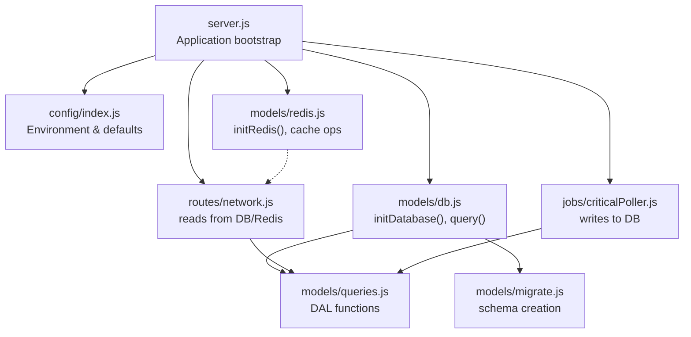
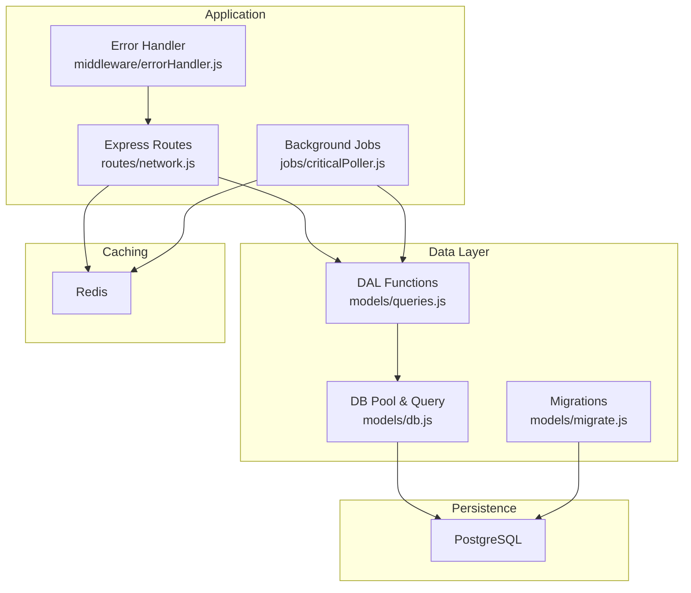
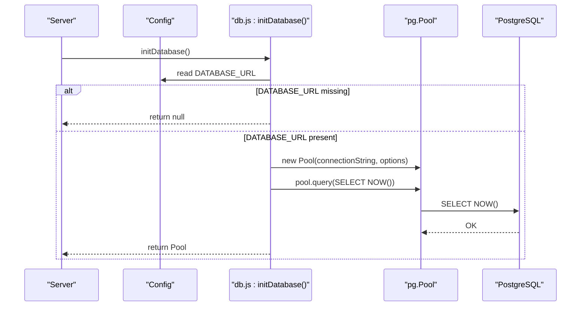
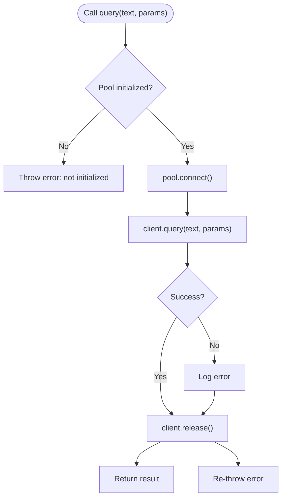
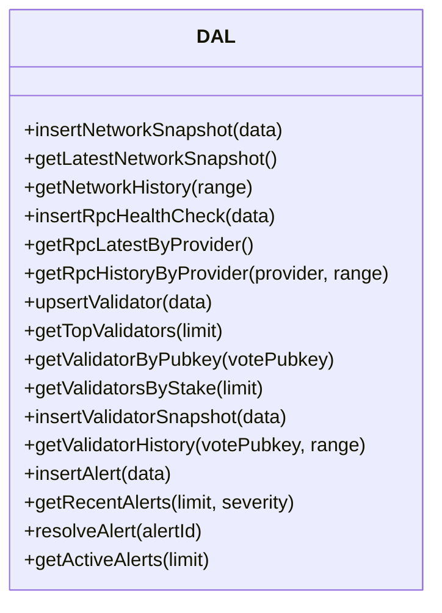
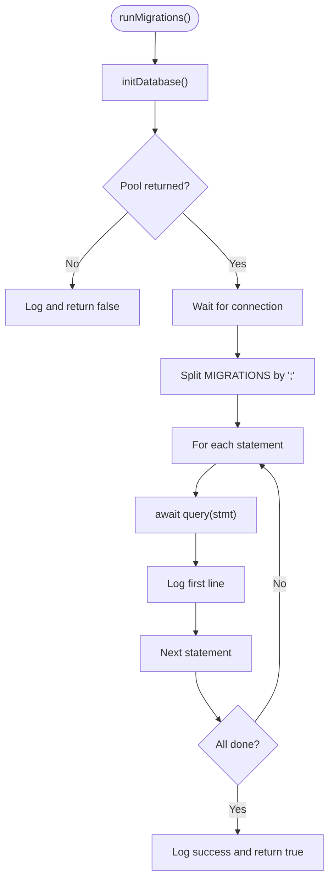
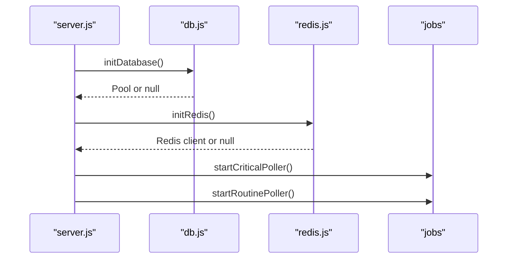
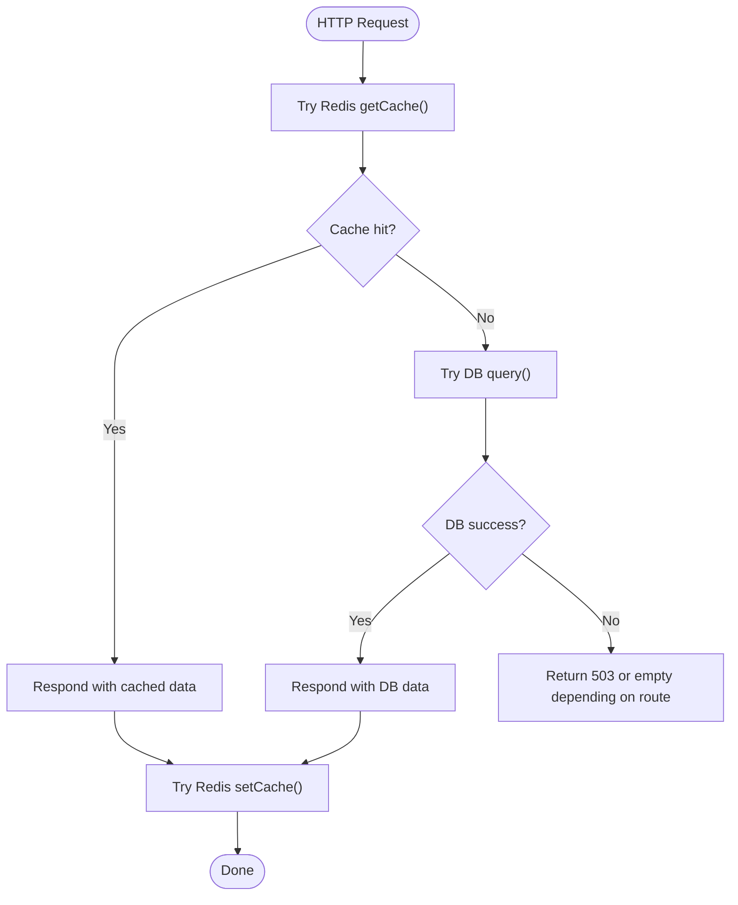
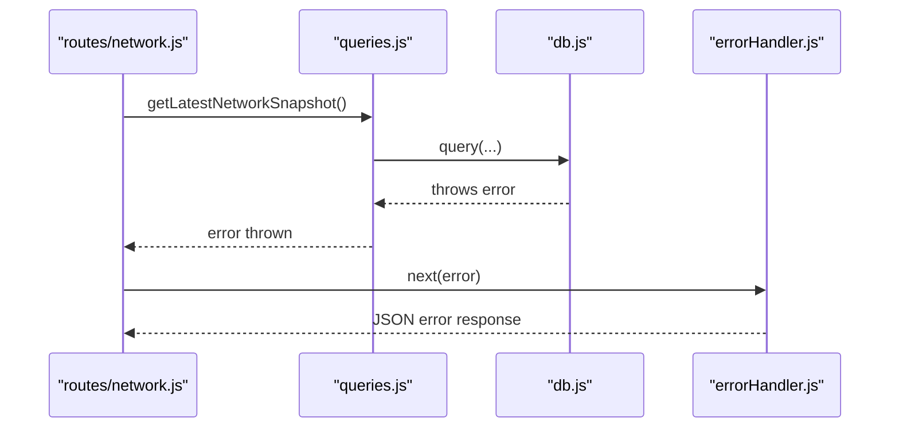
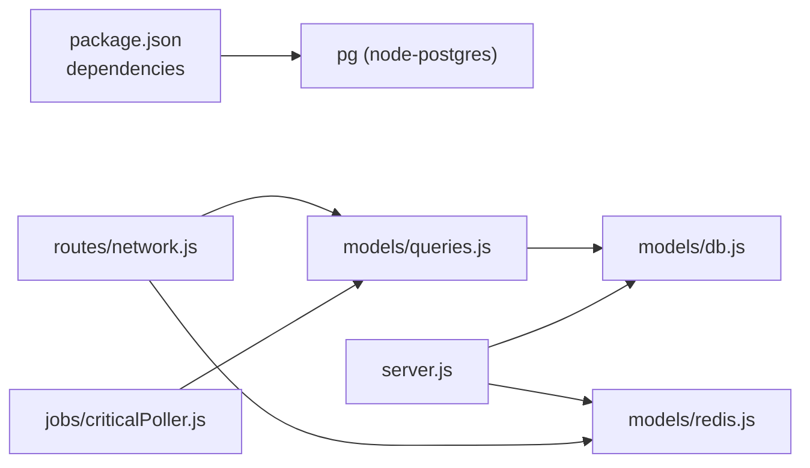

# Database Abstraction Layer

<cite>
**Referenced Files in This Document**
- [db.js](file://backend/src/models/db.js)
- [migrate.js](file://backend/src/models/migrate.js)
- [queries.js](file://backend/src/models/queries.js)
- [index.js](file://backend/src/config/index.js)
- [server.js](file://backend/src/server.js)
- [criticalPoller.js](file://backend/src/jobs/criticalPoller.js)
- [routinePoller.js](file://backend/src/jobs/routinePoller.js)
- [network.js](file://backend/src/routes/network.js)
- [errorHandler.js](file://backend/src/middleware/errorHandler.js)
- [cacheKeys.js](file://backend/src/models/cacheKeys.js)
- [redis.js](file://backend/src/models/redis.js)
- [package.json](file://backend/package.json)
</cite>

## Table of Contents
1. [Introduction](#introduction)
2. [Project Structure](#project-structure)
3. [Core Components](#core-components)
4. [Architecture Overview](#architecture-overview)
5. [Detailed Component Analysis](#detailed-component-analysis)
6. [Dependency Analysis](#dependency-analysis)
7. [Performance Considerations](#performance-considerations)
8. [Troubleshooting Guide](#troubleshooting-guide)
9. [Conclusion](#conclusion)
10. [Appendices](#appendices)

## Introduction
This document describes the PostgreSQL database abstraction layer used by the InfraWatch backend. It focuses on the node-postgres Pool implementation, connection management with lazy initialization, query execution and parameter binding, error handling strategies, and the database migration system. It also covers connection pooling configuration, timeouts, resource management, CRUD operations, transaction handling, bulk data processing, query builder patterns, prepared statements, performance optimization, connectivity issues, recovery, and monitoring approaches.

## Project Structure
The database abstraction layer is organized around a small set of focused modules:
- Connection and pool management
- Data access layer (DAL) with reusable query functions
- Migration system for schema evolution
- Application lifecycle integration (initialization, graceful shutdown)
- Caching layer (Redis) used alongside PostgreSQL for performance and resilience
- Error handling middleware for API responses

**Diagram sources**
- [server.js:84-107](file://backend/src/server.js#L84-L107)
- [db.js:15-47](file://backend/src/models/db.js#L15-L47)
- [queries.js:27-48](file://backend/src/models/queries.js#L27-L48)
- [migrate.js:100-139](file://backend/src/models/migrate.js#L100-L139)
- [redis.js:16-68](file://backend/src/models/redis.js#L16-L68)
- [criticalPoller.js:49-78](file://backend/src/jobs/criticalPoller.js#L49-L78)
- [network.js:17-79](file://backend/src/routes/network.js#L17-L79)

**Section sources**
- [server.js:84-107](file://backend/src/server.js#L84-L107)
- [db.js:15-47](file://backend/src/models/db.js#L15-L47)
- [queries.js:27-48](file://backend/src/models/queries.js#L27-L48)
- [migrate.js:100-139](file://backend/src/models/migrate.js#L100-L139)
- [redis.js:16-68](file://backend/src/models/redis.js#L16-L68)
- [criticalPoller.js:49-78](file://backend/src/jobs/criticalPoller.js#L49-L78)
- [network.js:17-79](file://backend/src/routes/network.js#L17-L79)

## Core Components
- Database Pool and Lazy Initialization: Initializes a node-postgres Pool with connection and idle timeouts, tests connectivity, and exposes a simple query function that manages client acquisition and release.
- Data Access Layer (DAL): Provides typed, parameterized functions for inserts, selects, and updates, ensuring SQL injection prevention and consistent return shapes.
- Migration System: Defines the schema and indexes, and executes them as a batch during startup or via a standalone script.
- Application Lifecycle: Integrates database initialization at startup, logs outcomes, and handles graceful shutdown.
- Caching Strategy: Uses Redis to cache frequent reads and reduce DB load, with graceful degradation when Redis is unavailable.
- Error Handling: Centralized error handling middleware for API routes, plus internal logging in DB and migration modules.

**Section sources**
- [db.js:15-97](file://backend/src/models/db.js#L15-L97)
- [queries.js:27-458](file://backend/src/models/queries.js#L27-L458)
- [migrate.js:100-159](file://backend/src/models/migrate.js#L100-L159)
- [server.js:84-107](file://backend/src/server.js#L84-L107)
- [redis.js:16-161](file://backend/src/models/redis.js#L16-L161)
- [errorHandler.js:44-127](file://backend/src/middleware/errorHandler.js#L44-L127)

## Architecture Overview
The system follows a layered architecture:
- Presentation and API: Express routes delegate to the DAL.
- DAL: Wraps node-postgres queries with parameterized statements.
- Persistence: PostgreSQL schema managed by migrations.
- Caching: Redis cache for hot reads and reduced DB pressure.
- Background Jobs: Periodic tasks write to PostgreSQL and broadcast via WebSocket.

**Diagram sources**
- [network.js:17-135](file://backend/src/routes/network.js#L17-L135)
- [criticalPoller.js:49-100](file://backend/src/jobs/criticalPoller.js#L49-L100)
- [queries.js:27-458](file://backend/src/models/queries.js#L27-L458)
- [db.js:55-70](file://backend/src/models/db.js#L55-L70)
- [migrate.js:100-139](file://backend/src/models/migrate.js#L100-L139)
- [redis.js:75-131](file://backend/src/models/redis.js#L75-L131)

## Detailed Component Analysis

### Database Pool and Lazy Initialization
- Lazy initialization: The Pool is created only when requested, preventing unnecessary connections.
- Configuration: Max pool size, idle timeout, and connection timeout are set at construction time.
- Connectivity test: A simple query is executed after pool creation to validate connectivity.
- Error handling: Pool-level errors are logged; individual query errors are handled in the query wrapper.
- Resource management: A dedicated close function ends the pool gracefully.

**Diagram sources**
- [server.js:90-95](file://backend/src/server.js#L90-L95)
- [db.js:15-47](file://backend/src/models/db.js#L15-L47)
- [index.js:45-48](file://backend/src/config/index.js#L45-L48)

**Section sources**
- [db.js:15-47](file://backend/src/models/db.js#L15-L47)
- [server.js:90-95](file://backend/src/server.js#L90-L95)
- [index.js:45-48](file://backend/src/config/index.js#L45-L48)

### Query Execution and Parameter Binding
- Parameterized queries: All DAL functions pass parameters separately to avoid SQL injection.
- Client lifecycle: The query wrapper acquires a client from the pool, executes the query, and releases the client in a finally block.
- Error propagation: Query errors are logged and rethrown to higher layers.

**Diagram sources**
- [db.js:55-70](file://backend/src/models/db.js#L55-L70)

**Section sources**
- [db.js:55-70](file://backend/src/models/db.js#L55-L70)
- [queries.js:27-48](file://backend/src/models/queries.js#L27-L48)

### Data Access Layer (DAL)
- Network snapshots: Insert, latest retrieval, and history queries with time-range filtering.
- RPC health checks: Insert, latest per provider, and provider history.
- Validators: Upsert on primary key, top N by score, lookup by pubkey, and top N by stake.
- Validator snapshots: Insert and history by pubkey with time-range filtering.
- Alerts: Insert, recent alerts with optional severity filter, resolve alert, and active alerts with severity ordering.

**Diagram sources**
- [queries.js:27-458](file://backend/src/models/queries.js#L27-L458)

**Section sources**
- [queries.js:27-458](file://backend/src/models/queries.js#L27-L458)

### Migration System
- Schema definition: A single module exports the SQL statements for all required tables and indexes.
- Migration runner: Initializes the pool, waits for connection, splits statements by semicolon, and executes each safely with logging and continuation on failure.
- Standalone execution: Includes a main function to run migrations and close the connection.

**Diagram sources**
- [migrate.js:100-139](file://backend/src/models/migrate.js#L100-L139)
- [migrate.js:114-131](file://backend/src/models/migrate.js#L114-L131)

**Section sources**
- [migrate.js:11-94](file://backend/src/models/migrate.js#L11-L94)
- [migrate.js:100-139](file://backend/src/models/migrate.js#L100-L139)

### Application Lifecycle and Integration
- Startup: The server initializes the database and Redis clients early, logs outcomes, and starts periodic jobs.
- Graceful shutdown: The server listens for termination signals and closes resources cleanly.
- Background jobs: Critical and routine pollers write to the database and broadcast updates via WebSocket.

**Diagram sources**
- [server.js:90-107](file://backend/src/server.js#L90-L107)
- [criticalPoller.js:21-100](file://backend/src/jobs/criticalPoller.js#L21-L100)
- [routinePoller.js:20-111](file://backend/src/jobs/routinePoller.js#L20-L111)

**Section sources**
- [server.js:90-107](file://backend/src/server.js#L90-L107)
- [criticalPoller.js:21-100](file://backend/src/jobs/criticalPoller.js#L21-L100)
- [routinePoller.js:20-111](file://backend/src/jobs/routinePoller.js#L20-L111)

### Caching Strategy and Resilience
- Cache-first reads: Routes attempt Redis first, falling back to DB if cache is unavailable or empty.
- TTL and keys: Centralized cache key constants and TTL values for different data categories.
- Graceful degradation: When Redis is down, the system continues operating against the database.
- Bulk writes: Jobs write to Redis after successful DB writes, emitting WebSocket events.

**Diagram sources**
- [network.js:17-135](file://backend/src/routes/network.js#L17-L135)
- [cacheKeys.js:6-49](file://backend/src/models/cacheKeys.js#L6-L49)
- [redis.js:75-131](file://backend/src/models/redis.js#L75-L131)

**Section sources**
- [network.js:17-135](file://backend/src/routes/network.js#L17-L135)
- [cacheKeys.js:6-49](file://backend/src/models/cacheKeys.js#L6-L49)
- [redis.js:75-131](file://backend/src/models/redis.js#L75-L131)

### Error Handling Strategies
- DB errors: Logged with context; queries rethrow to be handled by upstream logic.
- Migration errors: Logged individually per statement; migration continues to execute remaining statements.
- API errors: Centralized error handler responds with structured JSON, masking internal details in production.

**Diagram sources**
- [network.js:46-54](file://backend/src/routes/network.js#L46-L54)
- [queries.js:54-62](file://backend/src/models/queries.js#L54-L62)
- [db.js:64-67](file://backend/src/models/db.js#L64-L67)
- [errorHandler.js:44-109](file://backend/src/middleware/errorHandler.js#L44-L109)

**Section sources**
- [db.js:33-35](file://backend/src/models/db.js#L33-L35)
- [migrate.js:126-130](file://backend/src/models/migrate.js#L126-L130)
- [errorHandler.js:44-109](file://backend/src/middleware/errorHandler.js#L44-L109)

## Dependency Analysis
- External dependencies: The project depends on node-postgres (pg) for PostgreSQL connectivity.
- Internal dependencies: Routes depend on DAL; DAL depends on DB module; jobs depend on DAL; server integrates DB and Redis initialization.

**Diagram sources**
- [package.json:32](file://backend/package.json#L32)
- [network.js:8](file://backend/src/routes/network.js#L8)
- [queries.js:7](file://backend/src/models/queries.js#L7)
- [db.js:6](file://backend/src/models/db.js#L6)
- [criticalPoller.js:11](file://backend/src/jobs/criticalPoller.js#L11)
- [server.js:26](file://backend/src/server.js#L26)
- [redis.js:6](file://backend/src/models/redis.js#L6)

**Section sources**
- [package.json:32](file://backend/package.json#L32)
- [network.js:8](file://backend/src/routes/network.js#L8)
- [queries.js:7](file://backend/src/models/queries.js#L7)
- [db.js:6](file://backend/src/models/db.js#L6)
- [criticalPoller.js:11](file://backend/src/jobs/criticalPoller.js#L11)
- [server.js:26](file://backend/src/server.js#L26)
- [redis.js:6](file://backend/src/models/redis.js#L6)

## Performance Considerations
- Connection pooling: The Pool is configured with a fixed maximum size and idle timeout to balance concurrency and resource usage.
- Prepared statements: While explicit PREPARE/EXECUTE is not used, parameterized queries achieve similar safety and reuse benefits.
- Query builder patterns: The DAL centralizes SQL and parameter arrays, enabling consistent performance tuning and maintenance.
- Bulk operations: Jobs iterate over collections and issue individual statements; batching could improve throughput for large datasets.
- Caching: Redis reduces DB load for hot reads; TTLs are tuned per data category.
- Monitoring: Logging of DB and Redis events provides operational visibility.

[No sources needed since this section provides general guidance]

## Troubleshooting Guide
- Database not initialized: Ensure DATABASE_URL is set and the server attempts initialization at startup.
- Connection failures: Review pool error logs and connectivity test messages; verify network and credentials.
- Query errors: Inspect logged error messages and stack traces; confirm parameter counts match placeholders.
- Migration failures: Statements are logged individually; fix the failing statement and rerun migrations.
- API 503 responses: Routes return service unavailable when DB is unreachable; check DB connectivity and pool status.
- Redis unavailability: Routes gracefully fall back to DB; monitor Redis connection events and retry strategy.

**Section sources**
- [index.js:45-48](file://backend/src/config/index.js#L45-L48)
- [server.js:90-95](file://backend/src/server.js#L90-L95)
- [db.js:33-35](file://backend/src/models/db.js#L33-L35)
- [db.js:64-67](file://backend/src/models/db.js#L64-L67)
- [migrate.js:126-130](file://backend/src/models/migrate.js#L126-L130)
- [network.js:46-61](file://backend/src/routes/network.js#L46-L61)
- [redis.js:37-56](file://backend/src/models/redis.js#L37-L56)

## Conclusion
The database abstraction layer leverages node-postgres Pool with lazy initialization, robust error logging, and a clean DAL that enforces parameterized queries. Migrations define a clear schema evolution path, while Redis caching improves responsiveness and resilience. The system integrates database initialization at startup, supports graceful shutdown, and provides structured error handling for APIs. For future enhancements, consider adopting explicit prepared statements, implementing batching for bulk operations, and adding metrics and tracing for deeper observability.

[No sources needed since this section summarizes without analyzing specific files]

## Appendices

### Connection Pooling Configuration
- Max clients: Controlled by pool configuration.
- Idle timeout: Automatically closes idle clients after the configured period.
- Connection timeout: Returns an error if a connection cannot be established within the timeout window.

**Section sources**
- [db.js:25-30](file://backend/src/models/db.js#L25-L30)

### Timeout Settings
- Connection timeout: Used during pool creation to fail fast on connection issues.
- Idle timeout: Ensures long-idle clients are reclaimed.

**Section sources**
- [db.js:28-29](file://backend/src/models/db.js#L28-L29)

### Resource Management
- Pool lifecycle: Initialize at startup, use throughout the application, and end during shutdown.
- Client release: Every acquired client is released in a finally block to prevent leaks.

**Section sources**
- [db.js:84-90](file://backend/src/models/db.js#L84-L90)
- [db.js:67-69](file://backend/src/models/db.js#L67-L69)

### Examples of CRUD Operations
- Insert network snapshot: See [insertNetworkSnapshot:27-48](file://backend/src/models/queries.js#L27-L48).
- Upsert validator: See [upsertValidator:180-220](file://backend/src/models/queries.js#L180-L220).
- Retrieve latest network snapshot: See [getLatestNetworkSnapshot:54-62](file://backend/src/models/queries.js#L54-L62).
- Retrieve network history: See [getNetworkHistory:69-84](file://backend/src/models/queries.js#L69-L84).
- Insert RPC health check: See [insertRpcHealthCheck:101-118](file://backend/src/models/queries.js#L101-L118).
- Insert alert: See [insertAlert:340-356](file://backend/src/models/queries.js#L340-L356).

**Section sources**
- [queries.js:27-48](file://backend/src/models/queries.js#L27-L48)
- [queries.js:180-220](file://backend/src/models/queries.js#L180-L220)
- [queries.js:54-62](file://backend/src/models/queries.js#L54-L62)
- [queries.js:69-84](file://backend/src/models/queries.js#L69-L84)
- [queries.js:101-118](file://backend/src/models/queries.js#L101-L118)
- [queries.js:340-356](file://backend/src/models/queries.js#L340-L356)

### Transaction Handling
- Current implementation: Uses individual client connections per request; no explicit transaction blocks are shown in the referenced files.
- Recommended approach: For multi-statement atomicity, acquire a client, call begin/commit/rollback, and handle errors accordingly.

[No sources needed since this section provides general guidance]

### Bulk Data Processing
- Current usage: Jobs iterate over arrays and issue individual statements; this is straightforward but can be optimized.
- Optimization ideas: Use COPY for large inserts, batch parameterized statements, or leverage upsert patterns with RETURNING.

[No sources needed since this section provides general guidance]

### Query Builder Patterns and Prepared Statements
- Parameterized queries: All DAL functions use parameter arrays to prevent SQL injection.
- Prepared statements: Explicit PREPARE/EXECUTE is not used; parameterized queries offer similar benefits.

**Section sources**
- [queries.js:27-48](file://backend/src/models/queries.js#L27-L48)
- [queries.js:180-220](file://backend/src/models/queries.js#L180-L220)

### Monitoring Approaches
- Logging: DB pool errors, DB query errors, migration statement errors, and Redis connection events are logged.
- Health endpoints: The server exposes a health check endpoint for basic availability verification.

**Section sources**
- [db.js:33-35](file://backend/src/models/db.js#L33-L35)
- [db.js:64-67](file://backend/src/models/db.js#L64-L67)
- [migrate.js:126-130](file://backend/src/models/migrate.js#L126-L130)
- [redis.js:37-56](file://backend/src/models/redis.js#L37-L56)
- [server.js:62-69](file://backend/src/server.js#L62-L69)