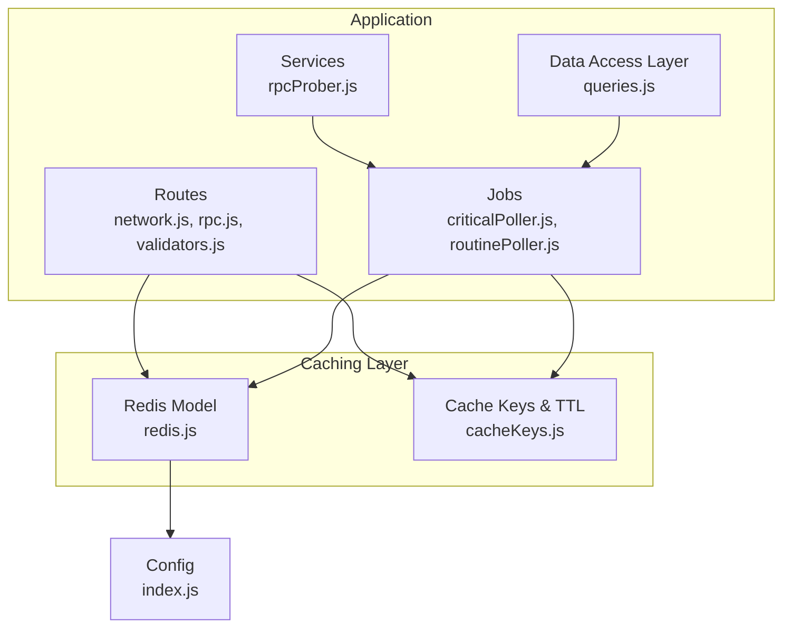
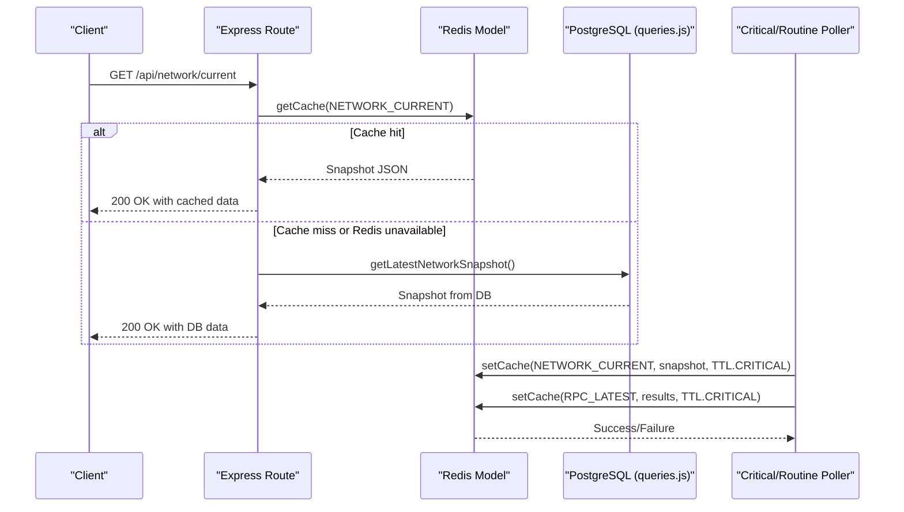
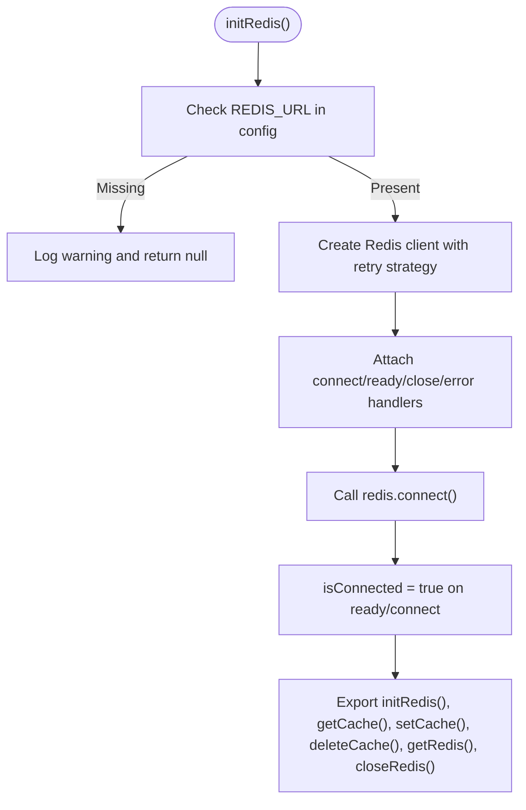
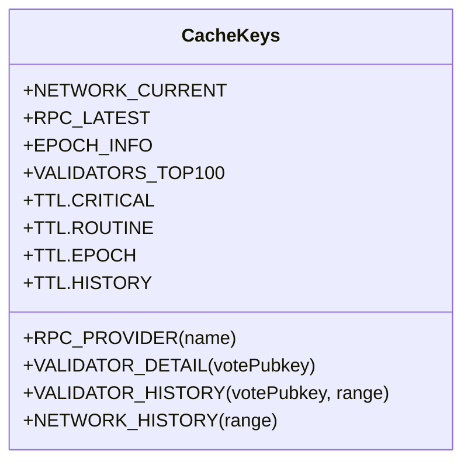
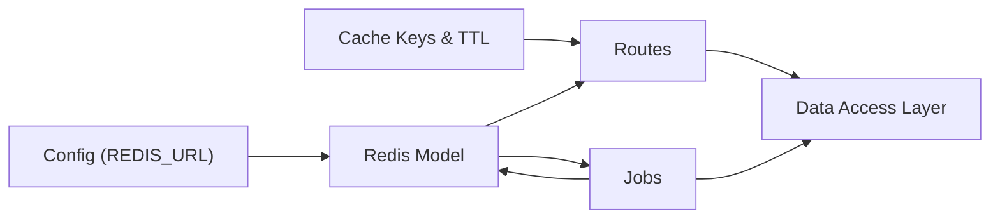

# Redis Caching Implementation

<cite>
**Referenced Files in This Document**
- [redis.js](file://backend/src/models/redis.js)
- [cacheKeys.js](file://backend/src/models/cacheKeys.js)
- [index.js](file://backend/src/config/index.js)
- [network.js](file://backend/src/routes/network.js)
- [rpc.js](file://backend/src/routes/rpc.js)
- [validators.js](file://backend/src/routes/validators.js)
- [criticalPoller.js](file://backend/src/jobs/criticalPoller.js)
- [routinePoller.js](file://backend/src/jobs/routinePoller.js)
- [server.js](file://backend/server.js)
- [queries.js](file://backend/src/models/queries.js)
- [rpcProber.js](file://backend/src/services/rpcProber.js)
</cite>

## Table of Contents
1. [Introduction](#introduction)
2. [Project Structure](#project-structure)
3. [Core Components](#core-components)
4. [Architecture Overview](#architecture-overview)
5. [Detailed Component Analysis](#detailed-component-analysis)
6. [Dependency Analysis](#dependency-analysis)
7. [Performance Considerations](#performance-considerations)
8. [Troubleshooting Guide](#troubleshooting-guide)
9. [Conclusion](#conclusion)

## Introduction
This document provides comprehensive documentation for the Redis caching layer implementation in the InfraWatch backend. It covers connection management, client configuration, connection pooling strategies, caching strategies (TTL, keys, serialization), cache key naming conventions, hierarchical organization, invalidation strategies, and operational patterns. It also documents data structures for network snapshots, RPC health checks, and validator information, along with examples of cache operations, bulk management, and cache warming procedures. Performance optimization, memory management, monitoring techniques, consistency patterns, stale data handling, and failure scenarios are addressed.

## Project Structure
The Redis caching implementation is organized around three primary modules:
- Connection and operations: centralized in the Redis model
- Cache key naming and TTL constants: centralized in the cache keys module
- Route handlers and jobs that integrate caching into the application lifecycle

**Diagram sources**
- [redis.js:1-161](file://backend/src/models/redis.js#L1-L161)
- [cacheKeys.js:1-50](file://backend/src/models/cacheKeys.js#L1-L50)
- [network.js:1-135](file://backend/src/routes/network.js#L1-L135)
- [rpc.js:1-135](file://backend/src/routes/rpc.js#L1-L135)
- [validators.js:1-112](file://backend/src/routes/validators.js#L1-L112)
- [criticalPoller.js:1-108](file://backend/src/jobs/criticalPoller.js#L1-L108)
- [routinePoller.js:1-116](file://backend/src/jobs/routinePoller.js#L1-L116)
- [rpcProber.js:1-342](file://backend/src/services/rpcProber.js#L1-L342)
- [queries.js:1-459](file://backend/src/models/queries.js#L1-L459)
- [index.js:1-68](file://backend/src/config/index.js#L1-L68)

**Section sources**
- [redis.js:1-161](file://backend/src/models/redis.js#L1-L161)
- [cacheKeys.js:1-50](file://backend/src/models/cacheKeys.js#L1-L50)
- [network.js:1-135](file://backend/src/routes/network.js#L1-L135)
- [rpc.js:1-135](file://backend/src/routes/rpc.js#L1-L135)
- [validators.js:1-112](file://backend/src/routes/validators.js#L1-L112)
- [criticalPoller.js:1-108](file://backend/src/jobs/criticalPoller.js#L1-L108)
- [routinePoller.js:1-116](file://backend/src/jobs/routinePoller.js#L1-L116)
- [server.js:1-128](file://backend/server.js#L1-L128)
- [index.js:1-68](file://backend/src/config/index.js#L1-L68)

## Core Components
- Redis connection management and operations:
  - Lazy initialization with event-driven connection state tracking
  - JSON serialization/deserialization for cache values
  - Graceful handling of connection failures and disconnections
- Cache key naming and TTL constants:
  - Hierarchical key patterns for network, RPC, validators, and history data
  - TTL values tailored to data freshness needs
- Route handlers and jobs:
  - Cache-first retrieval with database fallback
  - Periodic cache updates driven by scheduled jobs
  - Broadcasting cache updates via WebSocket

**Section sources**
- [redis.js:16-68](file://backend/src/models/redis.js#L16-L68)
- [redis.js:75-131](file://backend/src/models/redis.js#L75-L131)
- [cacheKeys.js:6-49](file://backend/src/models/cacheKeys.js#L6-L49)
- [network.js:17-79](file://backend/src/routes/network.js#L17-L79)
- [rpc.js:17-88](file://backend/src/routes/rpc.js#L17-L88)
- [validators.js:17-109](file://backend/src/routes/validators.js#L17-L109)
- [criticalPoller.js:21-103](file://backend/src/jobs/criticalPoller.js#L21-L103)
- [routinePoller.js:20-111](file://backend/src/jobs/routinePoller.js#L20-L111)

## Architecture Overview
The caching architecture follows a cache-aside pattern with a database fallback. Jobs periodically populate Redis with fresh data, while route handlers serve reads from Redis when available and fall back to the database when Redis is unavailable. WebSocket broadcasts keep clients updated with the latest cache contents.

**Diagram sources**
- [network.js:17-79](file://backend/src/routes/network.js#L17-L79)
- [redis.js:75-112](file://backend/src/models/redis.js#L75-L112)
- [queries.js:54-62](file://backend/src/models/queries.js#L54-L62)
- [criticalPoller.js:80-86](file://backend/src/jobs/criticalPoller.js#L80-L86)

**Section sources**
- [network.js:17-79](file://backend/src/routes/network.js#L17-L79)
- [redis.js:75-112](file://backend/src/models/redis.js#L75-L112)
- [queries.js:54-62](file://backend/src/models/queries.js#L54-L62)
- [criticalPoller.js:80-86](file://backend/src/jobs/criticalPoller.js#L80-L86)

## Detailed Component Analysis

### Redis Connection Management and Operations
- Initialization:
  - Lazy initialization with a retry strategy and bounded retries
  - Ready-check enabled and connection attempts made after creation
  - Event listeners for connect, ready, close, and error events
- Operations:
  - getCache: retrieves and parses JSON values
  - setCache: serializes data to JSON and sets TTL
  - deleteCache: deletes keys
  - getRedis/closeRedis: expose client and manage lifecycle

**Diagram sources**
- [redis.js:16-68](file://backend/src/models/redis.js#L16-L68)

**Section sources**
- [redis.js:16-68](file://backend/src/models/redis.js#L16-L68)
- [redis.js:75-131](file://backend/src/models/redis.js#L75-L131)

### Cache Key Naming Conventions and TTL Strategy
- Key patterns:
  - network:current, rpc:latest, epoch:info, validators:top100
  - rpc:{providerName}:latest for individual provider health
  - validator:{votePubkey} for validator details
  - validator:{votePubkey}:history:{range} for validator history
  - network:history:{range} for network history
- TTL values:
  - CRITICAL: 60s for frequently changing data
  - ROUTINE: 300s for less frequent data
  - EPOCH: 120s for epoch info
  - HISTORY: 300s for historical series

**Diagram sources**
- [cacheKeys.js:6-49](file://backend/src/models/cacheKeys.js#L6-L49)

**Section sources**
- [cacheKeys.js:6-49](file://backend/src/models/cacheKeys.js#L6-L49)

### Data Serialization Patterns
- All cached values are serialized to JSON before storage and parsed upon retrieval
- TTL is applied using a set-and-expire operation
- Deletion uses a simple key deletion command

**Section sources**
- [redis.js:104-106](file://backend/src/models/redis.js#L104-L106)
- [redis.js:80-85](file://backend/src/models/redis.js#L80-L85)

### Cache Warming Procedures
- Critical poller populates network current and RPC latest caches every 30 seconds
- Routine poller populates validators top 100 and epoch info caches every 5 minutes
- Network history cache is populated on demand and stored with appropriate TTL

**Section sources**
- [criticalPoller.js:80-86](file://backend/src/jobs/criticalPoller.js#L80-L86)
- [routinePoller.js:65-78](file://backend/src/jobs/routinePoller.js#L65-L78)
- [network.js:119-126](file://backend/src/routes/network.js#L119-L126)

### Cache Invalidation Strategies
- TTL-based expiration is the primary mechanism
- Specific keys are overwritten during cache warming cycles
- No explicit manual invalidation routines are present; stale data is handled by TTL

**Section sources**
- [cacheKeys.js:42-48](file://backend/src/models/cacheKeys.js#L42-L48)
- [criticalPoller.js:80-86](file://backend/src/jobs/criticalPoller.js#L80-L86)
- [routinePoller.js:65-78](file://backend/src/jobs/routinePoller.js#L65-L78)

### Data Structures Used for Cached Data
- Network snapshot:
  - Fields include health status, TPS, slot height, epoch info, delinquent counts, confirmation time, congestion score, and timestamps
- RPC health checks:
  - Provider name, endpoint, latency, health status, slot height, error message, and timestamp
- Validator information:
  - Validator details keyed by vote public key; includes scores, stake, commission, delinquency, skip rate, and metadata

**Section sources**
- [network.js:27-42](file://backend/src/routes/network.js#L27-L42)
- [rpc.js:30-45](file://backend/src/routes/rpc.js#L30-L45)
- [validators.js:62-104](file://backend/src/routes/validators.js#L62-L104)

### Examples of Cache Operations
- Route-level cache-first retrieval:
  - Network current endpoint: attempts Redis first, falls back to database
  - Validators detail endpoint: attempts Redis, then API, then database
- Bulk cache management:
  - Routine poller writes top validators and epoch info
  - Critical poller writes network snapshot and RPC results
- Cache warming:
  - Jobs schedule periodic updates to maintain freshness

**Section sources**
- [network.js:17-79](file://backend/src/routes/network.js#L17-L79)
- [validators.js:17-109](file://backend/src/routes/validators.js#L17-L109)
- [criticalPoller.js:21-103](file://backend/src/jobs/criticalPoller.js#L21-L103)
- [routinePoller.js:20-111](file://backend/src/jobs/routinePoller.js#L20-L111)

### Integration Points
- Server initialization:
  - Database and Redis are initialized during server startup
- WebSocket integration:
  - Jobs broadcast updates via WebSocket after cache updates
- Route handlers:
  - Cache-first pattern with database fallback
- Jobs:
  - Scheduled tasks update cache and database

**Section sources**
- [server.js:84-107](file://backend/server.js#L84-L107)
- [criticalPoller.js:88-92](file://backend/src/jobs/criticalPoller.js#L88-L92)
- [network.js:17-79](file://backend/src/routes/network.js#L17-L79)

## Dependency Analysis
The caching layer depends on configuration for Redis URL and integrates with routes, jobs, and the data access layer.

**Diagram sources**
- [index.js:50-53](file://backend/src/config/index.js#L50-L53)
- [redis.js:6-7](file://backend/src/models/redis.js#L6-L7)
- [cacheKeys.js:6-49](file://backend/src/models/cacheKeys.js#L6-L49)
- [network.js:9-10](file://backend/src/routes/network.js#L9-L10)
- [rpc.js:9-11](file://backend/src/routes/rpc.js#L9-L11)
- [validators.js:9-11](file://backend/src/routes/validators.js#L9-L11)
- [criticalPoller.js:11-13](file://backend/src/jobs/criticalPoller.js#L11-L13)
- [routinePoller.js:11-12](file://backend/src/jobs/routinePoller.js#L11-L12)
- [queries.js:7](file://backend/src/models/queries.js#L7)

**Section sources**
- [index.js:50-53](file://backend/src/config/index.js#L50-L53)
- [redis.js:6-7](file://backend/src/models/redis.js#L6-L7)
- [cacheKeys.js:6-49](file://backend/src/models/cacheKeys.js#L6-L49)
- [network.js:9-10](file://backend/src/routes/network.js#L9-L10)
- [rpc.js:9-11](file://backend/src/routes/rpc.js#L9-L11)
- [validators.js:9-11](file://backend/src/routes/validators.js#L9-L11)
- [criticalPoller.js:11-13](file://backend/src/jobs/criticalPoller.js#L11-L13)
- [routinePoller.js:11-12](file://backend/src/jobs/routinePoller.js#L11-L12)
- [queries.js:7](file://backend/src/models/queries.js#L7)

## Performance Considerations
- Connection strategy:
  - Lazy connection reduces startup overhead; retry strategy prevents immediate failures from crashing the app
- Serialization:
  - JSON serialization is simple but can be optimized for large payloads; consider binary formats if needed
- TTL selection:
  - Short TTL for rapidly changing data (network, RPC) balances freshness and pressure; longer TTL for historical series
- Bulk operations:
  - Jobs batch writes to minimize repeated cache updates
- Monitoring:
  - Add Redis INFO commands and metrics collection for memory usage, connected clients, and evicted keys

[No sources needed since this section provides general guidance]

## Troubleshooting Guide
- Redis not configured:
  - Missing REDIS_URL logs a warning and disables caching features
- Connection errors:
  - Errors are logged; handlers set connection state accordingly
- Cache failures:
  - Route handlers continue to database fallback; warnings are logged for cache write failures
- Stale data:
  - TTL ensures automatic eviction; verify TTL values align with data freshness requirements

**Section sources**
- [redis.js:21-24](file://backend/src/models/redis.js#L21-L24)
- [redis.js:50-56](file://backend/src/models/redis.js#L50-L56)
- [network.js:121-126](file://backend/src/routes/network.js#L121-L126)
- [cacheKeys.js:42-48](file://backend/src/models/cacheKeys.js#L42-L48)

## Conclusion
The Redis caching layer in InfraWatch employs a robust, cache-aside pattern with TTL-based expiration and graceful fallback to the database. The implementation centralizes key naming and TTL policies, integrates tightly with scheduled jobs for cache warming, and supports real-time updates via WebSocket. While the current design relies on TTL for invalidation, the modular structure allows future enhancements such as explicit invalidation or advanced eviction policies without disrupting existing integrations.