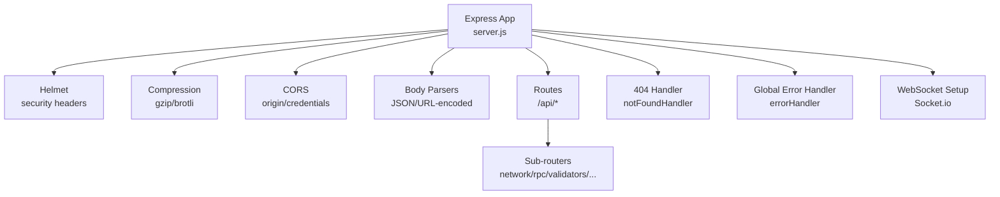
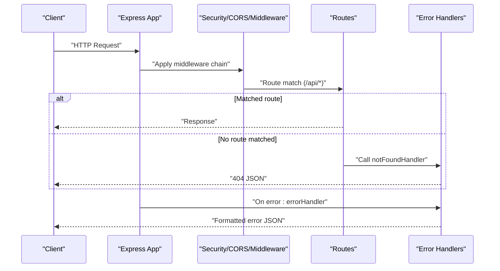
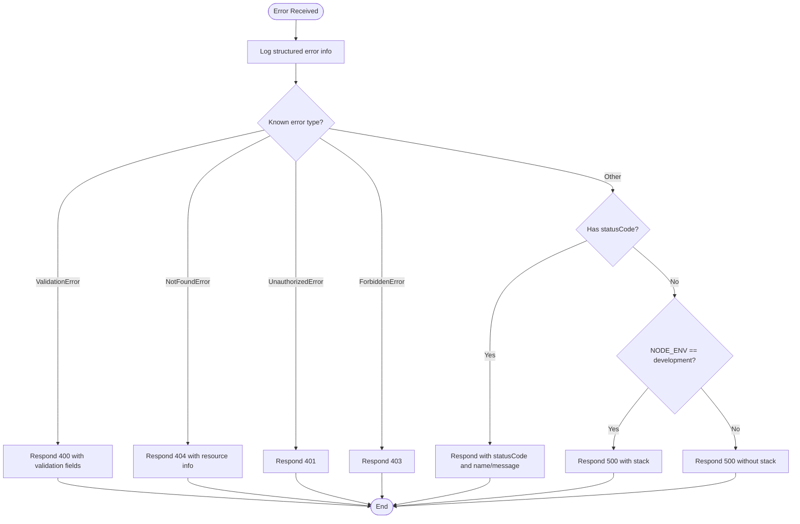
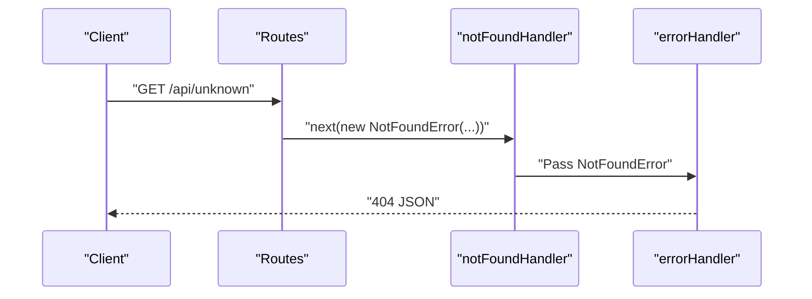
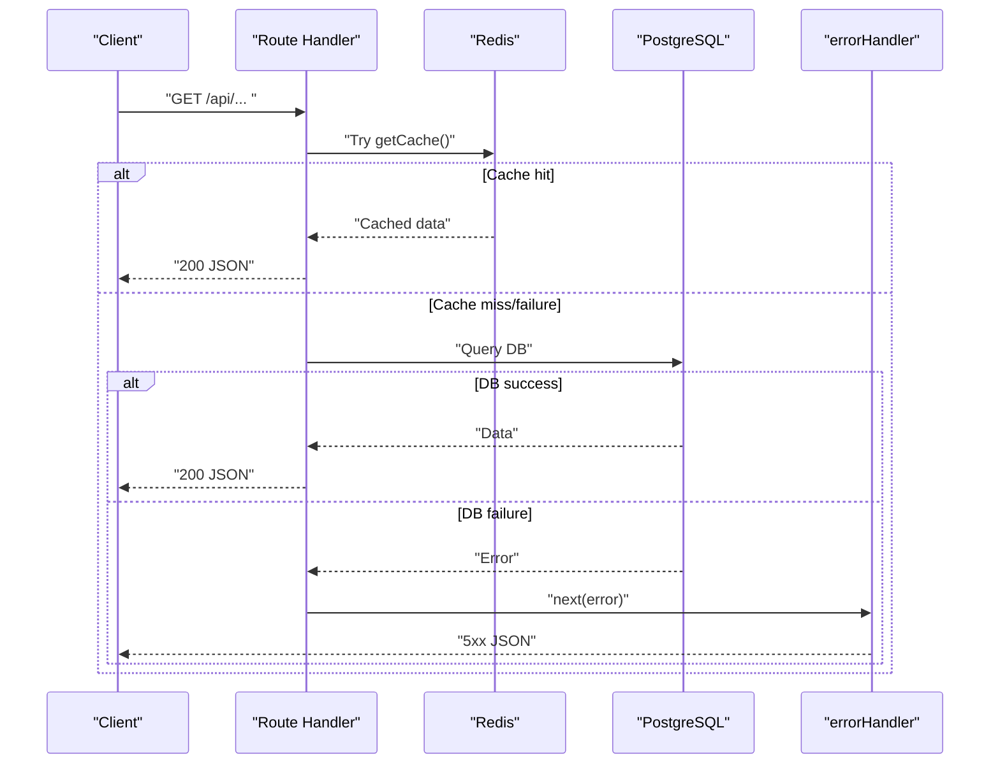
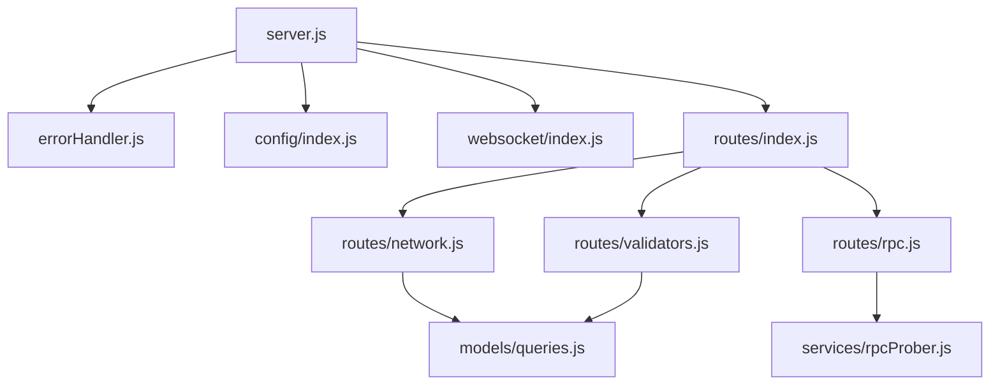

# Middleware & Error Handling

<cite>
**Referenced Files in This Document**
- [server.js](file://backend/server.js)
- [errorHandler.js](file://backend/src/middleware/errorHandler.js)
- [index.js](file://backend/src/config/index.js)
- [index.js](file://backend/src/websocket/index.js)
- [index.js](file://backend/src/routes/index.js)
- [network.js](file://backend/src/routes/network.js)
- [rpc.js](file://backend/src/routes/rpc.js)
- [validators.js](file://backend/src/routes/validators.js)
- [queries.js](file://backend/src/models/queries.js)
- [rpcProber.js](file://backend/src/services/rpcProber.js)
- [package.json](file://backend/package.json)
</cite>

## Table of Contents
1. [Introduction](#introduction)
2. [Project Structure](#project-structure)
3. [Core Components](#core-components)
4. [Architecture Overview](#architecture-overview)
5. [Detailed Component Analysis](#detailed-component-analysis)
6. [Dependency Analysis](#dependency-analysis)
7. [Performance Considerations](#performance-considerations)
8. [Troubleshooting Guide](#troubleshooting-guide)
9. [Conclusion](#conclusion)
10. [Appendices](#appendices)

## Introduction
This document explains the InfraWatch middleware and error handling system. It covers the global error handling middleware, 404 not found handling, and global error management patterns. It also documents the middleware chain execution order, request/response processing, error propagation strategies, error classification, logging mechanisms, and response formatting for different error types. Security middleware is documented, including CORS configuration and Helmet security headers. Guidance is provided on creating custom middleware, best practices for error handling, debugging techniques, extending the middleware stack, and adding additional security or monitoring layers.

## Project Structure
The backend server initializes Express, applies security and compression middleware, mounts API routes, registers a 404 handler, and installs the global error handler. Configuration is centralized, and WebSocket setup is separate. Route modules encapsulate API endpoints and propagate errors via the Express error-handling pipeline.

**Diagram sources**
- [server.js:51-78](file://backend/server.js#L51-L78)
- [server.js:34-46](file://backend/server.js#L34-L46)

**Section sources**
- [server.js:33-107](file://backend/server.js#L33-L107)

## Core Components
- Global error handling middleware: centralizes error classification, logging, and response formatting, with environment-aware error details.
- 404 not found handler: converts unmatched routes into NotFoundError instances for consistent handling.
- Security middleware: Helmet hardens HTTP headers; CORS controls cross-origin access; compression reduces payload sizes.
- Configuration: centralizes environment variables and defaults for server, Solana RPC, validators.app, database, Redis, polling intervals, and CORS origin.
- WebSocket integration: Socket.io server setup and connection lifecycle logging.

**Section sources**
- [errorHandler.js:44-126](file://backend/src/middleware/errorHandler.js#L44-L126)
- [server.js:51-78](file://backend/server.js#L51-L78)
- [index.js:27-65](file://backend/src/config/index.js#L27-L65)
- [index.js:13-81](file://backend/src/websocket/index.js#L13-L81)

## Architecture Overview
The middleware stack is applied in a strict order to ensure predictable request/response processing and robust error handling. The sequence is:
1. Helmet for security headers.
2. Compression for response size optimization.
3. CORS for cross-origin policy enforcement.
4. Body parsers for JSON and URL-encoded payloads.
5. Health check endpoint and API routes.
6. 404 handler for undefined routes.
7. Global error handler for uncaught exceptions and explicit error propagation.

**Diagram sources**
- [server.js:51-78](file://backend/server.js#L51-L78)
- [errorHandler.js:114-117](file://backend/src/middleware/errorHandler.js#L114-L117)
- [errorHandler.js:44-109](file://backend/src/middleware/errorHandler.js#L44-L109)

## Detailed Component Analysis

### Global Error Handling Middleware
The global error handler:
- Logs structured error details including name, message, stack, path, method, and timestamp.
- Classifies known error types (validation, not found, unauthorized, forbidden) and responds with appropriate status codes and standardized JSON bodies.
- Supports custom errors with explicit statusCode fields.
- Defaults to internal server error, suppressing sensitive details in production while exposing stack traces in development.

**Diagram sources**
- [errorHandler.js:44-109](file://backend/src/middleware/errorHandler.js#L44-L109)

**Section sources**
- [errorHandler.js:44-109](file://backend/src/middleware/errorHandler.js#L44-L109)

### 404 Not Found Handling
The 404 handler creates a NotFoundError for any unmatched route and forwards it to the global error handler, ensuring consistent error responses.

**Diagram sources**
- [server.js:74-75](file://backend/server.js#L74-L75)
- [errorHandler.js:114-117](file://backend/src/middleware/errorHandler.js#L114-L117)
- [errorHandler.js:65-71](file://backend/src/middleware/errorHandler.js#L65-L71)

**Section sources**
- [server.js:74-75](file://backend/server.js#L74-L75)
- [errorHandler.js:114-117](file://backend/src/middleware/errorHandler.js#L114-L117)

### Security Middleware: CORS and Helmet
- Helmet: Applied before other middleware to ensure security headers are set consistently.
- CORS: Configured with origin and credentials support, aligned with configuration settings.

**Diagram sources**
- [server.js:52-59](file://backend/server.js#L52-L59)

**Section sources**
- [server.js:52-59](file://backend/server.js#L52-L59)
- [index.js:61-64](file://backend/src/config/index.js#L61-L64)

### Request/Response Processing and Error Propagation
Routes commonly:
- Attempt cache retrieval first, falling back to database queries.
- On success, return JSON responses.
- On unexpected errors, call next(error) to propagate to the global error handler.
- Some routes return 503 for startup/unavailable conditions and handle invalid parameters with 400 responses.

**Diagram sources**
- [network.js:17-79](file://backend/src/routes/network.js#L17-L79)
- [validators.js:52-109](file://backend/src/routes/validators.js#L52-L109)

**Section sources**
- [network.js:17-79](file://backend/src/routes/network.js#L17-L79)
- [validators.js:52-109](file://backend/src/routes/validators.js#L52-L109)

### Error Classification and Logging
- Known error classes: ValidationError, NotFoundError, UnauthorizedError, ForbiddenError.
- Logging includes error metadata and request context for diagnostics.
- Environment-aware response: development exposes stack traces; production suppresses details.

**Section sources**
- [errorHandler.js:6-38](file://backend/src/middleware/errorHandler.js#L6-L38)
- [errorHandler.js:45-53](file://backend/src/middleware/errorHandler.js#L45-L53)
- [errorHandler.js:101-108](file://backend/src/middleware/errorHandler.js#L101-L108)

### Response Formatting for Different Error Types
- Validation errors: include field and message.
- Not found: include resource and message.
- Unauthorized/Forbidden: include concise messages.
- Other errors with explicit statusCode: include name and message.
- Internal server error: standardized body with optional stack in development.

**Section sources**
- [errorHandler.js:56-97](file://backend/src/middleware/errorHandler.js#L56-L97)
- [errorHandler.js:103-108](file://backend/src/middleware/errorHandler.js#L103-L108)

### Custom Middleware Creation Examples
- Add a new middleware by defining a function with the signature (req, res, next) and invoking next(error) to propagate errors.
- Place custom middleware before the 404 handler to intercept requests early.
- Example patterns:
  - Authentication middleware that sets user context and calls next(error) on failure.
  - Input sanitization middleware that throws ValidationError for invalid fields.
  - Metrics/logging middleware that instruments request duration and calls next().

[No sources needed since this section provides general guidance]

### Debugging Techniques
- Inspect logs emitted by the error handler for name, message, stack, path, method, and timestamp.
- Temporarily switch NODE_ENV to development to receive stack traces in error responses during local debugging.
- Verify CORS configuration aligns with the frontend origin to avoid preflight or blocked requests.
- Confirm Socket.io configuration matches the frontend’s expectations for origin/methods/credentials.

**Section sources**
- [errorHandler.js:45-53](file://backend/src/middleware/errorHandler.js#L45-L53)
- [errorHandler.js:101-108](file://backend/src/middleware/errorHandler.js#L101-L108)
- [server.js:40-46](file://backend/server.js#L40-L46)
- [index.js:61-64](file://backend/src/config/index.js#L61-L64)

### Extending the Middleware Stack and Monitoring Layers
- Add monitoring middleware (e.g., request timing, metrics emission) before routing to capture full request lifecycle.
- Integrate input validation middleware to throw ValidationError early, enabling consistent 400 responses.
- Add rate limiting or IP allowlists as additional security middleware prior to routes.
- Consider adding a response time limiter or circuit breaker around external service calls to prevent cascading failures.

[No sources needed since this section provides general guidance]

## Dependency Analysis
The server composes middleware and routes, with configuration and WebSocket utilities supporting runtime behavior. The error handler depends on environment variables for production behavior and is decoupled from route logic via the Express error-handling contract.

**Diagram sources**
- [server.js:14-23](file://backend/server.js#L14-L23)
- [errorHandler.js:119-126](file://backend/src/middleware/errorHandler.js#L119-L126)
- [index.js:13-81](file://backend/src/websocket/index.js#L13-L81)
- [index.js:27-65](file://backend/src/config/index.js#L27-L65)
- [index.js:10-23](file://backend/src/routes/index.js#L10-L23)
- [network.js:8-10](file://backend/src/routes/network.js#L8-L10)
- [rpc.js:8-11](file://backend/src/routes/rpc.js#L8-L11)
- [validators.js:8-11](file://backend/src/routes/validators.js#L8-L11)
- [rpcProber.js:7](file://backend/src/services/rpcProber.js#L7)
- [queries.js:7](file://backend/src/models/queries.js#L7)

**Section sources**
- [server.js:14-23](file://backend/server.js#L14-L23)
- [errorHandler.js:119-126](file://backend/src/middleware/errorHandler.js#L119-L126)
- [index.js:13-81](file://backend/src/websocket/index.js#L13-L81)
- [index.js:27-65](file://backend/src/config/index.js#L27-L65)
- [index.js:10-23](file://backend/src/routes/index.js#L10-L23)
- [network.js:8-10](file://backend/src/routes/network.js#L8-L10)
- [rpc.js:8-11](file://backend/src/routes/rpc.js#L8-L11)
- [validators.js:8-11](file://backend/src/routes/validators.js#L8-L11)
- [rpcProber.js:7](file://backend/src/services/rpcProber.js#L7)
- [queries.js:7](file://backend/src/models/queries.js#L7)

## Performance Considerations
- Compression middleware reduces payload sizes, improving throughput.
- Cache-first patterns in routes minimize database load and improve response times.
- External RPC probing uses timeouts and concurrent requests; ensure proper error handling to avoid blocking.
- Consider adding request timeouts and circuit breakers for external services to protect the server under failure conditions.

[No sources needed since this section provides general guidance]

## Troubleshooting Guide
Common issues and resolutions:
- Unexpected 500 errors: inspect server logs for error entries and stack traces; switch to development mode locally to reveal stack details.
- CORS failures: verify CORS origin and credentials configuration match the frontend origin.
- 404 responses: confirm route paths and that notFoundHandler is registered after routes.
- Validation errors: ensure input validation middleware throws ValidationError with field details for consistent 400 responses.
- WebSocket connection issues: check Socket.io configuration and server logs for connection/disconnection events.

**Section sources**
- [errorHandler.js:45-53](file://backend/src/middleware/errorHandler.js#L45-L53)
- [server.js:54-57](file://backend/server.js#L54-L57)
- [server.js:74-75](file://backend/server.js#L74-L75)
- [index.js:61-64](file://backend/src/config/index.js#L61-L64)
- [index.js:16-32](file://backend/src/websocket/index.js#L16-L32)

## Conclusion
InfraWatch employs a clean middleware and error handling architecture: Helmet and compression are applied early, routes encapsulate business logic with cache-first patterns, and a global error handler ensures consistent error responses. The 404 handler integrates seamlessly into the error pipeline. Security is addressed via Helmet and CORS configuration, while environment-aware error responses balance observability and safety. The design supports straightforward extension with custom middleware, validation, and monitoring layers.

[No sources needed since this section summarizes without analyzing specific files]

## Appendices

### Security Headers and CORS Configuration
- Helmet is applied globally to enforce secure defaults.
- CORS is configured with origin and credentials from configuration.
- Socket.io is configured with origin, methods, and credentials for real-time features.

**Section sources**
- [server.js:52-59](file://backend/server.js#L52-L59)
- [server.js:40-46](file://backend/server.js#L40-L46)
- [index.js:61-64](file://backend/src/config/index.js#L61-L64)

### Route-Level Error Handling Patterns
- Cache-first with database fallback and graceful degradation to 503 when unavailable.
- Parameter validation returning 400 with structured messages.
- Use of next(error) to propagate unexpected errors to the global handler.

**Section sources**
- [network.js:17-79](file://backend/src/routes/network.js#L17-L79)
- [rpc.js:94-131](file://backend/src/routes/rpc.js#L94-L131)
- [validators.js:52-109](file://backend/src/routes/validators.js#L52-L109)

### External Dependencies Supporting Middleware
- Express, Helmet, CORS, compression, Socket.io, and environment configuration via dotenv.

**Section sources**
- [package.json:22-34](file://backend/package.json#L22-L34)
- [index.js:9-13](file://backend/src/config/index.js#L9-L13)