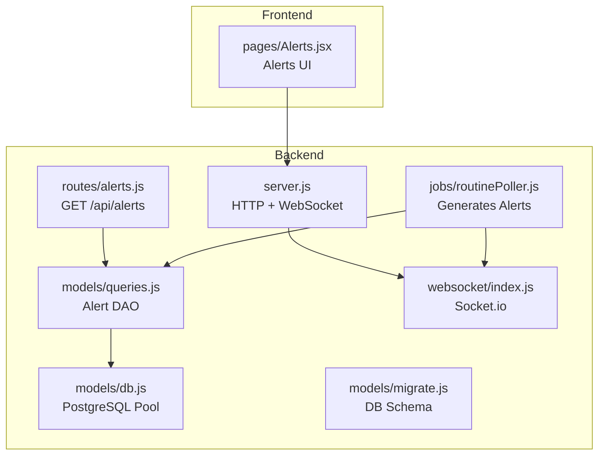
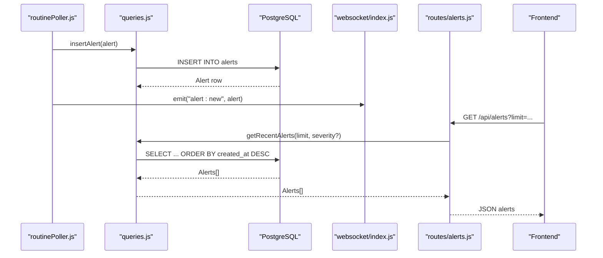
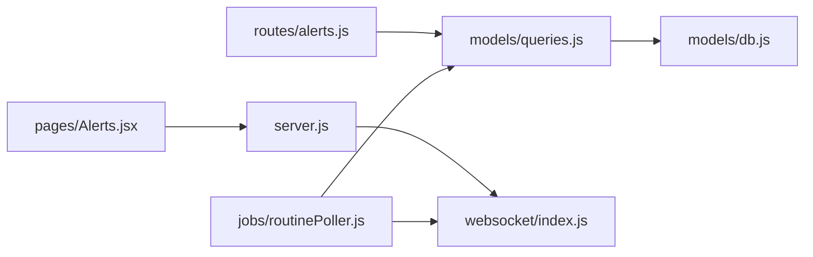

# Alerts Routes

<cite>
**Referenced Files in This Document**
- [alerts.js](file://backend/src/routes/alerts.js)
- [queries.js](file://backend/src/models/queries.js)
- [migrate.js](file://backend/src/models/migrate.js)
- [db.js](file://backend/src/models/db.js)
- [server.js](file://backend/server.js)
- [websocket/index.js](file://backend/src/websocket/index.js)
- [routinePoller.js](file://backend/src/jobs/routinePoller.js)
- [helius.js](file://backend/src/services/helius.js)
- [config/index.js](file://backend/src/config/index.js)
- [errorHandler.js](file://backend/src/middleware/errorHandler.js)
- [Alerts.jsx](file://frontend/src/pages/Alerts.jsx)
- [build_plan.md](file://infrawatch_build_plan.md)
</cite>

## Table of Contents
1. [Introduction](#introduction)
2. [Project Structure](#project-structure)
3. [Core Components](#core-components)
4. [Architecture Overview](#architecture-overview)
5. [Detailed Component Analysis](#detailed-component-analysis)
6. [Dependency Analysis](#dependency-analysis)
7. [Performance Considerations](#performance-considerations)
8. [Troubleshooting Guide](#troubleshooting-guide)
9. [Conclusion](#conclusion)

## Introduction
This document provides comprehensive API documentation for alert management endpoints in the InfraWatch platform. It covers the alert retrieval API, alert data model, alert generation pipeline, real-time delivery via WebSocket, and the planned alert configuration and subscription features. The documentation includes HTTP endpoints, request/response schemas, alert configuration options, trigger conditions, and integration patterns with external systems.

## Project Structure
The alert system spans backend routes, a data access layer, database migrations, WebSocket broadcasting, and scheduled jobs. The frontend includes an Alerts page that displays alert summaries.

**Diagram sources**
- [alerts.js:1-46](file://backend/src/routes/alerts.js#L1-L46)
- [queries.js:326-426](file://backend/src/models/queries.js#L326-L426)
- [db.js:1-98](file://backend/src/models/db.js#L1-L98)
- [migrate.js:80-94](file://backend/src/models/migrate.js#L80-L94)
- [server.js:33-107](file://backend/server.js#L33-L107)
- [websocket/index.js:1-81](file://backend/src/websocket/index.js#L1-L81)
- [routinePoller.js:1-116](file://backend/src/jobs/routinePoller.js#L1-L116)
- [Alerts.jsx:1-113](file://frontend/src/pages/Alerts.jsx#L1-L113)

**Section sources**
- [alerts.js:1-46](file://backend/src/routes/alerts.js#L1-L46)
- [server.js:33-107](file://backend/server.js#L33-L107)

## Core Components
- Alerts API endpoint: GET /api/alerts returns recent alerts with pagination and optional severity filtering.
- Data Access Layer: Functions to insert alerts, retrieve recent alerts, mark alerts resolved, and fetch active alerts.
- Database Schema: alerts table with type, severity, entity, message, details_json, timestamps, and resolution tracking.
- Alert Generation: Scheduled job detects validator commission changes and emits alerts via WebSocket.
- Real-time Delivery: WebSocket broadcasts new alerts to connected clients.
- Frontend Display: Alerts page shows alert stats and list (placeholder UI).

**Section sources**
- [alerts.js:10-43](file://backend/src/routes/alerts.js#L10-L43)
- [queries.js:326-426](file://backend/src/models/queries.js#L326-L426)
- [migrate.js:80-94](file://backend/src/models/migrate.js#L80-L94)
- [routinePoller.js:80-100](file://backend/src/jobs/routinePoller.js#L80-L100)
- [websocket/index.js:48-52](file://backend/src/websocket/index.js#L48-L52)
- [Alerts.jsx:50-112](file://frontend/src/pages/Alerts.jsx#L50-L112)

## Architecture Overview
The alert lifecycle:
1. Data ingestion and periodic jobs detect conditions requiring alerts.
2. Alerts are inserted into the database.
3. Clients can fetch recent alerts via the REST API.
4. WebSocket broadcasts new alerts to connected clients in real time.

**Diagram sources**
- [routinePoller.js:80-100](file://backend/src/jobs/routinePoller.js#L80-L100)
- [queries.js:340-356](file://backend/src/models/queries.js#L340-L356)
- [websocket/index.js:48-52](file://backend/src/websocket/index.js#L48-L52)
- [alerts.js:14-43](file://backend/src/routes/alerts.js#L14-L43)

## Detailed Component Analysis

### Alerts API Endpoint
- Method: GET
- Path: /api/alerts
- Query Parameters:
  - limit: Integer, default 50, clamped between 1 and 100
  - severity: Optional filter by severity level
- Response: Array of alert objects with fields:
  - id, type, severity, entity, message, details, createdAt, resolvedAt
- Behavior:
  - Returns empty array if DB is unavailable.
  - Transforms stored rows to API shape.
- Authentication: None specified in current implementation.
- Rate Limiting: Not implemented in this endpoint.

Example request:
- GET /api/alerts?limit=50
- GET /api/alerts?limit=25&severity=critical

Response schema (object):
- id: number
- type: string
- severity: string
- entity: string
- message: string
- details: object | null
- createdAt: string (ISO timestamp)
- resolvedAt: string | null

**Section sources**
- [alerts.js:10-43](file://backend/src/routes/alerts.js#L10-L43)
- [queries.js:358-387](file://backend/src/models/queries.js#L358-L387)

### Alert Data Model
Table: alerts
- Columns:
  - id (SERIAL primary key)
  - type (VARCHAR)
  - severity (VARCHAR, default 'info')
  - entity (VARCHAR)
  - message (TEXT)
  - details_json (JSONB)
  - created_at (TIMESTAMPTZ, default NOW)
  - resolved_at (TIMESTAMPTZ, nullable)

Indexes:
- idx_alerts_created on created_at DESC
- idx_alerts_severity on severity, created_at DESC

Operations:
- Insert alert: insertAlert(data)
- Get recent alerts: getRecentAlerts(limit, severity?)
- Resolve alert: resolveAlert(id)
- Get active alerts: getActiveAlerts(limit)

**Section sources**
- [migrate.js:80-94](file://backend/src/models/migrate.js#L80-L94)
- [queries.js:326-426](file://backend/src/models/queries.js#L326-L426)

### Alert Generation Pipeline
Trigger condition (current implementation):
- Validator commission change detection in routine poller.
- For each detected change, an alert is created with:
  - type: "commission_change"
  - severity: "warning"
  - entity: validator vote pubkey
  - message: human-readable description
  - details_json: structured change data

Emit behavior:
- Alert is inserted into DB.
- Alert is broadcast via WebSocket event "alert:new".

Future planned triggers (per build plan):
- Validator delinquent
- RPC provider down
- Network congestion
- Slot latency spike
- Skip rate high
- Validator software outdated
- Data center concentration spike
- Jito tip floor spike
- Network outage

Notification channels (planned):
- Bags DM (native messaging)
- Telegram bot
- Dashboard notification center

**Section sources**
- [routinePoller.js:80-100](file://backend/src/jobs/routinePoller.js#L80-L100)
- [build_plan.md:71-112](file://infrawatch_build_plan.md#L71-L112)

### Real-Time Delivery via WebSocket
- Server initializes Socket.io and exposes io instance.
- New alerts are emitted to all connected clients using event "alert:new".
- Frontend can listen to this event for real-time updates.

Broadcast API:
- broadcast(event, data)
- broadcastToRoom(room, event, data)

**Section sources**
- [server.js:39-50](file://backend/server.js#L39-L50)
- [websocket/index.js:48-64](file://backend/src/websocket/index.js#L48-L64)
- [routinePoller.js:96-100](file://backend/src/jobs/routinePoller.js#L96-L100)

### Frontend Integration
- Alerts page displays alert statistics and a list.
- UI indicates active/resolved state and severity.
- Placeholder note mentions future configurable thresholds.

**Section sources**
- [Alerts.jsx:50-112](file://frontend/src/pages/Alerts.jsx#L50-L112)

### External Integrations
- Helius RPC service provides enhanced metrics and is used for priority fee estimates and TPS data.
- These integrations inform alert conditions and thresholds (as designed in the build plan).

**Section sources**
- [helius.js:13-70](file://backend/src/services/helius.js#L13-L70)
- [build_plan.md:15-17](file://infrawatch_build_plan.md#L15-L17)

## Dependency Analysis

**Diagram sources**
- [alerts.js:1-46](file://backend/src/routes/alerts.js#L1-L46)
- [queries.js:1-10](file://backend/src/models/queries.js#L1-L10)
- [db.js:1-98](file://backend/src/models/db.js#L1-L98)
- [server.js:19-81](file://backend/server.js#L19-L81)
- [websocket/index.js:1-81](file://backend/src/websocket/index.js#L1-L81)
- [routinePoller.js:1-116](file://backend/src/jobs/routinePoller.js#L1-L116)
- [Alerts.jsx:1-113](file://frontend/src/pages/Alerts.jsx#L1-L113)

**Section sources**
- [alerts.js:1-46](file://backend/src/routes/alerts.js#L1-L46)
- [queries.js:1-10](file://backend/src/models/queries.js#L1-L10)
- [server.js:19-81](file://backend/server.js#L19-L81)
- [websocket/index.js:1-81](file://backend/src/websocket/index.js#L1-L81)
- [routinePoller.js:1-116](file://backend/src/jobs/routinePoller.js#L1-L116)
- [Alerts.jsx:1-113](file://frontend/src/pages/Alerts.jsx#L1-L113)

## Performance Considerations
- Pagination: The GET /api/alerts endpoint clamps limit between 1 and 100 to prevent excessive loads.
- Database indexing: Indexes on created_at and (severity, created_at) support efficient sorting and filtering.
- Graceful degradation: On DB unavailability, the endpoint returns an empty array instead of failing.
- WebSocket broadcasting: Efficiently pushes new alerts to connected clients without repeated polling.

[No sources needed since this section provides general guidance]

## Troubleshooting Guide
Common issues and resolutions:
- Empty alert list: Verify database connectivity and that alerts exist in the alerts table.
- WebSocket not receiving alerts: Confirm Socket.io is initialized and the "alert:new" event is emitted by the routine poller.
- Database errors: Check database pool initialization and connection string configuration.
- Frontend not displaying alerts: Ensure the Alerts page is mounted and the API path is correct.

Relevant error handling:
- Global error middleware handles validation, not-found, unauthorized, and forbidden errors.
- Database query errors are logged and rethrown appropriately.

**Section sources**
- [alerts.js:20-25](file://backend/src/routes/alerts.js#L20-L25)
- [db.js:55-70](file://backend/src/models/db.js#L55-L70)
- [errorHandler.js:44-109](file://backend/src/middleware/errorHandler.js#L44-L109)

## Conclusion
The current alert system provides a robust foundation for alert retrieval, persistence, and real-time delivery. The GET /api/alerts endpoint offers paginated access to recent alerts, while the routine poller generates alerts for detected conditions and broadcasts them via WebSocket. Planned enhancements include configurable thresholds, additional alert types, and integration with Bags chat and Telegram for notification delivery. The database schema and indexes are optimized for alert retrieval and filtering.