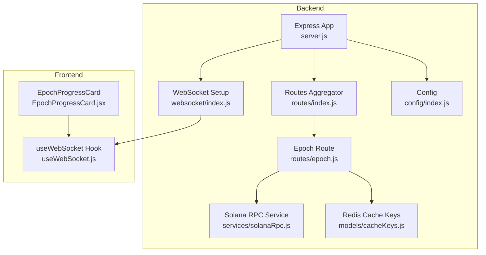
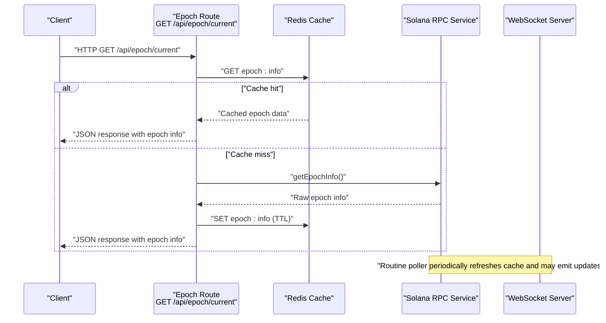
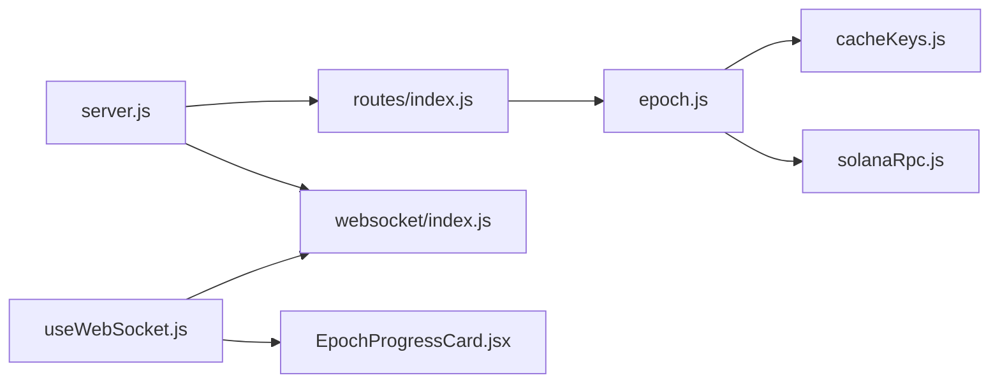

# Epoch Routes

<cite>
**Referenced Files in This Document**
- [epoch.js](file://backend/src/routes/epoch.js)
- [solanaRpc.js](file://backend/src/services/solanaRpc.js)
- [cacheKeys.js](file://backend/src/models/cacheKeys.js)
- [index.js](file://backend/src/config/index.js)
- [index.js](file://backend/src/websocket/index.js)
- [index.js](file://backend/src/routes/index.js)
- [routinePoller.js](file://backend/src/jobs/routinePoller.js)
- [server.js](file://backend/server.js)
- [EpochProgressCard.jsx](file://frontend/src/components/dashboard/EpochProgressCard.jsx)
- [useWebSocket.js](file://frontend/src/hooks/useWebSocket.js)
</cite>

## Table of Contents
1. [Introduction](#introduction)
2. [Project Structure](#project-structure)
3. [Core Components](#core-components)
4. [Architecture Overview](#architecture-overview)
5. [Detailed Component Analysis](#detailed-component-analysis)
6. [Dependency Analysis](#dependency-analysis)
7. [Performance Considerations](#performance-considerations)
8. [Troubleshooting Guide](#troubleshooting-guide)
9. [Conclusion](#conclusion)

## Introduction
This document provides comprehensive API documentation for epoch and staking cycle endpoints. It focuses on the single exposed endpoint for epoch information, the underlying Solana RPC integration, caching strategy, and WebSocket-based real-time updates. It explains how epoch progress is tracked, how rewards are not calculated (as the service does not compute rewards), and how staking cycle management is handled by the Solana network itself.

## Project Structure
The epoch-related functionality is implemented as a dedicated route mounted under /api/epoch. The route integrates with a Solana RPC service for epoch data, caches results in Redis, and exposes a single endpoint for current epoch information. Real-time updates are broadcast via WebSocket.

**Diagram sources**
- [server.js:1-128](file://backend/server.js#L1-L128)
- [index.js:1-24](file://backend/src/routes/index.js#L1-L24)
- [epoch.js:1-62](file://backend/src/routes/epoch.js#L1-L62)
- [solanaRpc.js:1-340](file://backend/src/services/solanaRpc.js#L1-L340)
- [cacheKeys.js:1-50](file://backend/src/models/cacheKeys.js#L1-L50)
- [index.js:1-81](file://backend/src/websocket/index.js#L1-L81)
- [index.js:1-68](file://backend/src/config/index.js#L1-L68)
- [EpochProgressCard.jsx:1-74](file://frontend/src/components/dashboard/EpochProgressCard.jsx#L1-L74)
- [useWebSocket.js:1-73](file://frontend/src/hooks/useWebSocket.js#L1-L73)

**Section sources**
- [server.js:1-128](file://backend/server.js#L1-L128)
- [index.js:1-24](file://backend/src/routes/index.js#L1-L24)
- [epoch.js:1-62](file://backend/src/routes/epoch.js#L1-L62)
- [solanaRpc.js:1-340](file://backend/src/services/solanaRpc.js#L1-L340)
- [cacheKeys.js:1-50](file://backend/src/models/cacheKeys.js#L1-L50)
- [index.js:1-81](file://backend/src/websocket/index.js#L1-L81)
- [index.js:1-68](file://backend/src/config/index.js#L1-L68)
- [EpochProgressCard.jsx:1-74](file://frontend/src/components/dashboard/EpochProgressCard.jsx#L1-L74)
- [useWebSocket.js:1-73](file://frontend/src/hooks/useWebSocket.js#L1-L73)

## Core Components
- Epoch Route: Exposes GET /api/epoch/current returning current epoch progress and timing metrics.
- Solana RPC Service: Fetches epoch information from the Solana network and computes derived metrics.
- Redis Cache: Stores epoch data with a short TTL for fast retrieval and reduced RPC load.
- WebSocket: Broadcasts live network snapshots including epoch progress to connected clients.
- Frontend Consumers: Display epoch progress and react to real-time updates.

Key behaviors:
- The endpoint returns cached data when available; otherwise, it fetches from Solana RPC and caches the result.
- The service does not compute rewards or staking cycle reward distributions; it surfaces epoch progress and ETA.
- Staking cycle management and validator rotation are governed by the Solana network; the service surfaces epoch progress and ETA derived from slot indices.

**Section sources**
- [epoch.js:16-59](file://backend/src/routes/epoch.js#L16-L59)
- [solanaRpc.js:124-156](file://backend/src/services/solanaRpc.js#L124-L156)
- [cacheKeys.js:10](file://backend/src/models/cacheKeys.js#L10)
- [index.js:40-46](file://backend/server.js#L40-L46)
- [index.js:48](file://backend/server.js#L48)
- [EpochProgressCard.jsx:5-14](file://frontend/src/components/dashboard/EpochProgressCard.jsx#L5-L14)
- [useWebSocket.js:47-72](file://frontend/src/hooks/useWebSocket.js#L47-L72)

## Architecture Overview
The epoch endpoint follows a cache-first pattern:
1. Attempt to read epoch info from Redis.
2. If missing or expired, fetch from Solana RPC and cache the result.
3. Return a normalized response with epoch progress and ETA.
Real-time updates are broadcast via WebSocket to keep clients informed of epoch transitions and progress changes.

**Diagram sources**
- [epoch.js:16-59](file://backend/src/routes/epoch.js#L16-L59)
- [solanaRpc.js:124-156](file://backend/src/services/solanaRpc.js#L124-L156)
- [cacheKeys.js:10](file://backend/src/models/cacheKeys.js#L10)
- [routinePoller.js:72-78](file://backend/src/jobs/routinePoller.js#L72-L78)

## Detailed Component Analysis

### Endpoint Definition: GET /api/epoch/current
- Method: GET
- URL Pattern: /api/epoch/current
- Purpose: Retrieve current epoch information including epoch number, slot index, slots per epoch, progress percentage, remaining slots, and estimated time to epoch end.

Response Schema (JSON):
- epoch: number
- slotIndex: number
- slotsInEpoch: number
- progress: number (percentage)
- slotsRemaining: number
- etaMs: number (milliseconds)
- timestamp: string (ISO 8601)

Behavior:
- Cache-first retrieval using Redis key epoch:info with TTL 120s.
- On cache miss, fetches from Solana RPC and caches the result.
- Returns a standardized payload with computed progress and ETA.

Example Requests:
- GET /api/epoch/current

Example Responses:
- 200 OK with epoch data
- 500 Internal Server Error on failure

Notes:
- The service does not compute rewards or staking cycle distributions; it reports epoch progress and ETA derived from slot indices.
- Staking cycle boundaries and validator rotation are governed by the Solana network; the service surfaces epoch progress and ETA.

**Section sources**
- [epoch.js:13-59](file://backend/src/routes/epoch.js#L13-L59)
- [solanaRpc.js:124-156](file://backend/src/services/solanaRpc.js#L124-L156)
- [cacheKeys.js:10](file://backend/src/models/cacheKeys.js#L10)

### Solana RPC Integration
The Solana RPC service provides:
- getEpochInfo(): Returns raw epoch data and computes derived metrics such as progress percentage and ETA.
- The ETA is estimated assuming an average slot duration of 400ms.

Key Implementation Details:
- Uses @solana/web3.js Connection configured to the Solana RPC URL from configuration.
- Wraps RPC calls with error handling and returns safe defaults on failure.

**Section sources**
- [solanaRpc.js:124-156](file://backend/src/services/solanaRpc.js#L124-L156)
- [index.js:33-37](file://backend/src/config/index.js#L33-L37)

### Caching Strategy
- Cache Key: epoch:info
- TTL: 120 seconds
- The epoch route attempts to read from Redis first; on miss, it fetches from RPC and writes to cache.
- The routine poller proactively refreshes the cache to maintain freshness.

**Section sources**
- [cacheKeys.js:10](file://backend/src/models/cacheKeys.js#L10)
- [epoch.js:18-45](file://backend/src/routes/epoch.js#L18-L45)
- [routinePoller.js:72-78](file://backend/src/jobs/routinePoller.js#L72-L78)

### WebSocket Notifications for Epoch Transitions
- The backend initializes Socket.io and exposes a global io instance.
- The frontend connects via useWebSocket and listens for network snapshots that include epoch progress and ETA.
- While the epoch endpoint itself does not emit WebSocket messages, the periodic network snapshots broadcast epoch-related metrics to clients.

Real-time Data Flow:
- Routine poller refreshes cache and may trigger alerts.
- WebSocket broadcasts network snapshots including epoch progress and ETA to connected clients.

**Section sources**
- [index.js:40-46](file://backend/server.js#L40-L46)
- [index.js:48](file://backend/server.js#L48)
- [index.js:13-33](file://backend/src/websocket/index.js#L13-L33)
- [useWebSocket.js:47-72](file://frontend/src/hooks/useWebSocket.js#L47-L72)
- [EpochProgressCard.jsx:5-14](file://frontend/src/components/dashboard/EpochProgressCard.jsx#L5-L14)

### Frontend Consumption
- EpochProgressCard displays epoch number, progress percentage, and ETA using either epoch-specific data or fallback to current network data.
- useWebSocket transforms backend snake_case fields to camelCase for frontend compatibility and updates the store with real-time network snapshots.

**Section sources**
- [EpochProgressCard.jsx:5-14](file://frontend/src/components/dashboard/EpochProgressCard.jsx#L5-L14)
- [useWebSocket.js:9-45](file://frontend/src/hooks/useWebSocket.js#L9-L45)

## Dependency Analysis
The epoch endpoint depends on:
- Redis cache for fast reads and reduced RPC load.
- Solana RPC service for authoritative epoch data.
- Route aggregation and server wiring for mounting and serving the endpoint.

**Diagram sources**
- [epoch.js:1-62](file://backend/src/routes/epoch.js#L1-L62)
- [cacheKeys.js:1-50](file://backend/src/models/cacheKeys.js#L1-L50)
- [solanaRpc.js:1-340](file://backend/src/services/solanaRpc.js#L1-L340)
- [index.js:1-24](file://backend/src/routes/index.js#L1-L24)
- [server.js:1-128](file://backend/server.js#L1-L128)
- [index.js:1-81](file://backend/src/websocket/index.js#L1-L81)
- [useWebSocket.js:1-73](file://frontend/src/hooks/useWebSocket.js#L1-L73)
- [EpochProgressCard.jsx:1-74](file://frontend/src/components/dashboard/EpochProgressCard.jsx#L1-L74)

**Section sources**
- [epoch.js:1-62](file://backend/src/routes/epoch.js#L1-L62)
- [solanaRpc.js:1-340](file://backend/src/services/solanaRpc.js#L1-L340)
- [cacheKeys.js:1-50](file://backend/src/models/cacheKeys.js#L1-L50)
- [index.js:1-24](file://backend/src/routes/index.js#L1-L24)
- [server.js:1-128](file://backend/server.js#L1-L128)
- [index.js:1-81](file://backend/src/websocket/index.js#L1-L81)
- [useWebSocket.js:1-73](file://frontend/src/hooks/useWebSocket.js#L1-L73)
- [EpochProgressCard.jsx:1-74](file://frontend/src/components/dashboard/EpochProgressCard.jsx#L1-L74)

## Performance Considerations
- Cache TTL: Epoch data is cached for 120s, balancing freshness with reduced RPC calls.
- Parallelization: The routine poller refreshes epoch info cache periodically to minimize latency spikes.
- Error Handling: Redis failures are tolerated; the route falls back to RPC. RPC failures are handled with safe defaults.
- WebSocket Efficiency: Clients receive consolidated network snapshots, reducing the need for multiple endpoint calls.

[No sources needed since this section provides general guidance]

## Troubleshooting Guide
Common Issues and Resolutions:
- Redis Unavailable
  - Symptom: Route falls back to RPC; cache set warnings logged.
  - Resolution: Verify Redis connectivity and availability; ensure proper URL configuration.
- Solana RPC Unavailable
  - Symptom: getEpochInfo returns safe defaults; errors logged.
  - Resolution: Check RPC URL configuration and network connectivity; consider alternate providers.
- WebSocket Not Receiving Updates
  - Symptom: Frontend not updating epoch progress.
  - Resolution: Confirm WebSocket connection status and that the backend emits network snapshots; verify CORS settings.

**Section sources**
- [epoch.js:33-35](file://backend/src/routes/epoch.js#L33-L35)
- [epoch.js:56-58](file://backend/src/routes/epoch.js#L56-L58)
- [solanaRpc.js:145-155](file://backend/src/services/solanaRpc.js#L145-L155)
- [index.js:276-278](file://backend/src/services/solanaRpc.js#L276-L278)
- [index.js:54-57](file://backend/server.js#L54-L57)

## Conclusion
The epoch endpoint provides a reliable, cache-backed view of Solana epoch progress and ETA. It integrates with Redis for performance and with WebSocket for real-time updates. The service does not compute rewards or staking distributions; it surfaces epoch progress and ETA derived from slot indices. Staking cycle management and validator rotation are governed by the Solana network, while the service keeps clients informed of epoch transitions through periodic snapshots and WebSocket broadcasts.

[No sources needed since this section summarizes without analyzing specific files]