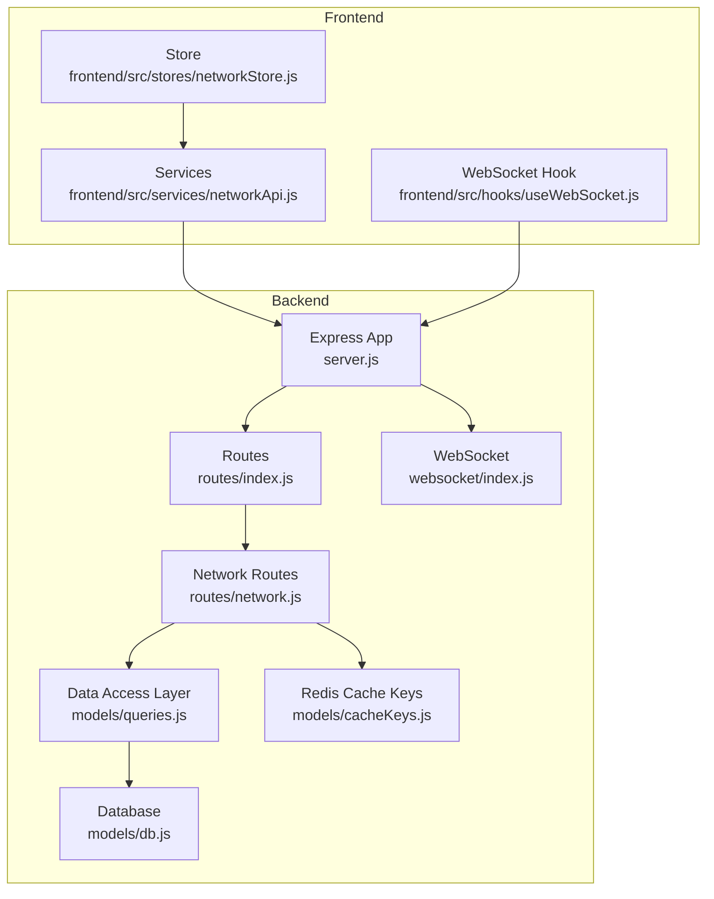
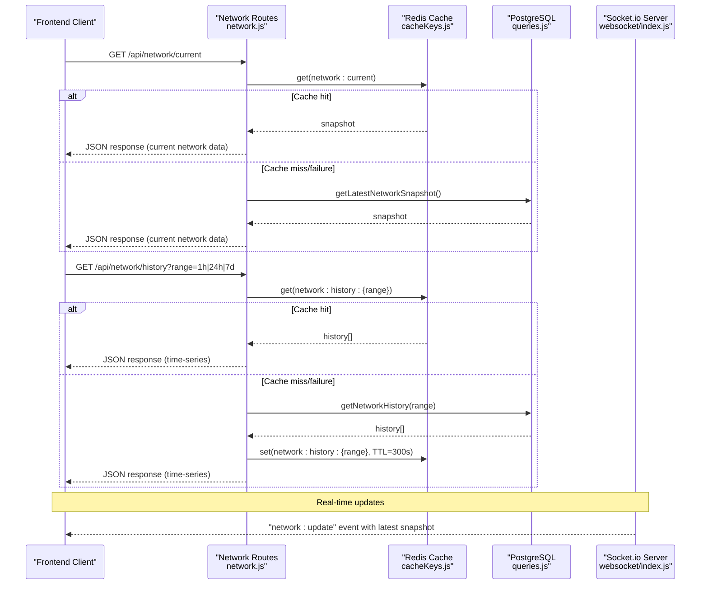
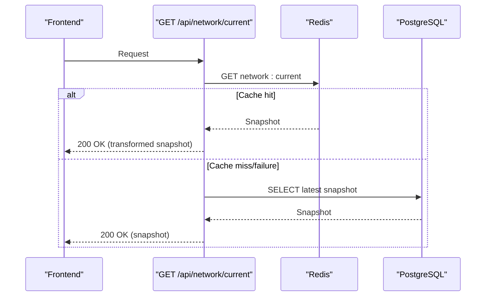
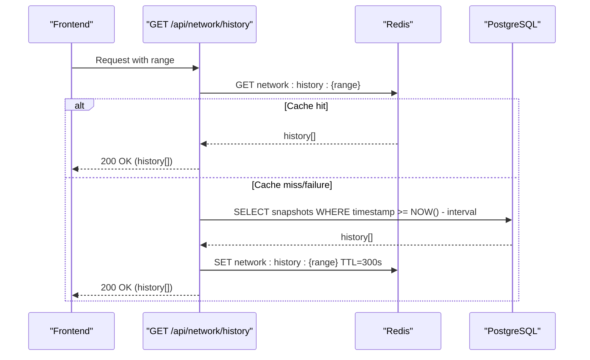
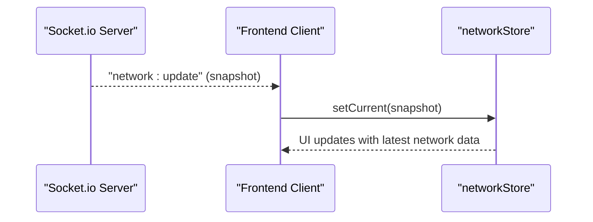
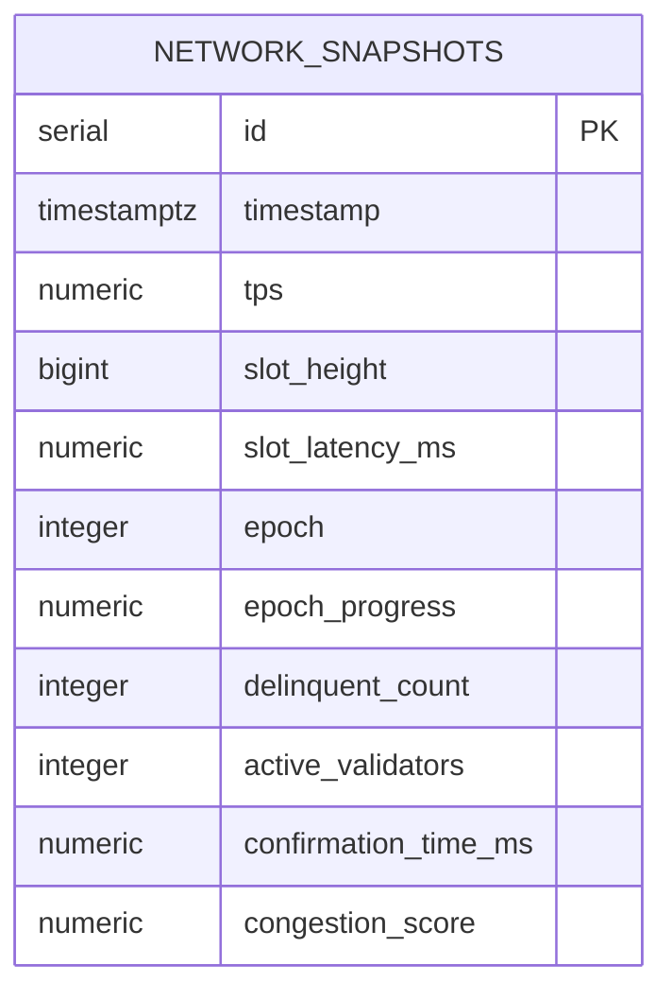
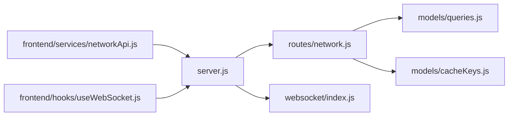

# Network Routes

<cite>
**Referenced Files in This Document**
- [network.js](file://backend/src/routes/network.js)
- [queries.js](file://backend/src/models/queries.js)
- [cacheKeys.js](file://backend/src/models/cacheKeys.js)
- [index.js](file://backend/src/websocket/index.js)
- [server.js](file://backend/server.js)
- [networkApi.js](file://frontend/src/services/networkApi.js)
- [networkStore.js](file://frontend/src/stores/networkStore.js)
- [useWebSocket.js](file://frontend/src/hooks/useWebSocket.js)
- [index.js](file://backend/src/config/index.js)
- [errorHandler.js](file://backend/src/middleware/errorHandler.js)
- [db.js](file://backend/src/models/db.js)
- [migrate.js](file://backend/src/models/migrate.js)
</cite>

## Table of Contents
1. [Introduction](#introduction)
2. [Project Structure](#project-structure)
3. [Core Components](#core-components)
4. [Architecture Overview](#architecture-overview)
5. [Detailed Component Analysis](#detailed-component-analysis)
6. [Dependency Analysis](#dependency-analysis)
7. [Performance Considerations](#performance-considerations)
8. [Troubleshooting Guide](#troubleshooting-guide)
9. [Conclusion](#conclusion)

## Introduction
This document provides comprehensive API documentation for the network monitoring endpoints under /api/network. It covers real-time and historical network data, including TPS tracking, slot latency monitoring, epoch progress, and congestion metrics. It also documents the HTTP endpoints, request/response schemas, caching and storage strategies, and WebSocket-based real-time updates. Pagination is not applicable for historical network data; instead, time-range filters are supported.

## Project Structure
The network endpoints are implemented as Express routes mounted under /api/network. They rely on a PostgreSQL-backed data layer and Redis caching, and integrate with Socket.io for real-time updates.

**Diagram sources**
- [server.js:1-128](file://backend/server.js#L1-L128)
- [index.js:1-24](file://backend/src/routes/index.js#L1-L24)
- [network.js:1-135](file://backend/src/routes/network.js#L1-L135)
- [queries.js:1-459](file://backend/src/models/queries.js#L1-L459)
- [db.js:1-98](file://backend/src/models/db.js#L1-L98)
- [cacheKeys.js:1-50](file://backend/src/models/cacheKeys.js#L1-L50)
- [index.js:1-81](file://backend/src/websocket/index.js#L1-L81)
- [networkApi.js:1-6](file://frontend/src/services/networkApi.js#L1-L6)
- [networkStore.js:1-25](file://frontend/src/stores/networkStore.js#L1-L25)
- [useWebSocket.js:1-30](file://frontend/src/hooks/useWebSocket.js#L1-L30)

**Section sources**
- [server.js:1-128](file://backend/server.js#L1-L128)
- [index.js:1-24](file://backend/src/routes/index.js#L1-L24)
- [network.js:1-135](file://backend/src/routes/network.js#L1-L135)
- [queries.js:1-459](file://backend/src/models/queries.js#L1-L459)
- [cacheKeys.js:1-50](file://backend/src/models/cacheKeys.js#L1-L50)
- [index.js:1-81](file://backend/src/websocket/index.js#L1-L81)
- [networkApi.js:1-6](file://frontend/src/services/networkApi.js#L1-L6)
- [networkStore.js:1-25](file://frontend/src/stores/networkStore.js#L1-L25)
- [useWebSocket.js:1-30](file://frontend/src/hooks/useWebSocket.js#L1-L30)

## Core Components
- Network Routes: Provide /api/network/current and /api/network/history endpoints with cache-first retrieval and database fallback.
- Data Access Layer: Implements insert and retrieval functions for network snapshots and supports time-range queries.
- Caching: Uses Redis keys with TTL values tailored for network history and current data.
- Real-time Updates: Socket.io server exposes broadcast events consumed by the frontend.

**Section sources**
- [network.js:12-135](file://backend/src/routes/network.js#L12-L135)
- [queries.js:13-84](file://backend/src/models/queries.js#L13-L84)
- [cacheKeys.js:6-49](file://backend/src/models/cacheKeys.js#L6-L49)
- [index.js:13-81](file://backend/src/websocket/index.js#L13-L81)

## Architecture Overview
The network monitoring API follows a cache-first pattern. Requests to /api/network/current and /api/network/history first attempt Redis reads, falling back to PostgreSQL queries if cache misses or failures occur. Historical data is filtered by time ranges and stored as time-series rows. Real-time updates are broadcast via Socket.io to subscribed clients.

**Diagram sources**
- [network.js:17-79](file://backend/src/routes/network.js#L17-L79)
- [network.js:85-132](file://backend/src/routes/network.js#L85-L132)
- [cacheKeys.js:8,40](file://backend/src/models/cacheKeys.js#L8,L40)
- [queries.js:54,69](file://backend/src/models/queries.js#L54,L69)
- [index.js:48,52](file://backend/src/websocket/index.js#L48,L52)

## Detailed Component Analysis

### Endpoint: GET /api/network/current
- Method: GET
- URL: /api/network/current
- Purpose: Returns the latest network snapshot with health and performance metrics.
- Cache-first behavior:
  - Reads Redis key: network:current (TTL 60s).
  - On cache hit, transforms cached snapshot into the response shape and returns immediately.
  - On cache miss or failure, queries the latest row from network_snapshots and returns it.
- Database fallback:
  - If DB is unavailable, responds with service unavailability error.
  - If no snapshot exists yet, responds with no data available error.
- Response schema (JSON):
  - status: string (health status derived from cached data)
  - tps: number (transactions per second)
  - slotHeight: number (current slot height)
  - slotLatencyMs: number (slot latency in milliseconds)
  - epoch: number (current epoch)
  - epochProgress: number (epoch progress percentage)
  - delinquentCount: number (number of delinquent validators)
  - activeValidators: number (number of active validators)
  - confirmationTimeMs: number (average confirmation time in milliseconds)
  - congestionScore: number (network congestion score)
  - timestamp: string (ISO timestamp of the snapshot)
- Error responses:
  - 503 Service Unavailable: Data collection is starting up or temporarily unavailable.
  - 503 No network data available: Service is starting up or data collection is unavailable.
- Frontend usage:
  - Called via networkApi.fetchNetworkCurrent().
  - Store updates current network state and lastUpdate timestamp.

**Diagram sources**
- [network.js:17-79](file://backend/src/routes/network.js#L17-L79)
- [cacheKeys.js:8](file://backend/src/models/cacheKeys.js#L8)
- [queries.js:54](file://backend/src/models/queries.js#L54)

**Section sources**
- [network.js:12-79](file://backend/src/routes/network.js#L12-L79)
- [queries.js:54](file://backend/src/models/queries.js#L54)
- [networkApi.js:3](file://frontend/src/services/networkApi.js#L3)
- [networkStore.js:17](file://frontend/src/stores/networkStore.js#L17)

### Endpoint: GET /api/network/history
- Method: GET
- URL: /api/network/history?range=1h|24h|7d
- Purpose: Returns historical network snapshots for charting and analytics.
- Query parameter:
  - range: one of 1h, 24h, 7d (default: 1h)
- Validation:
  - Invalid range returns 400 with valid ranges list.
- Cache-first behavior:
  - Reads Redis key: network:history:{range} (TTL 300s).
  - On cache hit, returns cached array of snapshots.
  - On cache miss or failure, queries network_snapshots for the specified interval and caches the result.
- Response:
  - Array of snapshot objects with the same schema as the current endpoint’s snapshot.
  - Empty array if DB is unavailable during fallback.
- Filtering and pagination:
  - Filtering by time range is supported via the range parameter.
  - Pagination is not implemented; clients should slice arrays as needed.
- Frontend usage:
  - Called via networkApi.fetchNetworkHistory(range).
  - Store updates history array and selected historyRange.

**Diagram sources**
- [network.js:85-132](file://backend/src/routes/network.js#L85-L132)
- [cacheKeys.js:40](file://backend/src/models/cacheKeys.js#L40)
- [queries.js:69](file://backend/src/models/queries.js#L69)

**Section sources**
- [network.js:82-132](file://backend/src/routes/network.js#L82-L132)
- [queries.js:69](file://backend/src/models/queries.js#L69)
- [networkApi.js:4](file://frontend/src/services/networkApi.js#L4)
- [networkStore.js:18,14](file://frontend/src/stores/networkStore.js#L18,L14)

### Real-time Updates via WebSocket
- Server:
  - Socket.io server is initialized and configured with CORS.
  - Broadcast helper is available for emitting events to all clients.
- Client:
  - Frontend connects using socket.io-client with websocket and polling transports.
  - Subscribes to "network:update" events and updates the current network state.
- Event:
  - "network:update": payload is the latest network snapshot object.

**Diagram sources**
- [server.js:39-50](file://backend/server.js#L39-L50)
- [index.js:48,52](file://backend/src/websocket/index.js#L48,L52)
- [useWebSocket.js:21,23](file://frontend/src/hooks/useWebSocket.js#L21,L23)
- [networkStore.js:17](file://frontend/src/stores/networkStore.js#L17)

**Section sources**
- [server.js:39-50](file://backend/server.js#L39-L50)
- [index.js:13-81](file://backend/src/websocket/index.js#L13-L81)
- [useWebSocket.js:1-30](file://frontend/src/hooks/useWebSocket.js#L1-L30)
- [networkStore.js:1-25](file://frontend/src/stores/networkStore.js#L1-L25)

### Data Model: Network Snapshot
Network snapshots are stored as time-series rows in the network_snapshots table. Each snapshot includes the following fields:
- id: serial primary key
- timestamp: timestamptz (indexed)
- tps: numeric (transactions per second)
- slot_height: bigint (current slot height)
- slot_latency_ms: numeric (slot latency in milliseconds)
- epoch: integer (current epoch)
- epoch_progress: numeric (epoch progress percentage)
- delinquent_count: integer (number of delinquent validators)
- active_validators: integer (number of active validators)
- confirmation_time_ms: numeric (average confirmation time in milliseconds)
- congestion_score: numeric (network congestion score)

**Diagram sources**
- [migrate.js:11-29](file://backend/src/models/migrate.js#L11-L29)

**Section sources**
- [migrate.js:11-29](file://backend/src/models/migrate.js#L11-L29)
- [queries.js:27,54,69](file://backend/src/models/queries.js#L27,L54,L69)

## Dependency Analysis
- Route dependencies:
  - network.js depends on queries.js for DB operations and cacheKeys.js for Redis key construction.
- Middleware and server:
  - server.js initializes Redis and DB, mounts routes, and sets up Socket.io.
- Frontend integration:
  - networkApi.js consumes the network endpoints.
  - useWebSocket.js subscribes to real-time updates.
- Error handling:
  - errorHandler.js centralizes error responses for validation, not-found, unauthorized, and forbidden scenarios.

**Diagram sources**
- [network.js:1-135](file://backend/src/routes/network.js#L1-L135)
- [queries.js:1-459](file://backend/src/models/queries.js#L1-L459)
- [cacheKeys.js:1-50](file://backend/src/models/cacheKeys.js#L1-L50)
- [server.js:1-128](file://backend/server.js#L1-L128)
- [index.js:1-81](file://backend/src/websocket/index.js#L1-L81)
- [networkApi.js:1-6](file://frontend/src/services/networkApi.js#L1-L6)
- [useWebSocket.js:1-30](file://frontend/src/hooks/useWebSocket.js#L1-L30)

**Section sources**
- [network.js:1-135](file://backend/src/routes/network.js#L1-L135)
- [queries.js:1-459](file://backend/src/models/queries.js#L1-L459)
- [cacheKeys.js:1-50](file://backend/src/models/cacheKeys.js#L1-L50)
- [server.js:1-128](file://backend/server.js#L1-L128)
- [index.js:1-81](file://backend/src/websocket/index.js#L1-L81)
- [networkApi.js:1-6](file://frontend/src/services/networkApi.js#L1-L6)
- [useWebSocket.js:1-30](file://frontend/src/hooks/useWebSocket.js#L1-L30)

## Performance Considerations
- Cache-first design:
  - Current endpoint uses a short TTL (60s) for near-real-time freshness.
  - History endpoint uses a moderate TTL (300s) to balance cache hits and recency.
- Database indexing:
  - network_snapshots timestamp is indexed to optimize time-range queries.
- Compression and security:
  - Compression and Helmet middleware are enabled at the server level.
- Polling cadence:
  - Backend pollers run every 30s (critical) and 5min (routine), aligning with cache TTLs.

**Section sources**
- [cacheKeys.js:8,40,47](file://backend/src/models/cacheKeys.js#L8,L40,L47)
- [migrate.js:27-28](file://backend/src/models/migrate.js#L27-L28)
- [server.js:52-59](file://backend/server.js#L52-L59)
- [index.js:56-59](file://backend/src/config/index.js#L56-L59)

## Troubleshooting Guide
- 400 Invalid range parameter:
  - Occurs when the range query parameter is not one of 1h, 24h, 7d.
  - Response includes a list of valid ranges.
- 503 Service unavailable:
  - Returned when DB is unavailable during current endpoint retrieval.
- 503 No network data available:
  - Returned when no snapshot exists yet (startup phase).
- 200 Empty array:
  - History endpoint returns an empty array if DB is unavailable during fallback.
- Error logging:
  - errorHandler.js logs structured error details and returns standardized JSON responses.

**Section sources**
- [network.js:89-96](file://backend/src/routes/network.js#L89-L96)
- [network.js:49-61](file://backend/src/routes/network.js#L49-L61)
- [network.js:114-117](file://backend/src/routes/network.js#L114-L117)
- [errorHandler.js:44-109](file://backend/src/middleware/errorHandler.js#L44-L109)

## Conclusion
The /api/network endpoints provide efficient, cache-aware access to current and historical network metrics with robust fallbacks and real-time updates. Clients should filter historical data by the range parameter and handle empty arrays gracefully during DB outages. The documented schemas and flows enable reliable integration for TPS tracking, slot latency monitoring, epoch progress, and congestion metrics.