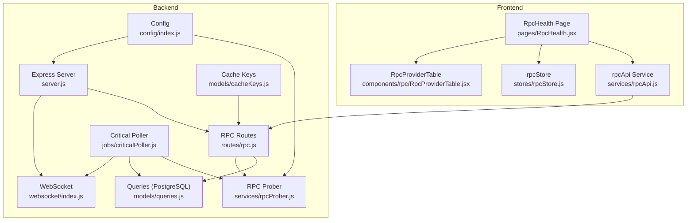
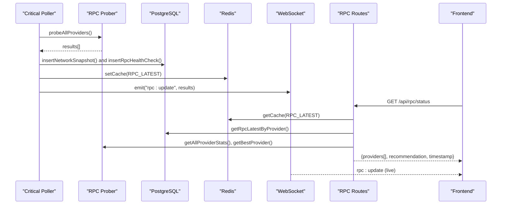
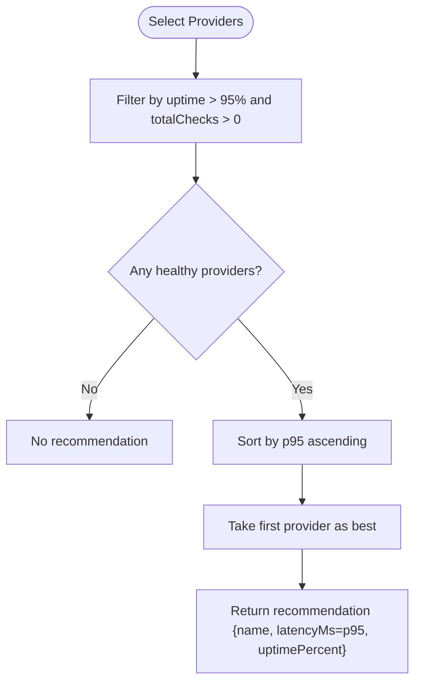
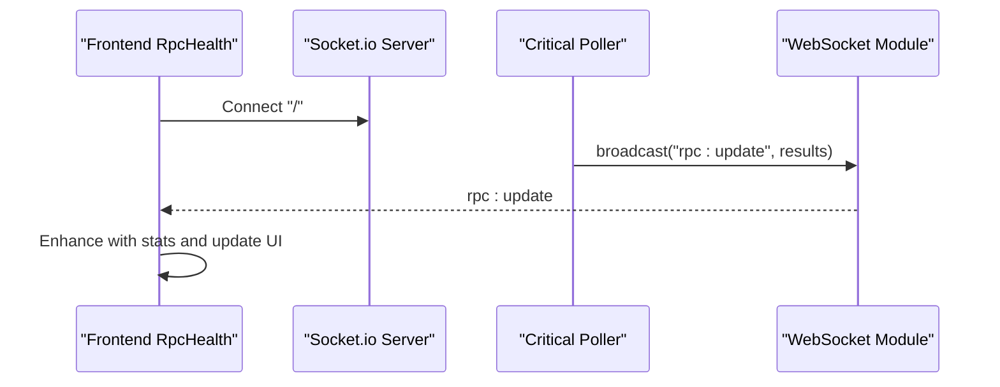
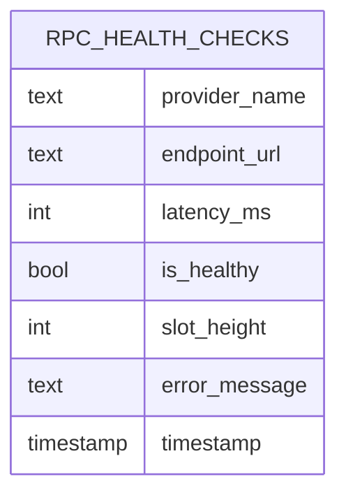
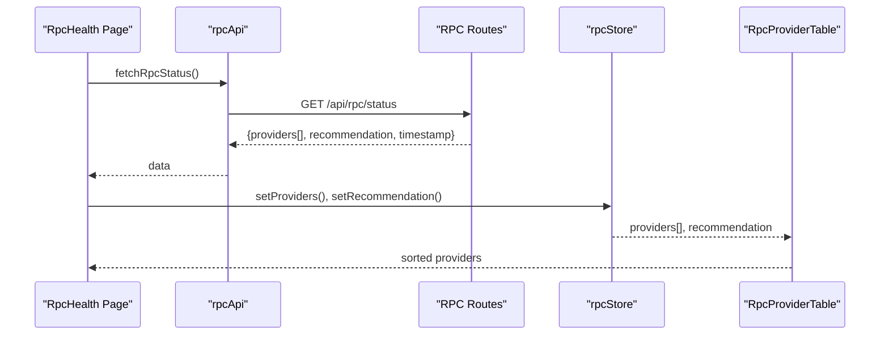
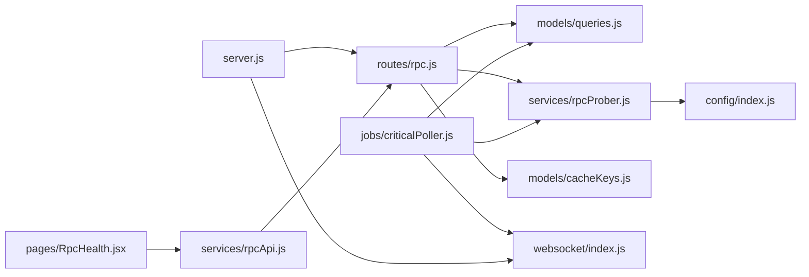

# RPC Routes

<cite>
**Referenced Files in This Document**
- [server.js](file://backend/server.js)
- [routes/rpc.js](file://backend/src/routes/rpc.js)
- [services/rpcProber.js](file://backend/src/services/rpcProber.js)
- [models/queries.js](file://backend/src/models/queries.js)
- [websocket/index.js](file://backend/src/websocket/index.js)
- [jobs/criticalPoller.js](file://backend/src/jobs/criticalPoller.js)
- [config/index.js](file://backend/src/config/index.js)
- [models/cacheKeys.js](file://backend/src/models/cacheKeys.js)
- [pages/RpcHealth.jsx](file://frontend/src/pages/RpcHealth.jsx)
- [services/rpcApi.js](file://frontend/src/services/rpcApi.js)
- [components/rpc/RpcProviderTable.jsx](file://frontend/src/components/rpc/RpcProviderTable.jsx)
- [stores/rpcStore.js](file://frontend/src/stores/rpcStore.js)
</cite>

## Table of Contents
1. [Introduction](#introduction)
2. [Project Structure](#project-structure)
3. [Core Components](#core-components)
4. [Architecture Overview](#architecture-overview)
5. [Detailed Component Analysis](#detailed-component-analysis)
6. [Dependency Analysis](#dependency-analysis)
7. [Performance Considerations](#performance-considerations)
8. [Troubleshooting Guide](#troubleshooting-guide)
9. [Conclusion](#conclusion)
10. [Appendices](#appendices)

## Introduction
This document provides comprehensive API documentation for RPC provider monitoring endpoints. It covers:
- HTTP endpoints under /api/rpc/*
- Request parameters and response schemas
- Health checks, uptime statistics, latency measurements, and performance metrics
- Provider ranking algorithms and failover recommendations
- Real-time updates via WebSocket
- Authentication, rate limiting, and geographic distribution considerations

## Project Structure
The RPC monitoring system spans backend and frontend modules:
- Backend exposes REST endpoints and WebSocket events
- Frontend consumes REST endpoints and subscribes to WebSocket events
- Data is collected periodically, stored in PostgreSQL, cached in Redis, and broadcast to clients

**Diagram sources**
- [server.js:33-107](file://backend/server.js#L33-L107)
- [routes/rpc.js:1-135](file://backend/src/routes/rpc.js#L1-L135)
- [services/rpcProber.js:1-342](file://backend/src/services/rpcProber.js#L1-L342)
- [models/queries.js:86-156](file://backend/src/models/queries.js#L86-L156)
- [websocket/index.js:13-81](file://backend/src/websocket/index.js#L13-L81)
- [jobs/criticalPoller.js:21-103](file://backend/src/jobs/criticalPoller.js#L21-L103)
- [config/index.js:27-68](file://backend/src/config/index.js#L27-L68)
- [models/cacheKeys.js:6-49](file://backend/src/models/cacheKeys.js#L6-L49)
- [pages/RpcHealth.jsx:9-195](file://frontend/src/pages/RpcHealth.jsx#L9-L195)
- [services/rpcApi.js:1-7](file://frontend/src/services/rpcApi.js#L1-L7)
- [components/rpc/RpcProviderTable.jsx:39-177](file://frontend/src/components/rpc/RpcProviderTable.jsx#L39-L177)
- [stores/rpcStore.js:1-16](file://frontend/src/stores/rpcStore.js#L1-L16)

**Section sources**
- [server.js:33-107](file://backend/server.js#L33-L107)
- [routes/rpc.js:1-135](file://backend/src/routes/rpc.js#L1-L135)
- [services/rpcProber.js:1-342](file://backend/src/services/rpcProber.js#L1-L342)
- [models/queries.js:86-156](file://backend/src/models/queries.js#L86-L156)
- [websocket/index.js:13-81](file://backend/src/websocket/index.js#L13-L81)
- [jobs/criticalPoller.js:21-103](file://backend/src/jobs/criticalPoller.js#L21-L103)
- [config/index.js:27-68](file://backend/src/config/index.js#L27-L68)
- [models/cacheKeys.js:6-49](file://backend/src/models/cacheKeys.js#L6-L49)
- [pages/RpcHealth.jsx:9-195](file://frontend/src/pages/RpcHealth.jsx#L9-L195)
- [services/rpcApi.js:1-7](file://frontend/src/services/rpcApi.js#L1-L7)
- [components/rpc/RpcProviderTable.jsx:39-177](file://frontend/src/components/rpc/RpcProviderTable.jsx#L39-L177)
- [stores/rpcStore.js:1-16](file://frontend/src/stores/rpcStore.js#L1-L16)

## Core Components
- RPC Routes: Expose /api/rpc/status and /api/rpc/:provider/history
- RPC Prober: Probes providers, computes rolling stats, and selects best provider
- Queries: Data access layer for PostgreSQL storage and retrieval
- WebSocket: Broadcasts real-time updates to clients
- Critical Poller: Periodic job that probes providers, writes to DB/Redis, and emits WebSocket events
- Frontend: Renders provider status, sorts by latency/uptime, and subscribes to WebSocket

**Section sources**
- [routes/rpc.js:14-132](file://backend/src/routes/rpc.js#L14-L132)
- [services/rpcProber.js:10-63](file://backend/src/services/rpcProber.js#L10-L63)
- [models/queries.js:124-156](file://backend/src/models/queries.js#L124-L156)
- [websocket/index.js:13-81](file://backend/src/websocket/index.js#L13-L81)
- [jobs/criticalPoller.js:21-103](file://backend/src/jobs/criticalPoller.js#L21-L103)

## Architecture Overview
The system operates on a periodic polling model:
- Every 30 seconds, the Critical Poller probes RPC providers, writes results to PostgreSQL and Redis, and broadcasts updates via WebSocket
- Clients query REST endpoints for current status and historical data
- Frontend displays live updates and allows sorting/filtering

**Diagram sources**
- [jobs/criticalPoller.js:21-103](file://backend/src/jobs/criticalPoller.js#L21-L103)
- [services/rpcProber.js:140-307](file://backend/src/services/rpcProber.js#L140-L307)
- [models/queries.js:101-156](file://backend/src/models/queries.js#L101-L156)
- [models/cacheKeys.js:8-9](file://backend/src/models/cacheKeys.js#L8-L9)
- [routes/rpc.js:17-88](file://backend/src/routes/rpc.js#L17-L88)
- [pages/RpcHealth.jsx:24-81](file://frontend/src/pages/RpcHealth.jsx#L24-L81)

## Detailed Component Analysis

### REST Endpoints

#### GET /api/rpc/status
- Purpose: Retrieve current RPC provider status with rolling statistics and best provider recommendation
- Method: GET
- URL: /api/rpc/status
- Query parameters: None
- Response schema:
  - providers: array of provider objects
    - providerName: string
    - endpoint: string
    - latencyMs: number
    - isHealthy: boolean
    - slotHeight: number
    - error: string|null
    - timestamp: string (ISO 8601)
    - stats: object
      - p50: number (milliseconds)
      - p95: number (milliseconds)
      - p99: number (milliseconds)
      - uptimePercent: number (percentage)
      - totalChecks: number
      - healthyChecks: number
      - lastIncident: string|null
    - category: string ("public"|"premium")
    - requiresKey: boolean
    - note: string|null
  - recommendation: object|null
    - name: string
    - latencyMs: number
    - uptimePercent: number
  - timestamp: string (ISO 8601)
- Caching: Attempts Redis cache key rpc:latest; falls back to DB query
- Rolling stats computation: Uses internal history maintained by RPC Prober

Example request:
- curl -s http://localhost:3001/api/rpc/status

Example response shape:
- See response schema above

Notes:
- If Redis is unavailable, the route falls back to DB
- If DB is unavailable, an empty array is returned for providers

**Section sources**
- [routes/rpc.js:14-88](file://backend/src/routes/rpc.js#L14-L88)
- [models/cacheKeys.js:8-9](file://backend/src/models/cacheKeys.js#L8-L9)
- [models/queries.js:124-132](file://backend/src/models/queries.js#L124-L132)
- [services/rpcProber.js:256-272](file://backend/src/services/rpcProber.js#L256-L272)
- [services/rpcProber.js:295-307](file://backend/src/services/rpcProber.js#L295-L307)

#### GET /api/rpc/:provider/history
- Purpose: Retrieve historical health data for a specific provider
- Method: GET
- URL: /api/rpc/:provider/history
- Path parameters:
  - provider: string (provider name)
- Query parameters:
  - range: string (one of "1h","24h","7d"; default "1h")
- Response: array of health records (same shape as latest provider entries)
  - providerName: string
  - endpoint: string
  - latencyMs: number
  - isHealthy: boolean
  - slotHeight: number
  - error: string|null
  - timestamp: string (ISO 8601)
- Validation: Returns 400 with validRanges array if invalid range is provided
- Storage: Reads from PostgreSQL table rpc_health_checks

Example request:
- curl -s "http://localhost:3001/api/rpc/Helius/history?range=24h"

Example response shape:
- See response schema above

**Section sources**
- [routes/rpc.js:90-132](file://backend/src/routes/rpc.js#L90-L132)
- [models/queries.js:140-156](file://backend/src/models/queries.js#L140-L156)

### Provider Ranking and Failover Recommendations
- Best provider selection criteria:
  - Must be healthy (uptimePercent > 95)
  - Must have recorded checks (totalChecks > 0)
  - Sorted by p95 latency ascending
- Rolling statistics computed per provider:
  - p50/p95/p99 latency percentiles (computed from recent healthy checks)
  - uptimePercent = healthyChecks / totalChecks * 100
  - lastIncident = timestamp of most recent unhealthy check
- Provider metadata:
  - category: "public" or "premium"
  - requiresKey: boolean (indicates premium provider requiring API key)
  - note: string|null (contextual note for configuration)

**Diagram sources**
- [services/rpcProber.js:295-307](file://backend/src/services/rpcProber.js#L295-L307)

**Section sources**
- [services/rpcProber.js:256-307](file://backend/src/services/rpcProber.js#L256-L307)

### Real-Time Updates via WebSocket
- Events:
  - rpc:update: array of latest probe results (broadcast every 30 seconds)
- Frontend consumption:
  - Establishes WebSocket connection to "/" with path "/socket.io"
  - Receives rpc:update and merges with local state
- Backend setup:
  - Socket.io server configured with CORS and transports ["websocket","polling"]

**Diagram sources**
- [pages/RpcHealth.jsx:48-81](file://frontend/src/pages/RpcHealth.jsx#L48-L81)
- [websocket/index.js:13-81](file://backend/src/websocket/index.js#L13-L81)
- [jobs/criticalPoller.js:88-92](file://backend/src/jobs/criticalPoller.js#L88-L92)

**Section sources**
- [pages/RpcHealth.jsx:48-81](file://frontend/src/pages/RpcHealth.jsx#L48-L81)
- [websocket/index.js:13-81](file://backend/src/websocket/index.js#L13-L81)
- [jobs/criticalPoller.js:88-92](file://backend/src/jobs/criticalPoller.js#L88-L92)

### Data Model and Storage
- Provider health records stored in PostgreSQL table rpc_health_checks with columns:
  - provider_name, endpoint_url, latency_ms, is_healthy, slot_height, error_message, timestamp
- Latest per-provider record retrieval uses DISTINCT ON (provider_name) ordering by timestamp desc
- Historical queries support ranges "1h","24h","7d" using interval filters

**Diagram sources**
- [models/queries.js:101-118](file://backend/src/models/queries.js#L101-L118)
- [models/queries.js:124-132](file://backend/src/models/queries.js#L124-L132)
- [models/queries.js:140-156](file://backend/src/models/queries.js#L140-L156)

**Section sources**
- [models/queries.js:101-156](file://backend/src/models/queries.js#L101-L156)

### Frontend Integration
- RpcHealth page:
  - Fetches /api/rpc/status on mount and every 30 seconds
  - Subscribes to rpc:update WebSocket events
  - Displays providers in RpcProviderTable with sorting and color-coded metrics
- RpcProviderTable:
  - Columns: Status, Provider, Latency, P50/P95/P99, Uptime %, Last Incident
  - Sorting by latencyMs, providerName, uptime
- Store:
  - Maintains providers, recommendation, loading, and error state

**Diagram sources**
- [pages/RpcHealth.jsx:24-45](file://frontend/src/pages/RpcHealth.jsx#L24-L45)
- [services/rpcApi.js:3-6](file://frontend/src/services/rpcApi.js#L3-L6)
- [routes/rpc.js:17-88](file://backend/src/routes/rpc.js#L17-L88)
- [stores/rpcStore.js:3-13](file://frontend/src/stores/rpcStore.js#L3-L13)
- [components/rpc/RpcProviderTable.jsx:39-177](file://frontend/src/components/rpc/RpcProviderTable.jsx#L39-L177)

**Section sources**
- [pages/RpcHealth.jsx:24-45](file://frontend/src/pages/RpcHealth.jsx#L24-L45)
- [services/rpcApi.js:3-6](file://frontend/src/services/rpcApi.js#L3-L6)
- [routes/rpc.js:17-88](file://backend/src/routes/rpc.js#L17-L88)
- [stores/rpcStore.js:3-13](file://frontend/src/stores/rpcStore.js#L3-L13)
- [components/rpc/RpcProviderTable.jsx:39-177](file://frontend/src/components/rpc/RpcProviderTable.jsx#L39-L177)

## Dependency Analysis
- Routes depend on:
  - Queries for DB access
  - Redis cache via cacheKeys
  - RPC Prober for rolling stats and best provider
- RPC Prober depends on:
  - Config for provider endpoints and keys
  - Axios for HTTP requests
- Critical Poller depends on:
  - RPC Prober for probing
  - Queries for persistence
  - Redis for caching
  - WebSocket for broadcasting

**Diagram sources**
- [routes/rpc.js:8-11](file://backend/src/routes/rpc.js#L8-L11)
- [models/queries.js:7-8](file://backend/src/models/queries.js#L7-L8)
- [services/rpcProber.js:6-8](file://backend/src/services/rpcProber.js#L6-L8)
- [models/cacheKeys.js:6-49](file://backend/src/models/cacheKeys.js#L6-L49)
- [config/index.js:27-68](file://backend/src/config/index.js#L27-L68)
- [jobs/criticalPoller.js:10-13](file://backend/src/jobs/criticalPoller.js#L10-L13)
- [websocket/index.js:13-81](file://backend/src/websocket/index.js#L13-L81)
- [server.js:23-31](file://backend/server.js#L23-L31)
- [pages/RpcHealth.jsx:7,19](file://frontend/src/pages/RpcHealth.jsx#L7,L19)
- [services/rpcApi.js:1-6](file://frontend/src/services/rpcApi.js#L1-L6)

**Section sources**
- [routes/rpc.js:8-11](file://backend/src/routes/rpc.js#L8-L11)
- [models/queries.js:7-8](file://backend/src/models/queries.js#L7-L8)
- [services/rpcProber.js:6-8](file://backend/src/services/rpcProber.js#L6-L8)
- [models/cacheKeys.js:6-49](file://backend/src/models/cacheKeys.js#L6-L49)
- [config/index.js:27-68](file://backend/src/config/index.js#L27-L68)
- [jobs/criticalPoller.js:10-13](file://backend/src/jobs/criticalPoller.js#L10-L13)
- [websocket/index.js:13-81](file://backend/src/websocket/index.js#L13-L81)
- [server.js:23-31](file://backend/server.js#L23-L31)
- [pages/RpcHealth.jsx:7,19](file://frontend/src/pages/RpcHealth.jsx#L7,L19)
- [services/rpcApi.js:1-6](file://frontend/src/services/rpcApi.js#L1-L6)

## Performance Considerations
- Polling cadence:
  - Critical Poller runs every 30 seconds; adjust via CRITICAL_POLL_INTERVAL environment variable
  - Routine Poller runs every 5 minutes
- Caching:
  - Redis cache keys for RPC_LATEST with TTL 60s
  - Frontend refreshes every 30 seconds to align with polling
- Latency measurement:
  - HTTP POST to provider endpoints with JSON-RPC getSlot
  - Timeout 5000ms per request
- Percentile calculation:
  - p50/p95/p99 computed from recent healthy checks; trimmed to last 100 checks per provider
- Recommendations:
  - Best provider selected among healthy providers (>95% uptime) with lowest p95 latency

[No sources needed since this section provides general guidance]

## Troubleshooting Guide
Common issues and remedies:
- No providers returned:
  - Check Redis availability; route falls back to DB
  - Verify database connectivity and rpc_health_checks table
- Invalid range parameter:
  - Endpoint validates range against ["1h","24h","7d"]; returns 400 with validRanges
- WebSocket not updating:
  - Confirm Socket.io path "/socket.io" and transports ["websocket","polling"]
  - Ensure Critical Poller is running and broadcasting "rpc:update"
- Premium provider endpoints:
  - Some providers require API keys; configure via environment variables as indicated by note fields
- Frontend not sorting:
  - Ensure providers array is populated and sortField/sortDirection are set

**Section sources**
- [routes/rpc.js:99-106](file://backend/src/routes/rpc.js#L99-L106)
- [pages/RpcHealth.jsx:48-81](file://frontend/src/pages/RpcHealth.jsx#L48-L81)
- [jobs/criticalPoller.js:88-92](file://backend/src/jobs/criticalPoller.js#L88-L92)
- [services/rpcProber.js:321-328](file://backend/src/services/rpcProber.js#L321-L328)

## Conclusion
The RPC monitoring system provides:
- Real-time provider health and latency metrics
- Rolling statistics and best provider recommendations
- Historical data access for diagnostics
- WebSocket-driven live updates
- Graceful fallbacks when Redis or DB are unavailable

[No sources needed since this section summarizes without analyzing specific files]

## Appendices

### API Reference Summary

- GET /api/rpc/status
  - Description: Current provider status with rolling stats and recommendation
  - Response: providers[], recommendation, timestamp
  - Caching: Redis rpc:latest; fallback to DB
  - Related: Rolling stats computed by RPC Prober

- GET /api/rpc/:provider/history
  - Description: Historical health data for a provider
  - Path params: provider
  - Query params: range ("1h","24h","7d")
  - Response: array of health records
  - Validation: 400 for invalid range

- WebSocket Events
  - rpc:update: Live array of latest probe results

- Frontend Integration
  - RpcHealth page fetches status and subscribes to rpc:update
  - RpcProviderTable renders metrics and supports sorting

**Section sources**
- [routes/rpc.js:14-132](file://backend/src/routes/rpc.js#L14-L132)
- [services/rpcProber.js:256-307](file://backend/src/services/rpcProber.js#L256-L307)
- [pages/RpcHealth.jsx:24-81](file://frontend/src/pages/RpcHealth.jsx#L24-L81)
- [components/rpc/RpcProviderTable.jsx:39-177](file://frontend/src/components/rpc/RpcProviderTable.jsx#L39-L177)

### Configuration and Environment Variables
- Port and environment: PORT, NODE_ENV
- Solana RPC: SOLANA_RPC_URL, HELIUS_API_KEY (used to construct Helius RPC URL)
- Validators.app: VALIDATORS_APP_API_KEY, VALIDATORS_APP_BASE_URL
- Database: DATABASE_URL
- Redis: REDIS_URL
- Polling intervals: CRITICAL_POLL_INTERVAL, ROUTINE_POLL_INTERVAL
- CORS origin: CORS_ORIGIN

**Section sources**
- [config/index.js:27-68](file://backend/src/config/index.js#L27-L68)

### Example Queries and Filters
- Query current status:
  - GET /api/rpc/status
- Filter by uptime threshold:
  - Use frontend UI to sort by uptime % or apply client-side filtering
- Retrieve historical data:
  - GET /api/rpc/{provider}/history?range=24h
- Real-time updates:
  - Subscribe to rpc:update WebSocket event

**Section sources**
- [routes/rpc.js:17-132](file://backend/src/routes/rpc.js#L17-L132)
- [pages/RpcHealth.jsx:24-81](file://frontend/src/pages/RpcHealth.jsx#L24-L81)