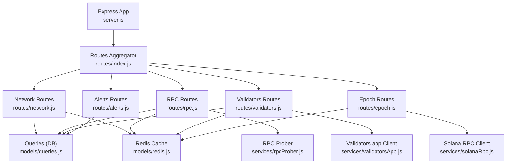
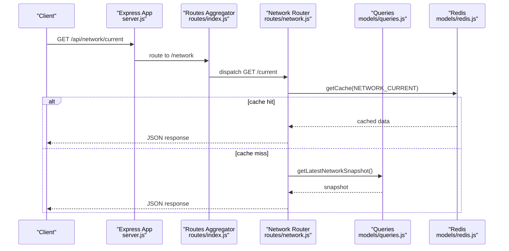
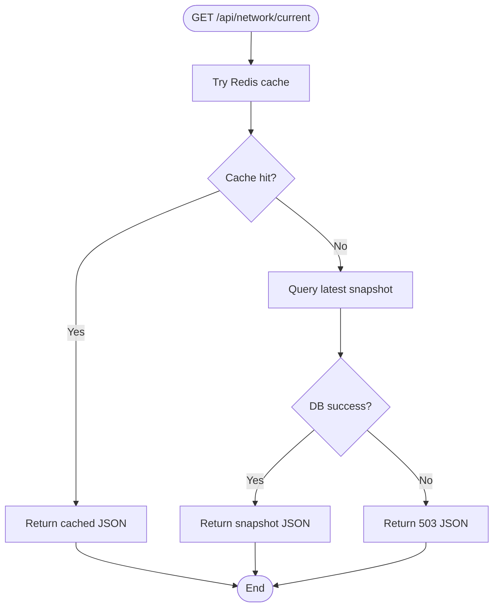
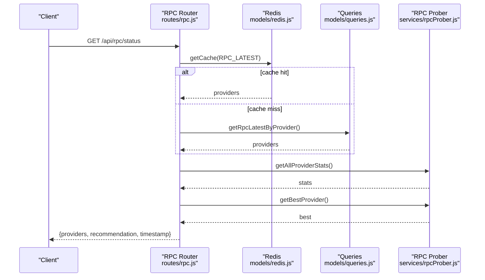
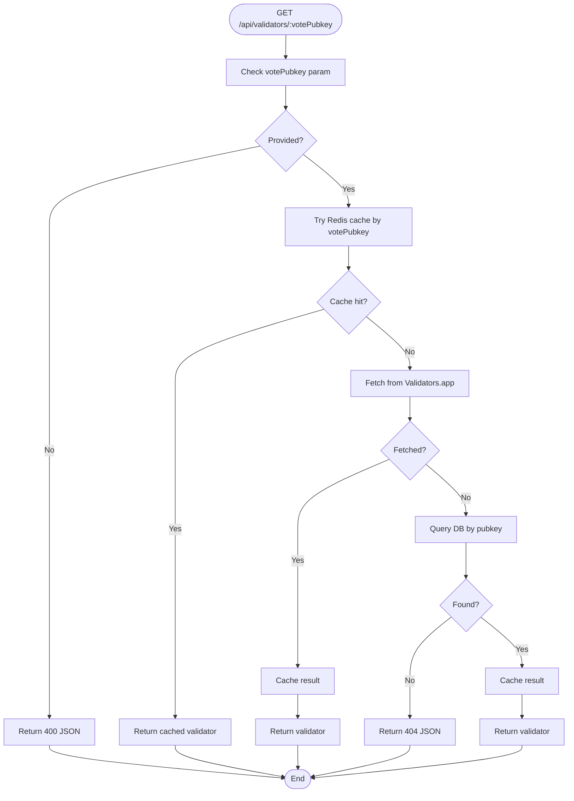
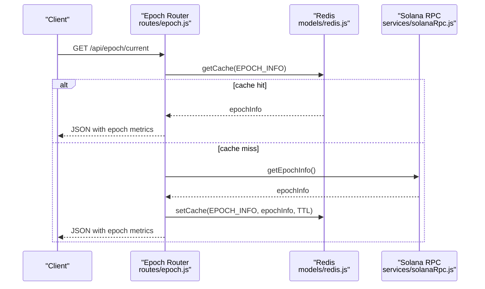
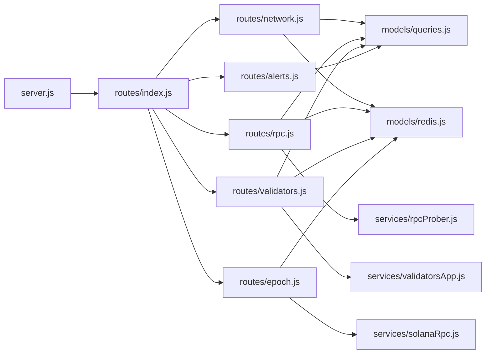

# Routing System

<cite>
**Referenced Files in This Document**
- [server.js](file://backend/server.js)
- [routes/index.js](file://backend/src/routes/index.js)
- [routes/network.js](file://backend/src/routes/network.js)
- [routes/rpc.js](file://backend/src/routes/rpc.js)
- [routes/validators.js](file://backend/src/routes/validators.js)
- [routes/epoch.js](file://backend/src/routes/epoch.js)
- [routes/alerts.js](file://backend/src/routes/alerts.js)
- [middleware/errorHandler.js](file://backend/src/middleware/errorHandler.js)
- [models/queries.js](file://backend/src/models/queries.js)
- [models/cacheKeys.js](file://backend/src/models/cacheKeys.js)
- [models/redis.js](file://backend/src/models/redis.js)
- [services/rpcProber.js](file://backend/src/services/rpcProber.js)
- [services/validatorsApp.js](file://backend/src/services/validatorsApp.js)
- [services/solanaRpc.js](file://backend/src/services/solanaRpc.js)
- [config/index.js](file://backend/src/config/index.js)
- [package.json](file://backend/package.json)
</cite>

## Table of Contents
1. [Introduction](#introduction)
2. [Project Structure](#project-structure)
3. [Core Components](#core-components)
4. [Architecture Overview](#architecture-overview)
5. [Detailed Component Analysis](#detailed-component-analysis)
6. [Dependency Analysis](#dependency-analysis)
7. [Performance Considerations](#performance-considerations)
8. [Troubleshooting Guide](#troubleshooting-guide)
9. [Conclusion](#conclusion)

## Introduction
This document describes the InfraWatch routing system built with Express. It explains the modular router architecture, route organization by domain, and the endpoint structure for network, RPC, validators, epoch, and alerts. It also documents middleware usage, parameter validation, error handling, and how routes integrate with the service and data layers.

## Project Structure
The backend exposes a single API base path and mounts sub-routers grouped by domain. Each route file encapsulates endpoints for its domain and delegates data access to services and the data layer.

**Diagram sources**
- [server.js:71-72](file://backend/server.js#L71-L72)
- [routes/index.js:16-21](file://backend/src/routes/index.js#L16-L21)
- [routes/network.js:1-135](file://backend/src/routes/network.js#L1-L135)
- [routes/rpc.js:1-135](file://backend/src/routes/rpc.js#L1-L135)
- [routes/validators.js:1-112](file://backend/src/routes/validators.js#L1-L112)
- [routes/epoch.js:1-62](file://backend/src/routes/epoch.js#L1-L62)
- [routes/alerts.js:1-46](file://backend/src/routes/alerts.js#L1-L46)
- [models/queries.js:1-200](file://backend/src/models/queries.js#L1-L200)
- [models/redis.js:1-161](file://backend/src/models/redis.js#L1-L161)
- [services/rpcProber.js:1-200](file://backend/src/services/rpcProber.js#L1-L200)
- [services/validatorsApp.js:1-200](file://backend/src/services/validatorsApp.js#L1-L200)
- [services/solanaRpc.js:1-200](file://backend/src/services/solanaRpc.js#L1-L200)

**Section sources**
- [server.js:71-79](file://backend/server.js#L71-L79)
- [routes/index.js:16-21](file://backend/src/routes/index.js#L16-L21)

## Core Components
- Express app and middleware pipeline: Helmet, compression, CORS, body parsing, health check, global error handler, and 404 handling.
- Routes aggregator mounts domain-specific routers under /api.
- Domain routers implement endpoints with cache-first patterns, parameter validation, and error propagation to the global handler.
- Services encapsulate external integrations (RPC probing, Validators.app, Solana RPC) and internal data access via queries.

**Section sources**
- [server.js:52-79](file://backend/server.js#L52-L79)
- [routes/index.js:16-21](file://backend/src/routes/index.js#L16-L21)
- [middleware/errorHandler.js:44-127](file://backend/src/middleware/errorHandler.js#L44-L127)

## Architecture Overview
The routing system follows a modular, layered architecture:
- Entry point initializes middleware and routes.
- Sub-routers define domain endpoints.
- Endpoints call services and the data layer.
- Redis cache is used for fast reads; database is used as fallback.
- Global error handler standardizes error responses.

**Diagram sources**
- [server.js:71-72](file://backend/server.js#L71-L72)
- [routes/index.js:17](file://backend/src/routes/index.js#L17)
- [routes/network.js:17-79](file://backend/src/routes/network.js#L17-L79)
- [models/redis.js:75-90](file://backend/src/models/redis.js#L75-L90)
- [models/queries.js:54-62](file://backend/src/models/queries.js#L54-L62)

## Detailed Component Analysis

### Network Routes
Endpoints:
- GET /api/network/current
  - Purpose: Returns current network status.
  - Cache-first: Attempts Redis; falls back to database.
  - Validation: None.
  - Authentication: Not required.
  - Response: JSON with status, TPS, slot metrics, epoch info, counts, and timestamp.
  - Error handling: 503 on startup/unavailable; global handler for unexpected errors.

- GET /api/network/history?range=1h|24h|7d
  - Purpose: Returns historical network snapshots for charts.
  - Cache-first: Attempts Redis; falls back to database.
  - Validation: Validates range parameter against allowed values.
  - Authentication: Not required.
  - Response: Array of snapshots.
  - Error handling: Returns empty array on DB failure; logs cache failures as warnings.

**Diagram sources**
- [routes/network.js:17-79](file://backend/src/routes/network.js#L17-L79)
- [models/redis.js:75-90](file://backend/src/models/redis.js#L75-L90)
- [models/queries.js:54-62](file://backend/src/models/queries.js#L54-L62)

**Section sources**
- [routes/network.js:17-79](file://backend/src/routes/network.js#L17-L79)
- [routes/network.js:85-132](file://backend/src/routes/network.js#L85-L132)
- [models/cacheKeys.js:8-11](file://backend/src/models/cacheKeys.js#L8-L11)
- [models/redis.js:75-112](file://backend/src/models/redis.js#L75-L112)

### RPC Routes
Endpoints:
- GET /api/rpc/status
  - Purpose: Returns current provider statuses with rolling statistics and a recommendation.
  - Cache-first: Attempts Redis; falls back to database.
  - Rolling stats: Merges latest DB results with stats computed by the prober service.
  - Recommendation: Best provider derived from rolling stats.
  - Response: Providers array with stats, recommendation, and timestamp.
  - Error handling: Returns empty array on DB failure; global handler for unexpected errors.

- GET /api/rpc/:provider/history?range=1h|24h|7d
  - Purpose: Returns health history for a specific provider.
  - Validation: Validates range parameter.
  - Response: Transformed array of health checks.
  - Error handling: Returns empty array on DB failure; global handler for unexpected errors.

**Diagram sources**
- [routes/rpc.js:17-88](file://backend/src/routes/rpc.js#L17-L88)
- [models/redis.js:75-90](file://backend/src/models/redis.js#L75-L90)
- [models/queries.js:124-132](file://backend/src/models/queries.js#L124-L132)
- [services/rpcProber.js:140-180](file://backend/src/services/rpcProber.js#L140-L180)

**Section sources**
- [routes/rpc.js:17-88](file://backend/src/routes/rpc.js#L17-L88)
- [routes/rpc.js:94-132](file://backend/src/routes/rpc.js#L94-L132)
- [services/rpcProber.js:11-63](file://backend/src/services/rpcProber.js#L11-L63)
- [services/rpcProber.js:140-180](file://backend/src/services/rpcProber.js#L140-L180)
- [models/cacheKeys.js:9](file://backend/src/models/cacheKeys.js#L9)
- [models/redis.js:75-112](file://backend/src/models/redis.js#L75-L112)

### Validators Routes
Endpoints:
- GET /api/validators/top?limit=1..100
  - Purpose: Returns top validators sorted by score.
  - Cache-first: Attempts Redis; falls back to database.
  - Validation: Clamps limit between 1 and 100.
  - Response: Array of validators.
  - Error handling: Returns empty array on DB failure; global handler for unexpected errors.

- GET /api/validators/:votePubkey
  - Purpose: Returns a single validator’s details.
  - Validation: Requires votePubkey parameter.
  - Priority: Try Redis; then Validators.app; finally database.
  - Response: Validator object.
  - Error handling: 404 if not found; global handler for unexpected errors.

**Diagram sources**
- [routes/validators.js:52-109](file://backend/src/routes/validators.js#L52-L109)
- [services/validatorsApp.js:186-200](file://backend/src/services/validatorsApp.js#L186-L200)
- [models/queries.js:1-200](file://backend/src/models/queries.js#L1-L200)
- [models/cacheKeys.js:25](file://backend/src/models/cacheKeys.js#L25)

**Section sources**
- [routes/validators.js:17-46](file://backend/src/routes/validators.js#L17-L46)
- [routes/validators.js:52-109](file://backend/src/routes/validators.js#L52-L109)
- [services/validatorsApp.js:115-149](file://backend/src/services/validatorsApp.js#L115-L149)
- [models/cacheKeys.js:11](file://backend/src/models/cacheKeys.js#L11)

### Epoch Routes
Endpoint:
- GET /api/epoch/current
  - Purpose: Returns current epoch information.
  - Cache-first: Attempts Redis; falls back to Solana RPC client.
  - Response: Epoch info with progress and ETA.
  - Error handling: Global handler for unexpected errors.

**Diagram sources**
- [routes/epoch.js:16-59](file://backend/src/routes/epoch.js#L16-L59)
- [models/redis.js:75-112](file://backend/src/models/redis.js#L75-L112)
- [services/solanaRpc.js:124-156](file://backend/src/services/solanaRpc.js#L124-L156)
- [models/cacheKeys.js:10](file://backend/src/models/cacheKeys.js#L10)

**Section sources**
- [routes/epoch.js:16-59](file://backend/src/routes/epoch.js#L16-L59)
- [services/solanaRpc.js:124-156](file://backend/src/services/solanaRpc.js#L124-L156)
- [models/cacheKeys.js:10](file://backend/src/models/cacheKeys.js#L10)

### Alerts Routes
Endpoint:
- GET /api/alerts?limit=1..100
  - Purpose: Returns recent alerts.
  - Validation: Clamps limit between 1 and 100.
  - Response: Array of alerts with normalized fields.
  - Error handling: Returns empty array on DB failure; global handler for unexpected errors.

**Section sources**
- [routes/alerts.js:14-43](file://backend/src/routes/alerts.js#L14-L43)
- [models/queries.js:1-200](file://backend/src/models/queries.js#L1-L200)

### Route Composition and Nesting
- The routes aggregator mounts sub-routers at /api/network, /api/rpc, /api/validators, /api/epoch, and /api/alerts.
- Nested patterns:
  - RPC: /:provider/history uses a path parameter.
  - Validators: /:votePubkey uses a path parameter.
- Route composition:
  - Each router composes service and data-layer calls.
  - Middleware runs before route handlers.

**Section sources**
- [routes/index.js:16-21](file://backend/src/routes/index.js#L16-L21)
- [routes/rpc.js:94](file://backend/src/routes/rpc.js#L94)
- [routes/validators.js:54](file://backend/src/routes/validators.js#L54)

## Dependency Analysis
- Express app depends on:
  - Routes aggregator.
  - Global error handler and not-found handler.
  - WebSocket setup.
- Routes depend on:
  - Queries for database access.
  - Redis for caching.
  - Services for external integrations.
- Services depend on:
  - Configuration for endpoints and keys.
  - External APIs and Solana web3 connection.

**Diagram sources**
- [server.js:23-27](file://backend/server.js#L23-L27)
- [routes/index.js:10-14](file://backend/src/routes/index.js#L10-L14)
- [routes/network.js:8-10](file://backend/src/routes/network.js#L8-L10)
- [routes/rpc.js:8-11](file://backend/src/routes/rpc.js#L8-L11)
- [routes/validators.js:8-11](file://backend/src/routes/validators.js#L8-L11)
- [routes/epoch.js:8-10](file://backend/src/routes/epoch.js#L8-L10)
- [routes/alerts.js:8](file://backend/src/routes/alerts.js#L8)

**Section sources**
- [server.js:23-27](file://backend/server.js#L23-L27)
- [routes/index.js:10-14](file://backend/src/routes/index.js#L10-L14)

## Performance Considerations
- Caching strategy:
  - Redis cache keys are centralized and TTLs are tuned per domain.
  - Cache-first reads reduce database and external API load.
- Parameter validation:
  - Range parameters validated to avoid invalid queries.
  - Limits clamped to safe ranges to prevent heavy loads.
- Graceful degradation:
  - On Redis failure, routes fall back to database or external services.
  - On DB failure, routes often return empty arrays or minimal responses.
- External service reliability:
  - RPC prober and Validators.app clients include timeouts and rate limiting.
- Compression and security:
  - Compression and Helmet applied at the app level to optimize transport and security.

**Section sources**
- [models/cacheKeys.js:42-48](file://backend/src/models/cacheKeys.js#L42-L48)
- [routes/network.js:87-96](file://backend/src/routes/network.js#L87-L96)
- [routes/rpc.js:99-106](file://backend/src/routes/rpc.js#L99-L106)
- [routes/validators.js:19-20](file://backend/src/routes/validators.js#L19-L20)
- [routes/alerts.js:16-17](file://backend/src/routes/alerts.js#L16-L17)
- [models/redis.js:75-112](file://backend/src/models/redis.js#L75-L112)
- [services/rpcProber.js:75-134](file://backend/src/services/rpcProber.js#L75-L134)
- [services/validatorsApp.js:115-149](file://backend/src/services/validatorsApp.js#L115-L149)
- [server.js:52-59](file://backend/server.js#L52-L59)

## Troubleshooting Guide
- Health check:
  - Endpoint: GET /api/health.
  - Useful for verifying server readiness.
- Error handling:
  - Global handler standardizes responses and logs details.
  - Known error classes: validation, not found, unauthorized, forbidden.
- Common issues:
  - Redis unavailable: routes continue with DB fallback; cache writes are non-fatal.
  - Database unavailable: routes return empty arrays or 503 where appropriate.
  - Missing parameters: routes return 400 with validation messages.
  - Unknown routes: 404 handled centrally.

**Section sources**
- [server.js:62-69](file://backend/server.js#L62-L69)
- [middleware/errorHandler.js:44-127](file://backend/src/middleware/errorHandler.js#L44-L127)
- [routes/network.js:48-61](file://backend/src/routes/network.js#L48-L61)
- [routes/validators.js:56-60](file://backend/src/routes/validators.js#L56-L60)
- [routes/rpc.js:100-106](file://backend/src/routes/rpc.js#L100-L106)
- [routes/network.js:114-117](file://backend/src/routes/network.js#L114-L117)
- [routes/alerts.js:22-25](file://backend/src/routes/alerts.js#L22-L25)

## Conclusion
The InfraWatch routing system is modular, resilient, and performance-conscious. Each domain router encapsulates its endpoints, enforces parameter validation, and leverages Redis caching with robust database and external service fallbacks. The global error handler ensures consistent error responses, while the app-level middleware provides security and performance enhancements. This design supports scalable growth and maintainability across network, RPC, validators, epoch, and alerts domains.