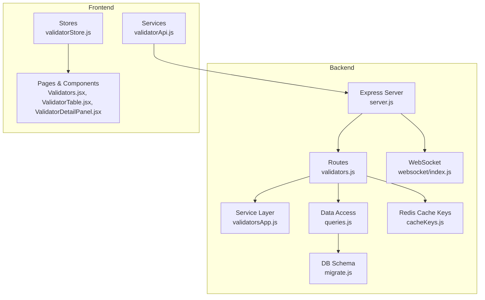
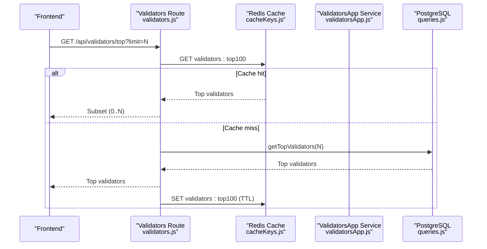
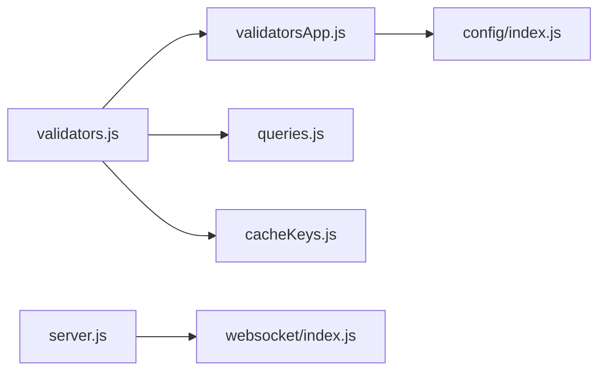
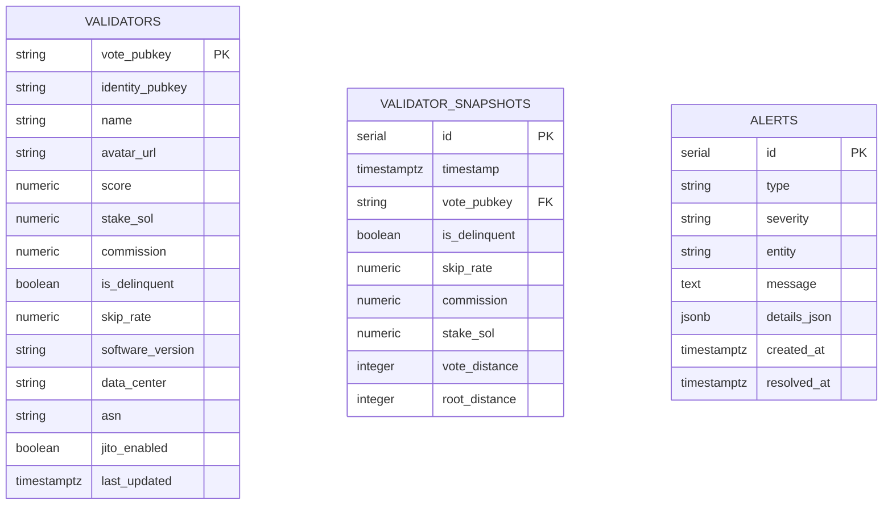

# Validators Routes

<cite>
**Referenced Files in This Document**
- [validators.js](file://backend/src/routes/validators.js)
- [validatorsApp.js](file://backend/src/services/validatorsApp.js)
- [queries.js](file://backend/src/models/queries.js)
- [cacheKeys.js](file://backend/src/models/cacheKeys.js)
- [index.js](file://backend/src/config/index.js)
- [index.js](file://backend/src/websocket/index.js)
- [server.js](file://backend/server.js)
- [validatorApi.js](file://frontend/src/services/validatorApi.js)
- [validatorStore.js](file://frontend/src/stores/validatorStore.js)
- [Validators.jsx](file://frontend/src/pages/Validators.jsx)
- [ValidatorTable.jsx](file://frontend/src/components/validators/ValidatorTable.jsx)
- [ValidatorDetailPanel.jsx](file://frontend/src/components/validators/ValidatorDetailPanel.jsx)
- [migrate.js](file://backend/src/models/migrate.js)
</cite>

## Table of Contents
1. [Introduction](#introduction)
2. [Project Structure](#project-structure)
3. [Core Components](#core-components)
4. [Architecture Overview](#architecture-overview)
5. [Detailed Component Analysis](#detailed-component-analysis)
6. [Dependency Analysis](#dependency-analysis)
7. [Performance Considerations](#performance-considerations)
8. [Troubleshooting Guide](#troubleshooting-guide)
9. [Conclusion](#conclusion)
10. [Appendices](#appendices)

## Introduction
This document provides comprehensive API documentation for validator monitoring endpoints under the backend route group /api/validators/*. It covers validator performance scoring, delinquency tracking, commission changes, voting history, and stake distribution. It also explains HTTP methods, URL patterns, request parameters, response schemas, data freshness guarantees, caching strategies, and WebSocket updates for real-time validator status changes.

## Project Structure
The validator endpoints are exposed via Express routes and backed by a PostgreSQL database with Redis caching. Data is normalized from the external Validators.app service and stored in the local database for persistence and fast retrieval.

**Diagram sources**
- [server.js:1-128](file://backend/server.js#L1-L128)
- [validators.js:1-112](file://backend/src/routes/validators.js#L1-L112)
- [validatorsApp.js:1-388](file://backend/src/services/validatorsApp.js#L1-L388)
- [queries.js:1-459](file://backend/src/models/queries.js#L1-L459)
- [cacheKeys.js:1-50](file://backend/src/models/cacheKeys.js#L1-L50)
- [index.js:1-81](file://backend/src/websocket/index.js#L1-L81)
- [migrate.js:1-160](file://backend/src/models/migrate.js#L1-L160)
- [validatorApi.js:1-8](file://frontend/src/services/validatorApi.js#L1-L8)
- [validatorStore.js:1-28](file://frontend/src/stores/validatorStore.js#L1-L28)
- [Validators.jsx:1-179](file://frontend/src/pages/Validators.jsx#L1-L179)
- [ValidatorTable.jsx](file://frontend/src/components/validators/ValidatorTable.jsx)
- [ValidatorDetailPanel.jsx](file://frontend/src/components/validators/ValidatorDetailPanel.jsx)

**Section sources**
- [server.js:1-128](file://backend/server.js#L1-L128)
- [validators.js:1-112](file://backend/src/routes/validators.js#L1-L112)
- [migrate.js:1-160](file://backend/src/models/migrate.js#L1-L160)

## Core Components
- Route layer: Defines /api/validators endpoints for top validators and individual validator details.
- Service layer: Integrates with Validators.app, applies rate limiting, normalizes data, and caches responses.
- Data access: Provides database operations for upserting validators, fetching top validators, and retrieving validator history.
- Caching: Uses Redis keys for validator lists and details with TTL values.
- Frontend integration: Calls the endpoints to render validator rankings and details.

**Section sources**
- [validators.js:13-109](file://backend/src/routes/validators.js#L13-L109)
- [validatorsApp.js:105-260](file://backend/src/services/validatorsApp.js#L105-L260)
- [queries.js:162-324](file://backend/src/models/queries.js#L162-L324)
- [cacheKeys.js:6-49](file://backend/src/models/cacheKeys.js#L6-L49)

## Architecture Overview
The validator endpoints follow a layered architecture:
- HTTP request enters the Express route.
- Route checks Redis cache for hot data.
- If cache misses, service layer fetches from Validators.app with rate limiting and normalization.
- Route falls back to database queries if external service fails.
- Responses are cached and returned to the client.
- Frontend consumes endpoints to render validator rankings and details.

**Diagram sources**
- [validators.js:17-46](file://backend/src/routes/validators.js#L17-L46)
- [cacheKeys.js:11](file://backend/src/models/cacheKeys.js#L11)
- [queries.js:227-235](file://backend/src/models/queries.js#L227-L235)

**Section sources**
- [validators.js:17-46](file://backend/src/routes/validators.js#L17-L46)
- [cacheKeys.js:11](file://backend/src/models/cacheKeys.js#L11)
- [queries.js:227-235](file://backend/src/models/queries.js#L227-L235)

## Detailed Component Analysis

### Endpoint: GET /api/validators/top
- Purpose: Retrieve top validators sorted by score.
- Method: GET
- URL: /api/validators/top
- Query Parameters:
  - limit (integer): Number of validators to return. Clamped between 1 and 100.
- Response: Array of validator objects (see Response Schema below).
- Behavior:
  - Attempts to read a cached list of top validators.
  - Falls back to database query if cache is unavailable or empty.
  - Returns an empty array if database is unavailable.
- Caching:
  - Cache key: validators:top100
  - TTL: 300 seconds (5 minutes)
- Data Freshness:
  - Cache TTL governs freshness.
  - Database query ensures eventual consistency.

Response Schema (validator item):
- vote_pubkey: string (primary key)
- identity_pubkey: string
- name: string
- avatar_url: string or null
- score: number (0–100)
- stake_sol: number (SOL)
- commission: number (percentage)
- is_delinquent: boolean
- skip_rate: number (proportion)
- software_version: string or null
- data_center: string or null
- asn: string or null
- jito_enabled: boolean
- updated_at: ISO timestamp (service-side normalization)

**Section sources**
- [validators.js:14-46](file://backend/src/routes/validators.js#L14-L46)
- [cacheKeys.js:11](file://backend/src/models/cacheKeys.js#L11)
- [queries.js:227-235](file://backend/src/models/queries.js#L227-L235)
- [validatorsApp.js:156-179](file://backend/src/services/validatorsApp.js#L156-L179)

### Endpoint: GET /api/validators/:votePubkey
- Purpose: Retrieve detailed information for a specific validator by vote public key.
- Method: GET
- URL: /api/validators/:votePubkey
- Path Parameter:
  - votePubkey: Validator vote account public key.
- Response: Single validator object (see Response Schema above).
- Behavior:
  - Attempts to read from Redis cache using validator-specific key.
  - If cache miss or failure, attempts to fetch from Validators.app service.
  - Falls back to database lookup if external service fails.
  - On success, writes the result to Redis cache.
  - On not found after all attempts, returns 404 with error payload.
- Caching:
  - Cache key pattern: validator:{votePubkey}
  - TTL: 300 seconds (5 minutes)
- Data Freshness:
  - Cache TTL governs freshness.
  - External service normalization ensures consistent schema.

Validation and Error Handling:
- Missing votePubkey returns 400 with error message.
- 404 if validator not found after all attempts.

**Section sources**
- [validators.js:49-109](file://backend/src/routes/validators.js#L49-L109)
- [cacheKeys.js:25](file://backend/src/models/cacheKeys.js#L25)
- [queries.js:242-249](file://backend/src/models/queries.js#L242-L249)
- [validatorsApp.js:216-229](file://backend/src/services/validatorsApp.js#L216-L229)

### Validator Score Calculation and Performance Metrics
- Score: Provided by external service and normalized to 0–100 scale.
- Performance metrics included:
  - stake_sol: Total active stake in SOL.
  - commission: Percentage fee charged by validator.
  - is_delinquent: Whether validator is delinquent.
  - skip_rate: Proportion of slots skipped (voting frequency).
  - software_version: Reported Solana software version.
  - data_center and asn: Infrastructure location metadata.
  - jito_enabled: Whether MEV (Jito) is enabled.
- Frontend rendering:
  - Score badges and bars reflect score ranges and display values.

Note: The internal scoring methodology is provided by the external service and normalized by the service layer.

**Section sources**
- [validatorsApp.js:156-179](file://backend/src/services/validatorsApp.js#L156-L179)
- [ValidatorScoreBadge.jsx:1-48](file://frontend/src/components/validators/ValidatorScoreBadge.jsx#L1-L48)
- [ValidatorDetailPanel.jsx:67-85](file://frontend/src/components/validators/ValidatorDetailPanel.jsx#L67-L85)

### Delinquency Tracking
- Delinquency detection:
  - is_delinquent flag indicates whether a validator is delinquent.
  - External service provides this status; normalized into local schema.
- Delinquency listing:
  - Service supports retrieving delinquent validators from cached or fresh data.
  - Fresh fetch pulls a larger set and filters delinquents.
- Frontend usage:
  - Delinquent validators are surfaced in dashboards and cards.

**Section sources**
- [validatorsApp.js:304-318](file://backend/src/services/validatorsApp.js#L304-L318)
- [queries.js:162-220](file://backend/src/models/queries.js#L162-L220)
- [ValidatorTable.jsx](file://frontend/src/components/validators/ValidatorTable.jsx)

### Commission Changes Monitoring
- Change detection:
  - Service compares current and previously cached validator sets to detect commission changes.
  - Produces a list of validators whose commission changed, including old/new values and direction.
- Use cases:
  - Track validator fee adjustments over time.
  - Alert or notify stakeholders about significant changes.

**Section sources**
- [validatorsApp.js:268-298](file://backend/src/services/validatorsApp.js#L268-L298)

### Voting History and Stake Distribution
- Historical snapshots:
  - Database table validator_snapshots captures periodic snapshots including is_delinquent, skip_rate, commission, stake_sol, vote_distance, root_distance.
- Retrieval:
  - Service exposes getValidatorHistory(votePubkey, range) to query snapshots for a given time range.
- Frontend integration:
  - The frontend page and components consume top validators and details; historical charts can be built from snapshot data.

**Section sources**
- [queries.js:282-324](file://backend/src/models/queries.js#L282-L324)
- [migrate.js:66-78](file://backend/src/models/migrate.js#L66-L78)

### Real-Time Updates via WebSocket
- WebSocket setup:
  - Socket.io is initialized and configured with CORS settings.
  - Connection events and broadcasting utilities are available.
- Real-time usage:
  - While validator endpoints are read-only, the WebSocket infrastructure is ready to broadcast live updates (e.g., validator status changes) to connected clients.

**Section sources**
- [server.js:39-46](file://backend/server.js#L39-L46)
- [index.js:13-81](file://backend/src/websocket/index.js#L13-L81)

## Dependency Analysis
The validator routes depend on:
- Route layer: validators.js
- Service layer: validatorsApp.js (external API integration, rate limiting, normalization)
- Data access: queries.js (database operations)
- Caching: cacheKeys.js (Redis key naming and TTL)
- Configuration: config/index.js (Validators.app base URL and API key)
- WebSocket: websocket/index.js (broadcasting utilities)

**Diagram sources**
- [validators.js:1-112](file://backend/src/routes/validators.js#L1-L112)
- [validatorsApp.js:1-388](file://backend/src/services/validatorsApp.js#L1-L388)
- [queries.js:1-459](file://backend/src/models/queries.js#L1-L459)
- [cacheKeys.js:1-50](file://backend/src/models/cacheKeys.js#L1-L50)
- [index.js:1-68](file://backend/src/config/index.js#L1-L68)
- [server.js:1-128](file://backend/server.js#L1-L128)
- [index.js:1-81](file://backend/src/websocket/index.js#L1-L81)

**Section sources**
- [validators.js:1-112](file://backend/src/routes/validators.js#L1-L112)
- [validatorsApp.js:1-388](file://backend/src/services/validatorsApp.js#L1-L388)
- [queries.js:1-459](file://backend/src/models/queries.js#L1-L459)
- [cacheKeys.js:1-50](file://backend/src/models/cacheKeys.js#L1-L50)
- [index.js:1-68](file://backend/src/config/index.js#L1-L68)
- [server.js:1-128](file://backend/server.js#L1-L128)
- [index.js:1-81](file://backend/src/websocket/index.js#L1-L81)

## Performance Considerations
- Caching:
  - Top validators list cached with 5-minute TTL.
  - Individual validator details cached with 5-minute TTL.
  - Redis availability is optional; routes fall back to database.
- Rate limiting:
  - Validators.app requests are rate-limited to 40 requests per 5 minutes with queueing and backpressure.
- Data freshness:
  - Top list TTL: 5 minutes.
  - Validator detail TTL: 5 minutes.
  - External service normalization occurs in service layer.
- Database:
  - Queries use parameterized statements and appropriate indexes on score and stake.

**Section sources**
- [cacheKeys.js:43-48](file://backend/src/models/cacheKeys.js#L43-L48)
- [validators.js:22-42](file://backend/src/routes/validators.js#L22-L42)
- [validatorsApp.js:9-99](file://backend/src/services/validatorsApp.js#L9-L99)
- [queries.js:227-235](file://backend/src/models/queries.js#L227-L235)

## Troubleshooting Guide
Common issues and resolutions:
- Missing votePubkey parameter:
  - Symptom: 400 error on validator detail endpoint.
  - Resolution: Ensure votePubkey is provided in path.
- Validator not found:
  - Symptom: 404 error after attempting Redis, external service, and database fallback.
  - Resolution: Verify votePubkey correctness; check database records.
- External service unconfigured or failing:
  - Symptom: Logs indicate missing API key or request errors.
  - Resolution: Configure VALIDATORS_APP_API_KEY and VALIDATORS_APP_BASE_URL; retry.
- Redis unavailable:
  - Symptom: Cache misses; route falls back to database.
  - Resolution: Ensure Redis is reachable; monitor cache hits.
- Rate limit warnings:
  - Symptom: Console warnings about remaining requests and wait times.
  - Resolution: Reduce request frequency or increase limits externally.

Operational checks:
- Health endpoint: GET /api/health to confirm backend status.
- WebSocket connections: Monitor connection/disconnect logs.

**Section sources**
- [validators.js:56-96](file://backend/src/routes/validators.js#L56-L96)
- [validatorsApp.js:117-148](file://backend/src/services/validatorsApp.js#L117-L148)
- [validatorsApp.js:84-88](file://backend/src/services/validatorsApp.js#L84-L88)
- [server.js:61-69](file://backend/server.js#L61-L69)
- [index.js:16-30](file://backend/src/websocket/index.js#L16-L30)

## Conclusion
The validator monitoring endpoints provide efficient, cached access to top-performing validators and detailed validator profiles. They integrate with an external service for normalized data, maintain robust fallbacks to the database, and expose historical snapshot capabilities for deeper analysis. The WebSocket infrastructure is ready to support future real-time updates.

## Appendices

### API Reference Summary
- GET /api/validators/top
  - Query: limit (1–100)
  - Response: Array of validator objects
  - Cache: validators:top100 (5 min TTL)
- GET /api/validators/:votePubkey
  - Path: votePubkey
  - Response: Single validator object
  - Cache: validator:{pubkey} (5 min TTL)

### Example Workflows

#### Query Top Validators by Score
- Call: GET /api/validators/top?limit=50
- Frontend integration: fetchTopValidators(50) → renders ValidatorTable

**Section sources**
- [validatorApi.js:3-4](file://frontend/src/services/validatorApi.js#L3-L4)
- [Validators.jsx:24-33](file://frontend/src/pages/Validators.jsx#L24-L33)
- [ValidatorTable.jsx](file://frontend/src/components/validators/ValidatorTable.jsx)

#### Retrieve Detailed Validator Profile
- Call: GET /api/validators/{votePubkey}
- Frontend integration: fetchValidatorDetail(pubkey) → renders ValidatorDetailPanel

**Section sources**
- [validatorApi.js:6-7](file://frontend/src/services/validatorApi.js#L6-L7)
- [Validators.jsx:45-51](file://frontend/src/pages/Validators.jsx#L45-L51)
- [ValidatorDetailPanel.jsx:186-217](file://frontend/src/components/validators/ValidatorDetailPanel.jsx#L186-L217)

#### Monitor Commission Changes Over Time
- Use service method to compare current vs cached validator sets.
- Detect changes and surface increases/decreases.

**Section sources**
- [validatorsApp.js:268-298](file://backend/src/services/validatorsApp.js#L268-L298)

### Data Model Overview

**Diagram sources**
- [migrate.js:44-60](file://backend/src/models/migrate.js#L44-L60)
- [migrate.js:66-78](file://backend/src/models/migrate.js#L66-L78)
- [migrate.js:80-94](file://backend/src/models/migrate.js#L80-L94)