# Server Setup & Configuration

<cite>
**Referenced Files in This Document**
- [server.js](file://backend/server.js)
- [config/index.js](file://backend/src/config/index.js)
- [websocket/index.js](file://backend/src/websocket/index.js)
- [errorHandler.js](file://backend/src/middleware/errorHandler.js)
- [routes/index.js](file://backend/src/routes/index.js)
- [jobs/criticalPoller.js](file://backend/src/jobs/criticalPoller.js)
- [jobs/routinePoller.js](file://backend/src/jobs/routinePoller.js)
- [models/db.js](file://backend/src/models/db.js)
- [models/redis.js](file://backend/src/models/redis.js)
- [package.json](file://backend/package.json)
</cite>

## Table of Contents
1. [Introduction](#introduction)
2. [Project Structure](#project-structure)
3. [Core Components](#core-components)
4. [Architecture Overview](#architecture-overview)
5. [Detailed Component Analysis](#detailed-component-analysis)
6. [Dependency Analysis](#dependency-analysis)
7. [Performance Considerations](#performance-considerations)
8. [Troubleshooting Guide](#troubleshooting-guide)
9. [Conclusion](#conclusion)

## Introduction
This document explains the InfraWatch server setup and configuration, focusing on the main entry point, Express application initialization, HTTP server creation, and Socket.io WebSocket server setup. It covers middleware configuration (security headers, compression, CORS, JSON parsing), configuration management and environment variable handling, security considerations, server startup procedures, graceful shutdown handling, health check endpoint implementation, and the global Socket.io instance availability to other modules.

## Project Structure
The backend server is organized around a single entry point that initializes Express, creates an HTTP server, sets up Socket.io, applies middleware, mounts routes, and starts background jobs. Configuration is centralized and environment-aware, while data persistence and caching are handled by PostgreSQL and Redis with graceful failure handling.

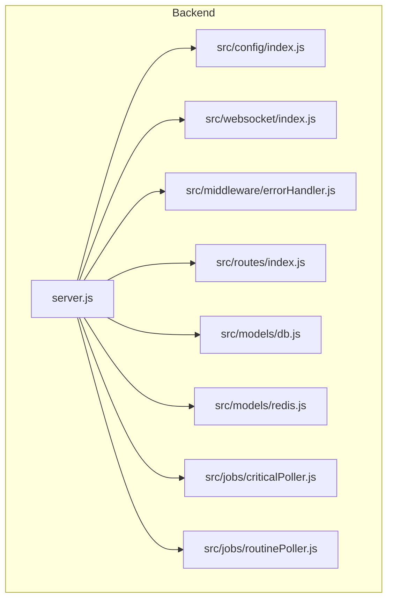

**Diagram sources**
- [server.js:1-128](file://backend/server.js#L1-L128)
- [config/index.js:1-68](file://backend/src/config/index.js#L1-L68)
- [websocket/index.js:1-81](file://backend/src/websocket/index.js#L1-L81)
- [errorHandler.js:1-127](file://backend/src/middleware/errorHandler.js#L1-L127)
- [routes/index.js:1-24](file://backend/src/routes/index.js#L1-L24)
- [jobs/criticalPoller.js:1-108](file://backend/src/jobs/criticalPoller.js#L1-L108)
- [jobs/routinePoller.js:1-116](file://backend/src/jobs/routinePoller.js#L1-L116)
- [models/db.js:1-98](file://backend/src/models/db.js#L1-L98)
- [models/redis.js:1-161](file://backend/src/models/redis.js#L1-L161)

**Section sources**
- [server.js:1-128](file://backend/server.js#L1-L128)
- [package.json:1-36](file://backend/package.json#L1-L36)

## Core Components
- Express application initialization and middleware pipeline
- HTTP server creation and Socket.io WebSocket server setup
- Configuration management with environment variables and defaults
- Health check endpoint and graceful shutdown handling
- Global Socket.io instance made available to other modules
- Background job orchestration for critical and routine polling

**Section sources**
- [server.js:33-107](file://backend/server.js#L33-L107)
- [config/index.js:27-65](file://backend/src/config/index.js#L27-L65)
- [websocket/index.js:13-33](file://backend/src/websocket/index.js#L13-L33)

## Architecture Overview
The server composes multiple subsystems:
- Configuration loader reads environment variables and constructs runtime settings
- Express app applies security and performance middleware, JSON parsing, and CORS
- Routes mount API endpoints under /api
- Socket.io handles real-time events and broadcasts
- Data layer initializes PostgreSQL and Redis connections
- Jobs periodically collect metrics and emit updates via WebSocket

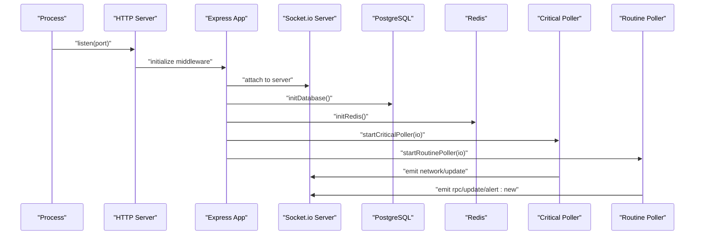

**Diagram sources**
- [server.js:84-107](file://backend/server.js#L84-L107)
- [jobs/criticalPoller.js:21-103](file://backend/src/jobs/criticalPoller.js#L21-L103)
- [jobs/routinePoller.js:20-111](file://backend/src/jobs/routinePoller.js#L20-L111)
- [models/db.js:15-47](file://backend/src/models/db.js#L15-L47)
- [models/redis.js:16-68](file://backend/src/models/redis.js#L16-L68)

## Detailed Component Analysis

### Express Application Initialization and Middleware
- Security headers: Helmet is applied to set secure defaults for HTTP headers.
- Compression: Compression middleware reduces payload sizes for performance.
- CORS: Cross-origin policy is configured from environment variables.
- JSON parsing: Body parsing for JSON and URL-encoded requests is enabled.
- Error handling: Global error handler and 404 handler are mounted after routes.

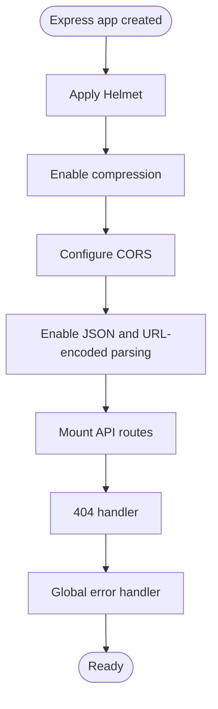

**Diagram sources**
- [server.js:34-78](file://backend/server.js#L34-L78)

**Section sources**
- [server.js:52-59](file://backend/server.js#L52-L59)
- [server.js:74-78](file://backend/server.js#L74-L78)
- [errorHandler.js:44-109](file://backend/src/middleware/errorHandler.js#L44-L109)

### HTTP Server Creation and Socket.io Setup
- An HTTP server is created from the Express app.
- Socket.io is instantiated with CORS configuration aligned to the Express CORS settings.
- The Socket.io instance is stored in the Express app registry for global access.
- WebSocket handlers are registered to track connections and handle errors.

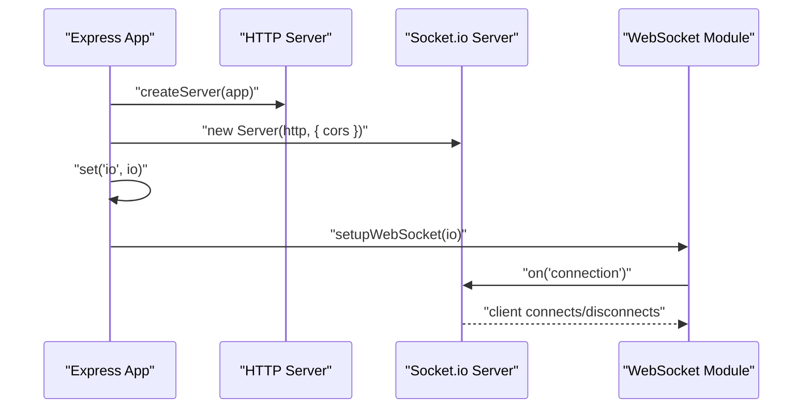

**Diagram sources**
- [server.js:36-49](file://backend/server.js#L36-L49)
- [server.js:80-81](file://backend/server.js#L80-L81)
- [websocket/index.js:13-33](file://backend/src/websocket/index.js#L13-L33)

**Section sources**
- [server.js:36-49](file://backend/server.js#L36-L49)
- [server.js:48-49](file://backend/server.js#L48-L49)
- [websocket/index.js:13-33](file://backend/src/websocket/index.js#L13-L33)

### Configuration Management and Environment Variables
- Environment variables are loaded from a .env file if present; otherwise defaults are used.
- Centralized configuration includes server port, environment, Solana RPC URLs, validators.app API keys, database URL, Redis URL, polling intervals, and CORS origin.
- Helper utilities parse integers with fallbacks and construct Helius RPC URLs from API keys.

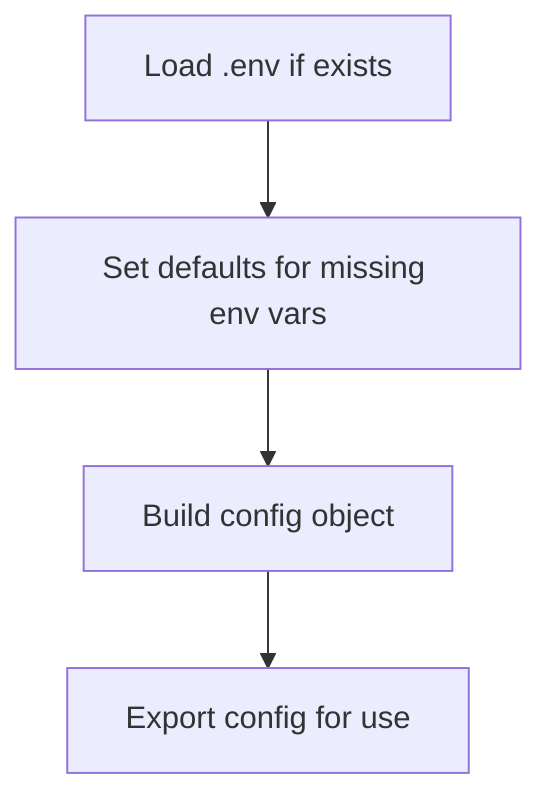

**Diagram sources**
- [config/index.js:8-13](file://backend/src/config/index.js#L8-L13)
- [config/index.js:27-65](file://backend/src/config/index.js#L27-L65)

**Section sources**
- [config/index.js:8-13](file://backend/src/config/index.js#L8-L13)
- [config/index.js:15-19](file://backend/src/config/index.js#L15-L19)
- [config/index.js:21-25](file://backend/src/config/index.js#L21-L25)
- [config/index.js:27-65](file://backend/src/config/index.js#L27-L65)

### Health Check Endpoint
- A GET endpoint at /api/health returns server status, timestamp, uptime, and environment.
- This endpoint is mounted before route registration to ensure it is always accessible.

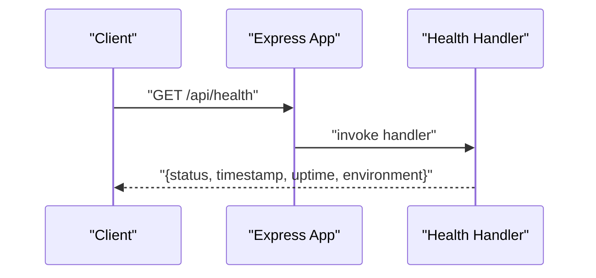

**Diagram sources**
- [server.js:61-69](file://backend/server.js#L61-L69)

**Section sources**
- [server.js:61-69](file://backend/server.js#L61-L69)

### Graceful Shutdown Handling
- The server listens for SIGTERM and SIGINT signals.
- On receipt, the HTTP server is closed and the process exits cleanly.

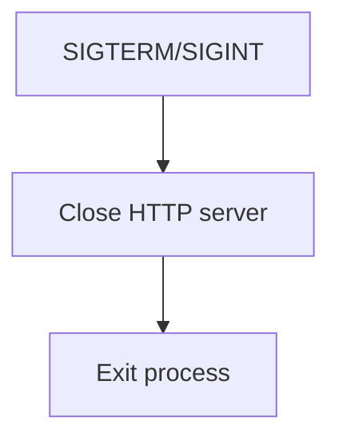

**Diagram sources**
- [server.js:109-124](file://backend/server.js#L109-L124)

**Section sources**
- [server.js:109-124](file://backend/server.js#L109-L124)

### Global Socket.io Instance Availability
- The Socket.io instance is attached to the Express app registry and exported for use by other modules.
- A dedicated WebSocket module provides helper functions to broadcast events and manage connection counts.

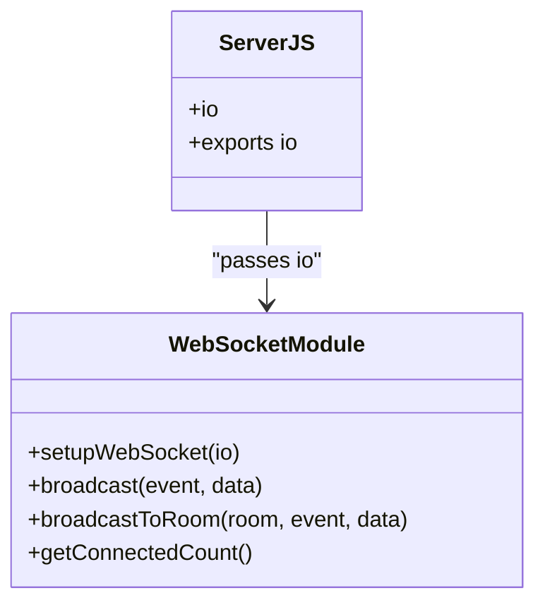

**Diagram sources**
- [server.js:48-49](file://backend/server.js#L48-L49)
- [server.js:126-127](file://backend/server.js#L126-L127)
- [websocket/index.js:13-80](file://backend/src/websocket/index.js#L13-L80)

**Section sources**
- [server.js:48-49](file://backend/server.js#L48-L49)
- [server.js:126-127](file://backend/server.js#L126-L127)
- [websocket/index.js:13-80](file://backend/src/websocket/index.js#L13-L80)

### Background Jobs and Real-time Updates
- Critical poller runs every 30 seconds, collects network snapshot and RPC health data, writes to PostgreSQL and Redis, and emits updates via WebSocket.
- Routine poller runs every 5 minutes, fetches validator data, detects commission changes, writes snapshots, updates caches, and emits alerts via WebSocket.

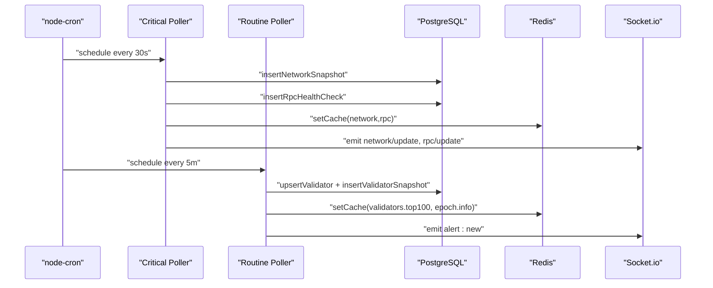

**Diagram sources**
- [jobs/criticalPoller.js:21-103](file://backend/src/jobs/criticalPoller.js#L21-L103)
- [jobs/routinePoller.js:20-111](file://backend/src/jobs/routinePoller.js#L20-L111)

**Section sources**
- [jobs/criticalPoller.js:21-103](file://backend/src/jobs/criticalPoller.js#L21-L103)
- [jobs/routinePoller.js:20-111](file://backend/src/jobs/routinePoller.js#L20-L111)

### Data Layer Initialization
- PostgreSQL pool is lazily initialized with connection limits and timeouts; queries require prior initialization.
- Redis client is lazily initialized with retry strategy and connection lifecycle events; operations are guarded by connectivity checks.

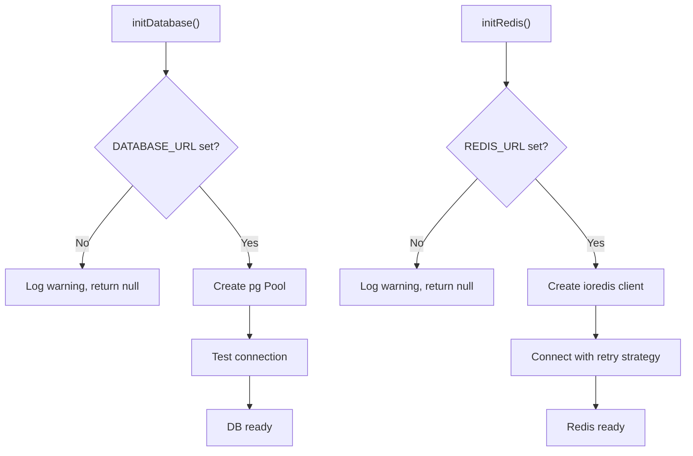

**Diagram sources**
- [models/db.js:15-47](file://backend/src/models/db.js#L15-L47)
- [models/redis.js:16-68](file://backend/src/models/redis.js#L16-L68)

**Section sources**
- [models/db.js:15-47](file://backend/src/models/db.js#L15-L47)
- [models/redis.js:16-68](file://backend/src/models/redis.js#L16-L68)

## Dependency Analysis
The server depends on Express, HTTP, Socket.io, Helmet, compression, CORS, and environment-driven configuration. Data persistence relies on PostgreSQL and Redis, while jobs depend on services and models.

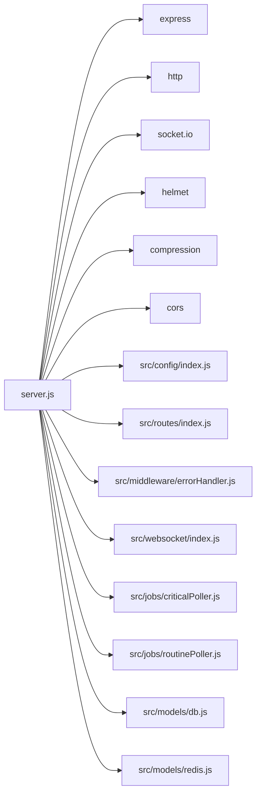

**Diagram sources**
- [server.js:6-23](file://backend/server.js#L6-L23)
- [package.json:22-34](file://backend/package.json#L22-L34)

**Section sources**
- [server.js:6-23](file://backend/server.js#L6-L23)
- [package.json:22-34](file://backend/package.json#L22-L34)

## Performance Considerations
- Compression reduces payload sizes for static and dynamic responses.
- Socket.io emits only essential updates; consider batching or throttling if traffic increases.
- Database and Redis operations are wrapped in try/catch blocks to prevent failures from crashing the server; ensure appropriate logging and monitoring.
- Cron scheduling ensures predictable intervals for polling; adjust intervals based on infrastructure capacity.

[No sources needed since this section provides general guidance]

## Troubleshooting Guide
- Health check endpoint: Verify the /api/health route responds with server status and environment details.
- CORS issues: Confirm the configured origin matches the frontend origin and credentials are enabled.
- Database connectivity: Check DATABASE_URL and logs for connection errors; the pool tests connectivity on initialization.
- Redis connectivity: Verify REDIS_URL and watch for connection/retry logs; operations are guarded by connectivity checks.
- Graceful shutdown: Ensure SIGTERM/SIGINT signals are received and the server closes HTTP connections cleanly.
- WebSocket events: Use the WebSocket module helpers to broadcast and debug client connections.

**Section sources**
- [server.js:61-69](file://backend/server.js#L61-L69)
- [config/index.js:61-64](file://backend/src/config/index.js#L61-L64)
- [models/db.js:20-44](file://backend/src/models/db.js#L20-L44)
- [models/redis.js:21-61](file://backend/src/models/redis.js#L21-L61)
- [server.js:109-124](file://backend/server.js#L109-L124)
- [websocket/index.js:13-33](file://backend/src/websocket/index.js#L13-L33)

## Conclusion
The InfraWatch server integrates Express, Socket.io, and environment-driven configuration to deliver a robust, secure, and scalable backend. Middleware ensures security and performance, while graceful shutdown and health checks improve reliability. The global Socket.io instance enables real-time updates across modules, and background jobs keep the system synchronized with Solana network data. Proper configuration and monitoring of database and Redis connections are essential for production stability.