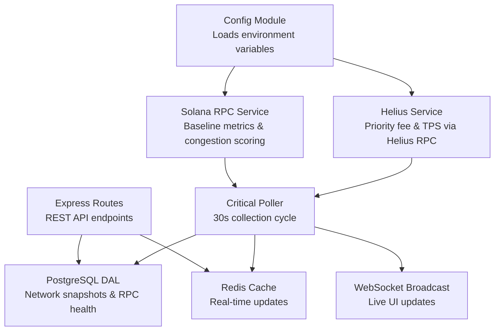
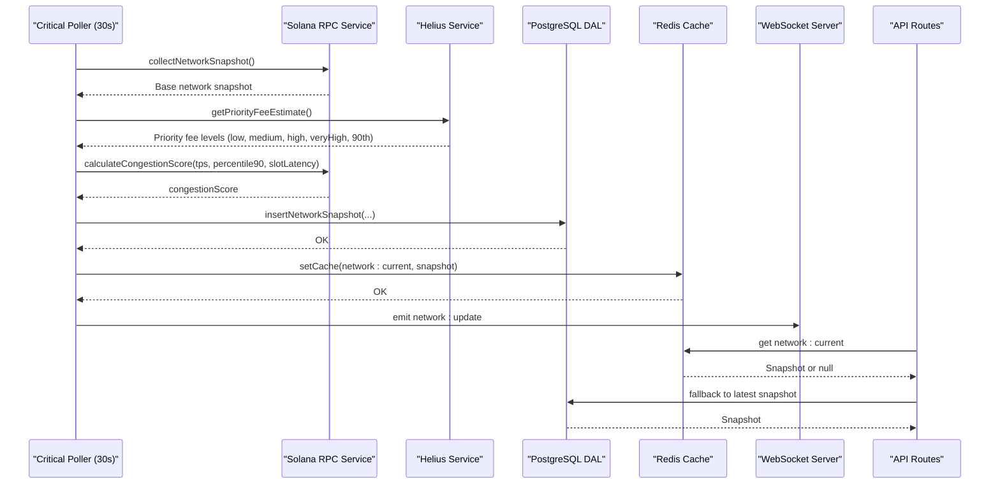
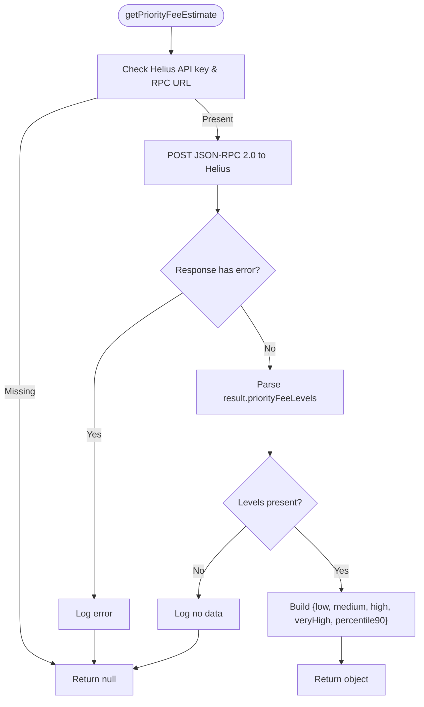
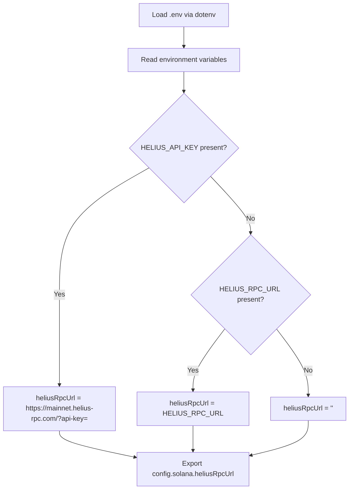
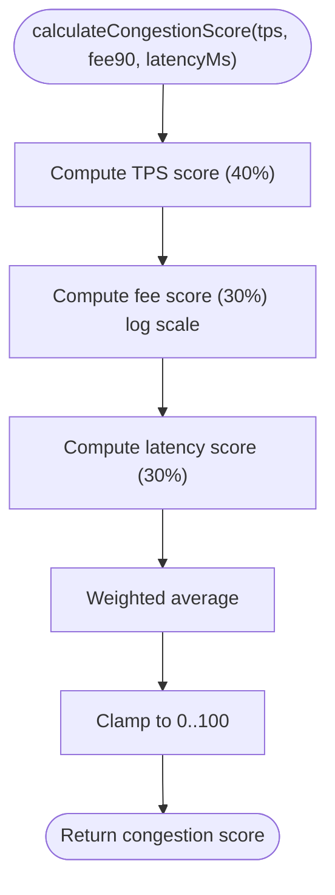
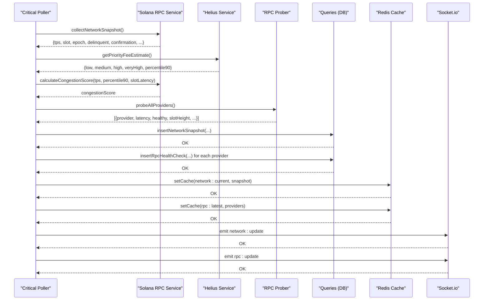
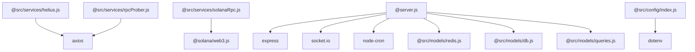

# Helius Integration Service

<cite>
**Referenced Files in This Document**
- [helius.js](file://backend/src/services/helius.js)
- [config/index.js](file://backend/src/config/index.js)
- [solanaRpc.js](file://backend/src/services/solanaRpc.js)
- [criticalPoller.js](file://backend/src/jobs/criticalPoller.js)
- [rpcProber.js](file://backend/src/services/rpcProber.js)
- [network.js](file://backend/src/routes/network.js)
- [rpc.js](file://backend/src/routes/rpc.js)
- [queries.js](file://backend/src/models/queries.js)
- [redis.js](file://backend/src/models/redis.js)
- [cacheKeys.js](file://backend/src/models/cacheKeys.js)
- [server.js](file://backend/server.js)
- [package.json](file://backend/package.json)
</cite>

## Table of Contents
1. [Introduction](#introduction)
2. [Project Structure](#project-structure)
3. [Core Components](#core-components)
4. [Architecture Overview](#architecture-overview)
5. [Detailed Component Analysis](#detailed-component-analysis)
6. [Dependency Analysis](#dependency-analysis)
7. [Performance Considerations](#performance-considerations)
8. [Troubleshooting Guide](#troubleshooting-guide)
9. [Conclusion](#conclusion)

## Introduction
This document describes the Helius integration service that enhances Solana RPC data collection for InfraWatch. It focuses on API integration patterns, data enrichment capabilities, and priority fee analysis functionality. The Helius service augments the core Solana RPC metrics with priority fee estimates and enhanced TPS data, enabling comprehensive network congestion analysis and real-time monitoring.

## Project Structure
The Helius integration spans several backend modules:
- Configuration loading and environment variable handling
- Helius service for RPC requests and response parsing
- Solana RPC service for baseline metrics and congestion scoring
- Job schedulers orchestrating periodic data collection
- Data persistence and caching layers
- API routes exposing network and RPC provider status

**Diagram sources**
- [config/index.js:1-68](file://backend/src/config/index.js#L1-L68)
- [helius.js:1-188](file://backend/src/services/helius.js#L1-L188)
- [solanaRpc.js:1-340](file://backend/src/services/solanaRpc.js#L1-L340)
- [criticalPoller.js:1-108](file://backend/src/jobs/criticalPoller.js#L1-L108)
- [queries.js:1-459](file://backend/src/models/queries.js#L1-L459)
- [redis.js:1-161](file://backend/src/models/redis.js#L1-L161)
- [server.js:1-128](file://backend/server.js#L1-L128)

**Section sources**
- [server.js:1-128](file://backend/server.js#L1-L128)
- [package.json:1-36](file://backend/package.json#L1-L36)

## Core Components
- Helius Service: Provides priority fee estimates, enhanced TPS data, and account information via Helius RPC endpoints. Implements robust error handling and graceful degradation when configuration is missing.
- Solana RPC Service: Collects baseline network metrics (health, TPS, slot info, epoch info, delinquent validators, confirmation time) and calculates a congestion score combining TPS, priority fees, and slot latency.
- Critical Poller: Orchestrates the 30-second collection cycle, integrating Helius priority fees into congestion scoring, probing RPC providers, persisting data, updating caches, and broadcasting updates via WebSocket.
- Data Access Layer: Writes network snapshots and RPC health checks to PostgreSQL and exposes retrieval functions for API routes.
- Caching Layer: Uses Redis for fast reads of current network status and RPC provider health, with TTL-based invalidation.
- API Routes: Serve current network status and historical data, and provide RPC provider health with rolling statistics and recommendations.

**Section sources**
- [helius.js:1-188](file://backend/src/services/helius.js#L1-L188)
- [solanaRpc.js:221-328](file://backend/src/services/solanaRpc.js#L221-L328)
- [criticalPoller.js:21-103](file://backend/src/jobs/criticalPoller.js#L21-L103)
- [queries.js:13-84](file://backend/src/models/queries.js#L13-L84)
- [redis.js:75-112](file://backend/src/models/redis.js#L75-L112)
- [network.js:17-79](file://backend/src/routes/network.js#L17-L79)

## Architecture Overview
The Helius integration follows a scheduled polling architecture:
- Configuration determines whether Helius is enabled (API key and RPC URL).
- Every 30 seconds, the Critical Poller collects a network snapshot from Solana RPC, optionally enriches it with Helius priority fees, probes RPC providers, writes to PostgreSQL, updates Redis cache, and broadcasts via WebSocket.
- API routes serve cached or database-backed data with a cache-first strategy.

**Diagram sources**
- [criticalPoller.js:32-94](file://backend/src/jobs/criticalPoller.js#L32-L94)
- [solanaRpc.js:275-328](file://backend/src/services/solanaRpc.js#L275-L328)
- [helius.js:13-70](file://backend/src/services/helius.js#L13-L70)
- [queries.js:27-48](file://backend/src/models/queries.js#L27-L48)
- [redis.js:99-112](file://backend/src/models/redis.js#L99-L112)
- [network.js:17-79](file://backend/src/routes/network.js#L17-L79)

## Detailed Component Analysis

### Helius Service
The Helius service encapsulates RPC interactions with the Helius endpoint:
- Authentication: Uses either a constructed Helius RPC URL (from API key) or a user-provided RPC URL. Requests are sent as JSON-RPC 2.0 POST requests with a 10-second timeout.
- Priority Fee Estimation: Calls the getPriorityFeeEstimate method with includeAllPriorityFeeLevels enabled. Parses the response to extract low, medium, high, veryHigh, and percentile90 fee levels. Returns null on configuration absence or errors.
- Enhanced TPS: Calls getRecentPerformanceSamples to compute TPS from the most recent sample. Returns null if no data or errors occur.
- Account Information: Calls getAccountInfo with jsonParsed encoding for structured account data.
- Error Handling: Logs RPC errors and general exceptions, returning null to signal failure without crashing the system.

**Diagram sources**
- [helius.js:13-70](file://backend/src/services/helius.js#L13-L70)

**Section sources**
- [helius.js:13-70](file://backend/src/services/helius.js#L13-L70)
- [helius.js:78-128](file://backend/src/services/helius.js#L78-L128)
- [helius.js:135-172](file://backend/src/services/helius.js#L135-L172)
- [helius.js:178-180](file://backend/src/services/helius.js#L178-L180)

### Configuration and Authentication
Configuration supports two modes:
- Helius API key mode: Constructs the RPC URL using the API key, enabling seamless authentication.
- Helius RPC URL mode: Uses a provided RPC URL directly.

Environment variables:
- HELIUS_API_KEY: Enables Helius API key mode and constructs the RPC URL.
- HELIUS_RPC_URL: Overrides the RPC URL when an API key is not provided.
- SOLANA_RPC_URL: Main Solana RPC endpoint used by the Solana RPC service.
- DATABASE_URL: PostgreSQL connection string for data persistence.
- REDIS_URL: Redis connection string for caching.
- PORT, NODE_ENV: Server configuration.
- CORS_ORIGIN: Allowed origins for cross-origin requests.

**Diagram sources**
- [config/index.js:8-25](file://backend/src/config/index.js#L8-L25)

**Section sources**
- [config/index.js:21-37](file://backend/src/config/index.js#L21-L37)

### Priority Fee Analysis and Congestion Scoring
Priority fee percentile calculation:
- The Helius service returns low, medium, high, veryHigh, and percentile90 fee levels. The percentile90 is derived from the high level in the current implementation.
- The Solana RPC service computes a congestion score combining three factors:
  - TPS component (40%): Linearly decreasing from 100 at 500 TPS to 0 at 3000 TPS.
  - Priority fee component (30%): Logarithmic scaling from 0 at ≤1000 microlamports to 100 at ≥100000 microlamports.
  - Slot latency component (30%): Linearly increasing from 0 at ≤450ms to 100 at ≥1000ms.
- The final score is a weighted average clamped to 0–100.

**Diagram sources**
- [solanaRpc.js:228-268](file://backend/src/services/solanaRpc.js#L228-L268)

**Section sources**
- [solanaRpc.js:228-268](file://backend/src/services/solanaRpc.js#L228-L268)
- [helius.js:59-65](file://backend/src/services/helius.js#L59-L65)

### Integration Workflow Between Helius and Solana RPC Services
The Critical Poller coordinates data collection:
- Collects a base network snapshot from the Solana RPC service.
- Optionally retrieves priority fee estimates from the Helius service.
- Recomputes the congestion score using the 90th percentile fee level.
- Probes RPC providers, persists data, updates caches, and broadcasts updates.

**Diagram sources**
- [criticalPoller.js:32-94](file://backend/src/jobs/criticalPoller.js#L32-L94)
- [solanaRpc.js:275-328](file://backend/src/services/solanaRpc.js#L275-L328)
- [helius.js:13-70](file://backend/src/services/helius.js#L13-L70)
- [rpcProber.js:140-180](file://backend/src/services/rpcProber.js#L140-L180)
- [queries.js:27-118](file://backend/src/models/queries.js#L27-L118)
- [redis.js:99-112](file://backend/src/models/redis.js#L99-L112)

**Section sources**
- [criticalPoller.js:21-103](file://backend/src/jobs/criticalPoller.js#L21-L103)
- [solanaRpc.js:275-328](file://backend/src/services/solanaRpc.js#L275-L328)
- [helius.js:13-70](file://backend/src/services/helius.js#L13-L70)
- [rpcProber.js:140-180](file://backend/src/services/rpcProber.js#L140-L180)

### API Configuration, Request Throttling, Retry Logic, and Data Transformation
- API Configuration:
  - Helius API key mode: Automatically constructs the RPC URL with the API key.
  - Helius RPC URL mode: Uses the provided URL.
  - Environment variables control ports, CORS, database, and Redis connectivity.
- Request Throttling:
  - Helius requests use a 10-second timeout.
  - RPC provider probing uses a 5-second timeout per provider.
  - Critical Poller runs every 30 seconds to balance freshness and resource usage.
- Retry Logic:
  - Redis client uses exponential backoff and a retry strategy for reconnections.
  - Database operations are wrapped in try/catch blocks to avoid crashes on transient failures.
  - RPC provider probing uses Promise.allSettled to continue despite individual failures.
- Data Transformation:
  - Network route transforms cached or database snapshots to the API response format.
  - RPC route merges latest DB results with rolling statistics computed from probe history.

**Section sources**
- [config/index.js:21-37](file://backend/src/config/index.js#L21-L37)
- [helius.js:37-43](file://backend/src/services/helius.js#L37-L43)
- [rpcProber.js:75-134](file://backend/src/services/rpcProber.js#L75-L134)
- [redis.js:28-35](file://backend/src/models/redis.js#L28-L35)
- [network.js:27-75](file://backend/src/routes/network.js#L27-L75)
- [rpc.js:47-84](file://backend/src/routes/rpc.js#L47-L84)

## Dependency Analysis
External dependencies relevant to Helius integration:
- axios: Used for HTTP requests to Helius and RPC provider endpoints.
- @solana/web3.js: Used by the Solana RPC service for baseline metrics.
- node-cron: Schedules critical and routine polling jobs.
- express, socket.io: Web framework and WebSocket server for API and live updates.
- pg, ioredis: PostgreSQL and Redis clients for persistence and caching.
- dotenv: Loads environment variables from .env.

**Diagram sources**
- [helius.js:6](file://backend/src/services/helius.js#L6)
- [rpcProber.js:6](file://backend/src/services/rpcProber.js#L6)
- [solanaRpc.js:6](file://backend/src/services/solanaRpc.js#L6)
- [server.js:6](file://backend/server.js#L6)
- [config/index.js:10](file://backend/src/config/index.js#L10)
- [package.json:22-34](file://backend/package.json#L22-L34)

**Section sources**
- [package.json:22-34](file://backend/package.json#L22-L34)

## Performance Considerations
- Concurrency: The Critical Poller uses Promise.all for parallel collection of network metrics, reducing total collection time.
- Caching: Redis cache reduces database load and latency for frequent reads of current network status and RPC provider health.
- Graceful Degradation: Missing configuration or transient failures do not crash the system; null responses are handled safely.
- Timeouts: Reasonable timeouts prevent long blocking on slow or failing endpoints.
- Rolling Statistics: RPC prober maintains rolling latency percentiles to provide stable recommendations.

[No sources needed since this section provides general guidance]

## Troubleshooting Guide
Common issues and resolutions:
- Missing Helius API key or RPC URL:
  - Symptom: Priority fee data is null; congestion score remains unset.
  - Resolution: Set HELIUS_API_KEY or HELIUS_RPC_URL in the environment.
- Network errors from Helius:
  - Symptom: Console logs indicate RPC errors; null returned.
  - Resolution: Verify the RPC URL and network connectivity; retry later.
- Database unavailability:
  - Symptom: DB insert operations logged as warnings; API may return startup messages.
  - Resolution: Check DATABASE_URL and database health; ensure migrations are applied.
- Redis unavailability:
  - Symptom: Cache set operations logged as warnings; API may fall back to DB.
  - Resolution: Check REDIS_URL and Redis server status; confirm retry strategy is functioning.
- Slow or failing RPC providers:
  - Symptom: Providers marked unhealthy with errors; rolling stats degraded.
  - Resolution: Review provider endpoints and network conditions; consider switching to a premium provider.

**Section sources**
- [helius.js:45-48](file://backend/src/services/helius.js#L45-L48)
- [helius.js:66-69](file://backend/src/services/helius.js#L66-L69)
- [criticalPoller.js:61-63](file://backend/src/jobs/criticalPoller.js#L61-L63)
- [criticalPoller.js:84-86](file://backend/src/jobs/criticalPoller.js#L84-L86)
- [redis.js:75-89](file://backend/src/models/redis.js#L75-L89)
- [rpcProber.js:97-133](file://backend/src/services/rpcProber.js#L97-L133)

## Conclusion
The Helius integration service seamlessly extends InfraWatch’s monitoring capabilities by incorporating priority fee estimates and enhanced TPS data into the core Solana RPC metrics. Through scheduled polling, robust error handling, and efficient caching, it delivers real-time insights into network congestion and RPC provider reliability. The modular design allows easy configuration and graceful operation under varying environmental conditions.