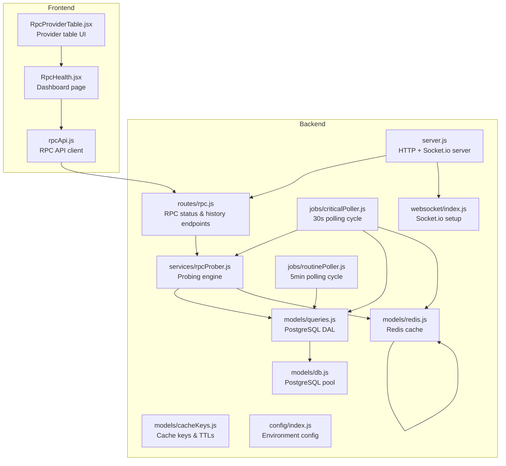
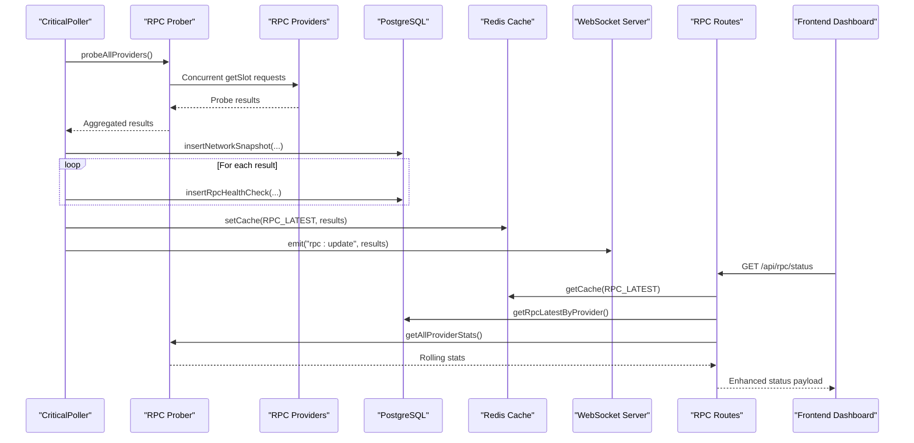
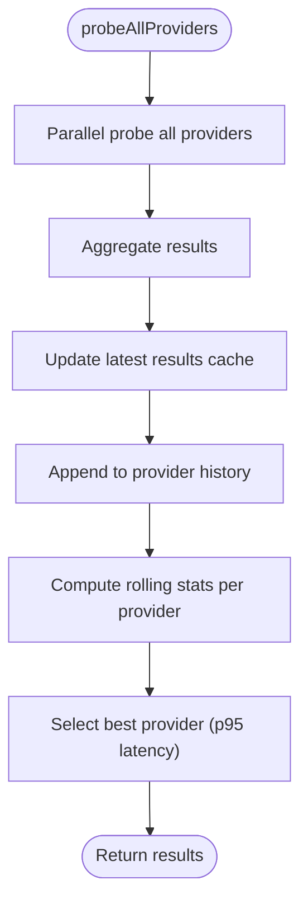
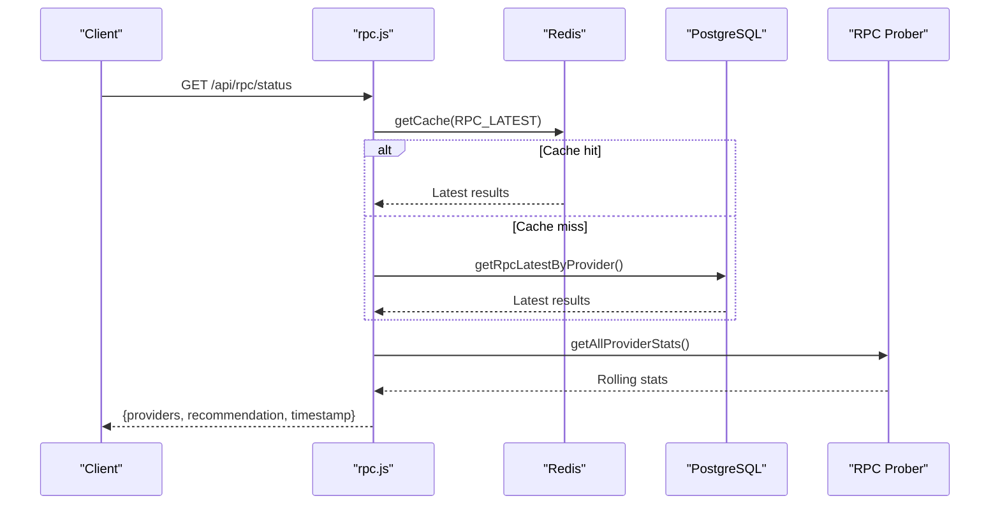
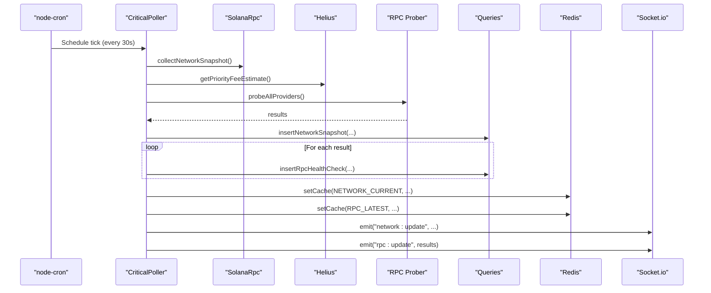
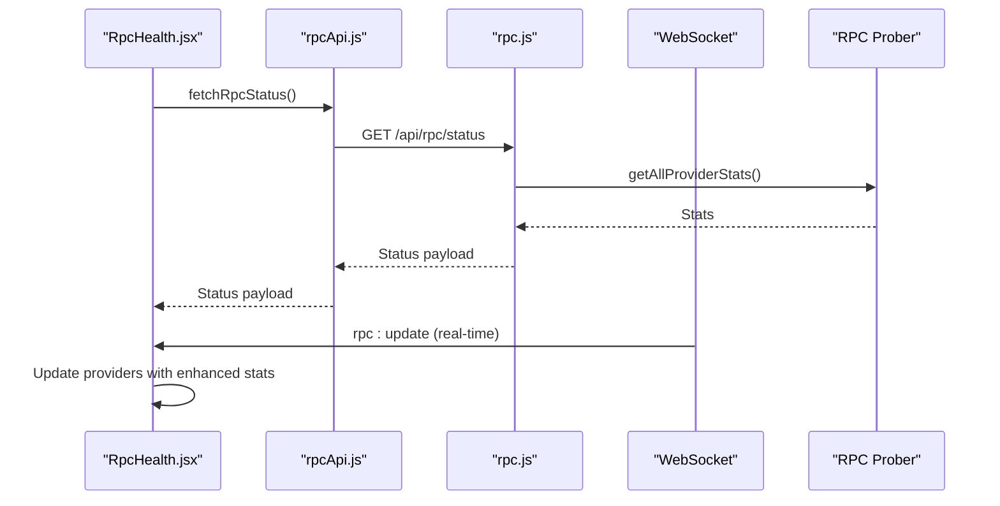
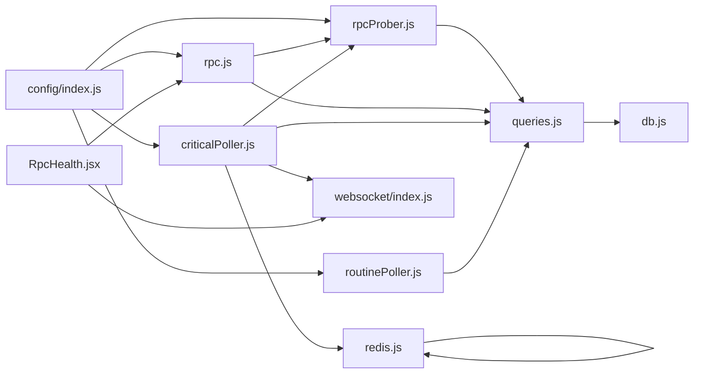

# RPC Prober Service

<cite>
**Referenced Files in This Document**
- [rpcProber.js](file://backend/src/services/rpcProber.js)
- [rpc.js](file://backend/src/routes/rpc.js)
- [criticalPoller.js](file://backend/src/jobs/criticalPoller.js)
- [routinePoller.js](file://backend/src/jobs/routinePoller.js)
- [db.js](file://backend/src/models/db.js)
- [redis.js](file://backend/src/models/redis.js)
- [queries.js](file://backend/src/models/queries.js)
- [cacheKeys.js](file://backend/src/models/cacheKeys.js)
- [index.js](file://backend/src/config/index.js)
- [server.js](file://backend/server.js)
- [index.js](file://backend/src/websocket/index.js)
- [RpcHealth.jsx](file://frontend/src/pages/RpcHealth.jsx)
- [RpcProviderTable.jsx](file://frontend/src/components/rpc/RpcProviderTable.jsx)
- [rpcApi.js](file://frontend/src/services/rpcApi.js)
</cite>

## Table of Contents
1. [Introduction](#introduction)
2. [Project Structure](#project-structure)
3. [Core Components](#core-components)
4. [Architecture Overview](#architecture-overview)
5. [Detailed Component Analysis](#detailed-component-analysis)
6. [Dependency Analysis](#dependency-analysis)
7. [Performance Considerations](#performance-considerations)
8. [Troubleshooting Guide](#troubleshooting-guide)
9. [Conclusion](#conclusion)
10. [Appendices](#appendices)

## Introduction
This document provides comprehensive documentation for the RPC Prober Service that monitors the health and performance of multiple Solana RPC providers. The service performs concurrent health checks, measures latency, tracks uptime, detects failures, and provides recommendations for optimal provider selection. It integrates with the broader InfraWatch monitoring ecosystem, feeding real-time data to the dashboard and enabling automated alerting.

The prober operates on a scheduled polling cadence, probes all configured providers concurrently, aggregates rolling statistics, and exposes endpoints for consumption by the monitoring dashboard and frontend applications.

## Project Structure
The RPC Prober Service is implemented within the backend monorepo under the `backend/src/services/` directory, with orchestration handled by job schedulers and route handlers. The frontend dashboard consumes the prober data via REST endpoints and real-time WebSocket events.

**Diagram sources**
- [server.js:1-128](file://backend/server.js#L1-L128)
- [rpc.js:1-135](file://backend/src/routes/rpc.js#L1-L135)
- [rpcProber.js:1-342](file://backend/src/services/rpcProber.js#L1-L342)
- [criticalPoller.js:1-108](file://backend/src/jobs/criticalPoller.js#L1-L108)
- [routinePoller.js:1-116](file://backend/src/jobs/routinePoller.js#L1-L116)
- [queries.js:1-459](file://backend/src/models/queries.js#L1-L459)
- [redis.js:1-161](file://backend/src/models/redis.js#L1-L161)
- [db.js:1-98](file://backend/src/models/db.js#L1-L98)
- [cacheKeys.js:1-50](file://backend/src/models/cacheKeys.js#L1-L50)
- [index.js](file://backend/src/config/index.js)
- [index.js](file://backend/src/websocket/index.js)
- [RpcHealth.jsx:1-195](file://frontend/src/pages/RpcHealth.jsx#L1-L195)
- [RpcProviderTable.jsx:1-177](file://frontend/src/components/rpc/RpcProviderTable.jsx#L1-L177)
- [rpcApi.js:1-7](file://frontend/src/services/rpcApi.js#L1-L7)

**Section sources**
- [server.js:1-128](file://backend/server.js#L1-L128)
- [rpc.js:1-135](file://backend/src/routes/rpc.js#L1-L135)
- [rpcProber.js:1-342](file://backend/src/services/rpcProber.js#L1-L342)

## Core Components
- RPC Prober Engine: Orchestrates probing of multiple providers, concurrent execution, result aggregation, and rolling statistics calculation.
- RPC Routes: Exposes endpoints for current provider status with rolling metrics and historical data retrieval.
- Critical Poller: Drives the prober on a 30-second schedule, persists results, updates caches, and broadcasts real-time events.
- Routine Poller: Handles less time-sensitive tasks and does not directly trigger RPC probing.
- Data Access Layer: Provides PostgreSQL persistence for network snapshots and RPC health checks.
- Caching Layer: Uses Redis for fast retrieval of latest RPC results and other frequently accessed data.
- Frontend Dashboard: Consumes RPC status via REST and real-time WebSocket updates for live monitoring.

**Section sources**
- [rpcProber.js:1-342](file://backend/src/services/rpcProber.js#L1-L342)
- [rpc.js:1-135](file://backend/src/routes/rpc.js#L1-L135)
- [criticalPoller.js:1-108](file://backend/src/jobs/criticalPoller.js#L1-L108)
- [routinePoller.js:1-116](file://backend/src/jobs/routinePoller.js#L1-L116)
- [queries.js:1-459](file://backend/src/models/queries.js#L1-L459)
- [redis.js:1-161](file://backend/src/models/redis.js#L1-L161)

## Architecture Overview
The RPC Prober Service follows a scheduled-job-driven architecture:
- A critical scheduler triggers RPC probing every 30 seconds.
- Each probe targets all configured providers concurrently.
- Results are persisted to PostgreSQL and cached in Redis.
- Real-time updates are broadcast via WebSocket to connected clients.
- The dashboard endpoint merges latest database results with rolling statistics computed by the prober.

**Diagram sources**
- [criticalPoller.js:21-100](file://backend/src/jobs/criticalPoller.js#L21-L100)
- [rpcProber.js:140-180](file://backend/src/services/rpcProber.js#L140-L180)
- [rpc.js:17-88](file://backend/src/routes/rpc.js#L17-L88)
- [queries.js:101-118](file://backend/src/models/queries.js#L101-L118)
- [redis.js:99-112](file://backend/src/models/redis.js#L99-L112)
- [index.js](file://backend/src/websocket/index.js)

## Detailed Component Analysis

### RPC Prober Engine
The prober encapsulates the core logic for health checking, latency measurement, uptime tracking, and statistics computation.

- Provider Configuration: Defines public and premium providers, including optional API key requirements and environment-based overrides.
- Concurrent Probing: Executes all provider checks in parallel using Promise.allSettled to ensure resilience against partial failures.
- Latency Measurement: Captures start/end timestamps around each request to compute response latency.
- Response Validation: Treats RPC errors and network exceptions as unhealthy states with error messages.
- History Management: Maintains an in-memory history per provider with a bounded size and updates the latest results cache.
- Rolling Statistics: Computes percentiles (p50/p95/p99), uptime percentage, and last incident timestamp from recent checks.
- Best Provider Selection: Recommends the highest-performing healthy provider based on p95 latency.

**Diagram sources**
- [rpcProber.js:140-180](file://backend/src/services/rpcProber.js#L140-L180)
- [rpcProber.js:208-250](file://backend/src/services/rpcProber.js#L208-L250)
- [rpcProber.js:295-307](file://backend/src/services/rpcProber.js#L295-L307)

**Section sources**
- [rpcProber.js:11-63](file://backend/src/services/rpcProber.js#L11-L63)
- [rpcProber.js:75-134](file://backend/src/services/rpcProber.js#L75-L134)
- [rpcProber.js:140-180](file://backend/src/services/rpcProber.js#L140-L180)
- [rpcProber.js:188-200](file://backend/src/services/rpcProber.js#L188-L200)
- [rpcProber.js:208-250](file://backend/src/services/rpcProber.js#L208-L250)
- [rpcProber.js:295-307](file://backend/src/services/rpcProber.js#L295-L307)

### RPC Routes
The RPC routes expose two primary endpoints:
- GET /api/rpc/status: Returns current provider status with rolling statistics and a recommendation for the best provider. It merges latest database results with rolling stats computed by the prober and enriches with provider metadata.
- GET /api/rpc/:provider/history: Returns historical health data for a specific provider filtered by time range.

**Diagram sources**
- [rpc.js:17-88](file://backend/src/routes/rpc.js#L17-L88)
- [rpc.js:94-132](file://backend/src/routes/rpc.js#L94-L132)
- [queries.js:124-132](file://backend/src/models/queries.js#L124-L132)
- [queries.js:140-156](file://backend/src/models/queries.js#L140-L156)

**Section sources**
- [rpc.js:17-88](file://backend/src/routes/rpc.js#L17-L88)
- [rpc.js:94-132](file://backend/src/routes/rpc.js#L94-L132)

### Critical Poller
The critical poller orchestrates the RPC probing lifecycle every 30 seconds:
- Collects network snapshot data.
- Optionally enhances congestion metrics with priority fee estimates.
- Probes all RPC providers concurrently.
- Persists network snapshots and individual RPC health checks.
- Updates Redis cache with latest network and RPC data.
- Broadcasts real-time updates via WebSocket.

**Diagram sources**
- [criticalPoller.js:21-100](file://backend/src/jobs/criticalPoller.js#L21-L100)
- [rpcProber.js:140-180](file://backend/src/services/rpcProber.js#L140-L180)
- [queries.js:101-118](file://backend/src/models/queries.js#L101-L118)
- [redis.js:99-112](file://backend/src/models/redis.js#L99-L112)
- [index.js](file://backend/src/websocket/index.js)

**Section sources**
- [criticalPoller.js:21-100](file://backend/src/jobs/criticalPoller.js#L21-L100)

### Routine Poller
The routine poller runs every 5 minutes and focuses on validator data and related tasks. It does not trigger RPC probing, maintaining separation of concerns between critical and routine monitoring.

**Section sources**
- [routinePoller.js:21-108](file://backend/src/jobs/routinePoller.js#L21-L108)

### Data Access Layer and Caching
- PostgreSQL: Provides durable storage for network snapshots and RPC health checks with parameterized queries to prevent SQL injection.
- Redis: Offers low-latency caching for frequently accessed data with configurable TTLs and graceful handling when unavailable.

**Section sources**
- [queries.js:101-118](file://backend/src/models/queries.js#L101-L118)
- [queries.js:124-132](file://backend/src/models/queries.js#L124-L132)
- [queries.js:140-156](file://backend/src/models/queries.js#L140-L156)
- [redis.js:75-112](file://backend/src/models/redis.js#L75-L112)
- [cacheKeys.js:6-49](file://backend/src/models/cacheKeys.js#L6-L49)

### Frontend Integration
The frontend dashboard consumes RPC status via:
- REST endpoint: Periodic polling of /api/rpc/status for initial load and refresh.
- WebSocket: Real-time updates via rpc:update events for live monitoring.
- UI Components: Provider table displays current status, latency, percentile metrics, uptime, and last incident.

**Diagram sources**
- [RpcHealth.jsx:24-81](file://frontend/src/pages/RpcHealth.jsx#L24-L81)
- [rpcApi.js:3](file://frontend/src/services/rpcApi.js#L3)
- [rpc.js:17-88](file://backend/src/routes/rpc.js#L17-L88)
- [rpcProber.js:256-272](file://backend/src/services/rpcProber.js#L256-L272)

**Section sources**
- [RpcHealth.jsx:24-81](file://frontend/src/pages/RpcHealth.jsx#L24-L81)
- [RpcProviderTable.jsx:16-28](file://frontend/src/components/rpc/RpcProviderTable.jsx#L16-L28)
- [rpcApi.js:3](file://frontend/src/services/rpcApi.js#L3)

## Dependency Analysis
The RPC Prober Service exhibits clear separation of concerns:
- Services depend on configuration, database, and Redis modules.
- Routes depend on the prober and DAL for data retrieval and enrichment.
- Jobs orchestrate service execution and persist results.
- Frontend depends on routes for data and WebSocket for real-time updates.

**Diagram sources**
- [index.js](file://backend/src/config/index.js)
- [rpcProber.js:1-342](file://backend/src/services/rpcProber.js#L1-L342)
- [rpc.js:1-135](file://backend/src/routes/rpc.js#L1-L135)
- [criticalPoller.js:1-108](file://backend/src/jobs/criticalPoller.js#L1-L108)
- [routinePoller.js:1-116](file://backend/src/jobs/routinePoller.js#L1-L116)
- [queries.js:1-459](file://backend/src/models/queries.js#L1-L459)
- [redis.js:1-161](file://backend/src/models/redis.js#L1-L161)
- [db.js:1-98](file://backend/src/models/db.js#L1-L98)
- [index.js](file://backend/src/websocket/index.js)
- [RpcHealth.jsx:1-195](file://frontend/src/pages/RpcHealth.jsx#L1-L195)

**Section sources**
- [rpcProber.js:1-342](file://backend/src/services/rpcProber.js#L1-L342)
- [rpc.js:1-135](file://backend/src/routes/rpc.js#L1-L135)
- [criticalPoller.js:1-108](file://backend/src/jobs/criticalPoller.js#L1-L108)
- [routinePoller.js:1-116](file://backend/src/jobs/routinePoller.js#L1-L116)
- [queries.js:1-459](file://backend/src/models/queries.js#L1-L459)
- [redis.js:1-161](file://backend/src/models/redis.js#L1-L161)
- [db.js:1-98](file://backend/src/models/db.js#L1-L98)
- [index.js](file://backend/src/websocket/index.js)
- [RpcHealth.jsx:1-195](file://frontend/src/pages/RpcHealth.jsx#L1-L195)

## Performance Considerations
- Concurrency: All providers are probed concurrently to minimize total probing time. This reduces the impact of slow providers on the overall cycle.
- Timeout Configuration: Each probe uses a 5-second timeout to prevent hanging requests from blocking the pipeline.
- Rolling Statistics: Percentile calculations are performed on recent healthy samples, reducing sensitivity to outliers while maintaining responsiveness.
- Caching: Latest results are cached in Redis with short TTLs to accelerate endpoint responses and reduce database load.
- Database Efficiency: Parameterized queries and batched inserts minimize overhead and prevent SQL injection.
- Graceful Degradation: When Redis or database is unavailable, the system continues operating with reduced capabilities, prioritizing stability.

[No sources needed since this section provides general guidance]

## Troubleshooting Guide
Common issues and resolutions:
- No RPC data in dashboard:
  - Verify critical poller is running and emitting rpc:update events.
  - Check Redis connectivity and cache keys for RPC_LATEST.
  - Confirm database initialization and write permissions.
- Slow endpoint responses:
  - Inspect Redis cache availability and TTLs.
  - Review database query performance and connection pool settings.
- Frequent timeouts:
  - Adjust provider endpoints or increase timeout values cautiously.
  - Investigate network latency between server and providers.
- Incorrect provider recommendations:
  - Ensure uptime thresholds and percentile calculations align with expectations.
  - Validate provider categories and metadata.

**Section sources**
- [criticalPoller.js:21-100](file://backend/src/jobs/criticalPoller.js#L21-L100)
- [redis.js:75-112](file://backend/src/models/redis.js#L75-L112)
- [db.js:15-47](file://backend/src/models/db.js#L15-L47)
- [rpcProber.js:295-307](file://backend/src/services/rpcProber.js#L295-L307)

## Conclusion
The RPC Prober Service provides robust, real-time monitoring of Solana RPC providers with concurrent probing, precise latency measurement, comprehensive uptime tracking, and actionable recommendations. Its integration with PostgreSQL and Redis ensures reliable persistence and fast retrieval, while WebSocket broadcasting enables a responsive dashboard experience. The modular design and scheduled job architecture support scalability and maintainability.

[No sources needed since this section summarizes without analyzing specific files]

## Appendices

### Probe Scheduling and Execution
- Frequency: Every 30 seconds via critical poller.
- Execution: Concurrent probing of all configured providers.
- Persistence: Network snapshots and RPC health checks stored in PostgreSQL.
- Caching: Latest RPC results cached in Redis with short TTLs.
- Broadcasting: Real-time updates sent via WebSocket to connected clients.

**Section sources**
- [criticalPoller.js:21-100](file://backend/src/jobs/criticalPoller.js#L21-L100)
- [rpcProber.js:140-180](file://backend/src/services/rpcProber.js#L140-L180)
- [queries.js:101-118](file://backend/src/models/queries.js#L101-L118)
- [redis.js:99-112](file://backend/src/models/redis.js#L99-L112)
- [index.js](file://backend/src/websocket/index.js)

### Result Aggregation and Recommendations
- Aggregation: Latest database results merged with rolling statistics from the prober.
- Metrics: p50/p95/p99 latency percentiles, uptime percentage, total and healthy checks, last incident timestamp.
- Recommendation: Best provider selected among healthy providers with the lowest p95 latency.

**Section sources**
- [rpc.js:47-88](file://backend/src/routes/rpc.js#L47-L88)
- [rpcProber.js:208-250](file://backend/src/services/rpcProber.js#L208-L250)
- [rpcProber.js:295-307](file://backend/src/services/rpcProber.js#L295-L307)

### Integration with Monitoring Dashboard
- REST Endpoint: /api/rpc/status returns enriched provider data with rolling stats and recommendation.
- WebSocket Events: rpc:update provides real-time updates for live monitoring.
- Frontend Components: RpcHealth.jsx and RpcProviderTable.jsx render provider status and metrics.

**Section sources**
- [rpc.js:17-88](file://backend/src/routes/rpc.js#L17-L88)
- [RpcHealth.jsx:24-81](file://frontend/src/pages/RpcHealth.jsx#L24-L81)
- [RpcProviderTable.jsx:16-28](file://frontend/src/components/rpc/RpcProviderTable.jsx#L16-L28)
- [rpcApi.js:3](file://frontend/src/services/rpcApi.js#L3)

### Probe Configuration Options
- Provider List: Public and premium providers with optional API key requirements.
- Environment Overrides: Provider endpoints can be overridden via environment variables.
- Timeout: 5-second timeout per probe to prevent stalls.
- History Size: Maximum 100 recent checks retained per provider.

**Section sources**
- [rpcProber.js:11-63](file://backend/src/services/rpcProber.js#L11-L63)
- [rpcProber.js:91](file://backend/src/services/rpcProber.js#L91)
- [rpcProber.js:68](file://backend/src/services/rpcProber.js#L68)

### Failure Detection Thresholds and Remediation
- Health Determination: A provider is considered healthy if the response contains a valid result and no error field.
- Error Handling: Network errors and RPC errors are treated as unhealthy with error messages captured.
- Automated Remediation: The system does not implement automatic remediation; recommendations are informational for operators to adjust configurations or switch providers.

**Section sources**
- [rpcProber.js:97-133](file://backend/src/services/rpcProber.js#L97-L133)
- [rpcProber.js:295-307](file://backend/src/services/rpcProber.js#L295-L307)