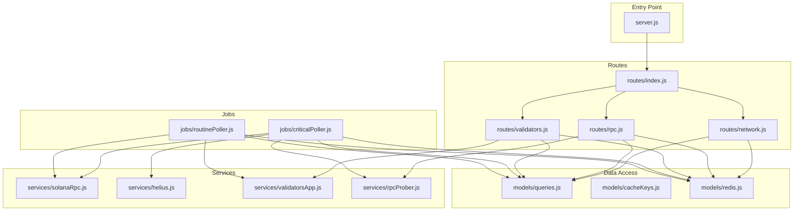
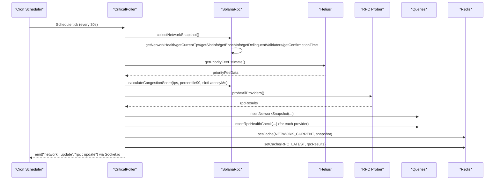
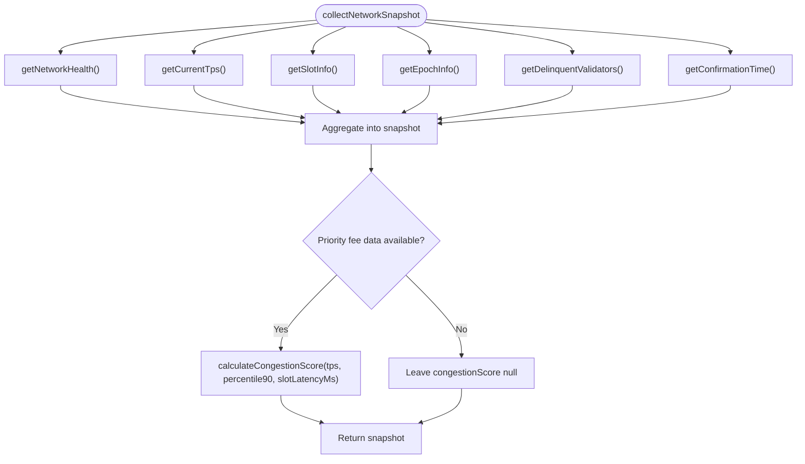
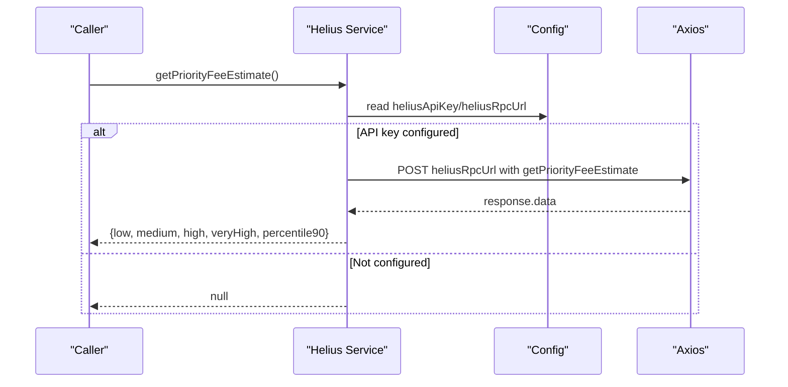
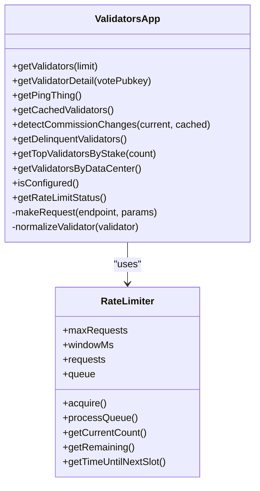
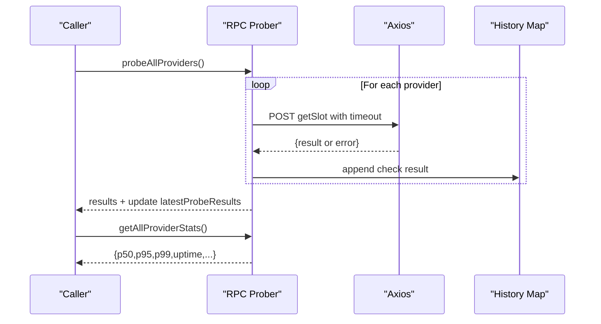
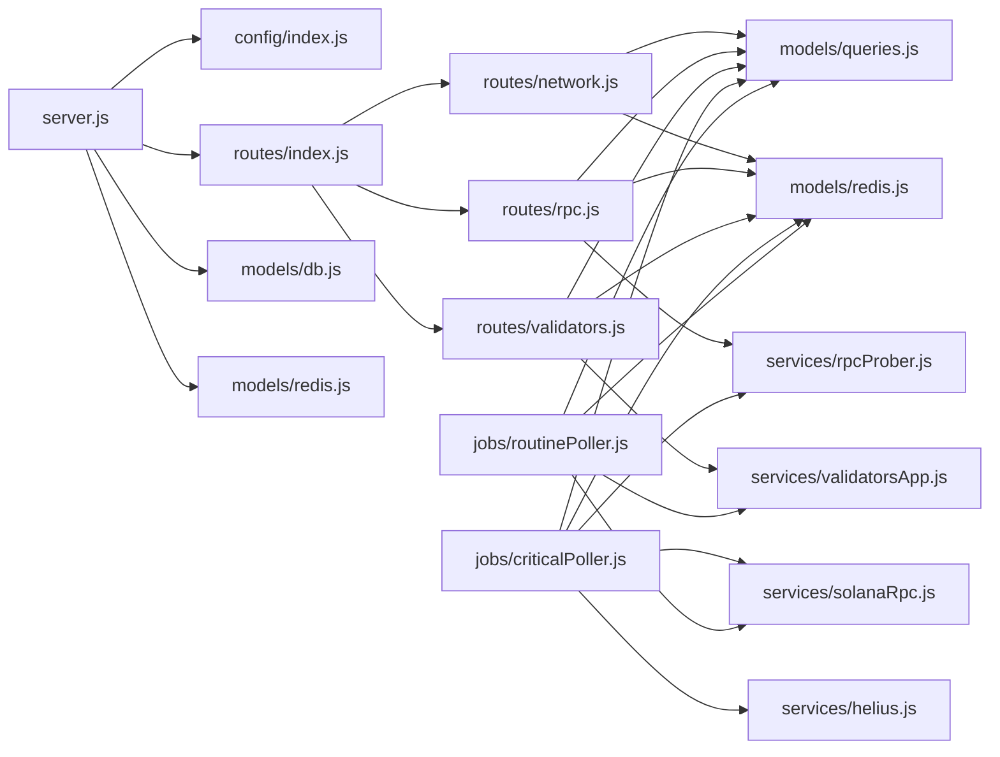

# Service Layer Architecture

<cite>
**Referenced Files in This Document**
- [server.js](file://backend/server.js)
- [config/index.js](file://backend/src/config/index.js)
- [services/solanaRpc.js](file://backend/src/services/solanaRpc.js)
- [services/helius.js](file://backend/src/services/helius.js)
- [services/validatorsApp.js](file://backend/src/services/validatorsApp.js)
- [services/rpcProber.js](file://backend/src/services/rpcProber.js)
- [models/queries.js](file://backend/src/models/queries.js)
- [models/redis.js](file://backend/src/models/redis.js)
- [models/cacheKeys.js](file://backend/src/models/cacheKeys.js)
- [routes/index.js](file://backend/src/routes/index.js)
- [routes/network.js](file://backend/src/routes/network.js)
- [routes/rpc.js](file://backend/src/routes/rpc.js)
- [routes/validators.js](file://backend/src/routes/validators.js)
- [middleware/errorHandler.js](file://backend/src/middleware/errorHandler.js)
- [jobs/criticalPoller.js](file://backend/src/jobs/criticalPoller.js)
- [jobs/routinePoller.js](file://backend/src/jobs/routinePoller.js)
- [package.json](file://backend/package.json)
</cite>

## Table of Contents
1. [Introduction](#introduction)
2. [Project Structure](#project-structure)
3. [Core Components](#core-components)
4. [Architecture Overview](#architecture-overview)
5. [Detailed Component Analysis](#detailed-component-analysis)
6. [Dependency Analysis](#dependency-analysis)
7. [Performance Considerations](#performance-considerations)
8. [Troubleshooting Guide](#troubleshooting-guide)
9. [Conclusion](#conclusion)
10. [Appendices](#appendices)

## Introduction
This document describes the InfraWatch service layer architecture, focusing on how the backend collects, transforms, and exposes real-time Solana infrastructure data. It explains the service layer pattern implementation, external API integrations, and business logic encapsulation. It covers the Solana RPC service, Helius integration, Validators.app integration, and the RPC prober service. It also documents initialization, configuration management, error handling, retry mechanisms, inter-service communication, data transformation, and caching integration. Finally, it provides usage examples, dependency injection patterns, and testing strategies.

## Project Structure
The backend follows a layered architecture:
- Entry point initializes Express, Socket.io, middleware, and schedules periodic jobs.
- Services encapsulate external integrations and domain logic.
- Routes define the API surface and orchestrate service calls.
- Data Access Layer (DAL) abstracts database operations.
- Models provide Redis caching and cache key conventions.
- Jobs coordinate periodic data collection and broadcasting.

**Diagram sources**
- [server.js:1-128](file://backend/server.js#L1-L128)
- [routes/index.js:1-24](file://backend/src/routes/index.js#L1-L24)
- [routes/network.js:1-135](file://backend/src/routes/network.js#L1-L135)
- [routes/rpc.js:1-135](file://backend/src/routes/rpc.js#L1-L135)
- [routes/validators.js:1-112](file://backend/src/routes/validators.js#L1-L112)
- [services/solanaRpc.js:1-340](file://backend/src/services/solanaRpc.js#L1-L340)
- [services/helius.js:1-188](file://backend/src/services/helius.js#L1-L188)
- [services/validatorsApp.js:1-388](file://backend/src/services/validatorsApp.js#L1-L388)
- [services/rpcProber.js:1-342](file://backend/src/services/rpcProber.js#L1-L342)
- [models/queries.js:1-459](file://backend/src/models/queries.js#L1-L459)
- [models/redis.js:1-161](file://backend/src/models/redis.js#L1-L161)
- [models/cacheKeys.js:1-50](file://backend/src/models/cacheKeys.js#L1-L50)
- [jobs/criticalPoller.js:1-108](file://backend/src/jobs/criticalPoller.js#L1-L108)
- [jobs/routinePoller.js:1-116](file://backend/src/jobs/routinePoller.js#L1-L116)

**Section sources**
- [server.js:1-128](file://backend/server.js#L1-L128)
- [routes/index.js:1-24](file://backend/src/routes/index.js#L1-L24)

## Core Components
- Solana RPC Service: Collects network health, TPS, slot info, epoch info, delinquent validators, and confirmation time. Computes congestion score and aggregates a network snapshot.
- Helius Integration: Provides priority fee estimates and enhanced TPS via Helius RPC. Gracefully handles missing API keys.
- Validators.app Integration: Fetches validator data with rate limiting and caching. Normalizes data and detects commission changes.
- RPC Prober Service: Probes multiple RPC providers for health and latency, computes rolling statistics, and recommends the best provider.
- Data Access Layer: Encapsulates database operations for network snapshots, RPC health checks, validators, validator snapshots, and alerts.
- Caching: Redis-backed cache with TTL constants and cache key helpers.
- Jobs: Periodic collectors that orchestrate service calls, persist data, broadcast updates, and manage retries.

**Section sources**
- [services/solanaRpc.js:1-340](file://backend/src/services/solanaRpc.js#L1-L340)
- [services/helius.js:1-188](file://backend/src/services/helius.js#L1-L188)
- [services/validatorsApp.js:1-388](file://backend/src/services/validatorsApp.js#L1-L388)
- [services/rpcProber.js:1-342](file://backend/src/services/rpcProber.js#L1-L342)
- [models/queries.js:1-459](file://backend/src/models/queries.js#L1-L459)
- [models/redis.js:1-161](file://backend/src/models/redis.js#L1-L161)
- [models/cacheKeys.js:1-50](file://backend/src/models/cacheKeys.js#L1-L50)
- [jobs/criticalPoller.js:1-108](file://backend/src/jobs/criticalPoller.js#L1-L108)
- [jobs/routinePoller.js:1-116](file://backend/src/jobs/routinePoller.js#L1-L116)

## Architecture Overview
The system uses a service-layer pattern where each service encapsulates a bounded responsibility:
- External integrations are isolated in dedicated modules.
- Business logic is centralized in services (e.g., congestion scoring, normalization, rate limiting).
- Routes act as orchestrators, delegating to services and DAL.
- Jobs coordinate periodic tasks and broadcast updates via WebSocket.

**Diagram sources**
- [jobs/criticalPoller.js:17-100](file://backend/src/jobs/criticalPoller.js#L17-L100)
- [services/solanaRpc.js:275-328](file://backend/src/services/solanaRpc.js#L275-L328)
- [services/helius.js:13-70](file://backend/src/services/helius.js#L13-L70)
- [services/rpcProber.js:140-180](file://backend/src/services/rpcProber.js#L140-L180)
- [models/queries.js:27-118](file://backend/src/models/queries.js#L27-L118)
- [models/redis.js:99-112](file://backend/src/models/redis.js#L99-L112)

**Section sources**
- [jobs/criticalPoller.js:17-100](file://backend/src/jobs/criticalPoller.js#L17-L100)
- [server.js:84-107](file://backend/server.js#L84-L107)

## Detailed Component Analysis

### Solana RPC Service
Responsibilities:
- Health checks, TPS sampling, slot progression, epoch info, delinquent validators, and confirmation time.
- Aggregates a network snapshot and computes congestion score using TPS, priority fees, and slot latency.
- Uses @solana/web3.js Connection with a configured RPC URL.

Key behaviors:
- Concurrent collection of metrics via Promise.all.
- Defensive error handling returning safe defaults.
- Module-level state for slot tracking to compute latency.

**Diagram sources**
- [services/solanaRpc.js:275-328](file://backend/src/services/solanaRpc.js#L275-L328)
- [services/solanaRpc.js:228-268](file://backend/src/services/solanaRpc.js#L228-L268)

**Section sources**
- [services/solanaRpc.js:10-340](file://backend/src/services/solanaRpc.js#L10-L340)

### Helius Integration Service
Responsibilities:
- Fetches priority fee estimates and optional enhanced TPS via Helius RPC.
- Validates configuration and returns null when API key is missing.
- Applies timeouts and logs errors.

Key behaviors:
- Configurable via environment variables; constructs Helius RPC URL from API key.
- Returns structured fee levels and proxies percentile90 to high for convenience.

**Diagram sources**
- [services/helius.js:13-70](file://backend/src/services/helius.js#L13-L70)
- [config/index.js:21-26](file://backend/src/config/index.js#L21-L26)

**Section sources**
- [services/helius.js:1-188](file://backend/src/services/helius.js#L1-L188)
- [config/index.js:21-26](file://backend/src/config/index.js#L21-L26)

### Validators.app Integration Service
Responsibilities:
- Fetches validators with rate limiting and caching.
- Normalizes raw data to a unified schema.
- Detects commission changes and provides helper queries for top validators, delinquency, and data center grouping.

Key behaviors:
- Built-in rate limiter (40 requests per 5 minutes) with queueing and backpressure.
- Module-level cache with TTL and cache invalidation heuristics.
- Robust error handling with fallbacks to empty arrays.

**Diagram sources**
- [services/validatorsApp.js:10-99](file://backend/src/services/validatorsApp.js#L10-L99)
- [services/validatorsApp.js:115-149](file://backend/src/services/validatorsApp.js#L115-L149)
- [services/validatorsApp.js:156-179](file://backend/src/services/validatorsApp.js#L156-L179)

**Section sources**
- [services/validatorsApp.js:1-388](file://backend/src/services/validatorsApp.js#L1-L388)

### RPC Prober Service
Responsibilities:
- Probes multiple RPC providers for health and latency.
- Computes rolling statistics (percentiles, uptime, last incident).
- Recommends the best provider based on recent stats.

Key behaviors:
- Concurrent probing with Promise.allSettled to avoid partial failures.
- Maintains in-memory history per provider with capped size.
- Provides configuration for providers and environment overrides.

**Diagram sources**
- [services/rpcProber.js:140-180](file://backend/src/services/rpcProber.js#L140-L180)
- [services/rpcProber.js:208-250](file://backend/src/services/rpcProber.js#L208-L250)

**Section sources**
- [services/rpcProber.js:1-342](file://backend/src/services/rpcProber.js#L1-L342)

### Data Access Layer (DAL)
Responsibilities:
- Parameterized queries for network snapshots, RPC health checks, validators, validator snapshots, and alerts.
- Ensures SQL injection prevention and consistent return types.

Key behaviors:
- Upserts validators on conflict using vote_pubkey.
- Retrieves latest entries per provider and provider-specific histories.
- Supports time-range queries for charts and dashboards.

**Section sources**
- [models/queries.js:1-459](file://backend/src/models/queries.js#L1-L459)

### Caching Integration
Responsibilities:
- Redis client with lazy initialization and retry strategy.
- Cache key constants and TTL helpers for network, RPC, validators, and history data.

Key behaviors:
- Graceful degradation when Redis is unavailable.
- JSON serialization/deserialization with error logging.
- TTL values tailored to data freshness needs.

**Section sources**
- [models/redis.js:1-161](file://backend/src/models/redis.js#L1-L161)
- [models/cacheKeys.js:1-50](file://backend/src/models/cacheKeys.js#L1-L50)

### Jobs Orchestration
Responsibilities:
- CriticalPoller: Every 30 seconds, collects network snapshot, probes RPC providers, persists to DB, caches, and emits WebSocket updates.
- RoutinePoller: Every 5 minutes, fetches validators, detects changes, upserts, snapshots, caches epoch info, and emits alerts.

Key behaviors:
- Throttling to prevent overlapping runs.
- Graceful error handling for DB and Redis failures.
- Broadcasting via Socket.io for real-time UI updates.

**Section sources**
- [jobs/criticalPoller.js:1-108](file://backend/src/jobs/criticalPoller.js#L1-L108)
- [jobs/routinePoller.js:1-116](file://backend/src/jobs/routinePoller.js#L1-L116)

### Routes and API Surface
Responsibilities:
- Network: current status and historical charts with cache-first strategy.
- RPC: provider status, rolling stats, recommendation, and provider history.
- Validators: top validators and detailed validator info with multi-source fallback.

Key behaviors:
- Cache-first with Redis, fallback to DB.
- Validation of query parameters and structured error responses.
- Multi-source fallback: Redis → DB → external APIs.

**Section sources**
- [routes/network.js:1-135](file://backend/src/routes/network.js#L1-L135)
- [routes/rpc.js:1-135](file://backend/src/routes/rpc.js#L1-L135)
- [routes/validators.js:1-112](file://backend/src/routes/validators.js#L1-L112)

## Dependency Analysis
External dependencies and their roles:
- @solana/web3.js: Solana RPC connectivity and metrics.
- axios: HTTP client for Helius and Validators.app.
- node-cron: Scheduling periodic jobs.
- pg: PostgreSQL driver for the DAL.
- ioredis: Redis client with retry strategy.
- express, socket.io, cors, helmet, compression: Web server, real-time updates, and security.

**Diagram sources**
- [server.js:1-128](file://backend/server.js#L1-L128)
- [routes/index.js:1-24](file://backend/src/routes/index.js#L1-L24)
- [models/redis.js:1-161](file://backend/src/models/redis.js#L1-L161)
- [models/queries.js:1-459](file://backend/src/models/queries.js#L1-L459)
- [services/solanaRpc.js:1-340](file://backend/src/services/solanaRpc.js#L1-L340)
- [services/helius.js:1-188](file://backend/src/services/helius.js#L1-L188)
- [services/validatorsApp.js:1-388](file://backend/src/services/validatorsApp.js#L1-L388)
- [services/rpcProber.js:1-342](file://backend/src/services/rpcProber.js#L1-L342)
- [jobs/criticalPoller.js:1-108](file://backend/src/jobs/criticalPoller.js#L1-L108)
- [jobs/routinePoller.js:1-116](file://backend/src/jobs/routinePoller.js#L1-L116)

**Section sources**
- [package.json:22-34](file://backend/package.json#L22-L34)

## Performance Considerations
- Concurrency: Services use Promise.all and Promise.allSettled to minimize latency when fetching multiple endpoints.
- Caching: Redis cache keys and TTLs reduce DB and external API load. Cache-first routes improve response times.
- Rate limiting: Validators.app integration prevents throttling by queuing requests and enforcing limits.
- Retries: Redis client has retryStrategy and maxRetriesPerRequest; jobs handle transient failures gracefully.
- Timeouts: External calls enforce timeouts to bound latency and prevent hanging requests.
- Percentile calculations: Rolling stats use interpolation for accurate latency percentiles.

[No sources needed since this section provides general guidance]

## Troubleshooting Guide
Common issues and strategies:
- Missing API keys or endpoints:
  - Helius: Service returns null when API key is missing; verify configuration.
  - Validators.app: Service logs when API key is missing; ensure environment variable is set.
- Redis unavailability:
  - Redis module returns null or false; routes and jobs continue with DB fallback.
- Database outages:
  - DAL throws errors; jobs wrap DB operations in try/catch and warn rather than failing the whole cycle.
- External provider errors:
  - RPC Prober records error messages and marks providers unhealthy; routes still return partial data.
- Error handling middleware:
  - Centralized error handler converts known errors to appropriate HTTP responses and logs details.

**Section sources**
- [services/helius.js:14-18](file://backend/src/services/helius.js#L14-L18)
- [services/validatorsApp.js:116-119](file://backend/src/services/validatorsApp.js#L116-L119)
- [models/redis.js:75-89](file://backend/src/models/redis.js#L75-L89)
- [jobs/criticalPoller.js:49-63](file://backend/src/jobs/criticalPoller.js#L49-L63)
- [middleware/errorHandler.js:44-109](file://backend/src/middleware/errorHandler.js#L44-L109)

## Conclusion
InfraWatch’s service layer cleanly separates concerns across external integrations, business logic, persistence, and presentation. The design emphasizes resilience through caching, rate limiting, and graceful degradation. Periodic jobs keep data fresh, while routes provide a robust, cache-first API. The architecture supports easy extension and testing, with clear boundaries between services and modules.

[No sources needed since this section summarizes without analyzing specific files]

## Appendices

### Service Initialization and Configuration Management
- Configuration loading:
  - Loads .env if present, merges with environment variables, and constructs derived URLs (e.g., Helius RPC URL).
  - Defines polling intervals, Redis URL, and CORS origin.
- Redis initialization:
  - Lazy connection with retry strategy and event logging.
- Server startup:
  - Initializes database and Redis, mounts routes, sets up Socket.io, and starts jobs.

**Section sources**
- [config/index.js:1-68](file://backend/src/config/index.js#L1-L68)
- [models/redis.js:16-68](file://backend/src/models/redis.js#L16-L68)
- [server.js:84-107](file://backend/server.js#L84-L107)

### Inter-Service Communication Patterns
- Jobs orchestrate services and DAL, emitting updates via Socket.io.
- Routes delegate to services and DAL, applying cache-first policies.
- Services remain stateless and rely on shared configuration and Redis.

**Section sources**
- [jobs/criticalPoller.js:33-92](file://backend/src/jobs/criticalPoller.js#L33-L92)
- [routes/network.js:17-79](file://backend/src/routes/network.js#L17-L79)
- [routes/rpc.js:17-88](file://backend/src/routes/rpc.js#L17-L88)
- [routes/validators.js:52-109](file://backend/src/routes/validators.js#L52-L109)

### Data Transformation Processes
- Solana RPC:
  - Metrics aggregation into a normalized snapshot with congestion score computation.
- Validators.app:
  - Raw validator objects normalized to a unified schema.
  - Commission change detection via cached vs. current comparison.
- RPC Prober:
  - Provider results transformed into rolling statistics and recommendations.

**Section sources**
- [services/solanaRpc.js:275-328](file://backend/src/services/solanaRpc.js#L275-L328)
- [services/validatorsApp.js:156-179](file://backend/src/services/validatorsApp.js#L156-L179)
- [services/rpcProber.js:208-250](file://backend/src/services/rpcProber.js#L208-L250)

### Caching Integration Details
- Cache keys:
  - Centralized constants for network, RPC, validators, and history with TTL values.
- Redis operations:
  - Lazy initialization, JSON serialization, TTL, and error-safe operations.
- Route cache-first:
  - Network and validators routes attempt Redis first, then DB, and cache responses.

**Section sources**
- [models/cacheKeys.js:1-50](file://backend/src/models/cacheKeys.js#L1-L50)
- [models/redis.js:75-112](file://backend/src/models/redis.js#L75-L112)
- [routes/network.js:19-42](file://backend/src/routes/network.js#L19-L42)
- [routes/validators.js:22-42](file://backend/src/routes/validators.js#L22-L42)

### Examples of Service Usage
- Network route:
  - GET /api/network/current returns a cache-first snapshot, transforming internal fields to API shape.
- RPC route:
  - GET /api/rpc/status merges latest results with rolling stats and provides a recommendation.
- Validators route:
  - GET /api/validators/:votePubkey attempts Redis cache, then Validators.app, then DB.

**Section sources**
- [routes/network.js:17-79](file://backend/src/routes/network.js#L17-L79)
- [routes/rpc.js:17-88](file://backend/src/routes/rpc.js#L17-L88)
- [routes/validators.js:52-109](file://backend/src/routes/validators.js#L52-L109)

### Dependency Injection and Testing Strategies
- Dependency injection:
  - Services are pure modules exporting functions; routes import and call them directly.
  - Jobs import services and DAL; server imports routes and jobs.
- Testing strategies:
  - Mock external services (Helius, Validators.app) by stubbing axios and returning controlled responses.
  - Test rate limiter behavior by simulating queue acquisition and window expiration.
  - Verify congestion score calculation with known TPS, fee, and latency inputs.
  - Validate RPC prober percentile calculations with deterministic arrays.
  - Use in-memory history for RPC prober tests and clearHistory to reset state.

[No sources needed since this section provides general guidance]