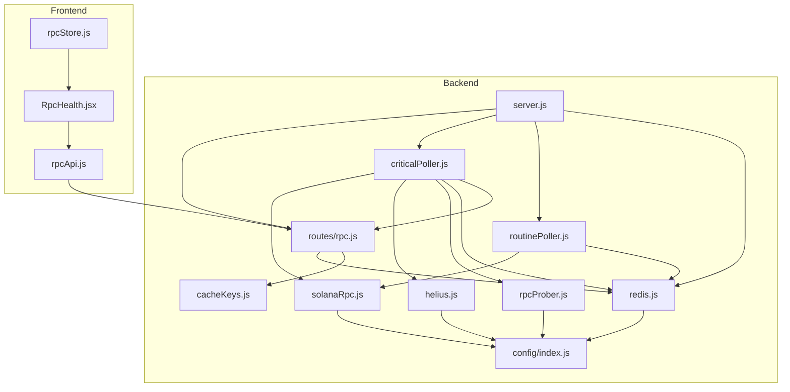
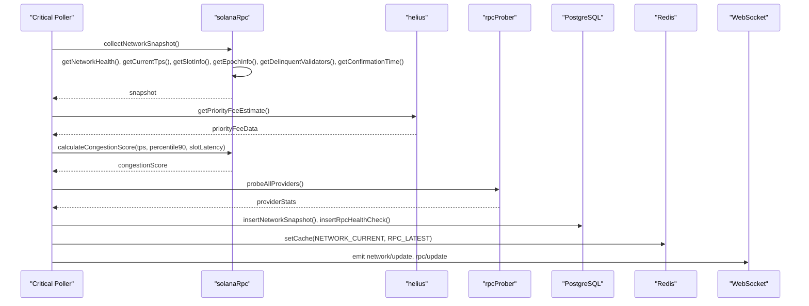
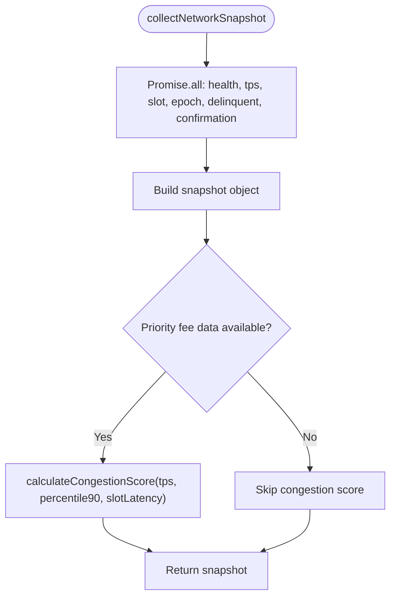
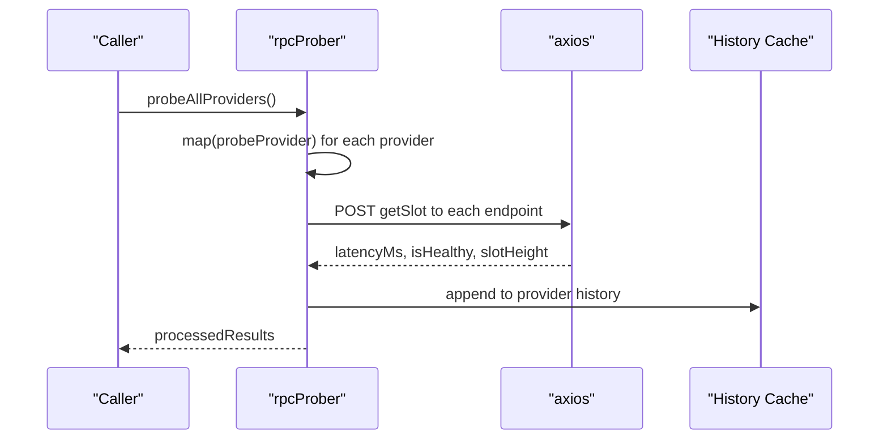
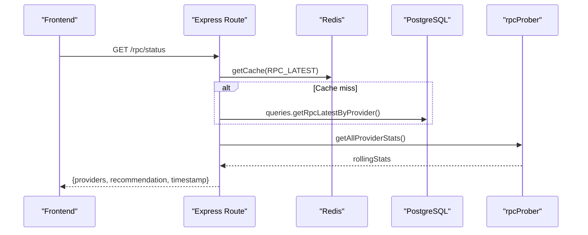
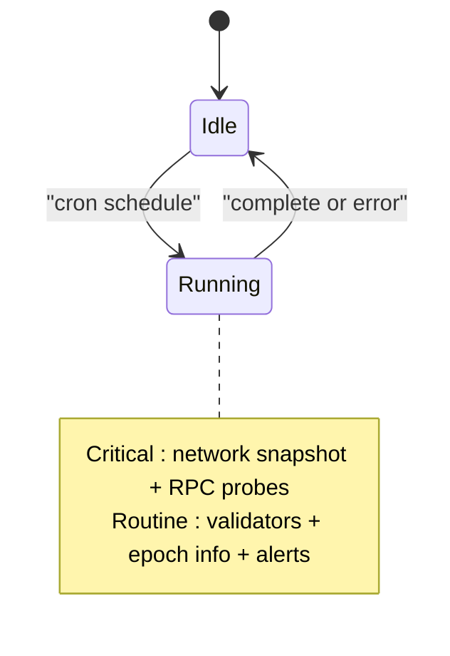
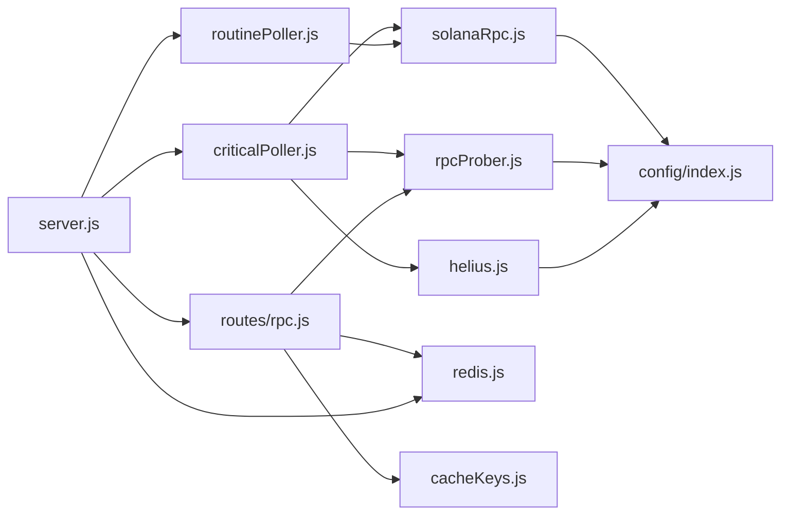

# Solana RPC Service

<cite>
**Referenced Files in This Document**
- [solanaRpc.js](file://backend/src/services/solanaRpc.js)
- [rpcProber.js](file://backend/src/services/rpcProber.js)
- [helius.js](file://backend/src/services/helius.js)
- [rpc.js](file://backend/src/routes/rpc.js)
- [criticalPoller.js](file://backend/src/jobs/criticalPoller.js)
- [routinePoller.js](file://backend/src/jobs/routinePoller.js)
- [cacheKeys.js](file://backend/src/models/cacheKeys.js)
- [redis.js](file://backend/src/models/redis.js)
- [index.js](file://backend/src/config/index.js)
- [server.js](file://backend/server.js)
- [rpcApi.js](file://frontend/src/services/rpcApi.js)
- [RpcHealth.jsx](file://frontend/src/pages/RpcHealth.jsx)
- [rpcStore.js](file://frontend/src/stores/rpcStore.js)
</cite>

## Update Summary
**Changes Made**
- Enhanced congestion scoring calculations with improved TPS normalization and priority fee integration
- Updated slot latency estimation algorithms with more accurate target calculations
- Improved RPC provider probing with better error handling and statistics computation
- Enhanced network snapshot collection with more robust concurrent data fetching
- Updated frontend integration with real-time WebSocket updates and improved error handling

## Table of Contents
1. [Introduction](#introduction)
2. [Project Structure](#project-structure)
3. [Core Components](#core-components)
4. [Architecture Overview](#architecture-overview)
5. [Detailed Component Analysis](#detailed-component-analysis)
6. [Dependency Analysis](#dependency-analysis)
7. [Performance Considerations](#performance-considerations)
8. [Troubleshooting Guide](#troubleshooting-guide)
9. [Conclusion](#conclusion)
10. [Appendices](#appendices)

## Introduction
This document describes the Solana RPC Service implementation powering InfraWatch's blockchain infrastructure monitoring. It covers the data collection pipeline for network health, TPS, slot progression, epoch information, delinquent validators, and confirmation time estimation. It explains the Connection class initialization, RPC method usage patterns, error handling strategies, and performance optimization techniques. It also documents the congestion score calculation algorithm combining TPS, priority fees, and slot latency metrics, along with examples of network snapshot collection, concurrent data fetching using Promise.all, and slot tracking mechanisms.

## Project Structure
The backend is organized around modular services, jobs, models, routes, and middleware. The Solana RPC Service is primarily implemented in the solanaRpc service, augmented by the rpcProber for external RPC provider health monitoring, and the helius service for priority fee estimates. Jobs orchestrate periodic data collection and caching. Frontend integrates via REST APIs and WebSocket updates.

**Diagram sources**
- [server.js:1-128](file://backend/server.js#L1-L128)
- [solanaRpc.js:1-345](file://backend/src/services/solanaRpc.js#L1-L345)
- [rpcProber.js:1-342](file://backend/src/services/rpcProber.js#L1-L342)
- [helius.js:1-188](file://backend/src/services/helius.js#L1-L188)
- [criticalPoller.js:1-108](file://backend/src/jobs/criticalPoller.js#L1-L108)
- [routinePoller.js:1-116](file://backend/src/jobs/routinePoller.js#L1-L116)
- [cacheKeys.js:1-50](file://backend/src/models/cacheKeys.js#L1-L50)
- [redis.js:1-161](file://backend/src/models/redis.js#L1-L161)
- [index.js:1-68](file://backend/src/config/index.js#L1-L68)
- [rpc.js:1-135](file://backend/src/routes/rpc.js#L1-L135)
- [rpcApi.js:1-7](file://frontend/src/services/rpcApi.js#L1-L7)
- [RpcHealth.jsx:1-195](file://frontend/src/pages/RpcHealth.jsx#L1-L195)
- [rpcStore.js:1-16](file://frontend/src/stores/rpcStore.js#L1-L16)

**Section sources**
- [server.js:1-128](file://backend/server.js#L1-L128)
- [index.js:1-68](file://backend/src/config/index.js#L1-L68)

## Core Components
- Connection class initialization and RPC method usage:
  - Connection is instantiated with a Solana RPC URL and commitment level for confirmed transactions.
  - Methods used include getHealth, getRecentPerformanceSamples, getSlot, getEpochInfo, getVoteAccounts, and getConfirmationTime.
- Network snapshot collection:
  - collectNetworkSnapshot orchestrates concurrent fetching of health, TPS, slot info, epoch info, delinquent validators, and confirmation time using Promise.all.
  - Optionally computes congestion score using priority fee data from Helius.
- RPC provider probing:
  - probeAllProviders concurrently tests multiple RPC endpoints via HTTP POST requests and records latency, health, and slot height.
  - Rolling statistics are computed for percentiles and uptime.
- Caching and persistence:
  - Redis caching is used for frequent reads with TTLs defined centrally.
  - PostgreSQL writes are performed with graceful error handling.
- Frontend integration:
  - REST endpoints serve provider status and history.
  - WebSocket broadcasts real-time updates for UI consumption.

**Section sources**
- [solanaRpc.js:10-345](file://backend/src/services/solanaRpc.js#L10-L345)
- [rpcProber.js:75-180](file://backend/src/services/rpcProber.js#L75-L180)
- [rpc.js:17-88](file://backend/src/routes/rpc.js#L17-L88)
- [cacheKeys.js:6-49](file://backend/src/models/cacheKeys.js#L6-L49)
- [redis.js:75-112](file://backend/src/models/redis.js#L75-L112)
- [criticalPoller.js:32-100](file://backend/src/jobs/criticalPoller.js#L32-L100)

## Architecture Overview
The system follows a job-driven architecture:
- Critical poller runs every 30 seconds to collect network snapshots and RPC health.
- Routine poller runs every 5 minutes to refresh validator data and epoch info.
- Services expose REST endpoints and broadcast updates via WebSocket.
- Redis caches hot data; PostgreSQL persists historical metrics.

**Diagram sources**
- [criticalPoller.js:21-100](file://backend/src/jobs/criticalPoller.js#L21-L100)
- [solanaRpc.js:275-328](file://backend/src/services/solanaRpc.js#L275-L328)
- [helius.js:13-70](file://backend/src/services/helius.js#L13-L70)
- [rpcProber.js:140-180](file://backend/src/services/rpcProber.js#L140-L180)
- [cacheKeys.js:8-9](file://backend/src/models/cacheKeys.js#L8-L9)

## Detailed Component Analysis

### Solana RPC Service
Responsibilities:
- Network health monitoring via getHealth.
- TPS calculation using getRecentPerformanceSamples.
- Slot progression tracking with estimated latency.
- Epoch information retrieval and ETA computation.
- Delinquent validator detection via getVoteAccounts.
- Confirmation time estimation using performance samples.
- Congestion score calculation combining TPS, priority fees, and slot latency.
- Concurrent network snapshot collection using Promise.all.

Implementation highlights:
- Connection initialization sets commitment to confirmed for reliable state.
- Slot tracking maintains lastSlot and lastSlotTimestamp to compute slots per second and estimated latency.
- Epoch progress and ETA derived from slotIndex and slotsInEpoch.
- Delinquent validator count extracted from vote accounts.
- Priority fee data from Helius enhances congestion scoring.

**Diagram sources**
- [solanaRpc.js:275-328](file://backend/src/services/solanaRpc.js#L275-L328)
- [solanaRpc.js:228-268](file://backend/src/services/solanaRpc.js#L228-L268)

**Section sources**
- [solanaRpc.js:10-345](file://backend/src/services/solanaRpc.js#L10-L345)

### RPC Prober Service
Responsibilities:
- Probe multiple RPC providers concurrently via HTTP POST getSlot.
- Record latency, health, and slot height.
- Compute rolling statistics (percentiles, uptime).
- Provide best provider recommendation.

Usage patterns:
- probeAllProviders uses Promise.allSettled to avoid failures short-circuiting the batch.
- calculateRollingStats derives percentiles via a percentile helper and uptime percentage from check history.
- getBestProvider filters healthy providers and sorts by p95 latency.

**Diagram sources**
- [rpcProber.js:140-180](file://backend/src/services/rpcProber.js#L140-L180)
- [rpcProber.js:75-134](file://backend/src/services/rpcProber.js#L75-L134)

**Section sources**
- [rpcProber.js:1-342](file://backend/src/services/rpcProber.js#L1-L342)

### Helius Integration
Responsibilities:
- Fetch priority fee estimates via getPriorityFeeEstimate.
- Provide enhanced TPS data via getEnhancedTps.
- Utility functions for account info and configuration checks.

Usage patterns:
- Methods guard against missing API key and return null gracefully.
- getPriorityFeeEstimate returns low/medium/high/veryHigh levels and percentile90 proxy.

**Section sources**
- [helius.js:13-187](file://backend/src/services/helius.js#L13-L187)

### Routes and Frontend Integration
Endpoints:
- GET /api/rpc/status returns provider status with rolling stats and best provider recommendation.
- GET /api/rpc/:provider/history returns provider health history filtered by range.

Frontend:
- RpcHealth page fetches status periodically and subscribes to WebSocket updates.
- Stores providers and recommendation state for rendering.

**Diagram sources**
- [rpc.js:17-88](file://backend/src/routes/rpc.js#L17-L88)
- [rpcApi.js:3-6](file://frontend/src/services/rpcApi.js#L3-L6)
- [RpcHealth.jsx:24-45](file://frontend/src/pages/RpcHealth.jsx#L24-L45)

**Section sources**
- [rpc.js:17-132](file://backend/src/routes/rpc.js#L17-L132)
- [rpcApi.js:1-7](file://frontend/src/services/rpcApi.js#L1-L7)
- [RpcHealth.jsx:1-195](file://frontend/src/pages/RpcHealth.jsx#L1-L195)
- [rpcStore.js:1-16](file://frontend/src/stores/rpcStore.js#L1-L16)

### Jobs Orchestration
Critical Poller:
- Runs every 30 seconds, collects network snapshot, probes RPC providers, writes to DB and Redis, and emits WebSocket updates.

Routine Poller:
- Runs every 5 minutes, refreshes validator data, detects commission changes, writes snapshots, updates caches, and emits alerts.

**Diagram sources**
- [criticalPoller.js:21-100](file://backend/src/jobs/criticalPoller.js#L21-L100)
- [routinePoller.js:21-108](file://backend/src/jobs/routinePoller.js#L21-L108)

**Section sources**
- [criticalPoller.js:1-108](file://backend/src/jobs/criticalPoller.js#L1-L108)
- [routinePoller.js:1-116](file://backend/src/jobs/routinePoller.js#L1-L116)

## Dependency Analysis
Key dependencies and relationships:
- solanaRpc depends on @solana/web3.js Connection and config for RPC URL.
- rpcProber depends on axios and config for provider endpoints.
- helius depends on axios and config for Helius API key and endpoint.
- criticalPoller orchestrates solanaRpc, helius, rpcProber, redis, and PostgreSQL.
- routinePoller orchestrates validatorsApp, solanaRpc, redis, and PostgreSQL.
- routes depend on redis, queries, and rpcProber for rolling stats.
- server initializes routes, jobs, Redis, and WebSocket.

**Diagram sources**
- [solanaRpc.js:6-10](file://backend/src/services/solanaRpc.js#L6-L10)
- [rpcProber.js:6-7](file://backend/src/services/rpcProber.js#L6-L7)
- [helius.js:6-7](file://backend/src/services/helius.js#L6-L7)
- [index.js:27-37](file://backend/src/config/index.js#L27-L37)
- [rpc.js:11](file://backend/src/routes/rpc.js#L11)
- [cacheKeys.js:6-49](file://backend/src/models/cacheKeys.js#L6-L49)
- [redis.js:6-8](file://backend/src/models/redis.js#L6-L8)
- [server.js:23-32](file://backend/server.js#L23-L32)

**Section sources**
- [solanaRpc.js:6-10](file://backend/src/services/solanaRpc.js#L6-L10)
- [rpcProber.js:6-7](file://backend/src/services/rpcProber.js#L6-L7)
- [helius.js:6-7](file://backend/src/services/helius.js#L6-L7)
- [rpc.js:11](file://backend/src/routes/rpc.js#L11)
- [cacheKeys.js:6-49](file://backend/src/models/cacheKeys.js#L6-L49)
- [redis.js:6-8](file://backend/src/models/redis.js#L6-L8)
- [server.js:23-32](file://backend/server.js#L23-L32)

## Performance Considerations
- Concurrent data fetching:
  - solanaRpc.collectNetworkSnapshot uses Promise.all to minimize round-trip latency.
  - rpcProber.probeAllProviders uses Promise.allSettled to prevent partial failures from blocking results.
- Caching strategy:
  - Redis TTLs are tuned for frequently updated metrics (e.g., NETWORK_CURRENT, RPC_LATEST).
  - History keys use longer TTLs to balance freshness and storage.
- Error handling:
  - All RPC calls wrap errors and return safe defaults to keep the system resilient.
  - Database and Redis writes are wrapped in try/catch to avoid crashing the pollers.
- Latency and throughput:
  - Slot latency estimation helps infer congestion indirectly.
  - Priority fee percentile90 acts as a proxy for fee market pressure.

## Troubleshooting Guide
Common issues and resolutions:
- Missing environment variables:
  - Ensure SOLANA_RPC_URL and optional HELIUS_API_KEY are set; otherwise, Helius features are disabled.
- Redis connectivity:
  - If REDIS_URL is not configured, caching features are disabled; the system continues operating.
- Database unavailability:
  - Pollers continue running and broadcast updates; DB writes are skipped with warnings.
- Provider endpoints:
  - Some premium providers require environment variables; fallback endpoints are used when not provided.
- Frontend data loading:
  - RpcHealth page retries on failure and subscribes to WebSocket updates for real-time data.

**Section sources**
- [index.js:21-25](file://backend/src/config/index.js#L21-L25)
- [index.js:50-53](file://backend/src/config/index.js#L50-L53)
- [redis.js:21-24](file://backend/src/models/redis.js#L21-L24)
- [criticalPoller.js:61-63](file://backend/src/jobs/criticalPoller.js#L61-L63)
- [rpcProber.js:19-29](file://backend/src/services/rpcProber.js#L19-L29)
- [RpcHealth.jsx:139-156](file://frontend/src/pages/RpcHealth.jsx#L139-L156)

## Conclusion
The Solana RPC Service provides a robust, concurrent data collection pipeline that monitors network health, TPS, slot progression, epoch progress, delinquent validators, and confirmation times. It integrates external RPC providers via probing, enriches congestion insights with priority fee data from Helius, and delivers real-time updates through WebSocket while maintaining resilience via caching and graceful error handling. The modular architecture enables easy extension and maintenance.

## Appendices

### Mathematical Formulas for Congestion Scoring
The congestion score is a weighted combination of three normalized components:
- TPS component (weight 40%):
  - Normalized from 500 (score 100) to 3000 (score 0), linear between.
- Priority fee component (weight 30%):
  - Normalized logarithmically from 1000 (score 0) to 100000 (score 100).
- Slot latency component (weight 30%):
  - Normalized linearly from 450 ms (score 0) to 1000 ms (score 100).

Weighted average formula:
score = 0.4 × tpsScore + 0.3 × feeScore + 0.3 × latencyScore

Clamped to 0–100.

**Section sources**
- [solanaRpc.js:228-268](file://backend/src/services/solanaRpc.js#L228-L268)

### Example Service Method References
- Connection initialization and commitment:
  - [solanaRpc.js:10](file://backend/src/services/solanaRpc.js#L10)
- Network health:
  - [solanaRpc.js:20-34](file://backend/src/services/solanaRpc.js#L20-L34)
- Current TPS:
  - [solanaRpc.js:40-68](file://backend/src/services/solanaRpc.js#L40-L68)
- Slot info and latency:
  - [solanaRpc.js:74-118](file://backend/src/services/solanaRpc.js#L74-L118)
- Epoch info:
  - [solanaRpc.js:124-156](file://backend/src/services/solanaRpc.js#L124-L156)
- Delinquent validators:
  - [solanaRpc.js:162-183](file://backend/src/services/solanaRpc.js#L162-L183)
- Confirmation time:
  - [solanaRpc.js:189-219](file://backend/src/services/solanaRpc.js#L189-L219)
- Congestion score:
  - [solanaRpc.js:228-268](file://backend/src/services/solanaRpc.js#L228-L268)
- Network snapshot collection:
  - [solanaRpc.js:275-328](file://backend/src/services/solanaRpc.js#L275-L328)
- RPC provider probing:
  - [rpcProber.js:75-134](file://backend/src/services/rpcProber.js#L75-L134)
  - [rpcProber.js:140-180](file://backend/src/services/rpcProber.js#L140-L180)
- Priority fee estimate:
  - [helius.js:13-70](file://backend/src/services/helius.js#L13-L70)
- Route handlers:
  - [rpc.js:17-88](file://backend/src/routes/rpc.js#L17-L88)
  - [rpc.js:94-132](file://backend/src/routes/rpc.js#L94-L132)
- Frontend API and page:
  - [rpcApi.js:3-6](file://frontend/src/services/rpcApi.js#L3-L6)
  - [RpcHealth.jsx:24-45](file://frontend/src/pages/RpcHealth.jsx#L24-L45)