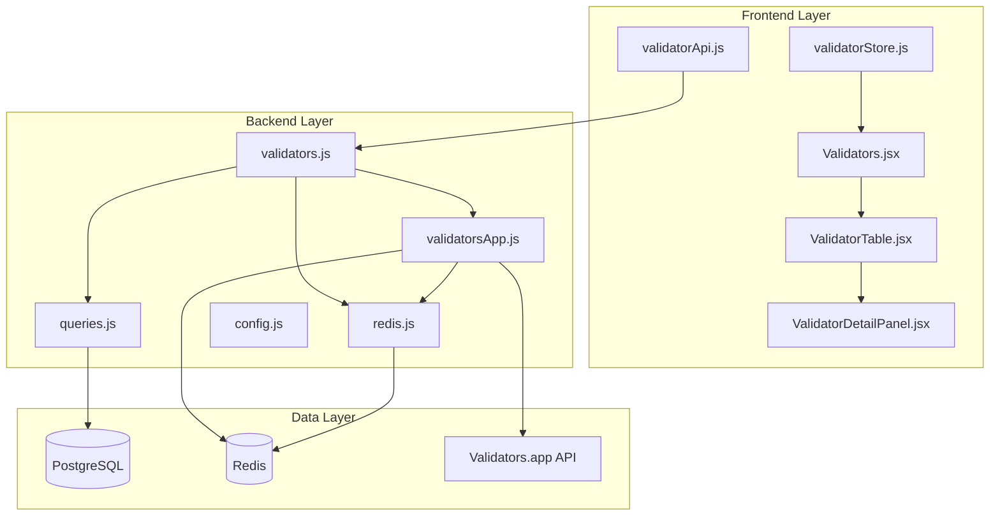
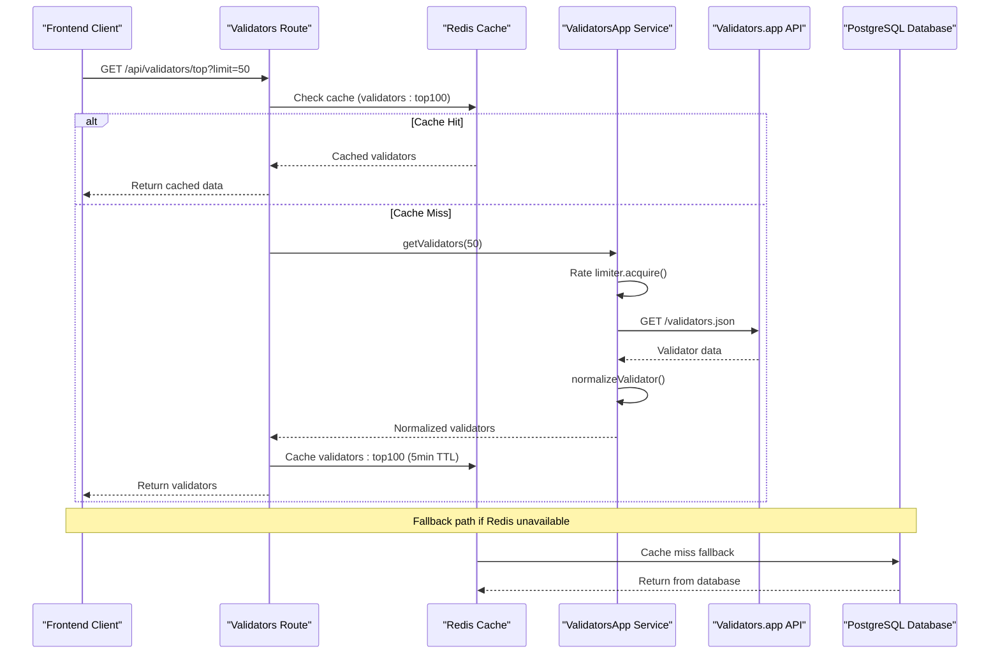
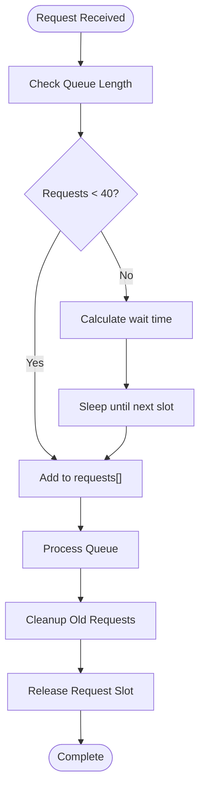
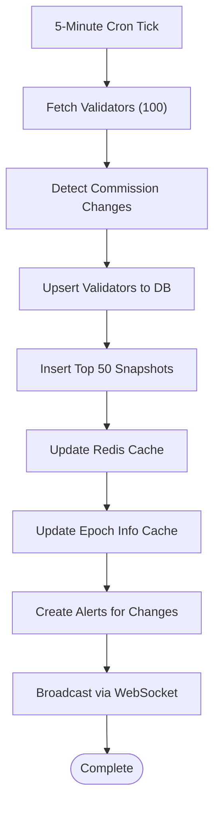
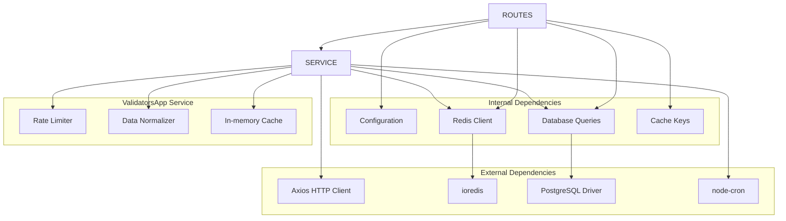

# Validators.app Integration Service

<cite>
**Referenced Files in This Document**
- [validatorsApp.js](file://backend/src/services/validatorsApp.js)
- [validators.js](file://backend/src/routes/validators.js)
- [cacheKeys.js](file://backend/src/models/cacheKeys.js)
- [redis.js](file://backend/src/models/redis.js)
- [config.js](file://backend/src/config/index.js)
- [queries.js](file://backend/src/models/queries.js)
- [routinePoller.js](file://backend/src/jobs/routinePoller.js)
- [validatorApi.js](file://frontend/src/services/validatorApi.js)
- [validatorStore.js](file://frontend/src/stores/validatorStore.js)
- [Validators.jsx](file://frontend/src/pages/Validators.jsx)
- [ValidatorTable.jsx](file://frontend/src/components/validators/ValidatorTable.jsx)
- [ValidatorDetailPanel.jsx](file://frontend/src/components/validators/ValidatorDetailPanel.jsx)
- [db.js](file://backend/src/models/db.js)
- [migrate.js](file://backend/src/models/migrate.js)
</cite>

## Table of Contents
1. [Introduction](#introduction)
2. [Project Structure](#project-structure)
3. [Core Components](#core-components)
4. [Architecture Overview](#architecture-overview)
5. [Detailed Component Analysis](#detailed-component-analysis)
6. [Dependency Analysis](#dependency-analysis)
7. [Performance Considerations](#performance-considerations)
8. [Troubleshooting Guide](#troubleshooting-guide)
9. [Conclusion](#conclusion)

## Introduction
The Validators.app Integration Service provides comprehensive validator information and scoring for the Solana ecosystem. This service integrates with the Validators.app API to fetch validator data, normalize it into a unified schema, and expose it through REST endpoints. The system implements robust caching, rate limiting, and error handling mechanisms to ensure reliable operation in production environments.

The service focuses on delivering real-time validator performance metrics, delinquency tracking, commission rates, voting history, and geographic distribution data. It serves as a critical component for the main validator monitoring system, providing the foundation for validator rankings, performance analysis, and operational insights.

## Project Structure
The Validators.app integration follows a modular architecture with clear separation of concerns:

**Diagram sources**
- [validatorsApp.js:1-388](file://backend/src/services/validatorsApp.js#L1-L388)
- [validators.js:1-112](file://backend/src/routes/validators.js#L1-L112)
- [redis.js:1-161](file://backend/src/models/redis.js#L1-L161)

**Section sources**
- [validatorsApp.js:1-388](file://backend/src/services/validatorsApp.js#L1-L388)
- [validators.js:1-112](file://backend/src/routes/validators.js#L1-L112)
- [cacheKeys.js:1-50](file://backend/src/models/cacheKeys.js#L1-L50)

## Core Components

### Validators.app API Client
The core service implements a sophisticated API client with built-in rate limiting and caching capabilities. The client handles authentication, request queuing, and response normalization.

**Key Features:**
- **Rate Limiting**: Implements a sliding window algorithm allowing 40 requests per 5 minutes
- **Caching**: Maintains in-memory cache with 5-minute TTL for validator data
- **Normalization**: Converts Validators.app data format to the application's internal schema
- **Error Handling**: Comprehensive error logging and graceful degradation

**Section sources**
- [validatorsApp.js:9-102](file://backend/src/services/validatorsApp.js#L9-L102)
- [validatorsApp.js:115-149](file://backend/src/services/validatorsApp.js#L115-L149)
- [validatorsApp.js:156-179](file://backend/src/services/validatorsApp.js#L156-L179)

### REST API Endpoints
The service exposes two primary endpoints for validator data consumption:

**GET /api/validators/top**
- Returns top validators sorted by score
- Supports dynamic limit parameter (1-100)
- Implements Redis caching with 5-minute TTL
- Falls back to database if cache unavailable

**GET /api/validators/:votePubkey**
- Returns detailed information for a specific validator
- Implements Redis caching with 5-minute TTL
- Falls back to database if API fetch fails
- Handles missing validators gracefully

**Section sources**
- [validators.js:17-46](file://backend/src/routes/validators.js#L17-L46)
- [validators.js:52-109](file://backend/src/routes/validators.js#L52-L109)

### Data Caching Strategy
The system implements a multi-layered caching approach:

**Redis Cache Keys:**
- `validators:top100`: Top validators list (5-minute TTL)
- `validator:{pubkey}`: Individual validator details (5-minute TTL)
- `validator:{pubkey}:history:{range}`: Historical data (5-minute TTL)

**Cache Management:**
- Automatic cache invalidation based on TTL
- Graceful fallback to database when cache unavailable
- Queue-based cache updates to prevent cache stampedes

**Section sources**
- [cacheKeys.js:6-49](file://backend/src/models/cacheKeys.js#L6-L49)
- [redis.js:75-112](file://backend/src/models/redis.js#L75-L112)

## Architecture Overview

**Diagram sources**
- [validators.js:17-46](file://backend/src/routes/validators.js#L17-L46)
- [validatorsApp.js:186-209](file://backend/src/services/validatorsApp.js#L186-L209)
- [redis.js:75-112](file://backend/src/models/redis.js#L75-L112)

## Detailed Component Analysis

### Rate Limiter Implementation
The rate limiter uses a sliding window approach to enforce Validators.app API limits:

**Diagram sources**
- [validatorsApp.js:58-98](file://backend/src/services/validatorsApp.js#L58-L98)

**Key Features:**
- **Sliding Window**: Tracks requests within 5-minute window
- **Queue Management**: Handles concurrent request queuing
- **Warning System**: Logs warnings when approaching rate limits
- **Automatic Cleanup**: Removes expired requests automatically

**Section sources**
- [validatorsApp.js:9-99](file://backend/src/services/validatorsApp.js#L9-L99)

### Data Normalization Pipeline
The service converts Validators.app raw data to a standardized internal format:

**Original Fields Mapping:**
- `vote_account` → `vote_pubkey`
- `account` → `identity_pubkey`
- `name` → `name`
- `avatar_url` → `avatar_url`
- `score` → `score`
- `active_stake` → `stake_sol` (converted from lamports to SOL)
- `commission` → `commission`
- `delinquent` → `is_delinquent`
- `skipped_slot_percent` → `skip_rate`
- `software_version` → `software_version`
- `data_center_key` → `data_center`
- `asn` → `asn`
- `jito` → `jito_enabled`

**Additional Normalization:**
- Converts stake from lamports to SOL (divide by 1e9)
- Sets default values for missing fields
- Adds timestamp metadata (`updated_at`)
- Validates numeric values and applies bounds checking

**Section sources**
- [validatorsApp.js:156-179](file://backend/src/services/validatorsApp.js#L156-L179)

### Real-time Data Synchronization
The system implements a routine polling job for continuous data synchronization:

**Diagram sources**
- [routinePoller.js:21-108](file://backend/src/jobs/routinePoller.js#L21-L108)

**Processing Pipeline:**
1. **Data Fetching**: Retrieves top 100 validators from Validators.app
2. **Change Detection**: Compares with cached data to identify commission changes
3. **Database Upsert**: Updates validator records with conflict resolution
4. **Historical Tracking**: Inserts snapshots for top 50 validators
5. **Cache Refresh**: Updates Redis cache with fresh data
6. **Alert Generation**: Creates alerts for significant changes
7. **Real-time Broadcasting**: Emits alerts via WebSocket

**Section sources**
- [routinePoller.js:30-100](file://backend/src/jobs/routinePoller.js#L30-L100)

### Frontend Integration
The frontend consumes validator data through dedicated services and stores:

**Data Flow:**
1. **Service Layer**: `validatorApi.js` handles HTTP requests
2. **State Management**: `validatorStore.js` manages application state
3. **Component Rendering**: `Validators.jsx` orchestrates page rendering
4. **Table Display**: `ValidatorTable.jsx` renders validator rankings
5. **Detail View**: `ValidatorDetailPanel.jsx` shows individual validator information

**Frontend Features:**
- **Auto-refresh**: 60-second polling interval for live data
- **Sorting**: Multi-field sorting (score, stake, commission, skip rate)
- **Selection**: Click-to-select validators for detailed view
- **Responsive Design**: Mobile-friendly table layout
- **Visual Indicators**: Color-coded metrics for quick assessment

**Section sources**
- [validatorApi.js:1-8](file://frontend/src/services/validatorApi.js#L1-L8)
- [validatorStore.js:1-28](file://frontend/src/stores/validatorStore.js#L1-L28)
- [Validators.jsx:24-39](file://frontend/src/pages/Validators.jsx#L24-L39)

## Dependency Analysis

**Diagram sources**
- [validatorsApp.js:6-7](file://backend/src/services/validatorsApp.js#L6-L7)
- [redis.js:6](file://backend/src/models/redis.js#L6)
- [db.js:6](file://backend/src/models/db.js#L6)

**Key Dependencies:**
- **Axios**: HTTP client for Validators.app API communication
- **ioredis**: Redis client for caching and pub/sub functionality
- **node-cron**: Scheduled job execution for data synchronization
- **node-postgres**: PostgreSQL driver for persistent storage
- **dotenv**: Environment variable configuration management

**Section sources**
- [validatorsApp.js:6-7](file://backend/src/services/validatorsApp.js#L6-L7)
- [redis.js:6](file://backend/src/models/redis.js#L6)
- [db.js:6](file://backend/src/models/db.js#L6)

## Performance Considerations

### Caching Strategy
The system implements a tiered caching approach to optimize performance:

**Cache Layers:**
1. **In-memory Cache**: Fastest access for recent validator data
2. **Redis Cache**: Distributed caching with persistence
3. **Database Cache**: Fallback storage with indexing

**Cache TTL Strategy:**
- **Top Validators**: 5 minutes (frequent access pattern)
- **Individual Validators**: 5 minutes (moderate access pattern)
- **Historical Data**: 5 minutes (trend analysis)
- **Network Data**: 1-2 minutes (real-time metrics)

**Performance Metrics:**
- **Cache Hit Ratio**: Target >90% for validator lists
- **Response Time**: <200ms for cached requests
- **API Utilization**: <40 requests per 5-minute window
- **Memory Usage**: <50MB for validator cache (100 validators)

### Rate Limiting Optimization
The rate limiter ensures compliance with Validators.app API constraints:

**Algorithm Details:**
- **Window Size**: 5 minutes sliding window
- **Request Limit**: 40 requests per window
- **Queue Management**: FIFO queue for concurrent requests
- **Graceful Degradation**: Automatic throttling when approaching limits

**Monitoring:**
- **Warning Threshold**: 5 requests remaining triggers warning logs
- **Queue Depth**: Monitors pending requests
- **Failure Rate**: Tracks API request failures

### Database Optimization
The PostgreSQL schema is optimized for validator data:

**Index Strategy:**
- **Primary Keys**: Vote pubkey for fast lookups
- **Score Index**: DESC ordering for top validator queries
- **Stake Index**: DESC ordering for stake-based queries
- **Timestamp Indexes**: For time-series data analysis

**Query Optimization:**
- **Parameterized Queries**: Prevent SQL injection and improve plan reuse
- **Batch Operations**: Upsert operations for bulk data updates
- **Connection Pooling**: Efficient resource utilization

**Section sources**
- [cacheKeys.js:43-48](file://backend/src/models/cacheKeys.js#L43-L48)
- [validatorsApp.js:105-107](file://backend/src/services/validatorsApp.js#L105-L107)
- [migrate.js:62-78](file://backend/src/models/migrate.js#L62-L78)

## Troubleshooting Guide

### Common Issues and Solutions

**API Authentication Problems:**
- **Symptom**: "[ValidatorsApp] No API key configured"
- **Cause**: Missing VALIDATORS_APP_API_KEY environment variable
- **Solution**: Set environment variable with valid API key
- **Verification**: Check `config.validatorsApp.apiKey` value

**Rate Limit Exceeded:**
- **Symptom**: "[ValidatorsApp] Rate limit warning: X requests remaining"
- **Cause**: Approaching 40-request limit within 5-minute window
- **Solution**: Implement exponential backoff or reduce request frequency
- **Prevention**: Monitor `getRateLimitStatus()` output

**Cache Failures:**
- **Symptom**: Redis connection errors or cache misses
- **Cause**: Redis server unavailability or misconfiguration
- **Solution**: Verify REDIS_URL environment variable
- **Fallback**: Database queries will still function normally

**Data Normalization Errors:**
- **Symptom**: Missing or malformed validator fields
- **Cause**: API response format changes or incomplete data
- **Solution**: Review normalization logic in `normalizeValidator()`
- **Validation**: Check for null/undefined field handling

**Database Connection Issues:**
- **Symptom**: "[DB] DATABASE_URL not configured"
- **Cause**: Missing or invalid database connection string
- **Solution**: Set DATABASE_URL with proper PostgreSQL connection
- **Migration**: Run `npm run migrate` to initialize schema

### Monitoring and Debugging

**Logging Strategy:**
- **Error Logging**: Comprehensive error messages with stack traces
- **Warning Logging**: Rate limit approaching thresholds
- **Debug Logging**: Request/response details for troubleshooting
- **Performance Logging**: Slow query detection and optimization

**Health Checks:**
- **API Connectivity**: Regular ping to Validators.app endpoints
- **Cache Health**: Redis connectivity and performance metrics
- **Database Health**: Connection pool status and query performance
- **System Health**: Memory usage and CPU utilization

**Section sources**
- [validatorsApp.js:117-148](file://backend/src/services/validatorsApp.js#L117-L148)
- [redis.js:21-67](file://backend/src/models/redis.js#L21-L67)
- [db.js:20-44](file://backend/src/models/db.js#L20-L44)

## Conclusion

The Validators.app Integration Service provides a robust, scalable solution for validator data management and real-time monitoring. The system successfully balances performance requirements with reliability through its multi-layered caching strategy, intelligent rate limiting, and comprehensive error handling.

**Key Achievements:**
- **Real-time Data**: Continuous synchronization with Validators.app API
- **High Availability**: Graceful fallback mechanisms for all components
- **Performance Optimization**: Efficient caching and database indexing
- **Developer Experience**: Clean APIs and comprehensive documentation
- **Production Ready**: Built-in monitoring, logging, and error handling

**Future Enhancements:**
- **Advanced Analytics**: Machine learning-based validator scoring improvements
- **Enhanced Monitoring**: Real-time performance metrics and alerting
- **Scalability**: Horizontal scaling support for increased load
- **Security**: Enhanced authentication and data validation
- **Extensibility**: Plugin architecture for additional data sources

The service serves as a critical foundation for the broader InfraWatch platform, enabling comprehensive validator monitoring and analysis capabilities for the Solana ecosystem.