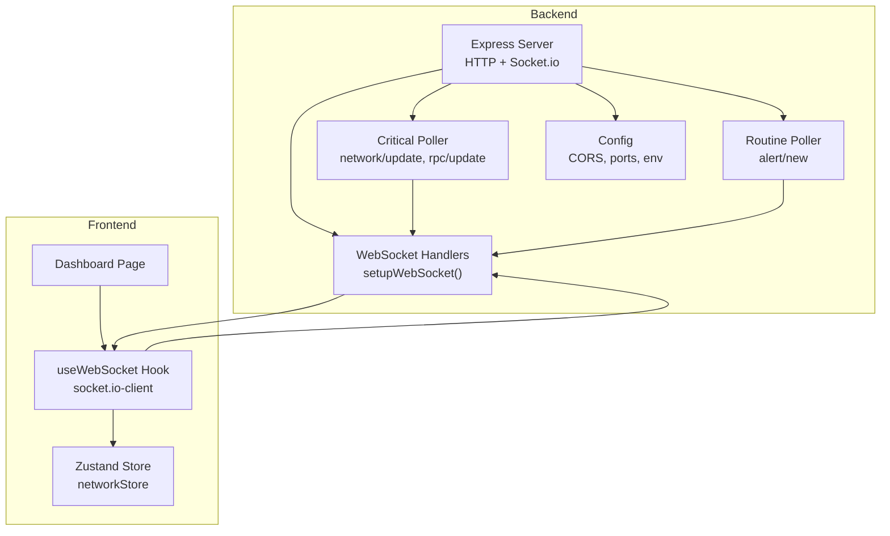
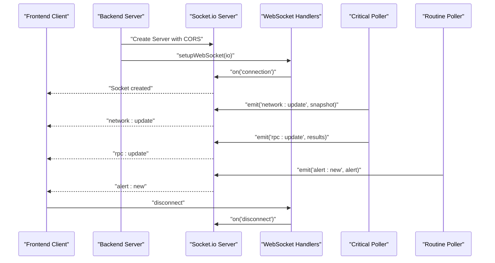
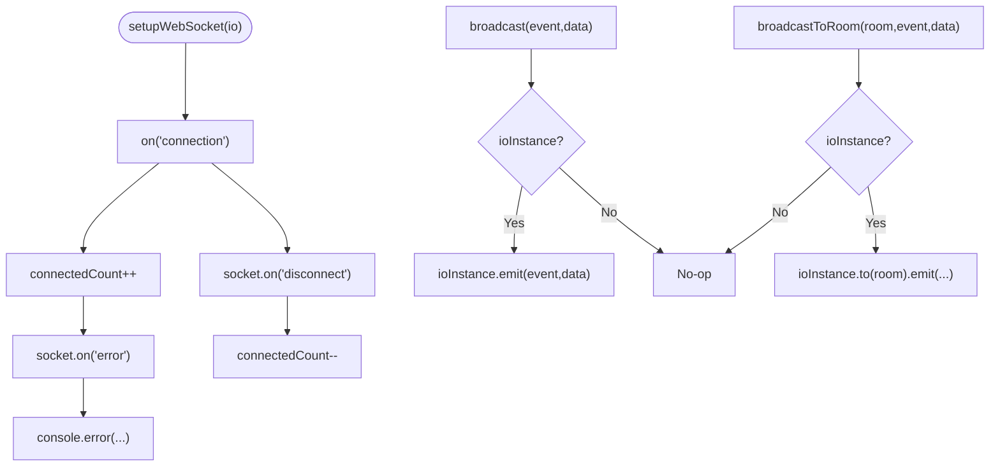
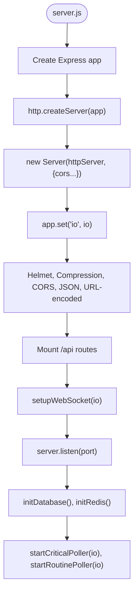
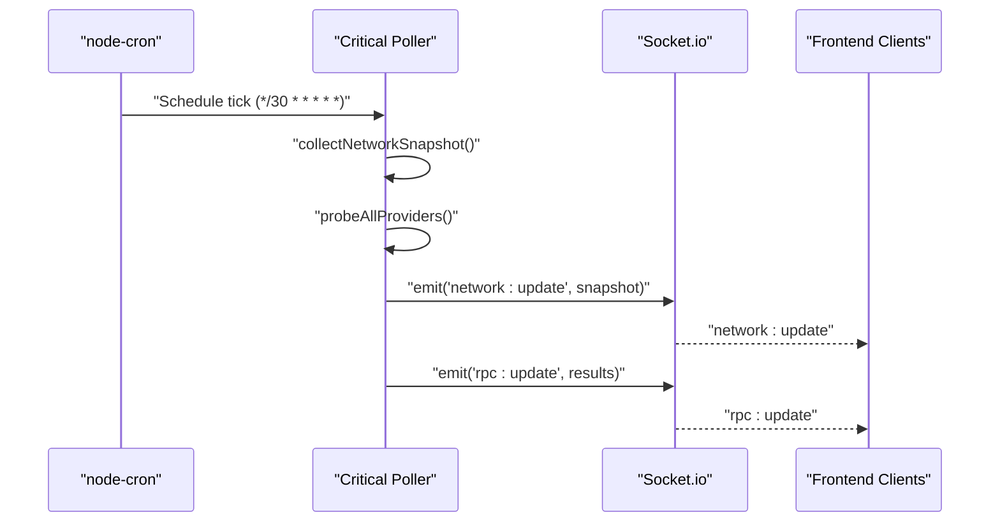
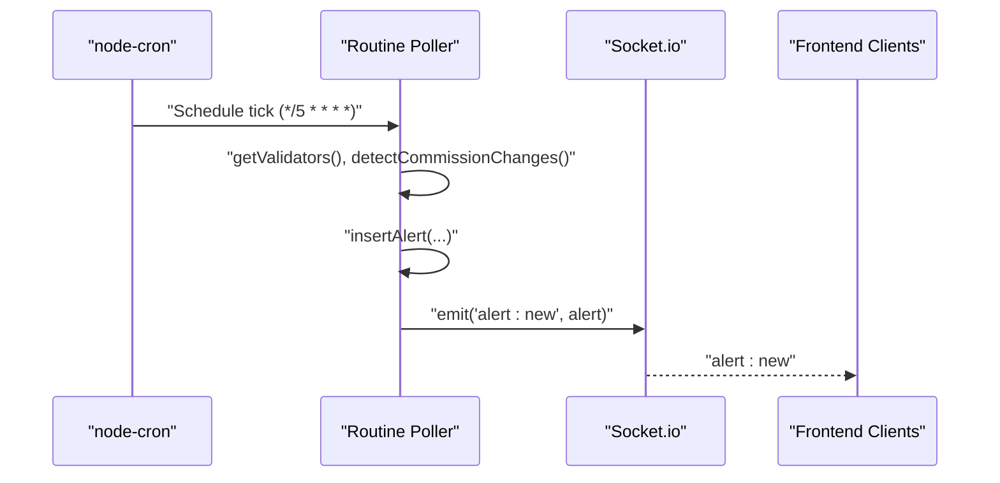
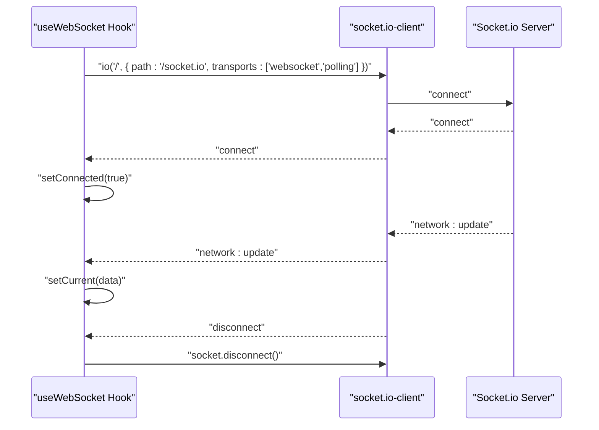
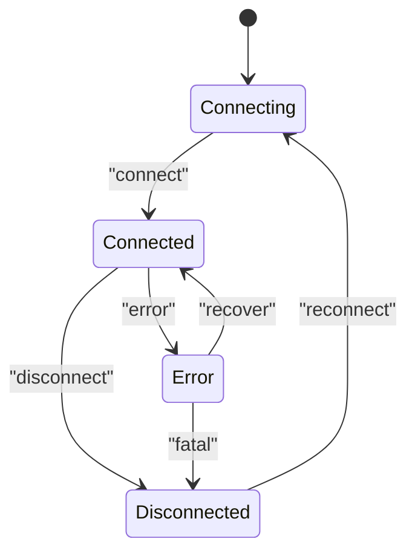
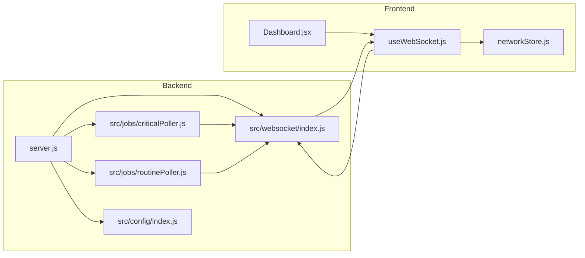

# WebSocket Communication

<cite>
**Referenced Files in This Document**
- [server.js](file://backend/server.js)
- [index.js](file://backend/src/websocket/index.js)
- [index.js](file://backend/src/config/index.js)
- [criticalPoller.js](file://backend/src/jobs/criticalPoller.js)
- [routinePoller.js](file://backend/src/jobs/routinePoller.js)
- [useWebSocket.js](file://frontend/src/hooks/useWebSocket.js)
- [networkStore.js](file://frontend/src/stores/networkStore.js)
- [Dashboard.jsx](file://frontend/src/pages/Dashboard.jsx)
- [networkApi.js](file://frontend/src/services/networkApi.js)
- [package.json](file://backend/package.json)
- [package.json](file://frontend/package.json)
</cite>

## Table of Contents
1. [Introduction](#introduction)
2. [Project Structure](#project-structure)
3. [Core Components](#core-components)
4. [Architecture Overview](#architecture-overview)
5. [Detailed Component Analysis](#detailed-component-analysis)
6. [Dependency Analysis](#dependency-analysis)
7. [Performance Considerations](#performance-considerations)
8. [Troubleshooting Guide](#troubleshooting-guide)
9. [Conclusion](#conclusion)
10. [Appendices](#appendices)

## Introduction
This document explains the InfraWatch WebSocket communication system built on Socket.io. It covers server setup, connection lifecycle, real-time broadcasting, event emission patterns, and client–server communication protocols. It also documents how the backend streams network updates and RPC health data to the frontend, how rooms and targeted broadcasting could be introduced, and how to debug and optimize WebSocket performance.

## Project Structure
The WebSocket implementation spans the backend server and frontend client:

- Backend
  - HTTP server and Socket.io setup
  - WebSocket handlers and broadcasting utilities
  - Pollers that emit real-time events
  - Configuration for CORS and runtime behavior
- Frontend
  - WebSocket client hook connecting to the backend
  - Zustand store for network state and connection status
  - Dashboard page subscribing to real-time updates

**Diagram sources**
- [server.js:34-107](file://backend/server.js#L34-L107)
- [index.js:13-33](file://backend/src/websocket/index.js#L13-L33)
- [criticalPoller.js:21-100](file://backend/src/jobs/criticalPoller.js#L21-L100)
- [routinePoller.js:20-108](file://backend/src/jobs/routinePoller.js#L20-L108)
- [index.js:27-65](file://backend/src/config/index.js#L27-L65)
- [useWebSocket.js:5-29](file://frontend/src/hooks/useWebSocket.js#L5-L29)
- [networkStore.js:3-22](file://frontend/src/stores/networkStore.js#L3-L22)
- [Dashboard.jsx:19-47](file://frontend/src/pages/Dashboard.jsx#L19-L47)

**Section sources**
- [server.js:34-107](file://backend/server.js#L34-L107)
- [index.js:13-33](file://backend/src/websocket/index.js#L13-L33)
- [useWebSocket.js:5-29](file://frontend/src/hooks/useWebSocket.js#L5-L29)
- [networkStore.js:3-22](file://frontend/src/stores/networkStore.js#L3-L22)
- [Dashboard.jsx:19-47](file://frontend/src/pages/Dashboard.jsx#L19-L47)

## Core Components
- Backend Socket.io server and CORS policy
- WebSocket handler module for connection lifecycle and broadcasting
- Pollers emitting real-time events to clients
- Frontend WebSocket client hook and state store

Key responsibilities:
- Server initializes HTTP and Socket.io, applies middleware, mounts routes, and starts pollers.
- WebSocket module tracks connections, logs lifecycle events, and exposes broadcast utilities.
- Pollers compute network and RPC data and emit structured events.
- Frontend connects via socket.io-client, listens for events, and updates local state.

**Section sources**
- [server.js:39-81](file://backend/server.js#L39-L81)
- [index.js:13-81](file://backend/src/websocket/index.js#L13-L81)
- [criticalPoller.js:88-92](file://backend/src/jobs/criticalPoller.js#L88-L92)
- [routinePoller.js:96-100](file://backend/src/jobs/routinePoller.js#L96-L100)
- [useWebSocket.js:5-29](file://frontend/src/hooks/useWebSocket.js#L5-L29)

## Architecture Overview
The backend runs an Express server with Socket.io. The server creates the Socket.io instance, configures CORS, and passes it to the WebSocket setup module. Two periodic jobs emit events to connected clients. The frontend establishes a persistent WebSocket connection and reacts to emitted events.

**Diagram sources**
- [server.js:39-81](file://backend/server.js#L39-L81)
- [index.js:16-30](file://backend/src/websocket/index.js#L16-L30)
- [criticalPoller.js:88-92](file://backend/src/jobs/criticalPoller.js#L88-L92)
- [routinePoller.js:96-100](file://backend/src/jobs/routinePoller.js#L96-L100)
- [useWebSocket.js:8-27](file://frontend/src/hooks/useWebSocket.js#L8-L27)

## Detailed Component Analysis

### Backend WebSocket Setup and Broadcasting
- Connection lifecycle
  - Tracks connected sockets and logs connect/disconnect reasons.
  - Emits structured logs for errors.
- Broadcasting utilities
  - Broadcast to all clients.
  - Broadcast to a named room (to be joined by clients).
  - Exposes connection count for observability.

**Diagram sources**
- [index.js:13-81](file://backend/src/websocket/index.js#L13-L81)

**Section sources**
- [index.js:13-81](file://backend/src/websocket/index.js#L13-L81)

### Server Initialization and CORS
- Creates HTTP server and Socket.io with CORS configuration from environment.
- Exposes io globally via Express app for use by other modules.
- Applies Helmet, compression, and CORS middleware.
- Starts pollers after server listen and data stores initialization.

**Diagram sources**
- [server.js:34-107](file://backend/server.js#L34-L107)
- [index.js:61-65](file://backend/src/config/index.js#L61-L65)

**Section sources**
- [server.js:39-107](file://backend/server.js#L39-L107)
- [index.js:61-65](file://backend/src/config/index.js#L61-L65)

### Real-Time Data Streaming: Critical Poller
- Frequency: Every 30 seconds.
- Emits:
  - network:update: Snapshot of network metrics.
  - rpc:update: Latest RPC provider health checks.
- Graceful failures: Logs warnings and continues.

**Diagram sources**
- [criticalPoller.js:21-100](file://backend/src/jobs/criticalPoller.js#L21-L100)

**Section sources**
- [criticalPoller.js:21-100](file://backend/src/jobs/criticalPoller.js#L21-L100)

### Real-Time Data Streaming: Routine Poller
- Frequency: Every 5 minutes.
- Emits:
  - alert:new: New validator commission change alerts.
- Graceful failures: Logs warnings and continues.

**Diagram sources**
- [routinePoller.js:20-108](file://backend/src/jobs/routinePoller.js#L20-L108)

**Section sources**
- [routinePoller.js:20-108](file://backend/src/jobs/routinePoller.js#L20-L108)

### Frontend WebSocket Client Integration
- Establishes a persistent connection to the backend with transports including WebSocket and polling.
- Listens for connect/disconnect events and updates connection state.
- Subscribes to network:update to keep current metrics in sync.
- Disconnects on component cleanup.

**Diagram sources**
- [useWebSocket.js:5-29](file://frontend/src/hooks/useWebSocket.js#L5-L29)

**Section sources**
- [useWebSocket.js:5-29](file://frontend/src/hooks/useWebSocket.js#L5-L29)
- [networkStore.js:3-22](file://frontend/src/stores/networkStore.js#L3-L22)
- [Dashboard.jsx:19-47](file://frontend/src/pages/Dashboard.jsx#L19-L47)

### Message Formatting and Event-Driven Updates
- network:update: Emitted by the critical poller with a snapshot containing timestamp, health, TPS, slot metrics, epoch info, delinquent validators, average confirmation time, congestion score, and priority fees.
- rpc:update: Emitted by the critical poller with latest RPC provider health checks.
- alert:new: Emitted by the routine poller with alert metadata and details.

These events carry structured payloads suitable for immediate rendering in the frontend store.

**Section sources**
- [criticalPoller.js:88-92](file://backend/src/jobs/criticalPoller.js#L88-L92)
- [routinePoller.js:96-100](file://backend/src/jobs/routinePoller.js#L96-L100)

### Connection Lifecycle Management
- Connection establishment: Frontend connects with a path configured for Socket.io.
- Disconnection handling: Logs and sets connection state to false.
- Error handling: Logs socket errors during connection lifecycle.
- Graceful shutdown: Server handles SIGTERM/SIGINT to close HTTP server cleanly.

**Diagram sources**
- [index.js:16-30](file://backend/src/websocket/index.js#L16-L30)
- [useWebSocket.js:11-27](file://frontend/src/hooks/useWebSocket.js#L11-L27)
- [server.js:109-124](file://backend/server.js#L109-L124)

**Section sources**
- [index.js:16-30](file://backend/src/websocket/index.js#L16-L30)
- [useWebSocket.js:11-27](file://frontend/src/hooks/useWebSocket.js#L11-L27)
- [server.js:109-124](file://backend/server.js#L109-L124)

### Authentication for WebSocket Connections
- Current implementation does not enforce authentication for WebSocket connections.
- Authentication can be added by validating tokens in the Socket.io connection handler and emitting an error or disconnecting unauthorized clients.

[No sources needed since this section provides general guidance]

### Client Subscription Patterns
- The current implementation broadcasts to all clients. To support targeted subscriptions:
  - Clients join rooms via a dedicated join event.
  - Backend emits to specific rooms using the broadcastToRoom utility.
  - Rooms can represent user sessions, validator groups, or data channels.

[No sources needed since this section provides general guidance]

### Managing Connection Scaling
- Horizontal scaling requires sticky sessions or shared state for rooms.
- Consider clustering with a shared state store (e.g., Redis) to coordinate rooms across instances.
- Monitor connection counts and adjust autoscaling thresholds accordingly.

[No sources needed since this section provides general guidance]

## Dependency Analysis
- Backend dependencies
  - socket.io for real-time bidirectional communication.
  - node-cron for scheduling periodic jobs.
  - @solana/web3.js for fetching network metrics.
  - ioredis and pg for caching and persistence.
- Frontend dependencies
  - socket.io-client for connecting to the backend.
  - zustand for global state management.

**Diagram sources**
- [server.js:34-107](file://backend/server.js#L34-L107)
- [index.js:13-81](file://backend/src/websocket/index.js#L13-L81)
- [criticalPoller.js:21-100](file://backend/src/jobs/criticalPoller.js#L21-L100)
- [routinePoller.js:20-108](file://backend/src/jobs/routinePoller.js#L20-L108)
- [index.js:27-65](file://backend/src/config/index.js#L27-L65)
- [useWebSocket.js:5-29](file://frontend/src/hooks/useWebSocket.js#L5-L29)
- [networkStore.js:3-22](file://frontend/src/stores/networkStore.js#L3-L22)
- [Dashboard.jsx:19-47](file://frontend/src/pages/Dashboard.jsx#L19-L47)

**Section sources**
- [package.json:22-34](file://backend/package.json#L22-L34)
- [package.json:12-26](file://frontend/package.json#L12-L26)

## Performance Considerations
- Keep messages compact and avoid unnecessary payloads.
- Use batching for frequent updates if needed.
- Monitor connection counts and server resources; consider load balancing and sticky sessions for horizontal scaling.
- Tune poller intervals to balance freshness and resource usage.
- Enable compression and secure headers on the backend.

[No sources needed since this section provides general guidance]

## Troubleshooting Guide
- Verify CORS configuration matches frontend origin and path.
- Confirm Socket.io path alignment between frontend and backend.
- Check server logs for connection and error events.
- Validate environment variables for ports and origins.
- Use browser developer tools to inspect WebSocket frames and network activity.

**Section sources**
- [index.js:61-65](file://backend/src/config/index.js#L61-L65)
- [useWebSocket.js:9-13](file://frontend/src/hooks/useWebSocket.js#L9-L13)
- [index.js:16-30](file://backend/src/websocket/index.js#L16-L30)
- [server.js:84-87](file://backend/server.js#L84-L87)

## Conclusion
InfraWatch’s WebSocket system leverages Socket.io to deliver real-time network and RPC updates to the frontend. The backend initializes the server, manages connections, and emits structured events from periodic jobs. The frontend consumes these events to maintain an up-to-date view of the network. Extending the system with rooms, authentication, and scaling strategies will further enhance reliability and user experience.

[No sources needed since this section summarizes without analyzing specific files]

## Appendices

### Example: Broadcasting Network Updates
- Backend emits network snapshots and RPC results every 30 seconds.
- Frontend receives and updates current state.

**Section sources**
- [criticalPoller.js:88-92](file://backend/src/jobs/criticalPoller.js#L88-L92)
- [useWebSocket.js:21-23](file://frontend/src/hooks/useWebSocket.js#L21-L23)

### Example: Handling Client Subscriptions
- Join a room on demand and emit to that room for targeted updates.

[No sources needed since this section provides general guidance]

### Example: Managing Connection Scaling
- Use sticky sessions or shared state for rooms across instances.

[No sources needed since this section provides general guidance]