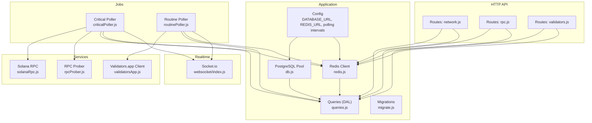
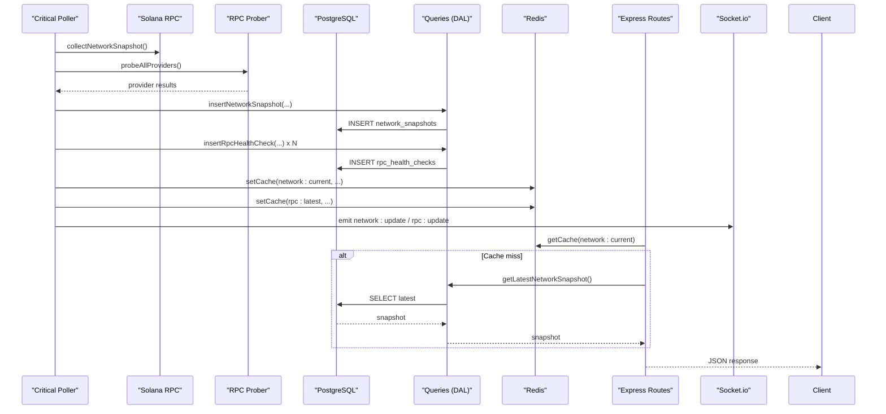
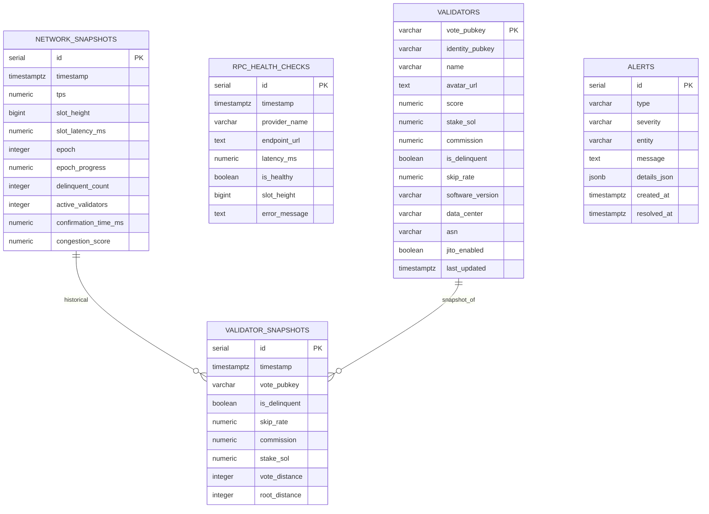
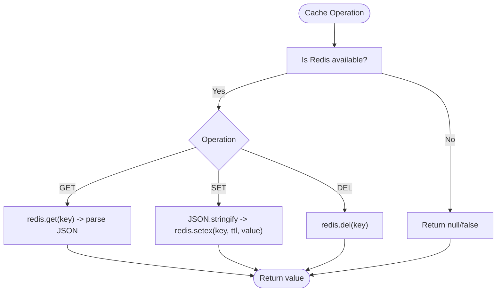
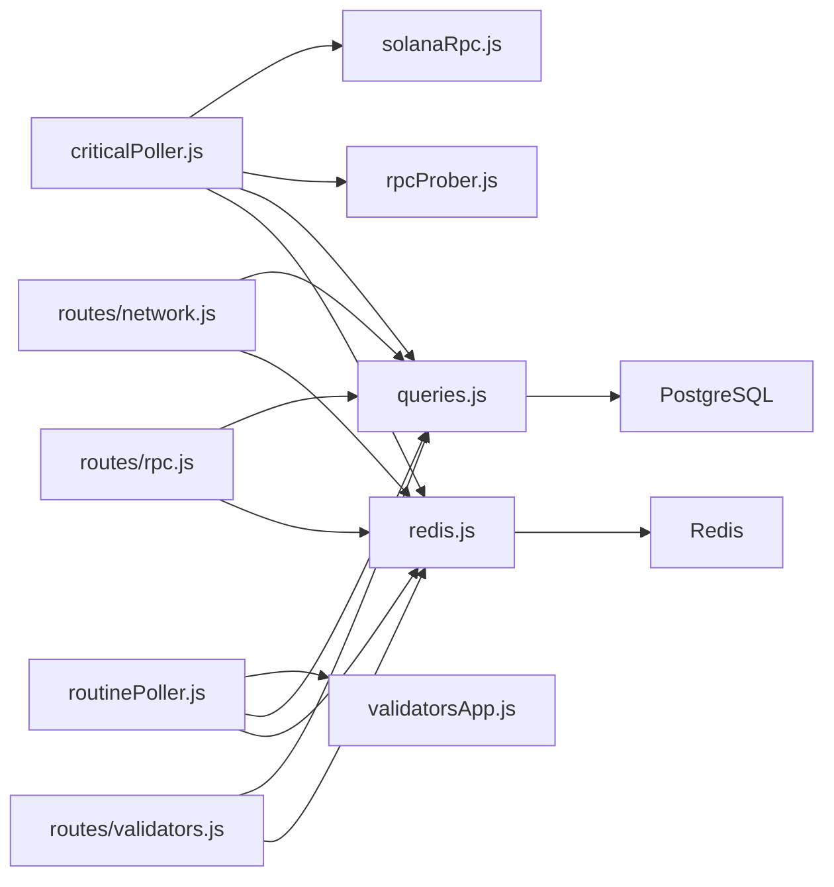

# Data Models & Database Schema

<cite>
**Referenced Files in This Document**
- [db.js](file://backend/src/models/db.js)
- [migrate.js](file://backend/src/models/migrate.js)
- [queries.js](file://backend/src/models/queries.js)
- [redis.js](file://backend/src/models/redis.js)
- [cacheKeys.js](file://backend/src/models/cacheKeys.js)
- [config/index.js](file://backend/src/config/index.js)
- [server.js](file://backend/server.js)
- [websocket/index.js](file://backend/src/websocket/index.js)
- [jobs/criticalPoller.js](file://backend/src/jobs/criticalPoller.js)
- [jobs/routinePoller.js](file://backend/src/jobs/routinePoller.js)
- [services/solanaRpc.js](file://backend/src/services/solanaRpc.js)
- [services/rpcProber.js](file://backend/src/services/rpcProber.js)
- [services/validatorsApp.js](file://backend/src/services/validatorsApp.js)
- [routes/network.js](file://backend/src/routes/network.js)
- [routes/rpc.js](file://backend/src/routes/rpc.js)
- [routes/validators.js](file://backend/src/routes/validators.js)
</cite>

## Table of Contents
1. [Introduction](#introduction)
2. [Project Structure](#project-structure)
3. [Core Components](#core-components)
4. [Architecture Overview](#architecture-overview)
5. [Detailed Component Analysis](#detailed-component-analysis)
6. [Dependency Analysis](#dependency-analysis)
7. [Performance Considerations](#performance-considerations)
8. [Troubleshooting Guide](#troubleshooting-guide)
9. [Conclusion](#conclusion)
10. [Appendices](#appendices)

## Introduction
This document provides comprehensive data model documentation for InfraWatch’s database schema and caching strategy. It details entity relationships, field definitions, data types, constraints, and indexes for network snapshots, RPC health checks, and validator information. It also explains data validation rules, business logic constraints, data lifecycle management, PostgreSQL schema diagrams, sample data examples, and data access patterns. Additionally, it documents the Redis cache implementation, cache key management, TTL configuration, and caching strategies for real-time data.

## Project Structure
The backend follows a layered architecture:
- Configuration and environment loading
- Data access layer (PostgreSQL via node-pg, Redis via ioredis)
- Services for Solana RPC, RPC probing, and external APIs
- Jobs for periodic data collection and caching
- Express routes implementing cache-first data access patterns
- WebSocket for real-time broadcasting

**Diagram sources**
- [config/index.js:1-68](file://backend/src/config/index.js#L1-L68)
- [db.js:1-98](file://backend/src/models/db.js#L1-L98)
- [redis.js:1-161](file://backend/src/models/redis.js#L1-L161)
- [migrate.js:1-160](file://backend/src/models/migrate.js#L1-L160)
- [queries.js:1-459](file://backend/src/models/queries.js#L1-L459)
- [jobs/criticalPoller.js:1-108](file://backend/src/jobs/criticalPoller.js#L1-L108)
- [jobs/routinePoller.js:1-116](file://backend/src/jobs/routinePoller.js#L1-L116)
- [services/solanaRpc.js:1-340](file://backend/src/services/solanaRpc.js#L1-L340)
- [services/rpcProber.js:1-342](file://backend/src/services/rpcProber.js#L1-L342)
- [services/validatorsApp.js:1-388](file://backend/src/services/validatorsApp.js#L1-L388)
- [routes/network.js:1-135](file://backend/src/routes/network.js#L1-L135)
- [routes/rpc.js:1-135](file://backend/src/routes/rpc.js#L1-L135)
- [routes/validators.js:1-112](file://backend/src/routes/validators.js#L1-L112)
- [websocket/index.js:1-81](file://backend/src/websocket/index.js#L1-L81)

**Section sources**
- [server.js:1-128](file://backend/server.js#L1-L128)
- [config/index.js:1-68](file://backend/src/config/index.js#L1-L68)

## Core Components
- Database connection and pooling: node-pg Pool with lazy initialization, connection testing, and error handling.
- Redis client: ioredis with retry strategy, ready/connect events, and graceful fallbacks.
- Data Access Layer (DAL): parameterized queries for all operations, centralized in queries.js.
- Migrations: CREATE TABLE statements for network snapshots, RPC health checks, validators, validator snapshots, and alerts, plus supporting indexes.
- Cache keys and TTLs: centralized constants and TTL values for cache keys.

**Section sources**
- [db.js:1-98](file://backend/src/models/db.js#L1-L98)
- [redis.js:1-161](file://backend/src/models/redis.js#L1-L161)
- [queries.js:1-459](file://backend/src/models/queries.js#L1-L459)
- [migrate.js:1-160](file://backend/src/models/migrate.js#L1-L160)
- [cacheKeys.js:1-50](file://backend/src/models/cacheKeys.js#L1-L50)

## Architecture Overview
InfraWatch collects real-time network metrics and RPC health signals, persists them to PostgreSQL, caches hot-path data in Redis, and exposes it via REST endpoints with cache-first patterns. WebSocket broadcasts updates to connected clients.

**Diagram sources**
- [jobs/criticalPoller.js:1-108](file://backend/src/jobs/criticalPoller.js#L1-L108)
- [services/solanaRpc.js:1-340](file://backend/src/services/solanaRpc.js#L1-L340)
- [services/rpcProber.js:1-342](file://backend/src/services/rpcProber.js#L1-L342)
- [queries.js:1-459](file://backend/src/models/queries.js#L1-L459)
- [redis.js:1-161](file://backend/src/models/redis.js#L1-L161)
- [routes/network.js:1-135](file://backend/src/routes/network.js#L1-L135)

## Detailed Component Analysis

### PostgreSQL Schema and Entities

#### Entity: network_snapshots
- Purpose: Time-series records of network health collected every 30 seconds.
- Fields:
  - id: SERIAL PRIMARY KEY
  - timestamp: TIMESTAMPTZ NOT NULL DEFAULT NOW()
  - tps: NUMERIC(10,2)
  - slot_height: BIGINT
  - slot_latency_ms: NUMERIC(10,2)
  - epoch: INTEGER
  - epoch_progress: NUMERIC(5,2)
  - delinquent_count: INTEGER
  - active_validators: INTEGER
  - confirmation_time_ms: NUMERIC(10,2)
  - congestion_score: NUMERIC(5,2)
- Indexes:
  - idx_network_snapshots_timestamp: timestamp DESC
- Notes:
  - Used by critical poller and network routes.
  - Time-series optimized by timestamp index.

**Section sources**
- [migrate.js:11-29](file://backend/src/models/migrate.js#L11-L29)
- [queries.js:13-84](file://backend/src/models/queries.js#L13-L84)
- [jobs/criticalPoller.js:32-63](file://backend/src/jobs/criticalPoller.js#L32-L63)
- [routes/network.js:81-132](file://backend/src/routes/network.js#L81-L132)

#### Entity: rpc_health_checks
- Purpose: Per-provider health checks collected every 30 seconds.
- Fields:
  - id: SERIAL PRIMARY KEY
  - timestamp: TIMESTAMPTZ NOT NULL DEFAULT NOW()
  - provider_name: VARCHAR(50) NOT NULL
  - endpoint_url: TEXT
  - latency_ms: NUMERIC(10,2)
  - is_healthy: BOOLEAN DEFAULT true
  - slot_height: BIGINT
  - error_message: TEXT
- Indexes:
  - idx_rpc_health_provider: (provider_name, timestamp DESC)
- Notes:
  - Used by critical poller and RPC routes.
  - Composite index supports provider-scoped queries.

**Section sources**
- [migrate.js:30-43](file://backend/src/models/migrate.js#L30-L43)
- [queries.js:90-156](file://backend/src/models/queries.js#L90-L156)
- [jobs/criticalPoller.js:45-78](file://backend/src/jobs/criticalPoller.js#L45-L78)
- [routes/rpc.js:90-132](file://backend/src/routes/rpc.js#L90-L132)

#### Entity: validators
- Purpose: Current validator state (upserted every 5 minutes).
- Fields:
  - vote_pubkey: VARCHAR(50) PRIMARY KEY
  - identity_pubkey: VARCHAR(50)
  - name: VARCHAR(200)
  - avatar_url: TEXT
  - score: NUMERIC(5,2)
  - stake_sol: NUMERIC(20,4)
  - commission: NUMERIC(5,2)
  - is_delinquent: BOOLEAN DEFAULT false
  - skip_rate: NUMERIC(5,4)
  - software_version: VARCHAR(50)
  - data_center: VARCHAR(100)
  - asn: VARCHAR(50)
  - jito_enabled: BOOLEAN DEFAULT false
  - last_updated: TIMESTAMPTZ DEFAULT NOW()
- Indexes:
  - idx_validators_score: score DESC
  - idx_validators_stake: stake_sol DESC
- Notes:
  - Upserted by routine poller; used by validators routes and DAL.

**Section sources**
- [migrate.js:44-64](file://backend/src/models/migrate.js#L44-L64)
- [queries.js:162-264](file://backend/src/models/queries.js#L162-L264)
- [jobs/routinePoller.js:37-45](file://backend/src/jobs/routinePoller.js#L37-L45)
- [routes/validators.js:14-46](file://backend/src/routes/validators.js#L14-L46)

#### Entity: validator_snapshots
- Purpose: Historical snapshots of validator state (every 5 minutes for top 50).
- Fields:
  - id: SERIAL PRIMARY KEY
  - timestamp: TIMESTAMPTZ NOT NULL DEFAULT NOW()
  - vote_pubkey: VARCHAR(50) NOT NULL
  - is_delinquent: BOOLEAN
  - skip_rate: NUMERIC(5,4)
  - commission: NUMERIC(5,2)
  - stake_sol: NUMERIC(20,4)
  - vote_distance: INTEGER
  - root_distance: INTEGER
- Indexes:
  - idx_validator_snapshots_lookup: (vote_pubkey, timestamp DESC)
- Notes:
  - Used by routine poller and validators routes.

**Section sources**
- [migrate.js:65-79](file://backend/src/models/migrate.js#L65-L79)
- [queries.js:270-324](file://backend/src/models/queries.js#L270-L324)
- [jobs/routinePoller.js:47-63](file://backend/src/jobs/routinePoller.js#L47-L63)
- [routes/validators.js:48-112](file://backend/src/routes/validators.js#L48-L112)

#### Entity: alerts
- Purpose: Operational and business alerts (e.g., commission changes).
- Fields:
  - id: SERIAL PRIMARY KEY
  - type: VARCHAR(50) NOT NULL
  - severity: VARCHAR(20) NOT NULL DEFAULT 'info'
  - entity: VARCHAR(200)
  - message: TEXT NOT NULL
  - details_json: JSONB
  - created_at: TIMESTAMPTZ NOT NULL DEFAULT NOW()
  - resolved_at: TIMESTAMPTZ
- Indexes:
  - idx_alerts_created: created_at DESC
  - idx_alerts_severity: (severity, created_at DESC)
- Notes:
  - Created by routine poller for detected changes.

**Section sources**
- [migrate.js:80-94](file://backend/src/models/migrate.js#L80-L94)
- [queries.js:330-426](file://backend/src/models/queries.js#L330-L426)
- [jobs/routinePoller.js:80-100](file://backend/src/jobs/routinePoller.js#L80-L100)

### Data Model Diagram

**Diagram sources**
- [migrate.js:11-94](file://backend/src/models/migrate.js#L11-L94)

### Data Validation Rules and Business Constraints
- Numeric precision and scale:
  - score, commission: NUMERIC(5,2)
  - stake_sol: NUMERIC(20,4)
  - skip_rate: NUMERIC(5,4)
  - tps, slot_latency_ms, confirmation_time_ms: NUMERIC(10,2)
  - epoch_progress: NUMERIC(5,2)
- Ranges and thresholds:
  - congestion_score: derived from TPS, priority fees, and slot latency; constrained to 0–100.
  - skip_rate: expected in [0, 1]; normalized from external sources.
- Required fields:
  - provider_name in rpc_health_checks
  - vote_pubkey in validators (PK)
- Defaults:
  - is_healthy defaults to true
  - severity defaults to 'info'
  - last_updated defaults to NOW()

**Section sources**
- [migrate.js:11-94](file://backend/src/models/migrate.js#L11-L94)
- [services/solanaRpc.js:228-268](file://backend/src/services/solanaRpc.js#L228-L268)
- [queries.js:162-264](file://backend/src/models/queries.js#L162-L264)

### Data Lifecycle Management
- Collection cadence:
  - Critical poller runs every 30 seconds: network snapshot + RPC health checks.
  - Routine poller runs every 5 minutes: validators upsert + snapshots + alerts.
- Persistence:
  - PostgreSQL writes are wrapped in try/catch to avoid crashing the process.
- Caching:
  - Redis cache-first pattern in routes; TTLs defined centrally.
  - WebSocket broadcasts updates to clients.

**Section sources**
- [jobs/criticalPoller.js:21-100](file://backend/src/jobs/criticalPoller.js#L21-L100)
- [jobs/routinePoller.js:20-108](file://backend/src/jobs/routinePoller.js#L20-L108)
- [routes/network.js:17-79](file://backend/src/routes/network.js#L17-L79)
- [routes/rpc.js:17-88](file://backend/src/routes/rpc.js#L17-L88)
- [routes/validators.js:52-109](file://backend/src/routes/validators.js#L52-L109)

### Sample Data Examples
- network_snapshots:
  - Example fields: timestamp, tps, slot_height, slot_latency_ms, epoch, epoch_progress, delinquent_count, active_validators, confirmation_time_ms, congestion_score.
- rpc_health_checks:
  - Example fields: timestamp, provider_name, endpoint_url, latency_ms, is_healthy, slot_height, error_message.
- validators:
  - Example fields: vote_pubkey (PK), identity_pubkey, name, avatar_url, score, stake_sol, commission, is_delinquent, skip_rate, software_version, data_center, asn, jito_enabled, last_updated.
- validator_snapshots:
  - Example fields: timestamp, vote_pubkey, is_delinquent, skip_rate, commission, stake_sol, vote_distance, root_distance.
- alerts:
  - Example fields: type, severity, entity, message, details_json, created_at, resolved_at.

[No sources needed since this section provides conceptual examples]

### Data Access Patterns
- Network:
  - GET /api/network/current: cache-first, fallback to latest DB record.
  - GET /api/network/history?range: cache-first, fallback to DB, cache result.
- RPC:
  - GET /api/rpc/status: cache-first latest, merge with rolling stats, include recommendation.
  - GET /api/rpc/:provider/history?range: DB-backed history.
- Validators:
  - GET /api/validators/top?limit: cache-first, fallback to DB.
  - GET /api/validators/:votePubkey: cache-first, fallback to external API, then DB.

**Section sources**
- [routes/network.js:17-132](file://backend/src/routes/network.js#L17-L132)
- [routes/rpc.js:17-132](file://backend/src/routes/rpc.js#L17-L132)
- [routes/validators.js:14-112](file://backend/src/routes/validators.js#L14-L112)

### Redis Cache Implementation and Strategies
- Initialization and connectivity:
  - Lazy initialization with retry strategy and readiness events.
  - Graceful fallbacks when Redis is unavailable.
- Cache keys and TTLs:
  - Centralized constants and TTL values for network, RPC, epoch, validators, and histories.
- Operations:
  - getCache: JSON parse, null on miss/error.
  - setCache: JSON stringify with SETEX TTL.
  - deleteCache: DEL wrapper.
- Usage:
  - Critical poller: cache network_current and rpc:latest.
  - Routine poller: cache validators:top100 and epoch:info.
  - Routes: cache-first reads with DB fallbacks.

**Diagram sources**
- [redis.js:75-131](file://backend/src/models/redis.js#L75-L131)
- [cacheKeys.js:6-49](file://backend/src/models/cacheKeys.js#L6-L49)

**Section sources**
- [redis.js:16-161](file://backend/src/models/redis.js#L16-L161)
- [cacheKeys.js:6-49](file://backend/src/models/cacheKeys.js#L6-L49)
- [jobs/criticalPoller.js:80-86](file://backend/src/jobs/criticalPoller.js#L80-L86)
- [jobs/routinePoller.js:65-70](file://backend/src/jobs/routinePoller.js#L65-L70)
- [routes/network.js:19-42](file://backend/src/routes/network.js#L19-L42)
- [routes/rpc.js:19-45](file://backend/src/routes/rpc.js#L19-L45)
- [routes/validators.js:22-32](file://backend/src/routes/validators.js#L22-L32)

## Dependency Analysis
- Database dependencies:
  - queries.js depends on db.js for connection pooling and query execution.
  - migrate.js initializes the database and creates tables/indexes.
- Redis dependencies:
  - redis.js provides get/set/del wrappers used by jobs and routes.
  - cacheKeys.js centralizes key/TTL definitions.
- Service dependencies:
  - criticalPoller orchestrates Solana RPC and RPC prober data collection and writes to DB and Redis.
  - routinePoller orchestrates validatorsApp data collection, upserts, snapshots, alerts, and caching.
- Route dependencies:
  - Routes depend on queries (DB) and redis (cache) for data retrieval with cache-first logic.
- WebSocket:
  - Jobs broadcast updates via Socket.io to clients.

**Diagram sources**
- [jobs/criticalPoller.js:1-108](file://backend/src/jobs/criticalPoller.js#L1-L108)
- [jobs/routinePoller.js:1-116](file://backend/src/jobs/routinePoller.js#L1-L116)
- [services/solanaRpc.js:1-340](file://backend/src/services/solanaRpc.js#L1-L340)
- [services/rpcProber.js:1-342](file://backend/src/services/rpcProber.js#L1-L342)
- [services/validatorsApp.js:1-388](file://backend/src/services/validatorsApp.js#L1-L388)
- [queries.js:1-459](file://backend/src/models/queries.js#L1-L459)
- [redis.js:1-161](file://backend/src/models/redis.js#L1-L161)
- [routes/network.js:1-135](file://backend/src/routes/network.js#L1-L135)
- [routes/rpc.js:1-135](file://backend/src/routes/rpc.js#L1-L135)
- [routes/validators.js:1-112](file://backend/src/routes/validators.js#L1-L112)

**Section sources**
- [server.js:29-107](file://backend/server.js#L29-L107)

## Performance Considerations
- Database:
  - Use of indexes on time-series and lookup fields to optimize frequent queries.
  - Parameterized queries prevent SQL injection and improve plan reuse.
- Redis:
  - TTLs balance freshness and cost; cache-first reduces DB load.
  - Retry strategy and lazy connect improve resilience.
- Jobs:
  - Separate critical and routine cadences reduce contention and prioritize real-time data.
- Frontend:
  - Cache-first routes minimize latency and server load.

[No sources needed since this section provides general guidance]

## Troubleshooting Guide
- Database not initialized:
  - Ensure DATABASE_URL is set; initialization logs warnings if missing.
- Redis not initialized:
  - Ensure REDIS_URL is set; operations return null/false gracefully.
- Cache misses:
  - Verify cache keys and TTLs; confirm routes are using cache-first logic.
- Route failures:
  - Routes return 503 or empty arrays when DB is unavailable; check DB connectivity and migrations.
- WebSocket:
  - Verify Socket.io setup and broadcasting in jobs.

**Section sources**
- [db.js:20-47](file://backend/src/models/db.js#L20-L47)
- [redis.js:21-68](file://backend/src/models/redis.js#L21-L68)
- [routes/network.js:44-61](file://backend/src/routes/network.js#L44-L61)
- [routes/rpc.js:27-44](file://backend/src/routes/rpc.js#L27-L44)
- [routes/validators.js:82-89](file://backend/src/routes/validators.js#L82-L89)
- [websocket/index.js:13-33](file://backend/src/websocket/index.js#L13-L33)

## Conclusion
InfraWatch employs a robust, cache-first architecture combining PostgreSQL for durable time-series and relational data with Redis for low-latency, real-time access. The schema and caching strategy are designed for high-frequency updates, efficient lookups, and graceful degradation when upstream systems are unavailable.

[No sources needed since this section summarizes without analyzing specific files]

## Appendices

### Appendix A: Cache Key Naming and TTL Reference
- network:current → TTL: 60s
- rpc:latest → TTL: 60s
- epoch:info → TTL: 120s
- validators:top100 → TTL: 300s
- rpc:{name}:latest → TTL: 60s
- validator:{votePubkey} → TTL: 300s
- validator:{votePubkey}:history:{range} → TTL: 300s
- network:history:{range} → TTL: 300s

**Section sources**
- [cacheKeys.js:6-49](file://backend/src/models/cacheKeys.js#L6-L49)

### Appendix B: Environment Variables
- DATABASE_URL: PostgreSQL connection string
- REDIS_URL: Redis connection string
- SOLANA_RPC_URL: Solana RPC endpoint
- HELIUS_API_KEY: Optional for Helius RPC
- VALIDATORS_APP_API_KEY: Optional for validators.app API
- CRITICAL_POLL_INTERVAL: milliseconds (default 30000)
- ROUTINE_POLL_INTERVAL: milliseconds (default 300000)
- PORT: server port (default 3001)
- CORS_ORIGIN: allowed origin for frontend

**Section sources**
- [config/index.js:27-68](file://backend/src/config/index.js#L27-L68)