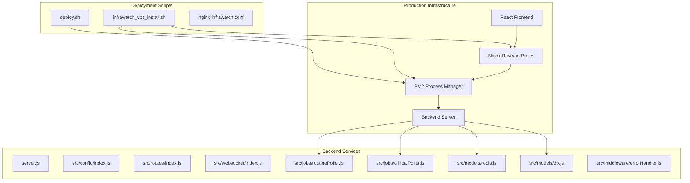
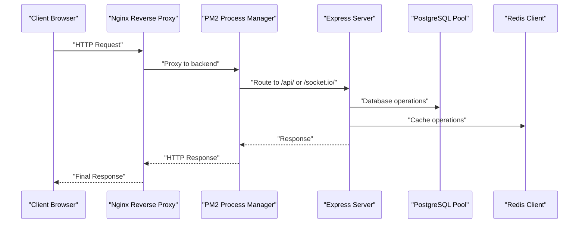
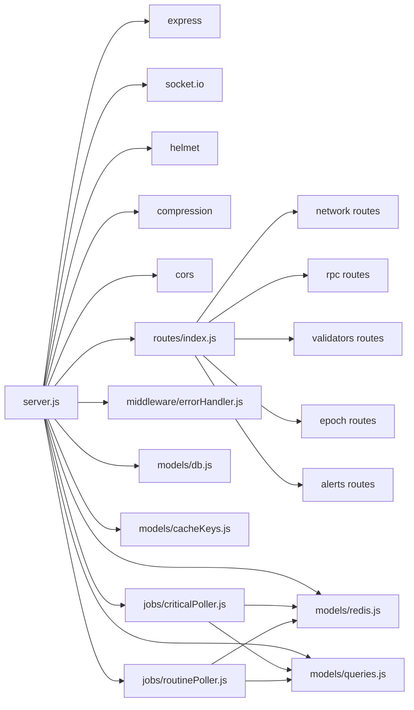

# Deployment & Maintenance

<cite>
**Referenced Files in This Document**
- [server.js](file://backend/server.js)
- [package.json](file://backend/package.json)
- [index.js](file://backend/src/config/index.js)
- [db.js](file://backend/src/models/db.js)
- [redis.js](file://backend/src/models/redis.js)
- [cacheKeys.js](file://backend/src/models/cacheKeys.js)
- [migrate.js](file://backend/src/models/migrate.js)
- [queries.js](file://backend/src/models/queries.js)
- [index.js](file://backend/src/routes/index.js)
- [criticalPoller.js](file://backend/src/jobs/criticalPoller.js)
- [routinePoller.js](file://backend/src/jobs/routinePoller.js)
- [errorHandler.js](file://backend/src/middleware/errorHandler.js)
- [index.js](file://backend/src/websocket/index.js)
- [nginx-infrawatch.conf](file://deploy/nginx-infrawatch.conf)
- [deploy.sh](file://deploy.sh)
- [infrawatch_vps_install.sh](file://infrawatch_vps_install.sh)
- [vite.config.js](file://frontend/vite.config.js)
- [api.js](file://frontend/src/services/api.js)
</cite>

## Update Summary
**Changes Made**
- Added comprehensive deployment infrastructure documentation with automated deployment scripts
- Documented Nginx configuration for production reverse proxy setup
- Enhanced environment variable management and configuration loading
- Added production deployment strategies with PM2 process management
- Included frontend build and deployment automation
- Updated monitoring and health check procedures for production environments

## Table of Contents
1. [Introduction](#introduction)
2. [Project Structure](#project-structure)
3. [Core Components](#core-components)
4. [Architecture Overview](#architecture-overview)
5. [Detailed Component Analysis](#detailed-component-analysis)
6. [Dependency Analysis](#dependency-analysis)
7. [Production Deployment Infrastructure](#production-deployment-infrastructure)
8. [Environment Variable Management](#environment-variable-management)
9. [Reverse Proxy Configuration](#reverse-proxy-configuration)
10. [Automated Deployment Scripts](#automated-deployment-scripts)
11. [Frontend Build and Distribution](#frontend-build-and-distribution)
12. [Production Deployment Strategies](#production-deployment-strategies)
13. [Monitoring and Health Checks](#monitoring-and-health-checks)
14. [Performance Considerations](#performance-considerations)
15. [Troubleshooting Guide](#troubleshooting-guide)
16. [Conclusion](#conclusion)
17. [Appendices](#appendices)

## Introduction
This document provides comprehensive deployment and maintenance guidance for InfraWatch, focusing on production-grade strategies for containerization, infrastructure provisioning, database and cache operations, monitoring, backups, disaster recovery, and operational runbooks. The system now includes automated deployment scripts, Nginx reverse proxy configuration, and comprehensive environment variable management for production environments.

## Project Structure
InfraWatch consists of a Node.js backend built with Express, Socket.io, PostgreSQL via node-pg, and Redis via ioredis. The backend exposes REST API endpoints, runs scheduled jobs, and streams real-time updates via WebSocket. Configuration is environment-driven with sensible defaults. The deployment infrastructure includes automated scripts for installation and updates, along with Nginx configuration for production reverse proxy setup.

**Diagram sources**
- [server.js:1-128](file://backend/server.js#L1-L128)
- [index.js:1-74](file://backend/src/config/index.js#L1-L74)
- [deploy.sh:1-30](file://deploy.sh#L1-L30)
- [infrawatch_vps_install.sh:1-177](file://infrawatch_vps_install.sh#L1-L177)
- [nginx-infrawatch.conf:1-61](file://deploy/nginx-infrawatch.conf#L1-L61)

**Section sources**
- [server.js:1-128](file://backend/server.js#L1-L128)
- [package.json:1-36](file://backend/package.json#L1-L36)
- [index.js:1-74](file://backend/src/config/index.js#L1-L74)
- [deploy.sh:1-30](file://deploy.sh#L1-L30)
- [infrawatch_vps_install.sh:1-177](file://infrawatch_vps_install.sh#L1-L177)

## Core Components
- Express server with Helmet, compression, and CORS middleware, plus a health endpoint.
- Socket.io server for real-time updates.
- Database layer using a pooled PostgreSQL client with parameterized queries.
- Redis client with JSON serialization, TTL, and reconnection strategy.
- Scheduled jobs for critical (every 30s) and routine (every 5min) data collection and persistence.
- Centralized configuration loader supporting environment variables and defaults.
- Error handling middleware with typed error classes and production-safe responses.
- Automated deployment infrastructure with PM2 process management.
- Nginx reverse proxy configuration for production deployment.

**Section sources**
- [server.js:33-107](file://backend/server.js#L33-L107)
- [index.js:15-74](file://backend/src/config/index.js#L15-L74)
- [db.js:15-47](file://backend/src/models/db.js#L15-L47)
- [redis.js:16-68](file://backend/src/models/redis.js#L16-L68)
- [criticalPoller.js:21-103](file://backend/src/jobs/criticalPoller.js#L21-L103)
- [routinePoller.js:20-111](file://backend/src/jobs/routinePoller.js#L20-L111)
- [errorHandler.js:44-109](file://backend/src/middleware/errorHandler.js#L44-L109)

## Architecture Overview
The backend initializes configuration, sets up middleware and routes, connects to PostgreSQL and Redis, starts scheduled jobs, and exposes a health endpoint. WebSocket connections are tracked and used to broadcast real-time updates. The deployment infrastructure includes automated scripts for installation and updates, with Nginx serving as a reverse proxy for both the React frontend and API endpoints.

**Diagram sources**
- [nginx-infrawatch.conf:11-33](file://deploy/nginx-infrawatch.conf#L11-L33)
- [server.js:61-79](file://backend/server.js#L61-L79)
- [deploy.sh:24-26](file://deploy.sh#L24-L26)

## Detailed Component Analysis

### Configuration and Environment Management
- Centralized configuration loads environment variables with defaults for ports, Solana RPC endpoints, validators.app API, database URL, Redis URL, polling intervals, and CORS origin.
- Supports optional Helius API key to construct a Helius RPC URL.
- Graceful degradation when database or Redis are not configured.
- Automatic .env file loading with fallback to environment variables.

**Updated** Enhanced with comprehensive environment variable management including API keys and service URLs.

Operational guidance:
- Define environment variables for production (e.g., PORT, NODE_ENV, DATABASE_URL, REDIS_URL, SOLANA_RPC_URL, HELIUS_API_KEY, VALIDATORS_APP_API_KEY).
- Keep CORS_ORIGIN aligned with the frontend origin.
- Use separate environment files for staging and production.
- Store sensitive API keys in secure secrets management systems.

**Section sources**
- [index.js:8-74](file://backend/src/config/index.js#L8-L74)

### Database Initialization and Operations
- Uses a pooled PostgreSQL client with connection limits and timeouts.
- Provides a wrapper to execute parameterized queries safely.
- Includes a migration script to create required tables and indexes.

Operational guidance:
- Provision a managed PostgreSQL instance (e.g., AWS RDS, GCP Cloud SQL) with strong TLS and IAM-based authentication.
- Use DATABASE_URL with proper credentials and SSL mode.
- Run migrations during deployment using the provided migration script.
- Monitor pool usage and adjust max connections based on workload.

**Section sources**
- [db.js:15-47](file://backend/src/models/db.js#L15-L47)
- [migrate.js:100-139](file://backend/src/models/migrate.js#L100-L139)

### Redis Cache Management
- Lazy-initialized Redis client with exponential backoff retry strategy and readiness checks.
- JSON serialization/deserialization for cache values.
- TTL constants and key naming conventions for network, RPC, validators, and history data.

Operational guidance:
- Use a managed Redis service (e.g., AWS ElastiCache, GCP Memorystore) with replication and automatic failover.
- Configure REDIS_URL with TLS and authentication if required.
- Monitor memory usage and evictions; tune TTLs and key namespaces as needed.
- Use cache keys consistently to avoid fragmentation.

**Section sources**
- [redis.js:16-68](file://backend/src/models/redis.js#L16-L68)
- [cacheKeys.js:6-49](file://backend/src/models/cacheKeys.js#L6-L49)

### Scheduled Jobs and Data Collection
- Critical poller runs every 30 seconds to collect network snapshot, RPC health, write to PostgreSQL, update Redis cache, and broadcast via WebSocket.
- Routine poller runs every 5 minutes to fetch validators, detect commission changes, upsert and snapshot validator data, update caches, and emit alerts.

Operational guidance:
- Ensure cron scheduling does not overlap by design; logs indicate skipping if a previous run is still active.
- Monitor job execution duration and adjust intervals if necessary.
- Use graceful error handling to continue operation even if one provider fails.

**Section sources**
- [criticalPoller.js:21-103](file://backend/src/jobs/criticalPoller.js#L21-L103)
- [routinePoller.js:20-111](file://backend/src/jobs/routinePoller.js#L20-L111)

### API Routes and WebSocket Streaming
- Route aggregator mounts network, RPC, validators, epoch, and alerts sub-routers under /api.
- WebSocket tracks connections and supports broadcasting events to clients.

Operational guidance:
- Expose only the /api routes and health endpoint externally.
- Scale WebSocket connections behind a reverse proxy that supports long-lived connections.
- Monitor connected client counts for capacity planning.

**Section sources**
- [index.js:10-23](file://backend/src/routes/index.js#L10-L23)
- [index.js:13-33](file://backend/src/websocket/index.js#L13-L33)

### Error Handling and Logging
- Global error middleware handles validation, not-found, unauthorized, and forbidden errors, returning structured JSON responses.
- Production responses omit stack traces; development exposes stack traces.
- Logs include request metadata and error details.

Operational guidance:
- Integrate with centralized logging (e.g., ELK, Cloud Logging) to capture structured logs.
- Use log levels to distinguish warnings from errors.
- Consider adding correlation IDs to requests for traceability.

**Section sources**
- [errorHandler.js:44-109](file://backend/src/middleware/errorHandler.js#L44-L109)

### Health Checks and Readiness
- Health endpoint returns status, timestamp, uptime, and environment.
- Server attempts to initialize DB and Redis on startup; warnings are logged if unavailable.

Operational guidance:
- Use the health endpoint for Kubernetes liveness/readiness probes.
- Consider adding DB and Redis readiness checks before marking the pod ready.

**Section sources**
- [server.js:61-69](file://backend/server.js#L61-L69)
- [server.js:89-102](file://backend/server.js#L89-L102)

## Dependency Analysis
The backend depends on Express for HTTP, Socket.io for WebSocket, node-pg for PostgreSQL, ioredis for Redis, and node-cron for scheduling. Configuration drives Solana RPC endpoints and external APIs.

**Diagram sources**
- [server.js:6-27](file://backend/server.js#L6-L27)
- [index.js:10-23](file://backend/src/routes/index.js#L10-L23)
- [criticalPoller.js:7-13](file://backend/src/jobs/criticalPoller.js#L7-L13)
- [routinePoller.js:7-12](file://backend/src/jobs/routinePoller.js#L7-L12)
- [db.js:6](file://backend/src/models/db.js#L6)
- [redis.js:6](file://backend/src/models/redis.js#L6)
- [queries.js:7](file://backend/src/models/queries.js#L7)
- [cacheKeys.js:6](file://backend/src/models/cacheKeys.js#L6)

**Section sources**
- [package.json:22-34](file://backend/package.json#L22-L34)
- [server.js:6-27](file://backend/server.js#L6-L27)

## Production Deployment Infrastructure

### Automated Deployment Scripts
The system includes comprehensive deployment automation through shell scripts that handle the complete deployment lifecycle:

**Installation Script (`infrawatch_vps_install.sh`)**:
- Node.js version checking and automatic upgrade to v20+
- Certbot installation for SSL certificates
- Repository cloning and dependency installation
- Environment configuration creation
- Frontend build process
- PM2 process management setup
- Nginx configuration deployment
- Comprehensive post-installation instructions

**Deployment Script (`deploy.sh`)**:
- Git pull from origin main branch
- Backend dependency installation with production flags
- Frontend build process
- PM2 restart for seamless deployment

**Section sources**
- [infrawatch_vps_install.sh:1-177](file://infrawatch_vps_install.sh#L1-L177)
- [deploy.sh:1-30](file://deploy.sh#L1-L30)

### Nginx Reverse Proxy Configuration
The Nginx configuration serves as a production-ready reverse proxy that handles both the React frontend and API backend:

**Key Features**:
- Serves React SPA frontend from `/var/www/infrawatch/frontend/dist`
- Proxies `/api/` requests to backend on port 3001
- Handles WebSocket connections for Socket.io with proper upgrade headers
- Implements security headers and Gzip compression
- Configures static asset caching with immutable caching policy
- Provides SPA routing fallback for client-side navigation

**Section sources**
- [nginx-infrawatch.conf:1-61](file://deploy/nginx-infrawatch.conf#L1-L61)

### PM2 Process Management
The deployment infrastructure uses PM2 for production process management:

- Automatic application startup and restart on failures
- Process monitoring and health checks
- Log management and rotation
- Seamless deployment with zero downtime
- Environment-specific configuration management

**Section sources**
- [infrawatch_vps_install.sh:82-87](file://infrawatch_vps_install.sh#L82-L87)
- [deploy.sh:24-26](file://deploy.sh#L24-L26)

## Environment Variable Management

### Configuration Loading Strategy
The system implements a robust environment variable management system:

**File Priority**:
1. `.env` file in backend root directory
2. System environment variables
3. Default values in configuration module

**Supported Variables**:
- Server configuration: PORT, NODE_ENV
- Solana configuration: SOLANA_RPC_URL, HELIUS_API_KEY, HELIUS_RPC_URL
- External API configuration: VALIDATORS_APP_API_KEY, VALIDATORS_APP_BASE_URL, BAGS_API_KEY, BAGS_API_BASE_URL
- Database configuration: DATABASE_URL
- Redis configuration: REDIS_URL
- Polling intervals: CRITICAL_POLL_INTERVAL, ROUTINE_POLL_INTERVAL
- CORS configuration: CORS_ORIGIN

**Section sources**
- [index.js:8-74](file://backend/src/config/index.js#L8-L74)

### Production Environment Setup
**Installation Process**:
- Automatic .env file creation with essential configuration
- API key placeholders for secure configuration
- Separate frontend environment configuration
- Post-installation API key editing instructions

**Deployment Process**:
- Environment variables loaded automatically during startup
- Graceful handling of missing configuration values
- Fallback to default values for non-critical settings

**Section sources**
- [infrawatch_vps_install.sh:58-68](file://infrawatch_vps_install.sh#L58-L68)
- [infrawatch_vps_install.sh:74-78](file://infrawatch_vps_install.sh#L74-L78)

## Reverse Proxy Configuration

### Nginx Server Block Structure
The Nginx configuration implements a comprehensive reverse proxy setup:

**Server Configuration**:
- Listens on port 80 for HTTP traffic
- Server name: `app.infrastructureintel.io`
- Root directory points to compiled frontend distribution

**API Proxy Configuration**:
- Location `/api/` proxies to `http://127.0.0.1:3001`
- Preserves original headers including X-Forwarded-For and X-Forwarded-Proto
- Maintains connection integrity for API requests

**WebSocket Support**:
- Dedicated location `/socket.io/` for real-time connections
- Proper upgrade headers for WebSocket protocol
- Extended timeout settings (86400 seconds) for long-lived connections

**Security Enhancements**:
- X-Frame-Options protection (DENY for static assets)
- X-Content-Type-Options (nosniff)
- Strict Referrer-Policy configuration
- Gzip compression for improved performance

**Static Asset Optimization**:
- One-year caching for JavaScript, CSS, and font files
- Immutable caching policy for optimized delivery
- Security-focused header additions

**Section sources**
- [nginx-infrawatch.conf:5-61](file://deploy/nginx-infrawatch.conf#L5-L61)

## Automated Deployment Scripts

### Installation Workflow
The installation script (`infrawatch_vps_install.sh`) automates the complete production setup:

**Phase 1: System Preparation**
- Node.js version verification and automatic upgrade to v20+
- Certbot installation for SSL certificate management
- Repository cloning to `/var/www/infrawatch`

**Phase 2: Backend Setup**
- Backend dependency installation
- Environment configuration creation with placeholder API keys
- Database and Redis URL placeholders for secure configuration

**Phase 3: Frontend Build**
- Frontend dependency installation
- Environment-specific configuration for production API URL
- Build process generating optimized distribution files

**Phase 4: Service Management**
- PM2 process startup with persistent configuration
- Nginx configuration deployment and validation
- Comprehensive post-installation instructions and next steps

**Section sources**
- [infrawatch_vps_install.sh:22-177](file://infrawatch_vps_install.sh#L22-L177)

### Deployment Workflow
The deployment script (`deploy.sh`) enables rapid production updates:

**Deployment Steps**:
1. Pull latest code from origin/main branch
2. Install production dependencies for backend
3. Build frontend with optimized production settings
4. Restart backend service via PM2 for seamless deployment

**Operational Benefits**:
- Zero-downtime deployments through PM2 restart
- Automated dependency management
- Consistent build process across environments
- Simple execution from project root directory

**Section sources**
- [deploy.sh:1-30](file://deploy.sh#L1-L30)

## Frontend Build and Distribution

### Development vs Production Configuration
The frontend uses Vite for both development and production builds:

**Development Configuration**:
- Local proxy configuration for API and WebSocket connections
- Port 5173 for development server
- Hot module replacement for fast development iteration

**Production Configuration**:
- Optimized build with minification and tree-shaking
- Environment-specific API URL configuration
- Static asset optimization and caching

**Section sources**
- [vite.config.js:1-18](file://frontend/vite.config.js#L1-L18)
- [infrawatch_vps_install.sh:74-78](file://infrawatch_vps_install.sh#L74-L78)

### API Communication Layer
The frontend implements a centralized API communication layer:

**Configuration**:
- Base URL derived from `VITE_API_URL` environment variable
- Timeout configuration for request handling
- Axios interceptors for request/response processing

**Error Handling**:
- Comprehensive error logging for failed requests
- Different handling for various error scenarios
- User-friendly error reporting

**Section sources**
- [api.js:1-45](file://frontend/src/services/api.js#L1-L45)

## Production Deployment Strategies

### Containerization Options
While the current deployment uses traditional server setup, the system is container-ready:

**Container Image Requirements**:
- Node.js 20+ runtime environment
- Production dependencies only (optimized for size)
- Non-root user execution for security
- Read-only root filesystem with writable logs directory

**Docker Considerations**:
- Multi-stage build process for optimal image size
- Health check endpoint integration
- Environment variable injection
- Volume mounting for persistent data

### Infrastructure Provisioning
**Recommended Architecture**:
- Single instance for development and small-scale production
- Horizontal scaling with multiple instances behind load balancer
- Stateful components (database, Redis) in managed cloud services
- CDN integration for static asset delivery

**Networking Requirements**:
- Inbound HTTP/HTTPS access restricted to Nginx
- Outbound HTTPS access to Solana RPC endpoints
- Internal communication between Nginx and backend on localhost:3001
- DNS configuration for domain resolution

**Section sources**
- [package.json:19-21](file://backend/package.json#L19-L21)
- [nginx-infrawatch.conf:6-7](file://deploy/nginx-infrawatch.conf#L6-L7)

### Secrets Management
**Production Security**:
- API keys stored in cloud-native secrets management
- Environment-specific configuration separation
- Regular rotation of sensitive credentials
- Least-privilege access controls

**Configuration Best Practices**:
- Never commit secrets to version control
- Use different secrets for development, staging, and production
- Implement automated secret rotation processes
- Monitor access to sensitive configuration data

## Monitoring and Health Checks

### Health Endpoint Implementation
The system provides comprehensive health monitoring capabilities:

**Endpoint Details**:
- Path: `/api/health`
- Returns: Status, timestamp, uptime, and environment information
- Used for Kubernetes liveness and readiness probes
- Accessible without authentication for monitoring systems

**Integration Points**:
- PM2 process monitoring
- Load balancer health checks
- Kubernetes cluster autoscaling
- Alerting system integration

**Section sources**
- [server.js:61-69](file://backend/server.js#L61-L69)

### Performance Monitoring
**Metrics Collection**:
- Database pool utilization and query performance
- Redis connection health and memory usage
- WebSocket connection counts and error rates
- API response times and error rates
- Frontend bundle size and loading performance

**Monitoring Tools**:
- Application performance monitoring (APM) solutions
- Database performance monitoring
- Infrastructure monitoring (CPU, memory, disk)
- Custom metrics for business logic

### Log Management
**Logging Strategy**:
- Structured JSON logging for machine parsing
- Separate logs for different components (backend, frontend, database)
- Log aggregation and centralization
- Retention policies based on compliance requirements

**Log Analysis**:
- Error rate monitoring and alerting
- Performance bottleneck identification
- Security event detection
- Audit trail maintenance

## Performance Considerations
- Database pooling: Tune max connections and timeouts based on observed concurrency and query patterns.
- Query performance: Use indexes created by migrations for time-series and lookup queries.
- Cache strategy: Leverage Redis for hot-path reads; monitor hit rates and adjust TTLs.
- Scheduling cadence: Critical poller runs every 30s; routine poller every 5min. Adjust intervals to balance freshness and load.
- Middleware: Compression reduces payload sizes; keep CORS minimal to reduce preflight overhead.
- Nginx optimization: Leverage static asset caching and Gzip compression for improved performance.
- PM2 process management: Optimize worker count and memory limits for optimal resource utilization.

## Troubleshooting Guide
Common operational issues and resolutions:
- Health endpoint returns errors:
  - Verify environment variables and connectivity to database and Redis.
  - Check server logs for initialization warnings.
  - Validate Nginx proxy configuration and backend connectivity.
- Database connectivity failures:
  - Confirm DATABASE_URL and network ACLs.
  - Review pool error logs and increase timeouts if needed.
- Redis unavailability:
  - Validate REDIS_URL and network/firewall rules.
  - Inspect retry logs and consider enabling TLS.
- WebSocket disconnections:
  - Check client-side network stability and proxy timeouts.
  - Monitor connected client counts and server logs for errors.
- Scheduled jobs stuck or overlapping:
  - Logs indicate skipping if a run is still active; investigate slow downstream operations (DB/Redis/API calls).
- API errors:
  - Use global error middleware responses to diagnose validation, not-found, unauthorized, or forbidden conditions.
- Nginx configuration issues:
  - Validate syntax with `nginx -t`
  - Check access logs for proxy errors
  - Verify backend service availability on port 3001
- PM2 process problems:
  - Check process status with `pm2 status`
  - Review application logs with `pm2 logs infrawatch-api`
  - Restart process if needed with `pm2 restart infrawatch-api`

**Section sources**
- [server.js:89-102](file://backend/server.js#L89-L102)
- [db.js:32-36](file://backend/src/models/db.js#L32-L36)
- [redis.js:58-61](file://backend/src/models/redis.js#L58-L61)
- [index.js:16-17](file://backend/src/websocket/index.js#L16-L17)
- [criticalPoller.js:23-27](file://backend/src/jobs/criticalPoller.js#L23-L27)
- [errorHandler.js:44-109](file://backend/src/middleware/errorHandler.js#L44-L109)
- [nginx-infrawatch.conf:135](file://deploy/nginx-infrawatch.conf#L135)
- [infrawatch_vps_install.sh:169-173](file://infrawatch_vps_install.sh#L169-L173)

## Conclusion
InfraWatch is designed for production with environment-driven configuration, resilient data stores, scheduled ingestion, and real-time streaming. The new deployment infrastructure adds automated deployment scripts, comprehensive Nginx configuration, and robust environment variable management. By following the deployment and maintenance practices outlined here—especially around database and Redis provisioning, cache tuning, monitoring, and operational runbooks—you can achieve reliable, scalable operations in production with automated deployment workflows.

## Appendices

### A. Production Deployment Strategies
- Containerization:
  - Build a minimal Node.js image with the backend application.
  - Set NODE_ENV=production and configure PORT.
  - Mount a read-only root filesystem with writable logs directory.
- Orchestration:
  - Deploy behind a reverse proxy/load balancer with sticky sessions if needed.
  - Use rolling updates with readiness probes against the health endpoint.
- Secrets management:
  - Store DATABASE_URL, REDIS_URL, SOLANA_RPC_URL, HELIUS_API_KEY, and VALIDATORS_APP_API_KEY in a secrets manager.
- Networking:
  - Restrict inbound traffic to the health endpoint and API routes.
  - Allow outbound HTTPS to Solana RPC endpoints and external APIs.

**Section sources**
- [package.json:6-9](file://backend/package.json#L6-L9)
- [index.js:28-74](file://backend/src/config/index.js#L28-L74)

### B. Infrastructure Requirements
- Compute:
  - Single-instance for small-scale; scale horizontally with multiple replicas behind a load balancer.
- Storage:
  - PostgreSQL: SSD-backed managed instance with automated backups and point-in-time recovery.
  - Redis: Clustered managed instance with replication and automatic failover.
- Networking:
  - Private subnets with NAT for outbound internet; restrict ingress to necessary ports.

**Section sources**
- [db.js:25-30](file://backend/src/models/db.js#L25-L30)
- [redis.js:27-35](file://backend/src/models/redis.js#L27-L35)

### C. Database Maintenance Procedures
- Schema changes:
  - Use the migration script to apply DDL changes; test in staging first.
- Index tuning:
  - Monitor slow queries and add/remove indexes as needed; leverage existing time-series and lookup indexes.
- Vacuum/analyze:
  - Schedule periodic maintenance on time-series tables to maintain performance.

**Section sources**
- [migrate.js:100-139](file://backend/src/models/migrate.js#L100-L139)
- [queries.js:27-48](file://backend/src/models/queries.js#L27-L48)

### D. Cache Management
- Key hygiene:
  - Use cache keys defined centrally; avoid ad-hoc key construction.
- TTL policies:
  - Align TTLs with polling intervals and consumption patterns.
- Monitoring:
  - Track cache hit ratio, memory usage, and evictions.

**Section sources**
- [cacheKeys.js:6-49](file://backend/src/models/cacheKeys.js#L6-L49)
- [redis.js:99-112](file://backend/src/models/redis.js#L99-L112)

### E. Log Rotation and Retention
- Use OS-level log rotation (e.g., logrotate) to manage stdout/stderr logs.
- Forward application logs to a centralized logging platform.
- Retain logs per compliance requirements; purge old entries periodically.

### F. Monitoring Setup and Metrics
- Health endpoint:
  - Use GET /api/health for liveness/readiness probes.
- Application metrics:
  - Instrument critical poller and routine poller execution durations and failure rates.
  - Track WebSocket connection counts and error rates.
- Database metrics:
  - Pool utilization, query latency, and error rates.
- Redis metrics:
  - Memory usage, client connections, and command latency.

**Section sources**
- [server.js:61-69](file://backend/server.js#L61-L69)
- [criticalPoller.js:94-96](file://backend/src/jobs/criticalPoller.js#L94-L96)
- [routinePoller.js:102-104](file://backend/src/jobs/routinePoller.js#L102-L104)

### G. Backup and Disaster Recovery
- Database:
  - Enable automated backups and test PITR restore procedures.
  - Maintain offsite snapshots for DR.
- Cache:
  - Back up Redis snapshots if using AOF/RDB snapshots; validate restoration.
- Recovery plan:
  - Document steps to restore from backups, rerun migrations, and restart services.

**Section sources**
- [migrate.js:100-139](file://backend/src/models/migrate.js#L100-L139)

### H. System Maintenance Schedules
- Patching:
  - Apply OS and runtime updates with staged rollouts.
- Database maintenance:
  - Schedule vacuum/analyze and index reorganization during low-traffic windows.
- Cache refresh:
  - Validate cache TTLs and key namespaces quarterly.

**Section sources**
- [db.js:32-36](file://backend/src/models/db.js#L32-L36)

### I. Scaling Considerations
- Horizontal scaling:
  - Use stateless backend pods; persist state in PostgreSQL and Redis.
- Database scaling:
  - Consider read replicas for reporting queries; use connection pooling effectively.
- Cache scaling:
  - Use clustered Redis or managed Redis with auto-failover.
- Observability:
  - Scale logging and metrics ingestion accordingly.

**Section sources**
- [db.js:25-30](file://backend/src/models/db.js#L25-L30)
- [redis.js:27-35](file://backend/src/models/redis.js#L27-L35)

### J. Deployment Automation Reference
**Installation Script Features**:
- Automated Node.js version management
- SSL certificate setup with Certbot
- Complete environment configuration
- Frontend build optimization
- PM2 process management
- Nginx configuration deployment

**Deployment Script Features**:
- Git-based deployment workflow
- Production dependency optimization
- Frontend build pipeline
- Seamless service restart

**Section sources**
- [infrawatch_vps_install.sh:1-177](file://infrawatch_vps_install.sh#L1-L177)
- [deploy.sh:1-30](file://deploy.sh#L1-L30)

### K. Environment Variable Reference
**Essential Configuration Variables**:
- `PORT`: Backend server port (default: 3001)
- `NODE_ENV`: Environment mode (default: development)
- `DATABASE_URL`: PostgreSQL connection string
- `REDIS_URL`: Redis connection string
- `SOLANA_RPC_URL`: Primary Solana RPC endpoint
- `HELIUS_API_KEY`: Helius API authentication key
- `VALIDATORS_APP_API_KEY`: Validators.app API authentication key
- `CRITICAL_POLL_INTERVAL`: Critical job interval in milliseconds
- `ROUTINE_POLL_INTERVAL`: Routine job interval in milliseconds
- `CORS_ORIGIN`: Allowed CORS origins

**Section sources**
- [index.js:27-71](file://backend/src/config/index.js#L27-L71)