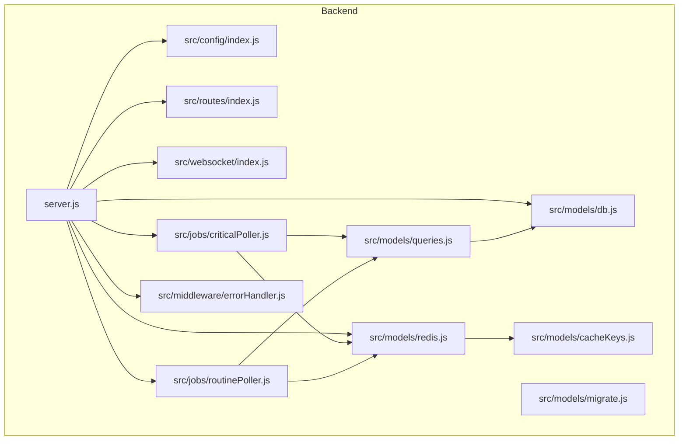
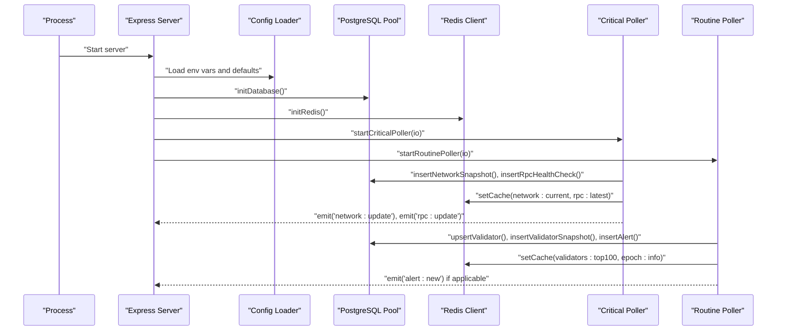
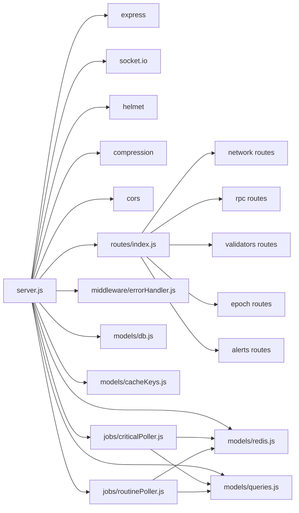

# Deployment & Maintenance

<cite>
**Referenced Files in This Document**
- [server.js](file://backend/server.js)
- [package.json](file://backend/package.json)
- [index.js](file://backend/src/config/index.js)
- [db.js](file://backend/src/models/db.js)
- [redis.js](file://backend/src/models/redis.js)
- [cacheKeys.js](file://backend/src/models/cacheKeys.js)
- [migrate.js](file://backend/src/models/migrate.js)
- [queries.js](file://backend/src/models/queries.js)
- [index.js](file://backend/src/routes/index.js)
- [criticalPoller.js](file://backend/src/jobs/criticalPoller.js)
- [routinePoller.js](file://backend/src/jobs/routinePoller.js)
- [errorHandler.js](file://backend/src/middleware/errorHandler.js)
- [index.js](file://backend/src/websocket/index.js)
</cite>

## Table of Contents
1. [Introduction](#introduction)
2. [Project Structure](#project-structure)
3. [Core Components](#core-components)
4. [Architecture Overview](#architecture-overview)
5. [Detailed Component Analysis](#detailed-component-analysis)
6. [Dependency Analysis](#dependency-analysis)
7. [Performance Considerations](#performance-considerations)
8. [Troubleshooting Guide](#troubleshooting-guide)
9. [Conclusion](#conclusion)
10. [Appendices](#appendices)

## Introduction
This document provides comprehensive deployment and maintenance guidance for InfraWatch, focusing on production-grade strategies for containerization, infrastructure provisioning, database and cache operations, monitoring, backups, disaster recovery, and operational runbooks. It synthesizes the backend’s runtime behavior, configuration model, scheduling, persistence, and caching to deliver actionable guidance for reliable operations.

## Project Structure
InfraWatch consists of a Node.js backend built with Express, Socket.io, PostgreSQL via node-pg, and Redis via ioredis. The backend exposes REST API endpoints, runs scheduled jobs, and streams real-time updates via WebSocket. Configuration is environment-driven with sensible defaults.

**Diagram sources**
- [server.js:1-128](file://backend/server.js#L1-L128)
- [index.js:1-68](file://backend/src/config/index.js#L1-L68)
- [index.js:1-24](file://backend/src/routes/index.js#L1-L24)
- [index.js:1-81](file://backend/src/websocket/index.js#L1-L81)
- [db.js:1-98](file://backend/src/models/db.js#L1-L98)
- [redis.js:1-161](file://backend/src/models/redis.js#L1-L161)
- [cacheKeys.js:1-50](file://backend/src/models/cacheKeys.js#L1-L50)
- [queries.js:1-459](file://backend/src/models/queries.js#L1-L459)
- [migrate.js:1-160](file://backend/src/models/migrate.js#L1-L160)
- [criticalPoller.js:1-108](file://backend/src/jobs/criticalPoller.js#L1-L108)
- [routinePoller.js:1-116](file://backend/src/jobs/routinePoller.js#L1-L116)
- [errorHandler.js:1-127](file://backend/src/middleware/errorHandler.js#L1-L127)

**Section sources**
- [server.js:1-128](file://backend/server.js#L1-L128)
- [package.json:1-36](file://backend/package.json#L1-L36)
- [index.js:1-68](file://backend/src/config/index.js#L1-L68)

## Core Components
- Express server with Helmet, compression, and CORS middleware, plus a health endpoint.
- Socket.io server for real-time updates.
- Database layer using a pooled PostgreSQL client with parameterized queries.
- Redis client with JSON serialization, TTL, and reconnection strategy.
- Scheduled jobs for critical (every 30s) and routine (every 5min) data collection and persistence.
- Centralized configuration loader supporting environment variables and defaults.
- Error handling middleware with typed error classes and production-safe responses.

**Section sources**
- [server.js:33-107](file://backend/server.js#L33-L107)
- [index.js:15-65](file://backend/src/config/index.js#L15-L65)
- [db.js:15-47](file://backend/src/models/db.js#L15-L47)
- [redis.js:16-68](file://backend/src/models/redis.js#L16-L68)
- [criticalPoller.js:21-103](file://backend/src/jobs/criticalPoller.js#L21-L103)
- [routinePoller.js:20-111](file://backend/src/jobs/routinePoller.js#L20-L111)
- [errorHandler.js:44-109](file://backend/src/middleware/errorHandler.js#L44-L109)

## Architecture Overview
The backend initializes configuration, sets up middleware and routes, connects to PostgreSQL and Redis, starts scheduled jobs, and exposes a health endpoint. WebSocket connections are tracked and used to broadcast real-time updates.

**Diagram sources**
- [server.js:84-107](file://backend/server.js#L84-L107)
- [criticalPoller.js:48-92](file://backend/src/jobs/criticalPoller.js#L48-L92)
- [routinePoller.js:37-100](file://backend/src/jobs/routinePoller.js#L37-L100)
- [db.js:15-47](file://backend/src/models/db.js#L15-L47)
- [redis.js:16-68](file://backend/src/models/redis.js#L16-L68)

## Detailed Component Analysis

### Configuration and Environment Management
- Centralized configuration loads environment variables with defaults for ports, Solana RPC endpoints, validators.app API, database URL, Redis URL, polling intervals, and CORS origin.
- Supports optional Helius API key to construct a Helius RPC URL.
- Graceful degradation when database or Redis are not configured.

Operational guidance:
- Define environment variables for production (e.g., PORT, NODE_ENV, DATABASE_URL, REDIS_URL, SOLANA_RPC_URL, HELIUS_API_KEY, VALIDATORS_APP_API_KEY).
- Keep CORS_ORIGIN aligned with the frontend origin.
- Use separate environment files for staging and production.

**Section sources**
- [index.js:8-65](file://backend/src/config/index.js#L8-L65)

### Database Initialization and Operations
- Uses a pooled PostgreSQL client with connection limits and timeouts.
- Provides a wrapper to execute parameterized queries safely.
- Includes a migration script to create required tables and indexes.

Operational guidance:
- Provision a managed PostgreSQL instance (e.g., AWS RDS, GCP Cloud SQL) with strong TLS and IAM-based authentication.
- Use DATABASE_URL with proper credentials and SSL mode.
- Run migrations during deployment using the provided migration script.
- Monitor pool usage and adjust max connections based on workload.

**Section sources**
- [db.js:15-47](file://backend/src/models/db.js#L15-L47)
- [migrate.js:100-139](file://backend/src/models/migrate.js#L100-L139)

### Redis Cache Management
- Lazy-initialized Redis client with exponential backoff retry strategy and readiness checks.
- JSON serialization/deserialization for cache values.
- TTL constants and key naming conventions for network, RPC, validators, and history data.

Operational guidance:
- Use a managed Redis service (e.g., AWS ElastiCache, GCP Memorystore) with replication and automatic failover.
- Configure REDIS_URL with TLS and authentication if required.
- Monitor memory usage and evictions; tune TTLs and key namespaces as needed.
- Use cache keys consistently to avoid fragmentation.

**Section sources**
- [redis.js:16-68](file://backend/src/models/redis.js#L16-L68)
- [cacheKeys.js:6-49](file://backend/src/models/cacheKeys.js#L6-L49)

### Scheduled Jobs and Data Collection
- Critical poller runs every 30 seconds to collect network snapshot, RPC health, write to PostgreSQL, update Redis cache, and broadcast via WebSocket.
- Routine poller runs every 5 minutes to fetch validators, detect commission changes, upsert and snapshot validator data, update caches, and emit alerts.

Operational guidance:
- Ensure cron scheduling does not overlap by design; logs indicate skipping if a previous run is still active.
- Monitor job execution duration and adjust intervals if necessary.
- Use graceful error handling to continue operation even if one provider fails.

**Section sources**
- [criticalPoller.js:21-103](file://backend/src/jobs/criticalPoller.js#L21-L103)
- [routinePoller.js:20-111](file://backend/src/jobs/routinePoller.js#L20-L111)

### API Routes and WebSocket Streaming
- Route aggregator mounts network, RPC, validators, epoch, and alerts sub-routers under /api.
- WebSocket tracks connections and supports broadcasting events to clients.

Operational guidance:
- Expose only the /api routes and health endpoint externally.
- Scale WebSocket connections behind a reverse proxy that supports long-lived connections.
- Monitor connected client counts for capacity planning.

**Section sources**
- [index.js:10-23](file://backend/src/routes/index.js#L10-L23)
- [index.js:13-33](file://backend/src/websocket/index.js#L13-L33)

### Error Handling and Logging
- Global error middleware handles validation, not-found, unauthorized, and forbidden errors, returning structured JSON responses.
- Production responses omit stack traces; development exposes stack traces.
- Logs include request metadata and error details.

Operational guidance:
- Integrate with centralized logging (e.g., ELK, Cloud Logging) to capture structured logs.
- Use log levels to distinguish warnings from errors.
- Consider adding correlation IDs to requests for traceability.

**Section sources**
- [errorHandler.js:44-109](file://backend/src/middleware/errorHandler.js#L44-L109)

### Health Checks and Readiness
- Health endpoint returns status, timestamp, uptime, and environment.
- Server attempts to initialize DB and Redis on startup; warnings are logged if unavailable.

Operational guidance:
- Use the health endpoint for Kubernetes liveness/readiness probes.
- Consider adding DB and Redis readiness checks before marking the pod ready.

**Section sources**
- [server.js:61-69](file://backend/server.js#L61-L69)
- [server.js:89-102](file://backend/server.js#L89-L102)

## Dependency Analysis
The backend depends on Express for HTTP, Socket.io for WebSocket, node-pg for PostgreSQL, ioredis for Redis, and node-cron for scheduling. Configuration drives Solana RPC endpoints and external APIs.

**Diagram sources**
- [server.js:6-27](file://backend/server.js#L6-L27)
- [index.js:10-23](file://backend/src/routes/index.js#L10-L23)
- [criticalPoller.js:7-13](file://backend/src/jobs/criticalPoller.js#L7-L13)
- [routinePoller.js:7-12](file://backend/src/jobs/routinePoller.js#L7-L12)
- [db.js:6](file://backend/src/models/db.js#L6)
- [redis.js:6](file://backend/src/models/redis.js#L6)
- [queries.js:7](file://backend/src/models/queries.js#L7)
- [cacheKeys.js:6](file://backend/src/models/cacheKeys.js#L6)

**Section sources**
- [package.json:22-34](file://backend/package.json#L22-L34)
- [server.js:6-27](file://backend/server.js#L6-L27)

## Performance Considerations
- Database pooling: Tune max connections and timeouts based on observed concurrency and query patterns.
- Query performance: Use indexes created by migrations for time-series and lookup queries.
- Cache strategy: Leverage Redis for hot-path reads; monitor hit rates and adjust TTLs.
- Scheduling cadence: Critical poller runs every 30s; routine poller every 5min. Adjust intervals to balance freshness and load.
- Middleware: Compression reduces payload sizes; keep CORS minimal to reduce preflight overhead.

[No sources needed since this section provides general guidance]

## Troubleshooting Guide
Common operational issues and resolutions:
- Health endpoint returns errors:
  - Verify environment variables and connectivity to database and Redis.
  - Check server logs for initialization warnings.
- Database connectivity failures:
  - Confirm DATABASE_URL and network ACLs.
  - Review pool error logs and increase timeouts if needed.
- Redis unavailability:
  - Validate REDIS_URL and network/firewall rules.
  - Inspect retry logs and consider enabling TLS.
- WebSocket disconnections:
  - Check client-side network stability and proxy timeouts.
  - Monitor connected client counts and server logs for errors.
- Scheduled jobs stuck or overlapping:
  - Logs indicate skipping if a run is still active; investigate slow downstream operations (DB/Redis/API calls).
- API errors:
  - Use global error middleware responses to diagnose validation, not-found, unauthorized, or forbidden conditions.

**Section sources**
- [server.js:89-102](file://backend/server.js#L89-L102)
- [db.js:32-36](file://backend/src/models/db.js#L32-L36)
- [redis.js:58-61](file://backend/src/models/redis.js#L58-L61)
- [index.js:16-17](file://backend/src/websocket/index.js#L16-L17)
- [criticalPoller.js:23-27](file://backend/src/jobs/criticalPoller.js#L23-L27)
- [errorHandler.js:44-109](file://backend/src/middleware/errorHandler.js#L44-L109)

## Conclusion
InfraWatch is designed for production with environment-driven configuration, resilient data stores, scheduled ingestion, and real-time streaming. By following the deployment and maintenance practices outlined here—especially around database and Redis provisioning, cache tuning, monitoring, and operational runbooks—you can achieve reliable, scalable operations in production.

[No sources needed since this section summarizes without analyzing specific files]

## Appendices

### A. Production Deployment Strategies
- Containerization:
  - Build a minimal Node.js image with the backend application.
  - Set NODE_ENV=production and configure PORT.
  - Mount a read-only root filesystem with writable logs directory.
- Orchestration:
  - Deploy behind a reverse proxy/load balancer with sticky sessions if needed.
  - Use rolling updates with readiness probes against the health endpoint.
- Secrets management:
  - Store DATABASE_URL, REDIS_URL, SOLANA_RPC_URL, HELIUS_API_KEY, and VALIDATORS_APP_API_KEY in a secrets manager.
- Networking:
  - Restrict inbound traffic to the health endpoint and API routes.
  - Allow outbound HTTPS to Solana RPC endpoints and external APIs.

**Section sources**
- [package.json:6-9](file://backend/package.json#L6-L9)
- [index.js:28-65](file://backend/src/config/index.js#L28-L65)

### B. Infrastructure Requirements
- Compute:
  - Single-instance for small-scale; scale horizontally with multiple replicas behind a load balancer.
- Storage:
  - PostgreSQL: SSD-backed managed instance with automated backups and point-in-time recovery.
  - Redis: Clustered managed instance with replication and automatic failover.
- Networking:
  - Private subnets with NAT for outbound internet; restrict ingress to necessary ports.

**Section sources**
- [db.js:25-30](file://backend/src/models/db.js#L25-L30)
- [redis.js:27-35](file://backend/src/models/redis.js#L27-L35)

### C. Database Maintenance Procedures
- Schema changes:
  - Use the migration script to apply DDL changes; test in staging first.
- Index tuning:
  - Monitor slow queries and add/remove indexes as needed; leverage existing time-series and lookup indexes.
- Vacuum/analyze:
  - Schedule periodic maintenance on time-series tables to maintain performance.

**Section sources**
- [migrate.js:100-139](file://backend/src/models/migrate.js#L100-L139)
- [queries.js:27-48](file://backend/src/models/queries.js#L27-L48)

### D. Cache Management
- Key hygiene:
  - Use cache keys defined centrally; avoid ad-hoc key construction.
- TTL policies:
  - Align TTLs with polling intervals and consumption patterns.
- Monitoring:
  - Track cache hit ratio, memory usage, and evictions.

**Section sources**
- [cacheKeys.js:6-49](file://backend/src/models/cacheKeys.js#L6-L49)
- [redis.js:99-112](file://backend/src/models/redis.js#L99-L112)

### E. Log Rotation and Retention
- Use OS-level log rotation (e.g., logrotate) to manage stdout/stderr logs.
- Forward application logs to a centralized logging platform.
- Retain logs per compliance requirements; purge old entries periodically.

[No sources needed since this section provides general guidance]

### F. Monitoring Setup and Metrics
- Health endpoint:
  - Use GET /api/health for liveness/readiness probes.
- Application metrics:
  - Instrument critical poller and routine poller execution durations and failure rates.
  - Track WebSocket connection counts and error rates.
- Database metrics:
  - Pool utilization, query latency, and error rates.
- Redis metrics:
  - Memory usage, client connections, and command latency.

**Section sources**
- [server.js:61-69](file://backend/server.js#L61-L69)
- [criticalPoller.js:94-96](file://backend/src/jobs/criticalPoller.js#L94-L96)
- [routinePoller.js:102-104](file://backend/src/jobs/routinePoller.js#L102-L104)

### G. Backup and Disaster Recovery
- Database:
  - Enable automated backups and test PITR restore procedures.
  - Maintain offsite snapshots for DR.
- Cache:
  - Back up Redis snapshots if using AOF/RDB snapshots; validate restoration.
- Recovery plan:
  - Document steps to restore from backups, rerun migrations, and restart services.

**Section sources**
- [migrate.js:100-139](file://backend/src/models/migrate.js#L100-L139)

### H. System Maintenance Schedules
- Patching:
  - Apply OS and runtime updates with staged rollouts.
- Database maintenance:
  - Schedule vacuum/analyze and index reorganization during low-traffic windows.
- Cache refresh:
  - Validate cache TTLs and key namespaces quarterly.

**Section sources**
- [db.js:32-36](file://backend/src/models/db.js#L32-L36)

### I. Scaling Considerations
- Horizontal scaling:
  - Use stateless backend pods; persist state in PostgreSQL and Redis.
- Database scaling:
  - Consider read replicas for reporting queries; use connection pooling effectively.
- Cache scaling:
  - Use clustered Redis or managed Redis with auto-failover.
- Observability:
  - Scale logging and metrics ingestion accordingly.

**Section sources**
- [db.js:25-30](file://backend/src/models/db.js#L25-L30)
- [redis.js:27-35](file://backend/src/models/redis.js#L27-L35)