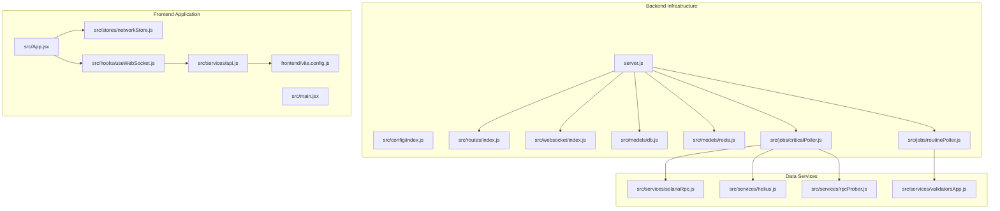
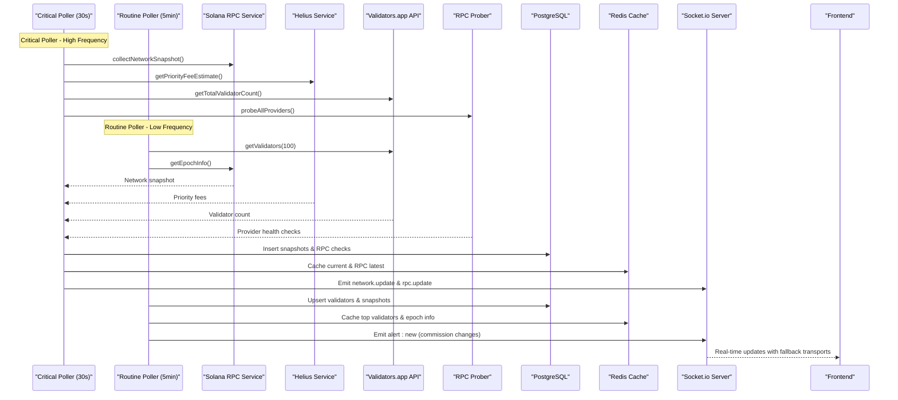
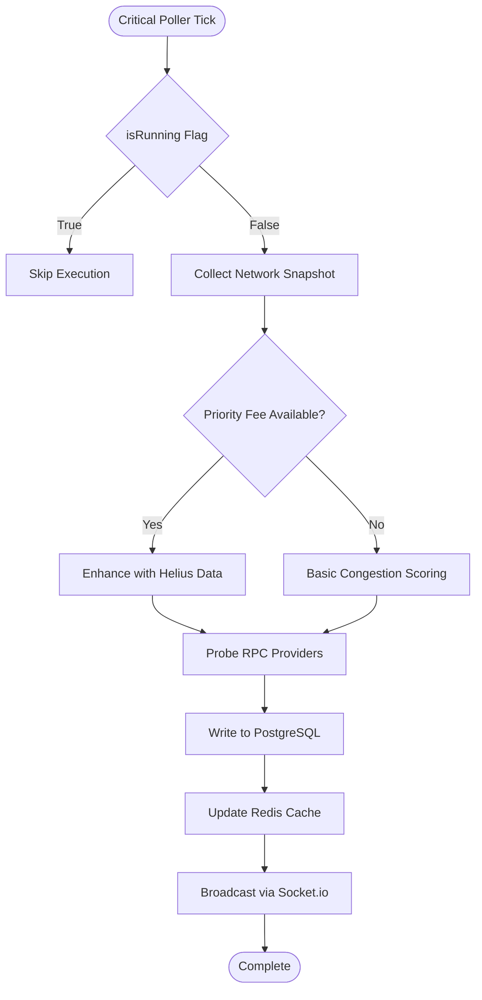
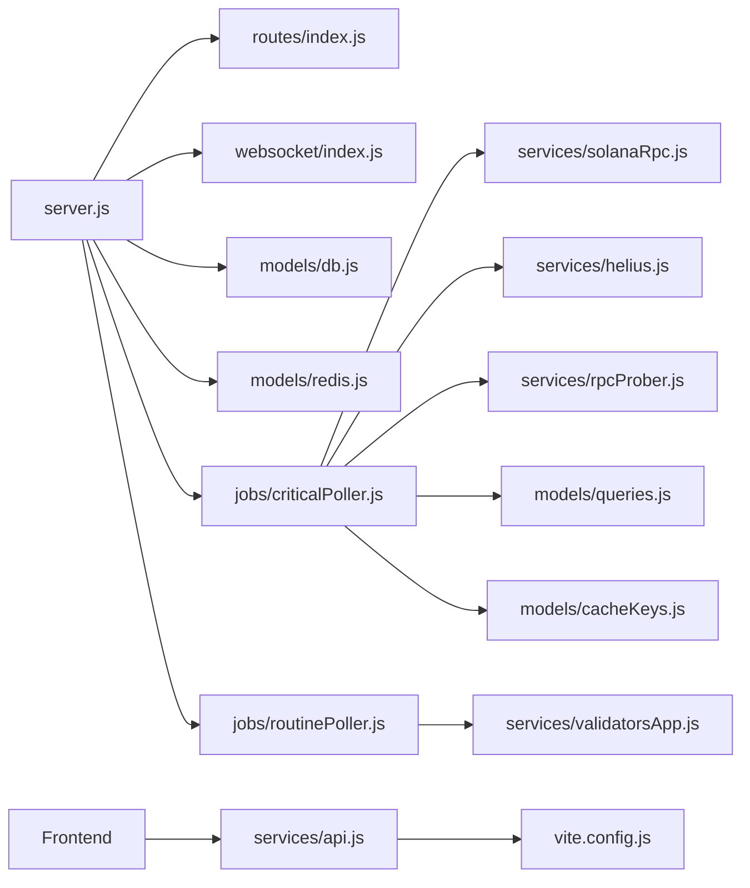

# Development Guide

<cite>
**Referenced Files in This Document**
- [backend/package.json](file://backend/package.json)
- [backend/server.js](file://backend/server.js)
- [backend/src/config/index.js](file://backend/src/config/index.js)
- [backend/src/routes/index.js](file://backend/src/routes/index.js)
- [backend/src/services/solanaRpc.js](file://backend/src/services/solanaRpc.js)
- [backend/src/services/helius.js](file://backend/src/services/helius.js)
- [backend/src/models/db.js](file://backend/src/models/db.js)
- [backend/src/models/redis.js](file://backend/src/models/redis.js)
- [backend/src/websocket/index.js](file://backend/src/websocket/index.js)
- [backend/src/jobs/criticalPoller.js](file://backend/src/jobs/criticalPoller.js)
- [backend/src/jobs/routinePoller.js](file://backend/src/jobs/routinePoller.js)
- [frontend/package.json](file://frontend/package.json)
- [frontend/vite.config.js](file://frontend/vite.config.js)
- [frontend/src/stores/networkStore.js](file://frontend/src/stores/networkStore.js)
- [frontend/src/hooks/useWebSocket.js](file://frontend/src/hooks/useWebSocket.js)
- [frontend/src/services/api.js](file://frontend/src/services/api.js)
- [frontend/src/App.jsx](file://frontend/src/App.jsx)
- [frontend/src/main.jsx](file://frontend/src/main.jsx)
</cite>

## Update Summary
**Changes Made**
- Added comprehensive documentation for the new dual-poller architecture with critical and routine pollers
- Updated architecture diagrams to reflect the enhanced real-time monitoring system
- Added detailed component analysis for the new routine poller service
- Enhanced deployment procedures section with production-ready configurations
- Updated testing strategies to cover both poller types and their coordination
- Expanded troubleshooting guide for the new polling infrastructure

## Table of Contents
1. [Introduction](#introduction)
2. [Project Structure](#project-structure)
3. [Core Components](#core-components)
4. [Architecture Overview](#architecture-overview)
5. [Detailed Component Analysis](#detailed-component-analysis)
6. [Dependency Analysis](#dependency-analysis)
7. [Performance Considerations](#performance-considerations)
8. [Testing Strategies](#testing-strategies)
9. [Debugging Techniques](#debugging-techniques)
10. [Build and Deployment](#build-and-deployment)
11. [Contribution Guidelines](#contribution-guidelines)
12. [Code Review Process](#code-review-process)
13. [Development Environment Setup](#development-environment-setup)
14. [Troubleshooting Guide](#troubleshooting-guide)
15. [Conclusion](#conclusion)

## Introduction
InfraWatch is a production-ready real-time Solana infrastructure monitoring dashboard featuring a comprehensive dual-poller architecture. The backend is a Node.js/Express server with Socket.io for real-time updates, implementing both critical and routine polling systems for network metrics and validator data. The system provides comprehensive infrastructure monitoring with automated alerting, historical data tracking, and scalable real-time communication.

## Project Structure
The repository follows a modular architecture with clear separation of concerns across backend, frontend, and deployment components:

**Diagram sources**
- [backend/server.js:1-128](file://backend/server.js#L1-L128)
- [backend/src/routes/index.js:1-26](file://backend/src/routes/index.js#L1-L26)
- [backend/src/websocket/index.js:1-81](file://backend/src/websocket/index.js#L1-L81)
- [backend/src/models/db.js:1-98](file://backend/src/models/db.js#L1-L98)
- [backend/src/models/redis.js:1-161](file://backend/src/models/redis.js#L1-L161)
- [backend/src/jobs/criticalPoller.js:1-129](file://backend/src/jobs/criticalPoller.js#L1-L129)
- [backend/src/jobs/routinePoller.js:1-129](file://backend/src/jobs/routinePoller.js#L1-L129)
- [backend/src/services/solanaRpc.js:1-359](file://backend/src/services/solanaRpc.js#L1-L359)
- [backend/src/services/helius.js:1-188](file://backend/src/services/helius.js#L1-L188)
- [frontend/src/App.jsx:1-31](file://frontend/src/App.jsx#L1-L31)
- [frontend/src/main.jsx:1-12](file://frontend/src/main.jsx#L1-L12)
- [frontend/src/services/api.js:1-43](file://frontend/src/services/api.js#L1-L43)
- [frontend/src/stores/networkStore.js:1-48](file://frontend/src/stores/networkStore.js#L1-L48)
- [frontend/src/hooks/useWebSocket.js:1-73](file://frontend/src/hooks/useWebSocket.js#L1-L73)
- [frontend/vite.config.js:1-18](file://frontend/vite.config.js#L1-L18)

**Section sources**
- [backend/server.js:1-128](file://backend/server.js#L1-L128)
- [frontend/src/App.jsx:1-31](file://frontend/src/App.jsx#L1-L31)

## Core Components
This section documents the primary building blocks of InfraWatch and their responsibilities in the production-ready architecture.

### Backend Server and Configuration
- Centralized configuration module with environment-based defaults for all services
- Express server with comprehensive middleware stack including security, compression, and CORS
- Graceful shutdown handling for production deployments
- Socket.io server with production-ready CORS configuration

### Dual Polling System
- **Critical Poller**: Runs every 30 seconds for real-time network monitoring
- **Routine Poller**: Runs every 5 minutes for validator data and historical tracking
- Both pollers implement concurrency guards to prevent overlapping executions
- Integrated alerting system for validator commission changes

### Data Services
- **Solana RPC Service**: Comprehensive network metrics collection with congestion scoring
- **Helius Integration**: Priority fee estimation and enhanced TPS data
- **Validators.app Integration**: Accurate validator count and commission tracking
- **RPC Prober**: Provider health monitoring and latency measurement

### Persistence and Caching
- PostgreSQL connection pooling with graceful degradation
- Redis caching with exponential backoff retry strategy
- Comprehensive cache key management for different data types

### Real-time Communication
- Socket.io server with connection tracking and broadcasting utilities
- Frontend WebSocket hook with automatic reconnection and data transformation
- Production-ready transport fallback mechanisms

**Section sources**
- [backend/server.js:1-128](file://backend/server.js#L1-L128)
- [backend/src/config/index.js:1-74](file://backend/src/config/index.js#L1-L74)
- [backend/src/jobs/criticalPoller.js:1-129](file://backend/src/jobs/criticalPoller.js#L1-L129)
- [backend/src/jobs/routinePoller.js:1-129](file://backend/src/jobs/routinePoller.js#L1-L129)
- [backend/src/services/solanaRpc.js:1-359](file://backend/src/services/solanaRpc.js#L1-L359)
- [backend/src/services/helius.js:1-188](file://backend/src/services/helius.js#L1-L188)

## Architecture Overview
The system implements a sophisticated dual-poller architecture designed for production-scale monitoring:

**Diagram sources**
- [backend/src/jobs/criticalPoller.js:22-124](file://backend/src/jobs/criticalPoller.js#L22-L124)
- [backend/src/jobs/routinePoller.js:20-124](file://backend/src/jobs/routinePoller.js#L20-L124)
- [backend/src/services/solanaRpc.js:289-347](file://backend/src/services/solanaRpc.js#L289-L347)
- [backend/src/services/helius.js:13-70](file://backend/src/services/helius.js#L13-L70)
- [backend/src/services/validatorsApp.js](file://backend/src/services/validatorsApp.js)
- [backend/src/services/rpcProber.js](file://backend/src/services/rpcProber.js)
- [backend/src/models/db.js:15-47](file://backend/src/models/db.js#L15-L47)
- [backend/src/models/redis.js:16-68](file://backend/src/models/redis.js#L16-L68)
- [backend/src/websocket/index.js:13-33](file://backend/src/websocket/index.js#L13-L33)

## Detailed Component Analysis

### Backend Server and Configuration
The server implements production-ready patterns with comprehensive error handling and graceful degradation:

- **Configuration Management**: Centralized environment variable handling with sensible defaults
- **Middleware Stack**: Security-first approach with Helmet, compression, and CORS
- **Graceful Shutdown**: Proper cleanup of database connections and server resources
- **Startup Sequence**: Sequential initialization with fallback for optional services

**Section sources**
- [backend/src/config/index.js:1-74](file://backend/src/config/index.js#L1-L74)
- [backend/server.js:1-128](file://backend/server.js#L1-L128)

### Routing and Middleware
The routing system provides a clean API surface with comprehensive error handling:

- **Route Aggregation**: Modular router mounting for network, RPC, validators, epoch, alerts, and bags
- **Error Handling**: Centralized 404 and error handlers with structured logging
- **Health Monitoring**: Dedicated health check endpoint with environment information

**Section sources**
- [backend/src/routes/index.js:1-26](file://backend/src/routes/index.js#L1-L26)
- [backend/server.js:61-79](file://backend/server.js#L61-L79)

### Dual Polling System

#### Critical Poller
The high-frequency poller (30-second intervals) focuses on real-time network monitoring:

- **Network Snapshot Collection**: Concurrent data gathering using Promise.all
- **Priority Fee Integration**: Enhanced congestion scoring with Helius data
- **RPC Health Monitoring**: Comprehensive provider health checking
- **Data Persistence**: Immediate PostgreSQL writes with graceful error handling
- **Real-time Broadcasting**: WebSocket emission for live dashboard updates

**Diagram sources**
- [backend/src/jobs/criticalPoller.js:22-124](file://backend/src/jobs/criticalPoller.js#L22-L124)

#### Routine Poller
The low-frequency poller (5-minute intervals) handles less time-sensitive data:

- **Validator Data**: Comprehensive validator information with commission tracking
- **Historical Snapshots**: Top 50 validators for historical analysis
- **Total Count Caching**: Accurate validator count with Redis caching
- **Commission Change Detection**: Automated alert generation for significant changes
- **Epoch Information**: Periodic epoch data refresh

**Section sources**
- [backend/src/jobs/criticalPoller.js:1-129](file://backend/src/jobs/criticalPoller.js#L1-L129)
- [backend/src/jobs/routinePoller.js:1-129](file://backend/src/jobs/routinePoller.js#L1-L129)

### Data Services

#### Solana RPC Service
Comprehensive network metrics collection with advanced congestion analysis:

- **Network Health**: Real-time health status monitoring
- **TPS Measurement**: Recent performance sampling with transaction counting
- **Slot Progression**: Latency calculation and slot timing analysis
- **Epoch Tracking**: Progress monitoring with ETA calculations
- **Validator Monitoring**: Delinquent validator identification
- **Congestion Scoring**: Multi-factor algorithm with priority fee integration

**Section sources**
- [backend/src/services/solanaRpc.js:1-359](file://backend/src/services/solanaRpc.js#L1-L359)

#### Helius Service
Enhanced data collection for priority fee estimation:

- **Priority Fee Estimation**: Comprehensive fee level analysis
- **API Key Management**: Configurable authentication with fallback handling
- **Timeout Protection**: 10-second timeout for reliable operation
- **Error Resilience**: Graceful degradation when API is unavailable

**Section sources**
- [backend/src/services/helius.js:1-188](file://backend/src/services/helius.js#L1-L188)

### Persistence and Caching

#### PostgreSQL Model
Production-ready database connectivity with comprehensive error handling:

- **Connection Pooling**: Configurable pool size with idle timeout management
- **Graceful Degradation**: Optional database features when unavailable
- **Query Management**: Proper client lifecycle and error logging
- **Connection Testing**: Automatic validation during initialization

**Section sources**
- [backend/src/models/db.js:1-98](file://backend/src/models/db.js#L1-L98)

#### Redis Model
Robust caching system with production resilience:

- **Lazy Initialization**: On-demand connection establishment
- **Exponential Backoff**: Progressive retry strategy for connection recovery
- **JSON Serialization**: Automatic data serialization with TTL support
- **Connection State Tracking**: Comprehensive connection monitoring

**Section sources**
- [backend/src/models/redis.js:1-161](file://backend/src/models/redis.js#L1-L161)

### Real-Time Communication

#### WebSocket Server
Production-grade real-time communication:

- **Connection Tracking**: Client count monitoring with detailed logging
- **Broadcast Utilities**: Flexible event broadcasting with room support
- **Error Handling**: Comprehensive error capture and logging
- **Graceful Degradation**: Optional WebSocket features when unavailable

**Section sources**
- [backend/src/websocket/index.js:1-81](file://backend/src/websocket/index.js#L1-L81)

#### Frontend WebSocket Hook
Advanced real-time data handling:

- **Automatic Reconnection**: Fallback transport support for reliability
- **Data Transformation**: Snake_case to camelCase conversion for consistency
- **State Management**: Integration with Zustand for reactive UI updates
- **Connection Monitoring**: Real-time connection status tracking

**Section sources**
- [frontend/src/hooks/useWebSocket.js:1-73](file://frontend/src/hooks/useWebSocket.js#L1-L73)
- [frontend/src/stores/networkStore.js:1-48](file://frontend/src/stores/networkStore.js#L1-L48)

### Frontend Application

#### Application Shell and Routing
Modern React application with comprehensive routing:

- **React Router Integration**: Nested route structure under AppShell
- **Component Organization**: Modular component architecture
- **State Management**: Zustand for efficient state handling

**Section sources**
- [frontend/src/App.jsx:1-31](file://frontend/src/App.jsx#L1-L31)

#### State Management with Zustand
Efficient frontend state management:

- **Network State**: Current metrics, history, and connection status
- **TPS History**: Sparkline data accumulation with size limits
- **History Range**: Configurable time window for historical data
- **Reactive Updates**: Automatic UI updates from WebSocket data

**Section sources**
- [frontend/src/stores/networkStore.js:1-48](file://frontend/src/stores/networkStore.js#L1-L48)

#### API Layer and Development Server
Production-ready frontend infrastructure:

- **Axios Configuration**: Base URL, interceptors, and error handling
- **Development Proxy**: Seamless backend integration during development
- **Port Configuration**: Flexible development environment setup

**Section sources**
- [frontend/src/services/api.js](file://frontend/src/services/api.js)
- [frontend/vite.config.js:1-18](file://frontend/vite.config.js#L1-L18)

## Dependency Analysis
The backend implements clear layer separation with comprehensive dependency management:

**Diagram sources**
- [backend/server.js:1-128](file://backend/server.js#L1-L128)
- [backend/src/routes/index.js:1-26](file://backend/src/routes/index.js#L1-L26)
- [backend/src/websocket/index.js:1-81](file://backend/src/websocket/index.js#L1-L81)
- [backend/src/models/db.js:1-98](file://backend/src/models/db.js#L1-L98)
- [backend/src/models/redis.js:1-161](file://backend/src/models/redis.js#L1-L161)
- [backend/src/jobs/criticalPoller.js:1-129](file://backend/src/jobs/criticalPoller.js#L1-L129)
- [backend/src/jobs/routinePoller.js:1-129](file://backend/src/jobs/routinePoller.js#L1-L129)
- [backend/src/services/solanaRpc.js:1-359](file://backend/src/services/solanaRpc.js#L1-L359)
- [backend/src/services/helius.js:1-188](file://backend/src/services/helius.js#L1-L188)
- [frontend/src/services/api.js](file://frontend/src/services/api.js)
- [frontend/vite.config.js:1-18](file://frontend/vite.config.js#L1-L18)

**Section sources**
- [backend/package.json:1-36](file://backend/package.json#L1-L36)
- [frontend/package.json:1-40](file://frontend/package.json#L1-L40)

## Performance Considerations
The production-ready architecture implements multiple optimization strategies:

- **Concurrency Control**: Both pollers use running flags to prevent overlapping executions
- **Asynchronous Operations**: Promise.all for concurrent data fetching across all services
- **Caching Strategy**: Redis cache with appropriate TTL values for different data types
- **Connection Pooling**: PostgreSQL pool with configurable limits and timeouts
- **Retry Logic**: Exponential backoff for Redis connection recovery
- **Graceful Degradation**: Optional services continue operating when unavailable
- **Memory Management**: Frontend state limits with automatic cleanup
- **Network Optimization**: Compression middleware and efficient WebSocket usage

## Testing Strategies
Comprehensive testing approach for the production-ready system:

### Backend Testing
- **Unit Tests**: Individual service testing with mock external APIs
- **Integration Tests**: End-to-end poller workflow validation
- **Load Testing**: Simulated high-frequency polling scenarios
- **Failure Scenarios**: Database unavailability, API timeouts, network failures
- **Concurrency Testing**: Multiple poller executions and race conditions

### Frontend Testing
- **Component Testing**: UI element rendering and interaction validation
- **WebSocket Testing**: Real-time data flow and connection handling
- **State Management**: Store updates and data transformation accuracy
- **Performance Testing**: Large dataset handling and memory usage

### Database Testing
- **Schema Validation**: Migration testing and table structure verification
- **Query Performance**: Index usage and query optimization
- **Connection Testing**: Pool behavior under load and connection limits

## Debugging Techniques
Production-ready debugging and monitoring approaches:

### Backend Debugging
- **Structured Logging**: Comprehensive error logging with context information
- **Health Checks**: Regular monitoring of service availability
- **Database Monitoring**: Connection pool statistics and query performance
- **Redis Monitoring**: Cache hit rates and connection health
- **Poller Monitoring**: Execution timing and success rates

### Frontend Debugging
- **Developer Tools**: Network tab for API requests and WebSocket connections
- **State Inspection**: React DevTools for state management debugging
- **Console Logging**: Detailed client-side error reporting
- **Performance Profiling**: Memory usage and rendering performance

### Production Monitoring
- **Error Tracking**: Centralized error reporting and alerting
- **Metrics Collection**: Performance metrics and system health indicators
- **Log Aggregation**: Structured logging for troubleshooting
- **Service Health**: Automated health checks and dependency monitoring

**Section sources**
- [backend/server.js:109-124](file://backend/server.js#L109-L124)
- [backend/src/websocket/index.js:13-33](file://backend/src/websocket/index.js#L13-L33)

## Build and Deployment
Production-ready deployment procedures and configurations:

### Backend Deployment
- **Node.js Version**: Requires Node.js 20+ for optimal performance
- **Process Management**: PM2 or similar process manager recommended
- **Environment Variables**: Production configuration with secrets management
- **Database Migration**: Automated schema migration on startup
- **Health Checks**: Docker health checks and readiness probes

### Frontend Deployment
- **Static Assets**: Optimized build with CDN support
- **Service Worker**: Optional offline support and caching strategies
- **Environment Configuration**: Build-time environment variable injection
- **Bundle Analysis**: Performance optimization and bundle size monitoring

### Infrastructure Configuration
- **Nginx**: Reverse proxy with WebSocket support and SSL termination
- **Docker**: Containerization with multi-stage builds
- **CI/CD**: Automated testing and deployment pipelines
- **Monitoring**: Application performance monitoring and error tracking

### Scaling Considerations
- **Horizontal Scaling**: Load balancer configuration for multiple instances
- **Database Scaling**: Read replicas and connection pooling
- **Cache Scaling**: Redis clustering for high availability
- **WebSocket Scaling**: Sticky sessions for real-time features

**Section sources**
- [backend/package.json:6-21](file://backend/package.json#L6-L21)
- [frontend/package.json:6-11](file://frontend/package.json#L6-L11)
- [backend/src/config/index.js:27-71](file://backend/src/config/index.js#L27-L71)

## Contribution Guidelines
Standardized contribution process for the production-ready codebase:

### Development Workflow
- **Branch Strategy**: Feature branches from main with pull requests
- **Code Standards**: Consistent coding style and documentation requirements
- **Testing Requirements**: Comprehensive test coverage for new features
- **Review Process**: Automated CI checks and human code review
- **Documentation**: Updated documentation for significant changes

### Code Quality
- **Linting**: ESLint and Prettier for code formatting
- **Type Checking**: TypeScript for critical components
- **Security**: Security scanning and dependency vulnerability checks
- **Performance**: Performance regression testing and optimization

### Release Process
- **Versioning**: Semantic versioning with changelog maintenance
- **Changelog**: Detailed release notes for each version
- **Deployment**: Blue-green deployment strategy for zero downtime
- **Rollback**: Automated rollback procedures for failed releases

## Code Review Process
Structured review process ensuring code quality and system reliability:

### Review Criteria
- **Correctness**: Algorithm accuracy and business logic validation
- **Performance**: Efficiency considerations and resource usage
- **Security**: Security best practices and vulnerability prevention
- **Maintainability**: Code clarity, documentation, and test coverage
- **Compatibility**: Backward compatibility and upgrade considerations

### Review Tools
- **Automated Checks**: Linting, testing, and security scanning
- **Peer Review**: Technical expertise and domain knowledge assessment
- **Stakeholder Review**: Business requirements and user experience validation
- **Production Review**: Deployment readiness and monitoring requirements

## Development Environment Setup
Comprehensive development environment configuration:

### Backend Setup
- **Dependencies**: npm ci for consistent dependency installation
- **Environment Configuration**: .env file with required API keys
- **Database Setup**: Local PostgreSQL instance for development
- **Redis Setup**: Local Redis instance for caching features
- **API Keys**: Solana RPC endpoints and optional Helius integration

### Frontend Setup
- **React Development**: Vite with React Fast Refresh
- **Proxy Configuration**: Automatic API and WebSocket proxying
- **Development Tools**: Browser extensions for React and Redux debugging
- **Hot Reloading**: Fast development iteration with automatic refresh

### Database and Caching
- **Local Development**: Docker containers for PostgreSQL and Redis
- **Schema Management**: Migration scripts for database schema changes
- **Test Data**: Seed data for development and testing environments
- **Backup Strategy**: Local backup and restore procedures

**Section sources**
- [backend/package.json:6-9](file://backend/package.json#L6-L9)
- [frontend/package.json:6-11](file://frontend/package.json#L6-L11)
- [frontend/vite.config.js:7-16](file://frontend/vite.config.js#L7-L16)

## Troubleshooting Guide
Comprehensive troubleshooting for production issues:

### Backend Issues
- **Startup Failures**: Configuration validation and dependency resolution
- **Database Connectivity**: Connection pool issues and query performance
- **Redis Connection**: Network issues and connection recovery
- **Poller Failures**: Execution timing and error handling
- **WebSocket Issues**: Connection problems and broadcast failures

### Frontend Issues
- **Build Failures**: Dependency conflicts and build optimization
- **Runtime Errors**: State management issues and component rendering
- **Network Problems**: API connectivity and proxy configuration
- **WebSocket Issues**: Connection drops and reconnection handling

### Performance Issues
- **Memory Leaks**: Frontend state growth and backend resource usage
- **Database Performance**: Slow queries and connection pool exhaustion
- **Network Latency**: API response times and WebSocket delays
- **Scaling Problems**: Load balancing and horizontal scaling issues

### Production Monitoring
- **Error Tracking**: Centralized logging and error aggregation
- **Performance Metrics**: Response times and throughput monitoring
- **Health Checks**: Automated system health verification
- **Alerting**: Notification systems for critical issues

**Section sources**
- [backend/src/config/index.js:8-13](file://backend/src/config/index.js#L8-L13)
- [backend/server.js:89-102](file://backend/server.js#L89-L102)
- [frontend/vite.config.js:9-15](file://frontend/vite.config.js#L9-L15)

## Conclusion
InfraWatch provides a comprehensive, production-ready solution for Solana infrastructure monitoring with a robust dual-poller architecture, real-time communication capabilities, and extensive monitoring features. The system's modular design, comprehensive error handling, and production-ready deployment procedures enable reliable operation at scale while maintaining excellent developer experience and system maintainability.

The documented patterns for services, state management, background jobs, and real-time communication create a solid foundation for contributors to develop new features while ensuring system reliability, performance, and scalability requirements are met.