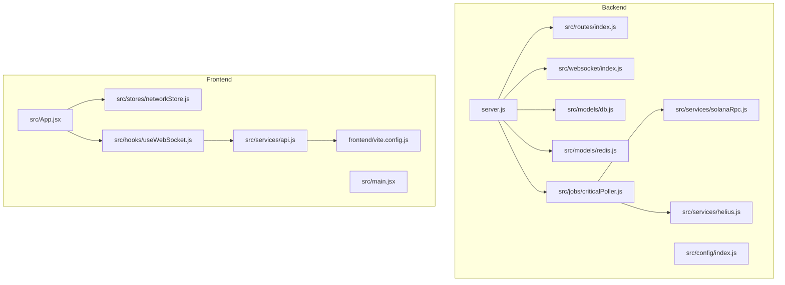
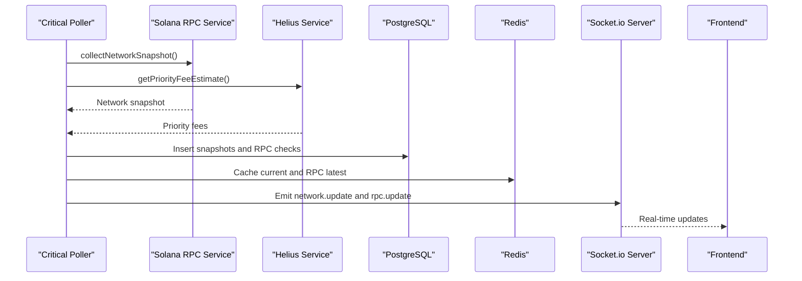
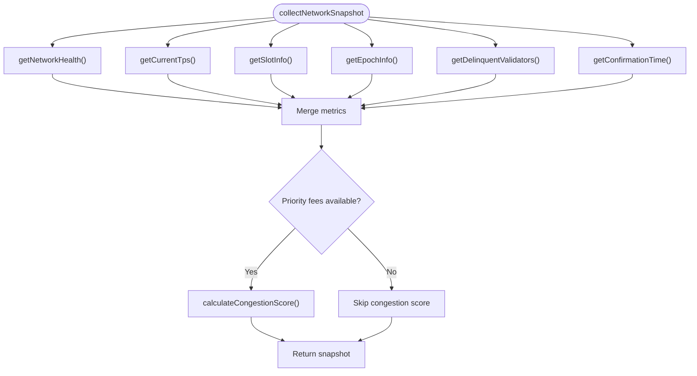
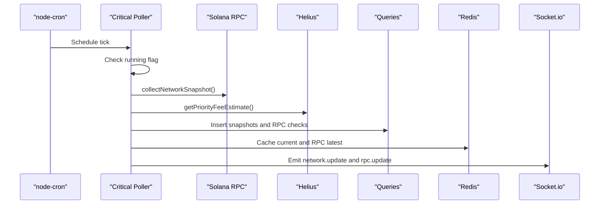
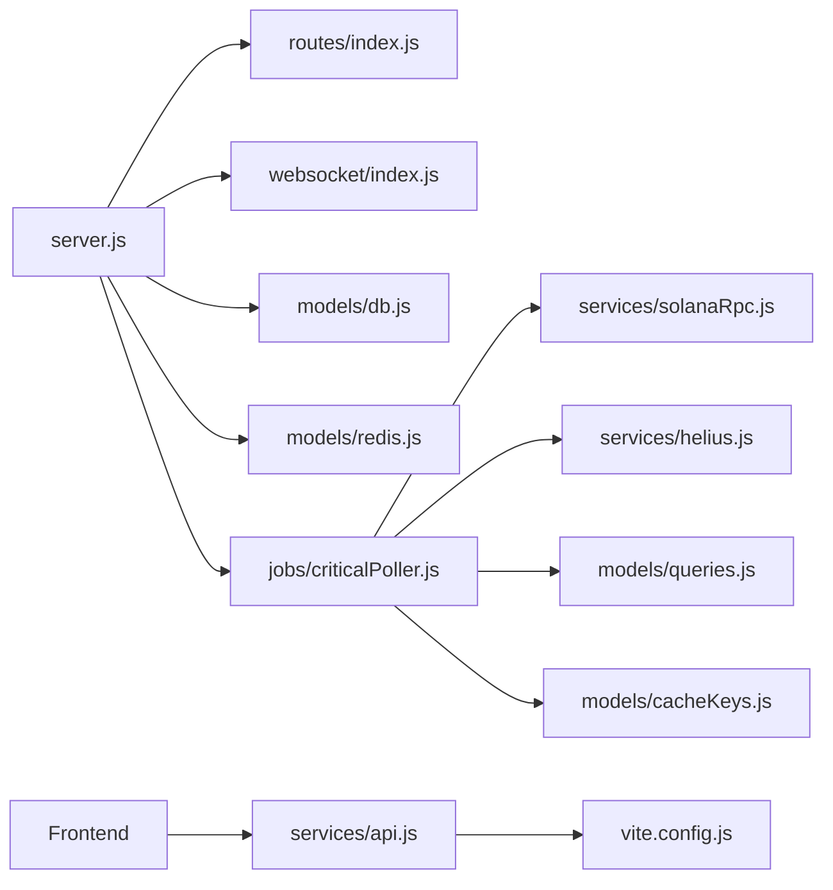

# Development Guide

<cite>
**Referenced Files in This Document**
- [backend/package.json](file://backend/package.json)
- [backend/server.js](file://backend/server.js)
- [backend/src/config/index.js](file://backend/src/config/index.js)
- [backend/src/routes/index.js](file://backend/src/routes/index.js)
- [backend/src/services/solanaRpc.js](file://backend/src/services/solanaRpc.js)
- [backend/src/services/helius.js](file://backend/src/services/helius.js)
- [backend/src/models/db.js](file://backend/src/models/db.js)
- [backend/src/models/redis.js](file://backend/src/models/redis.js)
- [backend/src/websocket/index.js](file://backend/src/websocket/index.js)
- [backend/src/jobs/criticalPoller.js](file://backend/src/jobs/criticalPoller.js)
- [frontend/package.json](file://frontend/package.json)
- [frontend/vite.config.js](file://frontend/vite.config.js)
- [frontend/eslint.config.js](file://frontend/eslint.config.js)
- [frontend/src/stores/networkStore.js](file://frontend/src/stores/networkStore.js)
- [frontend/src/hooks/useWebSocket.js](file://frontend/src/hooks/useWebSocket.js)
- [frontend/src/services/api.js](file://frontend/src/services/api.js)
- [frontend/src/App.jsx](file://frontend/src/App.jsx)
- [frontend/src/main.jsx](file://frontend/src/main.jsx)
</cite>

## Table of Contents
1. [Introduction](#introduction)
2. [Project Structure](#project-structure)
3. [Core Components](#core-components)
4. [Architecture Overview](#architecture-overview)
5. [Detailed Component Analysis](#detailed-component-analysis)
6. [Dependency Analysis](#dependency-analysis)
7. [Performance Considerations](#performance-considerations)
8. [Testing Strategies](#testing-strategies)
9. [Debugging Techniques](#debugging-techniques)
10. [Build and Deployment](#build-and-deployment)
11. [Contribution Guidelines](#contribution-guidelines)
12. [Code Review Process](#code-review-process)
13. [Development Environment Setup](#development-environment-setup)
14. [Troubleshooting Guide](#troubleshooting-guide)
15. [Conclusion](#conclusion)

## Introduction
InfraWatch is a real-time Solana infrastructure monitoring dashboard with a modern full-stack architecture. The backend is a Node.js/Express server with Socket.io for real-time updates, cron-based polling for network metrics, and optional integrations with PostgreSQL and Redis for persistence and caching. The frontend is a React application using Vite for development, Zustand for state management, and Recharts for data visualization.

## Project Structure
The repository follows a clear separation of concerns:
- backend: Express server, routing, services, models, jobs, and WebSocket setup
- frontend: React application with components, stores, hooks, services, and pages
- Shared configuration and environment variables managed centrally

**Diagram sources**
- [backend/server.js:1-128](file://backend/server.js#L1-L128)
- [backend/src/routes/index.js:1-24](file://backend/src/routes/index.js#L1-L24)
- [backend/src/websocket/index.js:1-81](file://backend/src/websocket/index.js#L1-L81)
- [backend/src/models/db.js:1-98](file://backend/src/models/db.js#L1-L98)
- [backend/src/models/redis.js:1-161](file://backend/src/models/redis.js#L1-L161)
- [backend/src/services/solanaRpc.js:1-340](file://backend/src/services/solanaRpc.js#L1-L340)
- [backend/src/services/helius.js:1-188](file://backend/src/services/helius.js#L1-L188)
- [backend/src/jobs/criticalPoller.js:1-108](file://backend/src/jobs/criticalPoller.js#L1-L108)
- [frontend/src/App.jsx:1-31](file://frontend/src/App.jsx#L1-L31)
- [frontend/src/main.jsx:1-12](file://frontend/src/main.jsx#L1-L12)
- [frontend/src/services/api.js:1-43](file://frontend/src/services/api.js#L1-L43)
- [frontend/src/stores/networkStore.js:1-25](file://frontend/src/stores/networkStore.js#L1-L25)
- [frontend/src/hooks/useWebSocket.js:1-30](file://frontend/src/hooks/useWebSocket.js#L1-L30)
- [frontend/vite.config.js:1-18](file://frontend/vite.config.js#L1-L18)

**Section sources**
- [backend/server.js:1-128](file://backend/server.js#L1-L128)
- [frontend/src/App.jsx:1-31](file://frontend/src/App.jsx#L1-L31)

## Core Components
This section documents the primary building blocks of InfraWatch and their responsibilities.

- Backend server and middleware stack
  - Express server with Helmet, compression, CORS, JSON parsing, and global error handling
  - Health check endpoint and centralized configuration loading
  - Graceful shutdown handling for SIGTERM/SIGINT signals

- Routing and API surface
  - Route aggregator mounting network, RPC, validators, epoch, and alerts sub-routers
  - Standardized 404 and error handling middleware

- Data collection services
  - Solana RPC service for network health, TPS, slot info, epoch info, delinquent validators, and congestion scoring
  - Helius service for priority fee estimates and enhanced TPS data
  - RPC prober service (referenced by critical poller) for provider health checks

- Persistence and caching
  - PostgreSQL connection pool with lazy initialization and error handling
  - Redis client with retry strategy, JSON serialization, and TTL support

- Real-time communication
  - Socket.io server with connection tracking and broadcast utilities
  - Frontend WebSocket hook for connecting and receiving network updates

- Background jobs
  - Critical poller job running every 30 seconds to collect snapshots, probe RPC providers, persist data, update cache, and emit WebSocket events

**Section sources**
- [backend/server.js:1-128](file://backend/server.js#L1-L128)
- [backend/src/routes/index.js:1-24](file://backend/src/routes/index.js#L1-L24)
- [backend/src/services/solanaRpc.js:1-340](file://backend/src/services/solanaRpc.js#L1-L340)
- [backend/src/services/helius.js:1-188](file://backend/src/services/helius.js#L1-L188)
- [backend/src/models/db.js:1-98](file://backend/src/models/db.js#L1-L98)
- [backend/src/models/redis.js:1-161](file://backend/src/models/redis.js#L1-L161)
- [backend/src/websocket/index.js:1-81](file://backend/src/websocket/index.js#L1-L81)
- [backend/src/jobs/criticalPoller.js:1-108](file://backend/src/jobs/criticalPoller.js#L1-L108)

## Architecture Overview
The system architecture combines a reactive backend with a real-time frontend:

**Diagram sources**
- [backend/src/jobs/criticalPoller.js:1-108](file://backend/src/jobs/criticalPoller.js#L1-L108)
- [backend/src/services/solanaRpc.js:1-340](file://backend/src/services/solanaRpc.js#L1-L340)
- [backend/src/services/helius.js:1-188](file://backend/src/services/helius.js#L1-L188)
- [backend/src/models/db.js:1-98](file://backend/src/models/db.js#L1-L98)
- [backend/src/models/redis.js:1-161](file://backend/src/models/redis.js#L1-L161)
- [backend/src/websocket/index.js:1-81](file://backend/src/websocket/index.js#L1-L81)

## Detailed Component Analysis

### Backend Server and Configuration
- Centralized configuration module loads environment variables with sensible defaults and constructs Helius RPC URLs from API keys
- Express server applies security middleware, compression, CORS, JSON parsing, and mounts health check, routes, and error handlers
- Socket.io server configured with CORS settings from configuration and exposed globally for use by other modules
- Data stores initialized during startup with graceful failure handling; pollers started after initialization

**Section sources**
- [backend/src/config/index.js:1-68](file://backend/src/config/index.js#L1-L68)
- [backend/server.js:1-128](file://backend/server.js#L1-L128)

### Routing and Middleware
- Route aggregator mounts sub-routers for network, RPC, validators, epoch, and alerts
- Global error handler and 404 handler ensure consistent error responses
- Health check endpoint provides operational status

**Section sources**
- [backend/src/routes/index.js:1-24](file://backend/src/routes/index.js#L1-L24)
- [backend/server.js:70-79](file://backend/server.js#L70-L79)

### Data Services

#### Solana RPC Service
- Provides network health, TPS, slot progression, epoch info, delinquent validators, and confirmation time
- Calculates congestion score using weighted components (TPS, priority fees, slot latency)
- Collects a complete network snapshot and handles errors gracefully

**Diagram sources**
- [backend/src/services/solanaRpc.js:275-328](file://backend/src/services/solanaRpc.js#L275-L328)

**Section sources**
- [backend/src/services/solanaRpc.js:1-340](file://backend/src/services/solanaRpc.js#L1-L340)

#### Helius Service
- Fetches priority fee estimates and enhanced TPS data via Helius RPC
- Includes robust error handling and timeout configuration
- Returns null when API key is not configured

**Section sources**
- [backend/src/services/helius.js:1-188](file://backend/src/services/helius.js#L1-L188)

### Persistence and Caching

#### PostgreSQL Model
- Lazy-initialized connection pool with connection limits and timeouts
- Query wrapper ensures proper client lifecycle and error logging
- Graceful handling when DATABASE_URL is not configured

**Section sources**
- [backend/src/models/db.js:1-98](file://backend/src/models/db.js#L1-L98)

#### Redis Model
- Lazy-initialized client with exponential backoff retry strategy
- JSON serialization/deserialization helpers with TTL support
- Robust error handling and connection state tracking

**Section sources**
- [backend/src/models/redis.js:1-161](file://backend/src/models/redis.js#L1-L161)

### Real-Time Communication

#### WebSocket Server
- Tracks connected clients and logs connection/disconnection events
- Provides broadcast utilities for network and RPC updates
- Exposes connection count for monitoring

**Section sources**
- [backend/src/websocket/index.js:1-81](file://backend/src/websocket/index.js#L1-L81)

#### Frontend WebSocket Hook
- Connects to Socket.io with fallback transports
- Updates Zustand store with real-time network data
- Handles connection state changes

**Section sources**
- [frontend/src/hooks/useWebSocket.js:1-30](file://frontend/src/hooks/useWebSocket.js#L1-L30)
- [frontend/src/stores/networkStore.js:1-25](file://frontend/src/stores/networkStore.js#L1-L25)

### Background Jobs

#### Critical Poller
- Runs every 30 seconds using node-cron
- Coordinates data collection, persistence, caching, and real-time broadcasting
- Implements concurrency guard to prevent overlapping executions

**Diagram sources**
- [backend/src/jobs/criticalPoller.js:21-103](file://backend/src/jobs/criticalPoller.js#L21-L103)

**Section sources**
- [backend/src/jobs/criticalPoller.js:1-108](file://backend/src/jobs/criticalPoller.js#L1-L108)

### Frontend Application

#### Application Shell and Routing
- React Router-based routing with nested routes under AppShell
- Centralized App component orchestrating page-level routes

**Section sources**
- [frontend/src/App.jsx:1-31](file://frontend/src/App.jsx#L1-L31)

#### State Management with Zustand
- Minimalist store managing current network state, history, epoch info, connection status, and update timestamps
- Actions for updating state and managing history range

**Section sources**
- [frontend/src/stores/networkStore.js:1-25](file://frontend/src/stores/networkStore.js#L1-L25)

#### API Layer
- Axios instance with base URL pointing to /api, request/response interceptors, and error logging
- Centralized configuration for API requests

**Section sources**
- [frontend/src/services/api.js:1-43](file://frontend/src/services/api.js#L1-L43)

#### Development Server and Proxy
- Vite dev server with proxy configuration for /api and /socket.io
- Frontend runs on port 5173, backend on port 3001

**Section sources**
- [frontend/vite.config.js:1-18](file://frontend/vite.config.js#L1-L18)

## Dependency Analysis
The backend maintains clear boundaries between layers:

**Diagram sources**
- [backend/server.js:1-128](file://backend/server.js#L1-L128)
- [backend/src/routes/index.js:1-24](file://backend/src/routes/index.js#L1-L24)
- [backend/src/websocket/index.js:1-81](file://backend/src/websocket/index.js#L1-L81)
- [backend/src/models/db.js:1-98](file://backend/src/models/db.js#L1-L98)
- [backend/src/models/redis.js:1-161](file://backend/src/models/redis.js#L1-L161)
- [backend/src/jobs/criticalPoller.js:1-108](file://backend/src/jobs/criticalPoller.js#L1-L108)
- [backend/src/services/solanaRpc.js:1-340](file://backend/src/services/solanaRpc.js#L1-L340)
- [backend/src/services/helius.js:1-188](file://backend/src/services/helius.js#L1-L188)
- [frontend/src/services/api.js:1-43](file://frontend/src/services/api.js#L1-L43)
- [frontend/vite.config.js:1-18](file://frontend/vite.config.js#L1-L18)

**Section sources**
- [backend/package.json:1-36](file://backend/package.json#L1-L36)
- [frontend/package.json:1-39](file://frontend/package.json#L1-L39)

## Performance Considerations
- Concurrency control: Critical poller uses a running flag to prevent overlapping executions
- Asynchronous operations: Services use Promise.all for concurrent data fetching
- Caching: Redis cache reduces database load and improves response times
- Connection pooling: PostgreSQL pool manages connections efficiently
- Retry strategy: Redis client implements exponential backoff for resilience
- Compression and security: Express compression and Helmet reduce payload sizes and improve security posture

## Testing Strategies
- Backend
  - Unit tests for individual services (RPC, Helius, DB, Redis) focusing on error handling and edge cases
  - Integration tests for critical poller workflow and data persistence
  - Mock external services (RPC, Helius) for deterministic testing
- Frontend
  - Component tests for UI elements and state transitions
  - WebSocket integration tests verifying real-time updates
  - API service tests with mocked interceptors

[No sources needed since this section provides general guidance]

## Debugging Techniques
- Backend
  - Enable verbose logging in development mode
  - Use structured error logging with error handlers
  - Monitor Socket.io connection counts and events
  - Verify database and Redis connectivity during startup
- Frontend
  - Utilize browser developer tools for network inspection
  - Monitor WebSocket connection status in the store
  - Inspect API request/response cycles with interceptors

**Section sources**
- [backend/server.js:109-124](file://backend/server.js#L109-L124)
- [backend/src/websocket/index.js:13-33](file://backend/src/websocket/index.js#L13-L33)

## Build and Deployment
- Backend
  - Production start script uses Node.js without watch mode
  - Requires Node.js version 20+ as specified in engines
- Frontend
  - Vite build generates optimized production assets
  - Preview command for local testing of built assets
- Environment
  - Centralized configuration via environment variables with sensible defaults
  - CORS origin configurable for development and production

**Section sources**
- [backend/package.json:6-21](file://backend/package.json#L6-L21)
- [frontend/package.json:6-11](file://frontend/package.json#L6-L11)
- [backend/src/config/index.js:27-65](file://backend/src/config/index.js#L27-L65)

## Contribution Guidelines
- Fork and branch from the main branch for features and fixes
- Follow existing code style and patterns
- Include unit/integration tests for new functionality
- Update documentation for significant changes
- Keep commits focused and well-documented

[No sources needed since this section provides general guidance]

## Code Review Process
- All changes require at least one reviewer from maintainers
- Focus areas: correctness, performance, security, maintainability
- Ensure tests pass and code adheres to established patterns
- Verify environment variable usage and configuration safety

[No sources needed since this section provides general guidance]

## Development Environment Setup
- Backend
  - Install dependencies with npm ci
  - Configure environment variables (.env) with required keys
  - Start with npm run dev for hot reloading
- Frontend
  - Install dependencies with npm ci
  - Start Vite dev server with npm run dev
  - Proxy configuration automatically forwards /api and /socket.io to backend
- Database and Redis
  - Configure DATABASE_URL and REDIS_URL for persistent features
  - Optional Helius API key for enhanced metrics

**Section sources**
- [backend/package.json:6-9](file://backend/package.json#L6-L9)
- [frontend/package.json:6-11](file://frontend/package.json#L6-L11)
- [frontend/vite.config.js:7-16](file://frontend/vite.config.js#L7-L16)

## Troubleshooting Guide
- Backend startup issues
  - Check NODE_ENV and PORT configuration
  - Verify DATABASE_URL and REDIS_URL are accessible
  - Review error logs for initialization failures
- Frontend connectivity
  - Confirm Vite proxy settings match backend port
  - Check browser console for WebSocket connection errors
  - Validate CORS origin configuration
- Data freshness
  - Monitor critical poller logs for execution timing
  - Verify Redis cache keys and TTL values
  - Check database insertion logs for failures

**Section sources**
- [backend/src/config/index.js:8-13](file://backend/src/config/index.js#L8-L13)
- [backend/server.js:89-102](file://backend/server.js#L89-L102)
- [frontend/vite.config.js:9-15](file://frontend/vite.config.js#L9-L15)

## Conclusion
InfraWatch provides a robust foundation for Solana infrastructure monitoring with clear separation of concerns, real-time capabilities, and extensible architecture. The documented patterns for services, state management, and background jobs enable contributors to develop features efficiently while maintaining system reliability and performance.