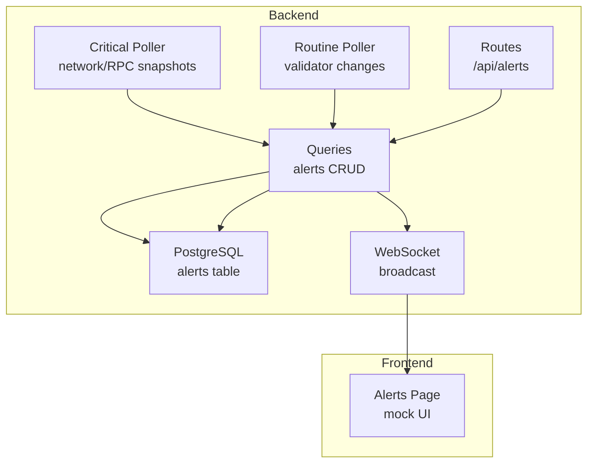
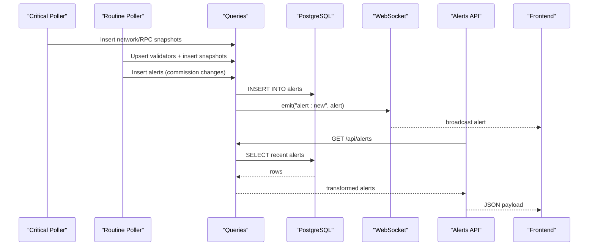
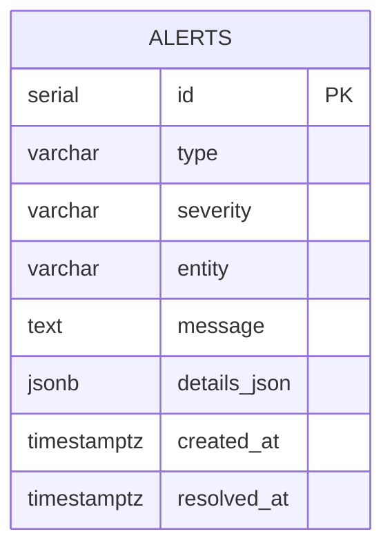
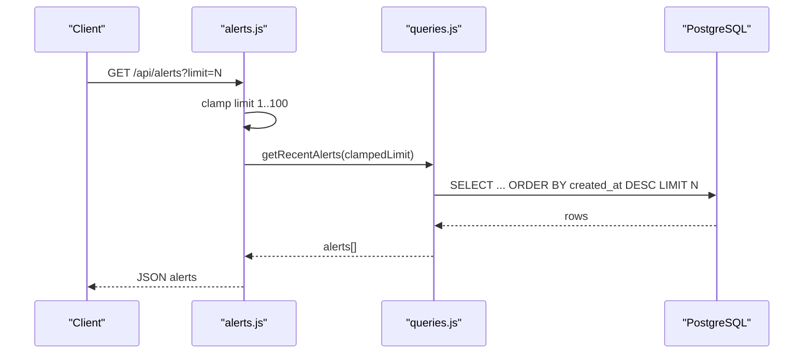
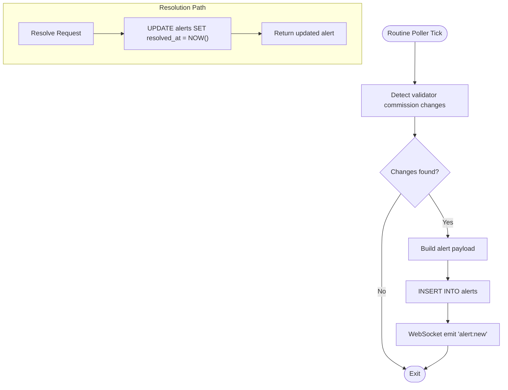
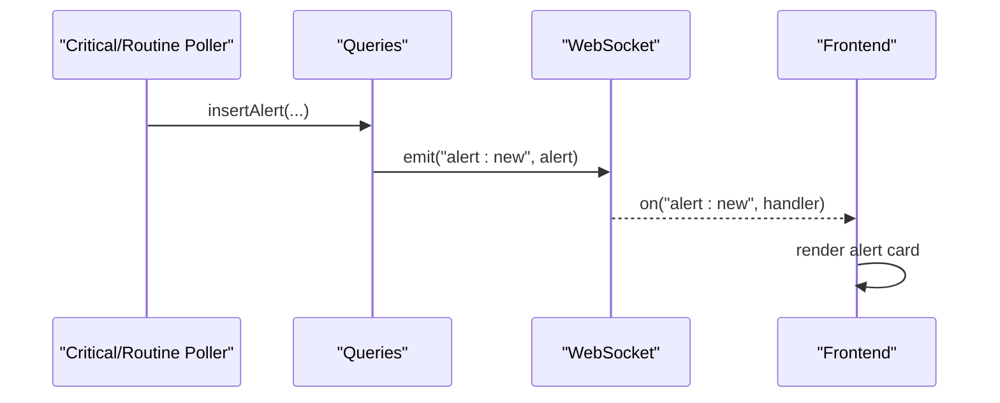
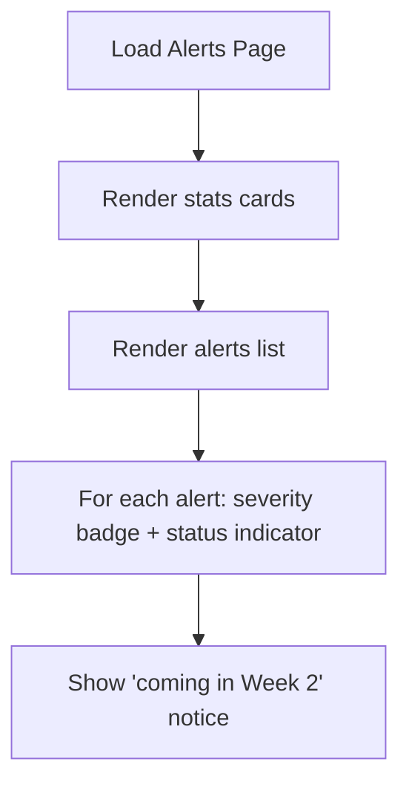
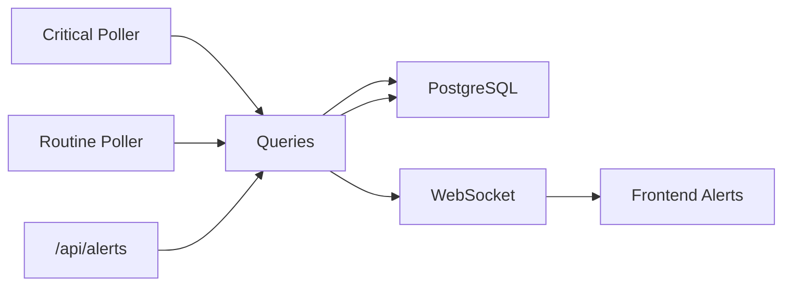

# Alert System

<cite>
**Referenced Files in This Document**
- [alerts.js](file://backend/src/routes/alerts.js)
- [queries.js](file://backend/src/models/queries.js)
- [migrate.js](file://backend/src/models/migrate.js)
- [db.js](file://backend/src/models/db.js)
- [criticalPoller.js](file://backend/src/jobs/criticalPoller.js)
- [routinePoller.js](file://backend/src/jobs/routinePoller.js)
- [rpcProber.js](file://backend/src/services/rpcProber.js)
- [helius.js](file://backend/src/services/helius.js)
- [websocket/index.js](file://backend/src/websocket/index.js)
- [server.js](file://backend/server.js)
- [routes/index.js](file://backend/src/routes/index.js)
- [Alerts.jsx](file://frontend/src/pages/Alerts.jsx)
- [build_plan.md](file://infrawatch_build_plan.md)
</cite>

## Table of Contents
1. [Introduction](#introduction)
2. [Project Structure](#project-structure)
3. [Core Components](#core-components)
4. [Architecture Overview](#architecture-overview)
5. [Detailed Component Analysis](#detailed-component-analysis)
6. [Dependency Analysis](#dependency-analysis)
7. [Performance Considerations](#performance-considerations)
8. [Troubleshooting Guide](#troubleshooting-guide)
9. [Conclusion](#conclusion)

## Introduction
This document describes the Alert System functionality in InfraWatch. It explains how alerts are generated from network conditions, RPC provider health, and validator changes, how alert data is stored and retrieved, and how the system integrates with external notification channels. It also documents the current state of alert management capabilities and outlines planned enhancements for user-configurable thresholds, notification preferences, and webhook integrations.

## Project Structure
The alert system spans backend services, database persistence, scheduled jobs, and a basic frontend view. The backend exposes a REST endpoint for retrieving recent alerts and uses WebSocket to broadcast new alerts in real time. Scheduled jobs detect changes and insert alert records into the database.

**Diagram sources**
- [alerts.js:1-46](file://backend/src/routes/alerts.js#L1-L46)
- [queries.js:348-458](file://backend/src/models/queries.js#L348-L458)
- [migrate.js:80-94](file://backend/src/models/migrate.js#L80-L94)
- [criticalPoller.js:1-108](file://backend/src/jobs/criticalPoller.js#L1-L108)
- [routinePoller.js:1-116](file://backend/src/jobs/routinePoller.js#L1-L116)
- [websocket/index.js:1-81](file://backend/src/websocket/index.js#L1-L81)
- [Alerts.jsx:1-113](file://frontend/src/pages/Alerts.jsx#L1-L113)

**Section sources**
- [routes/index.js:14-21](file://backend/src/routes/index.js#L14-L21)
- [server.js:71-81](file://backend/server.js#L71-L81)

## Core Components
- Alert storage model: The alerts table persists alert type, severity, entity, message, structured details, timestamps, and resolution status.
- Alert retrieval: The REST endpoint returns recent alerts with optional severity filtering and limit clamping.
- Alert generation: Jobs insert alerts when detecting significant changes (e.g., validator commission changes).
- Real-time delivery: WebSocket broadcasts new alerts to connected clients.
- Frontend view: A mock Alerts page displays alert stats and list items.

**Section sources**
- [migrate.js:80-94](file://backend/src/models/migrate.js#L80-L94)
- [alerts.js:10-43](file://backend/src/routes/alerts.js#L10-L43)
- [queries.js:348-458](file://backend/src/models/queries.js#L348-L458)
- [routinePoller.js:80-100](file://backend/src/jobs/routinePoller.js#L80-L100)
- [websocket/index.js:13-33](file://backend/src/websocket/index.js#L13-L33)
- [Alerts.jsx:50-112](file://frontend/src/pages/Alerts.jsx#L50-L112)

## Architecture Overview
The alert pipeline collects data, detects anomalies, persists alerts, and delivers them to users via REST and WebSocket.

**Diagram sources**
- [criticalPoller.js:32-94](file://backend/src/jobs/criticalPoller.js#L32-L94)
- [routinePoller.js:80-100](file://backend/src/jobs/routinePoller.js#L80-L100)
- [queries.js:348-458](file://backend/src/models/queries.js#L348-L458)
- [alerts.js:14-43](file://backend/src/routes/alerts.js#L14-L43)
- [websocket/index.js:48-52](file://backend/src/websocket/index.js#L48-L52)
- [Alerts.jsx:77-104](file://frontend/src/pages/Alerts.jsx#L77-L104)

## Detailed Component Analysis

### Alert Data Model
The alerts table captures alert metadata and structured details for downstream processing.

**Diagram sources**
- [migrate.js:80-94](file://backend/src/models/migrate.js#L80-L94)

**Section sources**
- [migrate.js:80-94](file://backend/src/models/migrate.js#L80-L94)

### Alert Retrieval API
The Alerts route provides a GET endpoint to fetch recent alerts with safety and pagination controls.

**Diagram sources**
- [alerts.js:14-43](file://backend/src/routes/alerts.js#L14-L43)
- [queries.js:364-387](file://backend/src/models/queries.js#L364-L387)

**Section sources**
- [alerts.js:10-43](file://backend/src/routes/alerts.js#L10-L43)
- [queries.js:364-387](file://backend/src/models/queries.js#L364-L387)

### Alert Generation and Resolution
Alerts are inserted by jobs when conditions change, and can be marked resolved via a dedicated function.

**Diagram sources**
- [routinePoller.js:80-100](file://backend/src/jobs/routinePoller.js#L80-L100)
- [queries.js:348-403](file://backend/src/models/queries.js#L348-L403)

**Section sources**
- [routinePoller.js:80-100](file://backend/src/jobs/routinePoller.js#L80-L100)
- [queries.js:348-403](file://backend/src/models/queries.js#L348-L403)

### Real-Time Delivery via WebSocket
WebSocket is configured globally and used to broadcast new alerts to connected clients.

**Diagram sources**
- [routinePoller.js:96-100](file://backend/src/jobs/routinePoller.js#L96-L100)
- [websocket/index.js:48-52](file://backend/src/websocket/index.js#L48-L52)
- [server.js:80-81](file://backend/server.js#L80-L81)

**Section sources**
- [websocket/index.js:13-33](file://backend/src/websocket/index.js#L13-L33)
- [server.js:80-81](file://backend/server.js#L80-L81)
- [routinePoller.js:96-100](file://backend/src/jobs/routinePoller.js#L96-L100)

### Frontend Alert View
The frontend Alerts page currently renders mock data and indicates that configurable thresholds are upcoming.

**Diagram sources**
- [Alerts.jsx:50-112](file://frontend/src/pages/Alerts.jsx#L50-L112)

**Section sources**
- [Alerts.jsx:40-112](file://frontend/src/pages/Alerts.jsx#L40-L112)

### Triggering Mechanisms
Alerts are triggered by:
- Network conditions: collected via the critical poller (TPS, slot latency, congestion).
- RPC provider health: monitored by the RPC prober (latency, uptime, errors).
- Validator health changes: detected by the routine poller (commission changes, delinquency, skip rate).
- Future: The build plan outlines user-configurable thresholds and multiple alert channels.

**Section sources**
- [criticalPoller.js:32-94](file://backend/src/jobs/criticalPoller.js#L32-L94)
- [rpcProber.js:75-134](file://backend/src/services/rpcProber.js#L75-L134)
- [routinePoller.js:33-100](file://backend/src/jobs/routinePoller.js#L33-L100)
- [build_plan.md:71-90](file://infrawatch_build_plan.md#L71-L90)

### Alert History Tracking
- Recent alerts: retrieved by descending creation time with optional severity filter.
- Active alerts: filtered by unresolved status with severity ordering.
- Resolution: alerts can be marked resolved at any time.

**Section sources**
- [queries.js:364-426](file://backend/src/models/queries.js#L364-L426)

### Notification Preferences and Channels
- Current state: WebSocket broadcasts and REST retrieval are implemented.
- Planned: The build plan specifies configurable thresholds, severity levels, and multiple channels (Bags DM, Telegram, dashboard notifications).

**Section sources**
- [build_plan.md:71-90](file://infrawatch_build_plan.md#L71-L90)

### API Endpoints for Alert Operations
- GET /api/alerts: Retrieve recent alerts with limit clamping and optional severity filtering.

**Section sources**
- [alerts.js:10-43](file://backend/src/routes/alerts.js#L10-L43)
- [routes/index.js:14-21](file://backend/src/routes/index.js#L14-L21)

### Webhook Integration
- Current state: No webhook endpoints are implemented in the backend.
- Planned: The build plan mentions webhook integration for external systems.

**Section sources**
- [build_plan.md:71-90](file://infrawatch_build_plan.md#L71-L90)

## Dependency Analysis
The alert system has clear boundaries between data ingestion, alert generation, persistence, and delivery.

**Diagram sources**
- [criticalPoller.js:21-100](file://backend/src/jobs/criticalPoller.js#L21-L100)
- [routinePoller.js:20-108](file://backend/src/jobs/routinePoller.js#L20-L108)
- [queries.js:348-458](file://backend/src/models/queries.js#L348-L458)
- [alerts.js:14-43](file://backend/src/routes/alerts.js#L14-L43)
- [websocket/index.js:48-52](file://backend/src/websocket/index.js#L48-L52)
- [Alerts.jsx:77-104](file://frontend/src/pages/Alerts.jsx#L77-L104)

**Section sources**
- [db.js:15-98](file://backend/src/models/db.js#L15-L98)
- [migrate.js:100-139](file://backend/src/models/migrate.js#L100-L139)

## Performance Considerations
- Database operations are wrapped in try/catch blocks to prevent cascading failures during transient DB unavailability.
- WebSocket updates are guarded to avoid flooding clients; ensure consumers handle rate appropriately.
- Alert retrieval limits are clamped to protect against excessive loads.

[No sources needed since this section provides general guidance]

## Troubleshooting Guide
- Database not configured: The database module logs warnings when DATABASE_URL is missing and throws on query execution if not initialized.
- Migration failures: Migration script logs errors per statement and continues with others.
- WebSocket connectivity: The setup module logs connection/disconnect events and errors.

**Section sources**
- [db.js:20-23](file://backend/src/models/db.js#L20-L23)
- [db.js:55-70](file://backend/src/models/db.js#L55-L70)
- [migrate.js:120-131](file://backend/src/models/migrate.js#L120-L131)
- [websocket/index.js:16-30](file://backend/src/websocket/index.js#L16-L30)

## Conclusion
The Alert System in InfraWatch currently supports alert generation from network and validator data, persistent storage, REST retrieval, and real-time WebSocket delivery. The build plan outlines future enhancements for user-configurable thresholds, notification preferences, and webhook integrations. The current frontend Alerts page serves as a placeholder indicating upcoming configurable alerting capabilities.