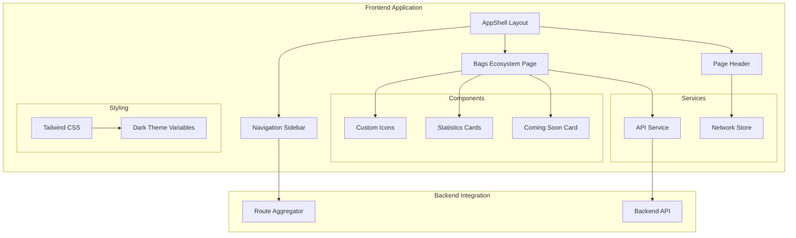
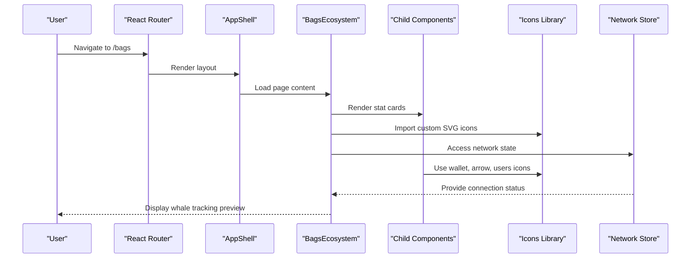
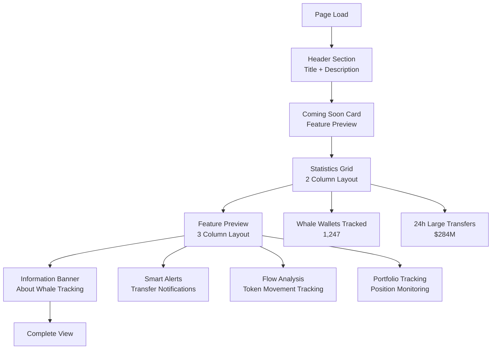
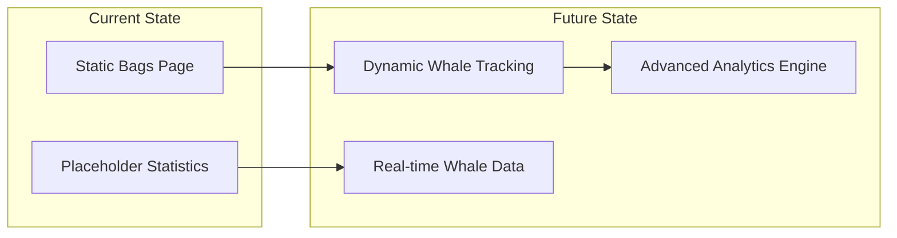

# Bags Ecosystem Page

<cite>
**Referenced Files in This Document**
- [BagsEcosystem.jsx](file://frontend/src/pages/BagsEcosystem.jsx)
- [Icons.jsx](file://frontend/src/components/common/Icons.jsx)
- [App.jsx](file://frontend/src/App.jsx)
- [Sidebar.jsx](file://frontend/src/components/layout/Sidebar.jsx)
- [Header.jsx](file://frontend/src/components/layout/Header.jsx)
- [index.css](file://frontend/src/index.css)
- [api.js](file://frontend/src/services/api.js)
- [networkStore.js](file://frontend/src/stores/networkStore.js)
- [formatters.js](file://frontend/src/utils/formatters.js)
- [index.js](file://backend/src/routes/index.js)
</cite>

## Table of Contents
1. [Introduction](#introduction)
2. [Project Structure](#project-structure)
3. [Core Components](#core-components)
4. [Architecture Overview](#architecture-overview)
5. [Detailed Component Analysis](#detailed-component-analysis)
6. [Design System](#design-system)
7. [Integration Points](#integration-points)
8. [Performance Considerations](#performance-considerations)
9. [Future Implementation Guide](#future-implementation-guide)
10. [Conclusion](#conclusion)

## Introduction

The Bags Ecosystem Page serves as a comprehensive dashboard for monitoring and tracking whale wallet activities on the Solana blockchain. This page is designed to showcase upcoming features for whale tracking, large holder monitoring, and significant token transfer analysis. The implementation follows a modern React architecture with a dark-themed terminal-inspired design system, providing users with real-time insights into institutional capital flows and market-moving transactions.

The page currently presents a "coming soon" interface with placeholder statistics and feature previews, setting expectations for the upcoming whale tracking capabilities that will integrate with the broader InfraWatch monitoring ecosystem.

## Project Structure

The Bags Ecosystem Page is part of a larger React application structured with clear separation of concerns:

**Diagram sources**
- [App.jsx:12-28](file://frontend/src/App.jsx#L12-L28)
- [Sidebar.jsx:18-148](file://frontend/src/components/layout/Sidebar.jsx#L18-L148)
- [Header.jsx:16-104](file://frontend/src/components/layout/Header.jsx#L16-L104)
- [BagsEcosystem.jsx:69-162](file://frontend/src/pages/BagsEcosystem.jsx#L69-L162)

**Section sources**
- [App.jsx:1-31](file://frontend/src/App.jsx#L1-L31)
- [BagsEcosystem.jsx:1-163](file://frontend/src/pages/BagsEcosystem.jsx#L1-L163)

## Core Components

The Bags Ecosystem Page consists of several reusable components that work together to create a cohesive user experience:

### Main Page Component
The primary [`BagsEcosystem`:69-162](file://frontend/src/pages/BagsEcosystem.jsx#L69-L162) component serves as the container for all page content, implementing a responsive grid layout with three main sections: header information, feature preview cards, and informational content.

### Reusable Components

#### StatCard Component
The [`StatCard`:48-67](file://frontend/src/pages/BagsEcosystem.jsx#L48-L67) component provides a flexible card for displaying key metrics with customizable colors and icons. It supports three color schemes (cyan, green, primary) and displays value, label, and subtext information.

#### ComingSoonCard Component
The [`ComingSoonCard`:4-46](file://frontend/src/pages/BagsEcosystem.jsx#L4-L46) component creates an animated card with gradient borders and pulsing indicators, effectively communicating feature availability timelines to users.

**Section sources**
- [BagsEcosystem.jsx:4-162](file://frontend/src/pages/BagsEcosystem.jsx#L4-L162)

## Architecture Overview

The Bags Ecosystem Page follows a component-based architecture with clear data flow patterns:

**Diagram sources**
- [App.jsx:12-28](file://frontend/src/App.jsx#L12-L28)
- [BagsEcosystem.jsx:69-162](file://frontend/src/pages/BagsEcosystem.jsx#L69-L162)
- [Icons.jsx:57-81](file://frontend/src/components/common/Icons.jsx#L57-L81)
- [networkStore.js:5-45](file://frontend/src/stores/networkStore.js#L5-L45)

The architecture demonstrates a unidirectional data flow where the main page component orchestrates child components while maintaining separation of concerns through reusable utilities and services.

**Section sources**
- [App.jsx:1-31](file://frontend/src/App.jsx#L1-L31)
- [BagsEcosystem.jsx:1-163](file://frontend/src/pages/BagsEcosystem.jsx#L1-L163)

## Detailed Component Analysis

### Page Structure and Layout

The Bags Ecosystem Page implements a sophisticated layout system with multiple content sections:

**Diagram sources**
- [BagsEcosystem.jsx:69-162](file://frontend/src/pages/BagsEcosystem.jsx#L69-L162)

### Design System Integration

The page seamlessly integrates with the application's design system through extensive use of CSS custom properties and Tailwind CSS utilities:

#### Color Palette Implementation
The design system defines a comprehensive color palette optimized for dark theme interfaces:

| Color Category | CSS Variable | Usage Example |
|---------------|--------------|---------------|
| Background Primary | `--color-bg-primary: #0a0a0f` | Main page background |
| Background Secondary | `--color-bg-secondary: #12121a` | Card backgrounds |
| Accent Cyan | `--color-accent-cyan: #00d4ff` | Primary highlights |
| Accent Green | `--color-accent-green: #00ff88` | Success/active states |
| Text Primary | `--color-text-primary: #e0e0e0` | Main text content |
| Border Subtle | `--color-border-subtle: rgba(255, 255, 255, 0.06)` | Card borders |

#### Animation System
The page leverages several custom animations for enhanced user experience:

- **Shimmer Effect**: Animated gradient background for card hover states
- **Pulse Animation**: Continuous pulsing for status indicators and loading states
- **Connection Pulse**: Live connection status visualization
- **CRT Scanlines**: Subtle scanline overlay for authentic terminal feel

**Section sources**
- [BagsEcosystem.jsx:1-163](file://frontend/src/pages/BagsEcosystem.jsx#L1-L163)
- [index.css:3-28](file://frontend/src/index.css#L3-L28)

### Component Composition Patterns

The page demonstrates several advanced React composition patterns:

#### Higher-Order Component Pattern
The [`ComingSoonCard`:4-46](file://frontend/src/pages/BagsEcosystem.jsx#L4-L46) and [`StatCard`:48-67](file://frontend/src/pages/BagsEcosystem.jsx#L48-L67) components serve as reusable building blocks that accept props for customization, enabling consistent UI patterns across the application.

#### Icon System Integration
The [`Icons.jsx`:57-81](file://frontend/src/components/common/Icons.jsx#L57-L81) library provides a comprehensive set of custom SVG icons specifically designed for the whale tracking feature set, ensuring visual consistency and performance optimization.

**Section sources**
- [Icons.jsx:1-136](file://frontend/src/components/common/Icons.jsx#L1-L136)
- [BagsEcosystem.jsx:4-162](file://frontend/src/pages/BagsEcosystem.jsx#L4-L162)

## Design System

The Bags Ecosystem Page implements a sophisticated design system that enhances user experience through consistent visual patterns and interactive elements.

### Typography and Spacing
The design system establishes clear typographic hierarchy with monospace fonts optimized for technical content, ensuring readability across different screen sizes and resolutions.

### Interactive Elements
The page features sophisticated hover effects and transitions that provide immediate feedback for user interactions:

- **Card Hover Effects**: Subtle border animations with gradient overlays
- **Pulsing Indicators**: Animated status dots for live connections
- **Smooth Transitions**: Consistent 200-500ms transition durations for all interactive elements

### Responsive Design
The layout adapts seamlessly across different screen sizes:
- Mobile: Single column layout for optimal touch interaction
- Tablet: Two-column statistics grid
- Desktop: Three-column feature preview layout

**Section sources**
- [index.css:1-217](file://frontend/src/index.css#L1-L217)
- [BagsEcosystem.jsx:96-144](file://frontend/src/pages/BagsEcosystem.jsx#L96-L144)

## Integration Points

The Bags Ecosystem Page integrates with several backend systems and services to provide comprehensive whale tracking functionality:

### Backend Route Integration
The page navigation is integrated with the backend route system through the main application router, ensuring seamless routing between frontend and backend services.

### API Communication
The [`api.js`:1-43](file://frontend/src/services/api.js#L1-L43) service provides centralized API communication with proper error handling and request/response interceptors, supporting future integration with whale tracking endpoints.

### State Management
While the current implementation focuses on static content, the page is designed to integrate with the existing [`networkStore.js`:1-48](file://frontend/src/stores/networkStore.js#L1-L48) for real-time data updates and connection status monitoring.

**Section sources**
- [App.jsx:12-28](file://frontend/src/App.jsx#L12-L28)
- [api.js:1-43](file://frontend/src/services/api.js#L1-L43)
- [networkStore.js:1-48](file://frontend/src/stores/networkStore.js#L1-L48)

## Performance Considerations

The Bags Ecosystem Page is optimized for performance through several key strategies:

### Bundle Size Optimization
- Custom SVG icons eliminate external dependency bloat
- Minimal component dependencies reduce initial load time
- Efficient CSS custom properties minimize style computation overhead

### Rendering Performance
- Pure functional components with minimal re-renders
- Efficient grid layouts using CSS Grid and Flexbox
- Optimized animation performance with hardware acceleration

### Memory Management
- Proper cleanup of event listeners and intervals
- Efficient state management preventing memory leaks
- Optimized image handling for logo and asset rendering

## Future Implementation Guide

The current Bags Ecosystem Page serves as a foundation for future whale tracking implementation. Here's a roadmap for expanding functionality:

### Phase 1: Basic Integration
- Connect to backend whale tracking APIs
- Implement real-time data fetching and updates
- Integrate with existing network monitoring infrastructure

### Phase 2: Advanced Features
- Implement wallet address monitoring with configurable thresholds
- Add transfer alert system with notification preferences
- Develop token flow visualization dashboards

### Phase 3: Enhanced Analytics
- Historical data analysis and trend identification
- Institutional activity pattern recognition
- Market movement prediction algorithms

### Integration Architecture

**Diagram sources**
- [BagsEcosystem.jsx:82-162](file://frontend/src/pages/BagsEcosystem.jsx#L82-L162)

## Conclusion

The Bags Ecosystem Page represents a sophisticated implementation of modern React development practices combined with a distinctive dark-themed design aesthetic. The page successfully communicates upcoming whale tracking capabilities while maintaining technical excellence through reusable components, efficient styling, and scalable architecture.

The implementation demonstrates strong attention to user experience through thoughtful animations, responsive design, and intuitive navigation patterns. The modular component structure ensures maintainability and extensibility for future whale tracking feature development.

Key strengths of the implementation include:
- Clean separation of concerns through component composition
- Sophisticated design system with custom animations
- Performance-optimized rendering and resource management
- Scalable architecture ready for future feature expansion

The page serves as an excellent foundation for the upcoming whale tracking functionality, providing users with clear expectations and a polished interface for monitoring institutional capital flows on the Solana blockchain.