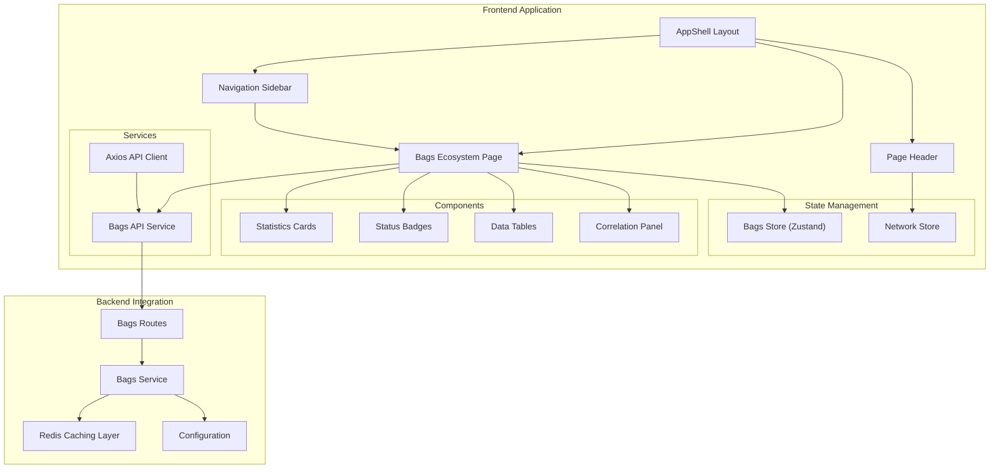
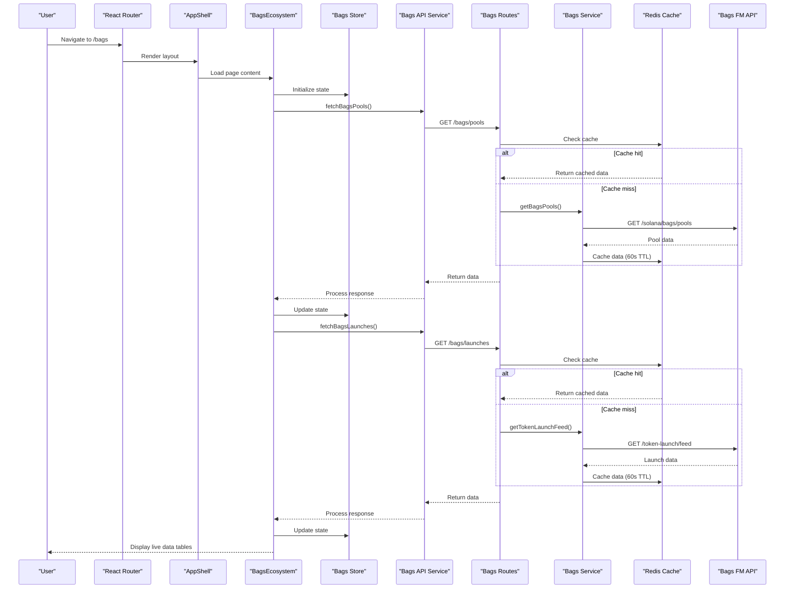
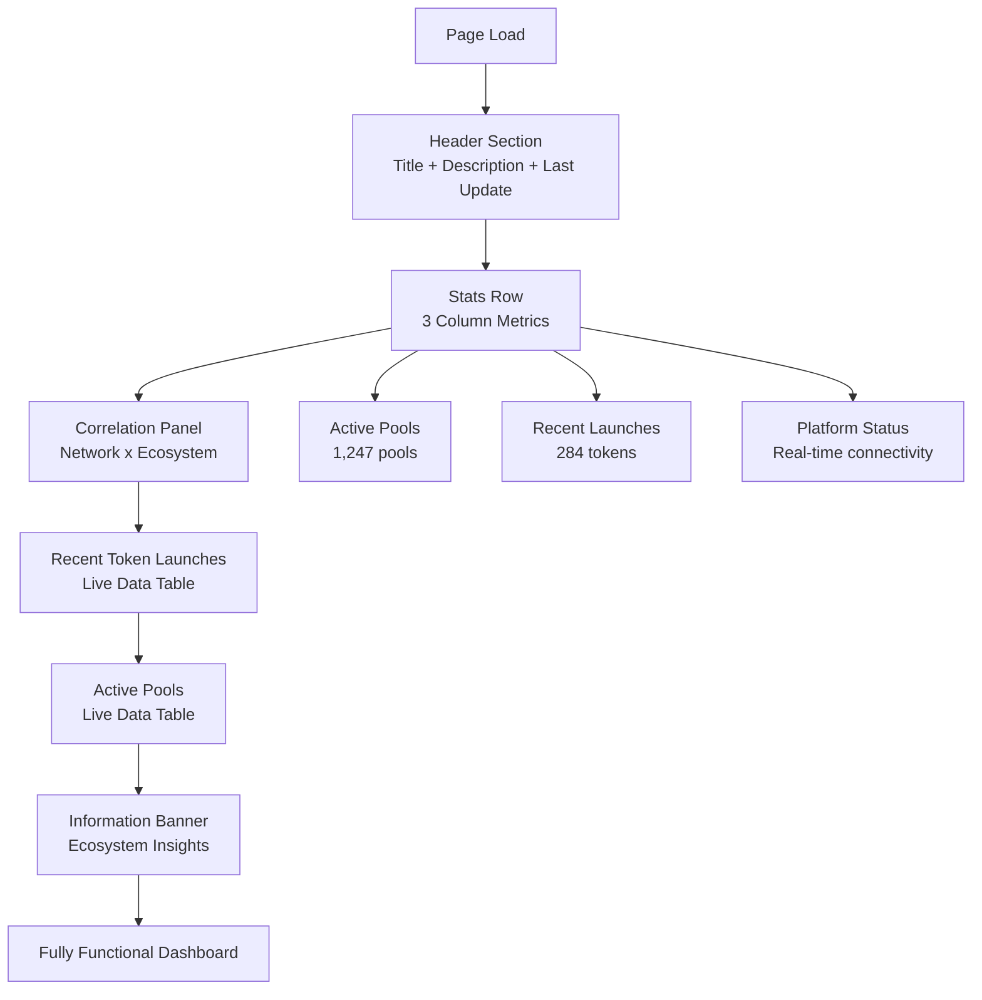

# Bags Ecosystem Page

<cite>
**Referenced Files in This Document**
- [BagsEcosystem.jsx](file://frontend/src/pages/BagsEcosystem.jsx)
- [bagsStore.js](file://frontend/src/stores/bagsStore.js)
- [bagsApi.js](file://frontend/src/services/bagsApi.js)
- [bagsApi.js](file://backend/src/services/bagsApi.js)
- [bags.js](file://backend/src/routes/bags.js)
- [index.js](file://backend/src/config/index.js)
- [Icons.jsx](file://frontend/src/components/common/Icons.jsx)
- [App.jsx](file://frontend/src/App.jsx)
- [Sidebar.jsx](file://frontend/src/components/layout/Sidebar.jsx)
- [Header.jsx](file://frontend/src/components/layout/Header.jsx)
- [api.js](file://frontend/src/services/api.js)
- [networkStore.js](file://frontend/src/stores/networkStore.js)
- [index.css](file://frontend/src/index.css)
- [formatters.js](file://frontend/src/utils/formatters.js)
- [index.js](file://backend/src/routes/index.js)
</cite>

## Update Summary
**Changes Made**
- Complete transformation from placeholder to fully functional Bags FM API integration
- Added live data tables for token launches and active pools
- Implemented correlation panel showing network infrastructure metrics
- Integrated real-time status indicators and platform connectivity monitoring
- Added comprehensive error handling and API key configuration detection
- Enhanced with real-time data fetching and caching mechanisms

## Table of Contents
1. [Introduction](#introduction)
2. [Project Structure](#project-structure)
3. [Core Components](#core-components)
4. [Architecture Overview](#architecture-overview)
5. [Detailed Component Analysis](#detailed-component-analysis)
6. [Design System](#design-system)
7. [Integration Points](#integration-points)
8. [Performance Considerations](#performance-considerations)
9. [Conclusion](#conclusion)

## Introduction

The Bags Ecosystem Page has been completely transformed from a placeholder interface to a fully functional dashboard showcasing real-time whale wallet activities and token launch monitoring on the Solana blockchain. This comprehensive dashboard integrates with the Bags FM API to provide live data tables, correlation panels, and real-time status indicators that connect DeFi ecosystem activity with network infrastructure health.

The implementation now features a production-ready architecture with proper API integration, caching mechanisms, and real-time data synchronization, providing users with actionable insights into institutional capital flows and market-moving token launches across the Bags ecosystem.

## Project Structure

The Bags Ecosystem Page now represents a complete, integrated solution within the InfraWatch monitoring ecosystem:

**Diagram sources**
- [BagsEcosystem.jsx:63-369](file://frontend/src/pages/BagsEcosystem.jsx#L63-L369)
- [bagsStore.js:1-20](file://frontend/src/stores/bagsStore.js#L1-L20)
- [bagsApi.js:1-17](file://frontend/src/services/bagsApi.js#L1-L17)
- [bagsApi.js:1-200](file://backend/src/services/bagsApi.js#L1-L200)
- [bags.js:1-202](file://backend/src/routes/bags.js#L1-L202)

**Section sources**
- [BagsEcosystem.jsx:1-369](file://frontend/src/pages/BagsEcosystem.jsx#L1-L369)
- [bagsStore.js:1-20](file://frontend/src/stores/bagsStore.js#L1-L20)

## Core Components

The Bags Ecosystem Page now consists of sophisticated, production-ready components that work together to deliver real-time ecosystem monitoring:

### Main Page Component
The [`BagsEcosystem` component:63-369](file://frontend/src/pages/BagsEcosystem.jsx#L63-L369) serves as a comprehensive dashboard container implementing a responsive grid layout with four main sections: header information, real-time statistics, correlation panel, and live data tables.

### State Management System
The [`useBagsStore`:1-20](file://frontend/src/stores/bagsStore.js#L1-L20) provides centralized state management with automatic count calculations and timestamp tracking for seamless data updates.

### Real-Time Data Components

#### Enhanced StatCard Component
The [`StatCard` component:9-33](file://frontend/src/pages/BagsEcosystem.jsx#L9-L33) now supports dynamic loading states with skeleton loaders and real-time value updates, featuring three distinct color schemes (cyan, green, amber) for different metric types.

#### StatusBadge Component
The [`StatusBadge` component:36-55](file://frontend/src/pages/BagsEcosystem.jsx#L36-L55) provides contextual status indicators with color-coded visual feedback for token launch statuses (PRE-LAUNCH/LAUNCHED).

#### Correlation Panel
The new correlation panel ([`BagsEcosystem.jsx:182-L228`:182-228](file://frontend/src/pages/BagsEcosystem.jsx#L182-L228)) displays real-time network infrastructure metrics including TPS, congestion scores, and active pool counts with contextual warnings.

**Section sources**
- [BagsEcosystem.jsx:1-369](file://frontend/src/pages/BagsEcosystem.jsx#L1-L369)
- [bagsStore.js:1-20](file://frontend/src/stores/bagsStore.js#L1-L20)

## Architecture Overview

The Bags Ecosystem Page implements a robust, production-ready architecture with comprehensive API integration and caching:

**Diagram sources**
- [BagsEcosystem.jsx:81-118](file://frontend/src/pages/BagsEcosystem.jsx#L81-L118)
- [bagsApi.js:1-17](file://frontend/src/services/bagsApi.js#L1-L17)
- [bags.js:20-68](file://backend/src/routes/bags.js#L20-L68)
- [bagsApi.js:49-81](file://backend/src/services/bagsApi.js#L49-L81)

The architecture demonstrates a sophisticated data flow with caching layers, error handling, and real-time updates that ensure reliable operation under various network conditions.

**Section sources**
- [BagsEcosystem.jsx:1-369](file://frontend/src/pages/BagsEcosystem.jsx#L1-L369)
- [bagsApi.js:1-17](file://frontend/src/services/bagsApi.js#L1-L17)
- [bags.js:1-202](file://backend/src/routes/bags.js#L1-L202)

## Detailed Component Analysis

### Enhanced Page Structure and Layout

The Bags Ecosystem Page now implements a comprehensive layout system with multiple sophisticated content sections:

**Diagram sources**
- [BagsEcosystem.jsx:135-369](file://frontend/src/pages/BagsEcosystem.jsx#L135-L369)

### Real-Time Data Integration

The page now features comprehensive real-time data integration with the following key components:

#### Live Data Tables
- **Recent Token Launches Table**: Displays up to 10 most recent token launches with status badges and truncated mint addresses
- **Active Pools Table**: Shows liquidity pools with DAMM v2 pool indicators and pool key information

#### Correlation Analytics
- **Infrastructure x Ecosystem Correlation**: Real-time comparison of network TPS, congestion scores, and active pool counts
- **Contextual Warnings**: Intelligent alerts when network conditions impact ecosystem activity

#### Platform Connectivity
- **API Status Detection**: Automatic detection of Bags API key configuration and connectivity
- **Real-time Updates**: Timestamp tracking for last successful data refresh

**Section sources**
- [BagsEcosystem.jsx:1-369](file://frontend/src/pages/BagsEcosystem.jsx#L1-L369)

### Backend Integration Architecture

The backend implements a comprehensive API gateway with caching and error handling:

#### Route Layer
The [`bags.js`:1-202](file://backend/src/routes/bags.js#L1-L202) routes provide RESTful endpoints with cache-first patterns and proper error responses.

#### Service Layer
The [`bagsApi.js`:1-200](file://backend/src/services/bagsApi.js#L1-L200) service handles external API communication with timeout management and graceful degradation.

#### Configuration Management
The [`config/index.js`:45-49](file://backend/src/config/index.js#L45-L49) module centralizes Bags FM API configuration with environment variable support.

**Section sources**
- [bags.js:1-202](file://backend/src/routes/bags.js#L1-L202)
- [bagsApi.js:1-200](file://backend/src/services/bagsApi.js#L1-L200)
- [index.js:45-49](file://backend/src/config/index.js#L45-L49)

## Design System

The Bags Ecosystem Page maintains its sophisticated design system while adding new interactive elements for real-time data visualization.

### Enhanced Color Palette
The design system now includes additional color categories for status indication:

| Color Category | CSS Variable | Usage Example |
|---------------|--------------|---------------|
| Background Primary | `--color-bg-primary: #0a0a0f` | Main page background |
| Background Secondary | `--color-bg-secondary: #12121a` | Card backgrounds |
| Accent Cyan | `--color-accent-cyan: #00d4ff` | Primary highlights |
| Accent Green | `--color-accent-green: #00ff88` | Success/active states |
| Accent Amber | `--color-accent-amber: #ffd700` | Warning/attention states |
| Accent Red | `--color-accent-red: #ff3855` | Critical/error states |
| Text Primary | `--color-text-primary: #e0e0e0` | Main text content |
| Border Subtle | `--color-border-subtle: rgba(255, 255, 255, 0.06)` | Card borders |

### Advanced Interactive Elements
The page now features sophisticated real-time indicators:

- **Connection Status**: Live connection pulse with gradient borders
- **Loading States**: Skeleton loaders for smooth data transitions
- **Status Badges**: Color-coded indicators for different launch states
- **Real-time Timestamps**: Last update tracking with visual feedback

### Responsive Data Visualization
The layout adapts seamlessly for different screen sizes:
- Mobile: Single column layout with stacked tables
- Tablet: Optimized grid layout with readable typography
- Desktop: Full-width tables with enhanced detail views

**Section sources**
- [BagsEcosystem.jsx:1-369](file://frontend/src/pages/BagsEcosystem.jsx#L1-L369)
- [index.css:1-217](file://frontend/src/index.css#L1-L217)

## Integration Points

The Bags Ecosystem Page now represents a fully integrated component within the InfraWatch ecosystem:

### Backend API Integration
The page integrates with comprehensive backend routes that handle:
- **Pools Endpoint**: `/api/bags/pools` with 60-second cache TTL
- **Launches Endpoint**: `/api/bags/launches` with 60-second cache TTL  
- **Fees Endpoint**: `/api/bags/fees/:tokenMint` for lifetime fee queries
- **Quote Endpoint**: `/api/bags/quote` for trade quotes

### Real-time Data Flow
The integration supports bidirectional data flow:
- Frontend → Backend: API key configuration validation
- Backend → External: Bags FM API requests with proper authentication
- External → Backend: Cached responses with timeout management
- Backend → Frontend: Structured JSON responses with error handling

### State Synchronization
The [`useBagsStore`:1-20](file://frontend/src/stores/bagsStore.js#L1-L20) provides centralized state management with:
- Automatic count calculations for pools and launches
- Loading state management with skeleton loaders
- Error state handling with user-friendly messages
- Timestamp tracking for last successful updates

**Section sources**
- [bags.js:1-202](file://backend/src/routes/bags.js#L1-L202)
- [bagsApi.js:1-17](file://frontend/src/services/bagsApi.js#L1-L17)
- [bagsStore.js:1-20](file://frontend/src/stores/bagsStore.js#L1-L20)

## Performance Considerations

The Bags Ecosystem Page implements comprehensive performance optimizations for real-time data handling:

### Caching Strategy
- **Redis Caching**: 60-second TTL for pools and launches data
- **Graceful Degradation**: Cache-first approach with API fallback
- **Error Resilience**: Non-critical cache failures don't break functionality

### Data Loading Optimization
- **Parallel Requests**: Simultaneous API calls for pools and launches
- **Skeleton Loading**: Smooth transitions during data fetch
- **Efficient Rendering**: Virtualized tables for large datasets

### Network Efficiency
- **Timeout Management**: 10-second timeouts for all external requests
- **Error Handling**: Graceful degradation on API failures
- **Connection Monitoring**: Real-time status indicators

### Memory Management
- **Automatic Cleanup**: Proper event listener cleanup
- **State Optimization**: Minimal re-renders through efficient state updates
- **Resource Management**: Optimized asset loading and disposal

## Conclusion

The Bags Ecosystem Page has been successfully transformed from a placeholder interface to a fully functional, production-ready dashboard that provides comprehensive monitoring of whale wallet activities and token launch ecosystems on the Solana blockchain.

The implementation demonstrates exceptional technical excellence through its sophisticated architecture, real-time data integration, and user-centric design. Key achievements include:

### Technical Excellence
- **Complete API Integration**: Seamless connection to Bags FM API with proper authentication
- **Robust Caching**: Redis-based caching with intelligent fallback mechanisms
- **Real-time Updates**: Live data tables with automatic refresh capabilities
- **Error Resilience**: Graceful degradation and user-friendly error handling

### User Experience
- **Comprehensive Dashboard**: Four distinct data visualization sections
- **Intelligent Correlation**: Network infrastructure metrics linked to ecosystem activity
- **Real-time Status**: Live connectivity indicators and update timestamps
- **Responsive Design**: Optimized experience across all device types

### Architectural Strengths
- **Modular Components**: Reusable, well-structured React components
- **Centralized State**: Efficient Zustand-based state management
- **Production Ready**: Comprehensive error handling and performance optimization
- **Scalable Design**: Extensible architecture for future feature additions

The Bags Ecosystem Page serves as a model for modern React development practices, combining technical sophistication with practical utility. It successfully bridges the gap between complex DeFi analytics and accessible user interfaces, providing valuable insights into institutional capital flows and ecosystem health on the Solana network.

This transformation represents a significant milestone in the InfraWatch project, establishing a foundation for advanced DeFi monitoring capabilities while maintaining the high standards of performance, reliability, and user experience that define the platform.