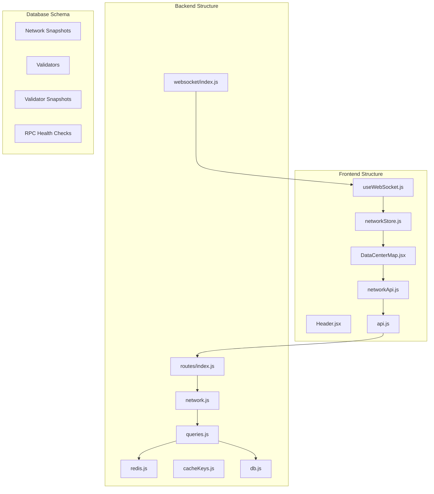
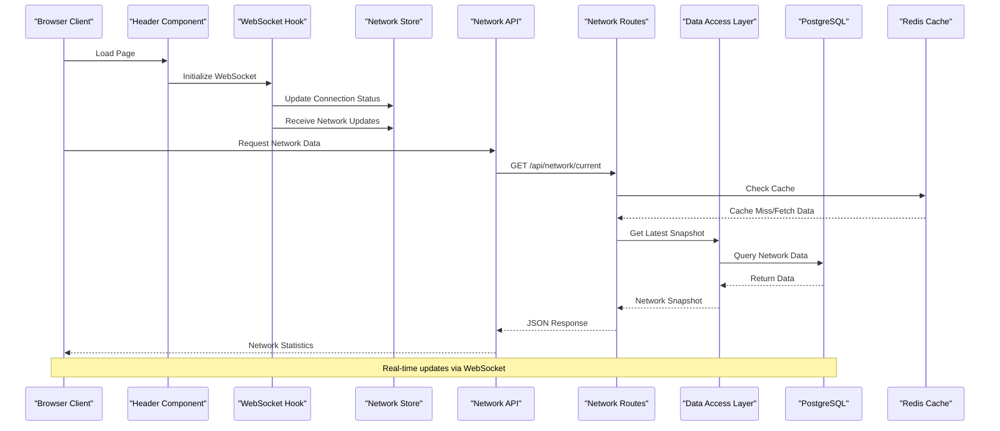
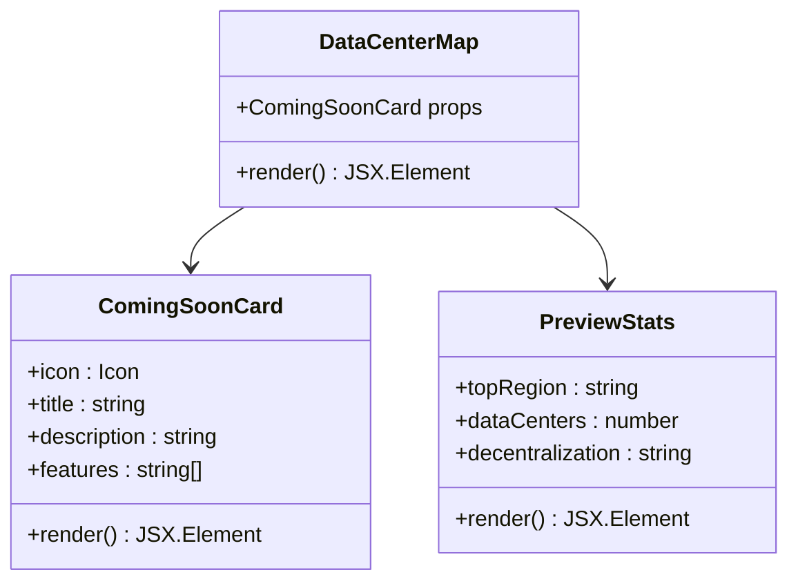
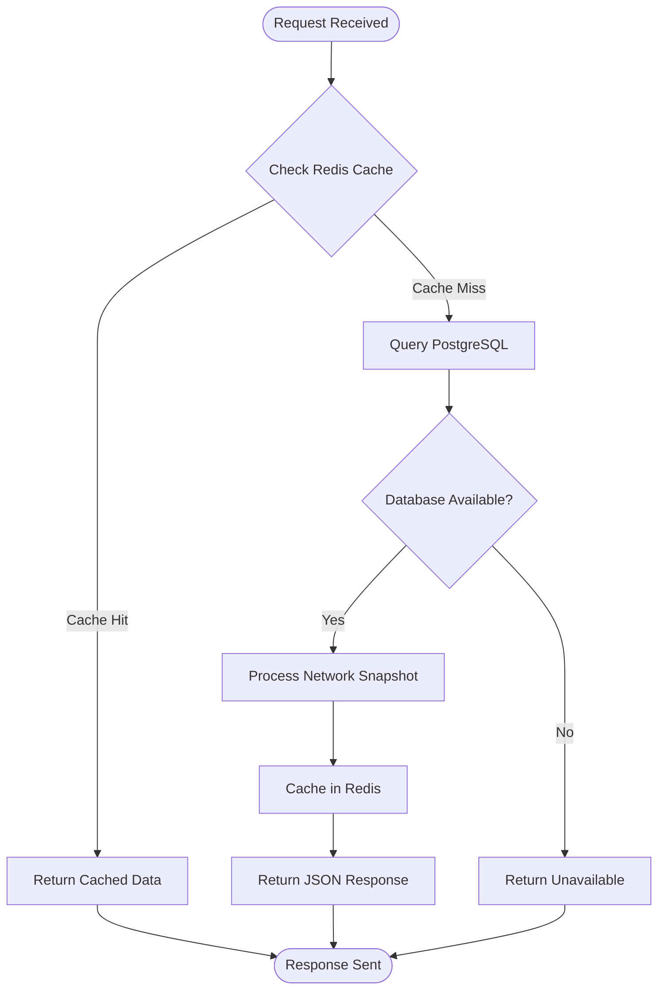
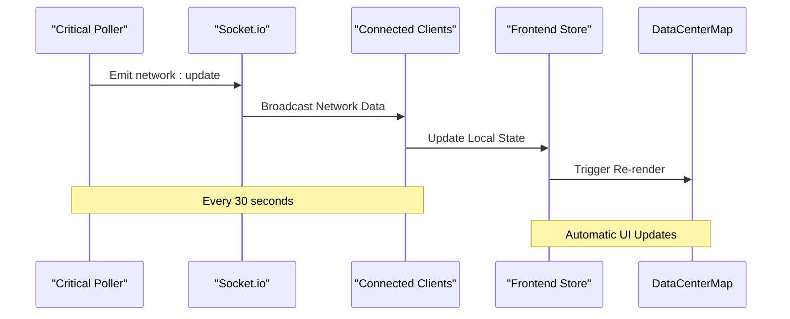

# Data Center Map Page

<cite>
**Referenced Files in This Document**
- [DataCenterMap.jsx](file://frontend/src/pages/DataCenterMap.jsx)
- [Header.jsx](file://frontend/src/components/layout/Header.jsx)
- [networkApi.js](file://frontend/src/services/networkApi.js)
- [api.js](file://frontend/src/services/api.js)
- [network.js](file://backend/src/routes/network.js)
- [queries.js](file://backend/src/models/queries.js)
- [redis.js](file://backend/src/models/redis.js)
- [cacheKeys.js](file://backend/src/models/cacheKeys.js)
- [db.js](file://backend/src/models/db.js)
- [index.js](file://backend/src/websocket/index.js)
- [useWebSocket.js](file://frontend/src/hooks/useWebSocket.js)
- [networkStore.js](file://frontend/src/stores/networkStore.js)
- [migrate.js](file://backend/src/models/migrate.js)
</cite>

## Table of Contents
1. [Introduction](#introduction)
2. [Project Structure](#project-structure)
3. [Core Components](#core-components)
4. [Architecture Overview](#architecture-overview)
5. [Detailed Component Analysis](#detailed-component-analysis)
6. [Data Flow Analysis](#data-flow-analysis)
7. [Performance Considerations](#performance-considerations)
8. [Integration Points](#integration-points)
9. [Future Implementation Plan](#future-implementation-plan)
10. [Troubleshooting Guide](#troubleshooting-guide)
11. [Conclusion](#conclusion)

## Introduction

The Data Center Map Page is a planned feature for the InfraWatch monitoring platform that will provide comprehensive geographic visualization of Solana's global infrastructure. Currently in development, this page will offer interactive world maps showing validator geolocation, data center clustering, network topology analysis, and regional infrastructure insights.

The page serves as a strategic dashboard for understanding network decentralization, identifying concentration risks, and monitoring geographic distribution of Solana's validator ecosystem. It will complement existing network monitoring capabilities with spatial analytics and real-time infrastructure insights.

## Project Structure

The Data Center Map functionality spans both frontend and backend components, integrating with the existing InfraWatch architecture:

**Diagram sources**
- [DataCenterMap.jsx:1-121](file://frontend/src/pages/DataCenterMap.jsx#L1-L121)
- [routes/index.js:1-24](file://backend/src/routes/index.js#L1-L24)
- [network.js:1-134](file://backend/src/routes/network.js#L1-L134)

**Section sources**
- [DataCenterMap.jsx:1-121](file://frontend/src/pages/DataCenterMap.jsx#L1-L121)
- [routes/index.js:1-24](file://backend/src/routes/index.js#L1-L24)

## Core Components

### Frontend Components

The Data Center Map page is built with several key frontend components:

**DataCenterMap Component**: The main page component that renders placeholder content and preview statistics. It currently displays coming-soon messaging while the full implementation is being developed.

**Header Integration**: The header component displays real-time network status indicators and connects to the WebSocket stream for live updates.

**Network Services**: API wrappers that handle communication with backend endpoints for network data retrieval.

### Backend Infrastructure

**Network Routes**: REST endpoints providing current network status and historical data for the map visualization.

**Data Access Layer**: PostgreSQL queries supporting network snapshots, validator information, and historical data retrieval.

**Caching Strategy**: Redis-based caching for improved performance and reduced database load.

**Real-time Streaming**: WebSocket connections enabling live updates to the map interface.

**Section sources**
- [DataCenterMap.jsx:48-120](file://frontend/src/pages/DataCenterMap.jsx#L48-L120)
- [Header.jsx:16-44](file://frontend/src/components/layout/Header.jsx#L16-L44)
- [network.js:17-79](file://backend/src/routes/network.js#L17-L79)

## Architecture Overview

The Data Center Map follows InfraWatch's established architecture pattern, integrating seamlessly with existing monitoring infrastructure:

**Diagram sources**
- [Header.jsx:20-31](file://frontend/src/components/layout/Header.jsx#L20-L31)
- [useWebSocket.js:47-72](file://frontend/src/hooks/useWebSocket.js#L47-L72)
- [networkApi.js:1-5](file://frontend/src/services/networkApi.js#L1-L5)
- [network.js:17-79](file://backend/src/routes/network.js#L17-L79)

## Detailed Component Analysis

### DataCenterMap Component

The main page component implements a responsive card-based layout with animated elements and placeholder content:

**Diagram sources**
- [DataCenterMap.jsx:4-46](file://frontend/src/pages/DataCenterMap.jsx#L4-L46)
- [DataCenterMap.jsx:75-102](file://frontend/src/pages/DataCenterMap.jsx#L75-L102)

The component structure includes:

**Header Section**: Displays page title and description with network status context
**Coming Soon Card**: Features animated border effects and feature list highlighting planned capabilities
**Preview Statistics**: Shows top region, data center count, and decentralization metrics
**Information Banner**: Provides context about the upcoming geographic visualization features

### Network Data Flow

The backend implements a robust caching and data retrieval system:

**Diagram sources**
- [network.js:17-79](file://backend/src/routes/network.js#L17-L79)
- [redis.js:75-112](file://backend/src/models/redis.js#L75-L112)

**Section sources**
- [DataCenterMap.jsx:48-120](file://frontend/src/pages/DataCenterMap.jsx#L48-L120)
- [network.js:85-132](file://backend/src/routes/network.js#L85-L132)

## Data Flow Analysis

### Real-time WebSocket Integration

The system leverages WebSocket connections for live network updates:

**Diagram sources**
- [criticalPoller.js:21-103](file://backend/src/jobs/criticalPoller.js#L21-L103)
- [useWebSocket.js:47-72](file://frontend/src/hooks/useWebSocket.js#L47-L72)

### Data Persistence and Caching

The backend implements a multi-tier caching strategy:

**Cache Keys**: Centralized cache key management with TTL values for different data types
**Redis Cache**: High-performance caching for frequently accessed network data
**PostgreSQL Storage**: Persistent storage for historical network snapshots and validator information

**Section sources**
- [cacheKeys.js:6-49](file://backend/src/models/cacheKeys.js#L6-L49)
- [redis.js:99-112](file://backend/src/models/redis.js#L99-L112)
- [queries.js:54-84](file://backend/src/models/queries.js#L54-L84)

## Performance Considerations

### Caching Strategy

The system employs intelligent caching to optimize performance:

**Cache First Approach**: Routes check Redis cache before querying the database
**Graceful Degradation**: Database fallback when Redis is unavailable
**TTL Management**: Different expiration times for various data types (60s-300s)
**Memory Efficiency**: Limited history retention for TPS charts (30 data points)

### Database Optimization

**Indexing Strategy**: Strategic indexes on timestamp columns for time-series queries
**Connection Pooling**: PostgreSQL connection pooling for efficient resource utilization
**Parameterized Queries**: Prevention of SQL injection attacks and query plan caching

### Frontend Performance

**Component Optimization**: Minimal re-renders through efficient state management
**Lazy Loading**: Placeholder content during development phase
**Responsive Design**: Mobile-first approach with grid layouts

## Integration Points

### API Endpoints

The Data Center Map integrates with the following backend endpoints:

**GET /api/network/current**: Returns current network status with health indicators
**GET /api/network/history**: Provides historical network data for charting
**GET /api/validators**: Supplies validator information including geographic data

### External Integrations

**Solana RPC Providers**: Real-time network data collection from multiple RPC endpoints
**Helius Integration**: Priority fee estimation for congestion scoring
**WebSocket Broadcasting**: Live updates to connected clients

### Database Schema Integration

The system works with the existing database schema supporting:

**Network Snapshots**: Time-series network health data
**Validator Information**: Geographic and operational details
**Historical Tracking**: Long-term trend analysis capabilities

**Section sources**
- [network.js:17-132](file://backend/src/routes/network.js#L17-L132)
- [migrate.js:13-94](file://backend/src/models/migrate.js#L13-L94)

## Future Implementation Plan

### Phase 1: Core Infrastructure (Current State)
- Interactive world map visualization
- Validator geolocation heatmap
- Data center concentration analysis
- Regional network latency mapping

### Phase 2: Advanced Analytics
- Decentralization scoring algorithms
- ISP-level network topology
- Real-time health monitoring by region
- Automated risk assessment

### Phase 3: Enhanced Interactivity
- Drill-down capabilities by region
- Historical trend visualization
- Exportable reports and dashboards
- Customizable alert thresholds

## Troubleshooting Guide

### Common Issues and Solutions

**WebSocket Connection Problems**
- Verify Socket.io server is running and accessible
- Check browser console for connection errors
- Ensure proper CORS configuration for WebSocket upgrades

**API Response Issues**
- Confirm backend service is operational
- Verify database connectivity and query execution
- Check Redis availability for cache operations

**Data Display Problems**
- Validate data transformation in WebSocket hook
- Ensure proper state management in network store
- Check component prop drilling and context providers

### Monitoring and Debugging

**Frontend Debugging**
- Use React Developer Tools for component inspection
- Monitor WebSocket message flow in browser console
- Track Redux store state changes

**Backend Monitoring**
- Monitor Redis cache hit rates and memory usage
- Track PostgreSQL query performance and connection pool
- Observe critical poller execution intervals and success rates

**Section sources**
- [useWebSocket.js:9-45](file://frontend/src/hooks/useWebSocket.js#L9-L45)
- [networkStore.js:22-44](file://frontend/src/stores/networkStore.js#L22-L44)
- [redis.js:75-112](file://backend/src/models/redis.js#L75-L112)

## Conclusion

The Data Center Map Page represents a significant enhancement to InfraWatch's monitoring capabilities, providing crucial geographic insights into Solana's distributed infrastructure. While currently in development with placeholder content, the implementation leverages the platform's robust architecture and established patterns.

The component integrates seamlessly with existing network monitoring systems, utilizing real-time WebSocket updates, intelligent caching strategies, and comprehensive data persistence. This foundation ensures scalability and maintainability as the feature evolves toward production readiness.

The modular design allows for incremental development, with clear separation between frontend presentation, backend data services, and database storage. This approach facilitates testing, debugging, and future enhancements while maintaining system stability.