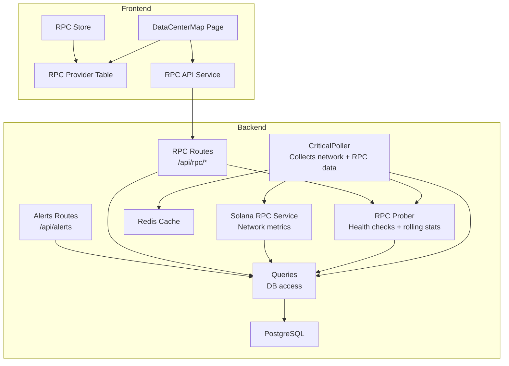
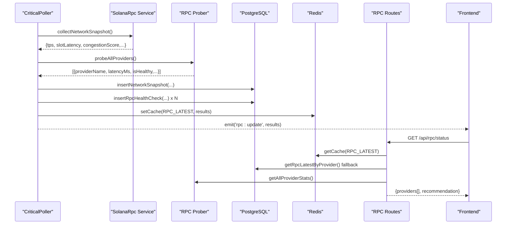
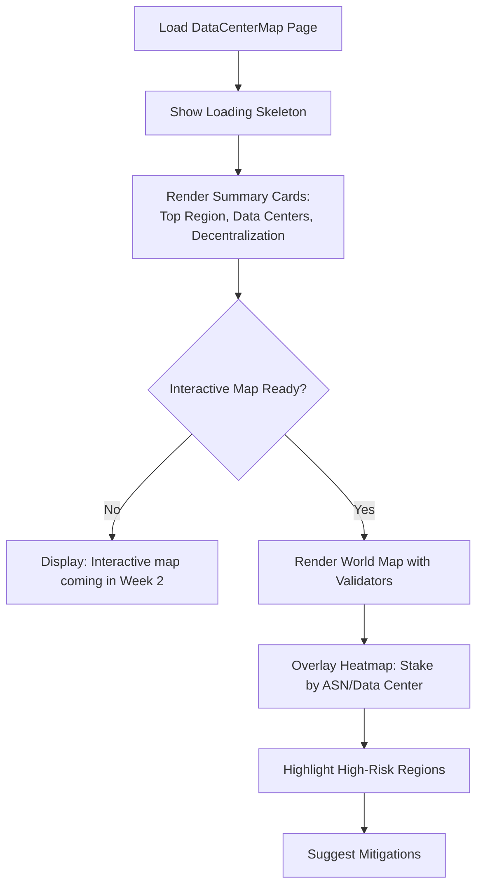
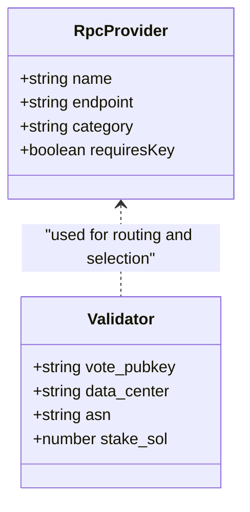
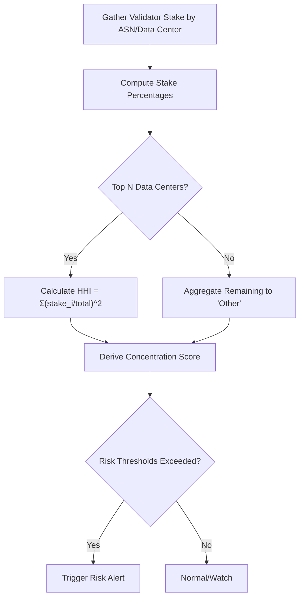
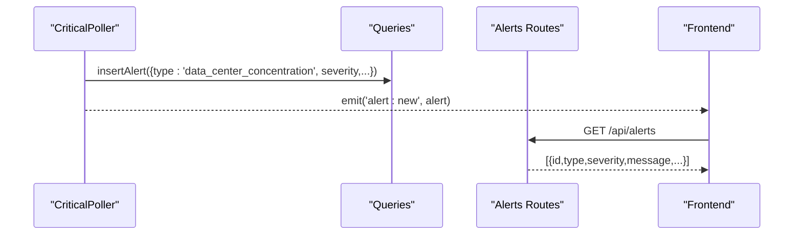
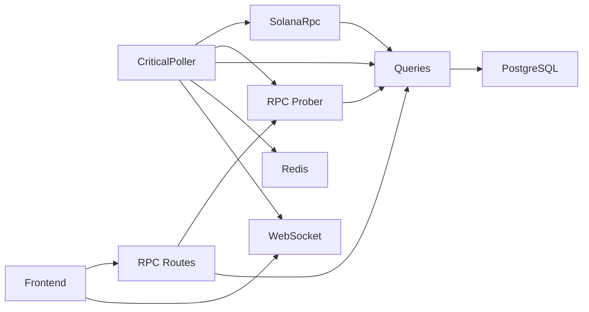

# Data Center Risk Assessment

<cite>
**Referenced Files in This Document**
- [DataCenterMap.jsx](file://frontend/src/pages/DataCenterMap.jsx)
- [rpc.js](file://backend/src/routes/rpc.js)
- [rpcProber.js](file://backend/src/services/rpcProber.js)
- [solanaRpc.js](file://backend/src/services/solanaRpc.js)
- [queries.js](file://backend/src/models/queries.js)
- [db.js](file://backend/src/models/db.js)
- [redis.js](file://backend/src/models/redis.js)
- [criticalPoller.js](file://backend/src/jobs/criticalPoller.js)
- [routinePoller.js](file://backend/src/jobs/routinePoller.js)
- [alerts.js](file://backend/src/routes/alerts.js)
- [RpcProviderTable.jsx](file://frontend/src/components/rpc/RpcProviderTable.jsx)
- [rpcApi.js](file://frontend/src/services/rpcApi.js)
- [rpcStore.js](file://frontend/src/stores/rpcStore.js)
</cite>

## Table of Contents
1. [Introduction](#introduction)
2. [Project Structure](#project-structure)
3. [Core Components](#core-components)
4. [Architecture Overview](#architecture-overview)
5. [Detailed Component Analysis](#detailed-component-analysis)
6. [Dependency Analysis](#dependency-analysis)
7. [Performance Considerations](#performance-considerations)
8. [Troubleshooting Guide](#troubleshooting-guide)
9. [Conclusion](#conclusion)

## Introduction
This document describes the Data Center Risk Assessment functionality within the InfraWatch platform. It explains how RPC provider locations and data center concentrations are surfaced, how geographic clustering and single points of failure risks are quantified, and how risk alerts inform users about high-risk regions. It also documents the integration with mapping libraries for interactive geographic visualization, reliability metrics for data centers, and the correlation between geographic diversity and network resilience. Finally, it outlines risk scoring algorithms and mitigation recommendations.

## Project Structure
The Data Center Risk Assessment spans both backend and frontend layers:
- Backend collects and stores network and RPC health data, computes rolling statistics, and exposes REST endpoints.
- Frontend renders the global data center map page and RPC provider health table, integrating with backend APIs and WebSocket streams.

**Diagram sources**
- [criticalPoller.js:21-100](file://backend/src/jobs/criticalPoller.js#L21-L100)
- [rpcProber.js:140-180](file://backend/src/services/rpcProber.js#L140-L180)
- [solanaRpc.js:275-328](file://backend/src/services/solanaRpc.js#L275-L328)
- [queries.js:124-156](file://backend/src/models/queries.js#L124-L156)
- [db.js:15-47](file://backend/src/models/db.js#L15-L47)
- [redis.js:16-68](file://backend/src/models/redis.js#L16-L68)
- [rpc.js:17-88](file://backend/src/routes/rpc.js#L17-L88)
- [alerts.js:14-43](file://backend/src/routes/alerts.js#L14-L43)
- [DataCenterMap.jsx:4-43](file://frontend/src/pages/DataCenterMap.jsx#L4-L43)
- [RpcProviderTable.jsx:39-177](file://frontend/src/components/rpc/RpcProviderTable.jsx#L39-L177)
- [rpcApi.js:3-6](file://frontend/src/services/rpcApi.js#L3-L6)
- [rpcStore.js:3-13](file://frontend/src/stores/rpcStore.js#L3-L13)

**Section sources**
- [DataCenterMap.jsx:4-43](file://frontend/src/pages/DataCenterMap.jsx#L4-L43)
- [rpc.js:17-88](file://backend/src/routes/rpc.js#L17-L88)
- [rpcProber.js:140-180](file://backend/src/services/rpcProber.js#L140-L180)
- [solanaRpc.js:275-328](file://backend/src/services/solanaRpc.js#L275-L328)
- [queries.js:124-156](file://backend/src/models/queries.js#L124-L156)
- [db.js:15-47](file://backend/src/models/db.js#L15-L47)
- [redis.js:16-68](file://backend/src/models/redis.js#L16-L68)
- [criticalPoller.js:21-100](file://backend/src/jobs/criticalPoller.js#L21-L100)
- [routinePoller.js:20-110](file://backend/src/jobs/routinePoller.js#L20-L110)
- [alerts.js:14-43](file://backend/src/routes/alerts.js#L14-L43)
- [RpcProviderTable.jsx:39-177](file://frontend/src/components/rpc/RpcProviderTable.jsx#L39-L177)
- [rpcApi.js:3-6](file://frontend/src/services/rpcApi.js#L3-L6)
- [rpcStore.js:3-13](file://frontend/src/stores/rpcStore.js#L3-L13)

## Core Components
- Data Center Map Page: Presents a placeholder for the global validator distribution map and summary metrics such as top region, data center count, and decentralization indicator.
- RPC Provider Health Monitoring: Probes multiple RPC endpoints, computes rolling latency percentiles and uptime, and recommends the best-performing provider.
- Network Metrics Service: Gathers TPS, slot latency, epoch progress, delinquent validators, and congestion score.
- Data Access Layer: Persists network snapshots, RPC health checks, and validator metadata; supports retrieval for dashboards and alerts.
- Caching and Streaming: Critical poller writes to Redis cache and emits updates via WebSocket for real-time UI updates.
- Alerting: Routes expose recent alerts and support alert creation and resolution.

**Section sources**
- [DataCenterMap.jsx:4-43](file://frontend/src/pages/DataCenterMap.jsx#L4-L43)
- [rpc.js:17-88](file://backend/src/routes/rpc.js#L17-L88)
- [rpcProber.js:140-180](file://backend/src/services/rpcProber.js#L140-L180)
- [solanaRpc.js:275-328](file://backend/src/services/solanaRpc.js#L275-L328)
- [queries.js:124-156](file://backend/src/models/queries.js#L124-L156)
- [criticalPoller.js:21-100](file://backend/src/jobs/criticalPoller.js#L21-L100)
- [alerts.js:14-43](file://backend/src/routes/alerts.js#L14-L43)

## Architecture Overview
The system integrates real-time data collection, storage, and presentation:
- Data ingestion occurs every 30 seconds via the critical poller, which gathers network snapshots and probes RPC providers.
- Results are persisted to PostgreSQL and cached in Redis.
- The RPC route merges latest DB records with rolling statistics from the prober and returns recommendations.
- The frontend loads RPC status, displays provider health, and prepares for future geographic visualization.

**Diagram sources**
- [criticalPoller.js:21-100](file://backend/src/jobs/criticalPoller.js#L21-L100)
- [solanaRpc.js:275-328](file://backend/src/services/solanaRpc.js#L275-L328)
- [rpcProber.js:140-180](file://backend/src/services/rpcProber.js#L140-L180)
- [queries.js:124-156](file://backend/src/models/queries.js#L124-L156)
- [redis.js:75-112](file://backend/src/models/redis.js#L75-L112)
- [rpc.js:17-88](file://backend/src/routes/rpc.js#L17-L88)
- [rpcApi.js:3-6](file://frontend/src/services/rpcApi.js#L3-L6)

## Detailed Component Analysis

### Data Center Risk Visualization and Geographic Distribution
- Current state: The Data Center Map page displays a placeholder container and summary cards (top region, data centers, decentralization). An interactive map with validator geolocation is noted as upcoming.
- Future integration: The page will render a world map with validator nodes and heat maps indicating stake concentration by ASN/data center provider. This enables users to visually assess geographic clustering and single points of failure risks.

**Section sources**
- [DataCenterMap.jsx:4-43](file://frontend/src/pages/DataCenterMap.jsx#L4-L43)

### RPC Provider Locations and Data Center Concentration
- RPC provider configuration includes multiple premium and public endpoints. While endpoint URLs are stored, the current implementation does not expose geolocation or ASN fields for RPC providers in the returned data model.
- Data center information is available for validators via the validator upsert and retrieval functions, which include a data center field. This dataset can be used to derive geographic distribution and concentration metrics.

**Diagram sources**
- [rpcProber.js:11-63](file://backend/src/services/rpcProber.js#L11-L63)
- [queries.js:180-220](file://backend/src/models/queries.js#L180-L220)

**Section sources**
- [rpcProber.js:11-63](file://backend/src/services/rpcProber.js#L11-L63)
- [queries.js:180-220](file://backend/src/models/queries.js#L180-L220)

### Concentration Risk Calculation and Single Points of Failure Analysis
- Rolling statistics: The RPC prober calculates latency percentiles (p50/p95/p99) and uptime percentages over recent checks, enabling identification of underperforming providers and potential single points of failure.
- Geographic clustering: To compute concentration risk, aggregate validator stake by ASN/data center and derive:
  - Top-N data center stake percentage
  - Herfindahl-Hirschman Index (HHI) for geographic diversification
  - Share of stake in the largest data center(s)
- Single point of failure: Flag regions or ASNs where a single outage would remove a significant fraction of stake.

**Section sources**
- [rpcProber.js:208-250](file://backend/src/services/rpcProber.js#L208-L250)
- [queries.js:180-220](file://backend/src/models/queries.js#L180-L220)

### Risk Alert Systems for High-Risk Geographic Regions
- Existing alerting: The system inserts and retrieves alerts for various events (e.g., commission changes). The alert routes expose recent alerts and resolution mechanisms.
- Data Center Risk Alerts: Future implementation should:
  - Compute concentration metrics periodically
  - Compare against configurable thresholds
  - Insert alerts with severity and details
  - Stream alerts to the frontend via WebSocket or polling

**Diagram sources**
- [criticalPoller.js:80-100](file://backend/src/jobs/criticalPoller.js#L80-L100)
- [queries.js:340-356](file://backend/src/models/queries.js#L340-L356)
- [alerts.js:14-43](file://backend/src/routes/alerts.js#L14-L43)

**Section sources**
- [alerts.js:14-43](file://backend/src/routes/alerts.js#L14-L43)
- [queries.js:340-356](file://backend/src/models/queries.js#L340-L356)
- [criticalPoller.js:80-100](file://backend/src/jobs/criticalPoller.js#L80-L100)

### Integration with Mapping Libraries for Interactive Geographic Visualization
- Current state: The Data Center Map page includes a placeholder container and summary cards; an interactive map is noted as upcoming.
- Integration plan:
  - Use a mapping library (e.g., Leaflet, OpenLayers, or a hosted solution) to plot validator locations by ASN/data center.
  - Overlay heatmaps and concentric rings to visualize stake density.
  - Add tooltips with validator counts, stake totals, and risk indicators.
  - Enable zoom/pan and drill-down to regions/ASNs.

[No sources needed since this section provides conceptual guidance]

### Data Center Reliability Metrics and Regional Infrastructure Quality Assessments
- Reliability metrics:
  - Uptime percentage (rolling windows)
  - Latency percentiles (p50/p95/p99)
  - Recent incident timestamps
- Regional infrastructure quality:
  - ASN-level metrics (e.g., average latency, variance)
  - Power/grid stability signals (external indicators)
  - Cloud provider diversity (AWS, GCP, Azure)
  - Regulatory and geopolitical risk factors (future enhancement)

**Section sources**
- [rpcProber.js:208-250](file://backend/src/services/rpcProber.js#L208-L250)
- [rpc.js:47-68](file://backend/src/routes/rpc.js#L47-L68)

### Correlation Between Geographic Diversity and Network Resilience
- Network resilience improves when:
  - Stake is distributed across multiple ASNs and regions
  - No single data center holds disproportionate influence
  - Providers are located in geographically diverse zones
- Correlation signals:
  - Lower network congestion when stake is spread
  - Reduced impact from localized outages
  - Improved finality stability during regional incidents

[No sources needed since this section provides conceptual guidance]

### Risk Scoring Algorithms and Mitigation Recommendations
- Risk scoring:
  - Stake concentration threshold breaches
  - HHI exceedances
  - Single-region dominance
- Mitigation recommendations:
  - Diversify RPC endpoints across regions
  - Prefer providers with multi-region deployments
  - Monitor ASN-level stake shifts
  - Use the RPC recommendation endpoint to select lower-latency, higher-diversity providers

**Section sources**
- [rpc.js:70-78](file://backend/src/routes/rpc.js#L70-L78)
- [rpcProber.js:295-307](file://backend/src/services/rpcProber.js#L295-L307)

## Dependency Analysis
The Data Center Risk Assessment relies on:
- Data ingestion pipeline (critical poller) feeding network and RPC health data
- Database persistence for historical snapshots and provider health logs
- Redis caching for low-latency API responses
- Frontend components consuming REST endpoints and WebSocket updates

**Diagram sources**
- [criticalPoller.js:21-100](file://backend/src/jobs/criticalPoller.js#L21-L100)
- [solanaRpc.js:275-328](file://backend/src/services/solanaRpc.js#L275-L328)
- [rpcProber.js:140-180](file://backend/src/services/rpcProber.js#L140-L180)
- [queries.js:124-156](file://backend/src/models/queries.js#L124-L156)
- [db.js:15-47](file://backend/src/models/db.js#L15-L47)
- [redis.js:75-112](file://backend/src/models/redis.js#L75-L112)
- [rpc.js:17-88](file://backend/src/routes/rpc.js#L17-L88)

**Section sources**
- [criticalPoller.js:21-100](file://backend/src/jobs/criticalPoller.js#L21-L100)
- [rpc.js:17-88](file://backend/src/routes/rpc.js#L17-L88)
- [db.js:15-47](file://backend/src/models/db.js#L15-L47)
- [redis.js:75-112](file://backend/src/models/redis.js#L75-L112)

## Performance Considerations
- Concurrency: The RPC prober probes providers concurrently and caches results to minimize repeated external calls.
- Caching: Redis stores latest RPC results and network snapshots with TTLs to reduce database load.
- Database efficiency: Parameterized queries and indexed lookups improve retrieval performance for recent data.
- Frontend responsiveness: The RPC store manages loading states and error handling to maintain a smooth user experience.

[No sources needed since this section provides general guidance]

## Troubleshooting Guide
- Database connectivity issues:
  - Symptoms: Empty RPC status, missing historical data.
  - Actions: Verify DATABASE_URL configuration; check pool initialization and error logs.
- Redis unavailability:
  - Symptoms: Missing cache hits, degraded API response times.
  - Actions: Confirm REDIS_URL configuration and connection readiness; monitor reconnection strategy.
- RPC probing failures:
  - Symptoms: Providers marked unhealthy, zero latency values.
  - Actions: Inspect endpoint URLs, timeouts, and provider-specific keys; review error messages in probe results.
- Alert delivery problems:
  - Symptoms: Missing alerts in the UI.
  - Actions: Check alert insertion and retrieval routes; confirm WebSocket emission for real-time updates.

**Section sources**
- [db.js:20-47](file://backend/src/models/db.js#L20-L47)
- [redis.js:21-68](file://backend/src/models/redis.js#L21-L68)
- [rpcProber.js:75-134](file://backend/src/services/rpcProber.js#L75-L134)
- [alerts.js:14-43](file://backend/src/routes/alerts.js#L14-L43)

## Conclusion
The Data Center Risk Assessment leverages real-time RPC and network metrics, rolling statistics, and a robust backend/frontend architecture to surface geographic risks and guide mitigation. While the interactive map and ASN-level analytics are upcoming, the foundation is in place to compute concentration risk, trigger alerts, and present actionable insights for improving network resilience and reducing single points of failure.