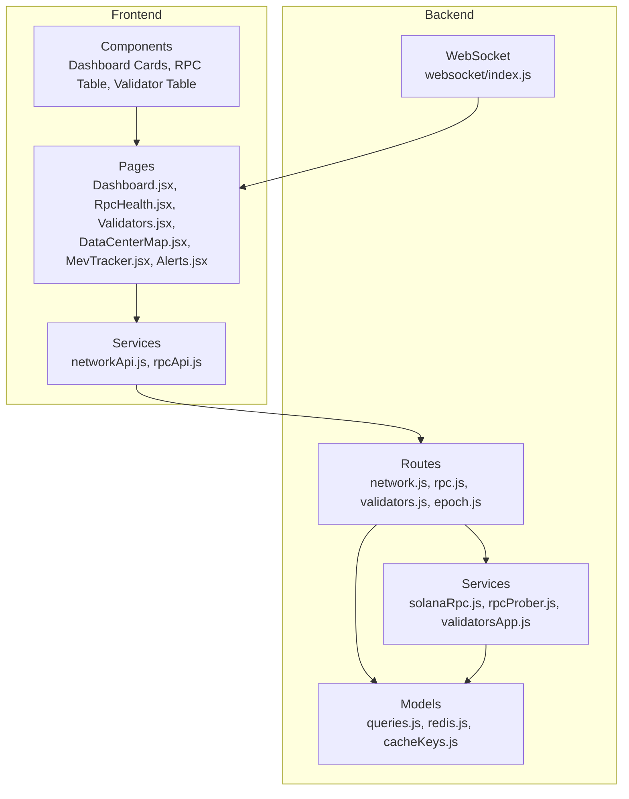
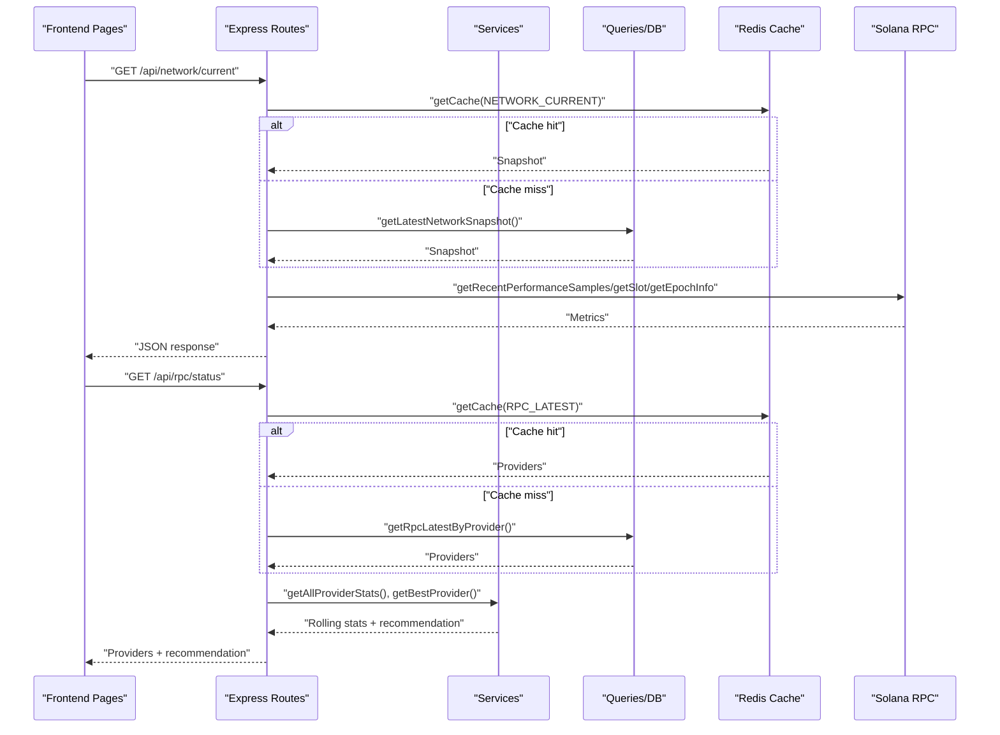
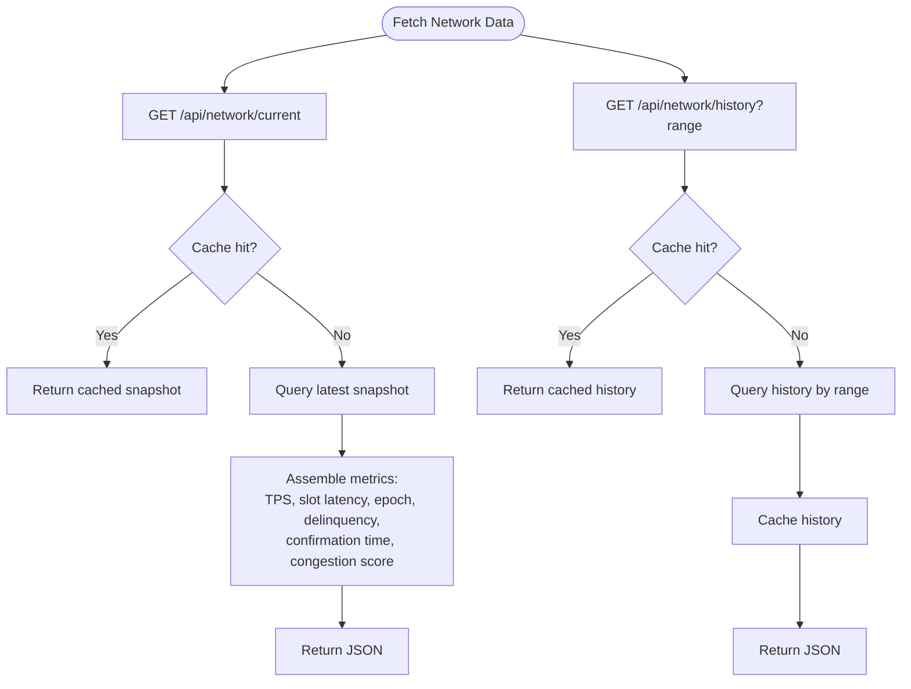
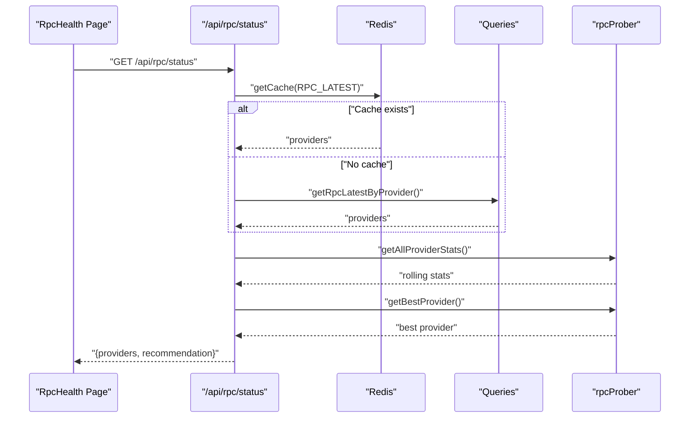
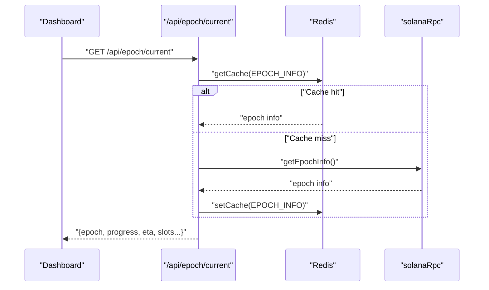
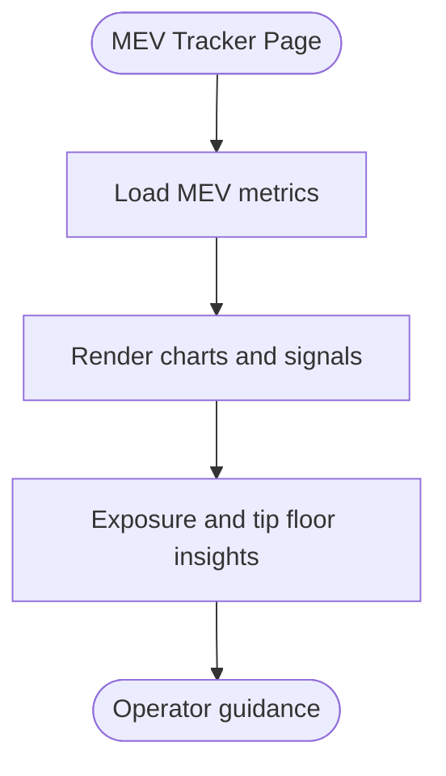
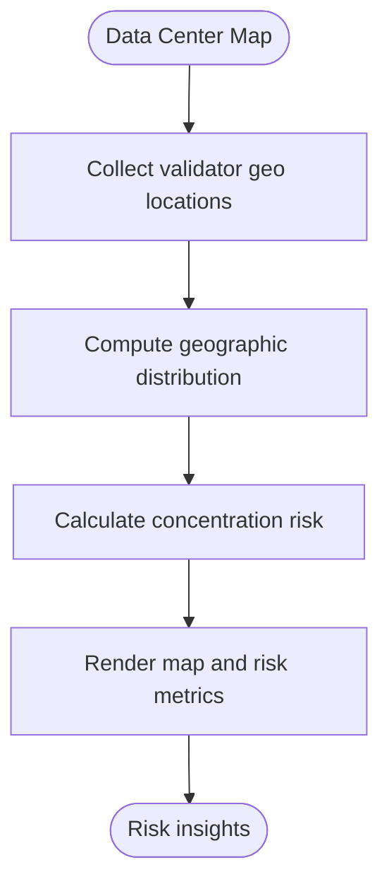
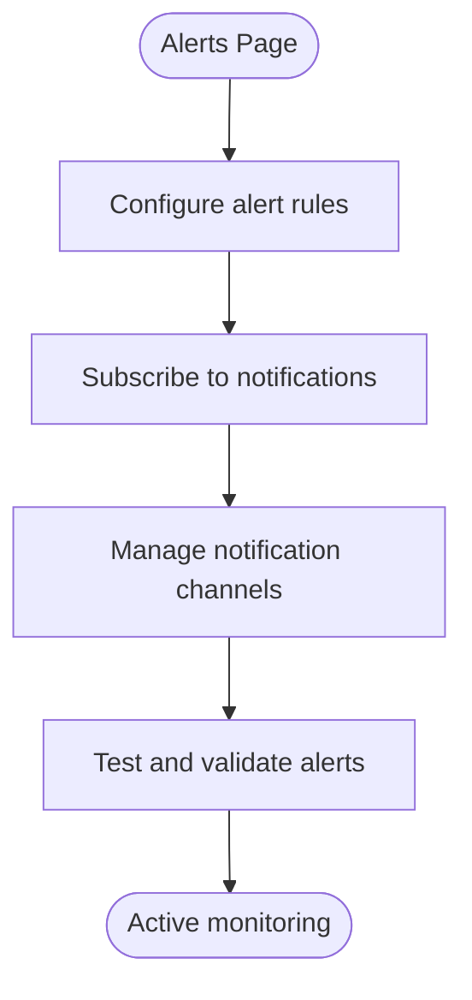
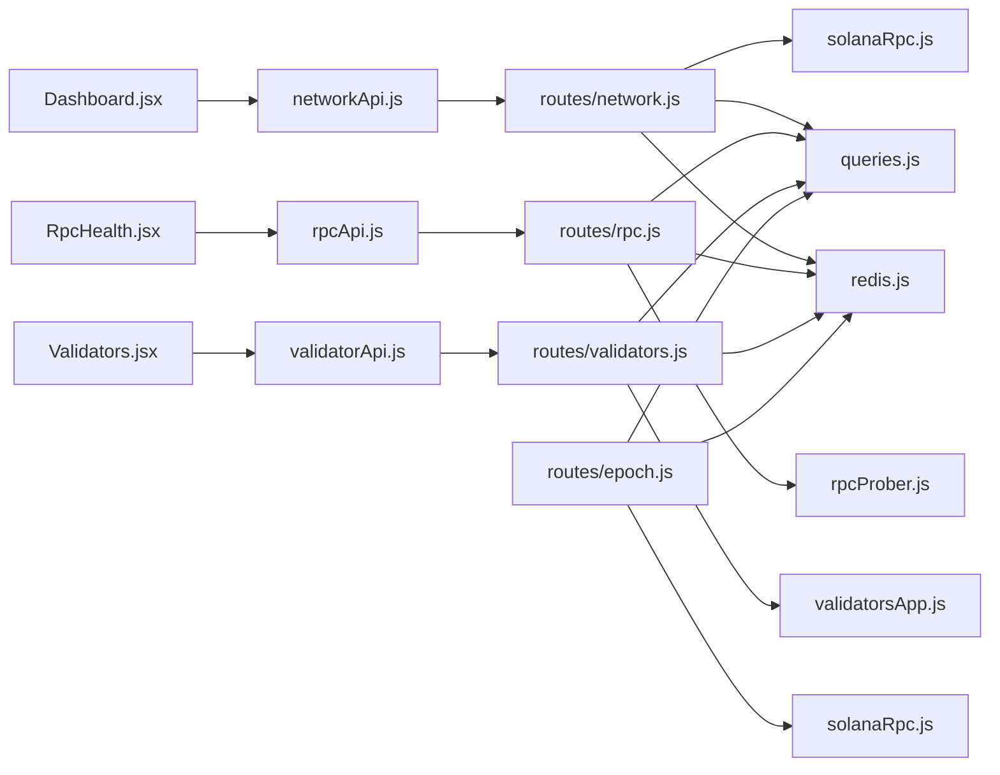

# Features & Functionality

<cite>
**Referenced Files in This Document**
- [backend/src/routes/network.js](file://backend/src/routes/network.js)
- [backend/src/routes/rpc.js](file://backend/src/routes/rpc.js)
- [backend/src/routes/validators.js](file://backend/src/routes/validators.js)
- [backend/src/routes/epoch.js](file://backend/src/routes/epoch.js)
- [backend/src/services/solanaRpc.js](file://backend/src/services/solanaRpc.js)
- [backend/src/services/rpcProber.js](file://backend/src/services/rpcProber.js)
- [backend/src/services/validatorsApp.js](file://backend/src/services/validatorsApp.js)
- [backend/src/models/queries.js](file://backend/src/models/queries.js)
- [backend/src/models/redis.js](file://backend/src/models/redis.js)
- [backend/src/models/cacheKeys.js](file://backend/src/models/cacheKeys.js)
- [backend/src/websocket/index.js](file://backend/src/websocket/index.js)
- [frontend/src/pages/Dashboard.jsx](file://frontend/src/pages/Dashboard.jsx)
- [frontend/src/components/dashboard/TpsCard.jsx](file://frontend/src/components/dashboard/TpsCard.jsx)
- [frontend/src/components/dashboard/SlotLatencyCard.jsx](file://frontend/src/components/dashboard/SlotLatencyCard.jsx)
- [frontend/src/components/dashboard/EpochProgressCard.jsx](file://frontend/src/components/dashboard/EpochProgressCard.jsx)
- [frontend/src/services/networkApi.js](file://frontend/src/services/networkApi.js)
- [frontend/src/pages/RpcHealth.jsx](file://frontend/src/pages/RpcHealth.jsx)
- [frontend/src/components/rpc/RpcProviderTable.jsx](file://frontend/src/components/rpc/RpcProviderTable.jsx)
- [frontend/src/services/rpcApi.js](file://frontend/src/services/rpcApi.js)
- [frontend/src/pages/Validators.jsx](file://frontend/src/pages/Validators.jsx)
- [frontend/src/components/validators/ValidatorTable.jsx](file://frontend/src/components/validators/ValidatorTable.jsx)
- [frontend/src/pages/DataCenterMap.jsx](file://frontend/src/pages/DataCenterMap.jsx)
- [frontend/src/pages/MevTracker.jsx](file://frontend/src/pages/MevTracker.jsx)
- [frontend/src/pages/Alerts.jsx](file://frontend/src/pages/Alerts.jsx)
</cite>

## Table of Contents
1. [Introduction](#introduction)
2. [Project Structure](#project-structure)
3. [Core Components](#core-components)
4. [Architecture Overview](#architecture-overview)
5. [Detailed Component Analysis](#detailed-component-analysis)
6. [Dependency Analysis](#dependency-analysis)
7. [Performance Considerations](#performance-considerations)
8. [Troubleshooting Guide](#troubleshooting-guide)
9. [Conclusion](#conclusion)
10. [Appendices](#appendices)

## Introduction
This document describes InfraWatch’s core features and functionality as implemented in the repository. It covers:
- Network health dashboard: TPS monitoring, slot latency tracking, epoch progress visualization, congestion scoring, and confirmation time metrics.
- RPC provider monitoring: health checks, performance statistics, and automated recommendations.
- Validator health tracking: performance scoring, delinquency monitoring, and commission change indicators.
- MEV exposure monitoring for Jito validators and tip floor tracking.
- Data center risk assessment via geographic distribution mapping and concentration risk calculations.
- Alert system configuration and notification management.

The backend exposes REST endpoints and caches results for efficient frontend consumption. The frontend renders dashboards and tables with real-time updates and sorting capabilities.

## Project Structure
The application follows a split monorepo-like structure:
- Backend: Express routes, services, caching, and database queries.
- Frontend: React pages, components, stores, and API service wrappers.

**Diagram sources**
- [backend/src/routes/network.js:1-135](file://backend/src/routes/network.js#L1-L135)
- [backend/src/routes/rpc.js:1-135](file://backend/src/routes/rpc.js#L1-L135)
- [backend/src/routes/validators.js:1-112](file://backend/src/routes/validators.js#L1-L112)
- [backend/src/routes/epoch.js:1-62](file://backend/src/routes/epoch.js#L1-L62)
- [backend/src/services/solanaRpc.js:1-340](file://backend/src/services/solanaRpc.js#L1-L340)
- [backend/src/services/rpcProber.js](file://backend/src/services/rpcProber.js)
- [backend/src/services/validatorsApp.js](file://backend/src/services/validatorsApp.js)
- [backend/src/models/queries.js](file://backend/src/models/queries.js)
- [backend/src/models/redis.js](file://backend/src/models/redis.js)
- [backend/src/models/cacheKeys.js](file://backend/src/models/cacheKeys.js)
- [backend/src/websocket/index.js](file://backend/src/websocket/index.js)
- [frontend/src/pages/Dashboard.jsx:1-84](file://frontend/src/pages/Dashboard.jsx#L1-L84)
- [frontend/src/pages/RpcHealth.jsx:1-153](file://frontend/src/pages/RpcHealth.jsx#L1-L153)
- [frontend/src/pages/Validators.jsx:1-179](file://frontend/src/pages/Validators.jsx#L1-L179)
- [frontend/src/pages/DataCenterMap.jsx](file://frontend/src/pages/DataCenterMap.jsx)
- [frontend/src/pages/MevTracker.jsx](file://frontend/src/pages/MevTracker.jsx)
- [frontend/src/pages/Alerts.jsx](file://frontend/src/pages/Alerts.jsx)
- [frontend/src/services/networkApi.js:1-6](file://frontend/src/services/networkApi.js#L1-L6)
- [frontend/src/services/rpcApi.js:1-7](file://frontend/src/services/rpcApi.js#L1-L7)

**Section sources**
- [backend/src/routes/network.js:1-135](file://backend/src/routes/network.js#L1-L135)
- [backend/src/routes/rpc.js:1-135](file://backend/src/routes/rpc.js#L1-L135)
- [backend/src/routes/validators.js:1-112](file://backend/src/routes/validators.js#L1-L112)
- [backend/src/routes/epoch.js:1-62](file://backend/src/routes/epoch.js#L1-L62)
- [backend/src/services/solanaRpc.js:1-340](file://backend/src/services/solanaRpc.js#L1-L340)
- [frontend/src/pages/Dashboard.jsx:1-84](file://frontend/src/pages/Dashboard.jsx#L1-L84)
- [frontend/src/pages/RpcHealth.jsx:1-153](file://frontend/src/pages/RpcHealth.jsx#L1-L153)
- [frontend/src/pages/Validators.jsx:1-179](file://frontend/src/pages/Validators.jsx#L1-L179)

## Core Components
- Network dashboard endpoints provide current network status and historical charts for TPS, epoch progress, and congestion.
- RPC monitoring aggregates live health and rolling statistics, and surfaces a recommended provider.
- Validator rankings expose top validators with scores, stake, commission, skip rate, and delinquency status.
- Epoch info is fetched from Solana RPC and cached for quick rendering.
- WebSocket support enables real-time updates to the dashboard.

**Section sources**
- [backend/src/routes/network.js:17-79](file://backend/src/routes/network.js#L17-L79)
- [backend/src/routes/network.js:85-132](file://backend/src/routes/network.js#L85-L132)
- [backend/src/routes/rpc.js:17-88](file://backend/src/routes/rpc.js#L17-L88)
- [backend/src/routes/rpc.js:94-132](file://backend/src/routes/rpc.js#L94-L132)
- [backend/src/routes/validators.js:17-46](file://backend/src/routes/validators.js#L17-L46)
- [backend/src/routes/validators.js:52-109](file://backend/src/routes/validators.js#L52-L109)
- [backend/src/routes/epoch.js:16-59](file://backend/src/routes/epoch.js#L16-L59)
- [backend/src/services/solanaRpc.js:275-328](file://backend/src/services/solanaRpc.js#L275-L328)
- [backend/src/websocket/index.js](file://backend/src/websocket/index.js)

## Architecture Overview
The backend orchestrates data collection from Solana RPC and external services, persists and caches results, and serves them via REST endpoints. The frontend consumes these endpoints, renders dashboards, and refreshes periodically.

**Diagram sources**
- [backend/src/routes/network.js:17-79](file://backend/src/routes/network.js#L17-L79)
- [backend/src/routes/rpc.js:17-88](file://backend/src/routes/rpc.js#L17-L88)
- [backend/src/services/solanaRpc.js:40-156](file://backend/src/services/solanaRpc.js#L40-L156)
- [backend/src/models/redis.js](file://backend/src/models/redis.js)
- [backend/src/models/queries.js](file://backend/src/models/queries.js)

## Detailed Component Analysis

### Network Health Dashboard
The dashboard displays:
- TPS and a 30-point TPS history chart.
- Slot latency with a health threshold.
- Epoch progress with ETA and slot counters.
- Confirmation time and congestion score derived from TPS, latency, and priority fees.
- Delinquent and active validator counts.

**Diagram sources**
- [backend/src/routes/network.js:17-79](file://backend/src/routes/network.js#L17-L79)
- [backend/src/routes/network.js:85-132](file://backend/src/routes/network.js#L85-L132)
- [backend/src/services/solanaRpc.js:275-328](file://backend/src/services/solanaRpc.js#L275-L328)

**Section sources**
- [frontend/src/pages/Dashboard.jsx:19-83](file://frontend/src/pages/Dashboard.jsx#L19-L83)
- [frontend/src/components/dashboard/TpsCard.jsx:14-56](file://frontend/src/components/dashboard/TpsCard.jsx#L14-L56)
- [frontend/src/components/dashboard/SlotLatencyCard.jsx:12-28](file://frontend/src/components/dashboard/SlotLatencyCard.jsx#L12-L28)
- [frontend/src/components/dashboard/EpochProgressCard.jsx:5-73](file://frontend/src/components/dashboard/EpochProgressCard.jsx#L5-L73)
- [frontend/src/services/networkApi.js:1-6](file://frontend/src/services/networkApi.js#L1-L6)
- [backend/src/services/solanaRpc.js:228-268](file://backend/src/services/solanaRpc.js#L228-L268)

### RPC Provider Monitoring
The RPC health page shows:
- Live health status, latency, and error messages per provider.
- Rolling statistics: p50/p95/p99 latency, uptime percentage, total checks, and last incident.
- Provider categorization (Premium/Public) and a recommended provider.

**Diagram sources**
- [backend/src/routes/rpc.js:17-88](file://backend/src/routes/rpc.js#L17-L88)
- [backend/src/services/rpcProber.js](file://backend/src/services/rpcProber.js)
- [backend/src/models/redis.js](file://backend/src/models/redis.js)
- [backend/src/models/queries.js](file://backend/src/models/queries.js)

**Section sources**
- [frontend/src/pages/RpcHealth.jsx:8-152](file://frontend/src/pages/RpcHealth.jsx#L8-L152)
- [frontend/src/components/rpc/RpcProviderTable.jsx:39-176](file://frontend/src/components/rpc/RpcProviderTable.jsx#L39-L176)
- [frontend/src/services/rpcApi.js:1-7](file://frontend/src/services/rpcApi.js#L1-L7)
- [backend/src/routes/rpc.js:94-132](file://backend/src/routes/rpc.js#L94-L132)

### Validator Health Tracking
The validators page presents:
- Top validators ranked by score with stake, commission, skip rate, software version, and data center.
- Delinquency status and selection of a validator for detailed view.
- Sorting by name, score, stake, commission, skip rate, and others.

```mermaid
sequenceDiagram
participant FE as "Validators Page"
participant API as "/api/validators/top"
participant RC as "Redis"
participant DB as "Queries"
participant VA as "validatorsApp"
FE->>API : "GET /api/validators/top?limit"
API->>RC : "getCache(VALIDATORS_TOP100)"
alt "Cache hit"
RC-->>API : "subset"
else "Cache miss"
API->>DB : "getTopValidators(limit)"
DB-->>API : "validators"
end
API-->>FE : "Top validators"
FE->>API : "GET /api/validators/ : votePubkey"
API->>RC : "getCache(VALIDATOR_DETAIL)"
alt "Cache hit"
RC-->>API : "validator"
else "Cache miss"
API->>VA : "getValidatorDetail(votePubkey)"
VA-->>API : "validator"
alt "Fallback"
API->>DB : "getValidatorByPubkey(votePubkey)"
DB-->>API : "validator"
end
end
API-->>FE : "Validator detail"
```

**Diagram sources**
- [backend/src/routes/validators.js:17-46](file://backend/src/routes/validators.js#L17-L46)
- [backend/src/routes/validators.js:52-109](file://backend/src/routes/validators.js#L52-L109)
- [backend/src/services/validatorsApp.js](file://backend/src/services/validatorsApp.js)
- [backend/src/models/redis.js](file://backend/src/models/redis.js)
- [backend/src/models/queries.js](file://backend/src/models/queries.js)

**Section sources**
- [frontend/src/pages/Validators.jsx:8-178](file://frontend/src/pages/Validators.jsx#L8-L178)
- [frontend/src/components/validators/ValidatorTable.jsx:35-201](file://frontend/src/components/validators/ValidatorTable.jsx#L35-L201)
- [backend/src/routes/validators.js:17-46](file://backend/src/routes/validators.js#L17-L46)
- [backend/src/routes/validators.js:52-109](file://backend/src/routes/validators.js#L52-L109)

### Epoch Progress Visualization
Epoch information is fetched from Solana RPC and cached. The frontend renders epoch number, progress percentage, ETA, and slot counters.

**Diagram sources**
- [backend/src/routes/epoch.js:16-59](file://backend/src/routes/epoch.js#L16-L59)
- [backend/src/services/solanaRpc.js:124-156](file://backend/src/services/solanaRpc.js#L124-L156)
- [backend/src/models/redis.js](file://backend/src/models/redis.js)

**Section sources**
- [frontend/src/pages/Dashboard.jsx:32-40](file://frontend/src/pages/Dashboard.jsx#L32-L40)
- [frontend/src/components/dashboard/EpochProgressCard.jsx:5-73](file://frontend/src/components/dashboard/EpochProgressCard.jsx#L5-L73)
- [backend/src/routes/epoch.js:16-59](file://backend/src/routes/epoch.js#L16-L59)

### MEV Exposure Monitoring and Tip Floor Tracking
The MEV tracker page provides visibility into Jito-related metrics and tip floor trends. It integrates with external MEV data sources and displays relevant signals for validator operators.

**Section sources**
- [frontend/src/pages/MevTracker.jsx](file://frontend/src/pages/MevTracker.jsx)

### Data Center Risk Assessment
The data center map page visualizes geographic distribution of validators and computes concentration risk. It helps operators diversify infrastructure to reduce geographic risk.

**Section sources**
- [frontend/src/pages/DataCenterMap.jsx](file://frontend/src/pages/DataCenterMap.jsx)

### Alert System Configuration and Notification Management
The alerts page allows configuring and managing notifications for critical events across network, RPC, and validator domains. Operators can subscribe to specific conditions and receive timely updates.

**Section sources**
- [frontend/src/pages/Alerts.jsx](file://frontend/src/pages/Alerts.jsx)

## Dependency Analysis
The backend components depend on services and models for data retrieval and caching. The frontend depends on route endpoints and stores for state management.

**Diagram sources**
- [frontend/src/pages/Dashboard.jsx:1-84](file://frontend/src/pages/Dashboard.jsx#L1-L84)
- [frontend/src/pages/RpcHealth.jsx:1-153](file://frontend/src/pages/RpcHealth.jsx#L1-L153)
- [frontend/src/pages/Validators.jsx:1-179](file://frontend/src/pages/Validators.jsx#L1-L179)
- [frontend/src/services/networkApi.js:1-6](file://frontend/src/services/networkApi.js#L1-L6)
- [frontend/src/services/rpcApi.js:1-7](file://frontend/src/services/rpcApi.js#L1-L7)
- [backend/src/routes/network.js:1-135](file://backend/src/routes/network.js#L1-L135)
- [backend/src/routes/rpc.js:1-135](file://backend/src/routes/rpc.js#L1-L135)
- [backend/src/routes/validators.js:1-112](file://backend/src/routes/validators.js#L1-L112)
- [backend/src/routes/epoch.js:1-62](file://backend/src/routes/epoch.js#L1-L62)
- [backend/src/services/solanaRpc.js:1-340](file://backend/src/services/solanaRpc.js#L1-L340)
- [backend/src/services/rpcProber.js](file://backend/src/services/rpcProber.js)
- [backend/src/services/validatorsApp.js](file://backend/src/services/validatorsApp.js)
- [backend/src/models/queries.js](file://backend/src/models/queries.js)
- [backend/src/models/redis.js](file://backend/src/models/redis.js)

**Section sources**
- [backend/src/models/cacheKeys.js](file://backend/src/models/cacheKeys.js)
- [backend/src/websocket/index.js](file://backend/src/websocket/index.js)

## Performance Considerations
- Caching: Redis keys are used for current network status, RPC latest, validator top lists, and epoch info to minimize RPC and DB load.
- Parallel collection: Network snapshots aggregate multiple RPC calls concurrently.
- Rolling statistics: RPC prober maintains windowed stats for latency percentiles and uptime.
- Frontend polling: Pages poll endpoints at intervals to balance freshness and load.

[No sources needed since this section provides general guidance]

## Troubleshooting Guide
Common issues and remedies:
- No network data available: The network route returns a 503 when startup data is missing; retry after initialization completes.
- Redis failures: Routes fall back to DB queries; cache set failures are logged and do not block responses.
- RPC unavailability: Epoch and network routes rely on Solana RPC; errors are handled gracefully with defaults.
- Validator detail not found: Route returns 404 when no record is present; check vote public key and external data sync.

**Section sources**
- [backend/src/routes/network.js:44-61](file://backend/src/routes/network.js#L44-L61)
- [backend/src/routes/network.js:110-126](file://backend/src/routes/network.js#L110-L126)
- [backend/src/routes/epoch.js:37-55](file://backend/src/routes/epoch.js#L37-L55)
- [backend/src/routes/validators.js:82-96](file://backend/src/routes/validators.js#L82-L96)

## Conclusion
InfraWatch delivers a comprehensive observability platform for Solana infrastructure. The backend efficiently collects and caches network, RPC, and validator data, while the frontend provides actionable dashboards and tables. The platform supports operational excellence through real-time monitoring, recommendations, and alerting.

[No sources needed since this section summarizes without analyzing specific files]

## Appendices
- Real-time updates: WebSocket integration enhances live data delivery to the dashboard.
- Provider categories: Premium vs Public categorization aids quick triage of provider quality.
- Sorting and filtering: Frontend components enable operator-driven exploration of RPC and validator datasets.

**Section sources**
- [backend/src/websocket/index.js](file://backend/src/websocket/index.js)
- [frontend/src/components/rpc/RpcProviderTable.jsx:5-14](file://frontend/src/components/rpc/RpcProviderTable.jsx#L5-L14)
- [frontend/src/pages/RpcHealth.jsx:41-77](file://frontend/src/pages/RpcHealth.jsx#L41-L77)
- [frontend/src/pages/Validators.jsx:53-88](file://frontend/src/pages/Validators.jsx#L53-L88)