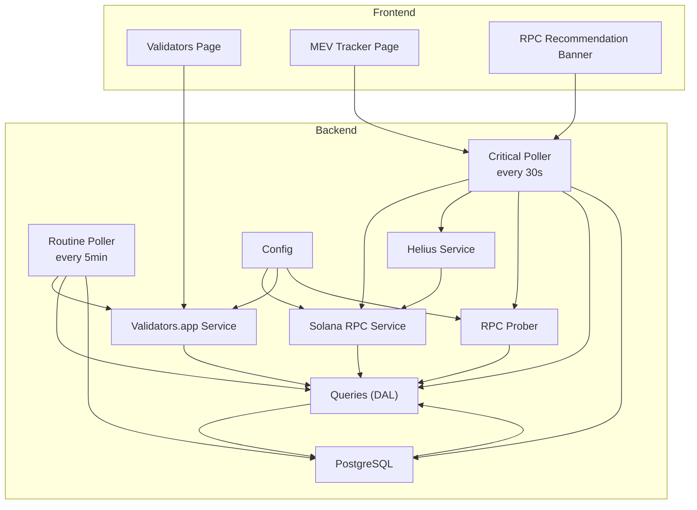
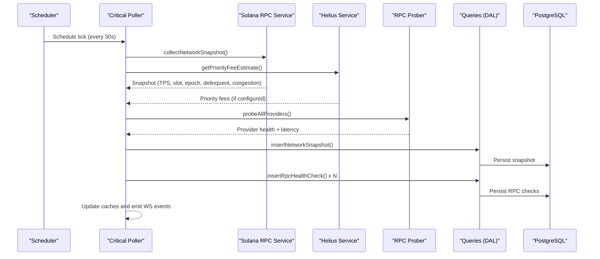
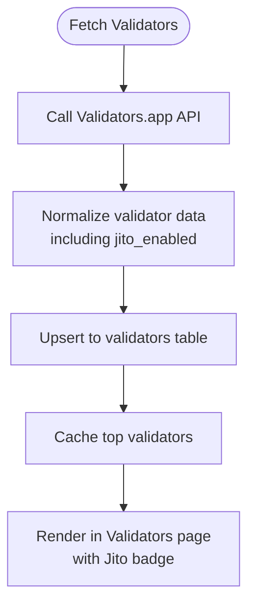
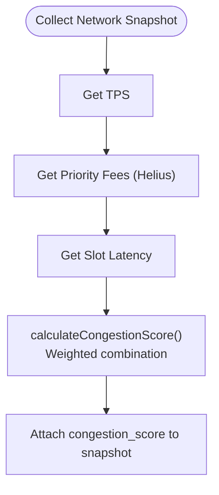
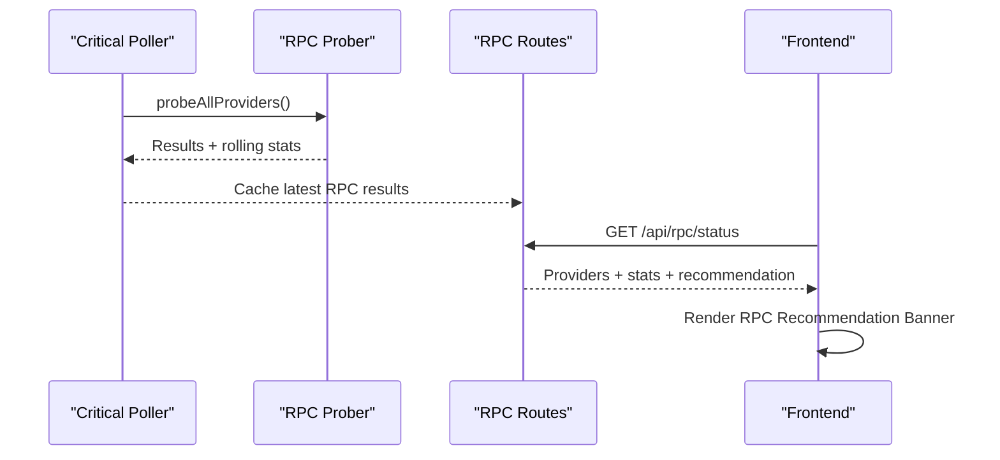
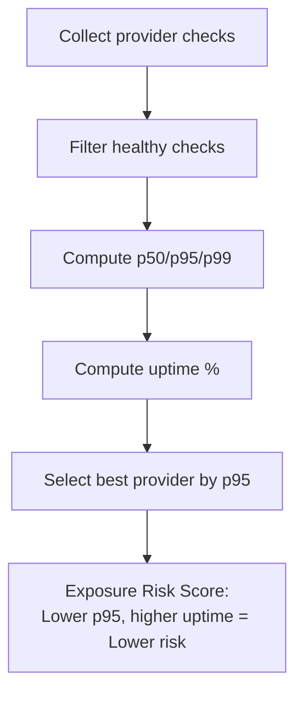
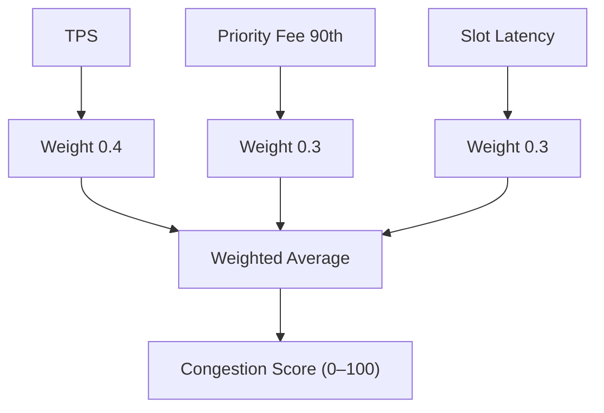
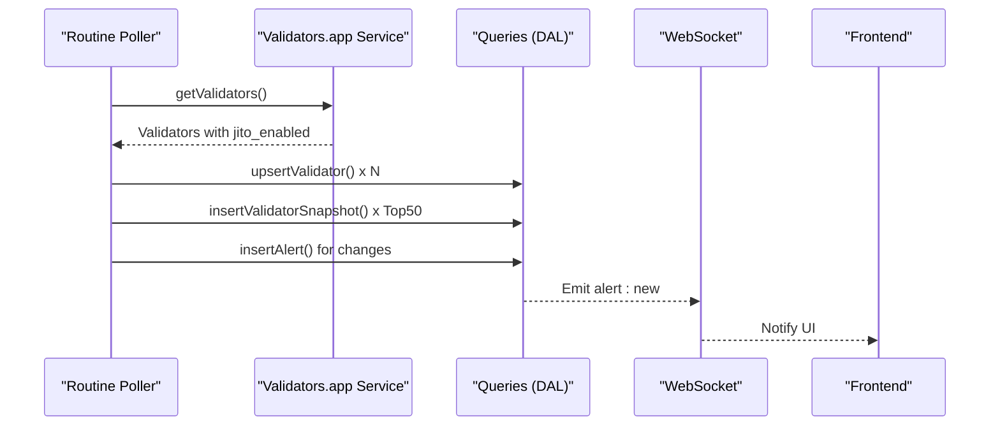
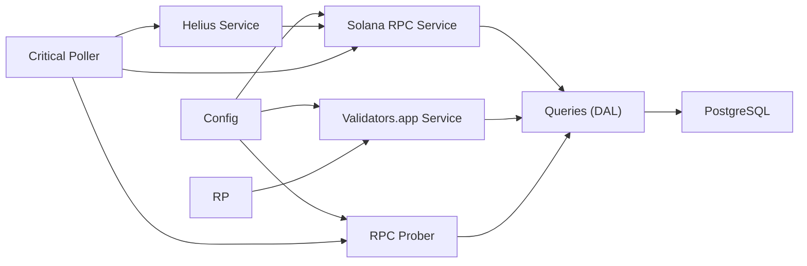
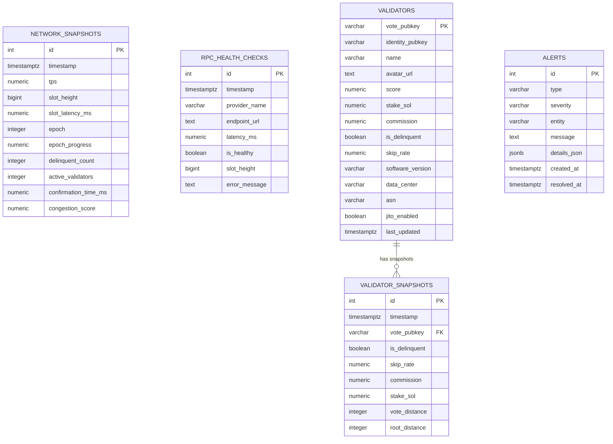

# MEV Exposure Monitoring

<cite>
**Referenced Files in This Document**
- [rpcProber.js](file://backend/src/services/rpcProber.js)
- [rpc.js](file://backend/src/routes/rpc.js)
- [solanaRpc.js](file://backend/src/services/solanaRpc.js)
- [helius.js](file://backend/src/services/helius.js)
- [validatorsApp.js](file://backend/src/services/validatorsApp.js)
- [queries.js](file://backend/src/models/queries.js)
- [criticalPoller.js](file://backend/src/jobs/criticalPoller.js)
- [routinePoller.js](file://backend/src/jobs/routinePoller.js)
- [index.js](file://backend/src/config/index.js)
- [db.js](file://backend/src/models/db.js)
- [migrate.js](file://backend/src/models/migrate.js)
- [MevTracker.jsx](file://frontend/src/pages/MevTracker.jsx)
- [RpcRecommendationBanner.jsx](file://frontend/src/components/rpc/RpcRecommendationBanner.jsx)
- [Validators.jsx](file://frontend/src/pages/Validators.jsx)
- [validatorStore.js](file://frontend/src/stores/validatorStore.js)
- [validatorApi.js](file://frontend/src/services/validatorApi.js)
</cite>

## Table of Contents
1. [Introduction](#introduction)
2. [Project Structure](#project-structure)
3. [Core Components](#core-components)
4. [Architecture Overview](#architecture-overview)
5. [Detailed Component Analysis](#detailed-component-analysis)
6. [Dependency Analysis](#dependency-analysis)
7. [Performance Considerations](#performance-considerations)
8. [Troubleshooting Guide](#troubleshooting-guide)
9. [Conclusion](#conclusion)
10. [Appendices](#appendices)

## Introduction
This document explains the MEV (Maximal Extractable Value) Exposure Monitoring feature in InfraWatch. It covers:
- Jito validator detection and MEV-protected node identification
- Tip floor tracking and market manipulation indicators
- MEV-protected RPC identification for secure transaction submission
- MEV exposure scoring for RPC providers
- Relationship between MEV activity and network congestion
- Real-time MEV monitoring with alert thresholds and risk warnings
- Educational content on MEV concepts, risks, and mitigation strategies

The system integrates live network telemetry, RPC health monitoring, validator metadata, and congestion analytics to provide actionable insights for reducing MEV exposure and maintaining secure, efficient transaction submission.

## Project Structure
The MEV monitoring capability spans backend services, polling jobs, database models, and frontend presentation layers. The backend collects network telemetry and probes RPC providers, while the frontend surfaces validator and RPC health information, including Jito-enabled validator status and RPC recommendations.

**Diagram sources**
- [criticalPoller.js:21-103](file://backend/src/jobs/criticalPoller.js#L21-L103)
- [routinePoller.js:20-111](file://backend/src/jobs/routinePoller.js#L20-L111)
- [solanaRpc.js:1-340](file://backend/src/services/solanaRpc.js#L1-L340)
- [helius.js:1-188](file://backend/src/services/helius.js#L1-L188)
- [rpcProber.js:1-342](file://backend/src/services/rpcProber.js#L1-L342)
- [validatorsApp.js:1-388](file://backend/src/services/validatorsApp.js#L1-L388)
- [queries.js:1-459](file://backend/src/models/queries.js#L1-L459)
- [index.js:1-68](file://backend/src/config/index.js#L1-L68)
- [Validators.jsx:1-179](file://frontend/src/pages/Validators.jsx#L1-L179)
- [MevTracker.jsx:1-43](file://frontend/src/pages/MevTracker.jsx#L1-L43)
- [RpcRecommendationBanner.jsx:1-63](file://frontend/src/components/rpc/RpcRecommendationBanner.jsx#L1-L63)

**Section sources**
- [criticalPoller.js:1-108](file://backend/src/jobs/criticalPoller.js#L1-L108)
- [routinePoller.js:1-116](file://backend/src/jobs/routinePoller.js#L1-L116)
- [solanaRpc.js:1-340](file://backend/src/services/solanaRpc.js#L1-L340)
- [helius.js:1-188](file://backend/src/services/helius.js#L1-L188)
- [rpcProber.js:1-342](file://backend/src/services/rpcProber.js#L1-L342)
- [validatorsApp.js:1-388](file://backend/src/services/validatorsApp.js#L1-L388)
- [queries.js:1-459](file://backend/src/models/queries.js#L1-L459)
- [index.js:1-68](file://backend/src/config/index.js#L1-L68)

## Core Components
- Network telemetry collection and congestion scoring
- RPC health probing and rolling statistics
- Helius priority fee integration for tip floor estimation
- Validator metadata ingestion with Jito detection
- Real-time streaming and recommendations

Key backend services and their roles:
- Solana RPC Service: health, TPS, slot latency, epoch info, delinquent validators, confirmation time, congestion scoring
- Helius Service: priority fee estimates and enhanced TPS data
- RPC Prober: provider health checks, latency measurements, rolling percentiles, best provider recommendation
- Validators.app Service: validator list, normalization, caching, rate limiting, commission change detection
- Data Access Layer (DAL): database operations for snapshots, RPC checks, validators, and alerts
- Polling Jobs: periodic collection and persistence of telemetry and validator data

**Section sources**
- [solanaRpc.js:1-340](file://backend/src/services/solanaRpc.js#L1-L340)
- [helius.js:1-188](file://backend/src/services/helius.js#L1-L188)
- [rpcProber.js:1-342](file://backend/src/services/rpcProber.js#L1-L342)
- [validatorsApp.js:1-388](file://backend/src/services/validatorsApp.js#L1-L388)
- [queries.js:1-459](file://backend/src/models/queries.js#L1-L459)
- [criticalPoller.js:1-108](file://backend/src/jobs/criticalPoller.js#L1-L108)
- [routinePoller.js:1-116](file://backend/src/jobs/routinePoller.js#L1-L116)

## Architecture Overview
The system operates on two cadences:
- Critical Poller (every 30 seconds): collects network snapshot, probes RPC providers, writes to DB and cache, emits WebSocket updates
- Routine Poller (every 5 minutes): fetches validators, detects changes, persists snapshots, creates alerts

**Diagram sources**
- [criticalPoller.js:21-103](file://backend/src/jobs/criticalPoller.js#L21-L103)
- [solanaRpc.js:275-328](file://backend/src/services/solanaRpc.js#L275-L328)
- [helius.js:13-70](file://backend/src/services/helius.js#L13-L70)
- [rpcProber.js:140-180](file://backend/src/services/rpcProber.js#L140-L180)
- [queries.js:27-118](file://backend/src/models/queries.js#L27-L118)

## Detailed Component Analysis

### Jito Validator Detection and MEV-Protected Nodes
- Validators.app provides a field indicating whether Jito is enabled for a validator. The backend normalizes this into the validator record and persists it to the database.
- The frontend displays Jito status alongside validator details, enabling users to identify MEV-protected validator nodes.

Implementation highlights:
- Field mapping includes a Jito flag during normalization
- Database schema includes a dedicated column for Jito status
- Frontend validator detail panel renders Jito status visually

**Diagram sources**
- [validatorsApp.js:156-179](file://backend/src/services/validatorsApp.js#L156-L179)
- [queries.js:180-220](file://backend/src/models/queries.js#L180-L220)
- [Validators.jsx:158-175](file://frontend/src/pages/Validators.jsx#L158-L175)

**Section sources**
- [validatorsApp.js:156-179](file://backend/src/services/validatorsApp.js#L156-L179)
- [queries.js:180-220](file://backend/src/models/queries.js#L180-L220)
- [Validators.jsx:158-175](file://frontend/src/pages/Validators.jsx#L158-L175)

### Tip Floor Tracking and Market Manipulation Indicators
- Helius service provides priority fee estimates, including low, medium, high, and very high levels, along with a 90th percentile proxy.
- The backend calculates congestion score using TPS, priority fee 90th percentile, and slot latency. This serves as a market manipulation indicator and helps infer tip floors.

**Diagram sources**
- [solanaRpc.js:275-328](file://backend/src/services/solanaRpc.js#L275-L328)
- [helius.js:13-70](file://backend/src/services/helius.js#L13-L70)
- [criticalPoller.js:32-43](file://backend/src/jobs/criticalPoller.js#L32-L43)

**Section sources**
- [helius.js:13-70](file://backend/src/services/helius.js#L13-L70)
- [solanaRpc.js:228-268](file://backend/src/services/solanaRpc.js#L228-L268)
- [criticalPoller.js:32-43](file://backend/src/jobs/criticalPoller.js#L32-L43)

### MEV-Protected RPC Identification
- RPC Prober continuously probes configured providers and computes rolling latency percentiles and uptime statistics.
- The system recommends the best healthy provider based on p95 latency, enabling users to select MEV-protected or low-latency RPCs.

**Diagram sources**
- [rpcProber.js:140-180](file://backend/src/services/rpcProber.js#L140-L180)
- [rpc.js:17-88](file://backend/src/routes/rpc.js#L17-L88)
- [RpcRecommendationBanner.jsx:3-62](file://frontend/src/components/rpc/RpcRecommendationBanner.jsx#L3-L62)

**Section sources**
- [rpcProber.js:256-307](file://backend/src/services/rpcProber.js#L256-L307)
- [rpc.js:17-88](file://backend/src/routes/rpc.js#L17-L88)
- [RpcRecommendationBanner.jsx:3-62](file://frontend/src/components/rpc/RpcRecommendationBanner.jsx#L3-L62)

### MEV Exposure Scoring for RPC Providers
- The scoring is implicit through RPC health metrics:
  - Uptime percentage (>95%) indicates reliability
  - Latency percentiles (p50/p95/p99) reflect responsiveness
  - Best provider selection prioritizes low-latency, healthy endpoints
- These metrics collectively quantify potential MEV exposure risks by highlighting unreliable or slow providers that may expose transactions to front-running.

**Diagram sources**
- [rpcProber.js:208-250](file://backend/src/services/rpcProber.js#L208-L250)
- [rpcProber.js:295-307](file://backend/src/services/rpcProber.js#L295-L307)

**Section sources**
- [rpcProber.js:208-250](file://backend/src/services/rpcProber.js#L208-L250)
- [rpcProber.js:295-307](file://backend/src/services/rpcProber.js#L295-L307)

### Relationship Between MEV Activity and Network Congestion
- Congestion score combines:
  - TPS (inverse relationship with congestion)
  - Priority fee 90th percentile (proxy for tip pressure)
  - Slot latency (proxy for block production delays)
- Higher congestion often correlates with increased MEV activity and market manipulation attempts.

**Diagram sources**
- [solanaRpc.js:228-268](file://backend/src/services/solanaRpc.js#L228-L268)

**Section sources**
- [solanaRpc.js:228-268](file://backend/src/services/solanaRpc.js#L228-L268)

### Real-Time MEV Activity Monitoring and Alerts
- The MEV Tracker page currently displays placeholders for MEV metrics and indicates future real-time stream integration.
- Alerts are generated for significant validator changes (e.g., commission changes) and can be extended to include MEV-related conditions.

**Diagram sources**
- [routinePoller.js:30-100](file://backend/src/jobs/routinePoller.js#L30-L100)
- [validatorsApp.js:186-209](file://backend/src/services/validatorsApp.js#L186-L209)
- [queries.js:180-220](file://backend/src/models/queries.js#L180-L220)
- [queries.js:340-403](file://backend/src/models/queries.js#L340-L403)

**Section sources**
- [MevTracker.jsx:1-43](file://frontend/src/pages/MevTracker.jsx#L1-L43)
- [routinePoller.js:80-100](file://backend/src/jobs/routinePoller.js#L80-L100)
- [queries.js:340-403](file://backend/src/models/queries.js#L340-L403)

### Educational Content: MEV Concepts, Risks, and Mitigation
- MEV refers to the profit extractable by miners/block builders from reordering, inserting, or censoring transactions. On MEV-protected networks, validators commit to submitting transactions in a canonical order, reducing front-running.
- Risks include:
  - Transaction reordering and sandwich attacks
  - Increased gas/tip costs under congestion
  - Slippage and reduced trade quality
- Mitigations:
  - Prefer MEV-protected validators and RPCs with low latency and high uptime
  - Monitor congestion and tip pressure indicators
  - Use priority fee estimates to set competitive tips
  - Diversify RPC providers and monitor health metrics

[No sources needed since this section provides general guidance]

## Dependency Analysis
The backend relies on configuration, database, and external APIs. The frontend consumes backend endpoints and displays telemetry and recommendations.

**Diagram sources**
- [index.js:27-65](file://backend/src/config/index.js#L27-L65)
- [solanaRpc.js:1-340](file://backend/src/services/solanaRpc.js#L1-L340)
- [validatorsApp.js:1-388](file://backend/src/services/validatorsApp.js#L1-L388)
- [rpcProber.js:1-342](file://backend/src/services/rpcProber.js#L1-L342)
- [helius.js:1-188](file://backend/src/services/helius.js#L1-L188)
- [queries.js:1-459](file://backend/src/models/queries.js#L1-L459)
- [db.js:15-47](file://backend/src/models/db.js#L15-L47)

**Section sources**
- [index.js:27-65](file://backend/src/config/index.js#L27-L65)
- [db.js:15-47](file://backend/src/models/db.js#L15-L47)
- [migrate.js:11-94](file://backend/src/models/migrate.js#L11-L94)

## Performance Considerations
- Polling cadence: Critical Poller runs every 30 seconds; Routine Poller runs every 5 minutes. Adjust intervals via configuration for desired responsiveness vs. resource usage.
- Caching: Redis caches current network snapshot and RPC results; database serves as fallback and persistence layer.
- Rolling statistics: Efficiently computed percentiles and uptime metrics enable quick provider comparisons.
- External API limits: Validators.app rate limiter prevents throttling; ensure API keys are configured for optimal data flow.

[No sources needed since this section provides general guidance]

## Troubleshooting Guide
Common issues and resolutions:
- Database not configured: The system logs a warning and disables database-dependent features. Set the database URL to enable persistence.
- Redis unavailability: Cache updates are skipped gracefully; endpoints still serve from database fallback.
- Missing Helius API key: Priority fee data is unavailable; congestion scoring falls back to basic metrics.
- Validators.app API key missing: Validator data is limited; configure the API key for full validator metadata.
- RPC provider timeouts: Probes mark providers unhealthy; review endpoint URLs and network connectivity.

**Section sources**
- [db.js:20-23](file://backend/src/models/db.js#L20-L23)
- [criticalPoller.js:80-86](file://backend/src/jobs/criticalPoller.js#L80-L86)
- [helius.js:14-18](file://backend/src/services/helius.js#L14-L18)
- [validatorsApp.js:116-119](file://backend/src/services/validatorsApp.js#L116-L119)
- [rpcProber.js:119-133](file://backend/src/services/rpcProber.js#L119-L133)

## Conclusion
InfraWatch’s MEV Exposure Monitoring integrates network telemetry, RPC health metrics, and validator metadata to help users and developers reduce MEV risks. By leveraging Jito-enabled validators, tip floor indicators, congestion scoring, and real-time recommendations, the platform supports informed decisions for secure and efficient transaction submission.

[No sources needed since this section summarizes without analyzing specific files]

## Appendices

### Database Schema Overview
Tables supporting MEV monitoring:
- Network snapshots: time-series metrics including congestion score
- RPC health checks: provider latency, health, and error tracking
- Validators: current validator state including Jito flag
- Validator snapshots: historical state for trend analysis
- Alerts: event log for operational and MEV-related signals

**Diagram sources**
- [migrate.js:11-94](file://backend/src/models/migrate.js#L11-L94)

### Frontend Data Flow
- Validators page fetches top validators and displays Jito status and other metrics.
- RPC recommendation banner shows the fastest healthy provider and suggests switching thresholds.
- MEV Tracker page presents placeholder metrics and indicates future real-time integration.

**Section sources**
- [Validators.jsx:1-179](file://frontend/src/pages/Validators.jsx#L1-L179)
- [validatorStore.js:1-28](file://frontend/src/stores/validatorStore.js#L1-L28)
- [validatorApi.js:1-8](file://frontend/src/services/validatorApi.js#L1-L8)
- [RpcRecommendationBanner.jsx:1-63](file://frontend/src/components/rpc/RpcRecommendationBanner.jsx#L1-L63)
- [MevTracker.jsx:1-43](file://frontend/src/pages/MevTracker.jsx#L1-L43)