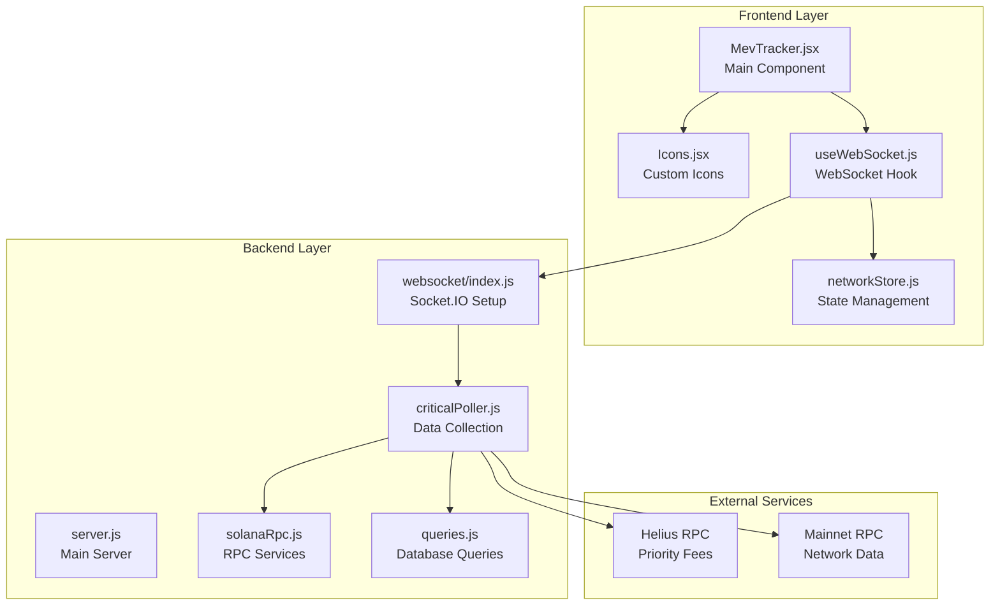
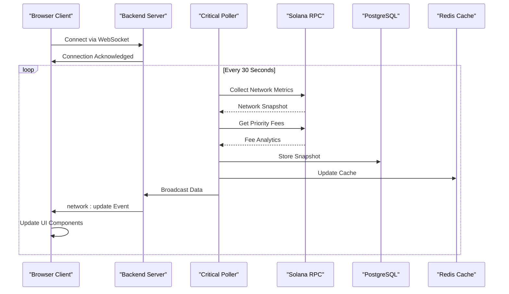
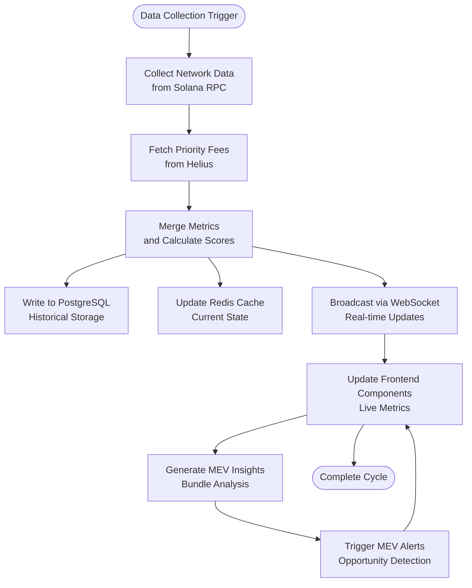

# MEV Tracker Page Documentation

<cite>
**Referenced Files in This Document**
- [MevTracker.jsx](file://frontend/src/pages/MevTracker.jsx)
- [App.jsx](file://frontend/src/App.jsx)
- [Icons.jsx](file://frontend/src/components/common/Icons.jsx)
- [server.js](file://backend/server.js)
- [index.js](file://backend/src/websocket/index.js)
- [criticalPoller.js](file://backend/src/jobs/criticalPoller.js)
- [solanaRpc.js](file://backend/src/services/solanaRpc.js)
- [queries.js](file://backend/src/models/queries.js)
- [networkStore.js](file://frontend/src/stores/networkStore.js)
- [useWebSocket.js](file://frontend/src/hooks/useWebSocket.js)
</cite>

## Table of Contents
1. [Introduction](#introduction)
2. [Project Structure](#project-structure)
3. [Core Components](#core-components)
4. [Architecture Overview](#architecture-overview)
5. [Detailed Component Analysis](#detailed-component-analysis)
6. [Data Flow Analysis](#data-flow-analysis)
7. [Performance Considerations](#performance-considerations)
8. [Future Implementation Guide](#future-implementation-guide)
9. [Conclusion](#conclusion)

## Introduction

The MEV Tracker Page is a planned feature for the InfraWatch platform that will provide real-time monitoring of Maximal Extractable Value (MEV) activities on the Solana network. Currently, the page serves as a placeholder with coming-soon functionality, displaying preview statistics and feature descriptions while the actual MEV tracking capabilities are under development.

MEV represents the maximum value that can be extracted from legitimate transaction permutations in a blockchain network. On Solana, this primarily involves monitoring Jito bundles, arbitrage opportunities, and transaction ordering advantages that validators and searchers can exploit.

## Project Structure

The MEV Tracker functionality is integrated into the broader InfraWatch monitoring ecosystem with the following key structural components:

**Diagram sources**
- [MevTracker.jsx:1-145](file://frontend/src/pages/MevTracker.jsx#L1-L145)
- [server.js:1-128](file://backend/server.js#L1-L128)
- [index.js:1-81](file://backend/src/websocket/index.js#L1-L81)

**Section sources**
- [MevTracker.jsx:1-145](file://frontend/src/pages/MevTracker.jsx#L1-L145)
- [App.jsx:1-31](file://frontend/src/App.jsx#L1-L31)

## Core Components

### Frontend Components

The MEV Tracker page consists of several key frontend components that work together to present the upcoming functionality:

#### Main Component Structure
The primary component follows a card-based layout with three main sections:
- **Header Section**: Displays the page title and description
- **Coming Soon Card**: Features animated elements and feature highlights
- **Preview Statistics Grid**: Shows mock MEV metrics
- **Information Banner**: Provides educational content about MEV tracking

#### Custom Icon System
The component utilizes a custom SVG icon library that replaces external dependencies like Lucide React. The icons include:
- Zap (lightning bolt) for speed and activity
- TrendingUp (chart) for growth metrics
- Target (bullseye) for success rates
- Coins (currency) for monetary values

#### Component Composition Pattern
The page demonstrates a reusable component pattern with:
- `ComingSoonCard`: Animated cards with hover effects
- `StatCard`: Consistent metric display with color-coded variants
- Flexible layout using CSS Grid for responsive design

**Section sources**
- [MevTracker.jsx:48-145](file://frontend/src/pages/MevTracker.jsx#L48-L145)
- [Icons.jsx:107-136](file://frontend/src/components/common/Icons.jsx#L107-L136)

### Backend Infrastructure

The backend provides the foundation for real-time MEV data collection and distribution:

#### WebSocket Architecture
The system uses Socket.IO for real-time bidirectional communication between the server and clients. The WebSocket setup handles:
- Client connection management
- Event broadcasting
- Connection counting and monitoring
- Graceful error handling

#### Data Collection Pipeline
The critical poller job orchestrates data collection every 30 seconds:
- Network snapshot collection from Solana RPC
- Priority fee analysis via Helius
- RPC provider health monitoring
- Database persistence and caching

**Section sources**
- [server.js:39-82](file://backend/server.js#L39-L82)
- [index.js:13-52](file://backend/src/websocket/index.js#L13-L52)
- [criticalPoller.js:21-100](file://backend/src/jobs/criticalPoller.js#L21-L100)

## Architecture Overview

The MEV Tracker functionality is designed to integrate seamlessly with the existing InfraWatch architecture through a real-time data pipeline:

**Diagram sources**
- [server.js:84-107](file://backend/server.js#L84-L107)
- [criticalPoller.js:23-94](file://backend/src/jobs/criticalPoller.js#L23-L94)
- [solanaRpc.js:275-333](file://backend/src/services/solanaRpc.js#L275-L333)

The architecture ensures:
- **Real-time Updates**: WebSocket connections provide instant data delivery
- **Data Persistence**: PostgreSQL stores historical metrics for trend analysis
- **Caching Layer**: Redis provides fast access to current network state
- **Scalability**: Modular design allows for independent scaling of components

## Detailed Component Analysis

### MEV Tracker Page Component

The main MEV Tracker component implements a sophisticated UI pattern focused on presenting upcoming functionality:

#### Layout and Design Patterns
The component uses a structured layout with:
- **Card-based Design**: Each major section is contained in a visually distinct card
- **Responsive Grid System**: Statistics cards adapt to different screen sizes
- **Animated Elements**: Subtle hover effects and loading indicators enhance user experience
- **Consistent Color Scheme**: Green accents indicate positive metrics, amber for warnings

#### Component Reusability
The design promotes component reuse through:
- **Modular Card Components**: `ComingSoonCard` and `StatCard` can be adapted for other features
- **Flexible Props System**: Components accept configuration through props
- **CSS-in-JS Styling**: Dynamic styling based on component props and state

#### Future Integration Points
The current implementation includes placeholders for:
- Live MEV stream data
- Real-time bundle monitoring
- Arbitrage opportunity detection
- Priority fee analytics

**Section sources**
- [MevTracker.jsx:70-145](file://frontend/src/pages/MevTracker.jsx#L70-L145)

### WebSocket Integration

The frontend WebSocket hook provides seamless real-time data integration:

#### Data Transformation Layer
The system includes automatic data transformation to handle:
- Field name normalization between backend and frontend
- Type conversion for numeric values
- Null-safe property access
- Backward compatibility for field renames

#### Connection Management
The hook manages:
- Automatic reconnection with polling fallback
- Connection state tracking
- Error handling and logging
- Cleanup on component unmount

**Section sources**
- [useWebSocket.js:47-73](file://frontend/src/hooks/useWebSocket.js#L47-L73)
- [networkStore.js:1-48](file://frontend/src/stores/networkStore.js#L1-L48)

### Backend Data Pipeline

The backend implements a robust data collection and distribution system:

#### Network Metrics Collection
The Solana RPC service collects comprehensive network data:
- **Transaction Throughput**: Real-time TPS calculations
- **Slot Progression**: Latency estimation and slot timing
- **Epoch Information**: Progress tracking and ETA calculations
- **Validator Health**: Delinquent validator monitoring
- **Congestion Analysis**: Multi-factor congestion scoring

#### Priority Fee Integration
The system integrates with Helius for advanced analytics:
- **Fee Estimation**: 90th percentile priority fee calculation
- **Market Analysis**: Fee tier distribution monitoring
- **Dynamic Scoring**: Enhanced congestion metrics incorporating fee data

**Section sources**
- [solanaRpc.js:275-333](file://backend/src/services/solanaRpc.js#L275-L333)
- [criticalPoller.js:35-43](file://backend/src/jobs/criticalPoller.js#L35-L43)

## Data Flow Analysis

The MEV Tracker data flow demonstrates a sophisticated real-time processing pipeline:

**Diagram sources**
- [criticalPoller.js:32-94](file://backend/src/jobs/criticalPoller.js#L32-L94)
- [solanaRpc.js:275-333](file://backend/src/services/solanaRpc.js#L275-L333)

The data flow ensures:
- **Consistency**: All data passes through standardized transformation
- **Reliability**: Graceful degradation when external services are unavailable
- **Performance**: Caching reduces database load for frequent queries
- **Real-time Responsiveness**: WebSocket updates minimize latency

**Section sources**
- [queries.js:432-459](file://backend/src/models/queries.js#L432-L459)

## Performance Considerations

The MEV Tracker implementation incorporates several performance optimization strategies:

### Frontend Performance
- **Lazy Loading**: Components are loaded only when the route is accessed
- **Efficient State Management**: Zustand provides lightweight state without unnecessary re-renders
- **Memory Management**: Proper cleanup of WebSocket connections and event listeners
- **Responsive Design**: CSS Grid and Flexbox ensure optimal rendering across devices

### Backend Performance
- **Connection Pooling**: Efficient database connections for concurrent requests
- **Caching Strategy**: Redis cache reduces database queries for frequently accessed data
- **Background Processing**: Cron jobs handle intensive operations without blocking requests
- **Graceful Degradation**: System continues operating even when external APIs are slow

### Scalability Factors
- **Horizontal Scaling**: Stateless components can be replicated across multiple instances
- **Database Indexing**: Optimized queries for historical data retrieval
- **Network Efficiency**: Minimized payload sizes through data transformation
- **Resource Monitoring**: Built-in health checks and error reporting

## Future Implementation Guide

The current MEV Tracker page provides a solid foundation for implementing full MEV monitoring capabilities:

### Required Backend Features
1. **Jito Bundle Integration**
   - Real-time bundle tracking via Jito's public API
   - Bundle landing success rate monitoring
   - Priority fee analysis for different bundle sizes

2. **Arbitrage Detection Engine**
   - Cross-exchange opportunity identification
   - Gas cost calculation and profitability thresholds
   - Real-time alert generation for profitable opportunities

3. **Sandwich Attack Monitoring**
   - Transaction pattern analysis
   - Front-running detection algorithms
   - Validator-specific risk assessment

### Frontend Enhancement Areas
1. **Live Data Visualization**
   - Real-time MEV stream with filtering options
   - Interactive charts for bundle performance metrics
   - Heat maps for geographic MEV distribution

2. **Advanced Analytics Dashboard**
   - Profitability calculators for different MEV strategies
   - Historical trend analysis and forecasting
   - Customizable alert systems for specific MEV opportunities

3. **User Experience Improvements**
   - Dark/light theme support
   - Mobile-optimized layouts
   - Export functionality for analytics data

### Integration Requirements
1. **API Endpoint Development**
   - `/api/mev/bundles` - Bundle tracking and analytics
   - `/api/mev/opportunities` - Arbitrage and sandwich detection
   - `/api/mev/stats` - Historical MEV statistics

2. **Database Schema Extensions**
   - MEV bundle tracking tables
   - Opportunity detection logs
   - User preference storage

3. **Security Considerations**
   - Rate limiting for MEV data queries
   - Input validation for user-defined filters
   - Audit logging for all MEV-related operations

**Section sources**
- [MevTracker.jsx:84-94](file://frontend/src/pages/MevTracker.jsx#L84-L94)
- [server.js:62-79](file://backend/server.js#L62-L79)

## Conclusion

The MEV Tracker Page represents a well-architected foundation for implementing comprehensive MEV monitoring capabilities within the InfraWatch ecosystem. While currently serving as a placeholder for future functionality, the implementation demonstrates strong architectural principles and provides a clear roadmap for full deployment.

The system's strength lies in its modular design, real-time capabilities, and integration with the existing monitoring infrastructure. The upcoming MEV tracking features will significantly enhance the platform's value proposition by providing operators and developers with critical insights into Solana's MEV landscape.

Key achievements of the current implementation include:
- **Robust Real-time Infrastructure**: WebSocket-based live data streaming
- **Scalable Architecture**: Modular components ready for expansion
- **Performance Optimization**: Efficient data collection and caching strategies
- **Developer-Friendly Design**: Clear patterns and reusable components

The foundation established by this implementation positions InfraWatch to become a comprehensive MEV monitoring solution, complementing its existing network health and validator monitoring capabilities.