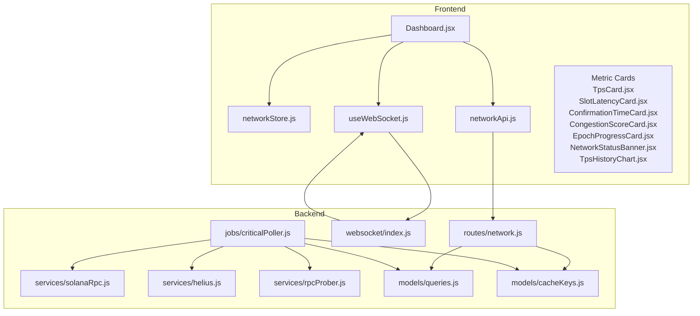
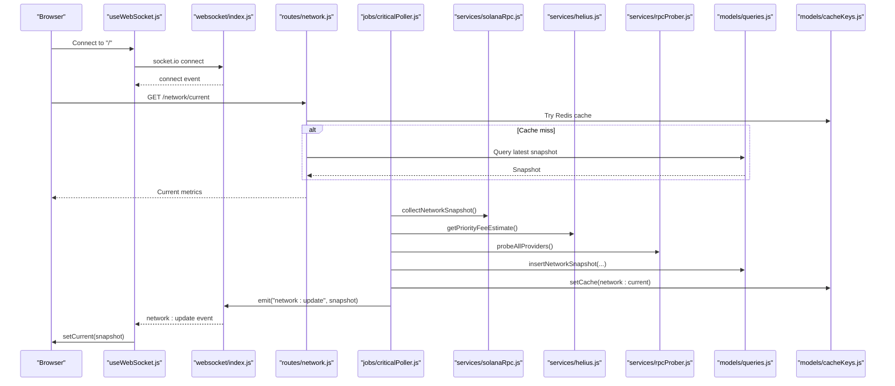
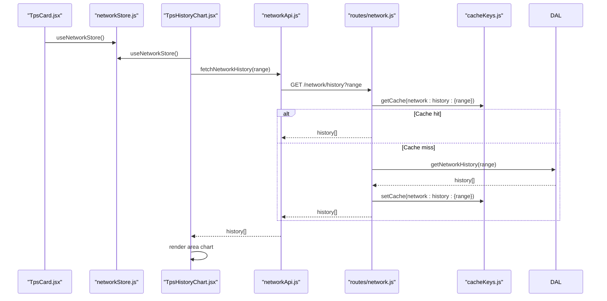
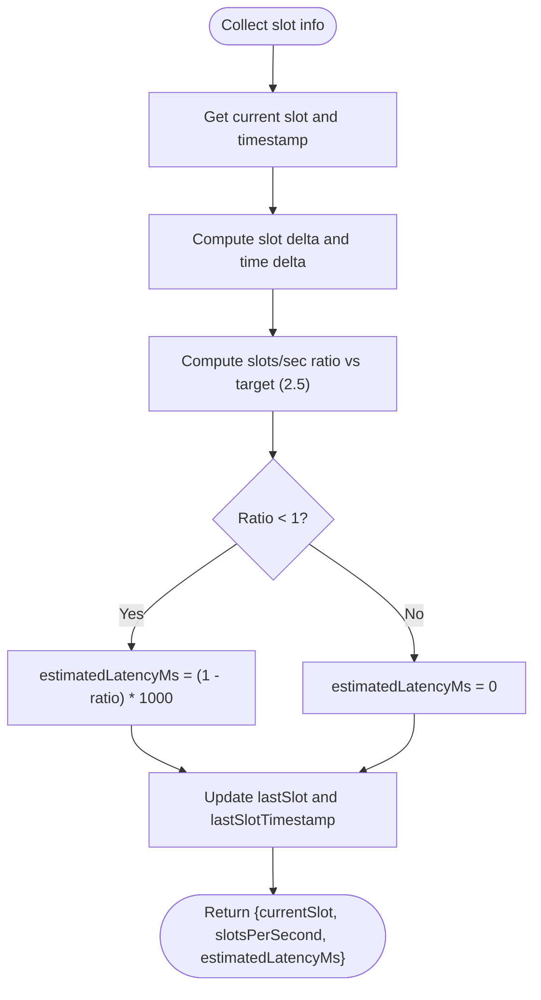
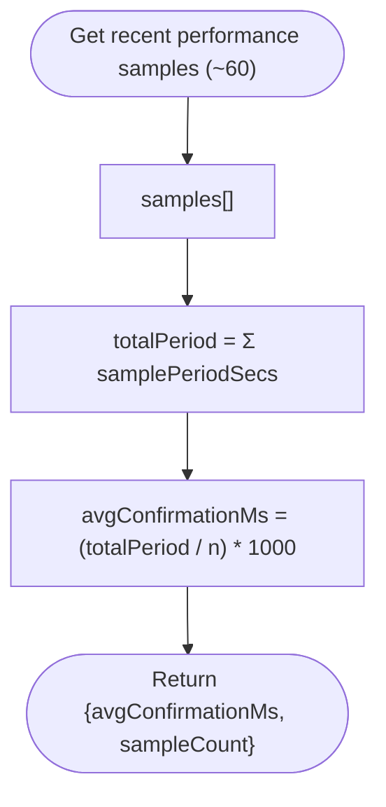
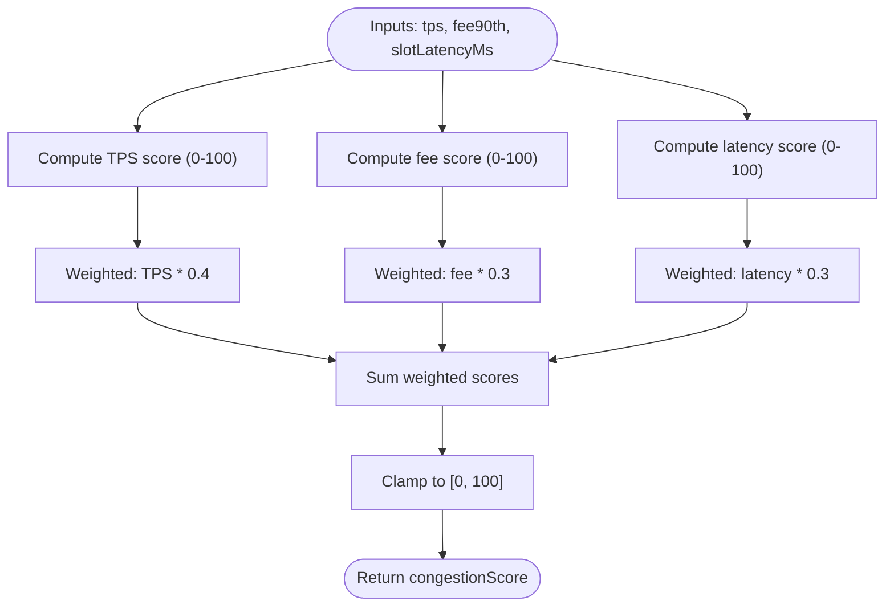
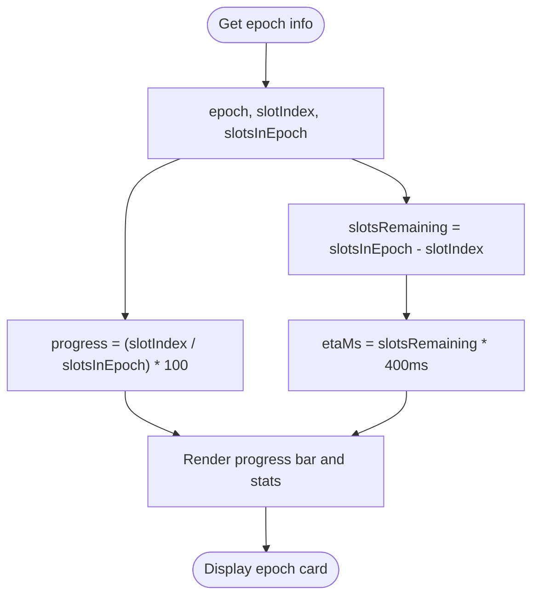
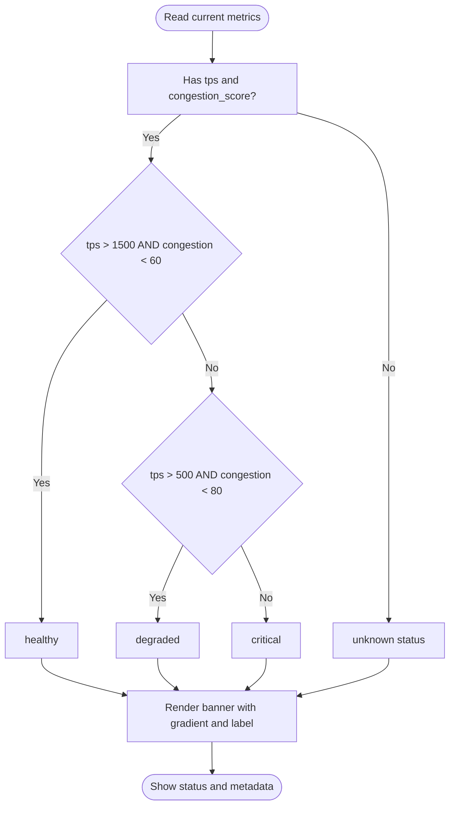
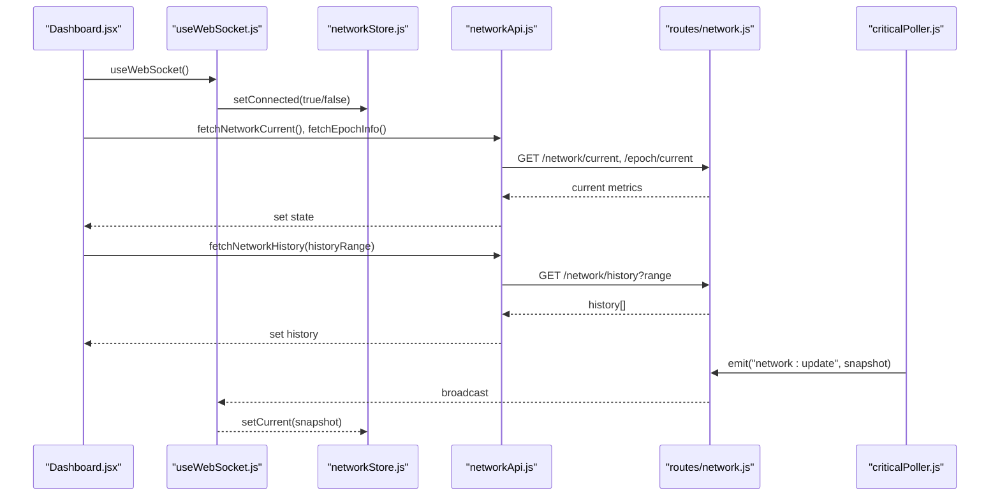
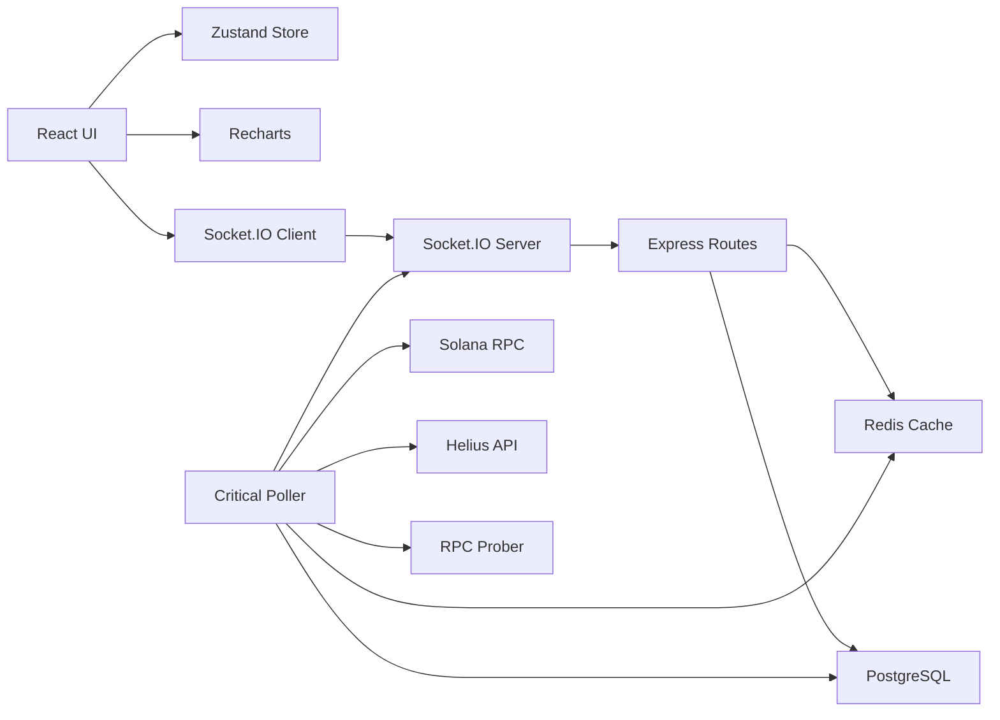

# Network Health Dashboard

<cite>
**Referenced Files in This Document**
- [TpsCard.jsx](file://frontend/src/components/dashboard/TpsCard.jsx)
- [SlotLatencyCard.jsx](file://frontend/src/components/dashboard/SlotLatencyCard.jsx)
- [ConfirmationTimeCard.jsx](file://frontend/src/components/dashboard/ConfirmationTimeCard.jsx)
- [CongestionScoreCard.jsx](file://frontend/src/components/dashboard/CongestionScoreCard.jsx)
- [EpochProgressCard.jsx](file://frontend/src/components/dashboard/EpochProgressCard.jsx)
- [TpsHistoryChart.jsx](file://frontend/src/components/dashboard/TpsHistoryChart.jsx)
- [NetworkStatusBanner.jsx](file://frontend/src/components/dashboard/NetworkStatusBanner.jsx)
- [networkStore.js](file://frontend/src/stores/networkStore.js)
- [useWebSocket.js](file://frontend/src/hooks/useWebSocket.js)
- [networkApi.js](file://frontend/src/services/networkApi.js)
- [Dashboard.jsx](file://frontend/src/pages/Dashboard.jsx)
- [index.js](file://backend/src/websocket/index.js)
- [network.js](file://backend/src/routes/network.js)
- [solanaRpc.js](file://backend/src/services/solanaRpc.js)
- [criticalPoller.js](file://backend/src/jobs/criticalPoller.js)
- [helius.js](file://backend/src/services/helius.js)
- [rpcProber.js](file://backend/src/services/rpcProber.js)
- [queries.js](file://backend/src/models/queries.js)
- [cacheKeys.js](file://backend/src/models/cacheKeys.js)
</cite>

## Table of Contents
1. [Introduction](#introduction)
2. [Project Structure](#project-structure)
3. [Core Components](#core-components)
4. [Architecture Overview](#architecture-overview)
5. [Detailed Component Analysis](#detailed-component-analysis)
6. [Dependency Analysis](#dependency-analysis)
7. [Performance Considerations](#performance-considerations)
8. [Troubleshooting Guide](#troubleshooting-guide)
9. [Conclusion](#conclusion)

## Introduction
This document explains the Network Health Dashboard feature that monitors Solana network health in real time. It covers:
- Real-time TPS metrics and a TPS history chart with configurable ranges
- Slot latency tracking and epoch progress visualization
- Average confirmation time display
- Congestion score derived from TPS, fee market dynamics, and latency
- Network status banner with overall health indicators and alert conditions
- Implementation details for data fetching, state management, and real-time updates via WebSocket

## Project Structure
The dashboard spans a React frontend and a Node.js backend:
- Frontend: React components, Zustand store, WebSocket hook, and API service
- Backend: Express routes, WebSocket server, cron-based data collector, Solana RPC integrations, and persistence

**Diagram sources**
- [Dashboard.jsx:19-83](file://frontend/src/pages/Dashboard.jsx#L19-L83)
- [networkStore.js:1-25](file://frontend/src/stores/networkStore.js#L1-L25)
- [useWebSocket.js:1-30](file://frontend/src/hooks/useWebSocket.js#L1-L30)
- [networkApi.js:1-6](file://frontend/src/services/networkApi.js#L1-L6)
- [network.js:1-135](file://backend/src/routes/network.js#L1-L135)
- [index.js:1-81](file://backend/src/websocket/index.js#L1-L81)
- [criticalPoller.js:1-108](file://backend/src/jobs/criticalPoller.js#L1-L108)
- [solanaRpc.js:1-340](file://backend/src/services/solanaRpc.js#L1-L340)
- [helius.js:1-188](file://backend/src/services/helius.js#L1-L188)
- [rpcProber.js:1-342](file://backend/src/services/rpcProber.js#L1-L342)
- [queries.js:1-459](file://backend/src/models/queries.js#L1-L459)
- [cacheKeys.js:1-50](file://backend/src/models/cacheKeys.js#L1-L50)

**Section sources**
- [Dashboard.jsx:19-83](file://frontend/src/pages/Dashboard.jsx#L19-L83)
- [networkStore.js:1-25](file://frontend/src/stores/networkStore.js#L1-L25)
- [useWebSocket.js:1-30](file://frontend/src/hooks/useWebSocket.js#L1-L30)
- [networkApi.js:1-6](file://frontend/src/services/networkApi.js#L1-L6)
- [network.js:1-135](file://backend/src/routes/network.js#L1-L135)
- [index.js:1-81](file://backend/src/websocket/index.js#L1-L81)
- [criticalPoller.js:1-108](file://backend/src/jobs/criticalPoller.js#L1-L108)
- [solanaRpc.js:1-340](file://backend/src/services/solanaRpc.js#L1-L340)
- [helius.js:1-188](file://backend/src/services/helius.js#L1-L188)
- [rpcProber.js:1-342](file://backend/src/services/rpcProber.js#L1-L342)
- [queries.js:1-459](file://backend/src/models/queries.js#L1-L459)
- [cacheKeys.js:1-50](file://backend/src/models/cacheKeys.js#L1-L50)

## Core Components
- NetworkStatusBanner: Displays overall health with gradient styling and live metrics
- TpsCard: Shows current TPS with a small area chart and status thresholds
- SlotLatencyCard: Displays slot latency with health thresholds
- ConfirmationTimeCard: Shows average confirmation time with status thresholds
- CongestionScoreCard: Renders a semi-circular gauge for congestion score
- EpochProgressCard: Visualizes epoch progress with ETA and slot metrics
- TpsHistoryChart: Renders TPS history with selectable time ranges and tooltips
- networkStore: Centralized state for current metrics, history, epoch info, and history range
- useWebSocket: Establishes a persistent WebSocket connection and updates state on events
- networkApi: Fetches current metrics, history, and epoch info from backend
- Backend routes: Serve current and historical data with cache-first strategy
- Data collection: Cron job aggregates metrics from Solana RPC, Helius, and RPC probes

**Section sources**
- [NetworkStatusBanner.jsx:1-101](file://frontend/src/components/dashboard/NetworkStatusBanner.jsx#L1-L101)
- [TpsCard.jsx:1-57](file://frontend/src/components/dashboard/TpsCard.jsx#L1-L57)
- [SlotLatencyCard.jsx:1-29](file://frontend/src/components/dashboard/SlotLatencyCard.jsx#L1-L29)
- [ConfirmationTimeCard.jsx:1-29](file://frontend/src/components/dashboard/ConfirmationTimeCard.jsx#L1-L29)
- [CongestionScoreCard.jsx:1-96](file://frontend/src/components/dashboard/CongestionScoreCard.jsx#L1-L96)
- [EpochProgressCard.jsx:1-74](file://frontend/src/components/dashboard/EpochProgressCard.jsx#L1-L74)
- [TpsHistoryChart.jsx:1-139](file://frontend/src/components/dashboard/TpsHistoryChart.jsx#L1-L139)
- [networkStore.js:1-25](file://frontend/src/stores/networkStore.js#L1-L25)
- [useWebSocket.js:1-30](file://frontend/src/hooks/useWebSocket.js#L1-L30)
- [networkApi.js:1-6](file://frontend/src/services/networkApi.js#L1-L6)
- [network.js:1-135](file://backend/src/routes/network.js#L1-L135)
- [criticalPoller.js:1-108](file://backend/src/jobs/criticalPoller.js#L1-L108)

## Architecture Overview
The system follows a real-time, cache-backed architecture:
- Frontend polls initial data and subscribes to live updates via WebSocket
- Backend collects metrics every 30 seconds, caches them, and broadcasts updates
- Routes serve current and historical data with Redis cache-first strategy
- PostgreSQL persists snapshots and health checks

**Diagram sources**
- [useWebSocket.js:5-29](file://frontend/src/hooks/useWebSocket.js#L5-L29)
- [index.js:13-52](file://backend/src/websocket/index.js#L13-L52)
- [network.js:17-79](file://backend/src/routes/network.js#L17-L79)
- [criticalPoller.js:21-100](file://backend/src/jobs/criticalPoller.js#L21-L100)
- [solanaRpc.js:275-328](file://backend/src/services/solanaRpc.js#L275-L328)
- [helius.js:13-70](file://backend/src/services/helius.js#L13-L70)
- [rpcProber.js:140-180](file://backend/src/services/rpcProber.js#L140-L180)
- [queries.js:27-48](file://backend/src/models/queries.js#L27-L48)
- [cacheKeys.js:8-40](file://backend/src/models/cacheKeys.js#L8-L40)

## Detailed Component Analysis

### Real-Time TPS Monitoring and Historical Trends
- TPS Card
  - Reads current TPS and renders a small area chart of recent history
  - Status thresholds: healthy (≥2000), degraded (≥1000), critical (<1000)
  - Sparkline uses the last 30 history points
- TPS History Chart
  - Full-width chart with configurable ranges: 1H, 24H, 7D
  - Custom tooltip displays formatted timestamp and TPS
  - X-axis tick formatting varies by range
  - Gradient fill and responsive container
- Data Flow
  - Initial load fetches current metrics and epoch info
  - History fetches on range change
  - WebSocket receives periodic updates and updates current state

**Diagram sources**
- [TpsCard.jsx:14-56](file://frontend/src/components/dashboard/TpsCard.jsx#L14-L56)
- [TpsHistoryChart.jsx:34-139](file://frontend/src/components/dashboard/TpsHistoryChart.jsx#L34-L139)
- [networkApi.js:4-5](file://frontend/src/services/networkApi.js#L4-L5)
- [network.js:85-132](file://backend/src/routes/network.js#L85-L132)
- [cacheKeys.js:40](file://backend/src/models/cacheKeys.js#L40)
- [queries.js:69-84](file://backend/src/models/queries.js#L69-L84)

**Section sources**
- [TpsCard.jsx:7-12](file://frontend/src/components/dashboard/TpsCard.jsx#L7-L12)
- [TpsCard.jsx:14-56](file://frontend/src/components/dashboard/TpsCard.jsx#L14-L56)
- [TpsHistoryChart.jsx:6-10](file://frontend/src/components/dashboard/TpsHistoryChart.jsx#L6-L10)
- [TpsHistoryChart.jsx:34-84](file://frontend/src/components/dashboard/TpsHistoryChart.jsx#L34-L84)
- [TpsHistoryChart.jsx:12-32](file://frontend/src/components/dashboard/TpsHistoryChart.jsx#L12-L32)
- [networkApi.js:4-5](file://frontend/src/services/networkApi.js#L4-L5)
- [network.js:85-132](file://backend/src/routes/network.js#L85-L132)
- [queries.js:69-84](file://backend/src/models/queries.js#L69-L84)

### Slot Latency Tracking
- Displays estimated slot latency in milliseconds
- Status thresholds: healthy (<500ms), degraded (<800ms), critical otherwise
- Derived from Solana slot sampling and comparison to target rate

**Diagram sources**
- [solanaRpc.js:74-118](file://backend/src/services/solanaRpc.js#L74-L118)

**Section sources**
- [SlotLatencyCard.jsx:5-10](file://frontend/src/components/dashboard/SlotLatencyCard.jsx#L5-L10)
- [SlotLatencyCard.jsx:12-28](file://frontend/src/components/dashboard/SlotLatencyCard.jsx#L12-L28)
- [solanaRpc.js:74-118](file://backend/src/services/solanaRpc.js#L74-L118)

### Confirmation Time Card
- Shows average transaction settlement duration in milliseconds
- Status thresholds: healthy (<2000ms), degraded (<5000ms), critical otherwise
- Computed from recent performance samples

**Diagram sources**
- [solanaRpc.js:189-218](file://backend/src/services/solanaRpc.js#L189-L218)

**Section sources**
- [ConfirmationTimeCard.jsx:13-18](file://frontend/src/components/dashboard/ConfirmationTimeCard.jsx#L13-L18)
- [ConfirmationTimeCard.jsx:5-28](file://frontend/src/components/dashboard/ConfirmationTimeCard.jsx#L5-L28)
- [solanaRpc.js:189-218](file://backend/src/services/solanaRpc.js#L189-L218)

### Congestion Score Calculation
- Composite score (0–100) combining:
  - TPS component (40%): degrades as TPS decreases below threshold
  - Fee market component (30%): based on 90th percentile priority fee (log-scaled)
  - Slot latency component (30%): increases with increased latency
- Enhanced when Helius priority fee data is available

**Diagram sources**
- [solanaRpc.js:228-268](file://backend/src/services/solanaRpc.js#L228-L268)
- [helius.js:13-70](file://backend/src/services/helius.js#L13-L70)

**Section sources**
- [CongestionScoreCard.jsx:4-9](file://frontend/src/components/dashboard/CongestionScoreCard.jsx#L4-L9)
- [CongestionScoreCard.jsx:11-15](file://frontend/src/components/dashboard/CongestionScoreCard.jsx#L11-L15)
- [CongestionScoreCard.jsx:17-95](file://frontend/src/components/dashboard/CongestionScoreCard.jsx#L17-L95)
- [solanaRpc.js:228-268](file://backend/src/services/solanaRpc.js#L228-L268)
- [helius.js:13-70](file://backend/src/services/helius.js#L13-L70)

### Epoch Progress Visualization
- Displays current epoch number, ETA, and progress percentage
- Shows slot index, slots per epoch, and remaining slots
- Uses formatted epoch ETA and progress bar

**Diagram sources**
- [solanaRpc.js:124-156](file://backend/src/services/solanaRpc.js#L124-L156)
- [EpochProgressCard.jsx:5-73](file://frontend/src/components/dashboard/EpochProgressCard.jsx#L5-L73)

**Section sources**
- [EpochProgressCard.jsx:5-73](file://frontend/src/components/dashboard/EpochProgressCard.jsx#L5-L73)
- [solanaRpc.js:124-156](file://backend/src/services/solanaRpc.js#L124-L156)

### Network Status Banner
- Aggregates TPS and congestion score to derive overall health
- Healthy: TPS > 1500 and congestion < 60
- Degraded: TPS > 500 and congestion < 80
- Critical: otherwise
- Includes animated glow and contextual metadata

**Diagram sources**
- [NetworkStatusBanner.jsx:4-31](file://frontend/src/components/dashboard/NetworkStatusBanner.jsx#L4-L31)
- [NetworkStatusBanner.jsx:33-100](file://frontend/src/components/dashboard/NetworkStatusBanner.jsx#L33-L100)

**Section sources**
- [NetworkStatusBanner.jsx:4-31](file://frontend/src/components/dashboard/NetworkStatusBanner.jsx#L4-L31)
- [NetworkStatusBanner.jsx:33-100](file://frontend/src/components/dashboard/NetworkStatusBanner.jsx#L33-L100)

### Data Fetching, State Management, and Real-Time Updates
- Dashboard initializes WebSocket, fetches initial data, and sets up history range listeners
- networkStore holds current metrics, history, epochInfo, connection state, and selected history range
- useWebSocket connects to the backend and listens for network updates
- networkApi wraps REST endpoints for current metrics, history, and epoch info
- Backend routes implement cache-first retrieval and graceful fallbacks
- criticalPoller runs every 30 seconds, collects metrics, writes to DB, updates cache, and emits WebSocket events

**Diagram sources**
- [Dashboard.jsx:19-83](file://frontend/src/pages/Dashboard.jsx#L19-L83)
- [useWebSocket.js:5-29](file://frontend/src/hooks/useWebSocket.js#L5-L29)
- [networkStore.js:3-22](file://frontend/src/stores/networkStore.js#L3-L22)
- [networkApi.js:3-5](file://frontend/src/services/networkApi.js#L3-L5)
- [network.js:17-79](file://backend/src/routes/network.js#L17-L79)
- [criticalPoller.js:88-92](file://backend/src/jobs/criticalPoller.js#L88-L92)

**Section sources**
- [Dashboard.jsx:19-83](file://frontend/src/pages/Dashboard.jsx#L19-L83)
- [networkStore.js:3-22](file://frontend/src/stores/networkStore.js#L3-L22)
- [useWebSocket.js:5-29](file://frontend/src/hooks/useWebSocket.js#L5-L29)
- [networkApi.js:3-5](file://frontend/src/services/networkApi.js#L3-L5)
- [network.js:17-79](file://backend/src/routes/network.js#L17-L79)
- [criticalPoller.js:88-92](file://backend/src/jobs/criticalPoller.js#L88-L92)

## Dependency Analysis
- Frontend depends on Zustand for state, Recharts for charts, and Socket.IO for real-time updates
- Backend depends on Express for routes, node-cron for scheduling, Redis for caching, and PostgreSQL for persistence
- Data collection integrates Solana RPC, Helius for fee estimates, and multiple RPC providers for health checks

**Diagram sources**
- [Dashboard.jsx:19-83](file://frontend/src/pages/Dashboard.jsx#L19-L83)
- [networkStore.js:1-25](file://frontend/src/stores/networkStore.js#L1-L25)
- [useWebSocket.js:1-30](file://frontend/src/hooks/useWebSocket.js#L1-L30)
- [network.js:1-135](file://backend/src/routes/network.js#L1-L135)
- [index.js:1-81](file://backend/src/websocket/index.js#L1-L81)
- [criticalPoller.js:1-108](file://backend/src/jobs/criticalPoller.js#L1-L108)
- [solanaRpc.js:1-340](file://backend/src/services/solanaRpc.js#L1-L340)
- [helius.js:1-188](file://backend/src/services/helius.js#L1-L188)
- [rpcProber.js:1-342](file://backend/src/services/rpcProber.js#L1-L342)
- [queries.js:1-459](file://backend/src/models/queries.js#L1-L459)
- [cacheKeys.js:1-50](file://backend/src/models/cacheKeys.js#L1-L50)

**Section sources**
- [Dashboard.jsx:19-83](file://frontend/src/pages/Dashboard.jsx#L19-L83)
- [network.js:1-135](file://backend/src/routes/network.js#L1-L135)
- [criticalPoller.js:1-108](file://backend/src/jobs/criticalPoller.js#L1-L108)
- [queries.js:1-459](file://backend/src/models/queries.js#L1-L459)
- [cacheKeys.js:1-50](file://backend/src/models/cacheKeys.js#L1-L50)

## Performance Considerations
- Real-time cadence: Backend collects and emits updates every 30 seconds
- Caching: Redis cache-first strategy reduces DB load and improves latency
- Charting: Recharts renders efficiently with preformatted data arrays
- Thresholds: Status thresholds are tuned to highlight meaningful degradation points
- Graceful degradation: Routes and poller handle failures without crashing

## Troubleshooting Guide
- WebSocket disconnections
  - Verify backend Socket.IO setup and connectivity
  - Check frontend connection lifecycle and reconnection attempts
- Empty or stale charts
  - Confirm history range selection and route parameter validation
  - Ensure cache keys and TTLs are configured correctly
- Missing congestion score
  - Confirm Helius API key and endpoint configuration
  - Validate that priority fee data is returned and parsed
- Slow initial load
  - Check Redis availability and cache population
  - Review DB query performance for latest snapshot and history retrieval

**Section sources**
- [index.js:13-52](file://backend/src/websocket/index.js#L13-L52)
- [useWebSocket.js:8-28](file://frontend/src/hooks/useWebSocket.js#L8-L28)
- [network.js:89-96](file://backend/src/routes/network.js#L89-L96)
- [cacheKeys.js:8-48](file://backend/src/models/cacheKeys.js#L8-L48)
- [helius.js:14-18](file://backend/src/services/helius.js#L14-L18)
- [queries.js:54-62](file://backend/src/models/queries.js#L54-L62)
- [queries.js:69-84](file://backend/src/models/queries.js#L69-L84)

## Conclusion
The Network Health Dashboard provides a comprehensive, real-time view of Solana network conditions. It combines current metrics, historical trends, and epoch progress to inform operators and users. The implementation balances reliability with responsiveness through caching, scheduled collection, and efficient front-end rendering.