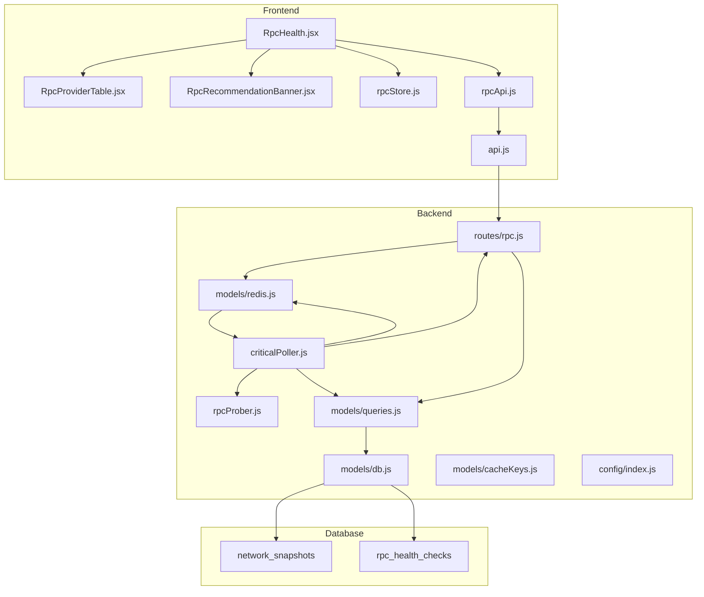
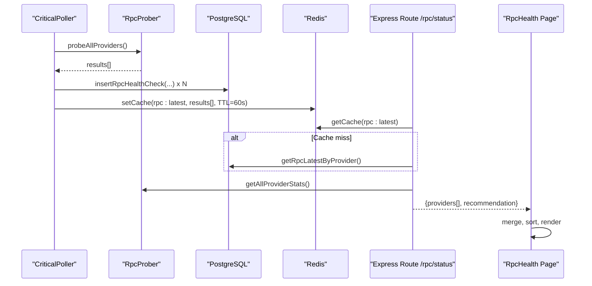
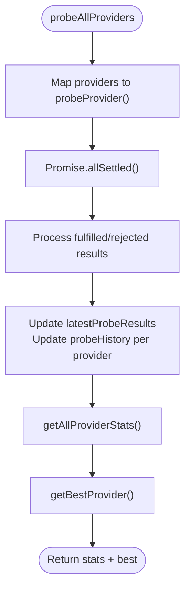
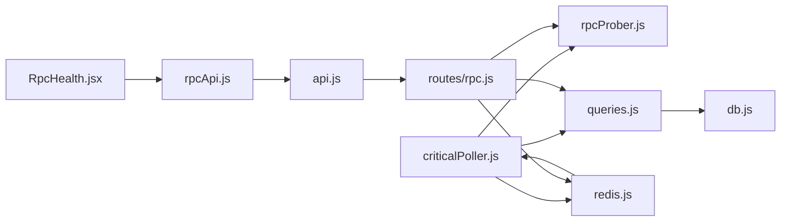
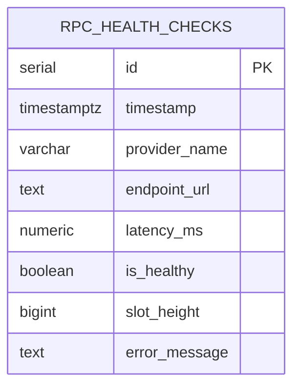

# RPC Provider Monitoring

<cite>
**Referenced Files in This Document**
- [RpcProviderTable.jsx](file://frontend/src/components/rpc/RpcProviderTable.jsx)
- [RpcRecommendationBanner.jsx](file://frontend/src/components/rpc/RpcRecommendationBanner.jsx)
- [RpcHealth.jsx](file://frontend/src/pages/RpcHealth.jsx)
- [rpcStore.js](file://frontend/src/stores/rpcStore.js)
- [rpcApi.js](file://frontend/src/services/rpcApi.js)
- [api.js](file://frontend/src/services/api.js)
- [rpc.js](file://backend/src/routes/rpc.js)
- [rpcProber.js](file://backend/src/services/rpcProber.js)
- [criticalPoller.js](file://backend/src/jobs/criticalPoller.js)
- [queries.js](file://backend/src/models/queries.js)
- [db.js](file://backend/src/models/db.js)
- [redis.js](file://backend/src/models/redis.js)
- [cacheKeys.js](file://backend/src/models/cacheKeys.js)
- [migrate.js](file://backend/src/models/migrate.js)
- [index.js](file://backend/src/config/index.js)
</cite>

## Table of Contents
1. [Introduction](#introduction)
2. [Project Structure](#project-structure)
3. [Core Components](#core-components)
4. [Architecture Overview](#architecture-overview)
5. [Detailed Component Analysis](#detailed-component-analysis)
6. [Dependency Analysis](#dependency-analysis)
7. [Performance Considerations](#performance-considerations)
8. [Troubleshooting Guide](#troubleshooting-guide)
9. [Conclusion](#conclusion)
10. [Appendices](#appendices)

## Introduction
This document explains the RPC Provider Monitoring functionality in InfraWatch. It covers the backend health-checking system, the rolling statistics pipeline, the frontend presentation components, and the end-to-end data flow from backend polling to frontend display. It also documents provider categorization, recommendation logic, and selection criteria for different operational needs.

## Project Structure
The RPC monitoring spans frontend React components and backend services:
- Frontend: page, store, and UI components for displaying provider health and recommendations
- Backend: periodic poller, RPC prober, data access layer, and HTTP routes
- Data storage: PostgreSQL tables for historical health checks and Redis cache for fast retrieval

**Diagram sources**
- [RpcHealth.jsx:1-153](file://frontend/src/pages/RpcHealth.jsx#L1-L153)
- [RpcProviderTable.jsx:1-177](file://frontend/src/components/rpc/RpcProviderTable.jsx#L1-L177)
- [RpcRecommendationBanner.jsx:1-63](file://frontend/src/components/rpc/RpcRecommendationBanner.jsx#L1-L63)
- [rpcStore.js:1-16](file://frontend/src/stores/rpcStore.js#L1-L16)
- [rpcApi.js:1-7](file://frontend/src/services/rpcApi.js#L1-L7)
- [api.js:1-43](file://frontend/src/services/api.js#L1-L43)
- [criticalPoller.js:1-108](file://backend/src/jobs/criticalPoller.js#L1-L108)
- [rpcProber.js:1-342](file://backend/src/services/rpcProber.js#L1-L342)
- [rpc.js:1-135](file://backend/src/routes/rpc.js#L1-L135)
- [queries.js:1-459](file://backend/src/models/queries.js#L1-L459)
- [db.js:1-98](file://backend/src/models/db.js#L1-L98)
- [redis.js:1-161](file://backend/src/models/redis.js#L1-L161)
- [cacheKeys.js:1-50](file://backend/src/models/cacheKeys.js#L1-L50)
- [migrate.js:1-160](file://backend/src/models/migrate.js#L1-L160)
- [index.js:1-68](file://backend/src/config/index.js#L1-L68)

**Section sources**
- [RpcHealth.jsx:1-153](file://frontend/src/pages/RpcHealth.jsx#L1-L153)
- [rpc.js:1-135](file://backend/src/routes/rpc.js#L1-L135)
- [criticalPoller.js:1-108](file://backend/src/jobs/criticalPoller.js#L1-L108)
- [rpcProber.js:1-342](file://backend/src/services/rpcProber.js#L1-L342)
- [queries.js:1-459](file://backend/src/models/queries.js#L1-L459)
- [migrate.js:1-160](file://backend/src/models/migrate.js#L1-L160)

## Core Components
- Backend RPC Prober: probes configured endpoints, measures latency, records health, and computes rolling statistics
- Critical Poller: runs every 30 seconds to probe providers, persist to DB, cache in Redis, and emit updates
- HTTP Route: serves latest provider status enriched with rolling stats and a recommendation
- Frontend Page: loads data periodically, sorts providers, and renders the recommendation banner and provider table
- Store and Services: manage state and API communication

Key metrics exposed:
- Current latency (milliseconds)
- Rolling percentiles: p50, p95, p99
- Uptime percentage
- Last incident timestamp
- Provider category (Premium/Public)
- Recommendation: best healthy provider by p95 latency

**Section sources**
- [rpcProber.js:1-342](file://backend/src/services/rpcProber.js#L1-L342)
- [criticalPoller.js:1-108](file://backend/src/jobs/criticalPoller.js#L1-L108)
- [rpc.js:1-135](file://backend/src/routes/rpc.js#L1-L135)
- [RpcHealth.jsx:1-153](file://frontend/src/pages/RpcHealth.jsx#L1-L153)
- [RpcProviderTable.jsx:1-177](file://frontend/src/components/rpc/RpcProviderTable.jsx#L1-L177)
- [RpcRecommendationBanner.jsx:1-63](file://frontend/src/components/rpc/RpcRecommendationBanner.jsx#L1-L63)

## Architecture Overview
The system operates on a continuous polling cycle:
- Every 30 seconds, the Critical Poller probes all RPC providers
- Results are persisted to PostgreSQL and cached in Redis
- The HTTP route aggregates latest DB rows with rolling stats from the prober and returns a consolidated payload
- The frontend page fetches this payload, displays it, and refreshes automatically

**Diagram sources**
- [criticalPoller.js:1-108](file://backend/src/jobs/criticalPoller.js#L1-L108)
- [rpcProber.js:1-342](file://backend/src/services/rpcProber.js#L1-L342)
- [queries.js:1-459](file://backend/src/models/queries.js#L1-L459)
- [redis.js:1-161](file://backend/src/models/redis.js#L1-L161)
- [rpc.js:1-135](file://backend/src/routes/rpc.js#L1-L135)
- [RpcHealth.jsx:1-153](file://frontend/src/pages/RpcHealth.jsx#L1-L153)

## Detailed Component Analysis

### Backend RPC Prober
Responsibilities:
- Define provider list with categories and optional keys
- Probe each provider via a lightweight JSON-RPC call
- Record latency, health, and slot height
- Maintain in-memory history per provider and compute rolling statistics (percentiles, uptime, last incident)
- Provide best provider recommendation among healthy providers

Implementation highlights:
- Concurrent probing with Promise.allSettled
- Rolling window statistics with configurable history size
- Percentile calculation via linear interpolation
- Best provider selection prioritizes low p95 latency among providers with high uptime

**Diagram sources**
- [rpcProber.js:140-180](file://backend/src/services/rpcProber.js#L140-L180)
- [rpcProber.js:256-272](file://backend/src/services/rpcProber.js#L256-L272)
- [rpcProber.js:295-307](file://backend/src/services/rpcProber.js#L295-L307)

**Section sources**
- [rpcProber.js:1-342](file://backend/src/services/rpcProber.js#L1-L342)

### Critical Poller (30s heartbeat)
Responsibilities:
- Periodically probe RPC providers
- Persist network snapshots and RPC health checks
- Update Redis cache for fast retrieval
- Broadcast updates via WebSocket (when available)

Operational characteristics:
- Graceful degradation: continues if DB or Redis unavailable
- Concurrency: probes all providers in parallel
- Caching: caches latest RPC results under a short TTL

**Section sources**
- [criticalPoller.js:1-108](file://backend/src/jobs/criticalPoller.js#L1-L108)

### HTTP Route: /api/rpc/status
Responsibilities:
- Serve latest provider status to the frontend
- Merge cached/latest DB rows with rolling stats
- Compute recommendation from best healthy provider

Data shaping:
- Transforms DB rows to match frontend expectations
- Enriches with p50/p95/p99, uptime%, last incident, category, and flags
- Returns a single recommendation with provider name and latency

**Section sources**
- [rpc.js:17-88](file://backend/src/routes/rpc.js#L17-L88)

### Frontend: RpcHealth Page
Responsibilities:
- Load data every 30 seconds
- Manage sorting state and apply sort to providers
- Render recommendation banner and provider table
- Handle loading skeletons and error states

Behavior:
- Sorting by latency, provider name, or uptime
- Recommendation banner shows fastest healthy provider and a suggested threshold

**Section sources**
- [RpcHealth.jsx:1-153](file://frontend/src/pages/RpcHealth.jsx#L1-L153)

### Frontend: RpcProviderTable
Responsibilities:
- Display provider health, latency, percentiles, uptime, and last incident
- Color-code latency and uptime indicators
- Show provider category badge (Premium/Public)
- Support column sorting

**Section sources**
- [RpcProviderTable.jsx:1-177](file://frontend/src/components/rpc/RpcProviderTable.jsx#L1-L177)

### Frontend: RpcRecommendationBanner
Responsibilities:
- Show the recommended provider and its p95 latency
- Provide a human-friendly threshold suggestion for sub-X ms targets

**Section sources**
- [RpcRecommendationBanner.jsx:1-63](file://frontend/src/components/rpc/RpcRecommendationBanner.jsx#L1-L63)

### Frontend: Store and Services
Responsibilities:
- zustand store holds providers, recommendation, loading, and error states
- rpcApi wraps base API client to fetch status and history
- api client sets base URL and timeout, logs errors

**Section sources**
- [rpcStore.js:1-16](file://frontend/src/stores/rpcStore.js#L1-L16)
- [rpcApi.js:1-7](file://frontend/src/services/rpcApi.js#L1-L7)
- [api.js:1-43](file://frontend/src/services/api.js#L1-L43)

## Dependency Analysis
The system exhibits clear separation of concerns:
- Backend: jobs own orchestration, services own domain logic, models own persistence and cache
- Frontend: pages own lifecycle, components own rendering, stores own state, services own API

**Diagram sources**
- [criticalPoller.js:1-108](file://backend/src/jobs/criticalPoller.js#L1-L108)
- [rpcProber.js:1-342](file://backend/src/services/rpcProber.js#L1-L342)
- [rpc.js:1-135](file://backend/src/routes/rpc.js#L1-L135)
- [queries.js:1-459](file://backend/src/models/queries.js#L1-L459)
- [redis.js:1-161](file://backend/src/models/redis.js#L1-L161)
- [db.js:1-98](file://backend/src/models/db.js#L1-L98)
- [RpcHealth.jsx:1-153](file://frontend/src/pages/RpcHealth.jsx#L1-L153)
- [rpcApi.js:1-7](file://frontend/src/services/rpcApi.js#L1-L7)
- [api.js:1-43](file://frontend/src/services/api.js#L1-L43)

**Section sources**
- [rpc.js:1-135](file://backend/src/routes/rpc.js#L1-L135)
- [rpcProber.js:1-342](file://backend/src/services/rpcProber.js#L1-L342)
- [queries.js:1-459](file://backend/src/models/queries.js#L1-L459)
- [redis.js:1-161](file://backend/src/models/redis.js#L1-L161)
- [db.js:1-98](file://backend/src/models/db.js#L1-L98)
- [RpcHealth.jsx:1-153](file://frontend/src/pages/RpcHealth.jsx#L1-L153)
- [rpcApi.js:1-7](file://frontend/src/services/rpcApi.js#L1-L7)
- [api.js:1-43](file://frontend/src/services/api.js#L1-L43)

## Performance Considerations
- Polling cadence: 30 seconds strikes a balance between freshness and cost
- Concurrency: backend probes all providers in parallel to minimize tail latency
- Caching: Redis short TTL ensures fresh data while reducing DB load
- Frontend refresh: 30-second polling avoids excessive requests and keeps UI responsive
- Sorting: client-side sort on small arrays (< 10 providers) is efficient

Recommendations:
- Scale Redis and DB according to provider count and traffic
- Consider adaptive polling intervals based on change volatility
- Add circuit-breaker behavior for failing providers to reduce wasted probes
- Use pagination or virtualization for very large provider lists

[No sources needed since this section provides general guidance]

## Troubleshooting Guide
Common issues and diagnostics:
- Empty or stale data
  - Verify backend Critical Poller is running and not logging errors
  - Confirm Redis connectivity and that cache keys are being set
  - Check DB connectivity and that rpc_health_checks table is being populated
- High latency or frequent outages
  - Inspect rolling stats in the table; focus on p95/p99 and uptime%
  - Review recommendation banner for the fastest healthy provider
- API errors in frontend
  - Check browser network tab for 5xx/timeout responses
  - Review response interceptors for logged errors
- Provider configuration
  - Ensure required environment variables are set for premium providers
  - Confirm endpoint URLs are reachable from backend host

Operational checks:
- Backend logs show “Tick complete” messages and any “DB insert failed” or “Redis cache update failed” warnings
- Frontend shows loading skeleton initially, then error panel with retry button on failures
- Recommendation banner appears only when a best provider is available

**Section sources**
- [criticalPoller.js:95-100](file://backend/src/jobs/criticalPoller.js#L95-L100)
- [rpc.js:20-45](file://backend/src/routes/rpc.js#L20-L45)
- [api.js:23-40](file://frontend/src/services/api.js#L23-L40)
- [RpcHealth.jsx:79-114](file://frontend/src/pages/RpcHealth.jsx#L79-L114)

## Conclusion
InfraWatch’s RPC Provider Monitoring combines a robust backend prober with rolling statistics, persistent storage, and a fast Redis cache. The frontend presents health metrics, percentiles, uptime, and a recommendation banner to guide users toward the fastest healthy provider. The system is designed for resilience, with graceful fallbacks and clear separation of concerns across layers.

[No sources needed since this section summarizes without analyzing specific files]

## Appendices

### Data Model: RPC Health Checks

**Diagram sources**
- [migrate.js:30-43](file://backend/src/models/migrate.js#L30-L43)

**Section sources**
- [queries.js:101-118](file://backend/src/models/queries.js#L101-L118)
- [migrate.js:30-43](file://backend/src/models/migrate.js#L30-L43)

### Provider Selection Criteria
- Read operations: prefer lowest p95 latency; monitor uptime%
- Write operations: prioritize providers with consistently low p99 latency and high uptime
- High-throughput scenarios: choose providers with stable percentiles and minimal incidents
- Premium vs Public: Premium providers often offer lower latency and higher SLAs; Public providers are broadly available

**Section sources**
- [rpcProber.js:295-307](file://backend/src/services/rpcProber.js#L295-L307)
- [RpcProviderTable.jsx:5-14](file://frontend/src/components/rpc/RpcProviderTable.jsx#L5-L14)