# Validator Health Tracking

<cite>
**Referenced Files in This Document**
- [ValidatorTable.jsx](file://frontend/src/components/validators/ValidatorTable.jsx)
- [ValidatorDetailPanel.jsx](file://frontend/src/components/validators/ValidatorDetailPanel.jsx)
- [ValidatorScoreBadge.jsx](file://frontend/src/components/validators/ValidatorScoreBadge.jsx)
- [Validators.jsx](file://frontend/src/pages/Validators.jsx)
- [validatorStore.js](file://frontend/src/stores/validatorStore.js)
- [validatorApi.js](file://frontend/src/services/validatorApi.js)
- [validators.js](file://backend/src/routes/validators.js)
- [validatorsApp.js](file://backend/src/services/validatorsApp.js)
- [queries.js](file://backend/src/models/queries.js)
- [db.js](file://backend/src/models/db.js)
- [migrate.js](file://backend/src/models/migrate.js)
- [routinePoller.js](file://backend/src/jobs/routinePoller.js)
- [criticalPoller.js](file://backend/src/jobs/criticalPoller.js)
- [redis.js](file://backend/src/models/redis.js)
- [cacheKeys.js](file://backend/src/models/cacheKeys.js)
- [index.js](file://backend/src/config/index.js)
</cite>

## Table of Contents
1. [Introduction](#introduction)
2. [Project Structure](#project-structure)
3. [Core Components](#core-components)
4. [Architecture Overview](#architecture-overview)
5. [Detailed Component Analysis](#detailed-component-analysis)
6. [Dependency Analysis](#dependency-analysis)
7. [Performance Considerations](#performance-considerations)
8. [Troubleshooting Guide](#troubleshooting-guide)
9. [Conclusion](#conclusion)

## Introduction
This document describes the Validator Health Tracking system that powers the validators page. It covers the validator table implementation, performance metrics, voting participation rates, commission information, and the validator detail panel. It also documents the validator score badge system, delinquency monitoring, commission change tracking, ranking and sorting, and integration with external validator data sources and real-time updates.

## Project Structure
The system spans a frontend React application and a Node.js/PostgreSQL backend with Redis caching and scheduled jobs.

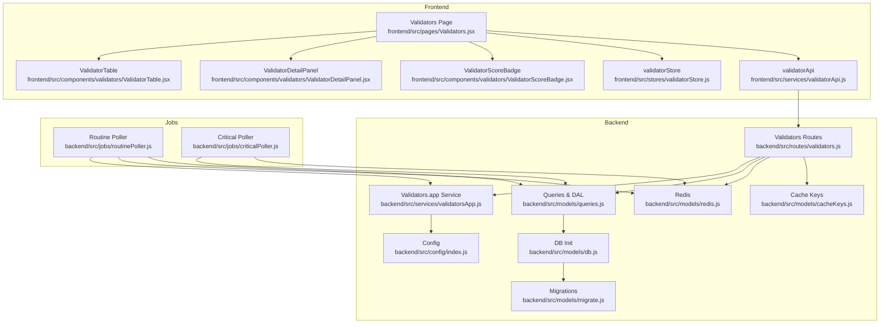

**Diagram sources**
- [Validators.jsx:1-179](file://frontend/src/pages/Validators.jsx#L1-179)
- [ValidatorTable.jsx:1-202](file://frontend/src/components/validators/ValidatorTable.jsx#L1-202)
- [ValidatorDetailPanel.jsx:1-218](file://frontend/src/components/validators/ValidatorDetailPanel.jsx#L1-218)
- [ValidatorScoreBadge.jsx:1-49](file://frontend/src/components/validators/ValidatorScoreBadge.jsx#L1-49)
- [validatorStore.js:1-28](file://frontend/src/stores/validatorStore.js#L1-28)
- [validatorApi.js:1-8](file://frontend/src/services/validatorApi.js#L1-8)
- [validators.js:1-112](file://backend/src/routes/validators.js#L1-112)
- [validatorsApp.js:1-388](file://backend/src/services/validatorsApp.js#L1-388)
- [queries.js:1-459](file://backend/src/models/queries.js#L1-459)
- [db.js:1-98](file://backend/src/models/db.js#L1-98)
- [migrate.js:1-160](file://backend/src/models/migrate.js#L1-160)
- [redis.js:1-161](file://backend/src/models/redis.js#L1-161)
- [cacheKeys.js:1-50](file://backend/src/models/cacheKeys.js#L1-50)
- [index.js:1-68](file://backend/src/config/index.js#L1-68)
- [routinePoller.js:1-116](file://backend/src/jobs/routinePoller.js#L1-116)
- [criticalPoller.js:1-108](file://backend/src/jobs/criticalPoller.js#L1-108)

**Section sources**
- [Validators.jsx:1-179](file://frontend/src/pages/Validators.jsx#L1-179)
- [validatorApi.js:1-8](file://frontend/src/services/validatorApi.js#L1-8)
- [validators.js:1-112](file://backend/src/routes/validators.js#L1-112)
- [validatorsApp.js:1-388](file://backend/src/services/validatorsApp.js#L1-388)
- [queries.js:1-459](file://backend/src/models/queries.js#L1-459)
- [db.js:1-98](file://backend/src/models/db.js#L1-98)
- [migrate.js:1-160](file://backend/src/models/migrate.js#L1-160)
- [redis.js:1-161](file://backend/src/models/redis.js#L1-161)
- [cacheKeys.js:1-50](file://backend/src/models/cacheKeys.js#L1-50)
- [index.js:1-68](file://backend/src/config/index.js#L1-68)
- [routinePoller.js:1-116](file://backend/src/jobs/routinePoller.js#L1-116)
- [criticalPoller.js:1-108](file://backend/src/jobs/criticalPoller.js#L1-108)

## Core Components
- Validator table displays top validators with rank, name, score, stake, commission, skip rate, software version, data center, and delinquency status. Sorting is supported by clicking column headers.
- Validator detail panel shows comprehensive health indicators including performance score, stake, commission, skip rate, software version, data center, Jito status, and delinquency status. It also provides identity and vote pubkeys with copy-to-clipboard support.
- Validator score badge renders a colored, bordered badge representing the validator’s score with thresholds for “Excellent”, “Good”, and “Needs Attention”.
- Frontend store manages validators list, selection, loading state, error state, and sorting preferences.
- Backend routes expose endpoints to fetch top validators and a specific validator detail, with Redis caching and fallback to database.
- Validators.app service normalizes external validator data, enforces rate limits, caches responses, detects commission changes, and exposes helper functions for delinquency and grouping.
- Database schema persists current validator state and historical snapshots, with indexes optimized for score and stake lookups.
- Jobs orchestrate periodic refresh of validator data, detection of commission changes, and alerting.

**Section sources**
- [ValidatorTable.jsx:1-202](file://frontend/src/components/validators/ValidatorTable.jsx#L1-202)
- [ValidatorDetailPanel.jsx:1-218](file://frontend/src/components/validators/ValidatorDetailPanel.jsx#L1-218)
- [ValidatorScoreBadge.jsx:1-49](file://frontend/src/components/validators/ValidatorScoreBadge.jsx#L1-49)
- [Validators.jsx:1-179](file://frontend/src/pages/Validators.jsx#L1-179)
- [validatorStore.js:1-28](file://frontend/src/stores/validatorStore.js#L1-28)
- [validatorApi.js:1-8](file://frontend/src/services/validatorApi.js#L1-8)
- [validators.js:1-112](file://backend/src/routes/validators.js#L1-112)
- [validatorsApp.js:1-388](file://backend/src/services/validatorsApp.js#L1-388)
- [queries.js:159-264](file://backend/src/models/queries.js#L159-264)
- [db.js:1-98](file://backend/src/models/db.js#L1-98)
- [migrate.js:44-78](file://backend/src/models/migrate.js#L44-78)
- [routinePoller.js:1-116](file://backend/src/jobs/routinePoller.js#L1-116)

## Architecture Overview
The system integrates external validator data from Validators.app, normalizes it, and persists it to PostgreSQL. Redis caches frequently accessed lists and details. Scheduled jobs keep data fresh and detect significant changes (e.g., commission adjustments). The frontend fetches data via API, sorts and filters locally, and renders the validator table and detail panels.

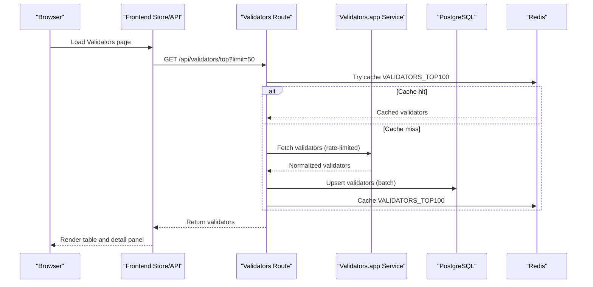

**Diagram sources**
- [Validators.jsx:24-39](file://frontend/src/pages/Validators.jsx#L24-39)
- [validatorApi.js:3-7](file://frontend/src/services/validatorApi.js#L3-7)
- [validators.js:17-46](file://backend/src/routes/validators.js#L17-46)
- [validatorsApp.js:186-209](file://backend/src/services/validatorsApp.js#L186-209)
- [queries.js:180-220](file://backend/src/models/queries.js#L180-220)
- [redis.js:75-112](file://backend/src/models/redis.js#L75-112)

## Detailed Component Analysis

### Validator Table Implementation
The validator table presents:
- Rank: row index + 1
- Name: validator name or truncated identity pubkey
- Score: rendered via ValidatorScoreBadge
- Stake: compact-formatted SOL amount
- Commission: percentage with color-coded thresholds
- Skip Rate: formatted percentage with color-coded thresholds
- Software Version: version string or placeholder
- Data Center: location or placeholder
- Status: delinquency indicator using StatusIndicator

Sorting is handled by clicking column headers, toggling direction when the same field is selected again.

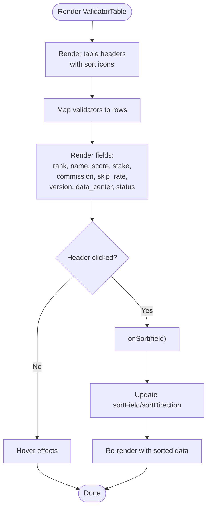

**Diagram sources**
- [ValidatorTable.jsx:35-63](file://frontend/src/components/validators/ValidatorTable.jsx#L35-63)
- [ValidatorTable.jsx:45-51](file://frontend/src/components/validators/ValidatorTable.jsx#L45-51)
- [ValidatorTable.jsx:92-196](file://frontend/src/components/validators/ValidatorTable.jsx#L92-196)

**Section sources**
- [ValidatorTable.jsx:1-202](file://frontend/src/components/validators/ValidatorTable.jsx#L1-202)
- [Validators.jsx:53-88](file://frontend/src/pages/Validators.jsx#L53-88)
- [validatorStore.js:16-23](file://frontend/src/stores/validatorStore.js#L16-23)

### Validator Detail Panel
The detail panel shows:
- Identity avatar/name and vote pubkey with copy action
- Performance Score with progress bar and threshold coloring
- Stake, Commission, Skip Rate with contextual colors
- Software Version with “Up to date” badge
- Data Center and ASN
- Jito MEV status indicator
- Delinquency status with health indicator

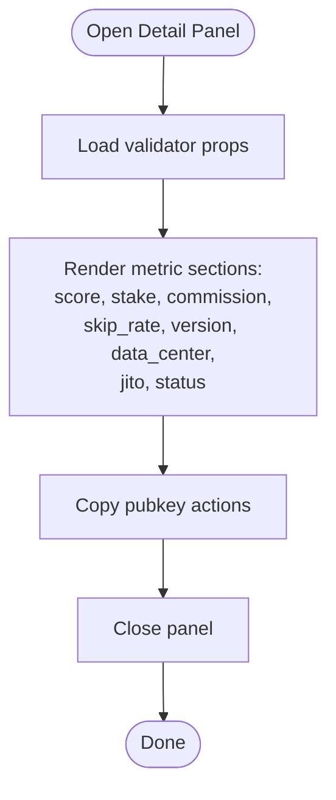

**Diagram sources**
- [ValidatorDetailPanel.jsx:16-62](file://frontend/src/components/validators/ValidatorDetailPanel.jsx#L16-62)
- [ValidatorDetailPanel.jsx:66-190](file://frontend/src/components/validators/ValidatorDetailPanel.jsx#L66-190)
- [ValidatorDetailPanel.jsx:192-213](file://frontend/src/components/validators/ValidatorDetailPanel.jsx#L192-213)

**Section sources**
- [ValidatorDetailPanel.jsx:1-218](file://frontend/src/components/validators/ValidatorDetailPanel.jsx#L1-218)

### Validator Score Badge System
The score badge renders a monospaced, bordered badge with:
- Thresholds: 90+ (green), 70–89 (amber), below 70 (red), missing (gray)
- Rounded score value or placeholder
- Dynamic background, border, and text color based on score

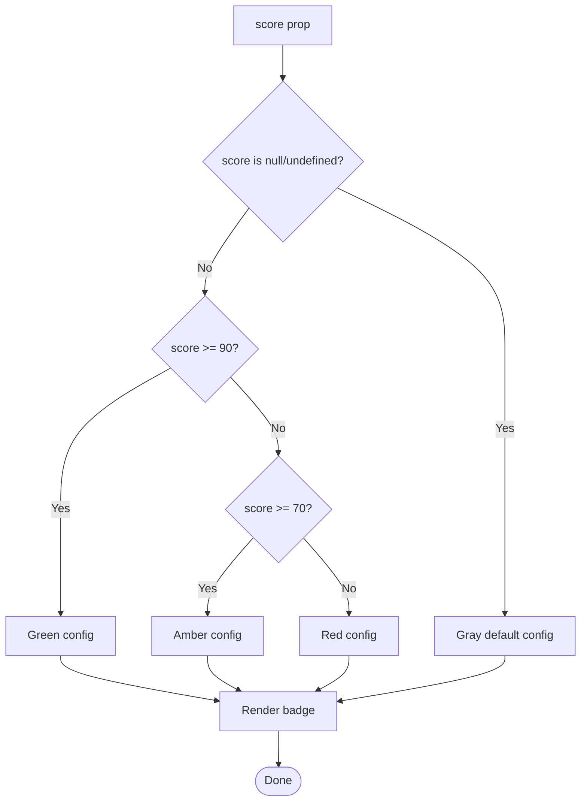

**Diagram sources**
- [ValidatorScoreBadge.jsx:32-48](file://frontend/src/components/validators/ValidatorScoreBadge.jsx#L32-48)

**Section sources**
- [ValidatorScoreBadge.jsx:1-49](file://frontend/src/components/validators/ValidatorScoreBadge.jsx#L1-49)

### Delinquency Monitoring
Delinquency status is represented by:
- Column indicator in the table (highlighted border and status icon)
- Dedicated status indicator in the detail panel
- Backend job that periodically refreshes validator lists and writes snapshots, enabling historical tracking

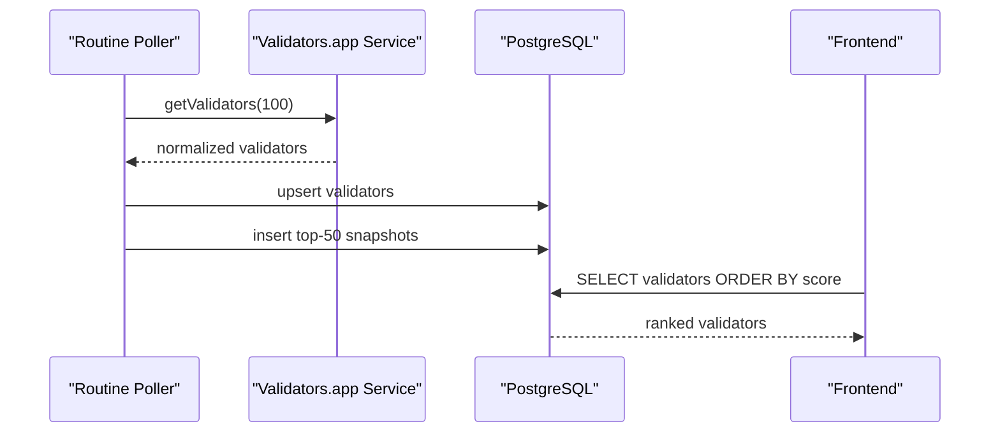

**Diagram sources**
- [routinePoller.js:21-108](file://backend/src/jobs/routinePoller.js#L21-108)
- [validatorsApp.js:186-209](file://backend/src/services/validatorsApp.js#L186-209)
- [queries.js:180-235](file://backend/src/models/queries.js#L180-235)

**Section sources**
- [ValidatorTable.jsx:93-104](file://frontend/src/components/validators/ValidatorTable.jsx#L93-104)
- [ValidatorDetailPanel.jsx:182-188](file://frontend/src/components/validators/ValidatorDetailPanel.jsx#L182-188)
- [routinePoller.js:47-63](file://backend/src/jobs/routinePoller.js#L47-63)
- [queries.js:270-324](file://backend/src/models/queries.js#L270-324)

### Commission Change Tracking
The backend detects commission changes between cached and current validator lists and emits warnings and alerts:
- Detects increases/decreases and records old/new commission
- Emits WebSocket alerts and inserts alert records
- Frontend can surface these alerts via the alerts page

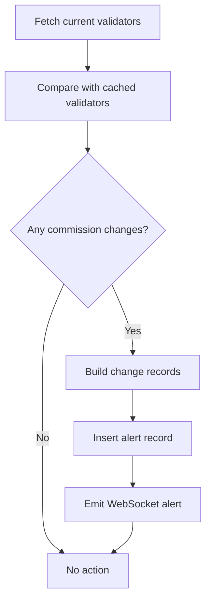

**Diagram sources**
- [validatorsApp.js:268-298](file://backend/src/services/validatorsApp.js#L268-298)
- [routinePoller.js:80-100](file://backend/src/jobs/routinePoller.js#L80-100)
- [queries.js:340-403](file://backend/src/models/queries.js#L340-403)

**Section sources**
- [validatorsApp.js:268-298](file://backend/src/services/validatorsApp.js#L268-298)
- [routinePoller.js:80-100](file://backend/src/jobs/routinePoller.js#L80-100)
- [queries.js:340-403](file://backend/src/models/queries.js#L340-403)

### Validator Ranking and Filtering
Ranking is driven by score (highest first). The frontend supports:
- Sorting by score, stake, commission, skip rate, and name
- Persistent sort state in the store
- Periodic reloads to keep data fresh

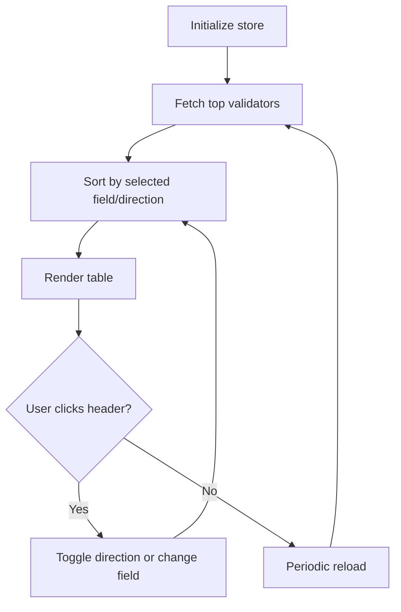

**Diagram sources**
- [validatorStore.js:3-25](file://frontend/src/stores/validatorStore.js#L3-25)
- [Validators.jsx:41-88](file://frontend/src/pages/Validators.jsx#L41-88)
- [Validators.jsx:35-39](file://frontend/src/pages/Validators.jsx#L35-39)

**Section sources**
- [validatorStore.js:1-28](file://frontend/src/stores/validatorStore.js#L1-28)
- [Validators.jsx:41-88](file://frontend/src/pages/Validators.jsx#L41-88)

### Integration with External Validator Data Sources
The backend integrates with Validators.app:
- Normalization to internal schema (vote_pubkey, identity_pubkey, name, avatar_url, score, stake_sol, commission, is_delinquent, skip_rate, software_version, data_center, asn, jito_enabled)
- Rate limiting (40 requests per 5 minutes) with queueing
- Module-level cache with TTL
- Optional API key configuration

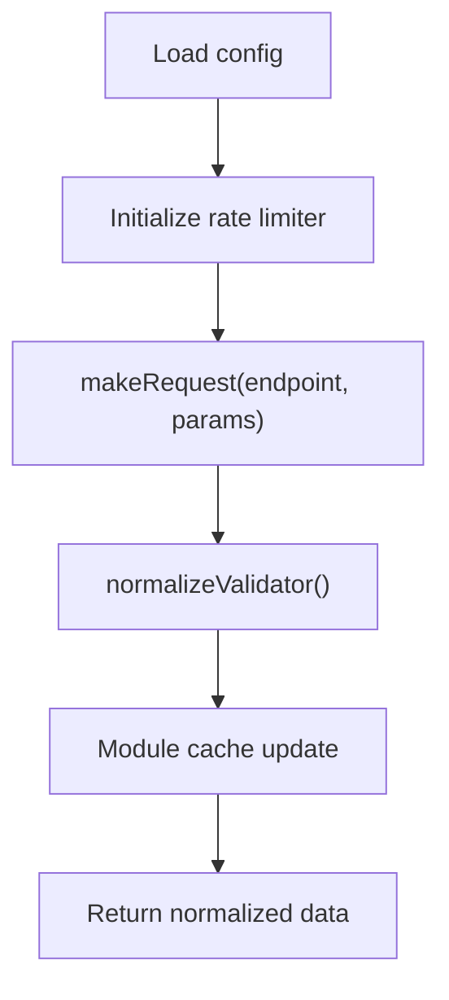

**Diagram sources**
- [validatorsApp.js:115-149](file://backend/src/services/validatorsApp.js#L115-149)
- [validatorsApp.js:156-179](file://backend/src/services/validatorsApp.js#L156-179)
- [validatorsApp.js:101-109](file://backend/src/services/validatorsApp.js#L101-109)
- [index.js:39-43](file://backend/src/config/index.js#L39-43)

**Section sources**
- [validatorsApp.js:1-388](file://backend/src/services/validatorsApp.js#L1-388)
- [index.js:39-43](file://backend/src/config/index.js#L39-43)

### Real-Time Performance Updates
Real-time updates are achieved via:
- Frontend polling (every 60 seconds) for the top validators list
- WebSocket broadcasts from backend jobs for network and RPC updates
- Redis caching for fast retrieval and reduced load

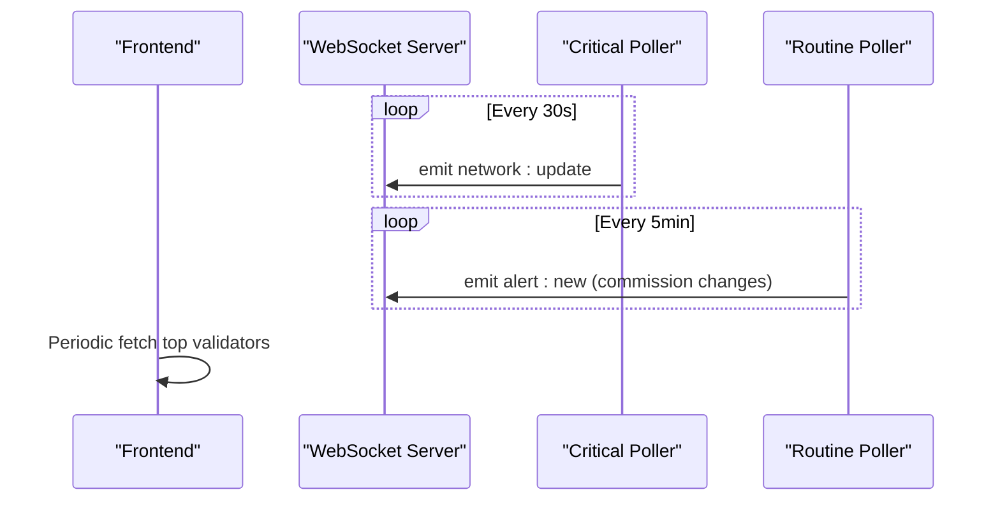

**Diagram sources**
- [criticalPoller.js:88-92](file://backend/src/jobs/criticalPoller.js#L88-92)
- [routinePoller.js:96-100](file://backend/src/jobs/routinePoller.js#L96-100)
- [Validators.jsx:35-39](file://frontend/src/pages/Validators.jsx#L35-39)

**Section sources**
- [Validators.jsx:24-39](file://frontend/src/pages/Validators.jsx#L24-39)
- [criticalPoller.js:88-92](file://backend/src/jobs/criticalPoller.js#L88-92)
- [routinePoller.js:96-100](file://backend/src/jobs/routinePoller.js#L96-100)

## Dependency Analysis
The system exhibits layered dependencies:
- Frontend depends on backend routes and stores for data and state
- Backend routes depend on Validators.app service, Redis, and database queries
- Jobs depend on Validators.app service and database/Redis for persistence and caching
- Database schema defines primary keys and indexes for efficient lookups

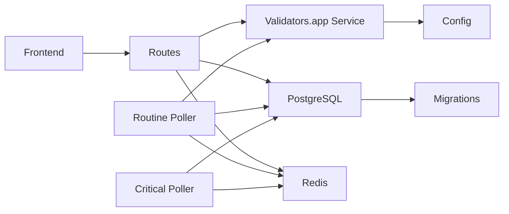

**Diagram sources**
- [Validators.jsx:1-179](file://frontend/src/pages/Validators.jsx#L1-179)
- [validatorApi.js:1-8](file://frontend/src/services/validatorApi.js#L1-8)
- [validators.js:1-112](file://backend/src/routes/validators.js#L1-112)
- [validatorsApp.js:1-388](file://backend/src/services/validatorsApp.js#L1-388)
- [queries.js:1-459](file://backend/src/models/queries.js#L1-459)
- [migrate.js:1-160](file://backend/src/models/migrate.js#L1-160)
- [routinePoller.js:1-116](file://backend/src/jobs/routinePoller.js#L1-116)
- [criticalPoller.js:1-108](file://backend/src/jobs/criticalPoller.js#L1-108)
- [redis.js:1-161](file://backend/src/models/redis.js#L1-161)
- [index.js:1-68](file://backend/src/config/index.js#L1-68)

**Section sources**
- [validatorApi.js:1-8](file://frontend/src/services/validatorApi.js#L1-8)
- [validators.js:1-112](file://backend/src/routes/validators.js#L1-112)
- [validatorsApp.js:1-388](file://backend/src/services/validatorsApp.js#L1-388)
- [queries.js:1-459](file://backend/src/models/queries.js#L1-459)
- [migrate.js:1-160](file://backend/src/models/migrate.js#L1-160)
- [routinePoller.js:1-116](file://backend/src/jobs/routinePoller.js#L1-116)
- [criticalPoller.js:1-108](file://backend/src/jobs/criticalPoller.js#L1-108)
- [redis.js:1-161](file://backend/src/models/redis.js#L1-161)
- [index.js:1-68](file://backend/src/config/index.js#L1-68)

## Performance Considerations
- Caching: Redis caches top validators and details with TTLs to reduce latency and external API load.
- Rate Limiting: Validators.app requests are throttled to avoid quota exhaustion.
- Database: Upserts and snapshots are batched; indexes on score and stake optimize ranking queries.
- Frontend: Local sorting and memoization minimize re-renders; polling intervals balance freshness and resource usage.
- Graceful Degradation: Routes fall back to database if Redis is unavailable; jobs continue even if individual steps fail.

[No sources needed since this section provides general guidance]

## Troubleshooting Guide
Common issues and remedies:
- Missing or stale validator data:
  - Verify backend configuration for Validators.app API key and base URL.
  - Confirm database connectivity and migrations have run.
  - Check Redis availability for caching.
- Commission change alerts not appearing:
  - Ensure routine poller runs and detects differences between cached and current lists.
  - Confirm alert insertion succeeds and WebSocket emits events.
- Slow table rendering:
  - Reduce sort field churn; leverage local sorting state.
  - Increase polling interval if acceptable for your UX.
- Delinquency status discrepancies:
  - Validate backend snapshot writes and frontend queries.

**Section sources**
- [index.js:39-43](file://backend/src/config/index.js#L39-43)
- [migrate.js:100-139](file://backend/src/models/migrate.js#L100-139)
- [redis.js:16-68](file://backend/src/models/redis.js#L16-68)
- [routinePoller.js:21-108](file://backend/src/jobs/routinePoller.js#L21-108)
- [queries.js:180-235](file://backend/src/models/queries.js#L180-235)

## Conclusion
The Validator Health Tracking system combines external validator data normalization, robust caching, and scheduled ingestion to deliver a responsive, informative interface. The validator table and detail panel present key health signals, while the score badge and delinquency monitoring help users quickly assess trustworthiness. Commission change tracking and real-time updates further support informed delegation decisions.

[No sources needed since this section summarizes without analyzing specific files]