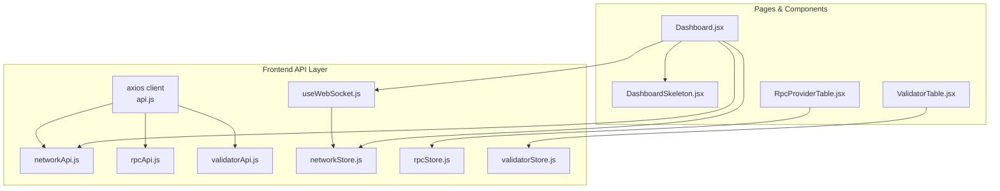
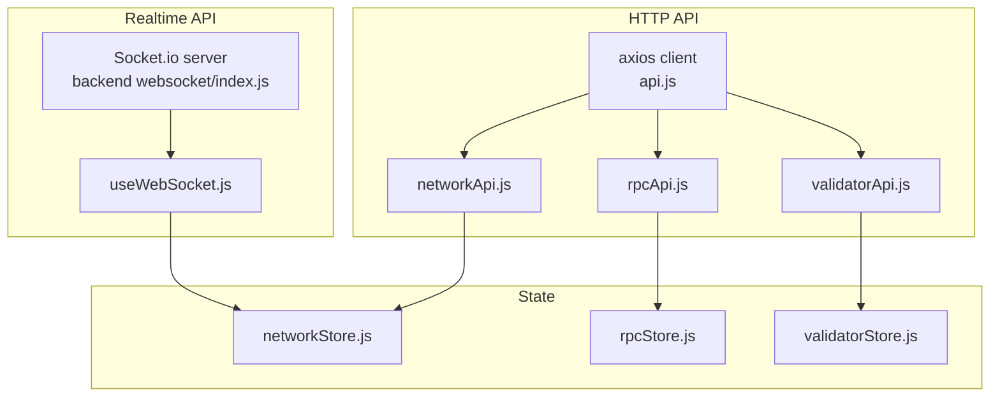
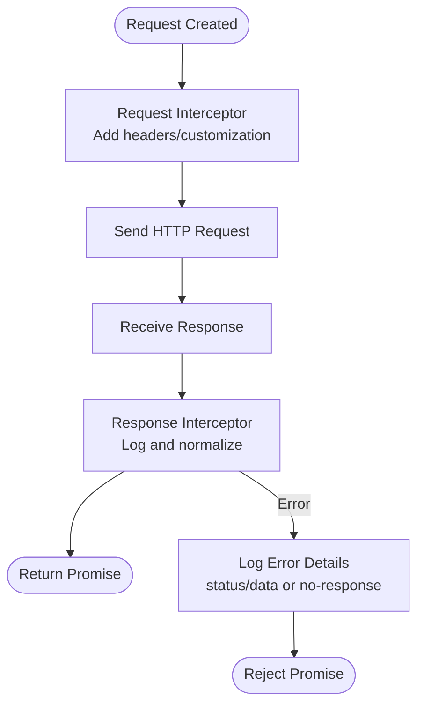
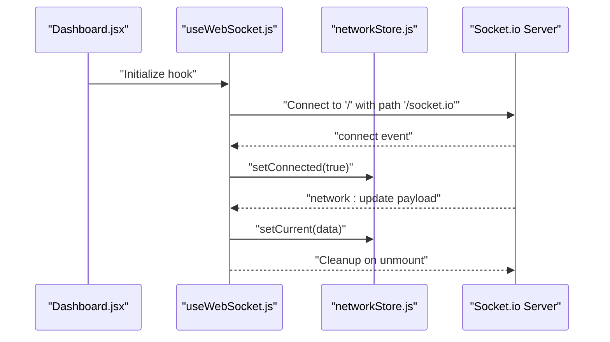
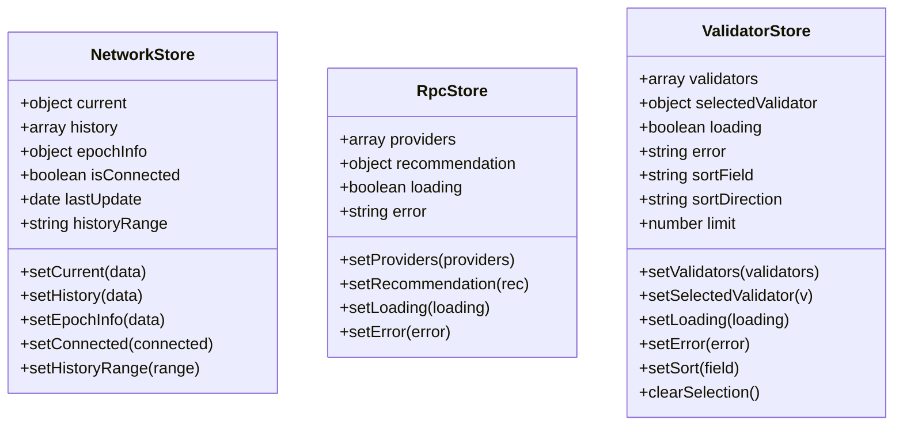
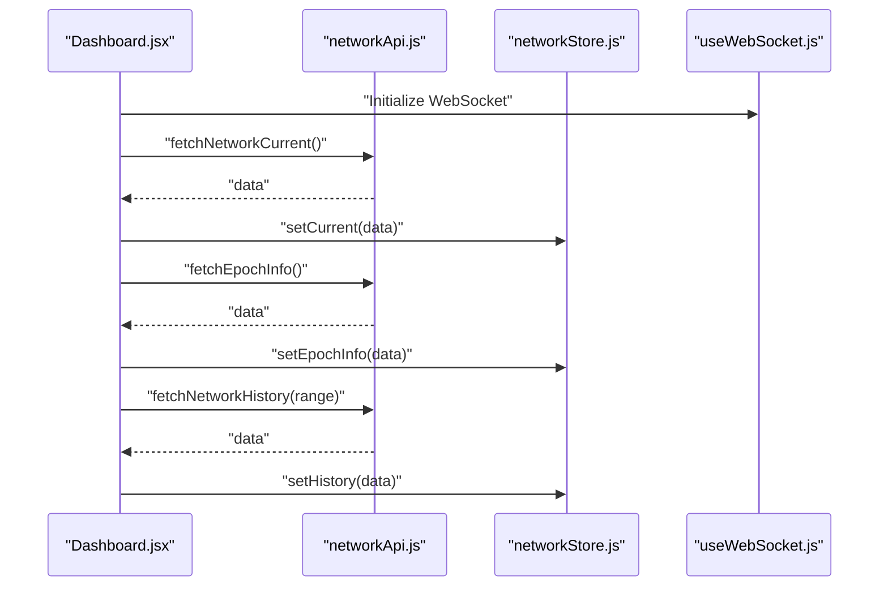
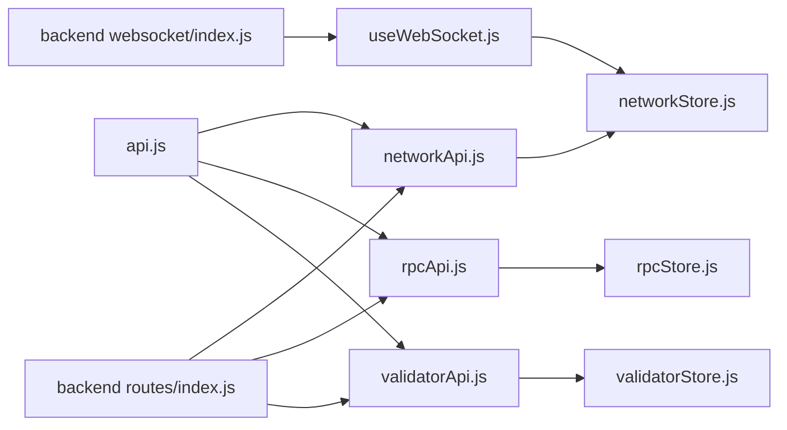

# API Integration Layer

<cite>
**Referenced Files in This Document**
- [api.js](file://frontend/src/services/api.js)
- [networkApi.js](file://frontend/src/services/networkApi.js)
- [rpcApi.js](file://frontend/src/services/rpcApi.js)
- [validatorApi.js](file://frontend/src/services/validatorApi.js)
- [useWebSocket.js](file://frontend/src/hooks/useWebSocket.js)
- [networkStore.js](file://frontend/src/stores/networkStore.js)
- [rpcStore.js](file://frontend/src/stores/rpcStore.js)
- [validatorStore.js](file://frontend/src/stores/validatorStore.js)
- [Dashboard.jsx](file://frontend/src/pages/Dashboard.jsx)
- [DashboardSkeleton.jsx](file://frontend/src/components/dashboard/DashboardSkeleton.jsx)
- [RpcProviderTable.jsx](file://frontend/src/components/rpc/RpcProviderTable.jsx)
- [ValidatorTable.jsx](file://frontend/src/components/validators/ValidatorTable.jsx)
- [index.js](file://backend/src/websocket/index.js)
- [index.js](file://backend/src/routes/index.js)
- [index.js](file://backend/src/config/index.js)
- [package.json](file://backend/package.json)
</cite>

## Table of Contents
1. [Introduction](#introduction)
2. [Project Structure](#project-structure)
3. [Core Components](#core-components)
4. [Architecture Overview](#architecture-overview)
5. [Detailed Component Analysis](#detailed-component-analysis)
6. [Dependency Analysis](#dependency-analysis)
7. [Performance Considerations](#performance-considerations)
8. [Troubleshooting Guide](#troubleshooting-guide)
9. [Conclusion](#conclusion)

## Introduction
This document explains the API integration layer powering the InfraWatch frontend. It covers the centralized axios-based API client, service modules for network, RPC, and validator data, WebSocket integration for real-time updates, and the state management stores coordinating data flow. It also documents request/response handling, error management, loading states, and practical usage patterns in components.

## Project Structure
The frontend organizes API integration under a small set of cohesive modules:
- Centralized axios client with interceptors
- Feature-specific API service modules
- Zustand stores for state and loading/error flags
- A WebSocket hook for real-time updates
- Pages and components that consume the services and stores

**Diagram sources**
- [api.js:1-43](file://frontend/src/services/api.js#L1-L43)
- [networkApi.js:1-6](file://frontend/src/services/networkApi.js#L1-L6)
- [rpcApi.js:1-7](file://frontend/src/services/rpcApi.js#L1-L7)
- [validatorApi.js:1-8](file://frontend/src/services/validatorApi.js#L1-L8)
- [useWebSocket.js:1-30](file://frontend/src/hooks/useWebSocket.js#L1-L30)
- [networkStore.js:1-25](file://frontend/src/stores/networkStore.js#L1-L25)
- [rpcStore.js:1-16](file://frontend/src/stores/rpcStore.js#L1-L16)
- [validatorStore.js:1-28](file://frontend/src/stores/validatorStore.js#L1-L28)
- [Dashboard.jsx:1-84](file://frontend/src/pages/Dashboard.jsx#L1-L84)
- [DashboardSkeleton.jsx:1-35](file://frontend/src/components/dashboard/DashboardSkeleton.jsx#L1-L35)
- [RpcProviderTable.jsx:1-177](file://frontend/src/components/rpc/RpcProviderTable.jsx#L1-L177)
- [ValidatorTable.jsx:1-202](file://frontend/src/components/validators/ValidatorTable.jsx#L1-L202)

**Section sources**
- [api.js:1-43](file://frontend/src/services/api.js#L1-L43)
- [networkApi.js:1-6](file://frontend/src/services/networkApi.js#L1-L6)
- [rpcApi.js:1-7](file://frontend/src/services/rpcApi.js#L1-L7)
- [validatorApi.js:1-8](file://frontend/src/services/validatorApi.js#L1-L8)
- [useWebSocket.js:1-30](file://frontend/src/hooks/useWebSocket.js#L1-L30)
- [networkStore.js:1-25](file://frontend/src/stores/networkStore.js#L1-L25)
- [rpcStore.js:1-16](file://frontend/src/stores/rpcStore.js#L1-L16)
- [validatorStore.js:1-28](file://frontend/src/stores/validatorStore.js#L1-L28)
- [Dashboard.jsx:1-84](file://frontend/src/pages/Dashboard.jsx#L1-L84)
- [DashboardSkeleton.jsx:1-35](file://frontend/src/components/dashboard/DashboardSkeleton.jsx#L1-L35)
- [RpcProviderTable.jsx:1-177](file://frontend/src/components/rpc/RpcProviderTable.jsx#L1-L177)
- [ValidatorTable.jsx:1-202](file://frontend/src/components/validators/ValidatorTable.jsx#L1-L202)

## Core Components
- Central axios client with base configuration and interceptors for unified request/response handling and error logging.
- Feature-specific API modules exporting convenience functions that return normalized data.
- WebSocket hook establishing a persistent connection and pushing live updates into the network store.
- Zustand stores managing loading states, errors, and data for each domain.

Key characteristics:
- Single axios instance ensures consistent headers, timeouts, and error handling across all requests.
- Service modules encapsulate endpoint paths and transform raw axios responses to data payloads.
- WebSocket events update the network store, enabling real-time UI refreshes.
- Stores expose actions to set data, loading flags, and errors, simplifying component logic.

**Section sources**
- [api.js:1-43](file://frontend/src/services/api.js#L1-L43)
- [networkApi.js:1-6](file://frontend/src/services/networkApi.js#L1-L6)
- [rpcApi.js:1-7](file://frontend/src/services/rpcApi.js#L1-L7)
- [validatorApi.js:1-8](file://frontend/src/services/validatorApi.js#L1-L8)
- [useWebSocket.js:1-30](file://frontend/src/hooks/useWebSocket.js#L1-L30)
- [networkStore.js:1-25](file://frontend/src/stores/networkStore.js#L1-L25)
- [rpcStore.js:1-16](file://frontend/src/stores/rpcStore.js#L1-L16)
- [validatorStore.js:1-28](file://frontend/src/stores/validatorStore.js#L1-L28)

## Architecture Overview
The frontend composes a clean separation of concerns:
- Services define typed API calls returning normalized data.
- Interceptors apply global behavior (future auth token injection, response normalization).
- Stores manage state transitions and expose selectors/actions to components.
- WebSocket provides real-time updates via Socket.io to keep the UI fresh.

**Diagram sources**
- [api.js:1-43](file://frontend/src/services/api.js#L1-L43)
- [networkApi.js:1-6](file://frontend/src/services/networkApi.js#L1-L6)
- [rpcApi.js:1-7](file://frontend/src/services/rpcApi.js#L1-L7)
- [validatorApi.js:1-8](file://frontend/src/services/validatorApi.js#L1-L8)
- [useWebSocket.js:1-30](file://frontend/src/hooks/useWebSocket.js#L1-L30)
- [networkStore.js:1-25](file://frontend/src/stores/networkStore.js#L1-L25)
- [rpcStore.js:1-16](file://frontend/src/stores/rpcStore.js#L1-L16)
- [validatorStore.js:1-28](file://frontend/src/stores/validatorStore.js#L1-L28)
- [index.js:1-81](file://backend/src/websocket/index.js#L1-L81)

## Detailed Component Analysis

### Centralized Axios Client
- Base URL configured to "/api", enabling proxy-friendly routing behind the dev server and reverse proxy.
- Timeout set to 10 seconds to prevent hanging requests.
- Request interceptor placeholder ready for adding auth tokens or custom headers.
- Response interceptor logs structured errors and rejects promises for centralized handling.

**Diagram sources**
- [api.js:1-43](file://frontend/src/services/api.js#L1-L43)

**Section sources**
- [api.js:1-43](file://frontend/src/services/api.js#L1-L43)

### Network API Module
- Provides functions to fetch current network metrics, historical series, and epoch info.
- Returns normalized data payloads for downstream consumption.

Usage pattern:
- Called during page mount and when history range changes.
- Updates the network store with current, history, and epoch info.

**Section sources**
- [networkApi.js:1-6](file://frontend/src/services/networkApi.js#L1-L6)
- [Dashboard.jsx:32-47](file://frontend/src/pages/Dashboard.jsx#L32-L47)
- [networkStore.js:1-25](file://frontend/src/stores/networkStore.js#L1-L25)

### RPC API Module
- Exposes functions to fetch RPC provider health and per-provider history.
- Encodes provider identifiers safely to avoid path issues.

Usage pattern:
- Used by RPC-related components to populate provider tables and charts.
- Integrates with the RPC store for loading and error states.

**Section sources**
- [rpcApi.js:1-7](file://frontend/src/services/rpcApi.js#L1-L7)
- [rpcStore.js:1-16](file://frontend/src/stores/rpcStore.js#L1-L16)
- [RpcProviderTable.jsx:1-177](file://frontend/src/components/rpc/RpcProviderTable.jsx#L1-L177)

### Validator API Module
- Provides top validators and detailed validator information by vote public key.
- Supports configurable limits for paginated or sampled views.

Usage pattern:
- Consumed by validator tables and detail panels.
- Integrated with the validator store for selection, sorting, and error handling.

**Section sources**
- [validatorApi.js:1-8](file://frontend/src/services/validatorApi.js#L1-L8)
- [validatorStore.js:1-28](file://frontend/src/stores/validatorStore.js#L1-L28)
- [ValidatorTable.jsx:1-202](file://frontend/src/components/validators/ValidatorTable.jsx#L1-L202)

### WebSocket Integration Hook
- Establishes a Socket.io connection with fallback transports.
- Emits connection/disconnection events and listens for "network:update".
- Pushes live network updates into the network store, toggling connection status.

**Diagram sources**
- [useWebSocket.js:1-30](file://frontend/src/hooks/useWebSocket.js#L1-L30)
- [networkStore.js:1-25](file://frontend/src/stores/networkStore.js#L1-L25)
- [index.js:1-81](file://backend/src/websocket/index.js#L1-L81)

**Section sources**
- [useWebSocket.js:1-30](file://frontend/src/hooks/useWebSocket.js#L1-L30)
- [networkStore.js:1-25](file://frontend/src/stores/networkStore.js#L1-L25)
- [Dashboard.jsx:28-29](file://frontend/src/pages/Dashboard.jsx#L28-L29)

### State Management Stores
- Network store: holds current metrics, history, epoch info, connection state, and last update timestamp.
- RPC store: tracks providers, recommendation, loading flag, and error state.
- Validator store: manages validators list, selected validator, sorting, pagination limit, and error/loading.

**Diagram sources**
- [networkStore.js:1-25](file://frontend/src/stores/networkStore.js#L1-L25)
- [rpcStore.js:1-16](file://frontend/src/stores/rpcStore.js#L1-L16)
- [validatorStore.js:1-28](file://frontend/src/stores/validatorStore.js#L1-L28)

**Section sources**
- [networkStore.js:1-25](file://frontend/src/stores/networkStore.js#L1-L25)
- [rpcStore.js:1-16](file://frontend/src/stores/rpcStore.js#L1-L16)
- [validatorStore.js:1-28](file://frontend/src/stores/validatorStore.js#L1-L28)

### API Usage Patterns in Components
- Dashboard orchestrates fetching current network metrics and epoch info on mount, and history when the range changes. It renders a skeleton while data is unavailable.
- Provider and validator tables receive data from stores and present sorted, selectable rows with appropriate formatting.

**Diagram sources**
- [Dashboard.jsx:1-84](file://frontend/src/pages/Dashboard.jsx#L1-L84)
- [networkApi.js:1-6](file://frontend/src/services/networkApi.js#L1-L6)
- [networkStore.js:1-25](file://frontend/src/stores/networkStore.js#L1-L25)
- [useWebSocket.js:1-30](file://frontend/src/hooks/useWebSocket.js#L1-L30)

**Section sources**
- [Dashboard.jsx:1-84](file://frontend/src/pages/Dashboard.jsx#L1-L84)
- [DashboardSkeleton.jsx:1-35](file://frontend/src/components/dashboard/DashboardSkeleton.jsx#L1-L35)
- [RpcProviderTable.jsx:1-177](file://frontend/src/components/rpc/RpcProviderTable.jsx#L1-L177)
- [ValidatorTable.jsx:1-202](file://frontend/src/components/validators/ValidatorTable.jsx#L1-L202)

## Dependency Analysis
- Frontend API modules depend on the central axios client.
- Pages and components depend on stores and service modules.
- Backend exposes REST endpoints mounted under "/api" and provides Socket.io for real-time updates.

**Diagram sources**
- [api.js:1-43](file://frontend/src/services/api.js#L1-L43)
- [networkApi.js:1-6](file://frontend/src/services/networkApi.js#L1-L6)
- [rpcApi.js:1-7](file://frontend/src/services/rpcApi.js#L1-L7)
- [validatorApi.js:1-8](file://frontend/src/services/validatorApi.js#L1-L8)
- [networkStore.js:1-25](file://frontend/src/stores/networkStore.js#L1-L25)
- [rpcStore.js:1-16](file://frontend/src/stores/rpcStore.js#L1-L16)
- [validatorStore.js:1-28](file://frontend/src/stores/validatorStore.js#L1-L28)
- [useWebSocket.js:1-30](file://frontend/src/hooks/useWebSocket.js#L1-L30)
- [index.js:1-81](file://backend/src/websocket/index.js#L1-L81)
- [index.js:1-24](file://backend/src/routes/index.js#L1-L24)

**Section sources**
- [api.js:1-43](file://frontend/src/services/api.js#L1-L43)
- [networkApi.js:1-6](file://frontend/src/services/networkApi.js#L1-L6)
- [rpcApi.js:1-7](file://frontend/src/services/rpcApi.js#L1-L7)
- [validatorApi.js:1-8](file://frontend/src/services/validatorApi.js#L1-L8)
- [networkStore.js:1-25](file://frontend/src/stores/networkStore.js#L1-L25)
- [rpcStore.js:1-16](file://frontend/src/stores/rpcStore.js#L1-L16)
- [validatorStore.js:1-28](file://frontend/src/stores/validatorStore.js#L1-L28)
- [useWebSocket.js:1-30](file://frontend/src/hooks/useWebSocket.js#L1-L30)
- [index.js:1-81](file://backend/src/websocket/index.js#L1-L81)
- [index.js:1-24](file://backend/src/routes/index.js#L1-L24)

## Performance Considerations
- Prefer batching or debouncing frequent updates when integrating additional real-time streams.
- Use store actions to toggle loading flags to avoid unnecessary re-renders.
- Cache recent history slices in the store to minimize repeated network calls for the same ranges.
- Consider implementing retry with exponential backoff for transient failures in production deployments.
- Monitor WebSocket reconnect behavior and throttle UI updates to reduce layout thrash.

## Troubleshooting Guide
Common issues and remedies:
- Requests timing out: Verify backend availability and network connectivity; adjust axios timeout if needed.
- Authentication failures: Extend the request interceptor to attach tokens and ensure backend validates them.
- WebSocket disconnections: Inspect connection logs and verify the Socket.io path matches the backend configuration.
- Stale data: Confirm that WebSocket events update the store and that components subscribe to store changes.
- Error surfaces: Use store error fields to display user-friendly messages; log detailed errors in the response interceptor.

**Section sources**
- [api.js:22-40](file://frontend/src/services/api.js#L22-L40)
- [useWebSocket.js:8-28](file://frontend/src/hooks/useWebSocket.js#L8-L28)
- [rpcStore.js:10-12](file://frontend/src/stores/rpcStore.js#L10-L12)
- [validatorStore.js:14-15](file://frontend/src/stores/validatorStore.js#L14-L15)

## Conclusion
The API integration layer centers around a single axios client, feature-scoped service modules, and reactive stores. Real-time updates are handled via WebSocket, ensuring the UI remains responsive and current. The design promotes maintainability, predictable error handling, and clear separation of concerns across the frontend.