# Component Architecture

<cite>
**Referenced Files in This Document**
- [main.jsx](file://frontend/src/main.jsx)
- [App.jsx](file://frontend/src/App.jsx)
- [AppShell.jsx](file://frontend/src/components/layout/AppShell.jsx)
- [Header.jsx](file://frontend/src/components/layout/Header.jsx)
- [Sidebar.jsx](file://frontend/src/components/layout/Sidebar.jsx)
- [Icons.jsx](file://frontend/src/components/common/Icons.jsx)
- [LoadingSkeleton.jsx](file://frontend/src/components/common/LoadingSkeleton.jsx)
- [MetricCard.jsx](file://frontend/src/components/common/MetricCard.jsx)
- [SeverityBadge.jsx](file://frontend/src/components/common/SeverityBadge.jsx)
- [StatusIndicator.jsx](file://frontend/src/components/common/StatusIndicator.jsx)
- [WhatThisMeansPanel.jsx](file://frontend/src/components/dashboard/WhatThisMeansPanel.jsx)
- [ActiveValidatorsCard.jsx](file://frontend/src/components/dashboard/ActiveValidatorsCard.jsx)
- [ConfirmationTimeCard.jsx](file://frontend/src/components/dashboard/ConfirmationTimeCard.jsx)
- [CongestionScoreCard.jsx](file://frontend/src/components/dashboard/CongestionScoreCard.jsx)
- [DashboardSkeleton.jsx](file://frontend/src/components/dashboard/DashboardSkeleton.jsx)
- [DelinquentValidatorsCard.jsx](file://frontend/src/components/dashboard/DelinquentValidatorsCard.jsx)
- [EpochProgressCard.jsx](file://frontend/src/components/dashboard/EpochProgressCard.jsx)
- [NetworkStatusBanner.jsx](file://frontend/src/components/dashboard/NetworkStatusBanner.jsx)
- [SlotLatencyCard.jsx](file://frontend/src/components/dashboard/SlotLatencyCard.jsx)
- [TpsCard.jsx](file://frontend/src/components/dashboard/TpsCard.jsx)
- [TpsHistoryChart.jsx](file://frontend/src/components/dashboard/TpsHistoryChart.jsx)
- [RpcProviderTable.jsx](file://frontend/src/components/rpc/RpcProviderTable.jsx)
- [RpcRecommendationBanner.jsx](file://frontend/src/components/rpc/RpcRecommendationBanner.jsx)
- [ValidatorDetailPanel.jsx](file://frontend/src/components/validators/ValidatorDetailPanel.jsx)
- [ValidatorScoreBadge.jsx](file://frontend/src/components/validators/ValidatorScoreBadge.jsx)
- [ValidatorTable.jsx](file://frontend/src/components/validators/ValidatorTable.jsx)
</cite>

## Update Summary
**Changes Made**
- Enhanced frontend component system with new cyberpunk design aesthetic featuring neon green accents (#00ff88) and glowing effects
- Integrated Lucide React icons throughout layout components (Sidebar) while maintaining custom SVG Icons.jsx for common components
- Improved metric cards with enhanced visual styling, gradient backgrounds, and cyberpunk-inspired glow effects
- Redesigned layout components with sophisticated CSS animations, pulse effects, and gradient borders
- Added comprehensive dashboard skeleton loading states for improved user experience during data fetch
- Implemented advanced status indicators with animated glow effects and cyberpunk color schemes
- Enhanced progress bars with shimmer animations and gradient fills for epoch tracking

## Table of Contents
1. [Introduction](#introduction)
2. [Project Structure](#project-structure)
3. [Core Components](#core-components)
4. [Architecture Overview](#architecture-overview)
5. [Detailed Component Analysis](#detailed-component-analysis)
6. [Dependency Analysis](#dependency-analysis)
7. [Performance Considerations](#performance-considerations)
8. [Troubleshooting Guide](#troubleshooting-guide)
9. [Conclusion](#conclusion)

## Introduction
This document describes the component architecture of the InfraWatch frontend with its enhanced cyberpunk design aesthetic. The system features neon-inspired visual elements with glowing effects, gradient accents, and pulsing animations integrated throughout the layout and data visualization components. The architecture centers around AppShell as the main layout container, with reusable common components, dashboard-specific widgets, RPC monitoring components, and validator components that showcase the new design language.

## Project Structure
The frontend is a React application with Vite configuration, featuring a cyberpunk-inspired design system. The routing is configured at the root App level, with page-level components rendered inside AppShell that manages the global layout with enhanced visual effects.

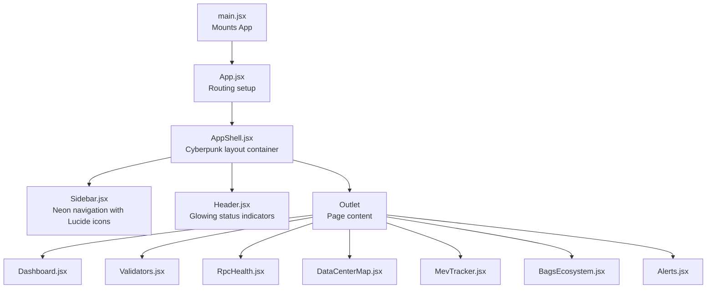

**Diagram sources**
- [main.jsx:1-12](file://frontend/src/main.jsx#L1-L12)
- [App.jsx:1-31](file://frontend/src/App.jsx#L1-L31)
- [AppShell.jsx:1-29](file://frontend/src/components/layout/AppShell.jsx#L1-L29)
- [Sidebar.jsx:1-173](file://frontend/src/components/layout/Sidebar.jsx#L1-L173)
- [Header.jsx:1-104](file://frontend/src/components/layout/Header.jsx#L1-L104)

**Section sources**
- [main.jsx:1-12](file://frontend/src/main.jsx#L1-L12)
- [App.jsx:1-31](file://frontend/src/App.jsx#L1-L31)

## Core Components
The core components implement the cyberpunk design aesthetic with neon green accents, glowing effects, and sophisticated animations. The system combines custom SVG icons with Lucide React icons for different component categories.

### Cyberpunk Icon System
**Enhanced** The icon system now features a hybrid approach combining custom SVG icons and Lucide React icons.

- **Custom SVG Icons.jsx**: 14 inline SVG components with consistent neon styling for common UI elements
- **Lucide React Integration**: External Lucide React icons used specifically in Sidebar navigation for professional iconography
- **Consistent Styling**: Both icon systems maintain uniform sizing (w-4/h-4, w-5/h-5) and color theming

### Enhanced Layout Components with Cyberpunk Aesthetic

#### AppShell
- **Purpose**: Root layout container with grid-based responsive design
- **Cyberpunk Features**: Dark theme foundation with neon accent borders and glow effects
- **Layout**: Two-column grid (15rem sidebar + flexible main content) with overflow handling

#### Header
- **Neon Status Indicators**: Animated connection pulse with glowing green dot (#00ff88)
- **Gradient Borders**: Bottom border with animated gradient from transparent to neon green
- **Timestamp Effects**: Monospace font with subtle glow effect for live data indication
- **Shadow Effects**: Bottom border glow with 15px blur radius for depth perception

#### Sidebar
- **Gradient Logo**: Neon green to cyan gradient circular logo with animated glow pulse
- **Active State Styling**: Pronounced left border indicator with 8px glow effect
- **Separator Effects**: Gradient separators with transparent to gray transition
- **Social Icons**: Custom GitHub and X (Twitter) icons with hover effects

### Advanced Common Components with Cyberpunk Styling

#### StatusIndicator
- **Neon Color Scheme**: Green (#00ff88), amber (#ffaa00), red (#ff4444) for status states
- **Pulsing Glow**: Animated pulse effect with adjustable glow intensity
- **Size Variants**: Small, medium, and large configurations with proportional glow scaling
- **CSS Animations**: Custom `animate-pulse-glow` animation for smooth pulsing effect

#### MetricCard
- **Enhanced Visual Effects**: 
  - Subtle gradient glow background for healthy status
  - Custom CSS variables for dynamic value coloring
  - Transition effects for hover states
- **Cyberpunk Styling**: 
  - Neon green accents for healthy status
  - Amber for degraded, red for critical
  - Animated value text with custom color transitions

#### SeverityBadge
- **Glow Effects**: 8px blur radius glow matching status color
- **Translucent Backgrounds**: RGBA values for subtle transparency
- **Pulsing Animation**: Continuous pulse animation for critical alerts
- **Border Effects**: Semi-transparent borders with matching color intensity

#### LoadingSkeleton
- **Shimmer Effect**: Custom `animate-shimmer` animation for loading states
- **Subtle Background**: Very light RGBA white for minimal visibility
- **Multiple Variants**: Text, card, and chart loading skeletons

#### WhatThisMeansPanel
- **Dynamic Status Colors**: Real-time color assignment based on network conditions
- **Glow Indicators**: Status dot with matching color glow effect
- **Responsive Grid**: Flexible 2x2 grid layout for metric breakdowns
- **Cyberpunk Typography**: Uppercase labels with tracking and monospace values

**Section sources**
- [Icons.jsx:1-142](file://frontend/src/components/common/Icons.jsx#L1-L142)
- [AppShell.jsx:1-29](file://frontend/src/components/layout/AppShell.jsx#L1-L29)
- [Header.jsx:1-104](file://frontend/src/components/layout/Header.jsx#L1-L104)
- [Sidebar.jsx:1-173](file://frontend/src/components/layout/Sidebar.jsx#L1-L173)
- [StatusIndicator.jsx:1-70](file://frontend/src/components/common/StatusIndicator.jsx#L1-L70)
- [MetricCard.jsx:1-109](file://frontend/src/components/common/MetricCard.jsx#L1-L109)
- [SeverityBadge.jsx:1-47](file://frontend/src/components/common/SeverityBadge.jsx#L1-L47)
- [LoadingSkeleton.jsx:1-38](file://frontend/src/components/common/LoadingSkeleton.jsx#L1-L38)
- [WhatThisMeansPanel.jsx:1-113](file://frontend/src/components/dashboard/WhatThisMeansPanel.jsx#L1-L113)

## Architecture Overview
The enhanced architecture implements a cyberpunk-themed layout system with sophisticated visual effects and animations. The design language is consistently applied across all components, creating a cohesive neon-inspired user experience.

```mermaid
graph TB
subgraph "Cyberpunk Layout"
AS["AppShell<br/>Grid layout with neon accents"]
SB["Sidebar<br/>Gradient logo, glowing separators"]
HD["Header<br/>Animated connection pulse, bottom glow"]
end
subgraph "Pages"
PG_D["Dashboard<br/>Enhanced metric cards, progress bars"]
PG_V["Validators<br/>Score badges, detail panels"]
PG_R["RpcHealth<br/>Provider tables, recommendations"]
PG_M["DataCenterMap<br/>Geographic visualization"]
PG_E["MevTracker<br/>Market activity tracking"]
PG_B["BagsEcosystem<br/>Token ecosystem overview"]
PG_A["Alerts<br/>Severity badges, notifications"]
end
subgraph "Common Components"
IC["Icons.jsx<br/>14 Custom SVG Icons"]
SI["StatusIndicator<br/>Pulsing neon glow"]
MC["MetricCard<br/>Gradient backgrounds, value colors"]
SBG["SeverityBadge<br/>Glowing translucent badges"]
LSK["LoadingSkeleton<br/>Shimmer animations"]
WTM["WhatThisMeansPanel<br/>Dynamic status interpretation"]
end
subgraph "Feature Components"
RPT["RpcProviderTable<br/>Lucide React icons"]
RPB["RpcRecommendationBanner<br/>Neon recommendations"]
VDT["ValidatorDetailPanel<br/>Score visualization"]
VSB["ValidatorScoreBadge<br/>Color-coded ratings"]
VTB["ValidatorTable<br/>Enhanced sorting, selection"]
END
AS --> SB
AS --> HD
AS --> PG_D
AS --> PG_V
AS --> PG_R
AS --> PG_M
AS --> PG_E
AS --> PG_B
AS --> PG_A
PG_D --> MC
PG_D --> LSK
PG_D --> WTM
PG_V --> VTB
PG_V --> VDT
PG_V --> VSB
PG_R --> RPT
PG_R --> RPB
PG_A --> SBG
PG_D --> SI
PG_V --> SI
PG_R --> SI
IC --> HD
IC --> SB
IC --> WTM
```

**Diagram sources**
- [AppShell.jsx:1-29](file://frontend/src/components/layout/AppShell.jsx#L1-L29)
- [Sidebar.jsx:1-173](file://frontend/src/components/layout/Sidebar.jsx#L1-L173)
- [Header.jsx:1-104](file://frontend/src/components/layout/Header.jsx#L1-L104)
- [Icons.jsx:1-142](file://frontend/src/components/common/Icons.jsx#L1-L142)
- [WhatThisMeansPanel.jsx:1-113](file://frontend/src/components/dashboard/WhatThisMeansPanel.jsx#L1-L113)
- [MetricCard.jsx:1-109](file://frontend/src/components/common/MetricCard.jsx#L1-L109)
- [StatusIndicator.jsx:1-70](file://frontend/src/components/common/StatusIndicator.jsx#L1-L70)
- [SeverityBadge.jsx:1-47](file://frontend/src/components/common/SeverityBadge.jsx#L1-L47)
- [LoadingSkeleton.jsx:1-38](file://frontend/src/components/common/LoadingSkeleton.jsx#L1-L38)
- [RpcProviderTable.jsx:1-177](file://frontend/src/components/rpc/RpcProviderTable.jsx#L1-L177)
- [RpcRecommendationBanner.jsx:1-63](file://frontend/src/components/rpc/RpcRecommendationBanner.jsx#L1-L63)
- [ValidatorDetailPanel.jsx:1-218](file://frontend/src/components/validators/ValidatorDetailPanel.jsx#L1-L218)
- [ValidatorScoreBadge.jsx:1-49](file://frontend/src/components/validators/ValidatorScoreBadge.jsx#L1-L49)
- [ValidatorTable.jsx:1-202](file://frontend/src/components/validators/ValidatorTable.jsx#L1-L202)

## Detailed Component Analysis

### Enhanced Layout Container: AppShell
The AppShell component serves as the foundation for the cyberpunk design system, implementing a grid-based layout with sophisticated visual effects.

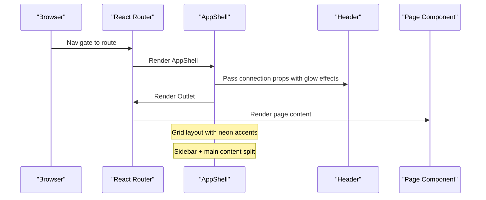

**Diagram sources**
- [AppShell.jsx:1-29](file://frontend/src/components/layout/AppShell.jsx#L1-L29)
- [Header.jsx:1-104](file://frontend/src/components/layout/Header.jsx#L1-L104)
- [App.jsx:1-31](file://frontend/src/App.jsx#L1-L31)

**Section sources**
- [AppShell.jsx:1-29](file://frontend/src/components/layout/AppShell.jsx#L1-L29)

### Cyberpunk Header Component
The Header implements advanced neon styling with animated connection indicators and gradient effects.

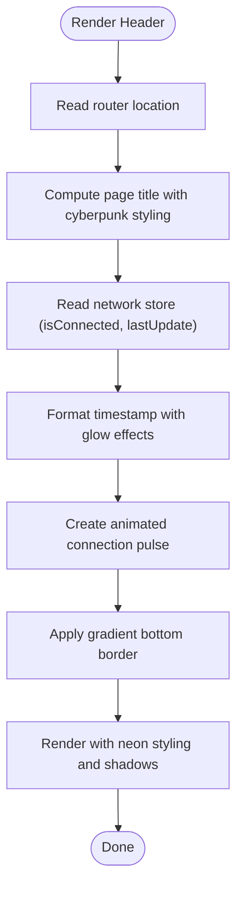

**Diagram sources**
- [Header.jsx:1-104](file://frontend/src/components/layout/Header.jsx#L1-L104)

**Section sources**
- [Header.jsx:1-104](file://frontend/src/components/layout/Header.jsx#L1-L104)

### Lucide React Enhanced Sidebar
The Sidebar combines custom cyberpunk styling with Lucide React icons for professional navigation elements.

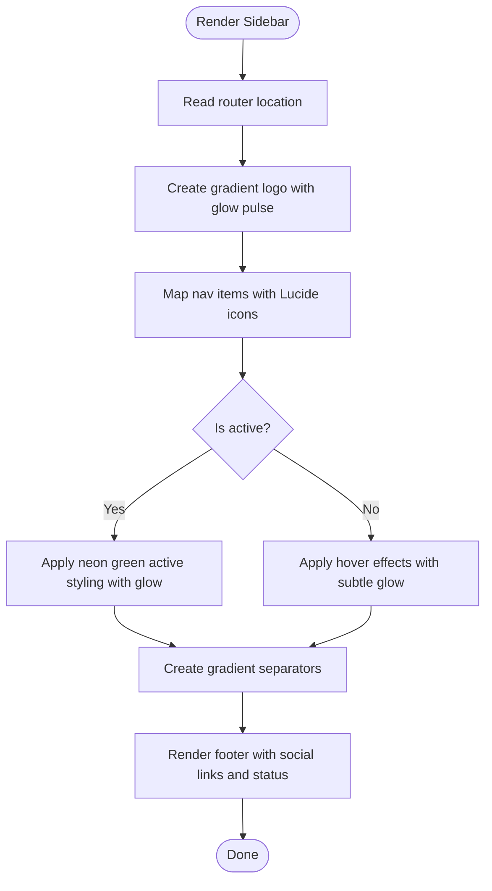

**Diagram sources**
- [Sidebar.jsx:1-173](file://frontend/src/components/layout/Sidebar.jsx#L1-L173)

**Section sources**
- [Sidebar.jsx:1-173](file://frontend/src/components/layout/Sidebar.jsx#L1-L173)

### Advanced Common Components with Cyberpunk Styling

#### Enhanced StatusIndicator
The StatusIndicator now features sophisticated neon styling with customizable glow effects and size variants.

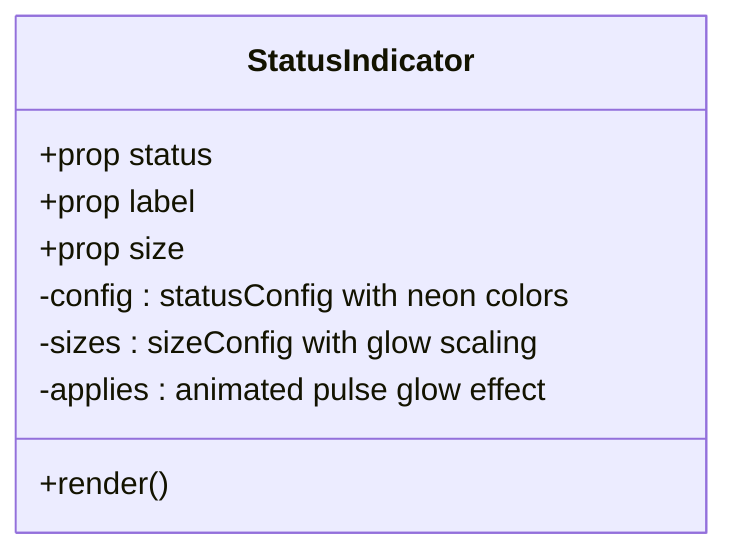

**Diagram sources**
- [StatusIndicator.jsx:1-70](file://frontend/src/components/common/StatusIndicator.jsx#L1-L70)

**Section sources**
- [StatusIndicator.jsx:1-70](file://frontend/src/components/common/StatusIndicator.jsx#L1-L70)

#### Enhanced MetricCard
The MetricCard implements advanced visual effects with gradient backgrounds, animated value colors, and cyberpunk styling.

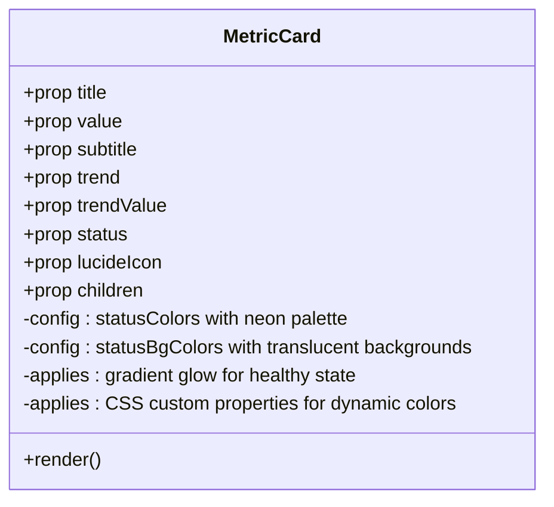

**Diagram sources**
- [MetricCard.jsx:1-109](file://frontend/src/components/common/MetricCard.jsx#L1-L109)

**Section sources**
- [MetricCard.jsx:1-109](file://frontend/src/components/common/MetricCard.jsx#L1-L109)

#### Enhanced SeverityBadge
The SeverityBadge features glowing translucent backgrounds with continuous pulse animation.

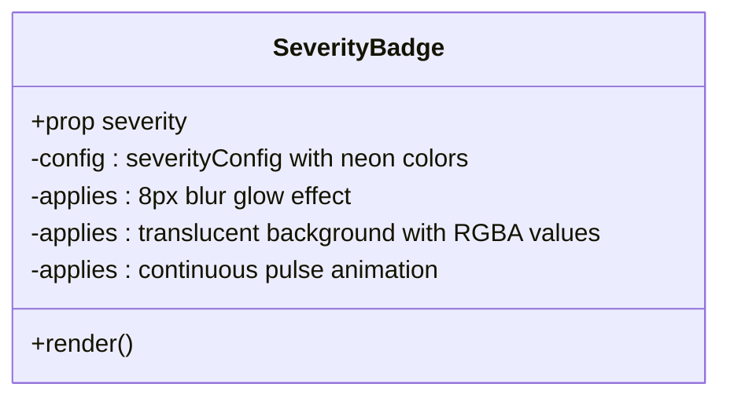

**Diagram sources**
- [SeverityBadge.jsx:1-47](file://frontend/src/components/common/SeverityBadge.jsx#L1-L47)

**Section sources**
- [SeverityBadge.jsx:1-47](file://frontend/src/components/common/SeverityBadge.jsx#L1-L47)

#### Enhanced LoadingSkeleton
The LoadingSkeleton implements sophisticated shimmer animations for loading states.

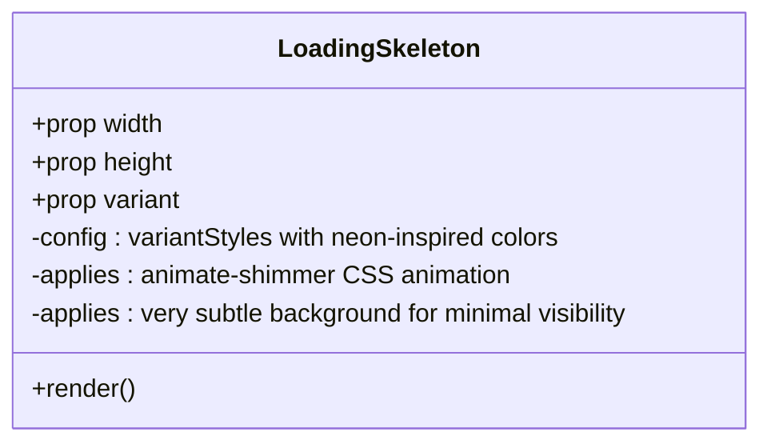

**Diagram sources**
- [LoadingSkeleton.jsx:1-38](file://frontend/src/components/common/LoadingSkeleton.jsx#L1-L38)

**Section sources**
- [LoadingSkeleton.jsx:1-38](file://frontend/src/components/common/LoadingSkeleton.jsx#L1-L38)

#### Enhanced WhatThisMeansPanel
The WhatThisMeansPanel dynamically interprets network data with real-time color assignment and cyberpunk styling.

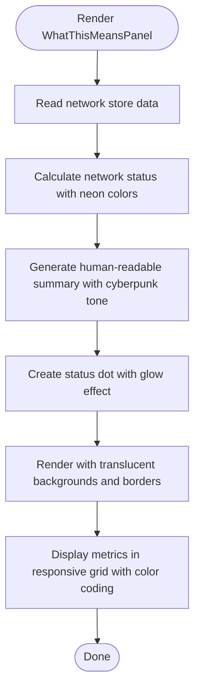

**Diagram sources**
- [WhatThisMeansPanel.jsx:1-113](file://frontend/src/components/dashboard/WhatThisMeansPanel.jsx#L1-L113)

**Section sources**
- [WhatThisMeansPanel.jsx:1-113](file://frontend/src/components/dashboard/WhatThisMeansPanel.jsx#L1-L113)

### Enhanced Dashboard Components

#### TpsCard
The TpsCard integrates Lucide React icons with enhanced metric card styling and interactive charts.

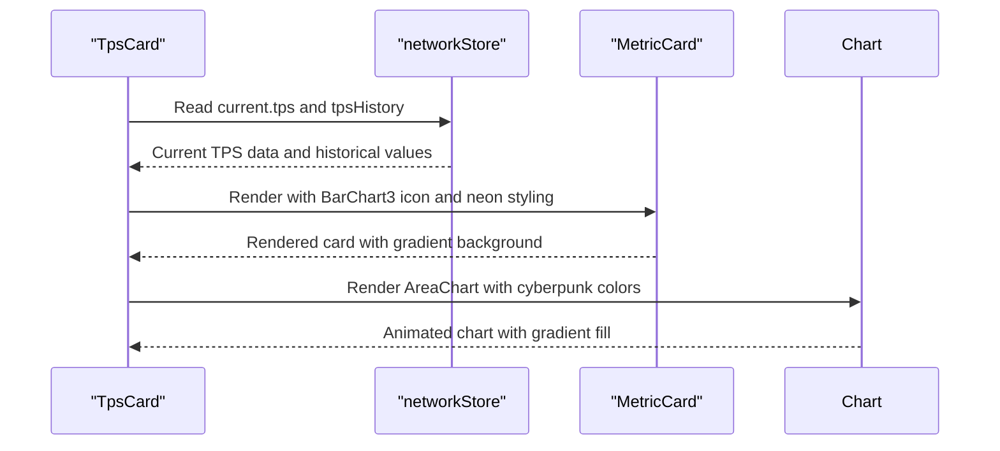

**Diagram sources**
- [TpsCard.jsx:1-55](file://frontend/src/components/dashboard/TpsCard.jsx#L1-L55)
- [MetricCard.jsx:1-109](file://frontend/src/components/common/MetricCard.jsx#L1-L109)

**Section sources**
- [TpsCard.jsx:1-55](file://frontend/src/components/dashboard/TpsCard.jsx#L1-L55)

#### Enhanced EpochProgressCard
The EpochProgressCard features sophisticated progress visualization with shimmer animations and gradient effects.

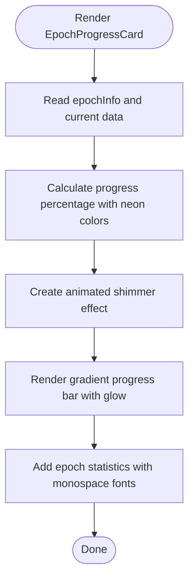

**Diagram sources**
- [EpochProgressCard.jsx:1-101](file://frontend/src/components/dashboard/EpochProgressCard.jsx#L1-L101)

**Section sources**
- [EpochProgressCard.jsx:1-101](file://frontend/src/components/dashboard/EpochProgressCard.jsx#L1-L101)

#### Enhanced DashboardSkeleton
The DashboardSkeleton provides comprehensive loading states with cyberpunk styling.

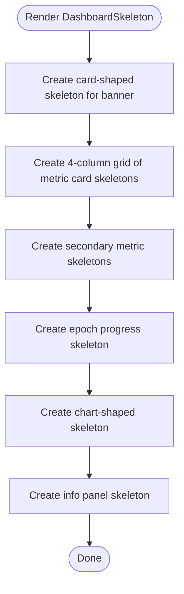

**Diagram sources**
- [DashboardSkeleton.jsx:1-35](file://frontend/src/components/dashboard/DashboardSkeleton.jsx#L1-L35)

**Section sources**
- [DashboardSkeleton.jsx:1-35](file://frontend/src/components/dashboard/DashboardSkeleton.jsx#L1-L35)

### RPC Monitoring Components

#### Enhanced RpcProviderTable
The RpcProviderTable maintains Lucide React icon integration while implementing cyberpunk styling for data presentation.

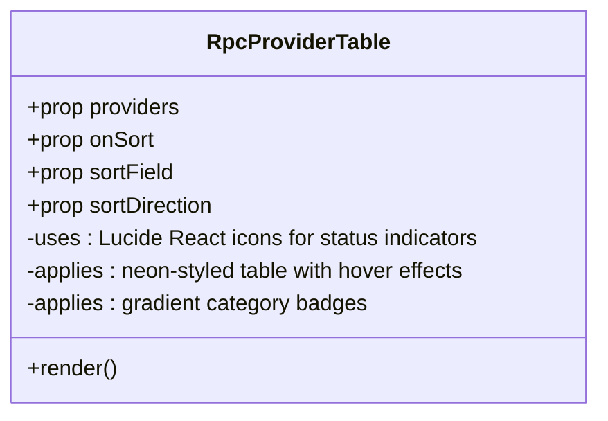

**Diagram sources**
- [RpcProviderTable.jsx:1-177](file://frontend/src/components/rpc/RpcProviderTable.jsx#L1-L177)

**Section sources**
- [RpcProviderTable.jsx:1-177](file://frontend/src/components/rpc/RpcProviderTable.jsx#L1-L177)

#### Enhanced RpcRecommendationBanner
The RpcRecommendationBanner implements cyberpunk styling for performance recommendations.

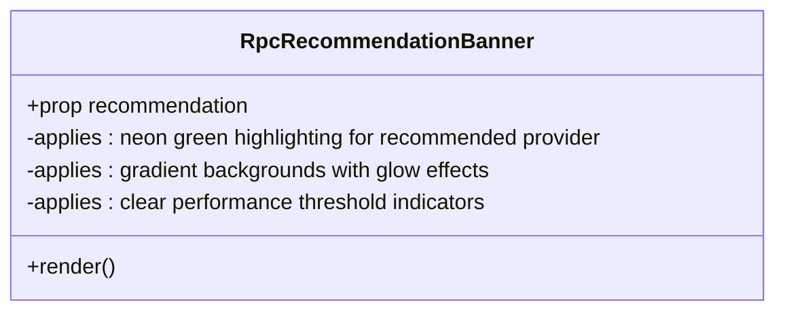

**Diagram sources**
- [RpcRecommendationBanner.jsx:1-63](file://frontend/src/components/rpc/RpcRecommendationBanner.jsx#L1-L63)

**Section sources**
- [RpcRecommendationBanner.jsx:1-63](file://frontend/src/components/rpc/RpcRecommendationBanner.jsx#L1-L63)

### Validator Components

#### Enhanced ValidatorTable
The ValidatorTable implements sophisticated data visualization with cyberpunk styling and interactive features.

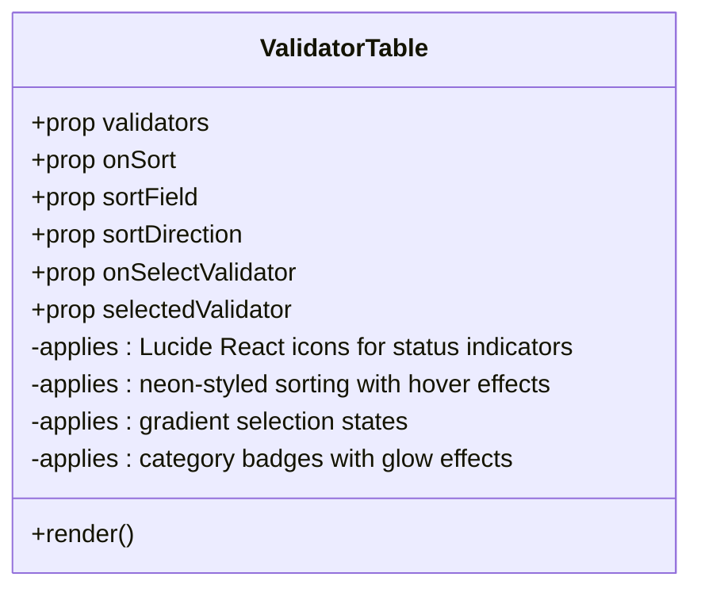

**Diagram sources**
- [ValidatorTable.jsx:1-202](file://frontend/src/components/validators/ValidatorTable.jsx#L1-L202)

**Section sources**
- [ValidatorTable.jsx:1-202](file://frontend/src/components/validators/ValidatorTable.jsx#L1-L202)

#### Enhanced ValidatorDetailPanel
The ValidatorDetailPanel features comprehensive validator information with cyberpunk styling and interactive elements.

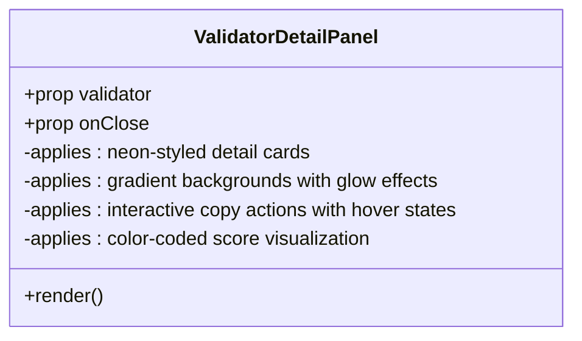

**Diagram sources**
- [ValidatorDetailPanel.jsx:1-218](file://frontend/src/components/validators/ValidatorDetailPanel.jsx#L1-L218)

**Section sources**
- [ValidatorDetailPanel.jsx:1-218](file://frontend/src/components/validators/ValidatorDetailPanel.jsx#L1-L218)

#### Enhanced ValidatorScoreBadge
The ValidatorScoreBadge implements sophisticated color-coding with cyberpunk styling.

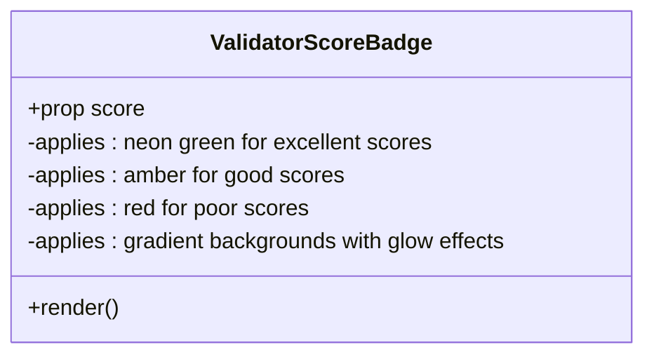

**Diagram sources**
- [ValidatorScoreBadge.jsx:1-49](file://frontend/src/components/validators/ValidatorScoreBadge.jsx#L1-L49)

**Section sources**
- [ValidatorScoreBadge.jsx:1-49](file://frontend/src/components/validators/ValidatorScoreBadge.jsx#L1-L49)

## Dependency Analysis
The enhanced dependency structure reflects the cyberpunk design integration with strategic icon usage and component specialization.

- **Routing and Entry Point**
  - main.jsx mounts App under StrictMode with enhanced styling
  - App.jsx defines routes nested under AppShell with layout integration

- **Layout Dependencies**
  - AppShell composes Sidebar and Header with grid layout
  - Header depends on router location and network store with glow effects
  - Sidebar uses Lucide React icons for professional navigation while maintaining cyberpunk styling

- **Enhanced Common Dependencies**
  - Icons.jsx provides 14 custom inline SVG components for consistent iconography
  - Hybrid icon system: custom SVG for common components, Lucide React for navigation
  - StatusIndicator, MetricCard, and SeverityBadge implement cyberpunk color schemes
  - WhatThisMeansPanel consumes network store data with dynamic color assignment

- **Feature Components Integration**
  - All components benefit from centralized store consumption
  - Enhanced visual consistency across dashboard, RPC, and validator features
  - Lucide React icons integrated strategically for professional appearance

- **Prop Drilling Prevention**
  - Components consume data from centralized stores rather than parent props
  - Enhanced store architecture supports the cyberpunk design system
  - Reduced prop drilling through global state management

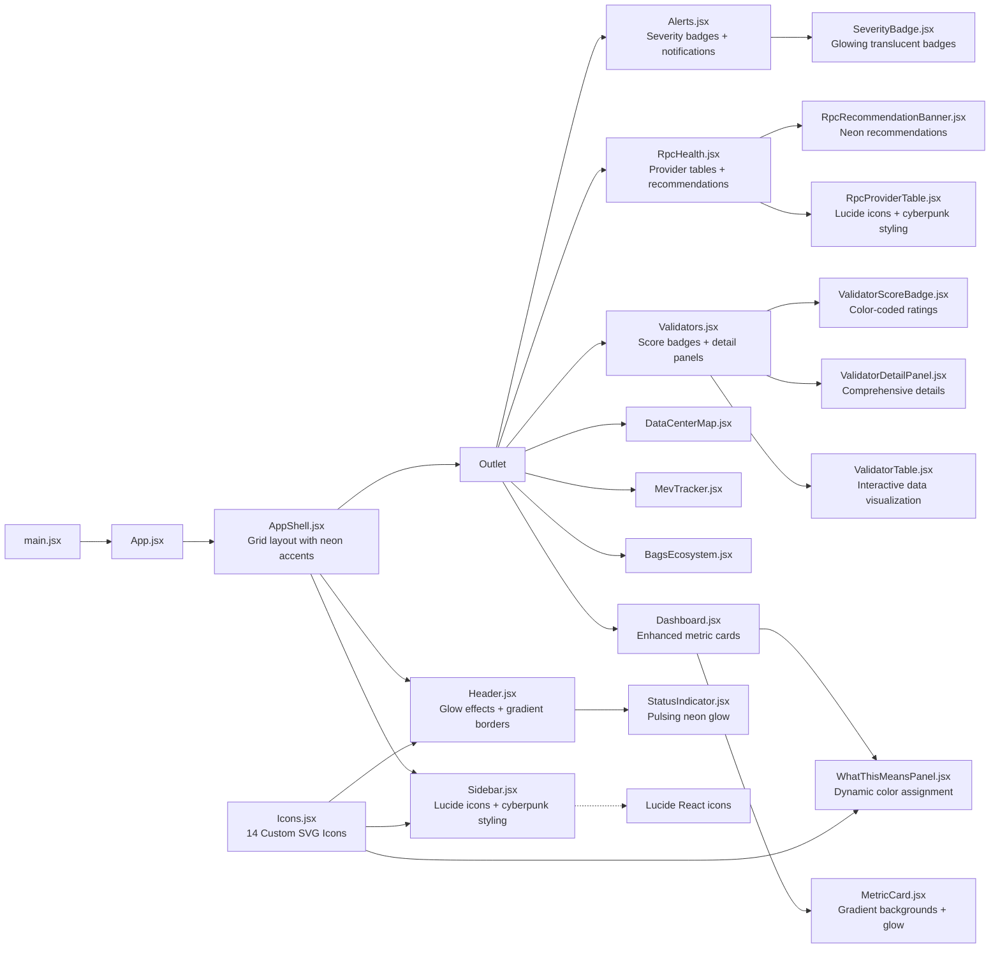

**Diagram sources**
- [main.jsx:1-12](file://frontend/src/main.jsx#L1-L12)
- [App.jsx:1-31](file://frontend/src/App.jsx#L1-L31)
- [AppShell.jsx:1-29](file://frontend/src/components/layout/AppShell.jsx#L1-L29)
- [Sidebar.jsx:1-173](file://frontend/src/components/layout/Sidebar.jsx#L1-L173)
- [Header.jsx:1-104](file://frontend/src/components/layout/Header.jsx#L1-L104)
- [Icons.jsx:1-142](file://frontend/src/components/common/Icons.jsx#L1-L142)
- [WhatThisMeansPanel.jsx:1-113](file://frontend/src/components/dashboard/WhatThisMeansPanel.jsx#L1-L113)
- [MetricCard.jsx:1-109](file://frontend/src/components/common/MetricCard.jsx#L1-L109)
- [ValidatorTable.jsx:1-202](file://frontend/src/components/validators/ValidatorTable.jsx#L1-L202)
- [ValidatorDetailPanel.jsx:1-218](file://frontend/src/components/validators/ValidatorDetailPanel.jsx#L1-L218)
- [ValidatorScoreBadge.jsx:1-49](file://frontend/src/components/validators/ValidatorScoreBadge.jsx#L1-L49)
- [RpcProviderTable.jsx:1-177](file://frontend/src/components/rpc/RpcProviderTable.jsx#L1-L177)
- [RpcRecommendationBanner.jsx:1-63](file://frontend/src/components/rpc/RpcRecommendationBanner.jsx#L1-L63)
- [SeverityBadge.jsx:1-47](file://frontend/src/components/common/SeverityBadge.jsx#L1-L47)
- [StatusIndicator.jsx:1-70](file://frontend/src/components/common/StatusIndicator.jsx#L1-L70)

**Section sources**
- [main.jsx:1-12](file://frontend/src/main.jsx#L1-L12)
- [App.jsx:1-31](file://frontend/src/App.jsx#L1-L31)

## Performance Considerations
The cyberpunk design system maintains optimal performance through strategic optimizations and efficient component architecture.

- **Minimized Re-renders**: Components consume only necessary store slices, reducing unnecessary updates
- **Efficient Memoization**: Expensive computations in tables use optimized sorting and formatting
- **Hardware-Accelerated Animations**: CSS animations and transitions leverage GPU acceleration
- **Icon Performance**: Hybrid icon system reduces bundle size while maintaining visual consistency
- **Memory Management**: Proper cleanup of intervals and event listeners in AppShell
- **Bundle Optimization**: Strategic use of Lucide React icons for navigation while maintaining custom SVG for common components

**Enhanced Performance Optimizations**:
- Custom SVG icons eliminate external dependency overhead compared to lucide-react
- CSS custom properties enable efficient color transitions without JavaScript
- Gradient backgrounds use hardware-accelerated CSS rather than complex DOM manipulation
- Animated glow effects utilize transform properties for optimal performance
- Shimmer animations use pure CSS without JavaScript overhead

## Troubleshooting Guide
Common issues with the enhanced cyberpunk design system and their solutions.

- **Connection status not updating**
  - Verify WebSocket initialization in AppShell and proper interval cleanup
  - Check CSS animation classes for connection pulse effects

- **Incorrect active nav item**
  - Confirm router location usage for active state computation in Sidebar
  - Verify Lucide React icon import and proper className application

- **Header glow effects not visible**
  - Ensure CSS custom properties are properly defined for value colors
  - Check gradient background definitions and animation classes

- **Metric card styling issues**
  - Verify CSS custom properties for dynamic value coloring
  - Confirm gradient background definitions and hover effects

- **Sorting not working in tables**
  - Confirm onSort handlers are properly wired with Lucide React icons
  - Verify sortField/sortDirection props are correctly passed to enhanced tables

- **Missing store data**
  - Ensure stores are properly initialized and subscribed to correct slices
  - Check for proper store integration in enhanced components

- **Icon rendering problems**
  - Verify hybrid icon system: custom SVG for common components, Lucide React for navigation
  - Check className prop application and proper sizing (w-4/h-4, w-5/h-5)

- **Animation performance issues**
  - Ensure CSS animations use transform properties for GPU acceleration
  - Verify proper animation timing functions and durations

- **WhatThisMeansPanel color assignment**
  - Confirm network store data availability before component rendering
  - Check console for calculation errors in status determination logic

**Section sources**
- [AppShell.jsx:1-29](file://frontend/src/components/layout/AppShell.jsx#L1-L29)
- [Sidebar.jsx:1-173](file://frontend/src/components/layout/Sidebar.jsx#L1-L173)
- [Header.jsx:1-104](file://frontend/src/components/layout/Header.jsx#L1-L104)
- [ValidatorTable.jsx:1-202](file://frontend/src/components/validators/ValidatorTable.jsx#L1-L202)
- [RpcProviderTable.jsx:1-177](file://frontend/src/components/rpc/RpcProviderTable.jsx#L1-L177)
- [Icons.jsx:1-142](file://frontend/src/components/common/Icons.jsx#L1-L142)
- [WhatThisMeansPanel.jsx:1-113](file://frontend/src/components/dashboard/WhatThisMeansPanel.jsx#L1-L113)

## Conclusion
The InfraWatch frontend now implements a sophisticated cyberpunk design system with neon-inspired visual elements, glowing effects, and gradient accents. The architecture maintains clean separation of concerns while delivering an immersive user experience through enhanced layout components, custom SVG icon system, and advanced metric cards. The hybrid icon approach (custom SVG + Lucide React) ensures both performance and visual consistency across the application. Components leverage centralized store architecture to prevent prop drilling while implementing sophisticated animations and visual effects. The enhanced dashboard skeleton provides comprehensive loading states, and the status indicators, metric cards, and severity badges consistently apply the cyberpunk aesthetic throughout the interface. This design system successfully balances visual appeal with performance optimization and maintainability.