# Component Architecture

<cite>
**Referenced Files in This Document**
- [main.jsx](file://frontend/src/main.jsx)
- [App.jsx](file://frontend/src/App.jsx)
- [AppShell.jsx](file://frontend/src/components/layout/AppShell.jsx)
- [Header.jsx](file://frontend/src/components/layout/Header.jsx)
- [Sidebar.jsx](file://frontend/src/components/layout/Sidebar.jsx)
- [Icons.jsx](file://frontend/src/components/common/Icons.jsx)
- [LoadingSkeleton.jsx](file://frontend/src/components/common/LoadingSkeleton.jsx)
- [MetricCard.jsx](file://frontend/src/components/common/MetricCard.jsx)
- [SeverityBadge.jsx](file://frontend/src/components/common/SeverityBadge.jsx)
- [StatusIndicator.jsx](file://frontend/src/components/common/StatusIndicator.jsx)
- [WhatThisMeansPanel.jsx](file://frontend/src/components/dashboard/WhatThisMeansPanel.jsx)
- [ActiveValidatorsCard.jsx](file://frontend/src/components/dashboard/ActiveValidatorsCard.jsx)
- [RpcProviderTable.jsx](file://frontend/src/components/rpc/RpcProviderTable.jsx)
- [RpcRecommendationBanner.jsx](file://frontend/src/components/rpc/RpcRecommendationBanner.jsx)
- [ValidatorDetailPanel.jsx](file://frontend/src/components/validators/ValidatorDetailPanel.jsx)
- [ValidatorScoreBadge.jsx](file://frontend/src/components/validators/ValidatorScoreBadge.jsx)
- [ValidatorTable.jsx](file://frontend/src/components/validators/ValidatorTable.jsx)
</cite>

## Update Summary
**Changes Made**
- Added new custom SVG icon system (Icons.jsx) with 13 inline SVG components replacing lucide-react dependency
- Enhanced layout components with improved header and sidebar functionality including visual effects and animations
- Added new common component WhatThisMeansPanel for network status interpretation
- Updated component composition patterns to utilize custom icon system
- Enhanced visual styling with advanced CSS effects including glow, pulse, and gradient animations

## Table of Contents
1. [Introduction](#introduction)
2. [Project Structure](#project-structure)
3. [Core Components](#core-components)
4. [Architecture Overview](#architecture-overview)
5. [Detailed Component Analysis](#detailed-component-analysis)
6. [Dependency Analysis](#dependency-analysis)
7. [Performance Considerations](#performance-considerations)
8. [Troubleshooting Guide](#troubleshooting-guide)
9. [Conclusion](#conclusion)

## Introduction
This document describes the component architecture of the InfraWatch frontend. It focuses on the main layout container AppShell, reusable common components including the new custom SVG icon system, dashboard-specific widgets, RPC monitoring components, and validator components. It explains component composition patterns, prop interfaces, lifecycle management, layout integration, styling and responsiveness, accessibility, and how the store architecture prevents prop drilling.

## Project Structure
The frontend is a React application bootstrapped with Vite. The routing is configured at the root App level, and page-level components are rendered inside AppShell, which manages the global layout (sidebar and header) and delegates page content via Outlet.

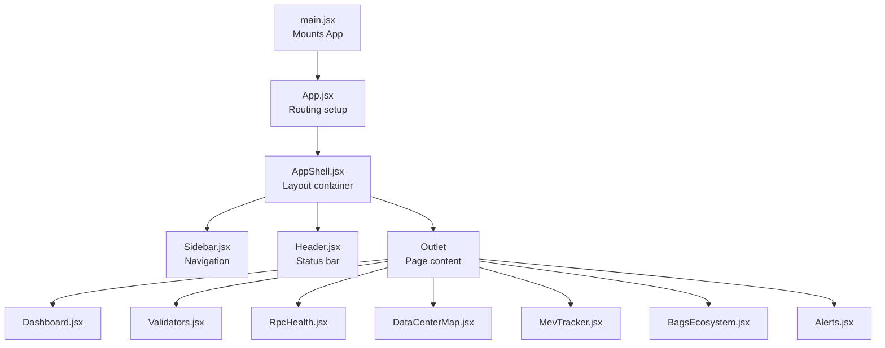

**Diagram sources**
- [main.jsx:1-12](file://frontend/src/main.jsx#L1-L12)
- [App.jsx:1-31](file://frontend/src/App.jsx#L1-L31)
- [AppShell.jsx:1-40](file://frontend/src/components/layout/AppShell.jsx#L1-L40)
- [Sidebar.jsx:1-149](file://frontend/src/components/layout/Sidebar.jsx#L1-L149)
- [Header.jsx:1-105](file://frontend/src/components/layout/Header.jsx#L1-L105)

**Section sources**
- [main.jsx:1-12](file://frontend/src/main.jsx#L1-L12)
- [App.jsx:1-31](file://frontend/src/App.jsx#L1-L31)

## Core Components
This section documents the layout and common components that form the foundation of the UI, including the new custom SVG icon system and enhanced visual components.

### Custom SVG Icon System (Icons.jsx)
**Updated** Added comprehensive custom SVG icon system with 13 inline SVG components replacing lucide-react dependency.

- Purpose: Provides 13 custom inline SVG icons for all interface elements with consistent styling
- Implementation: Each icon accepts className prop for size and styling customization
- Usage: Replaces external lucide-react dependency with zero-runtime overhead
- Icons included: Bell, AlertTriangle, AlertCircle, Info, CheckCircle, Settings, Filter, Wallet, ArrowRightLeft, Users, MapPin, Server, Globe, Zap, TrendingUp, Target, Coins

### Enhanced Layout Components

#### AppShell
- Purpose: Root layout container that composes Sidebar, Header, and renders page content via Outlet.
- Lifecycle: Initializes connection status and last update timestamps, simulates periodic updates.
- Props: None (owns state for connection metadata).
- Composition: Renders Sidebar and Header, then wraps Outlet in a flex column with main content area.

#### Header
- Purpose: Displays page title and connection status indicators with enhanced visual effects.
- Lifecycle: Uses router location to derive title; reads connection state from network store.
- Props: None (consumes store).
- Accessibility: Uses semantic heading and concise labels; relies on StatusIndicator for status semantics.
- **Enhanced Features**: Includes animated connection pulse, gradient borders, and timestamp glow effects.

#### Sidebar
- Purpose: Fixed navigation drawer with logo, nav links, and footer.
- Lifecycle: Computes active state from router location; applies active styles with enhanced visual feedback.
- Props: None (uses router).
- Accessibility: Uses NavLink for keyboard-friendly navigation; maintains focus order.
- **Enhanced Features**: Includes animated logo, gradient separators, active state indicators with pronounced left borders, and visual grouping.

### Enhanced Common Components

#### StatusIndicator
- Purpose: Visual indicator for health/degraded/critical states with optional label and size variants.
- Props: status, label, size.
- Reusability: Used across Header, RPC, and Validator components.
- **Enhanced Features**: Improved glow effects, pulse animations, and consistent sizing across all components.

#### MetricCard
- Purpose: Card component for metrics with status, trend, and optional embedded content.
- Props: title, value, subtitle, trend, trendValue, status, icon, children.
- Reusability: Used by dashboard cards.
- **Enhanced Features**: Advanced hover effects, gradient glows, and dynamic color transitions.

#### SeverityBadge
- Purpose: Badge for alert severity with color-coded styling.
- Props: severity.
- Reusability: Generic badge for alerts and logs.
- **Enhanced Features**: Pulse animations, shadow effects, and consistent visual hierarchy.

#### LoadingSkeleton
- Purpose: Skeleton loading placeholders with configurable variants.
- Props: width, height, variant.
- Reusability: Used wherever async content is pending.

#### WhatThisMeansPanel
**New** Added dedicated component for interpreting network status and providing actionable insights.

- Purpose: Interprets network metrics and provides human-readable explanations of network conditions.
- Props: None (consumes network store data).
- Features: Dynamic status assessment, color-coded summaries, and key metric breakdowns.
- Usage: Displays network health interpretation with TPS status, congestion levels, validator health, and confirmation times.

**Section sources**
- [Icons.jsx:1-136](file://frontend/src/components/common/Icons.jsx#L1-L136)
- [AppShell.jsx:1-40](file://frontend/src/components/layout/AppShell.jsx#L1-L40)
- [Header.jsx:1-105](file://frontend/src/components/layout/Header.jsx#L1-L105)
- [Sidebar.jsx:1-149](file://frontend/src/components/layout/Sidebar.jsx#L1-L149)
- [StatusIndicator.jsx:1-70](file://frontend/src/components/common/StatusIndicator.jsx#L1-L70)
- [MetricCard.jsx:1-108](file://frontend/src/components/common/MetricCard.jsx#L1-L108)
- [SeverityBadge.jsx:1-47](file://frontend/src/components/common/SeverityBadge.jsx#L1-L47)
- [LoadingSkeleton.jsx:1-38](file://frontend/src/components/common/LoadingSkeleton.jsx#L1-L38)
- [WhatThisMeansPanel.jsx:1-113](file://frontend/src/components/dashboard/WhatThisMeansPanel.jsx#L1-L113)

## Architecture Overview
The layout system centers around AppShell, which embeds Sidebar and Header. Page-level components render inside Outlet. Common components encapsulate shared UI patterns and are consumed by dashboard, RPC, and validator features. The new custom icon system provides consistent visual elements across all components.

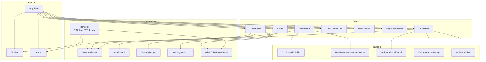

**Diagram sources**
- [AppShell.jsx:1-40](file://frontend/src/components/layout/AppShell.jsx#L1-L40)
- [Sidebar.jsx:1-149](file://frontend/src/components/layout/Sidebar.jsx#L1-L149)
- [Header.jsx:1-105](file://frontend/src/components/layout/Header.jsx#L1-L105)
- [Icons.jsx:1-136](file://frontend/src/components/common/Icons.jsx#L1-L136)
- [WhatThisMeansPanel.jsx:1-113](file://frontend/src/components/dashboard/WhatThisMeansPanel.jsx#L1-L113)
- [MetricCard.jsx:1-108](file://frontend/src/components/common/MetricCard.jsx#L1-L108)
- [StatusIndicator.jsx:1-70](file://frontend/src/components/common/StatusIndicator.jsx#L1-L70)
- [SeverityBadge.jsx:1-47](file://frontend/src/components/common/SeverityBadge.jsx#L1-L47)
- [LoadingSkeleton.jsx:1-38](file://frontend/src/components/common/LoadingSkeleton.jsx#L1-L38)
- [RpcProviderTable.jsx:1-177](file://frontend/src/components/rpc/RpcProviderTable.jsx#L1-L177)
- [RpcRecommendationBanner.jsx:1-63](file://frontend/src/components/rpc/RpcRecommendationBanner.jsx#L1-L63)
- [ValidatorDetailPanel.jsx:1-218](file://frontend/src/components/validators/ValidatorDetailPanel.jsx#L1-L218)
- [ValidatorScoreBadge.jsx:1-49](file://frontend/src/components/validators/ValidatorScoreBadge.jsx#L1-L49)
- [ValidatorTable.jsx:1-202](file://frontend/src/components/validators/ValidatorTable.jsx#L1-L202)

## Detailed Component Analysis

### Layout Container: AppShell
- Composition: Holds Sidebar, Header, and Outlet; manages lightweight connection metadata state.
- Lifecycle: Sets up periodic updates to simulate live data.
- Integration: Delegates page rendering to Outlet; page-level components receive props from stores, not AppShell.

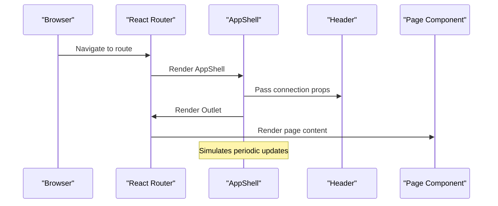

**Diagram sources**
- [AppShell.jsx:1-40](file://frontend/src/components/layout/AppShell.jsx#L1-L40)
- [Header.jsx:1-105](file://frontend/src/components/layout/Header.jsx#L1-L105)
- [App.jsx:1-31](file://frontend/src/App.jsx#L1-L31)

**Section sources**
- [AppShell.jsx:1-40](file://frontend/src/components/layout/AppShell.jsx#L1-L40)

### Header Component
- Responsibilities: Displays page title derived from router location; shows connection status and last update time.
- Store integration: Reads connection state from network store.
- Accessibility: Uses semantic heading and concise labels; relies on StatusIndicator for accessible status semantics.
- **Enhanced Features**: Animated connection pulse, gradient border effects, timestamp glow, and sophisticated visual feedback.

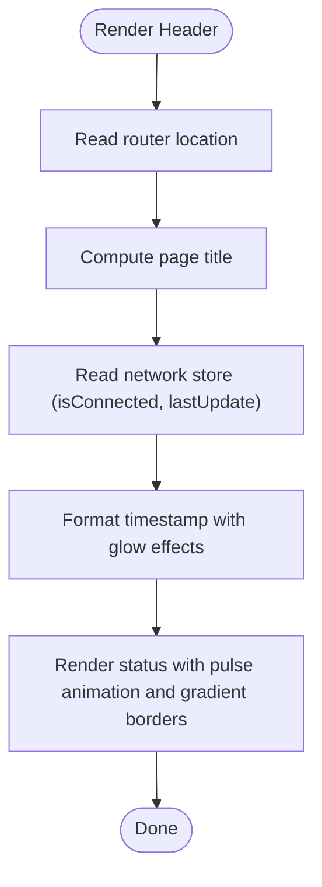

**Diagram sources**
- [Header.jsx:1-105](file://frontend/src/components/layout/Header.jsx#L1-L105)

**Section sources**
- [Header.jsx:1-105](file://frontend/src/components/layout/Header.jsx#L1-L105)

### Sidebar Component
- Responsibilities: Fixed navigation drawer with logo, nav items, and footer.
- Behavior: Computes active state from router location; applies active styles and icons.
- Accessibility: Uses NavLink for keyboard navigation; maintains focus order.
- **Enhanced Features**: Animated logo with gradient effects, visual grouping with separators, pronounced active indicators, and improved hover states.

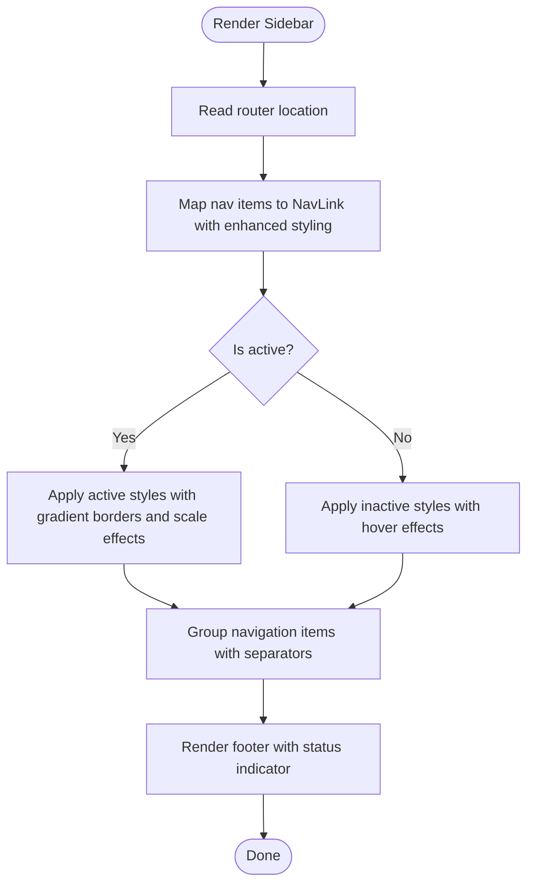

**Diagram sources**
- [Sidebar.jsx:1-149](file://frontend/src/components/layout/Sidebar.jsx#L1-L149)

**Section sources**
- [Sidebar.jsx:1-149](file://frontend/src/components/layout/Sidebar.jsx#L1-L149)

### Common Components

#### StatusIndicator
- Props: status, label, size.
- Variants: size sm/md/lg; status healthy/degraded/critical.
- Usage: Consistently used across Header, RPC, and Validator components.
- **Enhanced Features**: Advanced glow effects, pulse animations, and consistent visual hierarchy.

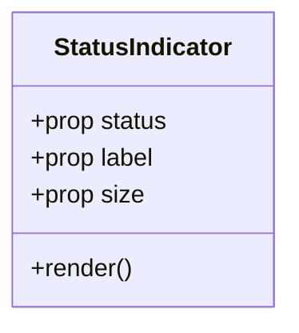

**Diagram sources**
- [StatusIndicator.jsx:1-70](file://frontend/src/components/common/StatusIndicator.jsx#L1-L70)

**Section sources**
- [StatusIndicator.jsx:1-70](file://frontend/src/components/common/StatusIndicator.jsx#L1-L70)

#### MetricCard
- Props: title, value, subtitle, trend, trendValue, status, icon, children.
- Composition: Card body with header, value, subtitle/trend, optional embedded content.
- **Enhanced Features**: Hover scaling effects, gradient backgrounds, dynamic color transitions, and sophisticated visual feedback.

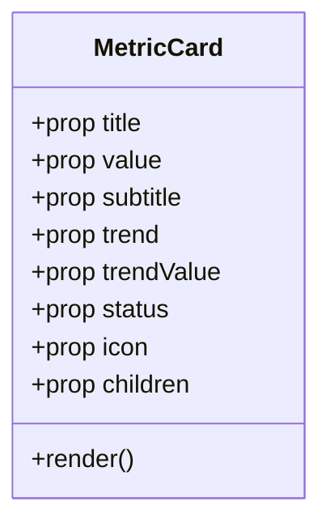

**Diagram sources**
- [MetricCard.jsx:1-108](file://frontend/src/components/common/MetricCard.jsx#L1-L108)

**Section sources**
- [MetricCard.jsx:1-108](file://frontend/src/components/common/MetricCard.jsx#L1-L108)

#### SeverityBadge
- Props: severity.
- Usage: Severity badges for alerts and logs.
- **Enhanced Features**: Pulse animations, shadow effects, and consistent visual hierarchy.

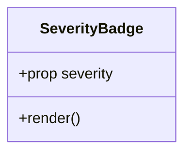

**Diagram sources**
- [SeverityBadge.jsx:1-47](file://frontend/src/components/common/SeverityBadge.jsx#L1-L47)

**Section sources**
- [SeverityBadge.jsx:1-47](file://frontend/src/components/common/SeverityBadge.jsx#L1-L47)

#### LoadingSkeleton
- Props: width, height, variant.
- Usage: Skeleton placeholders during async loads.

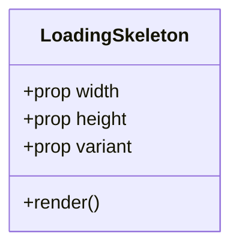

**Diagram sources**
- [LoadingSkeleton.jsx:1-38](file://frontend/src/components/common/LoadingSkeleton.jsx#L1-L38)

**Section sources**
- [LoadingSkeleton.jsx:1-38](file://frontend/src/components/common/LoadingSkeleton.jsx#L1-L38)

#### WhatThisMeansPanel
**New** Dedicated component for interpreting network status and providing actionable insights.

- Purpose: Analyzes network metrics and generates human-readable explanations of current network conditions.
- Data Processing: Evaluates TPS, congestion score, delinquent validators, and confirmation times to determine network status.
- Visual Design: Uses color-coded status indicators, structured summary text, and key metric breakdowns.
- Responsive Layout: Grid-based metric display that adapts to different screen sizes.

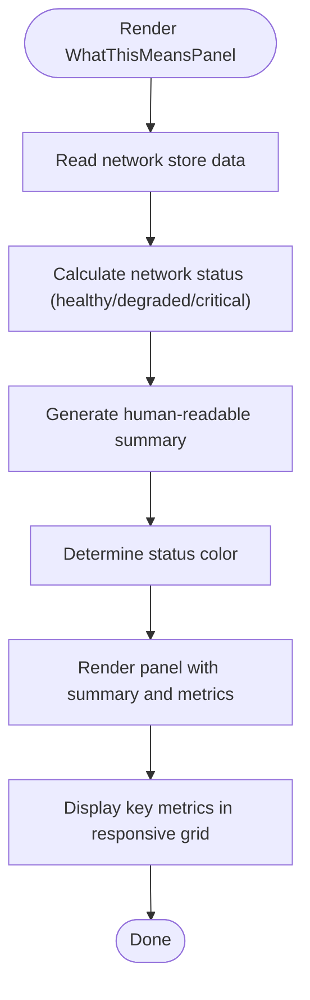

**Diagram sources**
- [WhatThisMeansPanel.jsx:1-113](file://frontend/src/components/dashboard/WhatThisMeansPanel.jsx#L1-L113)

**Section sources**
- [WhatThisMeansPanel.jsx:1-113](file://frontend/src/components/dashboard/WhatThisMeansPanel.jsx#L1-L113)

### Dashboard Components

#### ActiveValidatorsCard
- Props: none (reads from network store).
- Composition: Uses MetricCard to present active validator count and deviation from baseline.

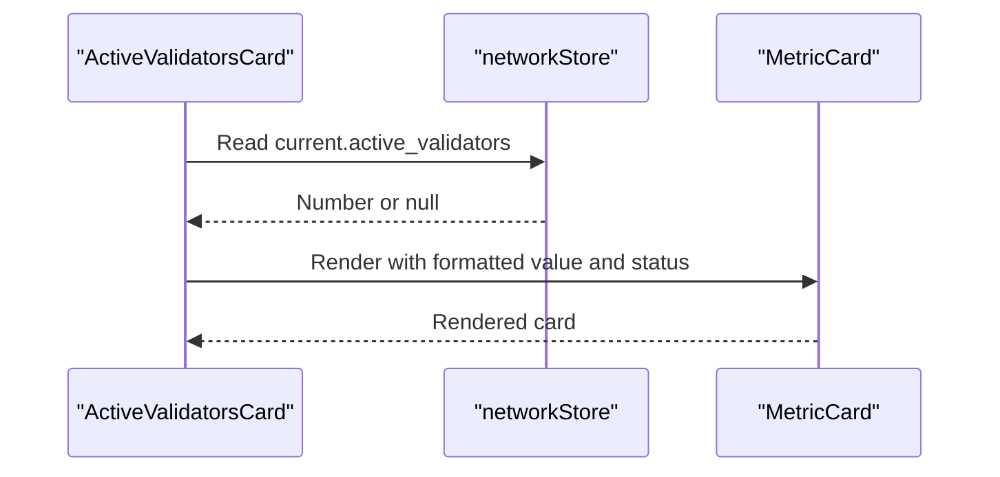

**Diagram sources**
- [ActiveValidatorsCard.jsx:1-24](file://frontend/src/components/dashboard/ActiveValidatorsCard.jsx#L1-L24)
- [MetricCard.jsx:1-108](file://frontend/src/components/common/MetricCard.jsx#L1-L108)

**Section sources**
- [ActiveValidatorsCard.jsx:1-24](file://frontend/src/components/dashboard/ActiveValidatorsCard.jsx#L1-L24)

### RPC Monitoring Components

#### RpcProviderTable
- Props: providers, onSort, sortField, sortDirection.
- Behavior: Sortable table with status, latency, percentiles, uptime, and last incident; hover and selection states; category badges.

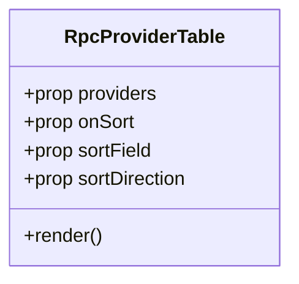

**Diagram sources**
- [RpcProviderTable.jsx:1-177](file://frontend/src/components/rpc/RpcProviderTable.jsx#L1-L177)

**Section sources**
- [RpcProviderTable.jsx:1-177](file://frontend/src/components/rpc/RpcProviderTable.jsx#L1-L177)

#### RpcRecommendationBanner
- Props: recommendation (name, latencyMs).
- Behavior: Highlights fastest provider; shows threshold guidance.

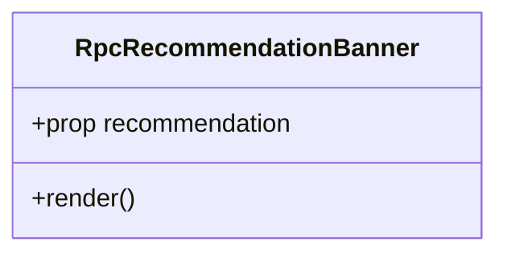

**Diagram sources**
- [RpcRecommendationBanner.jsx:1-63](file://frontend/src/components/rpc/RpcRecommendationBanner.jsx#L1-L63)

**Section sources**
- [RpcRecommendationBanner.jsx:1-63](file://frontend/src/components/rpc/RpcRecommendationBanner.jsx#L1-L63)

### Validator Components

#### ValidatorTable
- Props: validators, onSort, sortField, sortDirection, onSelectValidator, selectedValidator.
- Behavior: Sortable table with avatar/name, score, stake, commission, skip rate, version, data center, delinquency status; hover and selection visuals.

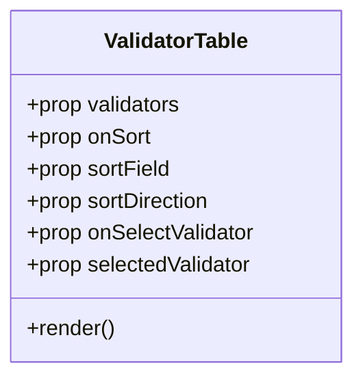

**Diagram sources**
- [ValidatorTable.jsx:1-202](file://frontend/src/components/validators/ValidatorTable.jsx#L1-L202)

**Section sources**
- [ValidatorTable.jsx:1-202](file://frontend/src/components/validators/ValidatorTable.jsx#L1-L202)

#### ValidatorDetailPanel
- Props: validator, onClose.
- Behavior: Detailed panel with avatar/name, scores, stake, commission, skip rate, software version, data center, Jito status, delinquency, and identity pubkey with copy actions.

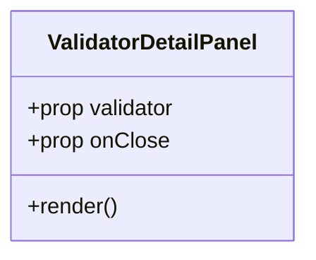

**Diagram sources**
- [ValidatorDetailPanel.jsx:1-218](file://frontend/src/components/validators/ValidatorDetailPanel.jsx#L1-L218)

**Section sources**
- [ValidatorDetailPanel.jsx:1-218](file://frontend/src/components/validators/ValidatorDetailPanel.jsx#L1-L218)

#### ValidatorScoreBadge
- Props: score.
- Behavior: Color-coded badge representing validator score.

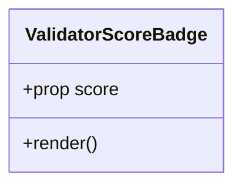

**Diagram sources**
- [ValidatorScoreBadge.jsx:1-49](file://frontend/src/components/validators/ValidatorScoreBadge.jsx#L1-L49)

**Section sources**
- [ValidatorScoreBadge.jsx:1-49](file://frontend/src/components/validators/ValidatorScoreBadge.jsx#L1-L49)

## Dependency Analysis
- Routing and entry point
  - main.jsx mounts App under StrictMode.
  - App.jsx defines routes and nests pages under AppShell.
- Layout dependencies
  - AppShell composes Sidebar and Header; renders Outlet for page content.
  - Header depends on router location and network store.
  - Sidebar depends on router location for active state.
- **Enhanced Common Dependencies**
  - Icons.jsx provides 13 inline SVG components replacing lucide-react dependency.
  - All components now share consistent iconography through the custom system.
  - WhatThisMeansPanel consumes network store data for intelligent status interpretation.
- Feature components depend on common components for consistent UI:
  - StatusIndicator used broadly for status semantics.
  - MetricCard used by dashboard cards.
  - ValidatorScoreBadge used by validator table and detail panel.
- Prop drilling prevention
  - Components consume data from centralized stores (e.g., network store) rather than receiving props from parent containers, reducing prop drilling.

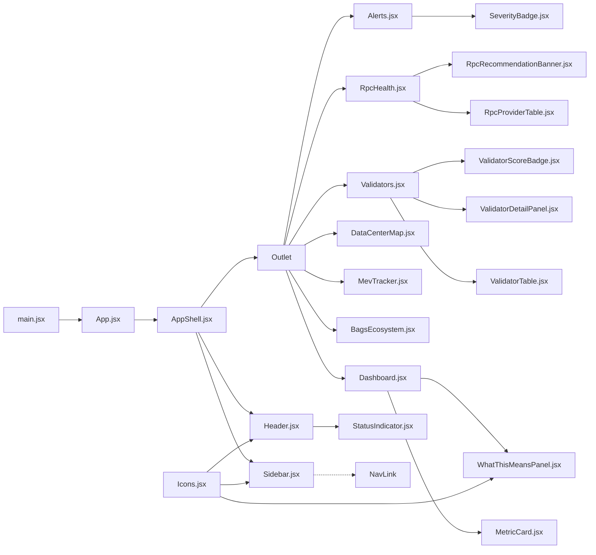

**Diagram sources**
- [main.jsx:1-12](file://frontend/src/main.jsx#L1-L12)
- [App.jsx:1-31](file://frontend/src/App.jsx#L1-L31)
- [AppShell.jsx:1-40](file://frontend/src/components/layout/AppShell.jsx#L1-L40)
- [Sidebar.jsx:1-149](file://frontend/src/components/layout/Sidebar.jsx#L1-L149)
- [Header.jsx:1-105](file://frontend/src/components/layout/Header.jsx#L1-L105)
- [Icons.jsx:1-136](file://frontend/src/components/common/Icons.jsx#L1-L136)
- [WhatThisMeansPanel.jsx:1-113](file://frontend/src/components/dashboard/WhatThisMeansPanel.jsx#L1-L113)
- [MetricCard.jsx:1-108](file://frontend/src/components/common/MetricCard.jsx#L1-L108)
- [ValidatorTable.jsx:1-202](file://frontend/src/components/validators/ValidatorTable.jsx#L1-L202)
- [ValidatorDetailPanel.jsx:1-218](file://frontend/src/components/validators/ValidatorDetailPanel.jsx#L1-L218)
- [ValidatorScoreBadge.jsx:1-49](file://frontend/src/components/validators/ValidatorScoreBadge.jsx#L1-L49)
- [RpcProviderTable.jsx:1-177](file://frontend/src/components/rpc/RpcProviderTable.jsx#L1-L177)
- [RpcRecommendationBanner.jsx:1-63](file://frontend/src/components/rpc/RpcRecommendationBanner.jsx#L1-L63)
- [SeverityBadge.jsx:1-47](file://frontend/src/components/common/SeverityBadge.jsx#L1-L47)
- [StatusIndicator.jsx:1-70](file://frontend/src/components/common/StatusIndicator.jsx#L1-L70)

**Section sources**
- [main.jsx:1-12](file://frontend/src/main.jsx#L1-L12)
- [App.jsx:1-31](file://frontend/src/App.jsx#L1-L31)

## Performance Considerations
- Minimize re-renders by consuming only necessary slices of state from stores.
- Use memoization for expensive computations in tables (sorting, formatting) and avoid unnecessary deep comparisons.
- Prefer virtualized lists for large datasets in tables.
- Defer heavy computations off the main thread when possible.
- Keep component trees shallow to reduce render cost.
- **Enhanced Performance**: Custom SVG icons eliminate external dependency overhead and reduce bundle size compared to lucide-react.
- **Visual Effects Optimization**: CSS animations and transitions are hardware-accelerated for smooth performance across components.

## Troubleshooting Guide
- Connection status not updating
  - Verify periodic update logic in AppShell and ensure intervals are cleared on unmount.
- Incorrect active nav item
  - Confirm router location is used to compute active state in Sidebar.
- Header timestamps not visible
  - Ensure lastUpdate is passed to Header and formatted correctly.
- Sorting not working in tables
  - Confirm onSort handlers are wired and sortField/sortDirection props are passed to tables.
- Missing store data
  - Ensure stores are initialized and components subscribe to the correct store slices.
- **Icon rendering issues**
  - Verify custom SVG icons are properly imported and className props are correctly applied.
- **Visual effects not appearing**
  - Check CSS animations and gradient definitions are properly loaded in the stylesheet.
- **WhatThisMeansPanel not displaying**
  - Ensure network store has data before component renders and check console for any calculation errors.

**Section sources**
- [AppShell.jsx:1-40](file://frontend/src/components/layout/AppShell.jsx#L1-L40)
- [Sidebar.jsx:1-149](file://frontend/src/components/layout/Sidebar.jsx#L1-L149)
- [Header.jsx:1-105](file://frontend/src/components/layout/Header.jsx#L1-L105)
- [ValidatorTable.jsx:1-202](file://frontend/src/components/validators/ValidatorTable.jsx#L1-L202)
- [RpcProviderTable.jsx:1-177](file://frontend/src/components/rpc/RpcProviderTable.jsx#L1-L177)
- [Icons.jsx:1-136](file://frontend/src/components/common/Icons.jsx#L1-L136)
- [WhatThisMeansPanel.jsx:1-113](file://frontend/src/components/dashboard/WhatThisMeansPanel.jsx#L1-L113)

## Conclusion
InfraWatch's frontend employs a clean layout-first architecture centered on AppShell, with reusable common components including the new custom SVG icon system ensuring consistency and performance. The enhanced visual effects with CSS animations and gradients provide rich user experience while maintaining optimal performance. Feature components are organized by domain (dashboard, RPC, validators) and rely on centralized stores to prevent prop drilling. The addition of WhatThisMeansPanel provides intelligent network interpretation for better user understanding. The design emphasizes composability, accessibility, visual appeal, and maintainability, with clear separation of concerns across layout, common UI with custom icons, and feature-specific components.