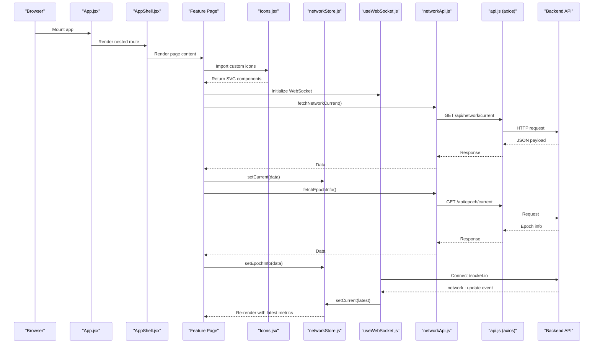
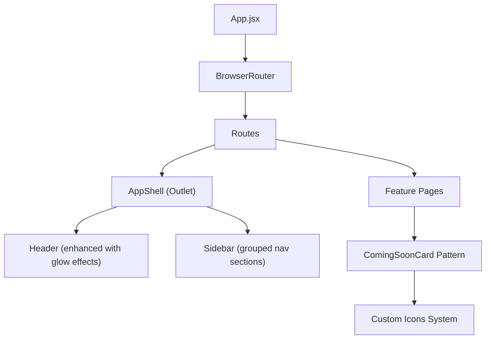
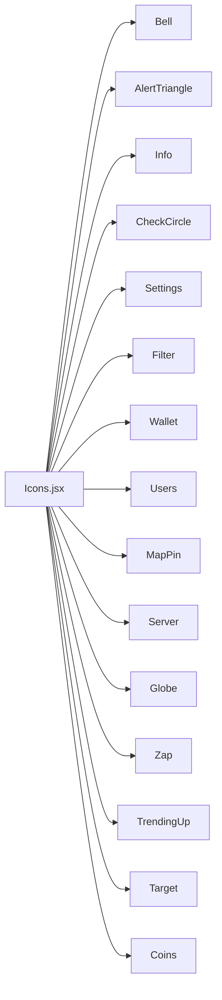
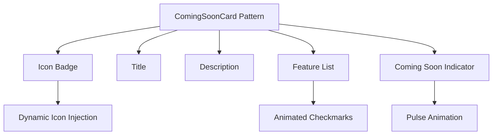
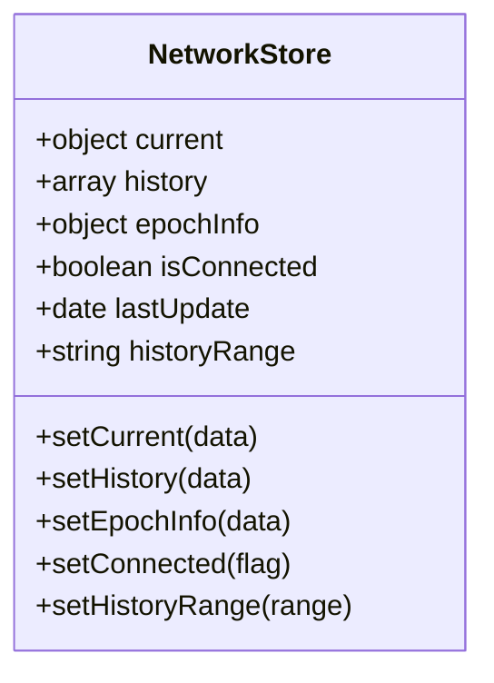
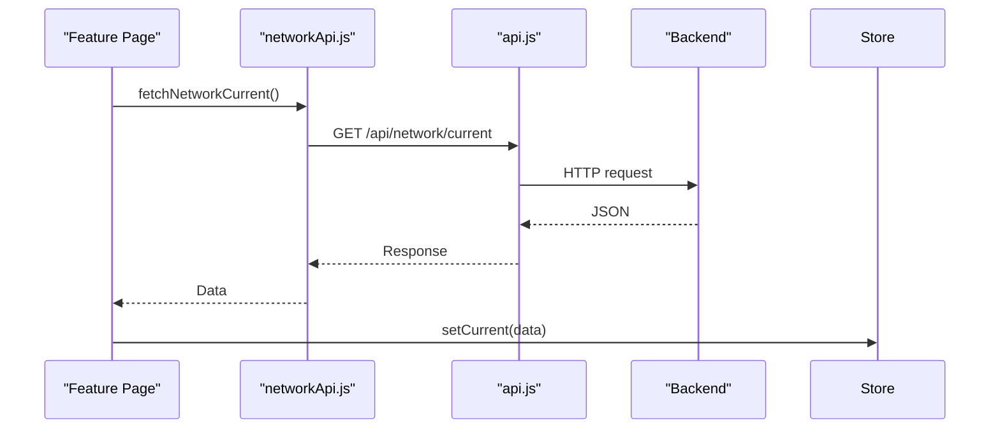
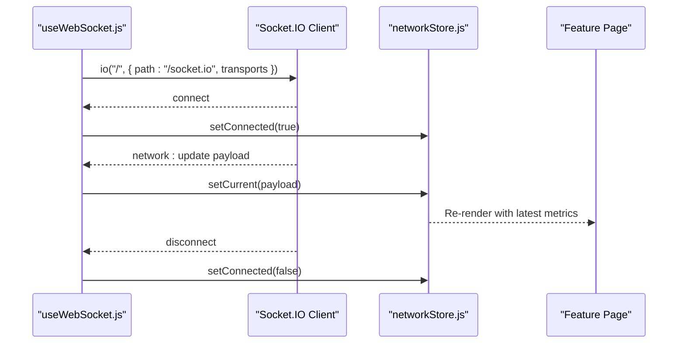
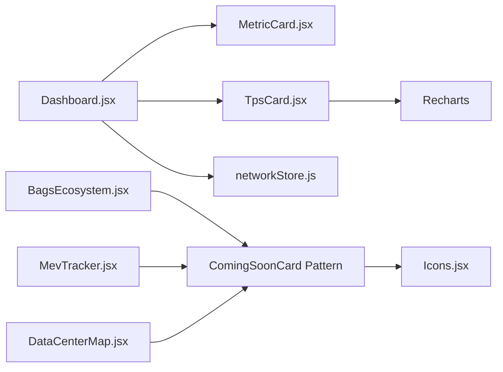
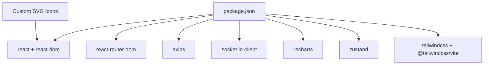

# Frontend Architecture

<cite>
**Referenced Files in This Document**
- [main.jsx](file://frontend/src/main.jsx)
- [App.jsx](file://frontend/src/App.jsx)
- [vite.config.js](file://frontend/vite.config.js)
- [package.json](file://frontend/package.json)
- [index.css](file://frontend/src/index.css)
- [AppShell.jsx](file://frontend/src/components/layout/AppShell.jsx)
- [Header.jsx](file://frontend/src/components/layout/Header.jsx)
- [Sidebar.jsx](file://frontend/src/components/layout/Sidebar.jsx)
- [Icons.jsx](file://frontend/src/components/common/Icons.jsx)
- [LoadingSkeleton.jsx](file://frontend/src/components/common/LoadingSkeleton.jsx)
- [MetricCard.jsx](file://frontend/src/components/common/MetricCard.jsx)
- [SeverityBadge.jsx](file://frontend/src/components/common/SeverityBadge.jsx)
- [useWebSocket.js](file://frontend/src/hooks/useWebSocket.js)
- [networkStore.js](file://frontend/src/stores/networkStore.js)
- [api.js](file://frontend/src/services/api.js)
- [networkApi.js](file://frontend/src/services/networkApi.js)
- [Dashboard.jsx](file://frontend/src/pages/Dashboard.jsx)
- [BagsEcosystem.jsx](file://frontend/src/pages/BagsEcosystem.jsx)
- [DataCenterMap.jsx](file://frontend/src/pages/DataCenterMap.jsx)
- [MevTracker.jsx](file://frontend/src/pages/MevTracker.jsx)
- [TpsCard.jsx](file://frontend/src/components/dashboard/TpsCard.jsx)
</cite>

## Update Summary
**Changes Made**
- Added comprehensive documentation for the new custom SVG icon system
- Documented the new ComingSoonCard component pattern used across feature pages
- Enhanced layout component documentation with improved styling and interaction patterns
- Added documentation for new common components: LoadingSkeleton and SeverityBadge
- Updated component composition patterns to reflect the new coming-soon page architecture

## Table of Contents
1. [Introduction](#introduction)
2. [Project Structure](#project-structure)
3. [Core Components](#core-components)
4. [Architecture Overview](#architecture-overview)
5. [Detailed Component Analysis](#detailed-component-analysis)
6. [Dependency Analysis](#dependency-analysis)
7. [Performance Considerations](#performance-considerations)
8. [Troubleshooting Guide](#troubleshooting-guide)
9. [Conclusion](#conclusion)

## Introduction
This document describes the frontend architecture of InfraWatch, a React/Vite application that monitors Solana infrastructure health. It covers the application shell and routing, component hierarchy, state management via Zustand stores, API integration, WebSocket client for real-time updates, and UI composition patterns. It also documents styling and responsiveness, accessibility considerations, and performance optimization strategies.

**Updated** Enhanced with new custom icon system, improved layout components with advanced visual effects, and standardized component patterns for upcoming feature pages.

## Project Structure
The frontend is organized around a clear separation of concerns:
- Application bootstrap and routing live under src.
- Layout components provide the shell and navigation with enhanced visual styling.
- Pages implement route-specific views, including new coming-soon patterns.
- Shared components under components/common encapsulate UI building blocks including the new custom icon system.
- Services abstract HTTP and WebSocket integrations.
- Zustand stores centralize state for network metrics, history, and connection status.
- Vite config defines dev server, proxy, and Tailwind integration.
- Global styles define theme tokens, animations, and accessibility focus styles.

```mermaid
graph TB
subgraph "Entry"
MAIN["main.jsx"]
APP["App.jsx"]
end
subgraph "Routing"
ROUTER["react-router-dom<br/>BrowserRouter/Routes"]
SHELL["AppShell.jsx"]
end
subgraph "Layout"
HEADER["Header.jsx"]
SIDEBAR["Sidebar.jsx"]
end
subgraph "Common Components"
ICONS["Icons.jsx<br/>Custom SVG Icons"]
LOADING["LoadingSkeleton.jsx"]
BADGE["SeverityBadge.jsx"]
METRIC["MetricCard.jsx"]
END
subgraph "Pages"
DASH["Dashboard.jsx"]
BAGS["BagsEcosystem.jsx"]
MAP["DataCenterMap.jsx"]
MEV["MevTracker.jsx"]
COMINGSOON["ComingSoonCard Pattern"]
end
subgraph "State"
ZUSTAND["Zustand stores<br/>networkStore.js"]
end
subgraph "Services"
AXIOS["api.js (axios)"]
NETAPI["networkApi.js"]
end
subgraph "Realtime"
WS["useWebSocket.js"]
end
MAIN --> APP
APP --> ROUTER
ROUTER --> SHELL
SHELL --> HEADER
SHELL --> SIDEBAR
ROUTER --> DASH
ROUTER --> BAGS
ROUTER --> MAP
ROUTER --> MEV
BAGS --> COMINGSOON
MAP --> COMINGSOON
MEV --> COMINGSOON
COMINGSOON --> ICONS
DASH --> ZUSTAND
DASH --> NETAPI
NETAPI --> AXIOS
DASH --> WS
WS --> ZUSTAND
```

**Diagram sources**
- [main.jsx:1-12](file://frontend/src/main.jsx#L1-L12)
- [App.jsx:1-31](file://frontend/src/App.jsx#L1-L31)
- [AppShell.jsx:1-40](file://frontend/src/components/layout/AppShell.jsx#L1-L40)
- [Header.jsx:1-105](file://frontend/src/components/layout/Header.jsx#L1-L105)
- [Sidebar.jsx:1-149](file://frontend/src/components/layout/Sidebar.jsx#L1-L149)
- [Icons.jsx:1-136](file://frontend/src/components/common/Icons.jsx#L1-L136)
- [LoadingSkeleton.jsx:1-38](file://frontend/src/components/common/LoadingSkeleton.jsx#L1-L38)
- [SeverityBadge.jsx:1-47](file://frontend/src/components/common/SeverityBadge.jsx#L1-L47)
- [MetricCard.jsx:1-108](file://frontend/src/components/common/MetricCard.jsx#L1-L108)
- [Dashboard.jsx:1-84](file://frontend/src/pages/Dashboard.jsx#L1-L84)
- [BagsEcosystem.jsx:1-163](file://frontend/src/pages/BagsEcosystem.jsx#L1-L163)
- [DataCenterMap.jsx:1-121](file://frontend/src/pages/DataCenterMap.jsx#L1-L121)
- [MevTracker.jsx:1-145](file://frontend/src/pages/MevTracker.jsx#L1-L145)
- [networkStore.js:1-25](file://frontend/src/stores/networkStore.js#L1-L25)
- [api.js:1-43](file://frontend/src/services/api.js#L1-L43)
- [networkApi.js:1-6](file://frontend/src/services/networkApi.js#L1-L6)
- [useWebSocket.js:1-30](file://frontend/src/hooks/useWebSocket.js#L1-L30)

**Section sources**
- [main.jsx:1-12](file://frontend/src/main.jsx#L1-L12)
- [App.jsx:1-31](file://frontend/src/App.jsx#L1-L31)
- [vite.config.js:1-18](file://frontend/vite.config.js#L1-L18)
- [package.json:1-39](file://frontend/package.json#L1-L39)
- [index.css:1-147](file://frontend/src/index.css#L1-L147)

## Core Components
- Application bootstrap initializes React and mounts the root App component.
- App sets up page-level routing with nested routes inside AppShell.
- AppShell composes Sidebar and Header and renders page content via Outlet with enhanced visual styling.
- Header displays page title, connection status with animated indicators, and last update timestamp with glow effects.
- Sidebar provides navigation links with active-state styling, grouped navigation sections, and enhanced visual feedback.
- Common components now include a comprehensive custom SVG icon system replacing external dependencies.
- New ComingSoonCard pattern provides standardized presentation for upcoming features with animated borders and feature lists.
- LoadingSkeleton offers consistent skeleton loading states across different component variants.
- SeverityBadge provides standardized severity indicators with customizable styling and animations.
- MetricCard demonstrates enhanced visual effects including gradient glows and interactive hover states.
- Dashboard orchestrates real-time and historical data fetching, composes metric cards, and renders charts.
- Zustand networkStore holds current metrics, history, epoch info, connection state, and last update time.
- useWebSocket integrates Socket.IO to receive live network updates and synchronize UI state.
- API layer abstracts HTTP requests with axios and interceptors for error logging.

**Updated** Enhanced with new custom icon system, standardized coming-soon patterns, improved layout components with advanced visual effects, and additional utility components for better UX consistency.

**Section sources**
- [main.jsx:1-12](file://frontend/src/main.jsx#L1-L12)
- [App.jsx:1-31](file://frontend/src/App.jsx#L1-L31)
- [AppShell.jsx:1-40](file://frontend/src/components/layout/AppShell.jsx#L1-L40)
- [Header.jsx:1-105](file://frontend/src/components/layout/Header.jsx#L1-L105)
- [Sidebar.jsx:1-149](file://frontend/src/components/layout/Sidebar.jsx#L1-L149)
- [Icons.jsx:1-136](file://frontend/src/components/common/Icons.jsx#L1-L136)
- [LoadingSkeleton.jsx:1-38](file://frontend/src/components/common/LoadingSkeleton.jsx#L1-L38)
- [SeverityBadge.jsx:1-47](file://frontend/src/components/common/SeverityBadge.jsx#L1-L47)
- [MetricCard.jsx:1-108](file://frontend/src/components/common/MetricCard.jsx#L1-L108)
- [Dashboard.jsx:1-84](file://frontend/src/pages/Dashboard.jsx#L1-L84)
- [BagsEcosystem.jsx:1-163](file://frontend/src/pages/BagsEcosystem.jsx#L1-L163)
- [DataCenterMap.jsx:1-121](file://frontend/src/pages/DataCenterMap.jsx#L1-L121)
- [MevTracker.jsx:1-145](file://frontend/src/pages/MevTracker.jsx#L1-L145)
- [networkStore.js:1-25](file://frontend/src/stores/networkStore.js#L1-L25)
- [useWebSocket.js:1-30](file://frontend/src/hooks/useWebSocket.js#L1-L30)
- [api.js:1-43](file://frontend/src/services/api.js#L1-L43)
- [networkApi.js:1-6](file://frontend/src/services/networkApi.js#L1-L6)

## Architecture Overview
The frontend follows a unidirectional data flow with enhanced component patterns:
- Pages subscribe to Zustand stores and trigger service calls.
- Services use axios to fetch data from the backend API.
- WebSocket events push live updates into the store.
- Components re-render based on store state changes.
- Layout components remain presentational and consume store-derived props.
- New coming-soon pages use standardized patterns with animated visual effects.
- Custom SVG icons provide consistent, lightweight iconography across the application.



**Diagram sources**
- [App.jsx:1-31](file://frontend/src/App.jsx#L1-L31)
- [AppShell.jsx:1-40](file://frontend/src/components/layout/AppShell.jsx#L1-L40)
- [BagsEcosystem.jsx:1-163](file://frontend/src/pages/BagsEcosystem.jsx#L1-L163)
- [Icons.jsx:1-136](file://frontend/src/components/common/Icons.jsx#L1-L136)
- [networkStore.js:1-25](file://frontend/src/stores/networkStore.js#L1-L25)
- [useWebSocket.js:1-30](file://frontend/src/hooks/useWebSocket.js#L1-L30)
- [networkApi.js:1-6](file://frontend/src/services/networkApi.js#L1-L6)
- [api.js:1-43](file://frontend/src/services/api.js#L1-L43)

## Detailed Component Analysis

### Routing and Shell
- App configures BrowserRouter with nested routes under AppShell.
- AppShell manages layout regions with enhanced visual styling and maintains connection state.
- Header derives page title from location and displays connection status with animated indicators and last update timestamp.
- Sidebar provides persistent navigation with grouped sections, active-state styling, and enhanced visual feedback including pulsing indicators and gradient effects.

**Updated** Enhanced with improved visual effects including animated connection indicators, gradient borders, and sophisticated hover states.



**Diagram sources**
- [App.jsx:1-31](file://frontend/src/App.jsx#L1-L31)
- [AppShell.jsx:1-40](file://frontend/src/components/layout/AppShell.jsx#L1-L40)
- [Header.jsx:1-105](file://frontend/src/components/layout/Header.jsx#L1-L105)
- [Sidebar.jsx:1-149](file://frontend/src/components/layout/Sidebar.jsx#L1-L149)
- [BagsEcosystem.jsx:1-163](file://frontend/src/pages/BagsEcosystem.jsx#L1-L163)
- [Icons.jsx:1-136](file://frontend/src/components/common/Icons.jsx#L1-L136)

**Section sources**
- [App.jsx:1-31](file://frontend/src/App.jsx#L1-L31)
- [AppShell.jsx:1-40](file://frontend/src/components/layout/AppShell.jsx#L1-L40)
- [Header.jsx:1-105](file://frontend/src/components/layout/Header.jsx#L1-L105)
- [Sidebar.jsx:1-149](file://frontend/src/components/layout/Sidebar.jsx#L1-L149)

### Custom Icon System
- Icons.jsx provides a comprehensive collection of 15 custom SVG icons replacing external dependencies like lucide-react.
- Each icon accepts className prop for consistent styling and sizing.
- Icons use consistent stroke-width, strokeLinecap, and strokeLinejoin properties for visual harmony.
- Icons support responsive sizing through className parameter and maintain proper aspect ratios.

**New** Comprehensive documentation for the custom SVG icon system that replaces external icon libraries.



**Diagram sources**
- [Icons.jsx:1-136](file://frontend/src/components/common/Icons.jsx#L1-L136)

**Section sources**
- [Icons.jsx:1-136](file://frontend/src/components/common/Icons.jsx#L1-L136)

### ComingSoonCard Component Pattern
- Standardized component pattern for presenting upcoming features with consistent visual design.
- Features animated border effects with shimmer animations and hover states.
- Includes structured layout with icon badge, title, description, feature list, and coming-soon indicator.
- Supports dynamic icon injection through prop destructuring for flexibility.
- Provides consistent styling with gradient backgrounds and pulse animations.

**New** Documentation for the standardized coming-soon page pattern used across feature implementations.



**Diagram sources**
- [BagsEcosystem.jsx:4-46](file://frontend/src/pages/BagsEcosystem.jsx#L4-L46)
- [DataCenterMap.jsx:4-46](file://frontend/src/pages/DataCenterMap.jsx#L4-L46)
- [MevTracker.jsx:4-46](file://frontend/src/pages/MevTracker.jsx#L4-L46)

**Section sources**
- [BagsEcosystem.jsx:1-163](file://frontend/src/pages/BagsEcosystem.jsx#L1-L163)
- [DataCenterMap.jsx:1-121](file://frontend/src/pages/DataCenterMap.jsx#L1-L121)
- [MevTracker.jsx:1-145](file://frontend/src/pages/MevTracker.jsx#L1-L145)

### Enhanced Common Components
- LoadingSkeleton provides consistent skeleton loading states with three variants: text, card, and chart.
- SeverityBadge offers standardized severity indicators with customizable colors and animations.
- MetricCard includes enhanced visual effects with gradient glows, hover states, and status-specific styling.

**Updated** Added documentation for new utility components that enhance the component library.

**Section sources**
- [LoadingSkeleton.jsx:1-38](file://frontend/src/components/common/LoadingSkeleton.jsx#L1-L38)
- [SeverityBadge.jsx:1-47](file://frontend/src/components/common/SeverityBadge.jsx#L1-L47)
- [MetricCard.jsx:1-108](file://frontend/src/components/common/MetricCard.jsx#L1-L108)

### State Management with Zustand
- networkStore exposes current metrics, history, epoch info, connection state, and last update.
- Actions update state immutably; components subscribe via hooks.
- Stores are colocated near consumers to minimize cross-cutting concerns.



**Diagram sources**
- [networkStore.js:1-25](file://frontend/src/stores/networkStore.js#L1-L25)

**Section sources**
- [networkStore.js:1-25](file://frontend/src/stores/networkStore.js#L1-L25)

### API Integration Layer
- api.js configures axios with base URL, timeout, and interceptors for logging errors.
- networkApi.js exports typed fetch helpers for network endpoints.
- Dashboard triggers initial loads and reacts to history range changes.



**Diagram sources**
- [Dashboard.jsx:1-84](file://frontend/src/pages/Dashboard.jsx#L1-L84)
- [networkApi.js:1-6](file://frontend/src/services/networkApi.js#L1-L6)
- [api.js:1-43](file://frontend/src/services/api.js#L1-L43)

**Section sources**
- [api.js:1-43](file://frontend/src/services/api.js#L1-L43)
- [networkApi.js:1-6](file://frontend/src/services/networkApi.js#L1-L6)
- [Dashboard.jsx:1-84](file://frontend/src/pages/Dashboard.jsx#L1-L84)

### WebSocket Client and Real-Time Updates
- useWebSocket establishes a Socket.IO connection with fallback transports.
- It listens for connect/disconnect events and network:update messages.
- On updates, it pushes data into the store, triggering UI re-renders.



**Diagram sources**
- [useWebSocket.js:1-30](file://frontend/src/hooks/useWebSocket.js#L1-L30)
- [networkStore.js:1-25](file://frontend/src/stores/networkStore.js#L1-L25)
- [Dashboard.jsx:1-84](file://frontend/src/pages/Dashboard.jsx#L1-L84)

**Section sources**
- [useWebSocket.js:1-30](file://frontend/src/hooks/useWebSocket.js#L1-L30)
- [networkStore.js:1-25](file://frontend/src/stores/networkStore.js#L1-L25)

### Component Composition Patterns
- Dashboard composes multiple metric cards and panels, orchestrating data fetching and rendering.
- MetricCard is a flexible card component that accepts status, trend, and optional embedded content.
- TpsCard demonstrates deriving status from numeric values, preparing chart data from history, and rendering a Recharts area chart.
- New coming-soon pages use standardized patterns with consistent visual effects and feature presentations.

**Updated** Enhanced with documentation for new coming-soon page patterns and improved component composition strategies.



**Diagram sources**
- [Dashboard.jsx:1-84](file://frontend/src/pages/Dashboard.jsx#L1-L84)
- [MetricCard.jsx:1-108](file://frontend/src/components/common/MetricCard.jsx#L1-L108)
- [TpsCard.jsx:1-57](file://frontend/src/components/dashboard/TpsCard.jsx#L1-L57)
- [BagsEcosystem.jsx:1-163](file://frontend/src/pages/BagsEcosystem.jsx#L1-L163)
- [MevTracker.jsx:1-145](file://frontend/src/pages/MevTracker.jsx#L1-L145)
- [DataCenterMap.jsx:1-121](file://frontend/src/pages/DataCenterMap.jsx#L1-L121)
- [Icons.jsx:1-136](file://frontend/src/components/common/Icons.jsx#L1-L136)

**Section sources**
- [Dashboard.jsx:1-84](file://frontend/src/pages/Dashboard.jsx#L1-L84)
- [MetricCard.jsx:1-108](file://frontend/src/components/common/MetricCard.jsx#L1-L108)
- [TpsCard.jsx:1-57](file://frontend/src/components/dashboard/TpsCard.jsx#L1-L57)
- [BagsEcosystem.jsx:1-163](file://frontend/src/pages/BagsEcosystem.jsx#L1-L163)
- [MevTracker.jsx:1-145](file://frontend/src/pages/MevTracker.jsx#L1-L145)
- [DataCenterMap.jsx:1-121](file://frontend/src/pages/DataCenterMap.jsx#L1-L121)
- [Icons.jsx:1-136](file://frontend/src/components/common/Icons.jsx#L1-L136)

### Prop Drilling Prevention Strategies
- Centralized state via Zustand eliminates deep prop drilling for shared metrics and connection status.
- Components subscribe directly to the store, accessing only the data they need.
- Layout components receive minimal props (connection status and timestamps) from local state or store-derived values.
- New coming-soon pages pass icons as props to maintain flexibility while ensuring consistent styling.

**Updated** Enhanced with strategies for managing props in new component patterns.

**Section sources**
- [AppShell.jsx:1-40](file://frontend/src/components/layout/AppShell.jsx#L1-L40)
- [Header.jsx:1-105](file://frontend/src/components/layout/Header.jsx#L1-L105)
- [networkStore.js:1-25](file://frontend/src/stores/networkStore.js#L1-L25)

### Accessibility Considerations
- Focus-visible outlines use accent colors for keyboard navigation visibility.
- Semantic HTML and proper heading hierarchy are maintained in layout and pages.
- Interactive elements (links, buttons) provide visible focus states and sufficient contrast against dark backgrounds.
- Custom icons use proper SVG semantics and maintain accessibility standards.
- Animated elements include appropriate motion preferences and reduced motion alternatives.

**Updated** Enhanced with accessibility considerations for new animated components and visual effects.

**Section sources**
- [index.css:107-110](file://frontend/src/index.css#L107-L110)
- [Icons.jsx:1-136](file://frontend/src/components/common/Icons.jsx#L1-L136)

## Dependency Analysis
External libraries and their roles:
- React and React DOM: UI framework and renderer.
- react-router-dom: Declarative routing with nested routes and outlet rendering.
- axios: HTTP client with request/response interceptors.
- socket.io-client: WebSocket client for real-time updates.
- recharts: Lightweight charting for TPS history.
- leaflet/react-leaflet: Optional mapping stack for DataCenterMap.
- tailwindcss and @tailwindcss/vite: Utility-first styling and build-time integration.
- Zustand: Minimal state store with slice selectors and actions.

**Updated** Removed external icon dependencies in favor of custom SVG implementation.



**Diagram sources**
- [package.json:12-26](file://frontend/package.json#L12-L26)
- [Icons.jsx:1-136](file://frontend/src/components/common/Icons.jsx#L1-L136)

**Section sources**
- [package.json:12-26](file://frontend/package.json#L12-L26)

## Performance Considerations
- Prefer functional components and hooks to reduce overhead.
- Memoize expensive computations and avoid unnecessary re-renders by selecting only required slices from Zustand stores.
- Lazy-load heavy charts or offscreen components to defer work until needed.
- Use responsive chart containers and disable animations during SSR or when not visible.
- Minimize DOM thrash by batching state updates and avoiding synchronous layout reads.
- Leverage browser caching and efficient Tailwind utilities to keep bundle sizes small.
- Custom SVG icons eliminate external dependency loading overhead.
- Optimized animation systems with CSS transitions instead of JavaScript-based animations.

**Updated** Enhanced with performance considerations for new component patterns and custom icon system.

## Troubleshooting Guide
- WebSocket connectivity:
  - Verify backend WebSocket server is reachable at the configured path.
  - Check browser console for connection/disconnection logs emitted by the hook.
  - Confirm proxy settings in Vite for /socket.io traffic.
- API errors:
  - Inspect response interceptors for logged error statuses and messages.
  - Validate base URL and CORS configuration on the backend.
- UI not updating:
  - Ensure store actions are invoked after successful API responses.
  - Confirm components subscribe to the correct store slices.
- Dev server:
  - Review Vite proxy configuration for /api and /socket.io targets.
- Custom icons not displaying:
  - Verify icon imports match the exported component names.
  - Check className prop usage for proper sizing and styling.
- Coming-soon cards not animating:
  - Ensure CSS animations are properly loaded.
  - Verify group-hover states are functioning correctly.
- Layout styling issues:
  - Check Tailwind CSS configuration for custom animation utilities.
  - Verify CSS variable usage for dynamic theming.

**Updated** Added troubleshooting guidance for new component patterns and custom icon system.

**Section sources**
- [useWebSocket.js:1-30](file://frontend/src/hooks/useWebSocket.js#L1-L30)
- [api.js:22-40](file://frontend/src/services/api.js#L22-L40)
- [vite.config.js:7-16](file://frontend/vite.config.js#L7-L16)
- [Icons.jsx:1-136](file://frontend/src/components/common/Icons.jsx#L1-L136)
- [BagsEcosystem.jsx:1-163](file://frontend/src/pages/BagsEcosystem.jsx#L1-L163)

## Conclusion
InfraWatch's frontend employs a clean, modular architecture with enhanced component patterns:
- A shell-and-pages layout with react-router-dom ensures predictable navigation.
- Zustand stores centralize state and eliminate prop drilling.
- Axios-backed services provide a consistent API layer.
- Socket.IO enables real-time synchronization of network metrics.
- Custom SVG icon system replaces external dependencies with lightweight, consistent iconography.
- Standardized coming-soon card pattern ensures consistent presentation for upcoming features.
- Enhanced layout components with advanced visual effects improve user experience.
- Recharts and Tailwind deliver responsive, accessible visuals aligned with a dark theme.
- New utility components like LoadingSkeleton and SeverityBadge improve UX consistency.

This architecture supports maintainability, scalability, and a smooth user experience across network monitoring tasks while providing a foundation for future feature development with consistent design patterns and performance optimizations.